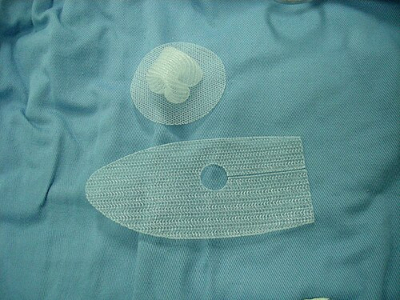
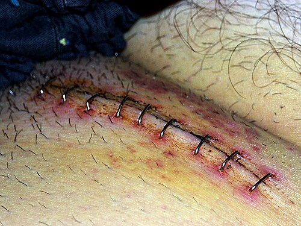

# HÉRNIA INGUINAL: TÉCNICAS DE REPARO (LICHTENSTEIN, TEP, TAPP)

Para entender as técnicas de reparo das hérnias inguinais, você precisa primeiro parar de tentar decorar nomes de cirurgiões e começar a visualizar a anatomia. Se você entender o "buraco" e o que passa por ele, as técnicas de Bassini, McVay ou Lichtenstein deixam de ser uma lista de nomes e passam a ser soluções lógicas para um problema mecânico.

O grande segredo da região inguinal para as provas de residência é o **Orifício Miopectíneo de Fruchaud**. Imagine uma moldura de quadro na parede abdominal profunda. Esse orifício é a fraqueza natural por onde escapam as hérnias indiretas, diretas e femorais. Todas as técnicas modernas, especialmente as que usam tela, visam selar essa moldura.

*Figura 1 - Tela (mesh) de polipropileno utilizada no reparo de hérnia inguinal, material padrão na técnica de Lichtenstein. Fonte: Doctoroftcm, CC BY-SA 3.0 | Wikimedia Commons*

## Anatomia Cirúrgica: O Mapa do Tesouro

Antes de falarmos de bisturi, vamos revisar o que você vai encontrar lá dentro. O canal inguinal é um túnel.

- **Parede Anterior:** Aponeurose do músculo oblíquo externo.

- **Parede Posterior (Onde o problema acontece):** Fáscia transversalis e tendão conjunto.

- **Teto:** Fibras arqueadas do músculo oblíquo interno e transverso.

- **Chão:** Ligamento inguinal (Poupart).

**O divisor de águas: Vasos Epigástricos Inferiores.**
Isso aqui cai em 9 de cada 10 provas.

- Se a hérnia sai **lateral** aos vasos epigástricos inferiores, ela é **Indireta**. Ela entra pelo anel inguinal profundo. É a mais comum em todas as idades e sexos.

- Se a hérnia sai **medial** aos vasos epigástricos inferiores (no Triângulo de Hesselbach), ela é **Direta**. É uma fraqueza adquirida da fáscia transversalis.

**Dica de Prova:** O Triângulo de Hesselbach é delimitado pelos vasos epigástricos inferiores (lateral), borda lateral do músculo reto abdominal (medial) e ligamento inguinal (inferior). Se a questão fala em "defeito na fáscia transversalis", pense em hérnia direta.

## Classificação de Nyhus: A Bíblia das Bancas

Você não pode ir para a prova sem saber Nyhus. As bancas adoram porque é uma forma objetiva de cobrar conduta.

| Classificação | Tipo de Hérnia | Características |
| --- | --- | --- |
| **Tipo I** | Indireta | Anel inguinal profundo normal (comum em crianças) |
| **Tipo II** | Indireta | Anel inguinal profundo dilatado, mas parede posterior preservada |
| **Tipo III** | Defeito na Parede Posterior | A: Direta / B: Indireta (mista/em pantufa) / C: Femoral |
| **Tipo IV** | Recidivante | A: Direta / B: Indireta / C: Femoral / D: Mista |

**Cuidado:** Muitos alunos erram a Nyhus IIIc. Lembre-se: a hérnia femoral é um defeito na parede posterior, por isso é Tipo III. Ela ocorre abaixo do ligamento inguinal, no canal femoral.

*Figura 2 - Incisão cirúrgica na região inguinal após operação de hérnia inguinal, com uso de grampos cirúrgicos. Fonte: Garrondo, CC BY-SA 3.0 | Wikimedia Commons*

## Técnicas Teciduais (Sem Tela): Onde a Tensão Mora

Hoje, o padrão-ouro é o uso de tela (tension-free). Mas as bancas amam cobrar as técnicas clássicas para saber se você conhece a história e a anatomia. O problema dessas técnicas é a **tensão**. Quando você puxa um tecido para o outro com fio, a chance de o ponto "rasgar" ou a dor ser maior é muito alta.

### 1. Técnica de Bassini

É a avó das cirurgias de hérnia. Consiste na sutura do tendão conjunto (músculo oblíquo interno + transverso) ao ligamento inguinal.

- **Por que caiu em desuso?** Gera muita tensão e tem altas taxas de recidiva.

- **Pérola de Prova:** Se a questão falar em "reforço da parede posterior com sutura simples", ela está descrevendo Bassini.

### 2. Técnica de Shouldice

Se você estiver em uma prova e a pergunta for "Qual a melhor técnica tecidual (sem tela)?", a resposta é Shouldice.

- **O que ela faz?** Ela realiza uma imbricação da fáscia transversalis em 4 camadas (ou planos). É como se você fizesse uma "dobradura" na parede posterior para reforçá-la.

- **Vantagem:** Menor taxa de recidiva entre as técnicas sem tela.

### 3. Técnica de McVay

Esta é a única técnica tecidual que trata a **Hérnia Femoral**.

- **O "pulo do gato":** Em vez de suturar no ligamento inguinal (como Bassini), o cirurgião sutura o tendão conjunto no **Ligamento de Cooper** (ligamento pectíneo).

- **Por que isso importa?** O ligamento de Cooper é mais profundo e fecha o canal femoral.

- **Erro clássico:** Achar que McVay é a primeira escolha para todas as hérnias. Não é. Ela gera muita tensão. Use-a em provas para hérnias femorais quando a tela for contraindicada (ex: campo infectado).

## Técnica de Lichtenstein: O Padrão-Ouro Aberto

Se você tiver que aprender apenas uma técnica, que seja esta. O Dr. Will sempre enfatiza: Lichtenstein revolucionou a cirurgia porque introduziu o conceito de **"Tension-free" (Livre de Tensão)**.

**A Lógica:** Em vez de puxar os tecidos com força, nós colocamos uma tela de polipropileno (não absorvível) sobre o defeito. A tela atua como um andaime para o crescimento de tecido fibrótico, reforçando a parede sem puxar nada.

**Passos Críticos para a Prova:**

- **Incisão:** Inguinal oblíqua ou transversa.

- **Abertura da Aponeurose do Oblíquo Externo:** Expondo o canal inguinal.

- **Proteção dos Nervos:** Aqui mora o perigo da dor crônica. Você deve identificar e preservar:

- Nervo Ilioinguinal (passa por cima do cordão).

- Nervo Ilio-hipogástrico.

- Ramo genital do nervo genitofemoral.

- **Tratamento do Saco Herniário:** Se for indireta, o saco é dissecado e ligado (ou invaginado). Se for direta, ele é apenas reduzido.

- **Fixação da Tela:** A tela é suturada no ligamento inguinal (inferiormente) e no tendão conjunto (superiormente).

- **Dica de Ouro:** A tela deve ultrapassar o tubérculo púbico em cerca de 1,5 a 2 cm para evitar recidivas nesse ponto cego.

**Vantagens de Lichtenstein:** Baixa recidiva (<1%), fácil aprendizado, pode ser feita com anestesia local e sedação.

## Reparo Laparoscópico: TAPP e TEP

A laparoscopia ganhou muito espaço, especialmente para dois perfis de pacientes: **Hérnias Bilaterais** e **Hérnias Recidivadas** (quando a primeira cirurgia foi aberta).

A grande vantagem da laparoscopia é a visão posterior. Você enxerga o Orifício de Fruchaud por dentro.

### 1. TAPP (Transabdominal Pre-Peritoneal)

- **Como é feita:** Você entra na cavidade peritoneal (dentro da barriga), corta o peritônio acima da região inguinal, cria um "flap", coloca a tela no espaço pré-peritoneal e depois fecha o peritônio.

- **Vantagem:** Melhor visualização da anatomia e permite diagnosticar hérnias ocultas do outro lado.

- **Desvantagem:** Risco de lesão de vísceras abdominais e formação de aderências (já que você entrou no peritônio).

### 2. TEP (Totally Extra-Peritoneal)

- **Como é feita:** Você não entra na cavidade peritoneal. O cirurgião trabalha apenas no espaço entre o músculo e o peritônio (espaço de Retzius e Bogros).

- **Vantagem:** Não há risco de aderências intra-abdominais.

- **Desvantagem:** Espaço de trabalho reduzido e curva de aprendizado muito mais difícil. Se o peritônio furar, a cirurgia fica tecnicamente muito complexa.

### Anatomia Laparoscópica: Os Triângulos Proibidos

Nas questões de laparoscopia, você PRECISA conhecer os limites para não lesionar estruturas nobres ao fixar a tela (com grampos ou tachas).

- **Triângulo da Desgraça (Doom):**

- Limites: Vasos deferentes (medial) e vasos do cordão espermático (lateral).

- Conteúdo: **Vasos Ilíacos Externos** (Artéria e Veia). Se grampear aqui, o sangramento é catastrófico.

- **Triângulo da Dor:**

- Limites: Trato iliopúbico e vasos do cordão espermático.

- Conteúdo: Nervos (Cutâneo femoral lateral, Ramo femoral do genitofemoral). Se grampear aqui, o paciente terá dor crônica ou parestesia na coxa.

| Característica | TAPP | TEP |
| --- | --- | --- |
| **Acesso** | Transperitoneal | Extraperitoneal |
| **Espaço de trabalho** | Grande | Reduzido |
| **Risco de Aderência** | Sim | Mínimo |
| **Dificuldade Técnica** | Moderada | Alta |
| **Indicação Principal** | Bilateral / Recidiva | Bilateral / Recidiva |

## Complicações: O que tira o sono do cirurgião (e cai na prova)

### 1. Dor Crônica (Inguinodinia)

Definida como dor que persiste por mais de 3 meses após a cirurgia. É a complicação mais comum e incapacitante hoje em dia.

- **Causa:** Lesão nervosa, aprisionamento do nervo por sutura/grampo ou reação inflamatória à tela.

- **Nervo mais lesado na via aberta:** Ilioinguinal.

- **Nervo mais lesado na via laparoscópica:** Cutâneo femoral lateral.

### 2. Orquite Isquêmica

Ocorre por trombose do plexo pampiniforme (veias do cordão).

- **Fator de risco:** Dissecção excessiva de sacos herniários grandes e crônicos (inguinoescrotais).

- **Quadro clínico:** Testículo inchado, doloroso e endurecido após 2-3 dias da cirurgia. Pode evoluir para atrofia testicular.

- **Conduta:** Conservadora (AINEs e suporte). Não costuma precisar de reoperação.

### 3. Seroma e Hematoma

Abaulamentos pós-operatórios comuns.

- **Dica MedEvo:** Se o paciente volta após 1 semana com um "caroço" no local da cirurgia, mas sem sinais inflamatórios, é seroma. Conduta: Expectante. Não puncione pelo risco de infectar a tela!

### 4. Infecção de Sítio Cirúrgico

A cirurgia de hérnia é considerada **Limpa**.

- **Profilaxia ATB:** Segundo a maioria das diretrizes (incluindo a Sociedade Brasileira de Hérnia), não é necessária de rotina em pacientes de baixo risco em hospitais com baixas taxas de infecção. No entanto, em pacientes com tela e múltiplos fatores de risco (DM, obesidade, idosos), pode ser considerada.

## Situações Especiais e Tomada de Decisão

### Hérnia Encarcerada vs. Estrangulada

- **Encarcerada:** Não reduz. Conduta: Tentar redução manual (manobra de Taxe) se não houver sinais de peritonite. Se falhar, cirurgia de urgência.

- **Estrangulada:** Isquemia. Sinais inflamatórios, febre, leucocitose, dor intensa. Conduta: Cirurgia de EMERGÊNCIA.

- **Pérola:** Se houver contaminação (intestino necrosado), **evite o uso de tela** (Lichtenstein). Use uma técnica tecidual (Bassini ou Shouldice) para evitar infecção de corpo estranho.

### Hérnia de Amyand e Hérnia de Garengeot

- **Amyand:** Apêndice cecal dentro do saco herniário **inguinal**.

- **Garengeot:** Apêndice cecal dentro do saco herniário **femoral**.

- Se o apêndice estiver inflamado, você faz a apendicectomia e o reparo da hérnia (geralmente sem tela se houver pus).

### Watchful Waiting (Observação Expectante)

Pode ser feita em homens com hérnias inguinais minimamente sintomáticas ou assintomáticas. O risco de estrangulamento é baixo (~0,2% ao ano). Se os sintomas progredirem, opera-se.

## Resumo das Técnicas por Indicação

- **Hérnia Inguinal Primária Unilateral (Homem):** Lichtenstein (aberta) ou Laparoscopia (se o cirurgião for experiente).

- **Hérnia Bilateral:** Laparoscopia (TAPP ou TEP).

- **Hérnia Recidivada:** Inverter a via. Se foi aberta, faz laparoscopia. Se foi laparoscopia, faz aberta (Lichtenstein).

- **Hérnia Femoral:** McVay (se sem tela) ou Plug/Laparoscopia (com tela).

- **Mulher com Hérnia Inguinal:** Laparoscopia é preferível. Por quê? Porque mulheres têm uma incidência muito maior de hérnia femoral associada (até 40%), que pode passar despercebida na via aberta.

## Pontos-Chave para Prova

- **Hérnia Indireta:** Lateral aos vasos epigástricos inferiores. É a mais comum. Decorre da persistência do conduto peritoneovaginal.

- **Hérnia Direta:** Medial aos vasos epigástricos inferiores. Defeito na fáscia transversalis (Triângulo de Hesselbach).

- **Hérnia Femoral:** Abaixo do ligamento inguinal. Mais comum em mulheres. Alto risco de estrangulamento.

- **Lichtenstein:** Padrão-ouro. Técnica com tela, sem tensão. Fixação no tubérculo púbico é o ponto crítico para evitar recidiva.

- **Shouldice:** Melhor técnica tecidual (sem tela). Imbricação em 4 camadas.

- **McVay:** Técnica que usa o ligamento de Cooper. Indicada para hérnias femorais.

- **TAPP vs TEP:** TAPP entra no peritônio; TEP fica no espaço pré-peritoneal. Ambas são excelentes para bilaterais e recidivas.

- **Triângulo da Desgraça (Laparoscopia):** Vasos ilíacos externos. Fica entre o ducto deferente e os vasos espermáticos.

- **Triângulo da Dor (Laparoscopia):** Nervos (Cutâneo femoral lateral). Fica lateral aos vasos espermáticos.

- **Nervo Ilioinguinal:** O mais comumente lesado na cirurgia aberta (Lichtenstein), causando dor ou dormência na região inguinal e escroto/grandes lábios.

- **Orquite Isquêmica:** Complicação de dissecção agressiva do cordão espermático. Conduta é conservadora.

- **Contraindicação de Tela:** Campos infectados ou estrangulamento com necrose e contaminação grosseira.

- **Hérnia de Amyand:** Apêndice no saco inguinal.

- **Hérnia em Pantufa (Sliding Hernia):** Quando uma víscera (bexiga ou cólon) faz parte da parede do saco herniário. Comum em hérnias indiretas grandes.

- **Recidiva:** Se ocorrer após Lichtenstein, a conduta preferencial é o reparo posterior (laparoscópico). Se ocorrer após laparoscopia, faz-se Lichtenstein.

- **Equimose Escrotal:** Comum no pós-operatório, conduta expectante. Não confundir com orquite isquêmica.

 Cópia offline para consulta pessoal.
 Fonte original:
 [https://www.medevo.com.br/material-apoio/ler/e1153aec-15b9-4554-a7cd-eb84cfa97cc8](https://www.medevo.com.br/material-apoio/ler/e1153aec-15b9-4554-a7cd-eb84cfa97cc8)
