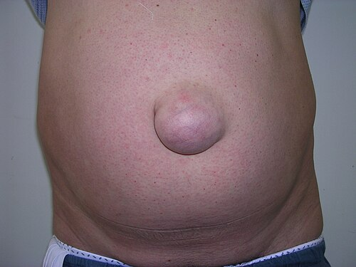
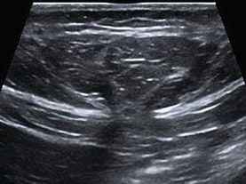

# HÉRNIA UMBILICAL E EPIGÁSTRICA

Para entender as hérnias da linha média, você precisa visualizar a anatomia não como um mapa estático, mas como uma estrutura sob pressão constante. A parede abdominal anterior é um complexo de músculos e aponeuroses que retém as vísceras contra a gravidade e a pressão intra-abdominal. Quando falamos de hérnias umbilicais e epigástricas, estamos falando de falhas especificamente na **linha alba**.

A linha alba é o ponto de encontro das aponeuroses dos músculos retos abdominais. É uma zona relativamente avascular, o que facilita o acesso cirúrgico, mas também a torna suscetível a defeitos. Se você entender que a hérnia é um "buraco" (orifício) por onde passa um "conteúdo" (saco herniário e vísceras), você já sabe metade do que precisa para a prova.

## Anatomia Aplicada e Fisiopatologia: O Porquê do Defeito

Por que as hérnias ocorrem justamente no umbigo ou acima dele?

No caso da **Hérnia Umbilical**, o motivo é embriológico. O anel umbilical é uma cicatriz de uma abertura natural por onde passavam os vasos umbilicais e o úraco. Após o nascimento, esse anel deve fechar. Se ele não fecha completamente ou se a cicatriz é frágil, temos a hérnia.

Já a **Hérnia Epigástrica** ocorre por pequenos defeitos na decussação das fibras da linha alba entre o apêndice xifoide e o umbigo. Imagine a linha alba como uma trama de tecido; em algumas pessoas, essa trama tem "furos" naturais por onde passam pequenos vasos e nervos. Sob pressão, esses furos aumentam e a gordura pré-peritoneal começa a se protruir.

**Cuidado para não confundir:** Muitos alunos acham que a diástase dos retos abdominais é uma hérnia. Não é! Na diástase, há um afastamento dos músculos e um adelgaçamento da linha alba, mas **não existe um orifício herniário**. Por isso, na diástase, você vê um abaulamento difuso quando o paciente faz esforço, mas não consegue palpar um anel delimitado. Guarde isso: diástase não se opera por indicação médica de "risco de complicação", pois não há risco de encarceramento.

*Figura 1 - Hérnia umbilical com protrusão de conteúdo abdominal através do anel umbilical. Na pediatria, a maioria resolve espontaneamente até os 4-5 anos de idade. Fonte: Rocco Cusari, CC BY-SA 2.5 | Wikimedia Commons*

## Hérnia Umbilical na Pediatria: A Arte de Esperar

Este é um dos temas favoritos da Sociedade Brasileira de Pediatria (SBP) e das bancas de residência. O conceito fundamental aqui é a **regressão espontânea**.

Diferente da hérnia inguinal na criança (que é sempre cirúrgica ao diagnóstico devido ao alto risco de encarceramento), a hérnia umbilical pediátrica tem uma história natural de fechamento. Cerca de 80% a 90% das hérnias umbilicais presentes ao nascimento fecharão sozinhas até os 4 ou 5 anos de idade.

### Quando a banca vai te forçar a indicar cirurgia na criança?

Você só vai marcar "cirurgia" para uma criança com hérnia umbilical se:

- O defeito persistir após os 4-5 anos de idade.

- O anel herniário for muito grande (> 2 cm), o que torna o fechamento espontâneo improvável.

- Houver complicação (encarceramento ou estrangulamento) – embora isso seja raro na infância.

- Estiver associada a derivação ventrículo-peritoneal (DVP), pelo risco de o líquor forçar a hérnia.

- Houver "hérnia em tromba" (uma protrusão cutânea muito grande que causa estigma social).

**Dica de Prova:** Se a questão trouxer um lactente de 1 ano com hérnia umbilical redutível, a conduta é **observação e orientação**. Não caia na tentação de operar cedo demais. No MedEvo, sempre reforçamos: na pediatria, o tempo é o melhor cirurgião para o umbigo.

## Hérnia Umbilical no Adulto: O Cenário Muda

No adulto, a história é outra. A hérnia umbilical raramente é congênita; ela é **adquirida**. O anel umbilical, que já era um ponto de fraqueza, cede devido ao aumento crônico da pressão intra-abdominal.

Os grandes vilões aqui são:

- Obesidade (o fator mais comum).

- Gestação (especialmente multíparas).

- Ascite (cirrose é o cenário clássico de prova).

- Atividades físicas pesadas ou tosse crônica (DPOC).

Diferente da criança, a hérnia do adulto **não fecha sozinha**. Pelo contrário, a tendência é aumentar de tamanho e o anel herniário tornar-se fibrótico.

### O Dilema da Tela (Prótese)

Aqui está uma pérola clínica que cai em toda prova de cirurgia: **Quando usar tela na hérnia umbilical?**
Antigamente, fazíamos apenas a sutura simples (técnica de Mayo). Hoje, a recomendação (baseada em diretrizes como a da European Hernia Society, amplamente seguida no Brasil) é:

- **Defeitos < 1 cm:** Pode-se considerar sutura simples (rafia).

- **Defeitos ≥ 1 cm:** O uso de tela é fortemente recomendado para reduzir a taxa de recidiva.

**Erro clássico de prova:** Achar que tela só se usa em hérnia gigante. Na verdade, mesmo em hérnias de 1,5 cm, a tela reduz drasticamente a chance de o paciente voltar com o mesmo problema anos depois.

*Figura 2 - Ultrassonografia abdominal demonstrando hérnia epigástrica na linha média, com protrusão de gordura pré-peritoneal através de defeito na linha alba. Fonte: Bedewi & El-sharkawy, CC BY 3.0 | Wikimedia Commons*

## Hérnia Epigástrica: A Pequena que Dói Muito

A hérnia epigástrica localiza-se na linha média, entre o xifoide e o umbigo. Ela tem algumas peculiaridades que as bancas adoram explorar:

- **Conteúdo:** Frequentemente, o saco herniário contém apenas **gordura pré-peritoneal**. Às vezes, nem existe um saco peritoneal verdadeiro, apenas a gordura se exteriorizando pelo defeito da linha alba.

- **Sintomatologia:** Ela costuma ser muito dolorosa, muitas vezes com uma dor desproporcional ao tamanho do abaulamento. Por que? Porque a gordura pré-peritoneal fica "estrangulada" no pequeno orifício, sofrendo isquemia.

- **Múltiplos defeitos:** Em até 20% dos casos, o paciente tem mais de uma hérnia epigástrica. Por isso, no exame físico e na cirurgia, devemos palpar toda a linha alba.

**Exemplo Clínico:** Paciente masculino, 35 anos, atleta de academia, queixa-se de "um carocinho" doloroso acima do umbigo que aparece quando faz abdominais. Ao exame, você palpa um nódulo de 1 cm, endurecido e muito sensível. Diagnóstico? Hérnia epigástrica com encarceramento de gordura pré-peritoneal.

## Diagnóstico Diferencial: Não é tudo Hérnia

Como professor, vejo muitos alunos errando diagnósticos simples por falta de atenção ao exame físico.

| Condição | Características Clínicas | Conduta |
| --- | --- | --- |
| **Hérnia Epigástrica** | Orifício palpável, dor localizada, abaulamento nítido. | Cirurgia (eletiva). |
| **Diástase dos Retos** | Abaulamento difuso, sem orifício, indolor. | Conservadora (exercícios/fisioterapia). |
| **Lipoma de Linha Alba** | Massa macia, subcutânea, não varia com Valsalva. | Excisão se estético/dor. |
| **Hérnia de Spigel** | Lateral ao reto abdominal (linha semilunar). | Cirurgia (alto risco de encarceramento). |

Lembre-se: o diagnóstico das hérnias de parede abdominal é **essencialmente clínico**. Exames de imagem (Ultrassom ou Tomografia) são reservados para pacientes obesos onde o exame físico é duvidoso ou para suspeita de complicações. Se a questão de prova diz que o diagnóstico é óbvio ao exame físico, não marque "solicitar USG" como próxima conduta. A próxima conduta é o tratamento.

## O Paciente Cirrótico e a Hérnia Umbilical

Este é o "pulo do gato" para provas de alto nível. O paciente com cirrose e ascite descompensada frequentemente desenvolve hérnias umbilicais volumosas.

**O perigo:** A pele sobre a hérnia pode ficar tão fina que ocorre o extravasamento de líquido ascítico (fístula liquórica). Isso é uma porta aberta para a Peritonite Bacteriana Espontânea (PBE) e tem uma mortalidade altíssima.

**A conduta segundo as diretrizes brasileiras:**

- **Primeiro passo:** Compensar a ascite. Diuréticos (Espironolactona/Furosemida), dieta hipossódica e, se necessário, paracentese de alívio.

- **Cirurgia:** Deve ser realizada de forma eletiva após a compensação do quadro clínico.

- **Urgência:** Se houver rotura da pele ou estrangulamento, a cirurgia é imediata.

**Dica do Dr. Will:** Antigamente, evitava-se operar cirróticos pelo risco cirúrgico. Hoje, sabemos que a complicação da hérnia (rotura) mata mais que a cirurgia eletiva bem preparada. Portanto, compensou a ascite? Opera.

## Técnica Cirúrgica e Cuidados Pré-Operatórios

Para a prova de residência, você não precisa ser um cirurgião, mas precisa conhecer os princípios.

### Jejum Pré-Operatório

As diretrizes modernas (ACERTO, por exemplo) preconizam:

- **Líquidos claros (água, chá, suco sem resíduos):** 2 horas de jejum.

- **Refeição leve:** 6 horas.

- **Refeição completa (gordurosa/carne):** 8 horas.
Isso cai muito! O objetivo é reduzir a resistência insulínica e o desconforto do paciente.

### Anestesia

Para hérnias umbilicais pequenas em pacientes magros, a **anestesia local com sedação** é uma excelente opção e muito cobrada como "vantajosa" em provas por reduzir custos e tempo de internação. Para hérnias maiores ou pacientes obesos, prefere-se raquianestesia ou anestesia geral.

### O Uso da Tela

A tela (geralmente de polipropileno) pode ser colocada em diferentes planos:

- **Pré-peritoneal (Sublay):** Entre o peritônio e a musculatura. É a mais fisiológica, pois a pressão intra-abdominal ajuda a manter a tela no lugar.

- **Onlay:** Sobre a aponeurose. Mais fácil de colocar, mas com maior risco de seroma e infecção.

## Complicações: O que define a Urgência?

Você precisa saber diferenciar três estados:

- **Redutível:** O conteúdo entra e sai. Cirurgia eletiva.

- **Encarcerada (Irredutível):** O conteúdo está preso, mas não há sofrimento vascular. O paciente tem dor crônica ou desconforto, mas sem sinais sistêmicos. Cirurgia eletiva (com prioridade).

- **Estrangulada:** Há isquemia do conteúdo (geralmente omento ou alça intestinal). Dor súbita, intensa, sinais inflamatórios locais (calor, rubor), febre e leucocitose. **Urgência cirúrgica imediata!**

**Pegadinha de Prova:** A "Hérnia de Richter". É quando apenas uma parte da borda antimesentérica da alça intestinal fica presa no orifício. O paciente pode ter estrangulamento da parede da alça sem ter obstrução intestinal completa. É traiçoeiro!

## Avaliação Pré-Operatória em Mulheres

Sempre que a banca colocar uma "mulher em idade fértil" para uma cirurgia eletiva de hérnia, procure a alternativa que menciona o **teste de gravidez (Beta-HCG)**. É obrigatório para evitar riscos anestésicos fetais inadvertidos. Além disso, se ela estiver grávida, a cirurgia de hérnia umbilical deve ser adiada para o pós-parto, a menos que haja estrangulamento.

## Tabelas de Consulta Rápida

### Tabela 1: Hérnia Umbilical Pediátrica vs. Adulto

| Característica | Pediátrica | Adulto |
| --- | --- | --- |
| **Etiologia** | Congênita (falha no fechamento) | Adquirida (pressão intra-abdominal) |
| **Conduta Inicial** | Observação até 4-5 anos | Cirurgia (na maioria dos casos) |
| **Uso de Tela** | Excepcional | Padrão se orifício > 1 cm |
| **Risco de Encarceramento** | Baixo | Moderado/Alto |

### Tabela 2: Classificação de Risco e Conduta (ASA)

| ASA | Descrição | Conduta na Hérnia Eletiva |
| --- | --- | --- |
| **ASA I** | Saudável | Liberado para cirurgia |
| **ASA II** | Doença sistêmica leve (ex: HAS controlada) | Liberado, otimizar medicações |
| **ASA III** | Doença sistêmica grave (ex: DM mal controlado) | Requer compensação rigorosa antes |
| **ASA IV** | Doença com risco de morte constante | Apenas se urgência (estrangulamento) |

## Pontos-Chave para Prova

- **Diagnóstico:** É clínico. Abaulamento que piora ao Valsalva. Imagem é exceção.

- **Hérnia Umbilical Pediátrica:** Esperar até 4-5 anos. Se anel > 2 cm, a chance de fechar sozinha é mínima.

- **Hérnia Epigástrica:** Mais comum em homens. Frequentemente contém apenas gordura pré-peritoneal.

- **Diástase de Retos:** Não é hérnia verdadeira. Não tem risco de encarceramento. Tratamento é conservador/estético.

- **Indicação de Tela:** No adulto, se o orifício for ≥ 1 cm (ou 2-3 cm dependendo da referência mais conservadora, mas 1 cm é o marco atual para reduzir recidiva).

- **Jejum:** 2 horas para líquidos claros em pacientes hígidos.

- **Cirrótico com Ascite:** Nunca opere com ascite tensa. Primeiro compense a ascite com diuréticos e dieta.

- **Sinal de Alerta:** Hérnia irredutível com hiperemia cutânea e dor intensa = Estrangulamento = Sala de cirurgia agora!

- **Anestesia Local:** Ótima para pacientes magros com hérnias pequenas e redutíveis.

- **Hérnia de Richter:** Estrangulamento de parte da circunferência da alça; pode não cursar com obstrução intestinal.

- **Fatores de Risco:** Obesidade, multiparidade, ascite e DPOC (aumento da pressão intra-abdominal).

- **Recidiva:** O uso de tela é o principal fator que reduz a taxa de retorno da hérnia.

- **Mulher Jovem:** Sempre pedir Beta-HCG antes da cirurgia eletiva.

- **Localização:** Epigástrica (entre xifoide e umbigo), Umbilical (no umbigo), Spigel (borda lateral do reto abdominal).

Ao revisar este material, foque em entender que a cirurgia de parede abdominal evoluiu da simples "costura" para o reforço com próteses, sempre respeitando a fisiologia da pressão abdominal. Se você dominar a diferença de conduta entre a criança e o adulto, e souber manejar o paciente cirrótico, você acertará 90% das questões sobre este tema. 💡

 Cópia offline para consulta pessoal.
 Fonte original:
 [https://www.medevo.com.br/material-apoio/ler/1fe807c1-ce4a-4288-9718-d3666f80d09e](https://www.medevo.com.br/material-apoio/ler/1fe807c1-ce4a-4288-9718-d3666f80d09e)
