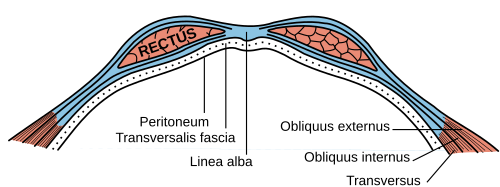
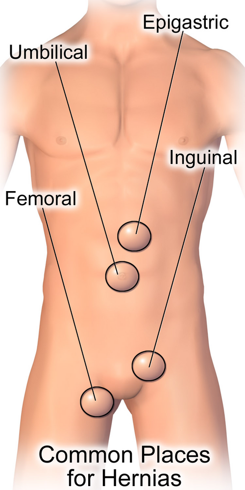

# HÉRNIAS: CONCEITOS, CLASSIFICAÇÃO E DIAGNÓSTICO

Para entender hérnias, você não precisa decorar nomes de técnicas cirúrgicas complexas logo de cara. Você precisa entender a **mecânica da parede abdominal**. Pense na parede abdominal como um pneu: se a borracha (aponeurose/músculo) enfraquece ou tem um furo, a câmara de ar (peritônio e vísceras) protrui.

Uma hérnia é, por definição, a protrusão de um órgão ou estrutura através de um defeito na parede que o contém. Nas provas de residência, o foco não é apenas saber que a hérnia existe, mas entender por que ela está ali, qual o risco de ela "prender" (encarcerar) e como diferenciá-la de outras massas inguinais.

*Figura 1 - Diagrama da bainha do músculo reto abdominal acima da linha arqueada, demonstrando as camadas da parede abdominal envolvidas na formação de hérnias. Fonte: Henry Vandyke Carter, Domínio Público | Wikimedia Commons*

## Epidemiologia e Fisiopatologia: O Porquê do Defeito

As hérnias da parede abdominal atingem cerca de 5% da população mundial. Se você estiver no seu plantão de cirurgia geral, as hérnias inguinais representarão cerca de 75% dos seus casos.

**Dica de Prova:** A hérnia inguinal é a mais comum em **ambos os sexos**. Cuidado com a pegadinha clássica: a hérnia femoral (ou crural) é muito mais comum em mulheres do que em homens, mas, mesmo nas mulheres, a hérnia inguinal ainda é a campeã de frequência absoluta.

### O papel do colágeno

Por que algumas pessoas têm hérnia e outras não, mesmo fazendo o mesmo esforço físico? A resposta está na biologia molecular. Pacientes com hérnias apresentam uma alteração na proporção de colágeno: há uma redução do colágeno tipo I (mais forte e maduro) e um aumento do colágeno tipo III (mais fraco e imaturo). Além disso, há uma desorganização das fibras de hidroxiprolina.

Isso explica por que o tabagismo é um fator de risco tão importante: o fumo aumenta a atividade de elastases e metaloproteinases, que degradam a matriz extracelular da parede abdominal. Como o Dr. Will sempre reforça nas discussões do MedEvo, a hérnia não é apenas um "buraco", é uma doença do metabolismo do tecido conjuntivo.

### Fatores de aumento da pressão intra-abdominal

A parede enfraquecida é o "combustível", mas o aumento da pressão é a "faísca". Fique atento a históricos de:

- Tosse crônica (DPOC);

- Constipação intestinal (esforço evacuatório);

- Prostatismo/HPB (esforço miccional);

- Ascite;

- Gestação;

- Grandes esforços físicos repetitivos.

## Anatomia do Canal Inguinal: O GPS do Cirurgião

Se você não dominar a anatomia do canal inguinal, você vai errar todas as questões de classificação e de técnica cirúrgica. O canal inguinal é um trajeto oblíquo que atravessa a parede abdominal.

### As Paredes do Canal

- **Anterior:** Aponeurose do músculo oblíquo externo.

- **Posterior:** Fáscia transversalis (é aqui que o defeito acontece nas hérnias diretas!).

- **Teto:** Fibras arqueadas dos músculos oblíquo interno e transverso (o famoso tendão conjunto).

- **Chão:** Ligamento inguinal (ligamento de Poupart).

### O Marco Anatômico de Ouro: Vasos Epigástricos Inferiores

Este é o conceito mais importante desta aula. Os vasos epigástricos inferiores dividem as hérnias inguinais em duas categorias:

- **Hérnia Inguinal Indireta:** Ocorre **lateralmente** aos vasos epigástricos inferiores. Ela sai pelo anel inguinal profundo (um defeito congênito por falha no fechamento do conduto peritoneovaginal).

- **Hérnia Inguinal Direta:** Ocorre **medialmente** aos vasos epigástricos inferiores. Ela "empurra" a parede posterior (fáscia transversalis) dentro do Triângulo de Hesselbach.

**Triângulo de Hesselbach:**

- Limite Lateral: Vasos epigástricos inferiores.

- Limite Medial: Borda lateral do músculo reto abdominal.

- Limite Inferior: Ligamento inguinal.

**Erro comum de prova:** Achar que a hérnia indireta é "por esforço". Na verdade, a indireta é predominantemente congênita (persistência do conduto peritoneovaginal), enquanto a direta é adquirida (fraqueza da fáscia transversalis com a idade).

*Figura 2 - Ilustração dos sítios mais comuns de hérnias da parede abdominal, incluindo inguinal, femoral, umbilical e incisional. Fonte: BruceBlaus, CC BY-SA 4.0 | Wikimedia Commons*

## Classificação de Nyhus: O que a Banca quer de você

A classificação de Nyhus é a mais cobrada em provas brasileiras. Ela não avalia apenas a localização, mas a integridade da parede posterior e do anel inguinal profundo.

| Tipo | Descrição | Localização em relação aos vasos epigástricos |
| --- | --- | --- |
| **I** | Indireta com anel inguinal profundo normal (comum em crianças) | Lateral |
| **II** | Indireta com anel inguinal profundo dilatado, mas parede posterior preservada | Lateral |
| **III A** | Direta (defeito na parede posterior) | Medial |
| **III B** | Indireta com destruição da parede posterior (hérnia mista ou por deslizamento) | Lateral |
| **III C** | Femoral (ou Crural) | Abaixo do ligamento inguinal |
| **IV** | Recidivada (A: direta; B: indireta; C: femoral; D: mista) | Variável |

**Pérola Clínica:** A hérnia de Pantaloon (ou em calça) é quando o paciente tem uma hérnia direta e uma indireta simultaneamente, "cavalgando" os vasos epigástricos inferiores. Na classificação de Nyhus, ela entra como III B.

## Diagnóstico: A Soberania do Exame Físico

O diagnóstico da hérnia inguinal é eminentemente **clínico**. Se a questão de prova descreve um abaulamento que surge ao esforço e reduz ao repouso, você já tem o diagnóstico.

### Manobras de Exame Físico

- **Manobra de Valsalva:** Peça ao paciente para tossir ou fazer força. O aumento da pressão intra-abdominal torna a hérnia evidente.

- **Manobra de Landivar:** Você comprime o anel inguinal profundo (cerca de 2 cm acima do ponto médio entre a sínfise púbica e a espinha ilíaca anterossuperior) e pede para o paciente tossir.

- Se a hérnia **não** aparecer: É uma hérnia indireta (você bloqueou a saída dela pelo anel).

- Se a hérnia **aparecer**: É uma hérnia direta (ela sai medialmente ao seu dedo, pelo triângulo de Hesselbach).

- **Toque pelo canal inguinal:** Introduza o dedo pelo escroto até o anel inguinal externo.

- Hérnia que toca a **ponta** do dedo: Indireta.

- Hérnia que toca a **polpa** do dedo: Direta.

### Quando pedir exames de imagem?

Você só pede imagem se houver dúvida diagnóstica (ex: dor inguinal sem abaulamento visível).

- **Ultrassonografia (USG):** É o primeiro exame. Bom para diferenciar hérnia de linfonodomegalias ou hidrocele. Sensibilidade de ~86%.

- **Ressonância Magnética (RM):** É o padrão-ouro para casos complexos ou "hérnia do esportista" (pubalgia), sendo superior à TC na diferenciação de tecidos moles.

- **Tomografia (TC):** Excelente para hérnias complicadas (encarceradas/estranguladas) ou hérnias raras (obturadora, Spiegel).

## Diagnóstico Diferencial: Nem tudo que protrui é hérnia

Imagine um paciente de 40 anos com uma massa indolor na região inguinal. Antes de marcar "cirurgia", considere:

- **Linfonodomegalia:** Geralmente múltiplos nódulos, não reduzíveis.

- **Hidrocele:** Transiluminação positiva (a luz atravessa o escroto).

- **Varicocele:** "Saco de vermes" à palpação, piora em pé.

- **Aneurisma de artéria femoral:** Massa pulsátil e com sopro.

- **Criptorquidia:** Ausência de testículo na bolsa escrotal.

## Hérnias com Epônimos: O Terror das Provas

As bancas adoram nomes próprios. Você precisa memorizar estes quatro, pois eles aparecem com frequência em questões de "assinale a alternativa correta":

- **Hérnia de Amyand:** O conteúdo do saco herniário (geralmente inguinal) é o **apêndice cecal**. Pode estar inflamado ou não.

- **Hérnia de Garangeot:** É o apêndice cecal dentro de uma **hérnia femoral**. (Dica: Garangeot = Femoral; Amyand = Inguinal).

- **Hérnia de Littré:** O conteúdo do saco herniário é um **Divertículo de Meckel**.

- **Hérnia de Richter:** É a pinçamento da **borda antimesentérica** da alça intestinal.

- **Por que isso cai?** Porque ela pode sofrer isquemia e perfurar **sem** causar obstrução intestinal completa, já que o lúmen não está totalmente bloqueado. É traiçoeira!

## Complicações: Encarceramento vs. Estrangulamento

Esta distinção define se o seu paciente vai para casa ou para o centro cirúrgico agora.

- **Hérnia Encarcerada:** A hérnia não reduz (não volta para dentro), mas a vascularização está preservada. O paciente tem dor e abaulamento fixo.

- **Hérnia Estrangulada:** Há comprometimento vascular (isquemia).

- **Sinais de alerta:** Dor intensa, vermelhidão local (flogose), febre, leucocitose e sinais de obstrução intestinal (vômitos, parada de eliminação de gases e fezes).

- **Conduta:** Urgência cirúrgica. **Nunca** tente reduzir uma hérnia com sinais de estrangulamento, pois você pode reduzir uma alça necrótica para dentro da cavidade, causando peritonite generalizada.

## Hérnias Especiais e Localizações Raras

### Hérnia Femoral (Crural)

Ocorre através do canal femoral, medialmente à veia femoral e abaixo do ligamento inguinal.

- **Perfil:** Mulheres idosas e multíparas.

- **Risco:** É a hérnia com **maior taxa de estrangulamento** (até 40%), pois o anel femoral é rígido e estreito. Por isso, o tratamento da hérnia femoral é **sempre cirúrgico**, mesmo se assintomática.

### Hérnia de Spiegel

Ocorre na "Linha Semilunar", entre a borda lateral do músculo reto abdominal e a linha semilunar de Spiegel, geralmente abaixo da linha arqueada de Douglas. Ela é uma hérnia **interparietal** (fica entre as camadas musculares), o que torna o diagnóstico clínico difícil, pois o abaulamento pode ser sutil.

### Hérnia Obturadora

Rara, ocorre pelo canal obturador. Típica de mulheres idosas e muito magras ("velhinhas magrinhas").

- **Sinal de Howship-Romberg:** Dor na face interna da coxa que piora com a abdução e rotação interna da perna, causada pela compressão do nervo obturador.

### Hérnia de Petit e Grynfelt (Lombares)

- **Petit:** Triângulo lombar inferior (limites: crista ilíaca, m. grande dorsal e m. oblíquo externo).

- **Grynfelt:** Triângulo lombar superior (abaixo da 12ª costela). É a mais comum das lombares.

## Princípios de Tratamento: Quando e Como Operar?

Agora que você diagnosticou, o que fazer?

### Conduta Expectante (Watchful Waiting)

Pode ser adotada em homens com hérnias inguinais **assintomáticas** ou minimamente sintomáticas. Estudos mostram que o risco de estrangulamento nesses casos é muito baixo (< 0,2% ao ano). No entanto, a maioria desses pacientes acabará operando em 5 a 10 anos devido ao surgimento de sintomas.

- **Atenção:** Mulheres com hérnia inguinal devem ser operadas (maior risco de ser, na verdade, uma femoral).

### Técnicas Cirúrgicas

O padrão-ouro atual é o reparo **sem tensão** com uso de **tela (prótese)**. A tela reduziu drasticamente as taxas de recidiva.

- **Lichtenstein (Aberta):** É a técnica mais realizada. Coloca-se uma tela sobre a fáscia transversalis, reforçando a parede posterior. É a "queridinha" das provas para hérnias unilaterais primárias em homens.

- **McVay:** É a técnica clássica para **hérnia femoral** (quando não se usa tela), pois sutura o tendão conjunto ao ligamento de Cooper, fechando o anel femoral.

- **Shouldice:** Técnica tecidual (sem tela) com imbricação de camadas. Tem os melhores resultados entre as técnicas sem tela, mas é difícil de executar.

- **Laparoscopia (TAPP ou TEP):**

- **TAPP (Transabdominal Pré-Peritoneal):** Entra na cavidade peritoneal.

- **TEP (Totalmente Extraperitoneal):** Não entra na cavidade peritoneal.

- **Indicações ideais:** Hérnias bilaterais e hérnias recidivadas (pois você evita a cicatriz da cirurgia anterior).

### Hérnia Incisional e Perda de Domínio

Hérnias que surgem em cicatrizes cirúrgicas prévias. Quando o volume do saco herniário é muito grande em relação ao volume da cavidade abdominal (> 20-25%), chamamos de **perda de domínio**. Nesses casos, não se pode simplesmente "empurrar" tudo para dentro, pois isso causaria Síndrome Compartimental Abdominal. É necessário preparo pré-operatório (ex: pneumoperitônio progressivo ou toxina botulínica na musculatura lateral).

## Tabelas Comparativas para Fixação

### Tabela 1: Hérnia Direta vs. Indireta

| Característica | Hérnia Indireta | Hérnia Direta |
| --- | --- | --- |
| **Frequência** | Mais comum (70%) | Menos comum (30%) |
| **Origem** | Congênita (Conduto Peritoneovaginal) | Adquirida (Fraqueza da Fáscia) |
| **Relação Vasos Epigástricos** | Lateral | Medial |
| **Local de Saída** | Anel Inguinal Profundo | Triângulo de Hesselbach |
| **Encarceramento** | Mais comum | Menos comum |
| **Toque no Canal** | Ponta do dedo | Polpa do dedo |

### Tabela 2: Diagnóstico Diferencial de Massa Inguinal

| Diagnóstico | Características Clínicas |
| --- | --- |
| **Hérnia Inguinal** | Redutível, Valsalva positiva, acima do ligamento inguinal |
| **Hérnia Femoral** | Abaixo do ligamento inguinal, mais comum em mulheres idosas |
| **Linfonodomegalia** | Irredutível, geralmente dolorosa se inflamatória, consistência firme |
| **Hidrocele** | Transiluminação positiva, não reduz, envolve o testículo |
| **Varicocele** | "Saco de vermes", piora com ortostatismo, geralmente à esquerda |

### Tabela 3: Epônimos Essenciais

| Epônimo | Conteúdo / Localização |
| --- | --- |
| **Amyand** | Apêndice no saco inguinal |
| **Garangeot** | Apêndice no saco femoral |
| **Littré** | Divertículo de Meckel |
| **Richter** | Pinçamento da borda antimesentérica (isquemia sem obstrução) |
| **Pantaloon** | Mista (Direta + Indireta simultâneas) |
| **Spiegel** | Linha semilunar (borda do reto abdominal) |

## Situações Especiais e Manejo

### Hérnia por Deslizamento

Ocorre quando uma víscera retroperitoneal (cólon ascendente, descendente ou bexiga) forma parte da parede do saco herniário.

- **Cuidado Cirúrgico:** Se o cirurgião não perceber e abrir o saco herniário de forma inadvertida, ele pode cortar diretamente a parede do cólon ou da bexiga.

### Antibioticoprofilaxia

Em herniorrafias eletivas (cirurgia limpa), a recomendação da diretriz brasileira e do Dr. Will é:

- **Sem tela:** Não precisa de antibiótico.

- **Com tela:** Recomenda-se cefazolina 1g ou 2g (dose única na indução) para reduzir o risco de Infecção de Sítio Cirúrgico (ISC), especialmente em pacientes com fatores de risco (ASA ≥ 3, DM descompensada, obesidade).

### Complicações Pós-Operatórias

A complicação crônica mais comum e temida é a **dor crônica (inguinodinia)**, definida como dor persistente por mais de 3 meses. Pode ser causada por aprisionamento nervoso (nervos ilioinguinal, ilio-hipogástrico ou ramo genital do genitofemoral) ou reação inflamatória à tela.

## Pontos-Chave para Prova

- **Hérnia mais comum em todos:** Inguinal Indireta.

- **Hérnia com maior risco de estrangulamento:** Femoral (Crural).

- **Hérnia Indireta:** Lateral aos vasos epigástricos inferiores; falha no conduto peritoneovaginal.

- **Hérnia Direta:** Medial aos vasos epigástricos inferiores; defeito no Triângulo de Hesselbach (fáscia transversalis).

- **Nyhus Tipo III:** A = Direta; B = Indireta com destruição da parede posterior; C = Femoral.

- **Hérnia de Richter:** Isquemia da borda antimesentérica sem obstrução total (pegadinha clássica!).

- **Hérnia de Amyand:** Apêndice no saco inguinal.

- **Sinal de Howship-Romberg:** Sugestivo de Hérnia Obturadora (dor na face interna da coxa).

- **Conduta em Homem Assintomático:** Observação (Watchful Waiting) é segura.

- **Conduta em Mulher:** Sempre cirurgia (pelo risco de ser hérnia femoral oculta).

- **Técnica de McVay:** Clássica para hérnia femoral (usa o ligamento de Cooper).

- **Laparoscopia:** Preferencial para hérnias bilaterais e recidivadas.

- **Hérnia Encarcerada com sinais inflamatórios (febre, vermelhidão):** Estrangulamento. **Contraindicação absoluta** de tentativa de redução manual.

- **Hérnia de Spiegel:** Localizada na linha semilunar, lateral ao músculo reto abdominal.

- **Hérnia de Pantaloon:** Hérnia mista (componente direto e indireto juntos). 🛡️

 Cópia offline para consulta pessoal.
 Fonte original:
 [https://www.medevo.com.br/material-apoio/ler/54c7aa0a-c9ae-4520-b3d7-b02ad05a93fc](https://www.medevo.com.br/material-apoio/ler/54c7aa0a-c9ae-4520-b3d7-b02ad05a93fc)
