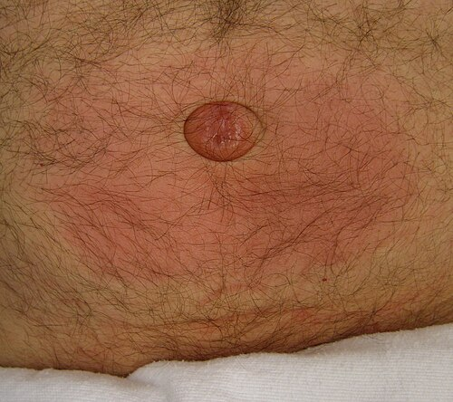

# HÉRNIAS E MASSAS ABDOMINAIS

Para entender a cirurgia pediátrica, você precisa virar uma chave na sua cabeça: a criança não é um "adulto pequeno". Nas hérnias, isso é ainda mais verdadeiro. Enquanto no adulto as hérnias costumam ser resultado de fraqueza muscular (esforço, idade, tabagismo), na criança o buraco é mais embaixo — ou melhor, o buraco é o caminho que não fechou. Estamos falando de defeitos congênitos.

*Figura 1 - Hérnia umbilical com protrusão do conteúdo abdominal através do anel umbilical, defeito congênito frequente na população pediátrica. Fonte: James Heilman, MD, CC BY-SA 4.0 | Wikimedia Commons*

## Hérnia Inguinal Pediátrica: O Defeito do Conduto

A imensa maioria das hérnias inguinais na criança é do tipo **indireta**. Por que? Porque a fisiopatologia reside na persistência do **processo (ou conduto) peritônio-vaginal**.

Durante a vida fetal, o testículo desce do abdome para o escroto guiado pelo gubernáculo, levando consigo um "dedo de luva" do peritônio. Normalmente, esse conduto se oblitera após a descida. Se ele permanecer aberto (patente), temos o caminho livre para a passagem de conteúdo abdominal.

### Epidemiologia e Fatores de Risco

A incidência é maior em meninos (proporção de até 6:1) e o lado **direito** é o mais afetado (cerca de 60% das vezes), pois o testículo direito desce mais tardiamente que o esquerdo. Em 10-15% dos casos, a apresentação é bilateral.

Aqui vai a primeira dica de ouro para sua prova: **prematuridade**. Quanto mais prematuro o bebê, maior a chance de o conduto ainda estar aberto. O risco de encarceramento em prematuros é altíssimo, o que nos obriga a uma conduta mais assertiva.

### Diagnóstico: A Clínica é Soberana

Você não precisa de ultrassom para diagnosticar uma hérnia inguinal na criança. O diagnóstico é **clínico**.

- **História:** A mãe relata um abaulamento na região inguinal que aparece quando a criança chora, tosse ou faz esforço, e que desaparece durante o sono ou repouso.

- **Exame Físico:** Se a hérnia não estiver visível, podemos tentar manobras que aumentem a pressão intra-abdominal.

- **Sinal da Seda (Silk Sign):** Ao palpar o cordão espermático sobre o púbis, você sente as duas camadas do saco herniário deslizando uma sobre a outra, como se estivesse esfregando dois pedaços de seda. Isso é patognomônico da persistência do processo vaginal.

**Cuidado com a pegadinha:** Se a questão trouxer um abaulamento que **não** reduz e que tem transiluminação positiva, estamos falando de hidrocele, não de hérnia. Mas atenção: se o volume da hidrocele varia (acorda pequeno e aumenta ao longo do dia), ela é uma **hidrocele comunicante**, e o tratamento é o mesmo da hérnia, pois o conduto está aberto.

### Classificação de Nyhus na Infância

Embora a classificação de Nyhus seja muito usada para adultos, as bancas adoram perguntar qual o tipo mais comum na criança.

- **Nyhus Tipo I:** Hérnia inguinal indireta com anel inguinal interno (profundo) de diâmetro normal. É a clássica da infância.

### Tratamento: Quando Operar?

Diferente da hérnia umbilical, a hérnia inguinal na criança **nunca regride espontaneamente**.

- **Regra Geral:** Diagnosticou, operou. A cirurgia deve ser eletiva, mas precoce, pelo risco de encarceramento.

- **No Recém-Nascido (RN):** Se o bebê está internado (especialmente se for prematuro), operamos antes da alta hospitalar. O risco de encarceramento em RNs chega a 30%.

- **Técnica:** Realizamos a **herniorrafia inguinal sem tela**. Fazemos a ligadura alta do saco herniário (ressecção do conduto patente). Não se usa tela em crianças porque elas ainda vão crescer e o defeito não é fraqueza da parede, mas sim a patência do conduto.

### Complicações: O Encarceramento

O encarceramento ocorre quando o conteúdo (geralmente alça intestinal ou ovário em meninas) fica preso no saco herniário.

- **Quadro Clínico:** Massa tensa, dolorosa, irredutível, choro inconsolável e, por vezes, sinais de obstrução intestinal (vômitos, distensão).

- **Conduta na Hérnia Encarcerada:** Se não houver sinais de estrangulamento (isquemia, febre, hiperemia local, leucocitose), tentamos a **redução manual**. Podemos usar sedação leve e colocar a criança em posição de Trendelenburg.

- **Por que reduzir antes de operar?** Porque o edema local dificulta a cirurgia e aumenta o risco de lesão das estruturas do cordão espermático. Se reduzir, aguardamos 24-48h para o edema diminuir e operamos eletivamente.

- **Hérnia Estrangulada:** Se houver sinais de sofrimento vascular, a redução manual é **contraindicada**. A cirurgia é de urgência imediata.

| Característica | Hérnia Inguinal | Hidrocele Não Comunicante | Hidrocele Comunicante |
| --- | --- | --- | --- |
| **Abaulamento** | Inguinal/Escrotal | Escrotal | Escrotal |
| **Relação com Esforço** | Sim (aumenta com choro) | Não | Sim (varia durante o dia) |
| **Transiluminação** | Negativa | Positiva | Positiva |
| **Conduta** | Cirurgia sempre | Observar até 1-2 anos | Cirurgia (igual à hérnia) |

## Hérnia Umbilical: A Arte de Esperar

Aqui o cenário muda completamente. A hérnia umbilical é extremamente comum, especialmente em crianças negras e prematuras. Ela ocorre por uma falha no fechamento do anel umbilical após a queda do coto.

### História Natural

A grande notícia é que a maioria das hérnias umbilicais fecha **espontaneamente**. O anel umbilical tende a se contrair e fechar nos primeiros anos de vida.

### Indicações Cirúrgicas (Grave isso!)

Você não vai operar toda hérnia umbilical que vir pela frente. Segundo a Sociedade Brasileira de Pediatria e as principais diretrizes, operamos se:

- Persistência após os **4 a 5 anos** de idade (algumas bancas ainda usam 2 anos, mas a tendência moderna é esperar mais).

- Defeitos muito grandes (anel herniário > 2 cm), que dificilmente fecharão sozinhos.

- Presença de complicações (raras, mas ocorrem), como encarceramento ou estrangulamento.

- Hérnia "em tromba" (pele redundante que causa desconforto estético/social).

- Associação com derivação ventrículo-peritoneal (DVP).

**Erro clássico de prova:** Achar que toda hérnia umbilical em lactente é cirúrgica. Se a criança tem 1 ano, a hérnia é redutível e pequena, a conduta é **observação e orientação**.

## Criptorquidia e Testículo Não Descido

Este tema é o "queridinho" das provas de residência. O testículo precisa estar na bolsa escrotal para manter uma temperatura 1 a 2 graus abaixo da temperatura corporal. Se ele fica "escondido", a espermatogênese sofre e o risco de malignização aumenta.

### Definições Importantes

- **Criptorquidia:** Testículo que não completou sua descida normal, mas está no trajeto fisiológico.

- **Testículo Ectópico:** Testículo fora do trajeto normal de descida (ex: região femoral, perineal).

- **Testículo Retrátil:** Aquele que sobe devido ao reflexo cremastérico exagerado, mas que, ao ser manipulado, desce para a bolsa e **lá permanece** sem tensão. Isso é variante da normalidade e não requer cirurgia.

### Diagnóstico e Exame Físico

O exame deve ser feito com a criança relaxada, preferencialmente em posição de "alfaiate" (pernas cruzadas). Se o testículo não for palpado na bolsa, procure no canal inguinal.

- **Sinal do Testículo Não Palpável:** Se você não palpa o testículo mesmo após manobras, o próximo passo não é o ultrassom (que tem baixa sensibilidade aqui), mas sim a **laparoscopia diagnóstica**.

### O "Vanishing Testis" (Testículo Evanescente)

Durante a laparoscopia, se você encontrar os vasos espermáticos e o ducto deferente terminando em "fundo cego" dentro do abdome ou no canal inguinal, o diagnóstico é de testículo vanishing. Isso provavelmente ocorreu por uma torção testicular intrauterina. Não há o que fazer além de documentar.

### Tratamento: O "Timing" é Tudo

A conduta mudou nos últimos anos. Antigamente esperava-se até os 2 anos. Hoje, a recomendação é clara:

- **Aguardar até os 6 meses de vida:** O testículo ainda pode descer espontaneamente até essa idade.

- **Cirurgia (Orquidopexia):** Deve ser realizada idealmente entre **6 e 12 meses**, não ultrapassando os 18 meses.

- **Por que operar cedo?** Para preservar a fertilidade e permitir a palpação do testículo (rastreio de câncer). Lembre-se: a cirurgia **não reduz** o risco de câncer para o nível da população geral, mas facilita o diagnóstico precoce. O risco de seminoma é maior em testículos intra-abdominais.

**Dica do Dr. Will:** Se a criança tem Criptorquidia + Hérnia Inguinal, você não espera os 6 meses. Opera as duas condições no momento do diagnóstico da hérnia.

## Defeitos da Parede Abdominal: Gastrosquise vs. Onfalocele

Aqui o diagnóstico é visual, muitas vezes feito no pré-natal (ultrassom).

### Gastrosquise

- **Onde é o defeito?** À direita do cordão umbilical (que está inserido normalmente).

- **Tem saco?** Não. As alças intestinais estão "soltas" e expostas ao líquido amniótico, o que causa uma reação inflamatória (alças espessadas, com fibrina).

- **Associações:** Geralmente é um defeito isolado, mas pode haver atresia intestinal associada.

### Onfalocele

- **Onde é o defeito?** Central, no anel umbilical. O cordão umbilical insere-se no ápice do saco.

- **Tem saco?** Sim. As vísceras (intestino e muitas vezes o fígado) estão protegidas por uma membrana (peritônio e amnio).

- **Associações:** Frequentemente associada a síndromes genéticas (Trissomia 13, 18, 21) e à Síndrome de Beckwith-Wiedemann (macroglossia, gigantismo, onfalocele).

| Característica | Gastrosquise | Onfalocele |
| --- | --- | --- |
| **Localização** | À direita do cordão | Central (umbilical) |
| **Membrana Protetora** | Ausente | Presente |
| **Fígado Exposto** | Raro | Frequente |
| **Malformações Associadas** | Raras (exceto atresia) | Frequentes (cardíacas, genéticas) |
| **Estado das Alças** | Inflamadas/Edemaciadas | Normais (protegidas pelo saco) |

## Estenose Hipertrófica de Piloro (EHP)

Imagine um lactente de 3 a 6 semanas de vida que começa com vômitos. Mas não são vômitos comuns.

### O Quadro Clássico

- **Vômitos não biliosos:** O bloqueio é no piloro (antes da ampola de Vater).

- **Vômitos em jato:** Ocorrem logo após as mamadas.

- **Criança "faminta":** Após vomitar, o bebê quer mamar novamente.

- **Distúrbio Hidroeletrolítico:** A perda de H+ e Cl- no vômito leva à clássica **Alcalose Metabólica Hipoclorêmica e Hipocalêmica**.

### Exame Físico e Diagnóstico

- **Oliva Pilórica:** Uma massa palpável no hipocôndrio direito/epigástrio. É difícil de palpar, mas se cair na prova, marque!

- **Ondas de Kussmaul:** Ondas peristálticas visíveis no abdome tentando vencer a obstrução.

- **Exame de Imagem:** O padrão-ouro é o **Ultrassom**. Critérios: espessura do músculo pilórico > 3-4 mm e comprimento do canal pilórico > 14-17 mm.

### Tratamento

A EHP não é uma emergência cirúrgica, mas sim uma **emergência metabólica**.

- Primeiro: Estabilizar o paciente, corrigir a desidratação e a alcalose.

- Segundo: Cirurgia (**Piloromiotomia a Fredet-Ramstedt**). É uma cirurgia simples onde se corta a musculatura do piloro, preservando a mucosa.

## Escroto Agudo: O Terror do Plantão

Quando um menino chega com dor escrotal súbita, seu cérebro deve processar três diagnósticos principais:

### 1. Torção de Testículo

- **Idade:** Pico na puberdade (mas pode ocorrer em qualquer idade).

- **Clínica:** Dor súbita, intensa, náuseas e vômitos.

- **Exame Físico:** Testículo elevado (Sinal de Brunzel), horizontalizado e **Reflexo Cremastérico Abolido**. O Sinal de Prehn (alívio da dor à elevação do testículo) é negativo.

- **Conduta:** Cirurgia de urgência. O tempo é testículo! Se operado em < 6h, a chance de salvar é > 90%. Faz-se a orquidopexia bilateral (o outro lado também deve ser fixado, pois o defeito de fixação costuma ser bilateral).

### 2. Torção de Apêndice Testicular (Hidátide de Morgagni)

- **Idade:** 7 a 12 anos.

- **Clínica:** Dor mais gradual.

- **Sinal do "Blue Dot":** Um ponto azulado visível através da pele do escroto.

- **Conduta:** Conservadora (analgésicos e repouso).

### 3. Orquiepididimite

- **Clínica:** Dor gradual, febre, sintomas urinários. Reflexo cremastérico costuma estar presente.

- **Conduta:** Antibióticos.

| Achado | Torção Testicular | Torção de Hidátide | Epididimite |
| --- | --- | --- | --- |
| **Início** | Súbito | Gradual | Gradual |
| **Reflexo Cremastérico** | Ausente | Presente | Presente |
| **Sinal de Prehn** | Negativo (piora/não muda) | Indiferente | Positivo (alivia) |
| **Tratamento** | Cirurgia Urgente | Analgesia | Antibiótico |

## Hérnias Diafragmáticas Congênitas

São defeitos no fechamento do diafragma que permitem a subida de vísceras para o tórax, causando hipoplasia pulmonar.

### Hérnia de Bochdalek

- **Localização:** Posterolateral (Lembre de **B**ochdalek = **B**ack and **L**eft).

- **Lado:** 80-90% à esquerda.

- **Clínica:** RN com desconforto respiratório imediato, abdome escavado e sons hidroaéreos no tórax.

- **Conduta:** Estabilização ventilatória primeiro (evitar ventilação com máscara, preferir intubação para não distender o estômago no tórax). A cirurgia não é emergência imediata; espera-se a estabilização da hipertensão pulmonar.

### Hérnia de Morgagni

- **Localização:** Anterior/Paraesternal.

- **Clínica:** Frequentemente assintomática no período neonatal, descoberta mais tarde em exames de imagem.

*Figura 2 - Peça cirúrgica de nefroblastoma (Tumor de Wilms), a massa abdominal renal maligna mais comum da infância. Nota-se a superfície lobulada com septos proeminentes. Fonte: AFIP, Domínio Público | Wikimedia Commons*

## Massas Abdominais na Infância

Ao palpar uma massa abdominal em uma criança, pense na idade e na localização.

### 1. Nefroblastoma (Tumor de Wilms)

- **Idade:** 2 a 5 anos.

- **Características:** Massa lisa, firme, que **não ultrapassa a linha média**.

- **Clínica:** Frequentemente assintomático, mas pode haver hipertensão e hematúria.

### 2. Neuroblastoma

- **Idade:** Geralmente < 2 anos.

- **Características:** Massa endurecida, irregular, que **ultrapassa a linha média**.

- **Clínica:** Criança costuma parecer mais doente, pode haver metástases (equimoses periorbitais - "olhos de guaxinim").

### 3. Invaginação Intestinal (Intussuscepção)

- **Clínica:** Dor abdominal em cólica intermitente, massa em forma de "salsicha" no hipocôndrio direito e fezes em "geleia de morango" (sinal tardio).

- **Diagnóstico/Tratamento:** Ultrassom (sinal do alvo) e redução com enema (salino ou aéreo).

## Pontos-Chave para Prova

- **Hérnia Inguinal:** Sempre cirúrgica ao diagnóstico. Técnica: Ligadura alta do saco herniário (sem tela).

- **Hérnia Umbilical:** Observar até 4-5 anos. Operar antes se anel > 2cm ou complicações.

- **Criptorquidia:** Esperar até 6 meses para descida espontânea. Orquidopexia ideal entre 6-12 meses.

- **Testículo Não Palpável:** O exame de escolha é a Laparoscopia, não o Ultrassom.

- **Estenose de Piloro:** Alcalose metabólica hipoclorêmica e hipocalêmica. Corrigir o distúrbio antes da cirurgia.

- **Torção Testicular:** Reflexo cremastérico ausente. Cirurgia imediata + fixação contralateral.

- **Gastrosquise:** Defeito à direita do cordão, sem membrana protetora.

- **Onfalocele:** Defeito central, com membrana, associado a síndromes.

- **Sinal da Seda:** Patognomônico de conduto peritônio-vaginal patente.

- **Hérnia Encarcerada:** Tentar redução manual se não houver sinais de estrangulamento.

- **Hérnia de Bochdalek:** Posterolateral esquerda; causa hipoplasia pulmonar grave.

- **Tumor de Wilms:** Massa que não cruza a linha média; Neuroblastoma: cruza a linha média.

- **Prematuros:** Têm maior risco de hérnia inguinal e maior risco de encarceramento.

- **Reflexo Cremastérico:** Se presente, praticamente exclui torção testicular.

- **Hidrocele Comunicante:** Tratamento cirúrgico idêntico ao da hérnia inguinal.

- **Vanishing Testis:** Vasos e deferente terminando em fundo cego na laparoscopia. 🚀

 Cópia offline para consulta pessoal.
 Fonte original:
 [https://www.medevo.com.br/material-apoio/ler/7e662203-4558-45aa-9834-d198aed2e7d7](https://www.medevo.com.br/material-apoio/ler/7e662203-4558-45aa-9834-d198aed2e7d7)
