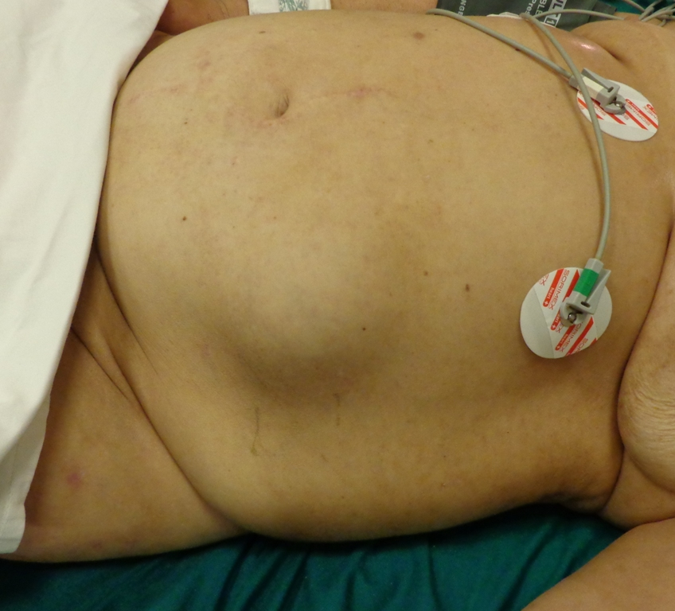
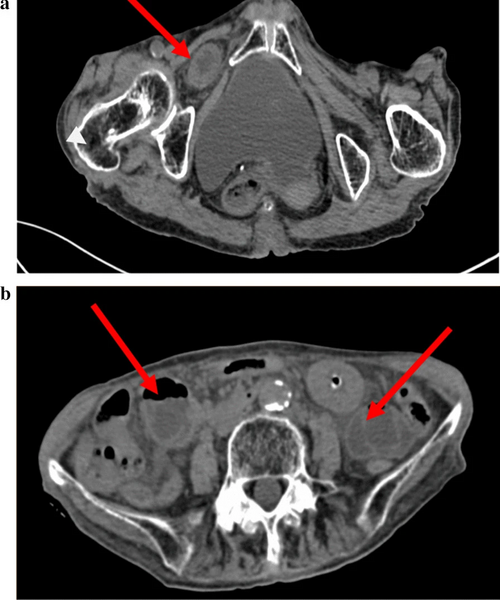

# HÉRNIAS RARAS: SPIEGEL, OBTURATÓRIA, LOMBAR

Quando falamos de hérnias da parede abdominal, o seu cérebro automaticamente projeta a região inguinal. E está certo, afinal, elas dominam a rotina. Mas o que separa o aprovado do reprovado nas provas de residência da MedEvo e na vida prática é o domínio das "hérnias de rodapé". Aquelas que o examinador usa para testar se você realmente entende de anatomia ou se apenas decorou o básico.

As hérnias raras — Spiegel, Obturatória e Lombares — compartilham um desafio comum: o diagnóstico clínico difícil. Muitas vezes, o paciente não chega com um abaulamento óbvio. Ele chega com uma dor incaracterística, uma obstrução intestinal de causa obscura ou uma dor referida em locais inusitados. Vamos dissecar cada uma delas, focando no porquê de cada sinal clínico e na anatomia que as bancas tanto amam.

*Figura 1 - Aspecto clínico de hérnia de Spiegel (hérnia ventral lateral), protrusão através da aponeurose de Spiegel. O diagnóstico clínico é frequentemente difícil pela sua localização interparietal. Fonte: AfroBrazilian, CC BY-SA 3.0 | Wikimedia Commons*

## Hérnia de Spiegel: A Hérnia Interparietal

A hérnia de Spiegel é uma protrusão do saco herniário através da aponeurose de Spiegel. Para entender isso, você precisa visualizar a anatomia da parede anterior. A linha semilunar (ou linha de Spiegel) é a transição entre a parte muscular e a parte aponeurótica do músculo transverso do abdome.

### Anatomia e Fisiopatologia

O ponto crítico aqui é a "Zona de Spiegel". Ela se localiza lateralmente ao músculo reto abdominal. O defeito ocorre na aponeurose do músculo transverso, geralmente onde ela se funde com a aponeurose do oblíquo interno.

Por que ela é chamada de interparietal? Porque, na maioria das vezes, o saco herniário não atravessa todas as camadas. Ele passa pelo transverso e pelo oblíquo interno, mas fica "preso" por baixo da aponeurose do músculo oblíquo externo.

**Cuidado:** É por isso que o diagnóstico físico é tão difícil. Você pode não ver um abaulamento nítido, mas sim uma tumoração profunda e mal definida. Se a banca descrever uma "tumoração em flanco, ligeiramente dolorosa, com aumento progressivo", abra o olho para Spiegel.

### Localização e Fatores de Risco

A imensa maioria dessas hérnias ocorre na "faixa de Spiegel", uma área entre a linha que une as espinhas ilíacas anterossuperiores e a linha umbilical. Mais especificamente, elas adoram aparecer abaixo da linha arqueada de Douglas.

Por que abaixo da linha arqueada? Lembre-se da anatomia: acima da linha arqueada, a bainha do reto tem folhetos anterior e posterior. Abaixo dela, todas as aponeuroses passam à frente do músculo reto. Essa transição cria uma área de relativa fraqueza estrutural.

Os fatores predisponentes incluem:

- Gravidez prévia (pelo estiramento da parede).

- Obesidade.

- Cirurgias prévias.

- Idade avançada (comum entre a 4ª e 7ª décadas).

### Diagnóstico e Conduta

Como o exame físico é inconclusivo em até 50% dos casos, os exames de imagem são essenciais. A Ultrassonografia (USG) é um bom primeiro passo, mas a Tomografia Computadorizada (TC) é o padrão-ouro. Ela mostra exatamente o "degrau" na aponeurose e o conteúdo herniário (geralmente gordura pré-peritoneal ou omento, mas pode conter cólon).

O tratamento é sempre cirúrgico. Por ser um defeito pequeno (geralmente < 2cm) e com bordas aponeuróticas rígidas, o risco de encarceramento é alto.

**Dica de Prova:** Se a questão trouxer uma Hérnia de Spiegel encarcerada, mas sem sinais de estrangulamento (isquemia), a conduta padrão é a herniorrafia com tela. A abordagem pode ser aberta ou laparoscópica (IPOM ou transabdominal).

## Hérnias Lombares: O Terror da Anatomia Posterior

As hérnias lombares ocorrem através de defeitos na parede abdominal posterolateral. Aqui, o examinador não quer apenas que você saiba o nome da hérnia, ele quer os limites anatômicos. Se você confundir os limites do triângulo de Petit com os de Grynfeltt, você perde a questão.

### Hérnia de Grynfeltt (Superior)

Esta é a hérnia lombar mais comum (embora o termo "comum" seja relativo aqui). Ela ocorre no triângulo lombar superior.

**Limites do Triângulo de Grynfeltt-Lesshaft:**

- **Superior:** 12ª costela.

- **Medial:** Músculo eretor da espinha (paraespinhais).

- **Lateral:** Músculo oblíquo interno.

- **Teto (Cobertura):** Músculo latíssimo do dorso (grande dorsal).

- **Assoalho:** Aponeurose do músculo transverso do abdome.

### Hérnia de Petit (Inferior)

Ocorre no triângulo lombar inferior. É mais fácil de lembrar porque a base é a crista ilíaca.

**Limites do Triângulo de Petit:**

- **Inferior (Base):** Crista ilíaca.

- **Medial:** Músculo latíssimo do dorso (grande dorsal).

- **Lateral:** Músculo oblíquo externo.

**Pegadinha Clássica:** A banca vai trocar o oblíquo interno pelo externo. Lembre-se: o Externo é mais superficial e "desce" até a crista ilíaca, formando o limite lateral de Petit. O Interno fica "mais para cima", ajudando a formar o limite de Grynfeltt.

### Quadro Clínico e Manejo

O paciente costuma queixar-se de uma nodulação lombar que aumenta com o esforço (Manobra de Valsalva) e reduz ao repouso. Diferente das hérnias inguinais, as lombares têm um colo largo, o que torna o encarceramento menos frequente, mas não impossível.

O tratamento é cirúrgico devido ao aumento progressivo do defeito. O reparo com tela é a regra, podendo ser feito por via aberta ou laparoscópica. O grande desafio cirúrgico aqui é a fixação da tela, já que as bordas costumam ser ósseas (crista ilíaca ou costela).

| Característica | Hérnia de Grynfeltt | Hérnia de Petit |
| --- | --- | --- |
| **Localização** | Triângulo Lombar Superior | Triângulo Lombar Inferior |
| **Frequência** | Mais comum | Menos comum |
| **Limite Medial** | M. Eretor da espinha | M. Latíssimo do dorso |
| **Limite Lateral** | M. Oblíquo interno | M. Oblíquo externo |
| **Limite Sup/Inf** | 12ª Costela | Crista Ilíaca |

*Figura 2 - Tomografia computadorizada abdominal evidenciando hérnia obturatória, protrusão rara através do forame obturador que frequentemente se apresenta como obstrução intestinal de causa obscura. Fonte: Immanueltjahjadi, CC BY-SA 4.0 | Wikimedia Commons*

## Hérnia Obturatória: A "Hérnia da Velhinha Magra"

Se você ler em uma questão: "Mulher, 80 anos, multípara, emagrecida, com quadro de obstrução intestinal", pare tudo. O diagnóstico é Hérnia Obturatória até que se prove o contrário.

### O Porquê da Epidemiologia

O canal obturador é uma abertura no osso pélvico por onde passam o nervo e os vasos obturadores. Normalmente, esse canal é preenchido por um "plug" de gordura pré-peritoneal.
Por que idosas e magras?

- **Multiparidade:** Relaxa os ligamentos pélvicos e alarga o canal.

- **Emagrecimento súbito:** Faz com que o plug de gordura desapareça, deixando o canal vazio e propenso à entrada de uma alça intestinal.

### O Sinal de Howship-Romberg

Este é o "pulo do gato" das provas. A hérnia obturatória raramente causa um abaulamento visível, pois está escondida sob o músculo pectíneo. No entanto, o saco herniário comprime o **nervo obturador** dentro do canal.

Isso gera o **Sinal de Howship-Romberg**: dor ou parestesia na face medial da coxa, que pode se estender até o joelho. A dor geralmente piora com a extensão, adução ou rotação interna da coxa.

**Atenção:** Não confunda com o sinal de Romberg da neurologia! O Howship-Romberg está presente em cerca de 50% dos casos e é altamente sugestivo.

### Diagnóstico e Tratamento

A maioria dos casos é diagnosticada durante uma laparotomia exploradora por abdome agudo obstrutivo de causa indeterminada. No entanto, se houver suspeita prévia, a TC de pelve é o exame de escolha, mostrando a alça intestinal passando entre os músculos pectíneo e obturador externo.

O tratamento é cirúrgico e urgente, dado o alto risco de estrangulamento (o canal é rígido e estreito). A abordagem preferencial em casos de obstrução é a laparotomia mediana infraumbilical, que permite reduzir a hérnia e realizar ressecção intestinal, se necessário.

## O "Dicionário" de Eponímos: Richter, Littré, Amyand e Garengeot

As bancas adoram testar se você sabe quem é quem no zoológico das hérnias. Como diz o Dr. Will, "epônimo em prova é questão dada para quem revisou".

### Hérnia de Richter

Esta é perigosa. Nela, apenas uma parte da circunferência da borda antimesentérica da alça intestinal fica presa no saco herniário.

- **O perigo:** Como a luz intestinal não é totalmente bloqueada, o paciente pode não apresentar sinais de obstrução intestinal completa.

- **A consequência:** A isquemia progride silenciosamente, levando à gangrena e perfuração sem que o paciente tenha tido vômitos ou parada de eliminação de flatos.

### Hérnia de Littré

É a presença do **Divertículo de Meckel** dentro do saco herniário (seja ele inguinal, femoral ou umbilical).

- **Dica:** Se a questão mencionar um achado incidental de um divertículo em uma cirurgia de hérnia, o nome é Littré.

### Hérnia de Amyand vs. Hérnia de Garengeot

Ambas envolvem o apêndice cecal, mas a localização muda o nome:

- **Hérnia de Amyand:** Apêndice cecal dentro de um saco herniário **Inguinal**.

- **Hérnia de Garengeot:** Apêndice cecal dentro de um saco herniário **Femoral** (Crural).

**Como memorizar?** "Amyand" começa com "A" de apêndice e ocorre na região inguinal (mais comum). "Garengeot" soa mais "estranho", assim como a hérnia femoral é mais rara e "estranha" em relação à inguinal.

## Diagnóstico Diferencial Importante: Hematoma da Bainha do Reto

Muitas vezes, uma questão sobre Hérnia de Spiegel coloca como alternativa o Hematoma da Bainha do Reto. Você precisa saber diferenciar, pois a conduta muda drasticamente.

O hematoma ocorre por ruptura da artéria epigástrica inferior ou de seus ramos, geralmente após um esforço súbito (tosse intensa, espirro, exercício).

- **Perfil:** Paciente anticoagulado ou com distúrbio de coagulação.

- **Sinal de Fothergill:** Uma massa na parede abdominal que **não cruza a linha média** e que **permanece palpável e fixa** quando o paciente contrai o músculo reto abdominal (diferente de uma hérnia intra-abdominal, que "desapareceria" ou diminuiria com a contração da musculatura).

- **Manejo:** Se o paciente estiver estável e o hematoma não estiver expandindo, o tratamento é **conservador** (repouso, gelo, controle da dor e correção da coagulação). A cirurgia é reservada para casos de instabilidade hemodinâmica ou expansão rápida.

## Pontos-Chave para o Tratamento Cirúrgico

Para todas as hérnias raras, a regra de ouro é: **Defeito aponeurótico precisa de reforço.**

- **Uso de Telas:** Atualmente, o uso de próteses (telas de polipropileno) é o padrão para reduzir a recidiva. A exceção é em campos francamente contaminados (peritonite por perfuração), onde o cirurgião pode optar pelo fechamento primário ou telas biológicas (raras na nossa realidade).

- **Via Laparoscópica:** Ganha cada vez mais espaço, especialmente na Hérnia de Spiegel e nas Lombares, por permitir uma visualização clara da anatomia por "trás" e uma recuperação mais rápida.

- **Hérnias por Deslizamento:** Lembre-se que, em qualquer hérnia, o cólon ou a bexiga podem fazer parte da parede do saco herniário. Nunca saia cortando o saco herniário sem antes garantir que não há uma víscera "deslizando" ali.

## Tabelas Comparativas para Revisão Rápida

### Tabela 1: Resumo das Hérnias por Epônimos

| Nome | Conteúdo / Localização | Característica Marcante |
| --- | --- | --- |
| **Spiegel** | Linha Semilunar (borda do reto) | Interparietal, abaixo da linha de Douglas |
| **Obturatória** | Canal Obturador | Sinal de Howship-Romberg, idosa magra |
| **Richter** | Parte da circunferência da alça | Isquemia sem obstrução completa |
| **Littré** | Divertículo de Meckel | Achado incidental ou inflamação |
| **Amyand** | Apêndice em Hérnia Inguinal | Mais comum à direita |
| **Garengeot** | Apêndice em Hérnia Femoral | Mais comum em mulheres |

### Tabela 2: Diagnóstico Diferencial de Massa em Parede Abdominal

| Condição | Localização | Clínica Típica | Conduta Inicial |
| --- | --- | --- | --- |
| **Hérnia de Spiegel** | Lateral ao reto abd. | Redutível ou encarcerada | Cirurgia (Tela) |
| **Hematoma da Bainha** | Dentro da bainha do reto | Trauma/Tosse + Anticoagulação | Conservador |
| **Hérnia Lombar** | Flanco / Dorso | Aumenta com Valsalva | Cirurgia (Tela) |
| **Diástase de Retos** | Linha média | Abaulamento difuso ao levantar | Conservador/Estético |

## Situações Especiais e Complicações

### Hérnias Perineais

Embora menos cobradas, aparecem em provas de alto nível. São protrusões através dos músculos do assoalho pélvico (levantador do ânus e coccígeo).

- **Primárias:** Raras, mais em mulheres idosas multíparas.

- **Secundárias:** Mais comuns, ocorrem após cirurgias extensas como a amputação abdominoperineal de reto (Cirurgia de Miles) ou exenteração pélvica.

- **Erro comum:** Achar que são comuns em homens jovens. Não são.

### Hérnia Isquiática

Passa pelo grande ou pequeno forame isquiático. O paciente pode apresentar dor ciática ou uma massa na região glútea. É extremamente rara, mas se cair, lembre-se da relação com o nervo isquiático.

### Gangrena Intestinal

Em qualquer hérnia rara, o atraso diagnóstico é o maior vilão. Se houver suspeita de estrangulamento (dor contínua, febre, leucocitose, sinais inflamatórios locais), a conduta é cirurgia imediata. Na hérnia obturatória, a mortalidade chega a ser alta justamente pela demora em pensar no diagnóstico em pacientes idosos e frágeis.

## Pontos-Chave para Prova 💡

- **Hérnia de Spiegel:** Localiza-se na linha semilunar, lateral ao músculo reto abdominal, tipicamente abaixo da linha arqueada de Douglas.

- **Hérnia de Spiegel:** É frequentemente interparietal (fica sob a aponeurose do oblíquo externo), o que dificulta o diagnóstico clínico.

- **Hérnia Obturatória:** Clássica em mulheres idosas, multíparas e emagrecidas.

- **Sinal de Howship-Romberg:** Dor na face medial da coxa por compressão do nervo obturador; patognomônico de hérnia obturatória.

- **Hérnia de Grynfeltt:** É a hérnia lombar mais comum e ocorre no triângulo lombar superior.

- **Limites de Grynfeltt:** 12ª costela, músculos paraespinhais e músculo oblíquo interno.

- **Hérnia de Petit:** Ocorre no triângulo lombar inferior, limitado pela crista ilíaca, latíssimo do dorso e oblíquo externo.

- **Hérnia de Richter:** Encarceramento de apenas parte da circunferência da alça; alto risco de necrose sem obstrução intestinal clássica.

- **Hérnia de Littré:** Presença do divertículo de Meckel no saco herniário.

- **Hérnia de Amyand:** Apêndice cecal dentro de uma hérnia inguinal.

- **Hematoma da Bainha do Reto:** Sinal de Fothergill positivo (massa não cruza a linha média e segue palpável na contração). Manejo inicial é conservador se estável.

- **Diagnóstico por Imagem:** A Tomografia Computadorizada é o melhor exame para o diagnóstico de hérnias raras e seus diferenciais.

- **Tratamento:** Hérnias lombares e de Spiegel devem ser tratadas com tela devido ao risco de recidiva e encarceramento.

- **Hérnia por Deslizamento:** Cólon e bexiga são as vísceras mais envolvidas; cuidado para não lesá-las ao abrir o saco herniário.

- **O que NÃO fazer:** Não negligencie uma dor na coxa em uma idosa com vômitos; não assuma que toda massa abdominal lateral é um tumor sem antes descartar Spiegel.

- **Contraindicação Absoluta:** Não se deve realizar redução manual (taxia) de uma hérnia com sinais claros de estrangulamento (risco de reduzir alça necrosada para a cavidade).

 Cópia offline para consulta pessoal.
 Fonte original:
 [https://www.medevo.com.br/material-apoio/ler/b0558d1b-fb79-45ed-98fd-0df2ad3c6c8a](https://www.medevo.com.br/material-apoio/ler/b0558d1b-fb79-45ed-98fd-0df2ad3c6c8a)
