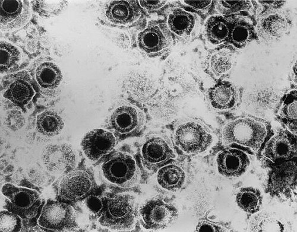
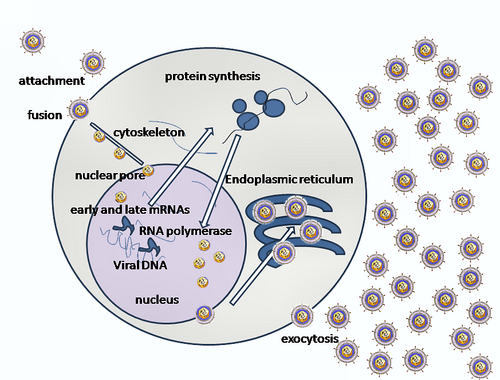

# HERPES NEONATAL

Para entender o Herpes Neonatal, você precisa primeiro tirar da cabeça a imagem do herpes labial ou genital do adulto, que costuma ser uma doença chata, mas autolimitada. No recém-nascido, o cenário muda completamente. Estamos falando de uma infecção que pode ser devastadora, com alta mortalidade e sequelas neurológicas permanentes.

Como professor, vejo muitos alunos errando questões por não diferenciarem o risco de transmissão na primoinfecção materna do risco na lesão recorrente. Esse é o "pulo do gato" para as provas de residência e para a sua vida prática no centro obstétrico.

*Figura 1 - Micrografia eletrônica de transmissão do Vírus Herpes Simplex (HSV). Alguns nucleocapsídeos aparecem vazios, evidenciados pela penetração do corante. Fonte: CDC/Dr. Erskine Palmer, Domínio Público | Wikimedia Commons*

## Fisiopatologia e Mecanismos de Transmissão

O Vírus Herpes Simplex (HSV) possui dois tipos principais: o HSV-1 (tradicionalmente associado a lesões orais) e o HSV-2 (tradicionalmente genital). No entanto, essa distinção está cada vez mais borrada devido às práticas sexuais atuais. O que importa para nós é como esse vírus chega ao bebê.

Existem três vias de transmissão vertical, e você precisa conhecer a proporção de cada uma:

- **Intrauterina (Congênita):** É a mais rara, ocorrendo em cerca de 5% dos casos. O vírus atravessa a placenta ou sobe por via ascendente através de membranas rotas. Pode causar a tríade clássica: lesões cutâneas (cicatrizes), microcefalia e coriorretinite.

- **Periparto (No momento do parto):** É a via principal, responsável por 85% a 90% dos casos. O bebê entra em contato direto com as secreções infectadas ou lesões no canal de parto.

- **Pós-natal:** Ocorre em cerca de 5% a 10% dos casos, geralmente por contato com lesões ativas de cuidadores (beijos de parentes com herpes labial, por exemplo) ou infecção hospitalar.

### O conceito crucial: Primoinfecção vs. Recorrência

Por que a primoinfecção materna no final da gestação é o maior pesadelo do obstetra?

Imagine que a gestante nunca teve contato com o HSV. Se ela adquire o vírus no terceiro trimestre, ela terá uma carga viral altíssima no canal de parto e, o mais grave, não teve tempo de produzir anticorpos IgG e transferi-los via placenta para o feto. O bebê nasce "desarmado". Nesse cenário, o risco de transmissão vertical chega a 50%.

Agora, pense na gestante que já tem herpes genital recorrente há anos. Ela já possui anticorpos circulantes que protegem parcialmente o feto. Mesmo que ela tenha uma lesão ativa no momento do parto, o risco de transmissão para o bebê cai para menos de 3%.

As bancas de residência adoram explorar essa diferença. Eles vão colocar um caso de lesão recorrente e perguntar o risco, tentando te induzir a marcar a alternativa de "alto risco". Lembre-se: o perigo real mora na primoinfecção perto do parto.

## Manifestações Clínicas no Recém-Nascido

O herpes neonatal não costuma se manifestar imediatamente após o nascimento. Existe um período de incubação. Se você vir uma questão de um RN com vesículas logo ao nascer, pense em infecção intrauterina (aquela rara de 5%). O padrão habitual surge entre a primeira e a terceira semana de vida.

Dividimos a apresentação clínica em três fenótipos principais, e você deve memorizar essa classificação, pois ela define o prognóstico.

### 1. Doença SEM (Pele, Olho e Boca)

É a forma mais comum, correspondendo a cerca de 45% dos casos. As lesões vesiculares clássicas aparecem na pele, muitas vezes em áreas de trauma (como onde foi colocado o eletrodo de monitorização fetal ou no fórceps).

Cuidado: nem todo bebê com herpes tem vesículas. Em cerca de 20% a 30% dos casos de doença disseminada ou de SNC, a pele está limpa. Se você esperar a vesícula aparecer para suspeitar, pode ser tarde demais.

### 2. Doença do Sistema Nervoso Central (SNC)

Ocorre em cerca de 30% dos casos. O vírus chega ao cérebro por via retrógrada através dos nervos ou por via hematogênica. O quadro é de encefalite.

- Sinais: Letargia, irritabilidade, recusa alimentar e, principalmente, convulsões (muitas vezes focais).

- O líquor costuma mostrar pleocitose e proteinorraquia aumentada.

- O prognóstico é reservado, com alto índice de sequelas motoras e cognitivas mesmo com tratamento.

### 3. Doença Disseminada

É a forma mais grave, com mortalidade superior a 80% se não tratada. Envolve múltiplos órgãos, comportando-se como uma sepse neonatal grave que não responde a antibióticos.

- Órgãos afetados: Fígado (insuficiência hepática e icterícia), pulmões (pneumonite) e glândulas adrenais.

- Frequentemente evolui com Coagulação Intravascular Disseminada (CIVD).

- Dica de prova: Se o caso clínico mostra um RN com quadro de sepse, transaminases explodindo (milhares) e líquor normal, pense em Herpes Disseminado.

*Figura 2 - Diagrama do ciclo de replicação do Vírus Herpes Simplex (HSV), demonstrando as etapas de adsorção, penetração, replicação do DNA viral e liberação de novas partículas. Fonte: Domínio Público | Wikimedia Commons*

## Diagnóstico: O que pedir e como interpretar

O diagnóstico padrão-ouro hoje é a detecção do DNA viral por PCR (Reação em Cadeia da Polimerase). A cultura viral, embora específica, demora muito e tem sensibilidade menor.

No recém-nascido com suspeita, você deve realizar o "swab de superfície" (olhos, boca, nasofaringe e reto), mas atenção: esse swab só deve ser colhido após 24 horas de vida para evitar que você colete apenas o vírus da secreção materna que ficou na pele do bebê, o que daria um falso positivo para infecção real.

Além do swab, é obrigatório:

- PCR do líquor (mesmo que não haja sinais neurológicos).

- PCR do sangue (para avaliar disseminação).

- Dosagem de transaminases.

| Exame | Utilidade | Observação |
| --- | --- | --- |
| PCR de Lesão Cutânea | Confirmar etiologia da vesícula | Altíssima sensibilidade |
| PCR do Líquor | Diagnóstico de Encefalite | Pode ser negativo nos primeiros dias |
| PCR de Sangue | Avaliar Doença Disseminada | Útil quando não há lesão de pele |
| Cultura Viral | Padrão-ouro histórico | Lenta e menos sensível que PCR |

## Manejo da Gestante: A Chave da Prevenção

Aqui é onde o MedEvo e o Dr. Will reforçam: a prevenção é o melhor tratamento. O manejo depende do momento em que a lesão aparece.

### Durante o Pré-natal

Se a gestante tem história de herpes genital recorrente (mesmo que não tenha lesão agora), a recomendação da FEBRASGO e do Ministério da Saúde é clara: **Profilaxia Supressiva com Aciclovir a partir de 36 semanas de gestação até o parto.**

Por que fazemos isso? Para evitar que ela tenha uma recidiva no momento do parto, o que nos obrigaria a fazer uma cesariana. O objetivo da profilaxia é garantir o parto vaginal seguro.

- Dose recomendada: Aciclovir 400mg, via oral, 3 vezes ao dia.

### No Momento do Parto

Esta é a pergunta que mais cai em provas. A decisão da via de parto baseia-se no exame físico da admissão.

- **Lesão Ativa (Vesícula ou Úlcera) ou Pródromos (ardor, formigamento):** Indicação de **Cesariana**. A cesárea deve ser feita, preferencialmente, com membranas íntegras ou em até 4 horas após a ruptura das membranas.

- **História de Herpes, mas SEM lesão ativa no momento:** O **Parto Vaginal** está autorizado. Não se faz cesárea apenas por "história de herpes".

**Erro comum de prova:** A banca vai dizer que a paciente tem herpes recorrente, está em uso de aciclovir profilático e chegou em trabalho de parto sem lesões. A alternativa errada dirá que a conduta é cesárea. O correto é parto vaginal!

### E se for Primoinfecção no 3º Trimestre?

Se a gestante adquire herpes pela primeira vez nas últimas 6 semanas de gestação, a recomendação de cesariana é muito mais forte, pois o risco de excreção viral é altíssimo e não há anticorpos maternos. Mesmo que não haja lesão visível no dia do parto, muitos especialistas recomendam a cesárea nesse cenário específico de primoinfecção recente.

## Tratamento Farmacológico

O tratamento de escolha, tanto para a gestante quanto para o recém-nascido, é o **Aciclovir**.

### No Recém-Nascido

Todo RN com suspeita ou confirmação de herpes neonatal deve ser internado para tratamento venoso. Não existe tratamento oral para herpes neonatal na fase aguda.

- **Dose:** 60 mg/kg/dia, divididos em 3 doses (20 mg/kg a cada 8 horas), por via intravenosa.

- **Duração:**

- 14 dias para doença SEM.

- 21 dias para doença de SNC ou Disseminada.

Após o tratamento venoso, recomenda-se o uso de aciclovir oral supressivo por 6 meses para melhorar o desfecho neuroevolutivo, especialmente nos casos de acometimento do SNC.

*Figura 2 - Diagrama do ciclo de replicação do Vírus Herpes Simplex (HSV), demonstrando as etapas de adsorção, penetração, replicação do DNA viral e liberação de novas partículas. Fonte: Domínio Público | Wikimedia Commons*

## Diagnósticos Diferenciais e "Pegadinhas" de Prova

As bancas adoram misturar o Herpes Neonatal com outras condições que causam desconforto respiratório ou lesões oculares. Vamos organizar isso.

### 1. Conjuntivite Neonatal (Oftalmia Neonatal)

O herpes pode causar conjuntivite, mas ele não é o único.

- **Química (Nitrato de Prata):** Surge nas primeiras 24 horas. É uma reação ao colírio de Credé.

- **Gonocócica:** Surge entre o 2º e 5º dia. É purulenta, explosiva, pode perfurar a córnea. Tratamento: Ceftriaxone.

- **Chlamydia trachomatis:** Surge mais tarde, após o 5º dia (geralmente entre 5 e 14 dias). A secreção é menos purulenta. Importante: A mãe pode ter história de corrimento ou disúria. Tratamento: Eritromicina ou Azitromicina oral (o colírio não resolve, pois precisa tratar a nasofaringe para evitar pneumonia).

### 2. Varicela Neonatal

Cuidado para não confundir Herpes Simples com Varicela-Zoster.
A "pérola clínica" aqui é o tempo: se a mãe desenvolve os sintomas de varicela (catapora) entre **5 dias antes e 2 dias após o parto**, o RN corre risco de varicela neonatal grave (pois não recebeu anticorpos e foi exposto ao pico da viremia).

- **Conduta:** Administrar Imunoglobulina Antivaricela-Zoster (VZIG) para o RN imediatamente.

### 3. Taquipneia Transitória do Recém-Nascido (TTRN)

Muitas vezes o herpes disseminado causa desconforto respiratório, e a banca coloca a TTRN como distrator.

- **TTRN:** RN a termo, nascido de cesárea eletiva (sem trabalho de parto), apresenta taquipneia logo após o nascimento por demora na reabsorção do líquido pulmonar. O raio-X mostra congestão hilar e fluido nas cissuras. Melhora em 24-48h com suporte de oxigênio (CPAP).

- **Diferença:** O herpes causa uma pneumonite inflamatória, o bebê está francamente doente, febril ou hipotérmico, e não melhora apenas com oxigênio.

### 4. Persistência do Canal Arterial (PCA)

Em questões de sepse neonatal (que pode ser causada por herpes), a banca pode jogar sinais cardiológicos.

- **PCA:** Cansaço às mamadas, pulsos amplos (pedalantes), pressão arterial divergente (sistólica alta e diastólica muito baixa) e sopro contínuo em "maquinária".

## Tabelas Comparativas para Fixação

### Tabela 1: Via de Parto na Gestante com Herpes

| Cenário Clínico | Conduta Recomendada | Justificativa |
| --- | --- | --- |
| Lesão ativa (vesícula/úlcera) no parto | Cesariana | Reduzir contato direto com o vírus |
| Pródromos (dor/queimação) no parto | Cesariana | Risco iminente de eclosão de lesões |
| História de herpes, mas sem lesão atual | Parto Vaginal | Risco de transmissão é desprezível (<1%) |
| Primoinfecção no 3º trimestre | Cesariana (preferencial) | Carga viral alta e ausência de anticorpos |

### Tabela 2: Formas Clínicas do Herpes Neonatal

| Forma | Frequência | Manifestações | Mortalidade (sem tratamento) |
| --- | --- | --- | --- |
| SEM | 45% | Vesículas em pele, boca e olhos | Baixa, mas 70% evoluem para SNC se não tratadas |
| SNC | 30% | Convulsões, letargia, febre, líquor alterado | 50% |
| Disseminada | 25% | Choque, CIVD, Insuficiência Hepática | > 80% |

### Tabela 3: Diagnóstico Diferencial de Conjuntivite Neonatal

| Agente | Início dos Sintomas | Características | Tratamento |
| --- | --- | --- | --- |
| Química | < 24 horas | Hiperemia leve, bilateral | Observação |
| Gonococo | 2 a 5 dias | Purulenta intensa, edema palpebral | Ceftriaxone IM/EV |
| Chlamydia | 5 a 14 dias | Mucopurulenta, pode ser unilateral | Eritromicina VO |
| Herpes | 1 a 2 semanas | Vesículas periorbitais, ceratite | Aciclovir EV |

## Aspectos Práticos e Erros que Reprovam

Um erro clássico é achar que o Aciclovir na gestação é teratogênico. Não é. Ele é seguro e deve ser usado tanto para tratar episódios agudos em qualquer idade gestacional quanto para a profilaxia supressiva a partir de 36 semanas.

Outro ponto: a rotura de membranas (bolsa rota). Se a paciente tem lesão ativa e a bolsa rompeu há mais de 4 ou 6 horas, alguns livros antigos diziam que "não adiantava mais fazer cesárea". Esqueça isso para a prova. A diretriz atual da FEBRASGO orienta que a cesariana ainda deve ser realizada, pois, embora o benefício diminua com o tempo de bolsa rota, ele ainda é superior ao parto vaginal em termos de exposição viral.

Sobre o aleitamento materno: a puérpera com herpes pode amamentar? Sim, desde que não haja lesões herpéticas na mama. Se a lesão for apenas genital, ela deve higienizar bem as mãos e pode amamentar normalmente. Se houver lesão ativa no mamilo, a amamentação naquela mama está contraindicada até a cicatrização completa.

## Prognóstico e Seguimento

O prognóstico do herpes neonatal depende quase exclusivamente da precocidade do tratamento.

- Na doença SEM, o desenvolvimento neuropsicomotor costuma ser normal se tratada a tempo.

- Na doença de SNC, mesmo com aciclovir, cerca de 70% das crianças terão algum grau de atraso ou sequela neurológica.

- Na doença disseminada, a mortalidade ainda é alta, e os sobreviventes frequentemente apresentam danos orgânicos permanentes.

O acompanhamento oftalmológico é obrigatório, pois a ceratoconjuntivite herpética pode levar à cegueira se não identificada e tratada com antivirais tópicos associados ao sistêmico.

## Pontos-Chave para Prova

- O maior risco de transmissão vertical ocorre na **primoinfecção materna** no terceiro trimestre (risco de até 50%).

- Na herpes recorrente com lesão ativa no parto, o risco de transmissão é baixo (**< 3%**), mas a conduta ainda é **cesariana**.

- A profilaxia supressiva com **Aciclovir 400mg 3x/dia** deve ser iniciada com **36 semanas** em toda gestante com história de herpes genital.

- A via de parto é decidida pelo **exame físico na admissão**: lesão ativa ou pródromos = cesariana. Ausência de lesão = parto vaginal.

- O diagnóstico no RN deve ser feito por **PCR** de swabs de superfície (após 24h de vida), sangue e líquor.

- A tríade da infecção congênita (intrauterina) é: **lesões cutâneas cicatriciais, microcefalia e coriorretinite**.

- A forma **disseminada** cursa com insuficiência hepática, CIVD e choque, simulando sepse bacteriana.

- A forma de **SNC** manifesta-se tipicamente com **convulsões focais** entre a 2ª e 3ª semana de vida.

- O tratamento do RN é sempre com **Aciclovir venoso (60 mg/kg/dia)** por 14 a 21 dias.

- **Contraindicação absoluta de parto vaginal:** Presença de lesões herpéticas genitais ativas no momento do trabalho de parto.

- **Pegadinha:** Não se faz cesárea por herpes labial ativa na mãe; apenas orienta-se máscara e higiene.

- **Diferencial de Chlamydia:** Conjuntivite após o 5º dia de vida + pneumonia afebril do lactente. Tratamento é **Eritromicina oral**.

- **Varicela:** Se a mãe tiver sintomas 5 dias antes até 2 dias após o parto, o RN deve receber **VZIG** imediatamente.

- **Erro comum:** Achar que o PCR de líquor negativo exclui herpes de SNC precocemente. Se a suspeita for alta, mantém-se o tratamento e repete-se o exame.

- **Lembre-se:** O aciclovir oral no RN só é usado como **supressão por 6 meses** após o término do tratamento venoso hospitalar. 🧬

 Cópia offline para consulta pessoal.
 Fonte original:
 [https://www.medevo.com.br/material-apoio/ler/51fbb6e4-de1c-417c-9032-259a0240eb98](https://www.medevo.com.br/material-apoio/ler/51fbb6e4-de1c-417c-9032-259a0240eb98)
