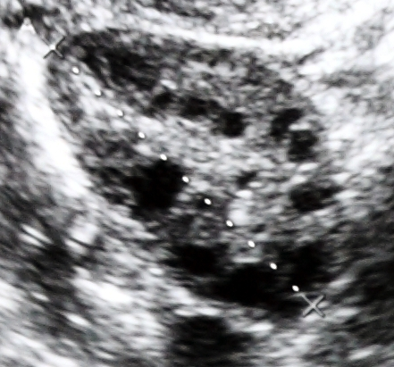
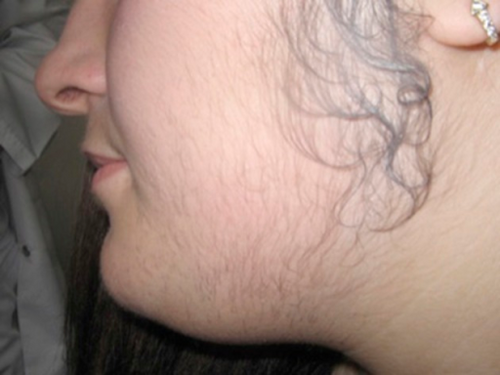

# HIPERANDROGENISMO

Para entender o hiperandrogenismo, você não pode começar decorando uma lista de doenças. Você precisa entender a "cozinha" hormonal da mulher. Se você compreender como o ovário e a adrenal fabricam hormônios, o diagnóstico diferencial, que é o que as bancas mais cobram, se torna lógico.

O hiperandrogenismo é, por definição, a manifestação clínica ou laboratorial do excesso de androgênios na mulher. Mas cuidado: nem toda mulher com espinha tem hiperandrogenismo, e nem toda mulher com pelos a mais tem uma doença grave. O segredo está em separar o que é fisiológico do que é patológico.

*Figura 1 - Ultrassonografia pélvica evidenciando ovário com múltiplos folículos subcentiméptricos periféricos (aspecto em colar de pérolas), padrão típico de ovário policístico associado a hiperandrogenismo. Fonte: Anne Mousse, CC0 | Wikimedia Commons*

## Fisiologia: A Teoria das Duas Células e Duas Gonadotrofinas

Este é o conceito mais cobrado em provas de fisiologia endócrina ginecológica. Se você entender isso, entende a SOP e entende por que usamos certos anticoncepcionais.

O ovário produz estrogênio, mas ele não faz isso do nada. Ele precisa de "matéria-prima", que são os androgênios. O processo ocorre assim:

- **Célula da Teca (estimulada pelo LH):** O LH bate na porta da célula da teca e diz: "Produza androgênios". A teca pega o colesterol e o transforma em androstenediona e testosterona.

- **Célula da Granulosa (estimulada pelo FSH):** Esses androgênios atravessam a membrana e entram na célula da granulosa. Lá, o FSH ativa uma enzima chamada **aromatase**. A aromatase pega esses androgênios "masculinos" e os transforma em estrogênios (estradiol e estrona).

**Dica de Prova:** Na SOP, existe um desequilíbrio. O LH está sempre alto, estimulando demais a teca a produzir androgênios. O FSH, por outro lado, é comparativamente baixo, então a granulosa não consegue aromatizar tudo. Resultado? Sobram androgênios no sistema. É por isso que a relação LH/FSH > 2 ou 3 costumava ser critério diagnóstico (hoje não é mais obrigatório, mas as bancas ainda amam essa lógica).

## O Papel da SHBG: O "Ônibus" dos Hormônios

A testosterona circula no sangue de duas formas: ligada a proteínas ou livre. A principal proteína de transporte é a **SHBG** (Globulina Ligadora de Hormônios Sexuais).

Pense na SHBG como um ônibus. A testosterona que está dentro do ônibus (ligada) não consegue "trabalhar". Apenas a testosterona livre (que está fora do ônibus) consegue entrar na célula e causar acne, hirsutismo e queda de cabelo.

**O que faz a SHBG cair?**

- Insulina alta (Resistência insulínica/Obesidade).

- Androgênios em excesso.

- Hipotireoidismo.

**O que faz a SHBG subir?**

- Estrogênio (por isso o anticoncepcional ajuda tanto: ele aumenta o "ônibus" e limpa a testosterona livre da circulação).

Segundo o Dr. Will, da equipe MedEvo, o erro clássico de prova é dosar apenas a testosterona total. Se a SHBG estiver baixa (comum na paciente obesa), a testosterona total pode vir normal, mas a **testosterona livre** estará alta, causando todos os sintomas.

## Quadro Clínico e Avaliação do Hirsutismo

O hiperandrogenismo se manifesta de quatro formas principais: hirsutismo, acne, alopecia e virilização.

### Hirsutismo vs. Hipertricose

Não confunda!

- **Hipertricose:** É o aumento de pelos em locais onde a mulher já costuma ter (braços, pernas), geralmente por causas raciais ou medicamentosas (como a fenitoína). Não depende de androgênios.

- **Hirsutismo:** É o surgimento de pelos terminais (grossos e escuros) em locais tipicamente masculinos (buço, queixo, tórax, abdome, costas).

Para quantificar isso, usamos o **Índice de Ferriman-Gallwey**. Avaliamos 9 áreas do corpo e damos notas de 0 a 4.

- No Brasil, um escore **maior ou igual a 8** define hirsutismo.

- Algumas diretrizes internacionais mais recentes sugerem escores menores (4 a 6) para certas etnias, mas para a sua prova de residência, o "8" continua sendo o número mágico.

### Sinais de Virilização (O Alerta Vermelho)

Se a paciente apresentar clitoromegalia (clitóris > 10mm), voz grave, aumento de massa muscular ou calvície temporal, pare tudo. Isso não costuma ser SOP. Isso sugere níveis altíssimos de androgênios, geralmente vindos de um **tumor produtor de androgênios** (ovariano ou adrenal).

*Figura 2 - Hirsutismo severo em paciente de 17 anos com Síndrome dos Ovários Policísticos (SOP), manifestação clínica clássica do hiperandrogenismo. A avaliação pelo escore de Ferriman-Gallwey é fundamental. Fonte: Gacaferri Lumezi et al., CC BY 3.0 | Wikimedia Commons*

## Diagnóstico Diferencial: A Chave da Aprovação

Aqui é onde o aluno se perde, mas você vai usar a lógica. O androgênio pode vir de três lugares: Ovário, Adrenal ou Periferia (gordura).

### 1. Síndrome dos Ovários Policísticos (SOP)

É a causa mais comum de hiperandrogenismo (cerca de 80% dos casos). É um diagnóstico de exclusão. Você precisa dos **Critérios de Rotterdam (2003)**, que exigem 2 de 3 dos seguintes:

- **Oligo ou anovulação:** Ciclos irregulares, geralmente com intervalos maiores que 35 dias.

- **Hiperandrogenismo:** Clínico (hirsutismo/acne) ou Laboratorial (Testosterona alta).

- **Ovários Policísticos na USG:** 12 ou mais folículos de 2 a 9mm OU volume ovariano > 10cm³. (Lembrando que diretrizes mais recentes da FEBRASGO e internacionais já falam em 20 folículos se o transdutor for de alta frequência, mas o critério de 12 ainda cai muito).

**Pegadinha de Prova:** A USG não é obrigatória para o diagnóstico se a paciente tiver clínica de hiperandrogenismo e ciclos irregulares. Além disso, ter "cistos no ovário" na USG sem nenhum sintoma NÃO é SOP.

### 2. Hiperplasia Adrenal Congênita (HAC) - Forma Não Clássica

É a principal "imitadora" da SOP. Ocorre por uma deficiência parcial da enzima **21-hidroxilase**.

- **O Porquê:** Como a enzima não funciona bem, a adrenal não consegue fabricar cortisol. O corpo tenta compensar aumentando o ACTH. O ACTH estimula a adrenal, mas como a via do cortisol está bloqueada, a produção desvia para a via dos androgênios.

- **Diagnóstico:** Dosagem de **17-alfa-hidroxiprogesterona (17-OHP)**.

- < 200 ng/dL: Exclui HAC.

-

> 800-1000 ng/dL: Confirma HAC.

- Entre 200 e 800: Pedir teste do estímulo com ACTH.

### 3. Tumores Produtores de Androgênios

Suspeite se o quadro for de **instalação rápida** (menos de 1 ano) e houver **virilização**.

- **Origem Ovariana:** Testosterona Total geralmente > 200 ng/dL.

- **Origem Adrenal:** DHEA-S geralmente > 700 mcg/dL.

### 4. Síndrome de Cushing

Além do hiperandrogenismo, a paciente terá obesidade centrípeta, estrias violáceas (> 1cm), giba e hipertensão. O diagnóstico começa com cortisol livre urinário de 24h ou teste de supressão com dexametasona.

### Tabela Comparativa: Diagnóstico Diferencial

| Patologia | Marcador Principal | Clínica Sugestiva |
| --- | --- | --- |
| **SOP** | Relação LH/FSH alta / Testo levemente alta | Obesidade, acantose nigricans, irregularidade desde a menarca |
| **HAC (Não Clássica)** | 17-OHP > 200 ng/dL | Início na puberdade, história familiar |
| **Tumor Ovariano** | Testosterona > 200 ng/dL | Início súbito, virilização grave |
| **Tumor Adrenal** | DHEA-S > 700 mcg/dL | Início súbito, virilização, massa abdominal |
| **Cushing** | Cortisol alto | Estrias violáceas, face em lua cheia, HAS |

## Investigação Laboratorial: O Passo a Passo

Não peça todos os exames do mundo. Siga uma ordem lógica:

- **Excluir Gravidez:** Beta-HCG (sempre, em qualquer queixa menstrual).

- **Avaliar Hiperandrogenismo:** Testosterona Total e Livre, DHEA-S.

- **Excluir Outras Causas:** TSH (tireoide) e Prolactina (hiperprolactinemia pode causar anovulação).

- **Excluir HAC:** 17-OHP (dosar preferencialmente pela manhã, na fase folicular).

- **Avaliar Metabolismo (SOP):** Glicemia de jejum, Perfil lipídico, TOTG (se obesidade ou fatores de risco).

**Exemplo Clínico:** Paciente de 24 anos, com ciclos de 45-60 dias desde a menarca, acne moderada e Ferriman de 10. IMC 32. Acantose nigricans em pescoço.

- O que ela tem? SOP.

- Por que a acantose? É sinal de resistência insulínica. A insulina alta estimula os receptores de IGF-1 na pele (causando a mancha escura) e nas células da teca (aumentando androgênios).

## Tratamento: Foco no Objetivo da Paciente

O tratamento do hiperandrogenismo, especialmente na SOP, depende do que a mulher quer no momento.

### 1. Mudança de Estilo de Vida (MEV)

É a primeira linha para todas as pacientes com sobrepeso/obesidade.

- **Meta:** Perda de 5% a 10% do peso corporal.

- **Por que funciona?** Reduz a insulina, o que aumenta a SHBG e reduz a produção de androgênios no ovário. Muitas vezes, apenas emagrecer faz a paciente voltar a ovular.

### 2. Anticoncepcionais Orais Combinados (ACO)

É a primeira escolha para quem não quer engravidar.

- **Mecanismo:**

- O componente estrogênico aumenta a SHBG (menos testosterona livre).

- O progestágeno inibe o LH (menos estímulo na teca).

- **Qual escolher?** Preferimos os que têm progestágenos com efeito antiandrogênico. O campeão é o **Acetato de Ciproterona**. Outras opções excelentes são a Drospirenona e o Dienogeste.

### 3. Antiandrogênios Isolados

Usados quando o ACO sozinho não resolve o hirsutismo após 6 meses.

- **Espironolactona (50-200mg/dia):** Bloqueia o receptor de androgênio e inibe a 5-alfa-redutase.

- **Cuidado:** É teratogênica (pode feminilizar feto masculino). Por isso, a paciente DEVE estar em contracepção segura.

- **Finasterida:** Inibe a 5-alfa-redutase tipo 2. Menos usada em mulheres.

- **Flutamida:** Muito eficaz, mas o risco de hepatotoxicidade grave limita seu uso.

### 4. Metformina

Não é tratamento de primeira linha para o hirsutismo! Ela é usada na SOP quando há intolerância à glicose ou diabetes tipo 2 associado, ou como adjuvante na indução de ovulação em pacientes resistentes.

### 5. Desejo de Gravidez

Se a paciente quer engravidar, não usamos ACO.

- **Primeira escolha:** **Letrozol** (Inibidor da aromatase). Atualmente é considerado superior ao Clomifeno para indução de ovulação na SOP, com maiores taxas de nascidos vivos e menos gestações múltiplas.

- **Segunda escolha:** Citrato de Clomifeno.

### Tabela de Tratamento Farmacológico

| Medicamento | Dose Comum | Principal Indicação | Observação Importante |
| --- | --- | --- | --- |
| **Etinilestradiol + Ciproterona** | 35mcg + 2mg | Hirsutismo e Acne | Maior risco trombótico que outros ACOs |
| **Espironolactona** | 100-200mg | Hirsutismo persistente | Monitorar Potássio; Contracepção obrigatória |
| **Metformina** | 1500-2550mg | Resistência Insulínica | Efeitos colaterais TGI comuns |
| **Letrozol** | 2.5-5mg | Indução de ovulação | Iniciar entre 3º e 5º dia do ciclo |

## Situações Especiais e Pegadinhas

### Adolescência

Cuidado ao diagnosticar SOP em adolescentes. Nos primeiros 2 a 3 anos após a menarca, a irregularidade menstrual é fisiológica pela imaturidade do eixo. A USG também não é confiável, pois ovários multifoliculares são comuns nessa idade. Para diagnosticar SOP na adolescente, a FEBRASGO recomenda que haja hiperandrogenismo clínico/laboratorial E irregularidade menstrual persistente.

### Menopausa

Se uma mulher que nunca teve pelos começa a ter um hirsutismo súbito e virilização após a menopausa, pense em **Hipertecose Ovariana** ou tumor. A hipertecose é uma diferenciação severa das células da teca que produz muita testosterona, comum em mulheres mais velhas.

### O Papel da 5-alfa-redutase

Algumas mulheres têm níveis de testosterona normais, mas têm muito hirsutismo. Por quê? Porque a enzima **5-alfa-redutase** na pele delas é muito ativa. Essa enzima transforma a testosterona em **Di-hidrotestosterona (DHT)**, que é 10 vezes mais potente. Isso é chamado de Hirsutismo Idiopático.

## Complicações a Longo Prazo

A SOP não é apenas um problema estético ou reprodutivo. Ela é uma síndrome metabólica.

- **Endométrio:** A anovulação crônica gera uma exposição do endométrio apenas ao estrogênio, sem a oposição da progesterona (que só aparece após a ovulação). Isso causa hiperplasia endometrial e aumenta o risco de **Câncer de Endométrio**.

- **Cardiovascular:** Aumento do risco de dislipidemia, hipertensão e infarto.

- **Diabetes:** Cerca de 10% das mulheres com SOP desenvolvem DM2 aos 40 anos.

Como professor, eu sempre digo: trate a queixa da paciente hoje, mas proteja o útero e o coração dela para o futuro.

## Pontos-Chave para Prova 🎯

- **Critérios de Rotterdam:** 2 de 3 (Anovulação, Hiperandrogenismo, USG). USG não é obrigatória se os outros dois estiverem presentes.

- **Hirsutismo:** Ferriman-Gallwey ≥ 8.

- **Virilização Súbita:** Pensar em tumor. Testosterona > 200 (ovário) ou DHEA-S > 700 (adrenal).

- **HAC Não Clássica:** Dosar 17-OHP. Se > 800 ng/dL, diagnóstico confirmado. Se < 200 ng/dL, excluído.

- **Teoria das Duas Células:** LH estimula Teca (Androgênios); FSH estimula Granulosa (Aromatização para Estrogênios).

- **SHBG:** Cai na obesidade/insulina alta, aumentando a testosterona livre. Sobe com uso de estrogênio (ACO).

- **Tratamento de Escolha (Hirsutismo):** ACO com progestágeno antiandrogênico (Ciproterona é o mais potente).

- **Tratamento de Escolha (Infertilidade na SOP):** Letrozol (atualmente preferido sobre o Clomifeno).

- **Espironolactona:** Nunca usar sem contracepção eficaz (risco de feminilização de feto masculino).

- **Acantose Nigricans:** Sinal clínico de resistência insulínica, não de excesso de androgênio direto.

- **Risco de Câncer:** SOP aumenta o risco de câncer de endométrio por exposição estrogênica sem oposição da progesterona.

- **O que NÃO fazer:** Não diagnosticar SOP em adolescentes apenas por USG ou ciclos irregulares nos primeiros 2 anos pós-menarca.

- **Pegadinha Clássica:** A alternativa dirá que a USG com "aspecto policístico" é patognomônica de SOP. Falso! 20% das mulheres normais têm essa imagem.

- **Diferença Fundamental:** Hirsutismo (dependente de androgênio) vs. Hipertricose (não dependente, lanugem em áreas não sexuais).

- **Metformina:** Não é droga de primeira linha para tratar acne ou hirsutismo. Sua função é metabólica.

- **Progesterona e Temperatura:** A progesterona produzida pelo corpo lúteo após a ovulação aumenta a temperatura basal em 0,3 a 0,5°C. Se a paciente com SOP não ovula, ela não tem esse pico térmico.

 Cópia offline para consulta pessoal.
 Fonte original:
 [https://www.medevo.com.br/material-apoio/ler/afb57c79-037b-4944-9e6e-0ab4aa56449f](https://www.medevo.com.br/material-apoio/ler/afb57c79-037b-4944-9e6e-0ab4aa56449f)
