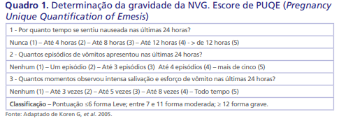
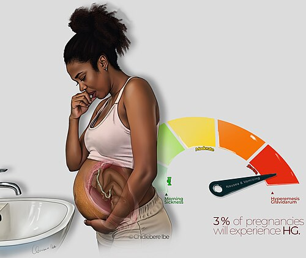

# HIPERÊMESE GRAVÍDICA

Para entender a hiperêmese gravídica, você precisa primeiro esquecer a ideia de que ela é apenas um "enjoo matinal mais forte". Na prática clínica e, principalmente, nas provas de residência, tratamos a náusea e vômitos da gestação (NVG) como um espectro. Em uma ponta, temos a queixa fisiológica de 70 a 80 por cento das gestantes. Na outra ponta, o cenário crítico que interna pacientes: a hiperêmese.

O que define a passagem da linha entre o desconforto e a patologia não é apenas a vontade de vomitar, mas o impacto metabólico. Se a paciente perde peso, desidrata e altera eletrólitos, o diagnóstico mudou de patamar.

*Figura 1 - Diagrama da fisiopatologia dos vômitos na gestação, ilustrando os mecanismos neuroendócrinos envolvidos na êmese gravídica e hiperêmese. Fonte: Ian Ramsden & Robin Callander, Domínio Público | Wikimedia Commons*

## Definição e Critérios Diagnósticos

A hiperêmese gravídica é definida como a presença de vômitos persistentes e incoercíveis, que se iniciam precocemente no primeiro trimestre, levando a um quadro de desidratação, distúrbios eletrolíticos, cetonúria e perda ponderal significativa.

Mas atenção ao número que as bancas amam: a perda de peso deve ser superior a 5 por cento do peso pré-gestacional. Se a paciente pesava 60 kg e agora pesa 56 kg, ela perdeu mais de 5 por cento. Isso, associado à cetonúria (presença de corpos cetônicos na urina devido ao catabolismo de gorduras pelo jejum prolongado), fecha o diagnóstico clássico.

Os critérios que você deve memorizar para a prova são:

- Vômitos persistentes (incoercíveis).

- Perda de peso maior que 5 por cento do peso pré-gravídico.

- Evidência de desidratação (mucosas secas, turgor diminuído).

- Cetonúria e alterações eletrolíticas (hipocalemia, hipocloridemia).

Muitos alunos erram ao achar que qualquer vômito no primeiro trimestre é hiperêmese. Lembre-se: a "êmese gravídica" simples não causa perda de peso importante nem desidratação. Se a questão mencionar que a paciente mantém o estado nutricional, a conduta é ambulatorial e conservadora.

## Epidemiologia e Fatores de Risco

A prevalência da hiperêmese gira em torno de 0,3 a 3 por cento das gestações. É muito menos comum que a náusea fisiológica, mas é a principal causa de internação no primeiro trimestre.

Por que algumas mulheres desenvolvem e outras não? As bancas cobram os fatores de risco porque eles dão pistas sobre a etiologia. Os principais são:

- Gestação múltipla (gemelaridade): mais placenta, mais hormônio.

- Doença Trofoblástica Gestacional (Mola Hidatiforme): níveis astronômicos de hCG.

- História prévia de hiperêmese em gestação anterior (maior fator preditor).

- Baixa idade materna e primiparidade.

- Obesidade.

- Feto do sexo feminino (estudos sugerem correlação com níveis de estrogênio).

Um detalhe importante que o MedEvo sempre destaca: a suplementação precoce de ferro pode piorar os sintomas gastrointestinais. Por isso, em pacientes com muita náusea, muitas vezes suspendemos o ferro e mantemos apenas o ácido fólico até a melhora do quadro.

## Etiologia e Fisiopatologia: O "Porquê" da Doença

Você já deve ter ouvido que a culpa é do hCG. Mas por que o hCG causa isso?

O hormônio gonadotrofina coriônica humana (hCG) tem uma estrutura molecular muito semelhante ao TSH (hormônio estimulador da tireoide). Ambos compartilham a mesma subunidade alfa. Em níveis muito elevados, o hCG "engana" os receptores de TSH na glândula tireoide, estimulando-a. Isso gera a chamada Tireotoxicose Gestacional Transitória. A paciente pode apresentar um TSH suprimido e T4 livre levemente aumentado, sem ter uma doença autoimune da tireoide. Esse estado hipermetabólico contribui para os vômitos.

Além do hCG, temos outros culpados:

- Estrogênio: Níveis elevados sensibilizam os centros do vômito no sistema nervoso central.

- Progesterona: Este hormônio é um relaxante de musculatura lisa. Ele reduz o tônus do esfíncter esofágico inferior (EII) e diminui o esvaziamento gástrico. O resultado? O alimento fica mais tempo no estômago e o "portão" para o esôfago fica frouxo, facilitando o refluxo e o vômito.

- Fatores Psicológicos: Não ignore isso. A hiperêmese tem um componente psicossomático importante. O estresse e a ambivalência em relação à gestação podem exacerbar os sintomas.

**Grande novidade genética:** o **hormônio GDF15** (Growth and Differentiation Factor 15) é produzido pelo feto e pela placenta e agora é apontado como o **principal envolvido na hiperêmese gravídica**.

Cuidado com a pegadinha: a progesterona, embora contribua para o relaxamento gástrico, não é considerada o fator etiológico primário da hiperêmese nas questões de prova. O foco principal deve ser sempre o hCG e o estrogênio.

## Escore PUQE

O escore PUQE classifica a gravidade das náuseas e vômitos da gestante considerando sintomas nas últimas 24 horas.

## Quadro Clínico e Exame Físico

O quadro costuma começar entre a 4ª e a 9ª semana de gestação, com pico por volta da 12ª semana. Na maioria das vezes, resolve-se espontaneamente até a 20ª semana. Se os vômitos começarem após a 10ª ou 12ª semana em uma paciente que estava bem, desconfie! Pode não ser hiperêmese, mas sim uma causa secundária (apendicite, hepatite, colelitíase).

No exame físico, você deve procurar sinais de gravidade:

- Sinais de desidratação: Mucosas secas, olhos encovados, sinal do prega positivo.

- Alterações hemodinâmicas: Taquicardia (FC > 100 bpm) e hipotensão arterial.

- Hálito cetônico: Aquele cheiro de "maçã podre" que indica cetose.

- Perda de massa muscular: Em casos graves e prolongados.

### Tabela 1: Diferenciação Clínica

| Característica | Êmese Gravídica (Fisiológica) | Hiperêmese Gravídica |
| --- | --- | --- |
| Início | 4 a 9 semanas | 4 a 9 semanas |
| Perda de Peso | Ausente ou mínima (< 5%) | Significativa (> 5%) |
| Desidratação | Ausente | Presente |
| Cetonúria | Negativa | Positiva |
| Impacto na Vida | Leve a moderado | Incapacitante |
| Conduta | Ambulatorial / Dieta | Frequentemente Hospitalar |

## Diagnóstico e Exames Complementares

O diagnóstico é clínico, mas os exames laboratoriais servem para avaliar as complicações e excluir diferenciais.

- Urina tipo 1 (EAS): Procuramos por cetonúria e aumento da densidade urinária (sinal de desidratação).

- Eletrólitos: O vômito persistente faz a paciente perder ácido clorídrico (HCl) e potássio. O resultado clássico de prova é a Alcalose Metabólica Hipoclorêmica e Hipocalêmica.

- Função Renal: Ureia e creatinina podem estar elevadas (azotemia pré-renal por desidratação).

- Função Hepática: TGO e TGP podem sofrer elevações leves (até 2 a 3 vezes o valor normal). Se estiverem muito altas, pense em hepatite ou DGHA.

- Perfil Tireoidiano: TSH pode estar baixo e T4L alto. Como já vimos, isso costuma ser transitório.

- Ultrassonografia Obstétrica: Obrigatória! Você precisa descartar gestação múltipla e, principalmente, Doença Trofoblástica Gestacional (Mola).

## Diagnóstico Diferencial: Não coma bola!

Como professor, já vi muitos alunos diagnosticarem hiperêmese em pacientes com apendicite. Lembre-se: a hiperêmese raramente causa dor abdominal intensa. Se houver dor, mude sua linha de raciocínio.

- Causas Gastrointestinais: Apendicite (dor no quadrante superior direito na gestante devido ao deslocamento do apêndice), colelitíase (dor em cólica pós-prandial com irradiação para o ombro), pancreatite, úlcera péptica.

- Causas Geniturinárias: Pielonefrite (febre e dor lombar são chaves aqui).

- Causas Metabólicas: Cetoacidose diabética, hiperparatireoidismo.

- Causas Neurológicas: Enxaqueca (muito comum na gestação, tratada com paracetamol e metoclopramida).

Um ponto importante das pérolas clínicas: a Doença Ulceropéptica tem sua incidência diminuída na gestação. Por quê? Porque há uma redução natural da secreção ácida e um aumento do muco protetor gástrico. Se a questão trouxer uma paciente com histórico de úlcera que melhora na gravidez, isso é fisiológico.

*Figura 2 - Ilustração representando gestante com hiperêmese gravídica, condição caracterizada por vômitos incoercíveis, desidratação e perda ponderal superior a 5% do peso pré-gestacional. Fonte: Chidiebere Ibe, CC BY-SA 4.0 | Wikimedia Commons*

## Tratamento Não-Farmacológico

Para casos leves ou como suporte aos casos graves, a mudança de estilo de vida é o primeiro passo.

- Dieta: Refeições pequenas e frequentes (comer a cada 2 horas). Evitar estômago muito cheio ou muito vazio.

- Composição: Dieta rica em proteínas e carboidratos secos (bolacha de água e sal, torradas). Evitar gorduras e frituras, que retardam ainda mais o esvaziamento gástrico.

- Lanche Proteico: Uma dica de ouro para as pacientes (e que cai em prova) é o lanche proteico antes de levantar da cama pela manhã. Isso ajuda a estabilizar a glicemia e reduz a náusea matinal.

- Gengibre: O uso de 250 mg de gengibre, 4 vezes ao dia, tem evidência científica de melhora em quadros leves.

- Acupuntura e Acupressão: O ponto P6 (Neiguan) no pulso pode ser estimulado.

*Figura 2 - Ilustração representando gestante com hiperêmese gravídica, condição caracterizada por vômitos incoercíveis, desidratação e perda ponderal superior a 5% do peso pré-gestacional. Fonte: Chidiebere Ibe, CC BY-SA 4.0 | Wikimedia Commons*

## Tratamento Farmacológico

Aqui é onde as bancas mais cobram doses e sequências. O tratamento deve ser escalonado.

### Primeira Linha (Ambulatorial)

A vitamina B6 (Piridoxina) é a droga de escolha inicial. Ela pode ser usada isolada (10 a 25 mg a cada 8 horas) ou combinada com a Doxilamina (um anti-histamínico). Essa combinação é o padrão-ouro internacional para náuseas e vômitos da gestação.

### Segunda Linha

Se a primeira linha falhar, adicionamos antieméticos:

- Metoclopramida: 10 mg VO ou IV a cada 8 horas.

- Dimenidrinato ou Prometazina: Úteis pelo efeito sedativo, especialmente se a paciente estiver muito ansiosa.

### Terceira Linha e Casos Graves

- Ondansetrona: Um antagonista dos receptores 5-HT3. É extremamente eficaz. Embora existam discussões sobre riscos mínimos de fendas orofaciais se usada muito precocemente (antes de 10 semanas), na prática de prova para hiperêmese grave, ela é frequentemente citada como opção de resgate.

- Corticosteroides: Reservados para casos refratários e apenas após a 10ª semana de gestação (devido ao risco de fenda palatina). O esquema comum é a Metilprednisolona.

### Tabela 2: Escalonamento Terapêutico

| Nível | Medicação / Conduta | Observação |
| --- | --- | --- |
| 1 | Piridoxina (Vit B6) +/- Doxilamina | Primeira escolha absoluta |
| 2 | Metoclopramida ou Dimenidrinato | Adicionar se persistência |
| 3 | Ondansetrona | Casos moderados a graves |
| 4 | Metilprednisolona | Apenas após 10 semanas (refratários) |

## Manejo Hospitalar: A Paciente Grave

Quando internar? Se houver perda de peso > 5 por cento, desidratação, impossibilidade de ingestão oral (falha do tto ambulatorial) ou alterações eletrolíticas/cetonúria persistente.

O protocolo de internação segue passos rígidos:

- Jejum Inicial: Geralmente 24 a 48 horas para "descansar" o sistema gastrointestinal.

- Hidratação Venosa: Reposição volêmica com Cristaloides (Soro Fisiológico ou Ringer Lactato).

- Reposição de Tiamina (Vitamina B1): Isso é VITAL. Você deve repor tiamina (100 mg IV) ANTES de oferecer qualquer solução com glicose.

Por que não dar glicose primeiro? Dr. Will sempre alerta seus alunos sobre isso: em uma paciente desnutrida e com depleção de vitaminas, a carga de glicose consome as últimas reservas de tiamina para ser metabolizada. Isso pode precipitar agudamente a Encefalopatia de Wernicke. Portanto, a regra é: Tiamina primeiro, Soro Glicofisiológico depois.

- Correção de Eletrólitos: Repor potássio e magnésio conforme necessidade laboratorial.

- Antieméticos Endovenosos: Esquemas combinados (ex: Metoclopramida + Ondansetrona).

## Complicações: O que pode dar errado?

As complicações da hiperêmese são o que transformam uma intercorrência clínica em uma emergência obstétrica.

### Encefalopatia de Wernicke

Causada pela deficiência de Vitamina B1 (Tiamina). A tríade clássica que você precisa decorar para a prova é:

- Ataxia (instabilidade na marcha).

- Confusão Mental / Alteração do nível de consciência.

- Oftalmoplegia ou Nistagmo (alterações da motilidade ocular).

Se a questão descrever uma gestante com vômitos há semanas que chega confusa e "olhando estranho", não pense duas vezes: Wernicke. O tratamento é a reposição imediata de tiamina. Se não tratada, pode evoluir para a Síndrome de Korsakoff (perda de memória recente e confabulação), que é frequentemente irreversível.

### Lesões Esofágicas

- Síndrome de Mallory-Weiss: Laceração longitudinal da mucosa na transição esofagogástrica devido ao esforço do vômito. Clinicamente manifesta-se como hematêmese (sangue vivo após vários episódios de vômito sem sangue).

- Síndrome de Boerhaave: Ruptura transmural (completa) do esôfago. É uma emergência gravíssima. O sinal clássico é o Sinal de Hamman (crepitação ou estertores sincrônicos com o batimento cardíaco ao auscultar o tórax, indicando pneumomediastino).

### Outras Complicações

- Degeneração Gordurosa Hepática Aguda da Gravidez (DGHA): Uma complicação rara e grave do terceiro trimestre, mas que pode ser mimetizada ou precipitada por desnutrição extrema. Causa icterícia, hipoglicemia e coagulopatia. A conduta é a interrupção imediata da gestação.

- Insuficiência Renal Pré-renal: Por hipovolemia severa.

- Distúrbios de Coagulação: Por deficiência de Vitamina K (rara, mas possível em desnutrição prolongada).

### Tabela 3: Complicações Neurológicas e Digestivas

| Complicação | Causa Base | Achado Patognomônico |
| --- | --- | --- |
| Encefalopatia de Wernicke | Deficiência de Tiamina (B1) | Tríade: Ataxia, Confusão, Oftalmoplegia |
| Mallory-Weiss | Esforço do vômito | Hematêmese após vômitos repetidos |
| Síndrome de Boerhaave | Ruptura esofágica | Sinal de Hamman / Pneumomediastino |
| Polineurite | Deficiência vitamínica | Fraqueza e parestesia de extremidades |

## Situações Especiais e Manejo de Sintomas Associados

Durante o tratamento da hiperêmese, outras queixas podem surgir ou estar relacionadas.

### Pirose e Refluxo

A progesterona reduz o tônus do esfíncter esofágico inferior. A orientação é não deitar logo após comer e elevar a cabeceira da cama em 15 a 20 cm. Se necessário, usamos antiácidos (hidróxido de alumínio/magnésio) ou bloqueadores H2 (famotidina). O Omeprazol é considerado categoria C (ou D em algumas classificações antigas), devendo ser evitado no primeiro trimestre, a menos que o benefício supere muito o risco.

### Candidíase Vaginal

Embora pareça um tema aleatório, ele aparece em questões de intercorrências clínicas. A gestante tem mais glicogênio vaginal e pH alterado, o que favorece a Candida. O tratamento é sempre tópico (cremes vaginais como Miconazol ou Clotrimazol) por 7 dias. Não usamos fluconazol oral na gestação devido ao risco de malformações. O parceiro só é tratado se estiver sintomático.

### Agitação Psicomotora

Se a paciente com hiperêmese apresentar agitação extrema (seja por distúrbio metabólico ou componente psicossomático), o Haloperidol é a medicação de escolha para contenção química segura na gestação.

## Resumo da Conduta na Emergência

Imagine que você está no plantão e chega uma gestante de 10 semanas, com turgor de pele diminuído, hálito cetônico, relatando que não para nada no estômago há 3 dias e perdeu 4 kg.

- Estabilização: Acesso venoso calibroso.

- Coleta de Exames: Eletrólitos, EAS, Função renal, Hemograma e USG.

- Tiamina: 100 mg IV (antes de qualquer glicose!).

- Hidratação: 1000 mL de Soro Fisiológico 0,9 por cento rápido, seguido de manutenção com Glicofisiológico.

- Antieméticos: Metoclopramida 10 mg IV + Dimenidrinato 30 mg IV.

- Internação: Jejum por 24 horas e monitorização do débito urinário (alvo > 0,5 mL/kg/h).

Se a paciente fosse uma grande queimada (conceito que às vezes se mistura em provas de trauma/obstetrícia), o parâmetro de hidratação também seria o débito urinário (0,5 a 1 mL/kg/h). Na hiperêmese, a lógica é a mesma: o rim é o melhor indicador de que o volume circulante está adequado.

## Pontos-Chave para Prova

- Critério Diagnóstico: Vômitos incoercíveis + Perda de peso > 5 por cento + Cetonúria + Desidratação.

- Primeira Linha de Tratamento: Piridoxina (Vitamina B6) isolada ou associada à Doxilamina.

- Distúrbio Ácido-Básico Clássico: Alcalose metabólica hipoclorêmica e hipocalêmica (pela perda de HCl e K no vômito).

- O que NÃO fazer: Nunca administrar soro glicosado antes da Tiamina (Vitamina B1) em pacientes com hiperêmese, sob risco de desencadear Encefalopatia de Wernicke.

- Encefalopatia de Wernicke: Tríade de Ataxia, Confusão Mental e Oftalmoplegia/Nistagmo.

- Sinal de Hamman: Estertores sincrônicos com o coração, indica pneumomediastino por ruptura esofágica (Síndrome de Boerhaave).

- Mallory-Weiss: Laceração da mucosa esofágica causando hematêmese após vômitos vigorosos.

- Tireotoxicose Gestacional Transitória: hCG alto estimula receptor de TSH. TSH baixo e T4L alto sem necessidade de antitireoidianos.

- Fatores de Risco: Mola hidatiforme, gestação múltipla, história prévia.

- USG Obstétrica: Essencial para descartar Doença Trofoblástica Gestacional em quadros graves.

- Corticosteroides: Apenas em casos refratários e após a 10ª semana de gestação.

- Gengibre: Medida não-farmacológica com evidência para casos leves (1g/dia dividido em 4 doses).

- Diferencial de Dor Abdominal: Hiperêmese pura não costuma causar dor abdominal importante; se houver, investigar apendicite ou colelitíase.

- Candidíase na Gestação: Tratamento sempre tópico com azóis (ex: Miconazol) por 7 dias.

- Haloperidol: Droga de escolha para contenção química de gestante agitada. 🧠

 Cópia offline para consulta pessoal.
 Fonte original:
 [https://www.medevo.com.br/material-apoio/ler/c64d4cff-a530-4c1c-86c3-965251c3fb22](https://www.medevo.com.br/material-apoio/ler/c64d4cff-a530-4c1c-86c3-965251c3fb22)
