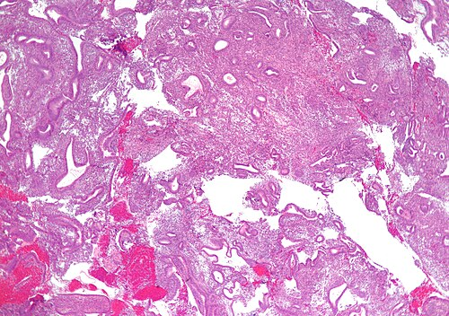
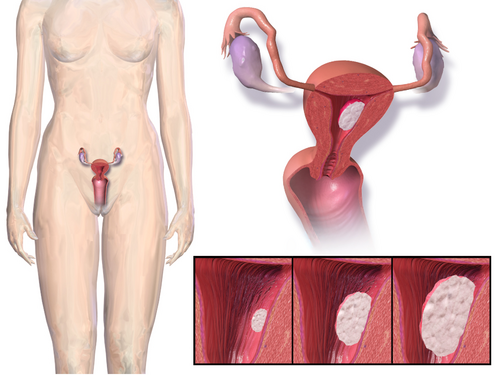

# HIPERPLASIA ENDOMETRIAL E SANGRAMENTO PÓS-MENOPAUSA

O sangramento pós-menopausa (SPM) é um dos temas mais prevalentes nas provas de residência médica e, curiosamente, um dos que mais geram confusão no raciocínio clínico do aluno. Para entender este tema, você precisa primeiro internalizar uma regra de ouro que repetirei várias vezes: na pós-menopausa, todo sangramento é câncer de endométrio até que se prove o contrário, embora, estatisticamente, a causa mais comum seja a atrofia.

Parece contraditório, não é? Mas é aqui que o examinador te pega. Ele vai te dar um caso clínico de uma senhora que sangrou, o ultrassom veio normal e ele vai te perguntar qual a causa mais provável. Se você marcar "câncer", errou a estatística. Se ele perguntar qual a sua obrigação como médico, e você não investigar, errou a conduta.

*Figura 1 - Micrografia de hiperplasia endometrial simples sem atipia (coloração H&E). Nota-se glândulas irregulares e dilatadas com arquitetura preservada, resultado de estrogênio sem oposição da progesterona. Fonte: Nephron, CC BY-SA 3.0 | Wikimedia Commons*

## Fisiopatologia: O Equilíbrio Quebrado

Para entender a hiperplasia endometrial, você deve visualizar o endométrio como um solo que responde a estímulos. Durante a vida reprodutiva, temos o estrogênio, que faz o solo "crescer" (proliferação), e a progesterona, que vem depois da ovulação para "organizar" esse solo (secreção) e, eventualmente, descamá-lo.

A hiperplasia ocorre quando temos o que chamamos de "estrogênio sem oposição". Imagine uma torneira de estrogênio aberta sem que ninguém venha fechar com a progesterona. O endométrio cresce de forma desordenada, as glândulas aumentam em número e tamanho, e a arquitetura se perde.

Por que isso acontece com tanta frequência na pós-menopausa ou na perimenopausa?

- **Conversão Periférica (Aromatização):** Este é o conceito favorito das bancas. Em mulheres obesas, o tecido adiposo contém uma enzima chamada aromatase. Ela converte os androgênios (androstenediona) em estrona (um tipo de estrogênio). Portanto, a paciente obesa está em um estado de hiperestrogenismo constante, mesmo sem ovular.

- **Anovulação Crônica:** Comum na transição para a menopausa ou na Síndrome dos Ovários Policísticos (SOP). Se não há ovulação, não há corpo lúteo. Sem corpo lúteo, não há progesterona. A torneira do estrogênio fica aberta.

- **Tumores Ovarianos Produtores de Estrogênio:** Como o tumor de células da granulosa. É raro, mas cai em prova como diagnóstico diferencial de sangramento com massa anexial.

- **Terapia Hormonal (TH) Mal Conduzida:** Prescrever estrogênio isolado para uma mulher que ainda tem útero é um erro gravíssimo. A progesterona é obrigatória para proteger o endométrio.

*Figura 2 - Ilustração do câncer endometrial, principal diagnóstico a ser excluído em todo sangramento pós-menopausa. A investigação é obrigatória mesmo quando a atrofia é a causa mais comum. Fonte: Blausen Medical Communications, CC BY 3.0 | Wikimedia Commons*

## Sangramento Pós-Menopausa: A Investigação Passo a Passo

Quando uma paciente chega ao consultório com sangramento após um ano de amenorreia (definição de menopausa), você deve seguir um roteiro mental rígido. No MedEvo, sempre reforçamos que o diagnóstico em ginecologia começa no exame físico, não no exame de imagem.

### 1. Exame Físico e Especular

Muitos alunos esquecem o básico. Antes de pedir um ultrassom, você precisa olhar o colo do útero e as paredes vaginais.

- **Atrofia Vaginal:** A causa mais comum de sangramento na pós-menopausa. A mucosa está fina, pálida e pode sangrar ao toque ou espontaneamente.

- **Câncer de Colo de Útero:** Um tumor visível no colo pode ser a fonte do sangramento, e o endométrio pode estar perfeitamente normal.

- **Pólipos Cervicais:** Lesões benignas que protruem pelo orifício externo.

### 2. Ultrassonografia Transvaginal (USGTV)

Este é o seu primeiro exame complementar. Ele serve como um "filtro". O que buscamos é a medida do **eco endometrial**.

- **Ponto de Corte Crítico:** Em uma mulher sem terapia hormonal, o eco endometrial deve ser **menor ou igual a 4 mm** (algumas diretrizes aceitam até 5 mm, mas para prova, 4 mm é o limite de segurança mais cobrado).

- **Se o eco for ≤ 4 mm:** O valor preditivo negativo para câncer é altíssimo (cerca de 99%). A conduta é expectante ou tratar a atrofia com estrogênio tópico.

- **Se o eco for > 4 mm:** Você é obrigado a prosseguir a investigação com avaliação histológica (biópsia).

**Cuidado com a Terapia Hormonal (TH):** Se a paciente usa TH combinada contínua, o eco pode ser de até 5 mm. Se for TH sequencial, o eco deve ser avaliado logo após a fase da progesterona (quando o endométrio deve estar mais fino). Se houver sangramento em uso de TH, a investigação deve ser mais criteriosa, muitas vezes partindo para a biópsia mesmo com ecos limítrofes.

### 3. Avaliação Histológica: O Padrão-Ouro

Se o ultrassom mostrou um endométrio de 12 mm, você precisa de tecido para o patologista analisar. Temos três caminhos principais:

- **Histeroscopia com Biópsia Dirigida:** É o padrão-ouro atual. Por que? Porque eu estou vendo onde estou coletando. Se houver um pólipo ou uma lesão focal, eu vou direto nela. A curetagem uterina é "cega" e pode deixar passar lesões focais em até 25% dos casos.

- **Biópsia por Aspiração (Pipelle):** Ótima para consultório, barata e rápida. Se vier positiva para câncer, resolveu o problema. Se vier negativa ou "insuficiente" em uma paciente que continua sangrando, você ainda precisará da histeroscopia.

- **Curetagem Uterina:** Reservada para quando a histeroscopia não está disponível ou quando o sangramento é tão intenso que precisa de uma medida de esvaziamento rápido.

### Tabela 1: Diagnóstico Diferencial do Sangramento Pós-Menopausa

| Causa | Frequência | Característica ao USG | Conduta Inicial |
| --- | --- | --- | --- |
| **Atrofia Endometrial** | Mais comum (60-80%) | Eco < 4 mm, linear | Observação ou Estrogênio tópico |
| **Pólipo Endometrial** | Frequente | Imagem hiperecogênica, focal | Histeroscopia cirúrgica |
| **Hiperplasia** | Intermediária | Eco espessado, homogêneo | Biópsia (Histeroscopia) |
| **Câncer de Endométrio** | 10% dos casos | Eco espessado, heterogêneo | Biópsia + Estadiamento |
| **Mioma Submucoso** | Menos comum na PM | Distorção da cavidade | Histeroscopia |

## Hiperplasia Endometrial: A Nova Classificação (OMS 2014)

Esqueça as classificações antigas de "simples", "complexa", "cística". Isso só serve para confundir. A Organização Mundial da Saúde simplificou tudo em 2014, e é isso que as bancas cobram hoje. O que define o prognóstico e a conduta não é mais a arquitetura (simples vs. complexa), mas sim a presença de **atipia celular**.

Agora só existem dois grupos:

### 1. Hiperplasia Endometrial Sem Atipia

As glândulas estão aumentadas, mas as células ainda parecem normais.

- **Risco de progressão para câncer:** Muito baixo (menos de 1% a 3% em 20 anos).

- **O "Porquê" da conduta:** Como o risco é baixo, não precisamos de cirurgia agressiva. O objetivo é reverter o estímulo estrogênico.

### 2. Hiperplasia Endometrial Atípica (ou Neoplasia Intraepitelial Endometrioide - NIE)

Aqui as células já apresentam alterações nucleares, perda de polaridade e outras características pré-malignas.

- **Risco de progressão para câncer:** Altíssimo (cerca de 30% a 40%).

- **O "Porquê" da conduta:** Devido ao alto risco de coexistência com câncer oculto (já presente em até 40% das peças de histerectomia) ou progressão rápida, a conduta é cirúrgica.

## Tratamento: Decidindo o Futuro da Paciente

Aqui é onde o Dr. Will sempre avisa: a prova vai tentar te induzir ao erro misturando a idade da paciente com o tipo de hiperplasia. Fique atento.

### Manejo da Hiperplasia SEM Atipia

O tratamento é clínico. Queremos "limpar" esse endométrio usando progesterona.

- **Primeira Escolha:** Progestogênios. Pode ser o DIU de Levonorgestrel (o mais eficaz, segundo a FEBRASGO e diretrizes internacionais) ou progesterona oral (Acetato de Medroxiprogesterona 10mg/dia ou Noretisterona).

- **Duração:** Pelo menos 6 meses.

- **Controle:** Biópsia de controle após 6 meses. Se houver regressão, pode-se manter a progesterona ou apenas observar (se os fatores de risco, como obesidade, forem controlados).

- **Quando operar?** Apenas se a paciente não responder ao tratamento após 12 meses, se a hiperplasia progredir para atípica ou se o sangramento for persistente e incômodo.

### Manejo da Hiperplasia COM Atipia (Atípica)

O tratamento é, via de regra, cirúrgico.

- **Padrão-Ouro:** Histerectomia Total (corpo + colo). Na pós-menopausa, associamos a Salpingo-ooforectomia Bilateral (SOB).

- **Por que não fazer apenas a biópsia e observar?** Porque o risco de já haver um adenocarcinoma invasor ali do lado, que a biópsia não pegou, é de quase 40%.

- **Exceção (Rara em prova, mas importante):** Mulheres jovens que ainda desejam engravidar. Nesses casos selecionados, pode-se tentar progesterona em altas doses e biópsias trimestrais, mas isso é conduta de especialista e exige vigilância extrema. Para a prova de residência geral: Atipia = Histerectomia.

### Tabela 2: Resumo de Condutas na Hiperplasia Endometrial

| Tipo de Hiperplasia | Conduta Preferencial | Alternativa | Seguimento |
| --- | --- | --- | --- |
| **Sem Atipia** | Progesterona (DIU-Lng ou Oral) | Observação (se fator de risco removido) | Biópsia em 6 meses |
| **Atípica (NIE)** | Histerectomia Total | Progesterona (apenas se desejo de prole) | Se não operar: biópsia 3/3 meses |

## Fatores de Risco para Câncer de Endométrio

Você precisa decorar estes fatores, pois eles aparecem no enunciado para te "dar a dica" de que o endométrio está em perigo. Lembre-se do conceito de "exposição estrogênica prolongada".

- **Idade:** Mais comum após os 60 anos.

- **Obesidade:** O fator de risco isolado mais importante (aromatização periférica).

- **Nuliparidade:** A gravidez é um período de "descanso" endometrial (muita progesterona). Quem nunca engravidou não teve esse descanso.

- **Menarca Precoce e Menopausa Tardia:** Mais tempo menstruando = mais ciclos de estrogênio.

- **Diabetes e Hipertensão:** Frequentemente associados à obesidade (Síndrome Metabólica).

- **Tamoxifeno:** Atenção aqui! O tamoxifeno é um modulador seletivo do receptor de estrogênio (SERM). Ele é antiestrogênico na mama (ótimo para o câncer de mama), mas é **agonista estrogênico no útero**. Pacientes em uso de tamoxifeno têm maior risco de hiperplasia e pólipos.

- **Síndrome de Lynch (HNPCC):** Câncer colorretal hereditário não poliposo. Essas pacientes têm um risco altíssimo de câncer de endométrio (muitas vezes maior que o risco de câncer de cólon).

## Situações Especiais e Pegadinhas de Prova

### O Papanicolau e o Endométrio

Um erro clássico é achar que o preventivo (Papanicolau) serve para diagnosticar câncer de endométrio. O Papanicolau rastreia colo de útero. No entanto, se o laudo vier com "células endometriais em mulher com mais de 45 anos" ou "na pós-menopausa", isso é um sinal de alerta e exige investigação do endométrio, mesmo que a paciente não esteja sangrando.

### Lâmina Líquida no Útero

Às vezes, o ultrassom mostra uma pequena quantidade de líquido dentro da cavidade uterina (mucometra ou hidrometra). Se o eco endometrial (a espessura da parede) for fino e a paciente não tiver sintomas, isso geralmente é decorrente de estenose do canal cervical por atrofia. Não é sinal de malignidade por si só. Mas, se houver sangramento associado, investigue.

### Pólipo Endometrial

O pólipo é uma projeção focal do endométrio. Na pós-menopausa, mesmo que seja benigno na maioria das vezes, o pólipo que sangra deve ser retirado por histeroscopia. Se for um achado incidental (paciente assintomática) e for pequeno (< 1 cm), pode-se discutir a observação, mas a tendência em provas é indicar a polipectomia histeroscópica para avaliação histológica completa.

### Mioma Submucoso

Embora os miomas tendam a regredir na menopausa (pela falta de estrogênio), um mioma submucoso pode causar sangramento persistente. O diagnóstico diferencial com pólipo é feito pela ecogenicidade ao ultrassom e pela visão direta na histeroscopia.

## Exemplo Clínico para Fixação

**Caso:** Dona Lurdes, 68 anos, IMC 34 kg/m², diabética, apresenta sangramento vaginal discreto há 2 dias. Refere que sua última menstruação foi aos 50 anos. Não faz uso de terapia hormonal.

**O que o examinador quer de você?**

- **Primeiro passo:** Exame especular. (Para ver se o sangue vem do colo ou da vagina).

- **Exame de imagem:** Ultrassom Transvaginal.

- **Resultado do USG:** Eco endometrial de 9 mm.

- **Próximo passo:** Histeroscopia com biópsia dirigida.

- **Resultado da Biópsia:** Hiperplasia endometrial sem atipias.

- **Tratamento:** Progesterona (ex: DIU de Levonorgestrel ou Acetato de Medroxiprogesterona) e orientar perda de peso (MEV).

**E se o resultado fosse Hiperplasia Atípica?**
A resposta seria: Histerectomia Total + Salpingo-ooforectomia Bilateral.

## Tratamento Não-Farmacológico e MEV

Não subestime a Mudança de Estilo de Vida (MEV) em provas de ginecologia endócrina. Como a obesidade é o motor da produção de estrona, o controle ponderal é fundamental.

- **Atividade Física:** Mínimo de 150 minutos de atividade moderada por semana (conforme diretrizes da OMS).

- **Dieta:** Redução de açúcares simples e gorduras saturadas para controle da resistência insulínica, que está diretamente ligada à proliferação endometrial.

## Ética Médica e Comunicação

Em questões de prova que envolvem o diagnóstico de câncer ou lesões pré-neoplásicas, lembre-se: o médico tem o dever ético de informar o diagnóstico de forma clara e honesta à paciente. Nunca esconda um resultado de biópsia "para não assustar". A autonomia da paciente deve ser respeitada, e ela deve participar da decisão terapêutica após ser informada sobre os riscos de progressão (especialmente na hiperplasia atípica).

## Pontos-Chave para Prova

- **Causa mais comum de SPM:** Atrofia endometrial/vaginal.

- **Causa mais importante a excluir:** Adenocarcinoma de endométrio.

- **Eco endometrial normal na pós-menopausa:** ≤ 4 mm (alto valor preditivo negativo).

- **Fator de risco principal:** Obesidade (aromatização periférica de androgênios em estrona).

- **Tamoxifeno:** Aumenta o risco de hiperplasia e câncer de endométrio (agonista uterino).

- **Classificação OMS 2014:** Divide em "Sem Atipia" e "Atípica". A arquitetura (simples/complexa) não é mais o critério principal.

- **Tratamento Sem Atipia:** Progesterona (clínico).

- **Tratamento Com Atipia:** Histerectomia (cirúrgico).

- **Histeroscopia com biópsia:** Padrão-ouro para investigação de endométrio espessado.

- **Papanicolau:** Não é exame de rastreio para endométrio, mas células endometriais na pós-menopausa exigem investigação.

- **TRH e Sangramento:** Mulheres com útero DEVEM usar progesterona associada ao estrogênio. Se sangrar em uso de TH, investigue.

- **Lâmina líquida isolada:** Geralmente benigna (estenose cervical), mas se houver sangramento ou eco espessado, biópsia nela.

- **Diabetes e HAS:** São coadjuvantes da obesidade no risco para câncer endometrial.

- **Síndrome de Lynch:** Risco genético altíssimo para câncer de endométrio.

- **Polipectomia:** Indicada se o pólipo for sintomático ou na pós-menopausa para excluir malignidade focal.

- **Erro clássico:** Achar que toda hiperplasia precisa de cirurgia. Apenas as atípicas têm indicação formal imediata de histerectomia. 🩺

 Cópia offline para consulta pessoal.
 Fonte original:
 [https://www.medevo.com.br/material-apoio/ler/e029c886-81fc-4e31-b700-f2dec0062a9a](https://www.medevo.com.br/material-apoio/ler/e029c886-81fc-4e31-b700-f2dec0062a9a)
