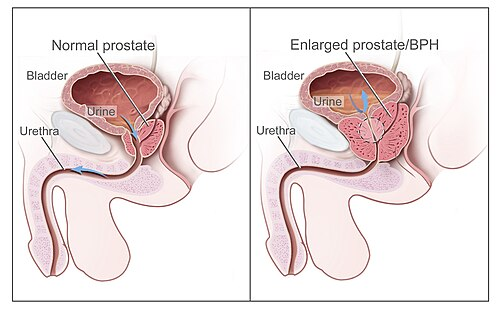
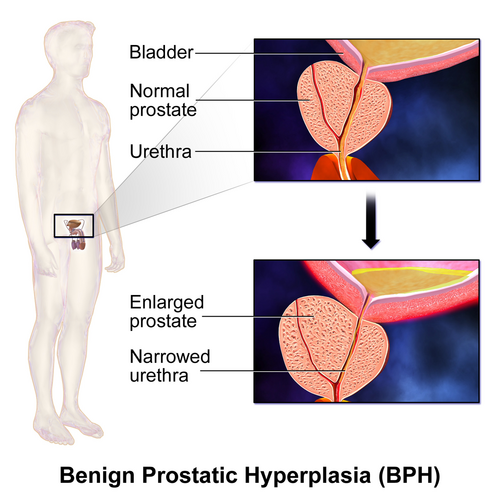

# HIPERPLASIA PROSTÁTICA BENIGNA (HPB): DIAGNÓSTICO E TRATAMENTO

A Hiperplasia Prostática Benigna (HPB) é, sem dúvida, um dos temas que você mais encontrará na sua vida prática e, consequentemente, nas provas de residência. Não é apenas "próstata aumentada"; é um processo fisiopatológico complexo que envolve histologia, anatomia e dinâmica miccional.

Para entender a HPB, você precisa primeiro esquecer a ideia de que o tamanho da próstata dita o sintoma. Já vi muitos alunos errarem questões por acharem que uma próstata de 80g sempre causa mais sintomas que uma de 30g. Isso é falso. O que importa é a obstrução e a resposta da bexiga a essa obstrução.

*Figura 1 - Comparação entre anatomia prostática normal (esquerda) e hiperplasia prostática benigna (direita), mostrando a compressão uretral e obstrução do fluxo urinário pela próstata aumentada. Fonte: National Cancer Institute, Domínio Público | Wikimedia Commons*

## Fisiopatologia e Anatomia: Onde tudo começa

A HPB é uma neoplasia benigna — a mais comum em homens idosos. Ela se caracteriza pelo aumento do número de células (hiperplasia) tanto do estroma quanto do epitélio glandular. O "porquê" disso acontecer envolve um desequilíbrio entre a proliferação celular e a apoptose (morte celular programada). Com o envelhecimento, esse equilíbrio se perde, e a próstata cresce.

Aqui mora a primeira grande pegadinha de prova: a localização.
Segundo a classificação de McNeal, a próstata é dividida em zonas. A HPB ocorre predominantemente na **Zona de Transição**. Guarde isso. O Adenocarcinoma de Próstata (câncer), por outro lado, surge preferencialmente na **Zona Periférica** (cerca de 70% dos casos).

Por que isso é clinicamente relevante? Como a zona de transição envolve a uretra proximal, o crescimento nessa área comprime o lúmen uretral, gerando os sintomas obstrutivos. Já o câncer, por estar na periferia, costuma ser silencioso até fases avançadas, sendo detectado pelo toque retal ou PSA.

### O papel da Di-hidrotestosterona (DHT)

A testosterona circula no sangue, mas na próstata ela é convertida em DHT pela enzima **5-alfa-redutase**. A DHT tem uma afinidade muito maior pelos receptores androgênicos e é a principal responsável pelo crescimento tecidual. Entender isso é fundamental para compreender por que usamos inibidores da 5-alfa-redutase no tratamento.

## Quadro Clínico: Os Sintomas do Trato Urinário Inferior (STUI)

Antigamente falávamos em "prostatismo", mas o termo correto hoje é STUI (ou LUTS, em inglês). Eles são divididos em dois grupos principais, e as bancas adoram misturá-los para testar se você sabe diferenciar a fase de enchimento da fase de esvaziamento.

### Sintomas Obstrutivos (ou de Esvaziamento)

Resultam da obstrução mecânica (o tamanho da próstata) e do componente dinâmico (tônus do músculo liso).

- Jato urinário fraco ou intermitente.

- Hesitação (demora para começar a urinar).

- Esforço miccional.

- Gotejamento terminal.

- Sensação de esvaziamento incompleto.

### Sintomas Irritativos (ou de Armazenamento)

Estes surgem porque a bexiga, tentando vencer a obstrução, torna-se hiperativa ou "instável". O músculo detrusor sofre hipertrofia e perde complacência.

- Polaciúria (aumento da frequência).

- Urgência miccional.

- Nictúria (o sintoma que mais impacta a qualidade de vida).

- Incontinência por urgência.

**Exemplo Clínico:** Paciente de 68 anos queixa-se que precisa acordar 4 vezes à noite para urinar e que o jato está "fraquinho". Ele apresenta sintomas de armazenamento (nictúria) e de esvaziamento (jato fraco). Este é o cenário clássico da HPB.

## Avaliação Diagnóstica: O que é essencial?

Na Unidade Básica de Saúde ou no consultório, você não precisa de exames mirabolantes de imediato. O diagnóstico é clínico e baseado em propedêutica básica.

### 1. Anamnese e IPSS

O *International Prostate Symptom Score* (IPSS) é um questionário de 7 perguntas que quantifica os sintomas.

- 0-7 pontos: Sintomas leves.

- 8-19 pontos: Sintomas moderados.

- 20-35 pontos: Sintomas graves.

O IPSS não dá o diagnóstico de HPB, mas ele é fundamental para definir a conduta (observação vs. medicação vs. cirurgia) e para acompanhar a resposta ao tratamento.

### 2. Exame Físico: O Toque Retal

O toque retal é obrigatório. Na HPB, esperamos encontrar uma próstata aumentada de volume (>20g ou >2 polpas digitais), de consistência **fibroelástica**, indolor e sem nódulos.

- **Atenção:** Se encontrar um nódulo ou consistência pétrea, sua suspeita muda para Câncer de Próstata, independentemente do tamanho.

- **Dica do Dr. Will:** O médico da APS deve realizar o toque antes de qualquer encaminhamento. É um exame de baixo custo e alta valia.

### 3. Exames Laboratoriais

- **Urina I (EAS) e Urocultura:** Para descartar Infecção do Trato Urinário (ITU) ou hematúria, que podem mimetizar ou complicar a HPB.

- **Creatinina:** Fundamental para avaliar a função renal. Lembre-se que a HPB pode causar uropatia obstrutiva e insuficiência renal pós-renal.

- **PSA (Antígeno Prostático Específico):** Usado para rastreamento de câncer e como marcador de volume prostático (PSAs mais altos geralmente indicam próstatas maiores e maior risco de progressão).

### 4. Exames de Imagem e Outros

- **Ultrassonografia (USG):** Útil para medir o Volume Prostático e, principalmente, o **Resíduo Pós-Miccional (RPM)**. Um resíduo elevado (>100-200ml) indica falha de esvaziamento.

- **Urofluxometria:** Exame não invasivo que mede a velocidade do jato. Um fluxo máximo (Qmax) < 10 ml/s sugere obstrução.

- **Estudo Urodinâmico:** Não é rotina! É reservado para casos de dúvida diagnóstica, falha de tratamento ou antes de cirurgias em pacientes com doenças neurológicas. Ele é o padrão-ouro para confirmar obstrução infravesical.

| Exame | Objetivo na HPB |
| --- | --- |
| Toque Retal | Avaliar tamanho, consistência e excluir nódulos (Câncer). |
| IPSS | Quantificar gravidade e guiar tratamento. |
| PSA | Rastreio de CA e preditor de progressão da HPB. |
| Creatinina | Avaliar se há lesão renal obstrutiva. |
| Urina I | Excluir infecção e hematúria. |
| USG de Vias Urinárias | Avaliar parênquima renal e resíduo pós-miccional. |

## Diagnóstico Diferencial: Não confunda!

Muitas doenças causam STUI. A prova vai tentar te induzir ao erro colocando um paciente jovem com jato fraco.

- **Estenose de Uretra:** Comum em pacientes com história de trauma, instrumentação uretral ou uretrites prévias. Suspeite se houver falha na passagem de cateter uretral.

- **Câncer de Próstata:** Geralmente assintomático no início. Toque retal com nódulo ou PSA elevado.

- **Bexiga Hiperativa:** Sintomas predominantemente irritativos (urgência) sem causa obstrutiva óbvia.

- **Prostatite:** Quadro agudo com febre, dor pélvica e próstata extremamente dolorosa ao toque.

*Figura 2 - Ilustração da Hiperplasia Prostática Benigna demonstrando o aumento da zona de transição com compressão uretral e deformação vesical. Fonte: BruceBlaus, CC BY-SA 4.0 | Wikimedia Commons*

## Tratamento Clínico: Quando e como intervir?

O tratamento não visa "curar" a HPB (a próstata não vai sumir), mas sim melhorar a qualidade de vida e prevenir complicações.

### 1. Observação Vigilante (Watchful Waiting)

Indicada para pacientes com sintomas leves (IPSS < 8) ou sintomas moderados que não incomodam o paciente.

- **Medidas Comportamentais:** Reduzir ingestão de líquidos à noite, evitar cafeína e álcool (irritantes vesicais), e revisar medicamentos (diuréticos, anticolinérgicos).

### 2. Alfabloqueadores (Ação no Componente Dinâmico)

São a **primeira linha** para alívio rápido dos sintomas. Eles relaxam a musculatura lisa do colo vesical e da próstata.

- **Drogas:** Doxazosina (mais comum no SUS), Tansulosina (mais seletiva, menos hipotensão), Terazosina.

- **Início de ação:** Rápido (dias).

- **Efeitos colaterais:** Hipotensão postural, tontura e ejaculação retrógrada.

- **Pérola de Prova:** Eles NÃO alteram o tamanho da próstata e NÃO alteram o PSA.

### 3. Inibidores da 5-alfa-redutase (Ação no Componente Estático)

Atuam bloqueando a conversão da testosterona em DHT, levando à atrofia do epitélio glandular.

- **Drogas:** Finasterida (5mg/dia), Dutasterida.

- **Indicação:** Próstatas volumosas (>30-40g).

- **Início de ação:** Lento (6 a 12 meses para efeito máximo).

- **Efeitos colaterais:** Disfunção erétil, redução da libido e ginecomastia.

- **Pérola de Prova:** Eles **reduzem o volume prostático em 20-25%** e **reduzem o valor do PSA pela metade** após 6 meses. Se o seu paciente usa Finasterida há um ano e o PSA veio 3,0, o valor real para fins de rastreamento é 6,0!

### 4. Terapia Combinada

A associação de Alfabloqueador + Inibidor da 5-alfa-redutase é superior à monoterapia em pacientes com próstatas grandes e risco de progressão (estudo MTOPS). É a escolha para evitar Retenção Urinária Aguda (RUA) e necessidade de cirurgia a longo prazo.

| Classe | Medicamento | Mecanismo | Efeito no PSA |
| --- | --- | --- | --- |
| Alfabloqueador | Tansulosina / Doxazosina | Relaxa músculo liso | Nenhum |
| Inibidor 5-AR | Finasterida / Dutasterida | Reduz volume glandular | Reduz em 50% |
| Inibidor PDE5 | Tadalafila 5mg | Melhora fluxo e disfunção | Nenhum |

## Indicações Cirúrgicas: O "Pulo do Gato" para a Prova

Este é o tópico mais cobrado. Você precisa saber quando o tratamento clínico não é mais suficiente. Existem as indicações **absolutas** (complicações da HPB).

### Indicações Absolutas de Cirurgia:

- **Retenção Urinária Refratária:** Paciente que tentou tirar a sonda após tratamento medicamentoso e não conseguiu urinar.

- **Infecções Urinárias de Repetição:** Causadas pelo estase urinária.

- **Hematúria Macroscópica Persistente:** Originada de varizes prostáticas (após excluir causas malignas).

- **Cálculos Vesicais:** Sinal de que a estase é crônica e grave.

- **Insuficiência Renal Obstrutiva:** Hidronefrose bilateral por HPB.

- **Divertículos Vesicais Grandes:** Que causam má função da bexiga.

### Técnicas Cirúrgicas

- **RTU de Próstata (Ressecção Transuretral):** É o **padrão-ouro** para próstatas de até 80g. É uma cirurgia endoscópica ("raspagem").

- **Prostatectomia Aberta (Suprapúbica ou Millin):** Indicada para próstatas muito volumosas (>80-100g) ou quando há necessidade de tratar algo associado (ex: cálculo vesical grande).

- **Laser (Greenlight ou HoLEP):** Excelentes para pacientes anticoagulados, pois sangram menos.

**Cuidado com a Síndrome da RTU:** Durante a RTU, usa-se líquido de irrigação (geralmente glicina ou manitol, que são hipotônicos). Se houver absorção excessiva para a corrente sanguínea, o paciente desenvolve **hiponatremia dilucional**. Os sintomas são cefaleia, confusão mental, náuseas, vômitos e hipertensão. O tratamento envolve diuréticos e, em casos graves, solução salina hipertônica.

## Situações de Urgência: Retenção Urinária Aguda (RUA)

Imagine o cenário: Idoso chega ao pronto-socorro com dor suprapúbica intensa, sem urinar há 12 horas, com um "balão" palpável no hipogástrio (bexigoma).

**Conduta Imediata:** Desobstrução.

- **Sondagem Vesical de Demora (Foley):** É a primeira escolha.

- **Punção Suprapúbica (Cistostomia):** Se a sondagem uretral falhar (ex: estenose de uretra ou próstata muito volumosa que impede a passagem).

Após a desobstrução, se houver sinais de insuficiência renal (IRA pós-renal) ou hipercalemia, o paciente deve ser internado para monitorização da fase poliúrica pós-obstrutiva e correção hidroeletrolítica.

**Dica MedEvo:** Se o paciente teve uma RUA, a conduta após passar a sonda é iniciar Alfabloqueador (ex: Doxazosina) e tentar retirar a sonda após 3 a 7 dias (o chamado "teste de retirada"). Se falhar novamente, o caminho é a cirurgia.

## Complicações da HPB não tratada

A obstrução crônica não afeta apenas a uretra. A bexiga é a maior vítima.

- **Fase de Compensação:** Hipertrofia do detrusor, formação de trabeculações e divertículos.

- **Fase de Descompensação:** A bexiga se torna atônica, dilatada. Surge a **Incontinência por Transbordamento** (o paciente está tão cheio que a urina "vaza" aos poucos). Isso pode ser confundido com enurese noturna.

- **Uretero-hidronefrose:** A pressão da bexiga impede a descida da urina dos rins, levando à perda de função renal.

## Bacteriúria Assintomática no Idoso

Este é um conceito que transborda da urologia para a infectologia e clínica médica, mas cai muito em questões de HPB.
Homem idoso com urocultura positiva, mas **sem nenhum sintoma** urinário novo: **NÃO TRATAR**.
A única exceção é se ele for submetido a um procedimento urológico que envolva sangramento ou instrumentação (como uma RTU de próstata ou biópsia). Nesses casos, o tratamento é obrigatório para evitar urossepsias.

## Pontos-Chave para Prova 🎯

- **Localização:** HPB nasce na Zona de Transição; Câncer nasce na Zona Periférica.

- **IPSS:** Escala de 0 a 35. Define gravidade, não diagnóstico. >20 é grave.

- **Toque Retal:** Fibroelástico na HPB; Pétreo/Nodular no Câncer.

- **Alfabloqueadores:** Primeira linha para sintomas. Agem rápido. Efeito colateral: Hipotensão e ejaculação retrógrada.

- **Inibidores da 5-alfa-redutase:** Reduzem volume da próstata e reduzem PSA em 50%. Demoram meses para agir.

- **Indicações Cirúrgicas Absolutas:** Retenção refratária, ITU de repetição, cálculo vesical, hematúria persistente, insuficiência renal.

- **RTU de Próstata:** Padrão-ouro para próstatas < 80g. Risco de Síndrome da RTU (hiponatremia).

- **Prostatectomia Aberta:** Reservada para próstatas > 80-100g.

- **PSA:** Na HPB, o PSA pode estar aumentado pelo volume, mas sempre deve-se excluir câncer se houver suspeita.

- **IRA Pós-Renal:** HPB é uma causa importante. O tratamento inicial é sempre a desobstrução (sondagem).

- **Bexiga de Transbordamento:** Ocorre na fase avançada (bexiga atônica). O paciente perde urina por excesso de resíduo.

- **Bacteriúria Assintomática:** Só trate se o paciente for operar a próstata.

- **Estenose de Uretra:** Principal diagnóstico diferencial em casos de cateterismo vesical difícil.

- **Finasterida e PSA:** Sempre multiplique o PSA por 2 se o paciente usar a droga por mais de 6 meses.

- **Síndrome da RTU:** Cefaleia + Confusão + Hiponatremia. Causa: Absorção de líquido hipotônico.

- **Tratamento Inicial:** Sintomas moderados/graves sem complicações -> Alfabloqueador + Medidas comportamentais.

- **Fator Genético:** A HPB tem um forte componente hereditário, especialmente em casos de início precoce.

- **Constipação:** O reto distendido pode piorar os sintomas de bexiga hiperativa em pacientes com HPB.

 Cópia offline para consulta pessoal.
 Fonte original:
 [https://www.medevo.com.br/material-apoio/ler/151a8f37-05dd-442c-b5cd-0c47066fede9](https://www.medevo.com.br/material-apoio/ler/151a8f37-05dd-442c-b5cd-0c47066fede9)
