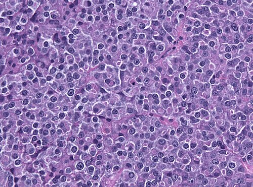

# HIPERPROLACTINEMIA

Para entender a hiperprolactinemia, você precisa primeiro esquecer a ideia de que a hipófise "decide" liberar prolactina por conta própria. No nosso corpo, a regra para a maioria dos hormônios é o estímulo. Para a prolactina, a regra é a inibição. Imagine que a hipófise é um carro em uma ladeira: o estado natural dela é descer (produzir prolactina). O hipotálamo é o motorista que mantém o pé no freio o tempo todo. Esse freio chama-se dopamina.

Se você entender que a hiperprolactinemia é, na maioria das vezes, alguém tirando o pé do freio ou algo empurrando o carro ladeira abaixo, você domina qualquer questão de prova.

*Figura 1 - Complexo hipotálamo-hipofisário e sistema porta-hipofisário. A dopamina produzida no hipotálamo mantém a inibição tônica da secreção de prolactina pelos lactotrofos da adenohipófise. Fonte: OpenStax College, CC BY 3.0 | Wikimedia Commons*

## Fisiologia: O Eixo Hipotálamo-Hipofisário

A prolactina é produzida pelos lactotrofos na adenohipófise. Diferente do FSH e do LH, que precisam do GnRH para serem liberados, a prolactina vive sob um regime de controle negativo tônico exercido pela dopamina hipotalâmica. A dopamina viaja pelo sistema porta-hipofisário, liga-se aos receptores D2 nos lactotrofos e diz: "não secretem prolactina".

Por que isso é importante para a sua prova? Porque qualquer coisa que interrompa o fluxo de dopamina do hipotálamo para a hipófise (como um tumor comprimindo a haste hipofisária) vai causar aumento da prolactina. É o chamado "efeito haste".

Além do freio (dopamina), temos os aceleradores. O principal estimulador fisiológico da prolactina, além da sucção mamilar, é o TRH (Hormônio Liberador de Tireotrofina). Guarde esse nome. Em provas de residência, o hipotireoidismo primário é uma das causas favoritas de hiperprolactinemia justamente porque o TRH elevado tenta estimular a tireoide, mas acaba estimulando também os lactotrofos.

Outro acelerador potente é o estrogênio. Ele estimula diretamente a síntese de prolactina e a hiperplasia dos lactotrofos. É por isso que, durante a gestação, a hipófise da mulher aumenta de tamanho, chegando a dobrar de volume. Como diz o Dr. Will nas discussões do MedEvo, nunca ignore o impacto do estrogênio na arquitetura hipofisária.

## Etiologia: Por que a Prolactina Sobe?

As causas podem ser divididas em três grandes grupos: fisiológicas, farmacológicas e patológicas.

### Causas Fisiológicas

Antes de pedir uma Ressonância Magnética (RM), você deve descartar o óbvio. A causa fisiológica mais comum é a gestação. Outras incluem:

- Amamentação (o estímulo da sucção inibe a dopamina).

- Sono (picos de prolactina ocorrem durante o sono profundo).

- Estresse físico ou emocional (o estresse aumenta o CRH, que pode influenciar a secreção).

- Exercício físico intenso.

- Estimulação mamilar ou manipulação das mamas.

### Causas Farmacológicas (O "Terror" das Bancas)

Esta é a seção que mais cai. Se a paciente usa alguma medicação que bloqueia o receptor de dopamina ou depleta a dopamina central, a prolactina vai subir.

- Antipsicóticos: Risperidona é a campeã de questões. Ela é um potente antagonista D2. Haloperidol também é clássico.

- Antieméticos: Metoclopramida e Bromoprida. Cuidado: a Domperidona também aumenta a prolactina, mas como ela não atravessa bem a barreira hematoencefálica, é frequentemente usada como galactogogo em situações específicas, com menor risco de efeitos colaterais centrais no lactente.

- Anti-hipertensivos: Metildopa (atua como um falso neurotransmissor, reduzindo a dopamina).

- Antidepressivos: Tricíclicos (Amitriptilina) e alguns ISRS.

- Opióides e bloqueadores H2 (Cimetidina).

Dica de prova: Se a questão apresenta uma paciente com amenorreia, galactorreia e uso de Risperidona, o primeiro passo não é a RM, mas sim a exclusão de gravidez e, se possível, a reavaliação da medicação com o psiquiatra.

### Causas Patológicas

Aqui entram os tumores e as doenças sistêmicas.

- Prolactinomas: São os tumores hipofisários funcionais mais comuns. Dividem-se em Microadenomas (< 10 mm) e Macroadenomas (≥ 10 mm).

- Hipotireoidismo Primário: TSH alto e T4 livre baixo. O aumento do TRH estimula a prolactina.

- Insuficiência Renal Crônica: A prolactina é excretada pelo rim. Se o rim falha, ela acumula. Além disso, a uremia altera o tônus dopaminérgico.

- Cirrose Hepática: Alteração no metabolismo periférico de hormônios.

- Lesões da Parede Torácica: Herpes zoster intercostal, queimaduras ou cirurgias torácicas podem simular o arco reflexo da sucção mamilar.

## Quadro Clínico: O que a Paciente Sente?

O excesso de prolactina causa sintomas por dois mecanismos: o efeito direto do hormônio e a inibição do eixo gonadotrófico.

A prolactina alta inibe a pulsatilidade do GnRH no hipotálamo. Sem GnRH pulsátil, não temos FSH e LH adequados. O resultado? Hipogonadismo hipogonadotrófico.

### Sintomas em Mulheres

- Irregularidade Menstrual: Desde oligomenorreia até amenorreia secundária.

- Infertilidade: Por anovulação.

- Galactorreia: Saída de leite pelas mamas. Atenção: galactorreia não é patognomônico de prolactinoma e nem toda mulher com hiperprolactinemia terá galactorreia (apenas cerca de 30 a 80%).

- Redução da Libido e Dispareunia: Pela queda do estrogênio (atrofia vaginal).

### Sintomas em Homens

- Disfunção Erétil e Redução da Libido.

- Infertilidade e Oligospermia.

- Ginecomastia (raro ter galactorreia no homem).

### Sintomas de Efeito de Massa (Macroadenomas)

Quando o tumor é grande, ele comprime estruturas vizinhas:

- Cefaleia.

- Hemianopsia Bitemporal: Compressão do quiasma óptico, levando à perda da visão periférica. Se a questão fala em "dificuldade para dirigir" ou "esbarrar nos móveis", pense nisso.

- Hipopituitarismo: Compressão do restante da glândula, reduzindo outros hormônios (TSH, ACTH, GH).

*Figura 2 - Biópsia histológica de adenoma hipofisário produtor de prolactina (prolactinoma), a causa tumoral mais frequente de hiperprolactinemia. Coloração H&E. Fonte: Jensflorian, CC BY-SA 3.0 | Wikimedia Commons*

## Diagnóstico: O Caminho das Pedras

O diagnóstico de hiperprolactinemia é laboratorial, mas a investigação da causa exige método.

### Passo 1: Confirmar e Excluir Causas Óbvias

Dosagem de Prolactina (PRL): O valor normal costuma ser até 20-25 ng/mL.

- Sempre peça um β-hCG. Nunca investigue hipófise em mulher em idade fértil sem excluir gravidez.

- Peça TSH e T4 Livre. Tratar o hipotireoidismo muitas vezes resolve a prolactina sem precisar de mais nada.

- Avalie função renal (Creatinina) e hepática.

### Passo 2: Interpretar os Valores

Os valores de prolactina nos dão uma pista da etiologia, embora não sejam absolutos:

- PRL < 100 ng/mL: Pode ser qualquer coisa (fármacos, microadenoma, causas sistêmicas, efeito haste).

- PRL > 100 ng/mL: Sugere fortemente prolactinoma (geralmente microadenoma).

- PRL > 200-250 ng/mL: Muito sugestivo de macroadenoma.

### Passo 3: Lidar com as Armadilhas Laboratoriais

#### Macroprolactinemia

Às vezes, a prolactina se liga a moléculas de IgG, formando complexos grandes chamados de Macroprolactina. Esses complexos são biologicamente inativos (não causam sintomas), mas o laboratório os conta na dosagem total.

- Quando suspeitar? Paciente com prolactina alta, mas ciclos regulares e sem galactorreia.

- Como resolver? Solicitar pesquisa de macroprolactina via teste de precipitação com Polietilenoglicol (PEG). Se a recuperação de prolactina após o PEG for < 30-40%, o diagnóstico é macroprolactinemia e você NÃO trata a paciente.

#### Efeito Gancho (Hook Effect)

Esta é a pegadinha favorita de provas de alto nível. Imagine um macroadenoma imenso (4 cm) e uma prolactina que vem apenas levemente alterada (ex: 40 ng/mL). Isso é impossível, certo?
Ocorre que, em níveis absurdamente altos de prolactina, o ensaio laboratorial (sanduíche) fica saturado e não consegue medir corretamente, dando um falso valor baixo.

- Conduta: Solicitar a dosagem da prolactina com diluição da amostra.

### Passo 4: Imagem

A Ressonância Magnética (RM) de sela túrcica com contraste (gadolínio) é o padrão-ouro.

- Quando pedir? Sempre que a causa não for óbvia (não é fármaco, não é gravidez, não é hipotireoidismo) ou quando os níveis de PRL sugerem tumor (> 100 ng/mL).

- Tomografia Computadorizada (TC) só é usada se a RM for contraindicada, pois a sensibilidade para microadenomas é baixa.

| Situação Clínica | Conduta Inicial |
| --- | --- |
| Suspeita de Gravidez | β-hCG |
| Uso de Risperidona | Reavaliar droga / Repetir PRL |
| Sintomas de Hipotireoidismo | TSH e T4 Livre |
| PRL alta + Assintomática | Pesquisa de Macroprolactina |
| Macroadenoma na RM + PRL baixa | Repetir com diluição (Efeito Gancho) |

## Tratamento: Quando e Como Intervir?

Diferente de outros tumores, o tratamento de escolha para o prolactinoma (mesmo o macroadenoma com compressão visual) é CLÍNICO.

### Objetivos do Tratamento

- Normalizar os níveis de prolactina.

- Reduzir o tamanho do tumor.

- Restaurar a função gonadal (fertilidade, libido, massa óssea).

- Aliviar sintomas compressivos.

### Agonistas Dopaminérgicos

Eles mimetizam a dopamina e "pisam no freio" da hipófise.

- Cabergolina: É a primeira escolha.

- Vantagens: Maior eficácia em normalizar a PRL e reduzir o tumor; posologia cômoda (1 a 2 vezes por semana); menos efeitos colaterais.

- Dose inicial: 0,25 mg a 0,5 mg por semana.

- Bromocriptina:

- Vantagens: Mais barata; maior histórico de segurança na gestação (embora a cabergolina seja cada vez mais aceita).

- Desvantagens: Tomada diária; muitos efeitos colaterais gastrointestinais (náuseas, vômitos) e hipotensão postural.

Dica do MedEvo: Se o paciente não tolera a Bromocriptina, a conduta é trocar para Cabergolina.

### Tratamento Cirúrgico

A cirurgia (geralmente por via transesfenoidal) fica reservada para casos de exceção:

- Intolerância ou resistência aos agonistas dopaminérgicos.

- Macroadenomas que causam perda visual progressiva apesar do tratamento clínico.

- Fístula liquórica induzida pelo tratamento clínico (raro, ocorre quando o tumor regride e expõe um orifício na base do crânio).

### Tratamento do Hipotireoidismo

Se a causa da hiperprolactinemia for o hipotireoidismo primário, o tratamento é Levotiroxina. Não use cabergolina aqui! Ao normalizar o TSH, o TRH cai e a prolactina normaliza sozinha.

## Situações Especiais

### Hiperprolactinemia e Gravidez

Este é um tópico quente em Ginecologia Endócrina.

- Desejo de Gestar: A paciente deve ser tratada com agonistas dopaminérgicos para restaurar a ovulação. A RM de sela túrcica deve ser feita antes para saber o tamanho do tumor.

- Confirmou Gravidez: Suspenda o agonista dopaminérgico imediatamente (seja cabergolina ou bromocriptina). O aumento da hipófise na gestação é fisiológico.

- Acompanhamento: Não dosamos prolactina na gestação (ela estará alta fisiologicamente). O acompanhamento é clínico (cefaleia, campo visual).

- Macroadenomas: Se o tumor for grande e estiver perto do quiasma, pode-se manter a medicação ou realizar acompanhamento rigoroso com campo visual a cada trimestre.

### Amenorreia Hipotalâmica Funcional

Cuidado para não confundir. Pacientes com estresse crônico, perda de peso excessiva ou atletas de alta performance podem ter amenorreia. Nelas, o GnRH está baixo por causa do estresse/balanço energético negativo, e a prolactina costuma ser NORMAL. Se estiver levemente alta, é pelo estresse, mas a causa da amenorreia é central (hipotalâmica).

### Insuficiência Ovariana Precoce (IOP)

Na IOP, a paciente tem amenorreia, mas o problema é no ovário. O FSH estará ALTÍSSIMO e a prolactina estará normal. A galactorreia não faz parte do quadro de IOP.

*Figura 2 - Biópsia histológica de adenoma hipofisário produtor de prolactina (prolactinoma), a causa tumoral mais frequente de hiperprolactinemia. Coloração H&E. Fonte: Jensflorian, CC BY-SA 3.0 | Wikimedia Commons*

## Diagnóstico Diferencial de Galactorreia

Nem toda descarga papilar é galactorreia.

- Galactorreia: Saída de aspecto leitoso, geralmente bilateral e multiductal. Causa: Hormonal.

- Descarga Hemática/Serossanguinolenta: Uniductal e unilateral. Causa: Geralmente local (Papiloma intraductal ou Câncer). Conduta: Investigação cirúrgica/biópsia, não é prolactina.

| Causa | TSH | Prolactina | FSH | Conduta |
| --- | --- | --- | --- | --- |
| Hipotireoidismo Primário | Alto | Alto | Normal | Levotiroxina |
| Prolactinoma | Normal | Muito Alto | Baixo/Normal | Agonista Dopaminérgico |
| Falência Ovariana (IOP) | Normal | Normal | Muito Alto | Terapia Hormonal |
| Uso de Risperidona | Normal | Alto | Baixo/Normal | Ajuste da medicação |
| Síndrome de Asherman | Normal | Normal | Normal | Histeroscopia (pós-curetagem) |

## Pontos-Chave para Prova

- A dopamina é o principal inibidor da prolactina. Qualquer bloqueio dopaminérgico causa hiperprolactinemia.

- Primeiro passo na investigação de amenorreia/galactorreia: Excluir gravidez (β-hCG).

- Hipotireoidismo primário causa aumento de PRL via TRH. Trata-se com Levotiroxina.

- Valores de PRL > 200-250 ng/mL são altamente sugestivos de macroadenoma.

- Efeito Gancho: Macroadenoma com PRL baixa/normal. Conduta: Diluir a amostra.

- Macroprolactina: PRL alta em paciente assintomática. Conduta: Teste do PEG. Não tratar.

- Tratamento de escolha para prolactinomas: Clínico (Agonistas Dopaminérgicos). Cabergolina é a primeira escolha.

- Na gestação: Suspender o agonista dopaminérgico assim que confirmar a gravidez.

- Hemianopsia Bitemporal: Sinal clássico de compressão do quiasma óptico por macroadenoma.

- Medicamentos clássicos que aumentam PRL: Risperidona, Metoclopramida, Metildopa, Amitriptilina.

- Nicotina: Curiosidade de prova, ela reduz a prolactina e pode prejudicar a lactação.

- Domperidona: Usada como galactogogo por não atravessar a barreira hematoencefálica significativamente.

- Parestesia perioral e sinal de Chvostek após cirurgia de tireoide: Não é prolactina, é hipocalcemia por hipoparatireoidismo iatrogênico.

- O estrogênio aumenta a prolactina e causa hiperplasia dos lactotrofos (comum na gestação e uso de anticoncepcionais).

- A RM de sela túrcica é o exame de imagem de escolha, mas só deve ser solicitada após excluir causas secundárias (gravidez, drogas, hipotireoidismo). 🧠

 Cópia offline para consulta pessoal.
 Fonte original:
 [https://www.medevo.com.br/material-apoio/ler/85a96dc3-d4b7-4f15-8f13-57acbd78d709](https://www.medevo.com.br/material-apoio/ler/85a96dc3-d4b7-4f15-8f13-57acbd78d709)
