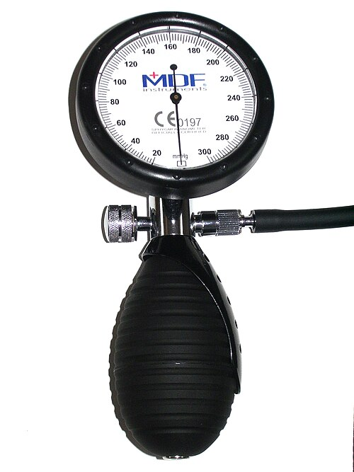

# HIPERTENSÃO ARTERIAL CRÔNICA NA GESTAÇÃO

Para entender a Hipertensão Arterial Crônica (HAC) na gestação, você precisa primeiro esquecer a ideia de que a gravidez é um evento isolado no corpo da mulher. A HAC é uma condição pré-existente que "pega carona" na gestação e traz consigo riscos aumentados tanto para a mãe quanto para o feto. Nas provas de residência, o examinador não quer apenas que você saiba o valor da pressão, ele quer saber se você consegue diferenciar a hipertensa crônica daquela que desenvolveu pré-eclâmpsia, pois a conduta muda completamente.

## Definição e Critérios Diagnósticos

A definição de Hipertensão Arterial Crônica na gestação é baseada no tempo de aparecimento. Guarde este marco: **20 semanas**.

Consideramos HAC quando a hipertensão (PA ≥ 140/90 mmHg) é diagnosticada:

- Antes da gestação;

- Antes de completar 20 semanas de idade gestacional;

- Ou quando ela persiste por mais de 12 semanas após o parto.

Por que 20 semanas? Porque, fisiologicamente, as alterações vasculares da pré-eclâmpsia costumam se manifestar clinicamente após esse período. Se a paciente já chega no primeiro trimestre com a pressão alta, ela já era hipertensa antes de engravidar, mesmo que não soubesse.

Um erro comum em provas é o aluno achar que, se a paciente não tinha diagnóstico prévio, qualquer pressão alta na gravidez é pré-eclâmpsia. Cuidado: se o diagnóstico foi feito com 12 ou 16 semanas, a resposta correta é Hipertensão Arterial Crônica.

### O Fenômeno do Segundo Trimestre

Aqui está uma "pegadinha" fisiológica que o Dr. Will sempre destaca nas discussões do MedEvo: no segundo trimestre, ocorre uma queda fisiológica da resistência vascular periférica devido à invasão trofoblástica e à ação da progesterona.

Isso significa que uma mulher com HAC leve pode apresentar níveis pressóricos normais entre a 16ª e a 24ª semana, "mascarando" a doença. Se você a vir pela primeira vez nesse período, pode achar que ela é normotensa. Quando a pressão sobe novamente no terceiro trimestre, você pode ser induzido ao erro de diagnosticar Hipertensão Gestacional, quando na verdade era uma HAC mascarada pela fisiologia da gestação.

## Classificação e Etiologia

A grande maioria das gestantes com HAC (cerca de 90 a 95%) apresenta **Hipertensão Essencial**, onde não há uma causa secundária identificável, estando associada a fatores genéticos, obesidade e estilo de vida.

No entanto, em provas de alto nível, podem aparecer as causas de **Hipertensão Secundária**. Você deve suspeitar delas quando a hipertensão é muito grave, de início muito precoce ou resistente ao tratamento. As principais são:

- Doenças renais (Glomerulonefrites, Doença Renal Policística);

- Endocrinopatias (Feocromocitoma, Síndrome de Cushing, Hiperaldosteronismo);

- Coarctação da aorta.

### Tabela 1: Diferenciação das Síndromes Hipertensivas

| Condição | Início | Proteinúria ou Disfunção Orgânica | PA após 12 semanas pós-parto |
| --- | --- | --- | --- |
| **HAC** | < 20 semanas | Ausente (geralmente) | Permanece elevada |
| **Hipertensão Gestacional** | > 20 semanas | Ausente | Normaliza |
| **Pré-eclâmpsia** | > 20 semanas | Presente | Normaliza |
| **HAC com PE sobreposta** | < 20 semanas | Surge ou piora após 20 semanas | Permanece elevada (a base) |

*Figura 1 - Esfigmomanômetro utilizado para aferição da pressão arterial. O diagnóstico de HAC na gestação requer PA ≥ 140/90 mmHg identificada antes de 20 semanas. Fonte: ML5, Domínio Público | Wikimedia Commons*

## Fisiopatologia: O Porquê do Risco

Por que a hipertensa crônica corre mais risco? A HAC causa uma lesão vascular crônica. Quando essa mulher engravida, ela já tem um sistema vascular menos complacente. Além disso, a HAC é o principal fator de risco para o desenvolvimento de **Pré-eclâmpsia Sobreposta**.

A pré-eclâmpsia ocorre por uma falha na segunda onda de invasão trofoblástica (entre 16 e 20 semanas). Nas pacientes com HAC, essa invasão já costuma ser deficiente. O resultado é uma placenta de baixa pressão e alta resistência, levando a:

- **RCIU (Restrição de Crescimento Intrauterino):** O feto recebe menos nutrientes e oxigênio.

- **Oligodramnio:** Menos fluxo renal fetal, menos urina, menos líquido amniótico.

- **DPP (Descolamento Prematuro de Placenta):** A hipertensão é a principal causa de DPP.

*Figura 2 - Sinais e sintomas da pré-eclâmpsia sobreposta, a principal complicação da hipertensão arterial crônica na gestação. Fonte: Hariadhi, CC BY-SA 4.0 | Wikimedia Commons*

## Diagnóstico e Avaliação Inicial

Ao identificar uma gestante com HAC no pré-natal, sua primeira missão é avaliar a lesão de órgãos-alvo e estabelecer uma "linha de base" laboratorial. Isso é fundamental para que, no futuro, você saiba se uma alteração é nova (sugerindo pré-eclâmpsia) ou se já existia.

### Exames Obrigatórios no Primeiro Trimestre:

- **Função Renal:** Creatinina (valores > 0,8 mg/dL já devem acender o alerta na gestação, pois a filtração glomerular deveria estar aumentada).

- **Proteinúria:** Pode ser através da relação Proteína/Creatinina em amostra isolada (RPC) ou urina de 24 horas.

- **Ácido Úrico:** Um marcador importante. Se estiver elevado precocemente, aumenta o risco de PE sobreposta.

- **Fundoscopia:** Para avaliar retinopatia hipertensiva (sinal de cronicidade).

- **Ecocardiograma:** Se a paciente tiver HAC de longa data ou sinais de insuficiência cardíaca.

- **Glicemia de Jejum:** Para rastrear Diabetes Mellitus pré-gestacional ou precoce (Glicemia ≥ 92 mg/dL é DMG).

**Exemplo Clínico:** Paciente, 32 anos, 12 semanas de gestação, PA 150/95 mmHg. Exames: Creatinina 0,6; RPC 0,15.
*Diagnóstico:* HAC. Essa RPC de 0,15 é sua base. Se com 28 semanas essa RPC subir para 0,5, você tem o diagnóstico de pré-eclâmpsia sobreposta.

## Pré-eclâmpsia Sobreposta: O Grande Desafio

Este é o tópico que mais cai em provas. Como saber se a hipertensa crônica complicou com pré-eclâmpsia?

Segundo a FEBRASGO e a National High Blood Pressure Education Program, suspeitamos de PE sobreposta quando:

- **Surgimento de proteinúria** após 20 semanas em uma mulher que não tinha proteinúria prévia.

- **Aumento súbito da proteinúria** (se ela já tinha proteinúria basal, ela deve dobrar ou triplicar de valor).

- **Aumento súbito da PA** que estava bem controlada.

- **Surgimento de disfunção orgânica:** Plaquetopenia (< 100.000), elevação de enzimas hepáticas (dobro do valor de referência), edema agudo de pulmão, sintomas visuais ou cerebrais.

**Dica de Prova:** Se a questão trouxer uma gestante hipertensa crônica que, após as 20 semanas, apresenta cefaleia, escotomas ou dor em hipocôndrio direito, não perca tempo: a resposta é Pré-eclâmpsia Sobreposta.

## Manejo Terapêutico

O tratamento da HAC na gestação divide-se em medidas não farmacológicas, prevenção de PE e controle pressórico.

### Tratamento Não Farmacológico

Diferente da hipertensão fora da gravidez, na gestação **não recomendamos perda de peso** nem dietas hipossódicas radicais.

- **Sal:** Consumo normal (evitar excessos, mas não restringir severamente, pois pode reduzir o volume intravascular e prejudicar a perfusão placentária).

- **Atividade Física:** Caminhadas leves são permitidas se a PA estiver controlada. Repouso absoluto não é recomendado, pois aumenta o risco de trombose.

### Prevenção de Pré-eclâmpsia (Obrigatório!)

Toda hipertensa crônica é considerada de alto risco para PE. Por isso, você deve prescrever:

- **Aspirina (AAS):** Dose de 100 a 150 mg/dia, à noite. Deve ser iniciada idealmente antes de 16 semanas (limite de 20 semanas) e mantida até 36 semanas.

- **Carbonato de Cálcio:** 1,5 a 2,0 g/dia, especialmente se a ingestão dietética for baixa. O cálcio reduz a sensibilidade vascular às pressinas.

### Tratamento Farmacológico

Aqui mora o perigo das questões de prova. Quando iniciar medicação?
A tendência atual (estudo CHAP) e as diretrizes mais recentes sugerem tratar quando a PA ≥ 140/90 mmHg para reduzir o risco de complicações maternas. No entanto, algumas diretrizes ainda aceitam o manejo conservador até 150/100 mmHg em pacientes sem lesão de órgão-alvo. Para a prova, siga a tendência de controle mais rigoroso, mas sempre evitando quedas bruscas que causem hipofluxo placentário.

#### Drogas de Escolha (Uso Crônico):

- **Metildopa (Primeira Escolha):** Agonista alfa-2 central. É a droga mais estudada e segura. Dose: 500 mg a 2.000 mg/dia. Efeito colateral comum: sonolência e depressão.

- **Nifedipina (Retard):** Bloqueador de canal de cálcio. Excelente para controle pressórico. Dose: 20 mg a 60 mg/dia.

- **Anlodipina:** Também pode ser usada, embora a nifedipina tenha mais tradição na obstetrícia.

- **Hidralazina:** Geralmente usada como droga de resgate ou em crises, mas pode ser usada via oral em casos resistentes.

- **Betabloqueadores:** O Pindolol é o mais seguro. O **Propranolol deve ser evitado**, pois está associado a RCIU, bradicardia fetal e hipoglicemia neonatal.

#### Drogas CONTRAINDICADAS (Proibido esquecer!):

- **IECAs (Captopril, Enalapril) e BRAs (Losartana, Valsartana):** São teratogênicos. Causam malformações renais, oligodramnio severo, hipoplasia pulmonar e ossificação deficiente do crânio fetal. Se a paciente chega usando, você deve suspender IMEDIATAMENTE e trocar por Metildopa ou Nifedipina.

- **Atenolol:** Associado a RCIU importante.

- **Espironolactona:** Efeito antiandrogênico (pode feminilizar fetos masculinos).

### Tabela 2: Anti-hipertensivos na Gestação

| Droga | Classe | Status | Observação |
| --- | --- | --- | --- |
| **Metildopa** | Agonista Alfa-2 | 1ª Escolha | Seguro, mas causa sedação. |
| **Nifedipina** | BCC | Excelente opção | Usar formulações de liberação lenta. |
| **Hidralazina** | Vasodilatador Direto | Crise / 3ª linha | Droga de escolha na crise hipertensiva IV. |
| **Enalapril** | IECA | **CONTRAINDICADO** | Teratogênico (Rins/Crânio). |
| **Losartana** | BRA | **CONTRAINDICADO** | Teratogênico (Rins/Crânio). |
| **Propranolol** | Betabloqueador | Evitar | Risco de RCIU e hipoglicemia neonatal. |

## Manejo da Crise Hipertensiva

Se a gestante apresentar PA ≥ 160/110 mmHg, estamos diante de uma emergência ou urgência hipertensiva. O objetivo é baixar a PA para níveis seguros (140-150 / 90-100 mmHg) para evitar AVC materno.

**Opções na Crise:**

- **Hidralazina IV:** 5 mg, repetindo a cada 20 minutos se necessário. Cuidado com a hipotensão reflexa.

- **Nifedipina (Cápsula de liberação imediata):** 10 mg por via oral (NUNCA sublingual, pois a queda é imprevisível).

- **Labetalol IV:** Muito usado nos EUA e Europa, mas pouco disponível no SUS brasileiro.

**Atenção:** Se a crise ocorrer após 20 semanas, você DEVE associar a profilaxia de convulsões com **Sulfato de Magnésio**, pois o risco de eclâmpsia é alto, mesmo que seja uma hipertensa crônica (ela pode estar fazendo uma PE sobreposta grave).

## Avaliação da Vitalidade Fetal

A HAC é uma doença da placenta. Portanto, o monitoramento fetal é rigoroso:

- **Ultrassonografia seriada:** Para avaliar o crescimento fetal (RCIU).

- **Dopplerfluxometria:** Iniciada geralmente a partir de 26-28 semanas. Avalia a artéria umbilical (fluxo placentário), artéria cerebral média (centralização) e ducto venoso.

- **Perfil Biofísico Fetal (PBF) e Cardiotocografia:** Usados conforme a necessidade, especialmente se houver suspeita de descompensação.

**Lembre-se do conceito de Centralização:** Se o Doppler mostrar aumento da resistência na umbilical e queda na cerebral média, o feto está desviando sangue para órgãos nobres (cérebro, coração, adrenais). Isso indica sofrimento fetal crônico e pode exigir o parto.

## Momento do Parto

Esta é uma decisão de equilíbrio. Queremos que o feto amadureça, mas não queremos que a mãe tenha um AVC ou o feto morra por insuficiência placentária.

- **HAC Controlada (sem drogas ou dose baixa):** Aguardar termo (37 a 39 semanas).

- **HAC que exige múltiplas drogas ou difícil controle:** Parto com 37 semanas.

- **HAC com Pré-eclâmpsia Sobreposta:**

- Sem sinais de gravidade: 37 semanas.

- Com sinais de gravidade: Interrupção imediata (após estabilização materna e corticoterapia, se viável).

A via de parto é de **indicação obstétrica**. A hipertensão por si só não é indicação de cesárea. Na verdade, o parto vaginal é preferível por causar menos estresse hemodinâmico e menor risco de sangramento.

## Puerpério e Lactação

O cuidado não acaba no parto. A PA costuma atingir seu pico entre o 3º e o 6º dia pós-parto. É o período de maior risco para AVC e edema agudo de pulmão devido à mobilização de fluidos do terceiro espaço para o intravascular.

**Dicas para o Pós-parto:**

- **Metildopa:** Pode ser mantida, mas como pode causar depressão pós-parto, muitos médicos preferem trocar.

- **Drogas seguras na amamentação:** Enalapril, Captopril, Nifedipina, Propranolol, Hidralazina.

- **Atenção:** Aqui o IECA está LIBERADO. O risco era fetal (teratogenia), não há risco para o lactente em doses usuais.

- **AINEs (Ibuprofeno, Diclofenaco):** Devem ser evitados em hipertensas com difícil controle, pois podem elevar ainda mais a PA e interferir na função renal.

### Tabela 3: Metas Pressóricas e Conduta

| Cenário | Meta de PA | Conduta Principal |
| --- | --- | --- |
| **HAC Leve/Moderada** | 130-145 / 80-95 mmHg | Metildopa ou Nifedipina + AAS + Cálcio |
| **HAC Grave (≥ 160/110)** | 140-150 / 90-100 mmHg | Internação + Anti-hipertensivo IV/VO + Avaliação Fetal |
| **HAC + PE Sobreposta** | Conforme gravidade da PE | Sulfato de Magnésio se sinais de gravidade |
| **Pós-parto** | < 140/90 mmHg | Ajustar medicação (pode usar IECA) |

## Pontos-Chave para Prova 📝

- **Critério Temporal:** HAC é diagnosticada antes de 20 semanas ou persiste após 12 semanas de puerpério.

- **O Marco das 20 Semanas:** Antes disso é HAC; depois disso pode ser Pré-eclâmpsia ou Hipertensão Gestacional.

- **IECA e BRA:** Contraindicação ABSOLUTA na gestação (teratogênicos). No puerpério, estão liberados.

- **Primeira Escolha:** Alfametildopa é o padrão-ouro para tratamento crônico.

- **Prevenção:** AAS (100-150mg) e Cálcio (1,5-2g) para TODA hipertensa crônica, iniciando antes de 16 semanas.

- **Diagnóstico de PE Sobreposta:** Piora súbita da PA, nova proteinúria ou disfunção de órgãos após 20 semanas.

- **Crise Hipertensiva:** PA ≥ 160/110 mmHg. Tratar com Hidralazina IV ou Nifedipina VO (não sublingual).

- **Vitalidade Fetal:** HAC é causa importante de RCIU e Oligodramnio. Monitorar com Doppler.

- **Via de Parto:** Indicação obstétrica. HAC não obriga cesariana.

- **Puerpério:** Risco de pico hipertensivo entre o 3º e 6º dia. Cuidado com edema agudo de pulmão.

- **Propranolol:** Evitar na gestação devido ao risco de RCIU e hipoglicemia neonatal.

- **Ácido Úrico:** Se elevado no início da gestação, é um forte preditor de PE sobreposta.

- **Glicemia:** Toda hipertensa deve ser rastreada para Diabetes precocemente (Glicemia ≥ 92 mg/dL = DMG).

- **Erro Comum:** Achar que Metildopa previne pré-eclâmpsia. Ela apenas controla a pressão. Quem previne é o AAS e o Cálcio.

- **Lembrete do MedEvo:** Se a questão fala em "fundoscopia com cruzamentos arteriovenosos patológicos" em uma gestante de 24 semanas, ela é hipertensa crônica, mesmo que a pressão tenha subido agora. A retina não mente sobre a cronicidade.

 Cópia offline para consulta pessoal.
 Fonte original:
 [https://www.medevo.com.br/material-apoio/ler/b9852a69-3afd-4fc3-9d3b-c409d5968639](https://www.medevo.com.br/material-apoio/ler/b9852a69-3afd-4fc3-9d3b-c409d5968639)
