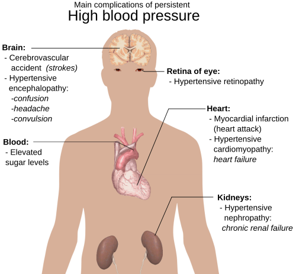
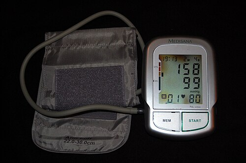

# HIPERTENSÃO ARTERIAL SISTÊMICA (HAS)

A hipertensão arterial (HA) é uma doença crônica não transmissível definida por elevação persistente da pressão arterial (PA). É o principal fator de risco modificável para mortalidade cardiovascular no Brasil e no mundo, com impacto direto em acidente vascular cerebral, doença coronariana, insuficiência cardíaca, doença renal crônica, declínio cognitivo e mortalidade.

Este material foi revisado de acordo com a **Diretriz Brasileira de Hipertensão Arterial – 2025** da Sociedade Brasileira de Cardiologia, Sociedade Brasileira de Hipertensão e Sociedade Brasileira de Nefrologia. Os pontos centrais da atualização são: nova classificação de pré-hipertensão, confirmação diagnóstica com medidas fora do consultório sempre que possível, uso do escore PREVENT para estratificação de risco, meta geral < 130/80 mmHg, início mais frequente com associação medicamentosa e atualização da abordagem de crise hipertensiva.

*Figura 1 - Principais complicações associadas à hipertensão arterial persistente: coração, cérebro, rins, vasos e retina.*

## 1) Definição e diagnóstico

A hipertensão arterial é definida por **PA sistólica ≥ 140 mmHg e/ou PA diastólica ≥ 90 mmHg** no consultório, medida com técnica correta, em **pelo menos duas ocasiões**, na ausência de medicação anti-hipertensiva.

A confirmação deve considerar medidas repetidas em dias diferentes. Sempre que possível, recomenda-se utilizar **MAPA** ou **MRPA** para confirmar diagnóstico, avaliar controle e identificar fenótipos como hipertensão do avental branco e hipertensão mascarada.

### Classificação da PA no consultório em adultos

| Classificação | PAS (mmHg) | PAD (mmHg) |
| --- | --- | --- |
| PA normal | < 120 | e < 80 |
| Pré-hipertensão | 120–139 | e/ou 80–89 |
| HA estágio 1 | 140–159 | e/ou 90–99 |
| HA estágio 2 | 160–179 | e/ou 100–109 |
| HA estágio 3 | ≥ 180 | e/ou ≥ 110 |

A classificação é determinada pelo valor mais alto, sistólico ou diastólico. A HA sistólica isolada ocorre quando PAS ≥ 140 mmHg e PAD < 90 mmHg; a HA diastólica isolada ocorre quando PAS < 140 mmHg e PAD ≥ 90 mmHg. Ambas são classificadas conforme o estágio correspondente.

### O que mudou na pré-hipertensão

A categoria **pré-hipertensão** agora inclui **PAS 120–139 mmHg e/ou PAD 80–89 mmHg**. Valores de PAS 120–129 mmHg e/ou PAD 80–84 mmHg, antes frequentemente tratados como normalidade, passam a indicar maior vigilância e intervenção precoce em estilo de vida.

A pré-hipertensão não é sinônimo de hipertensão. Porém, ela exige avaliação de risco cardiovascular e medidas não medicamentosas. Em indivíduos com PA 130–139/80–89 mmHg e **alto risco cardiovascular**, pode haver indicação de tratamento medicamentoso se não houver controle após 3 meses de medidas não medicamentosas.

## 2) Medida correta da pressão arterial

A qualidade da medida define a qualidade do diagnóstico. Medidas incorretas podem gerar diagnóstico falso, tratamento desnecessário ou atraso terapêutico.

### Técnica essencial no consultório

| Etapa | Conduta recomendada |
| --- | --- |
| Ambiente | Silencioso, temperatura confortável e paciente sem falar. |
| Preparo | Bexiga vazia; evitar tabaco, alimento ou cafeína nos 30 minutos anteriores; evitar exercício físico nos 90 minutos anteriores. |
| Posição | Sentado, costas apoiadas, pernas descruzadas, pés apoiados no chão, braço nu apoiado na altura do coração. |
| Repouso | Pelo menos 5 minutos antes da medida. |
| Braços | Medir inicialmente em ambos os braços e usar, depois, o braço com maior PA. Diferença de PAS > 15 mmHg sugere maior risco cardiovascular e pode indicar doença arterial. |
| Manguito | Adequado à circunferência e formato do braço. |
| Número de medidas | Realizar 3 medidas, com intervalo de 1 minuto, e utilizar a média das duas últimas. Se diferença > 10 mmHg, obter medidas adicionais. |

*Figura 2 - Medida da pressão arterial deve seguir técnica padronizada e utilizar equipamento validado.*

### Hipotensão ortostática

Em idosos, pessoas com diabetes, disautonomia ou em uso de anti-hipertensivos, a PA deve ser medida também em posição supina e após 1 e 3 minutos em ortostatismo. Define-se hipotensão ortostática por queda de **PAS ≥ 20 mmHg** e/ou **PAD ≥ 10 mmHg** após a mudança para a posição em pé.

## 3) MAPA, MRPA e fenótipos de hipertensão

A diretriz recomenda medida fora do consultório sempre que possível, pois MAPA e MRPA têm melhor correlação prognóstica do que a medida isolada em consultório.

### Pontos de corte diagnósticos fora do consultório

| Método | PAS (mmHg) | PAD (mmHg) |
| --- | --- | --- |
| Consultório | ≥ 140 | e/ou ≥ 90 |
| MAPA 24 horas | ≥ 130 | e/ou ≥ 80 |
| MAPA vigília | ≥ 135 | e/ou ≥ 85 |
| MAPA sono | ≥ 120 | e/ou ≥ 70 |
| MRPA | ≥ 130 | e/ou ≥ 80 |

### Fenótipos principais

| Fenótipo | Definição prática | Conduta geral |
| --- | --- | --- |
| Normotensão verdadeira | PA normal no consultório e fora dele | Seguimento conforme risco. |
| HA sustentada | PA elevada no consultório e fora dele | Tratamento conforme estágio e risco. |
| Hipertensão do avental branco | PA ≥ 140/90 no consultório e normal fora dele | Acompanhar, investigar risco e lesões de órgão-alvo. |
| Hipertensão mascarada | PA normal no consultório e elevada fora dele | Tratar como fenótipo de risco semelhante à HA sustentada. |

A hipertensão mascarada é especialmente relevante em pessoas com diabetes, obesidade, doença renal crônica ou alto risco cardiovascular. A hipertensão do avental branco não deve ser ignorada, pois seu risco é intermediário entre normotensão e hipertensão sustentada.

## 4) Avaliação clínica, exames iniciais e risco cardiovascular

A avaliação inicial deve confirmar o diagnóstico, procurar causas secundárias, estimar risco cardiovascular e identificar lesões de órgão-alvo.

### Anamnese dirigida

Investigar duração e valores prévios de PA, história familiar, tabagismo, álcool, ingestão de sódio, sedentarismo, sono, ronco/apneia, ganho ponderal, uso de anti-inflamatórios, corticoides, descongestionantes, anticoncepcionais, hormônios, anabolizantes, drogas ilícitas, antidepressivos tricíclicos, imunossupressores e medicações que elevem PA.

### Exame físico dirigido

Incluir IMC, circunferência abdominal, ausculta cardíaca e pulmonar, pulsos periféricos, sopros carotídeos/abdominais/femorais, sinais de insuficiência cardíaca, avaliação neurológica quando indicada e pesquisa de hipotensão ortostática em grupos de risco.

### Exames complementares iniciais

| Objetivo | Exames úteis |
| --- | --- |
| Risco metabólico | Glicemia ou HbA1c, perfil lipídico. |
| Função renal e eletrólitos | Creatinina com TFGe, sódio, potássio. |
| Lesão renal inicial | Urina tipo 1 e relação albuminúria/creatininúria quando disponível. |
| Lesão cardíaca | Eletrocardiograma; ecocardiograma quando houver suspeita de hipertrofia ventricular esquerda, insuficiência cardíaca ou outra indicação clínica. |
| Situações selecionadas | Fundo de olho, índice tornozelo-braquial, ultrassom renal, Doppler de artérias renais, investigação endócrina ou polissonografia conforme suspeita. |

### Estratificação de risco

A Diretriz 2025 sugere o escore **PREVENT** como ferramenta preferencial de estimativa de risco cardiovascular, por incorporar dimensões cardiovasculares, renais e metabólicas. Quando não disponível, a avaliação pode ser feita por fatores clínicos, lesões de órgão-alvo e presença de doença estabelecida.

São condições de alto ou muito alto risco: doença cardiovascular estabelecida, diabetes, doença renal crônica, hipercolesterolemia familiar, lesão de órgão-alvo, ou risco ≥ 20% em 10 anos pelo PREVENT.

## 5) Medidas não medicamentosas

Medidas não medicamentosas são recomendadas para todos os indivíduos com **PA ≥ 120/80 mmHg**, inclusive quando o tratamento medicamentoso também é indicado.

| Intervenção | Recomendação prática |
| --- | --- |
| Tabagismo | Cessar cigarro, cigarro eletrônico, narguilé e derivados do tabaco para reduzir eventos cardiovasculares e morte. |
| Peso | Em adultos, buscar IMC < 25 kg/m²; em idosos, IMC < 27 kg/m² pode ser mais apropriado. Avaliar circunferência abdominal: < 102 cm em homens e < 88 cm em mulheres. |
| Sódio | Limitar a ingestão de sódio a < 2 g/dia, equivalente a cerca de 5 g de sal/dia. |
| Potássio | Estimular dieta rica em potássio, meta ≥ 3,5 g/dia, exceto em doença renal crônica, hiperpotassemia ou risco de hiperpotassemia. |
| Dieta | Preferir padrão DASH: frutas, verduras, legumes, leguminosas, laticínios pobres em gordura e menor consumo de ultraprocessados. |
| Álcool | Limitar consumo: até 2 doses/dia em homens e 1 dose/dia em mulheres; evitar consumo episódico abusivo. |
| Atividade física | Pelo menos 150 minutos/semana de atividade aeróbica moderada ou 75 minutos/semana de vigorosa, com fortalecimento muscular 2 vezes/semana. |
| Sedentarismo | Levantar e movimentar-se por cerca de 5 minutos a cada 30 minutos sentado. |
| Estresse | Meditação, respiração lenta e abordagem de aspectos psicossociais podem ser coadjuvantes. |
| Equipe multiprofissional | Nutrição, enfermagem, educação física, psicologia, farmácia e atenção primária aumentam adesão e controle. |

Sessões de exercício não devem ser iniciadas se a PA estiver acima de 160/105 mmHg; durante exercício aeróbico, recomenda-se reduzir intensidade se PA ultrapassar 180/105 mmHg.

## 6) Quando iniciar tratamento medicamentoso

A decisão combina nível pressórico, risco cardiovascular e tolerabilidade.

| Situação | Conduta |
| --- | --- |
| PA ≥ 120/80 mmHg | Medidas não medicamentosas desde o diagnóstico. |
| PA 130–139/80–89 mmHg e alto risco cardiovascular | Medidas não medicamentosas por 3 meses; se PA permanecer ≥ 130/80 mmHg, iniciar tratamento medicamentoso. |
| PA ≥ 140/90 mmHg | Iniciar tratamento medicamentoso junto com medidas não medicamentosas. |
| Idosos ≥ 60 anos | Em geral, iniciar quando PAS ≥ 140 mmHg. |
| Idosos ≥ 80 anos, frágeis, hipotensão ortostática ou expectativa de vida reduzida | Individualizar início, intensidade e metas conforme tolerabilidade. |

Para pessoas já classificadas como hipertensas, a estratificação de risco não deve impedir o início de tratamento medicamentoso quando a PA é persistentemente ≥ 140/90 mmHg.

## 7) Metas pressóricas

A meta geral recomendada pela Diretriz 2025 é **PA < 130/80 mmHg** para pacientes com hipertensão arterial, independentemente de risco cardiovascular baixo, moderado ou alto, desde que haja tolerabilidade.

| Cenário | Meta |
| --- | --- |
| HA em geral | < 130/80 mmHg |
| PA 130–139/80–89 mmHg com alto risco cardiovascular | < 130/80 mmHg |
| HA sistólica isolada | PAS < 130 mmHg, monitorando sintomas e PAD muito baixa. |
| Idosos em geral | < 130/80 mmHg se tolerado. |
| Idosos frágeis, muito idosos ou expectativa de vida reduzida | Menor PA tolerada, evitando eventos adversos. |
| Metas por MAPA/MRPA | MAPA 24h < 130/80; vigília < 135/85; sono < 120/70; MRPA < 130/80. |

Quando a meta < 130/80 mmHg não for tolerada, a PA deve ser reduzida até o menor valor tolerado. O alcance da meta deve ser confirmado, sempre que possível, com MAPA ou MRPA.

## 8) Tratamento farmacológico: classes preferenciais

As classes com melhor base para tratamento da hipertensão são: **diuréticos tiazídicos ou tiazídicos similares**, **inibidores da enzima conversora da angiotensina (IECA)**, **bloqueadores dos receptores da angiotensina II (BRA)** e **bloqueadores dos canais de cálcio (BCC)**. Betabloqueadores são úteis quando há indicação específica.

| Classe | Papel prático | Cuidados principais |
| --- | --- | --- |
| Diuréticos tiazídicos/similares | Base do tratamento; clortalidona e indapamida têm ação mais prolongada. | Monitorar potássio, sódio, ácido úrico e função renal; evitar em gota ativa. |
| IECA | Úteis em doença renal com albuminúria, insuficiência cardíaca, pós-infarto e hipertrofia ventricular esquerda. | Tosse, hipercalemia, piora inicial de função renal; contraindicado na gestação; não associar a BRA. |
| BRA | Alternativa aos IECA, sem tosse típica; úteis em condições semelhantes. | Hipercalemia, função renal; contraindicado na gestação; não associar a IECA. |
| BCC di-hidropiridínico | Eficaz e bem tolerado, útil em idosos e hipertensão sistólica isolada. | Edema de membros inferiores, cefaleia, rubor; edema melhora com bloqueador do SRAA e responde pouco a diurético. |
| Betabloqueador | Indicado em insuficiência cardíaca, doença coronariana, pós-infarto, angina, fibrilação atrial, arritmias, hemodiálise e situações específicas. | Não é monoterapia inicial de rotina em idosos sem comorbidade; evitar em bradicardia importante e bloqueios avançados. |

Sacubitril/valsartana, inibidores de SGLT2, agonistas de GLP-1 e novos antagonistas mineralocorticoides podem ter efeito sobre PA e desfechos em condições específicas, mas não substituem as classes preferenciais no tratamento rotineiro da hipertensão isolada.

## 9) Estratégia inicial: monoterapia versus associação

A maior parte dos pacientes com hipertensão precisará de associação para atingir meta < 130/80 mmHg. A Diretriz 2025 recomenda, para a maioria, iniciar com **associação dupla em baixa dose**, preferencialmente em comprimido único quando disponível.

### Associação inicial preferencial

| Indicação de associação | Combinações usuais |
| --- | --- |
| HA estágio 1 com risco moderado ou alto | IECA ou BRA + BCC e/ou diurético tiazídico/similar. |
| HA estágio 2 ou 3 | Associação desde o início. |
| Necessidade de controle mais rápido e seguro | Associação em baixa dose, com ajuste após cerca de 4 semanas. |

Combinações preferenciais incluem **IECA ou BRA + BCC**, **IECA ou BRA + diurético tiazídico/similar** ou tripla terapia quando necessário. Não se deve combinar IECA com BRA.

### Quando considerar monoterapia

Monoterapia pode ser escolhida em indivíduos frágeis, muito idosos (≥ 80 anos), pacientes com PA 130–139/80–89 mmHg e alto risco cardiovascular, hipertensão estágio 1 de baixo risco, hipotensão ortostática sintomática ou risco aumentado de eventos adversos.

## 10) Hipertensão resistente e refratária

Antes de classificar resistência, é obrigatório excluir pseudorresistência: técnica inadequada de medida, manguito incorreto, efeito do avental branco, inércia terapêutica, doses insuficientes, combinação inadequada e baixa adesão.

### Definições

| Condição | Definição |
| --- | --- |
| Hipertensão resistente (HAR) | PA acima da meta apesar do uso de 3 ou mais classes sinérgicas em doses máximas preconizadas ou toleradas, preferencialmente incluindo diurético tiazídico/similar, IECA ou BRA e BCC de ação prolongada, por 30 a 60 dias, com pseudorresistência excluída. Também inclui pacientes controlados com 4 ou mais fármacos. |
| Hipertensão refratária (HARf) | Subgrupo de HAR verdadeira com PA não controlada apesar de 5 ou mais anti-hipertensivos, incluindo preferencialmente antagonista mineralocorticoide e diurético tiazídico similar de ação prolongada. |

A confirmação deve ser feita preferencialmente com **MAPA** ou, se indisponível, **MRPA**.

### Escalonamento na HAR

- Confirmar técnica, adesão e PA fora do consultório.

- Otimizar tripla terapia: IECA ou BRA + BCC + diurético tiazídico/similar.

- Se o diurético for hidroclorotiazida, considerar troca por clortalidona ou indapamida.

- Se PA persistir ≥ 130/80 mmHg após 30 a 60 dias, adicionar **espironolactona 25–50 mg/dia** como quarto fármaco, se tolerada.

- Monitorar potássio e TFGe; cautela se TFGe < 30 mL/min/1,73 m² ou potássio > 5,5 mEq/L.

- Se houver intolerância à espironolactona, considerar eplerenona ou amilorida conforme disponibilidade e perfil clínico.

- Casos persistentes devem ser encaminhados para serviço especializado.

## 11) Quando suspeitar de hipertensão secundária

A hipertensão secundária corresponde a causa identificável e potencialmente tratável. A suspeita deve ser maior em:

| Situação clínica | Possibilidades a considerar |
| --- | --- |
| Início abrupto, antes dos 30 anos ou piora após 55 anos | Estenose de artéria renal, doença renal, causas endócrinas. |
| Hipertensão resistente, refratária ou estágio 3 | Hiperaldosteronismo primário, doença renal, apneia obstrutiva do sono, doença renovascular. |
| Hipocalemia espontânea ou induzida por diurético | Hiperaldosteronismo primário. |
| Ronco, sonolência diurna, obesidade, sono não reparador | Apneia obstrutiva do sono. |
| Crises paroxísticas com cefaleia, sudorese e palpitações | Feocromocitoma/paraganglioma. |
| Sopro abdominal, piora renal após IECA/BRA, edema agudo de pulmão súbito | Estenose de artéria renal. |
| Diferença de PA entre membros, pulsos femorais reduzidos | Coarctação de aorta. |
| Uso de substâncias que elevam PA | AINEs, corticoides, descongestionantes, anticoncepcionais, anabolizantes, cocaína, anfetaminas, antidepressivos tricíclicos, eritropoietina e imunossupressores. |

## 12) Crise hipertensiva: nomenclatura e conduta

Crise hipertensiva é elevação aguda e importante da PA, com ou sem lesão aguda de órgão-alvo. A gravidade não é definida apenas pelo número da PA, mas principalmente pela presença de lesão aguda e progressiva.

### Elevação importante da PA sem lesão aguda

O termo “urgência hipertensiva” vem sendo substituído por **elevação importante da PA sem lesão aguda de órgão-alvo**. Em geral, trata-se de PA muito elevada, frequentemente ≥ 180/110 mmHg, sem risco iminente de morte e sem lesão aguda progressiva.

Conduta:

- confirmar medida com técnica correta;

- avaliar sintomas e sinais de lesão de órgão-alvo;

- observar em ambiente calmo por cerca de 30 minutos quando houver sintomas inespecíficos;

- evitar redução abrupta da PA;

- ajustar ou iniciar anti-hipertensivos orais quando indicado;

- reavaliar precocemente em 1 a 7 dias, com alvo inicial de PAS < 160 mmHg e PAD < 100 mmHg.

Não há indicação de reduzir PA de forma rápida e agressiva na ausência de lesão aguda. **Nifedipina de liberação rápida/sublingual é proscrita** por risco de isquemia decorrente de queda abrupta da PA.

### Emergência hipertensiva

Emergência hipertensiva ocorre quando há elevação importante da PA com **lesão aguda e progressiva de órgão-alvo**, como encefalopatia hipertensiva, AVC, hemorragia intracerebral, síndrome coronariana aguda, edema agudo de pulmão, dissecção de aorta, injúria renal aguda, pré-eclâmpsia grave, eclâmpsia ou síndrome HELLP.

Conduta geral:

- internação, frequentemente em UTI;

- monitorização contínua;

- anti-hipertensivos intravenosos conforme a lesão de órgão-alvo;

- redução gradual: em geral, até 25% na primeira hora; se estável, atingir cerca de 160/100 mmHg em 2 a 6 horas; depois normalizar em 24 a 48 horas, exceto em condições com alvos específicos.

Alvos específicos importantes:

| Situação | Alvo inicial |
| --- | --- |
| Dissecção aguda de aorta | PAS 90–120 mmHg e FC < 60 bpm rapidamente, geralmente em até 20 minutos. |
| Edema agudo de pulmão e crises catecolaminérgicas | PAS < 140 mmHg na primeira hora. |
| AVC isquêmico com trombólise | PA < 185/110 mmHg antes de trombólise e < 180/105 mmHg nas primeiras 24 horas. |
| AVC hemorrágico leve a moderado com PAS 150–220 | Reduzir PAS para < 140 mmHg com monitorização e medicação IV. |

## 13) Situações especiais

### Idosos

A idade isolada não deve impedir tratamento. A avaliação deve considerar fragilidade, cognição, autonomia, polifarmácia, risco de quedas, hipotensão ortostática e expectativa de vida.

- A maioria dos idosos hipertensos deve ter meta **< 130/80 mmHg**, se tolerada.

- Em idosos frágeis, muito idosos ou com expectativa de vida reduzida, reduzir até o menor valor tolerado.

- MAPA ou MRPA devem ser usados sempre que possível no diagnóstico e na avaliação do tratamento.

- Betabloqueadores não são recomendados como monoterapia inicial em idosos, exceto quando houver indicação específica, como insuficiência cardíaca, doença coronariana ou arritmia.

- Revisar periodicamente polifarmácia e eventos adversos.

### Gestação

Na gestação, hipertensão é definida por **PAS ≥ 140 mmHg e/ou PAD ≥ 90 mmHg**, em duas medidas com pelo menos 4 horas de intervalo. Hipertensão grave é **PAS ≥ 160 mmHg e/ou PAD ≥ 110 mmHg**.

Pontos essenciais:

- Pré-eclâmpsia: hipertensão após 20 semanas, geralmente com proteinúria; na ausência de proteinúria, pode ser diagnosticada por sinais de gravidade, como plaquetopenia, creatinina elevada, transaminases elevadas, edema pulmonar, sintomas visuais ou cefaleia sem outra causa.

- Profilaxia de pré-eclâmpsia em alto risco: AAS 100–150 mg à noite, iniciado antes de 16 semanas e mantido até 36 semanas; cálcio acima de 500 mg em gestantes com baixa ingestão, idealmente antes da gestação ou até 20 semanas.

- Tratamento crônico: metildopa, nifedipina de ação prolongada ou amlodipina são opções de primeira linha; betabloqueadores podem ser usados, exceto atenolol.

- IECA, BRA e antagonistas mineralocorticoides são contraindicados na gestação.

- Em hipertensão grave persistente, tratar de forma urgente. Hidralazina IV é opção no Brasil; se indisponível, nifedipina oral pode ser usada. Nifedipina sublingual não deve ser usada.

- Sulfato de magnésio é recomendado para prevenção de eclâmpsia em gestantes com HA grave sintomática e para tratamento da eclâmpsia.

- Meta na gestação: manter PAS > 120 e < 160 mmHg e PAD > 80 e < 110 mmHg, evitando tanto hipertensão grave quanto hipoperfusão placentária.

## 14) Resumo prático final

| Tema | Ponto-chave atualizado |
| --- | --- |
| Diagnóstico | HA: consultório ≥ 140/90 mmHg em pelo menos duas ocasiões, com técnica correta. |
| Pré-hipertensão | 120–139 e/ou 80–89 mmHg. |
| Medida fora do consultório | MAPA/MRPA sempre que possível; MRPA e MAPA 24h usam corte ≥ 130/80 mmHg. |
| Risco cardiovascular | Avaliar fatores de risco, lesão de órgão-alvo, DCV, DRC e PREVENT quando disponível. |
| Medidas não medicamentosas | Para todos com PA ≥ 120/80 mmHg. |
| Início de fármacos | PA ≥ 140/90 mmHg: iniciar fármacos; PA 130–139/80–89 com alto risco: fármacos se não controlar após 3 meses de medidas não medicamentosas. |
| Meta | < 130/80 mmHg se tolerada. |
| Estratégia inicial | Associação dupla em baixa dose para a maioria; monoterapia em frágeis, muito idosos, pré-hipertensão de alto risco ou estágio 1 baixo risco selecionado. |
| Classes preferenciais | Diurético tiazídico/similar, IECA ou BRA, BCC; betabloqueador apenas em indicações específicas. |
| Resistente | Confirmar com MAPA/MRPA e excluir pseudorresistência; espironolactona é quarto fármaco preferencial. |
| Crise hipertensiva | Sem lesão aguda: manejo ambulatorial precoce e sem queda abrupta; com lesão aguda: emergência, UTI e medicação IV. |

Referência principal: Brandão AA, Rodrigues CIS, Bortolotto LA, Armstrong AC, Mulinari RA, Feitosa ADM, et al. **Diretriz Brasileira de Hipertensão Arterial – 2025**. Arquivos Brasileiros de Cardiologia. 2025;122(9):e20250624.

 Cópia offline para consulta pessoal.
 Fonte original:
 [https://www.medevo.com.br/material-apoio/ler/6339bb30-2ec7-474b-b73f-705ff3cc44fd](https://www.medevo.com.br/material-apoio/ler/6339bb30-2ec7-474b-b73f-705ff3cc44fd)
