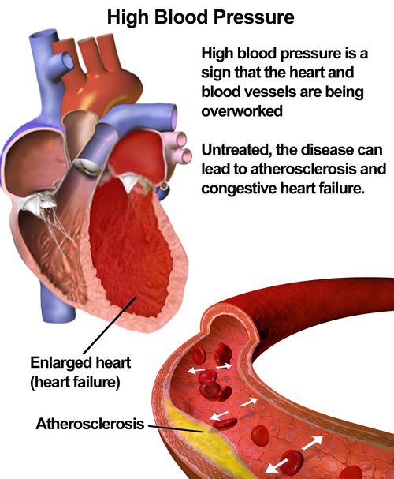
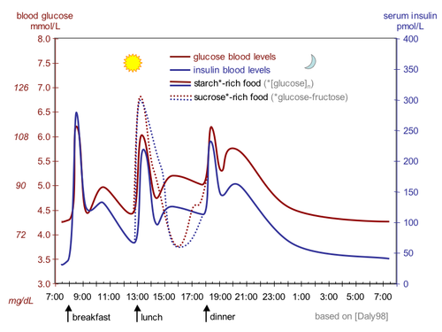

# HIPERTENSÃO E DIABETES

Para entender Hipertensão Arterial Sistêmica (HAS) e Diabetes Mellitus (DM) sob a ótica da Medicina Preventiva e Social, precisamos primeiro mudar a chave do "consultório individual" para a "saúde das populações". Em provas de residência, o examinador não quer apenas saber se você sabe prescrever uma droga, ele quer saber se você entende o impacto epidemiológico, os níveis de prevenção envolvidos e como o sistema de saúde (SUS) se organiza para manejar essas condições.

## O Cenário Epidemiológico e o Impacto na Saúde Pública

A transição epidemiológica no Brasil trouxe um aumento avassalador das Doenças Crônicas Não Transmissíveis (DCNT). Hoje, a Hipertensão e o Diabetes são os principais fatores de risco para doenças cardiovasculares, que continuam sendo a maior causa de morte no país.

Dados do Vigitel (Vigilância de Fatores de Risco e Proteção para Doenças Crônicas por Inquérito Telefônico) mostram que a prevalência de HAS e DM está intimamente ligada a determinantes sociais. Por que isso cai em prova? Porque as bancas adoram que você saiba que a menor escolaridade está inversamente relacionada à prevalência de hipertensão. Quanto menos anos de estudo, maior a carga da doença. Isso ocorre por dificuldade de acesso a alimentos saudáveis, menor literacia em saúde e maior exposição a estressores psicossociais.

Um conceito fundamental aqui é o de Transcendência e Magnitude. A HAS tem alta magnitude (muita gente tem) e alta transcendência (causa grande impacto social e econômico, como aposentadorias precoces por AVC ou gastos com hemodiálise). É por isso que o Programa Hiperdia, dentro da Estratégia Saúde da Família (ESF), é o pilar do controle dessas doenças na Atenção Primária à Saúde (APS).

## Níveis de Prevenção: Onde a HAS e o DM se Encaixam

Este é o tópico que mais confunde os alunos, mas é o que mais pontua em Preventiva. Vamos usar o modelo de Leavell e Clark para organizar o raciocínio.

### Prevenção Primária

O objetivo é evitar que a doença surja. Aqui agimos sobre os fatores de risco modificáveis: inatividade física, obesidade, tabagismo, consumo excessivo de álcool e dieta inadequada.
Exemplo clássico de prova: Campanhas de redução de sal em alimentos processados ou a própria imunização (embora a imunização seja o exemplo genérico, no contexto de DCNT, a mudança de estilo de vida é a rainha da prevenção primária).

### Prevenção Secundária

Aqui a doença já existe ou está em fase inicial, e nosso foco é o diagnóstico precoce e o tratamento oportuno para evitar a progressão.
Cuidado: O rastreamento de diabetes em um paciente assintomático de 45 anos é prevenção secundária. O tratamento da hipertensão em estágios iniciais também é classificado como prevenção secundária, pois visa evitar a lesão de órgão-alvo.

### Prevenção Terciária

A doença já causou danos, e agora o objetivo é a reabilitação e a redução de complicações.
Exemplo: O manejo do pé diabético para evitar amputação ou o uso de IECA em um paciente com nefropatia diabética para retardar a hemodiálise. Aqui, o foco é limitar a incapacidade e melhorar a qualidade de vida.

### Prevenção Quaternária

Este conceito tem caído cada vez mais. Trata-se de proteger o paciente de intervenções médicas excessivas ou desnecessárias que podem causar mais dano do que benefício (iatrogenia).
Na HAS/DM, isso se traduz em evitar o sobrediagnóstico e a medicalização desnecessária em idosos frágeis (polifarmácia) ou não solicitar exames de rastreamento sem evidência científica (como o rastreamento indiscriminado de PSA ou exames de imagem desnecessários). Como dizemos no MedEvo, prevenir o excesso é tão importante quanto tratar a falta.

## Hipertensão Arterial Sistêmica (HAS)

*Figura 1 - Representação da hipertensão arterial: o aumento da pressão sobre as paredes vasculares é o principal fator de risco modificável para eventos cardiovasculares. Fonte: BruceBlaus, CC BY 3.0 | Wikimedia Commons*

## Definição e Diagnóstico

A HAS é uma condição clínica multifatorial caracterizada por níveis elevados e sustentados de pressão arterial (PA). Pela **Diretriz Brasileira de Hipertensão Arterial – 2025** (Arq. Bras. Cardiol. 2025;122(9):e20250624; DOI 10.36660/abc.20250624), o diagnóstico deve ser feito com cuidado: uma medida isolada alta no consultório não fecha diagnóstico, salvo contextos de urgência/emergência ou lesão de órgão-alvo evidente.

Pontos práticos da diretriz de 2025:

- **Consultório:** HAS quando PA ≥ 140 e/ou 90 mmHg em **duas ocasiões diferentes**, classificando pelo maior valor de PAS ou PAD.

- **Fora do consultório:** a diretriz recomenda **MAPA ou MRPA** para confirmar diagnóstico e monitorar tratamento.

- **Metas/valores fora do consultório:** MAPA 24h < 130/80 mmHg; MAPA vigília < 135/85 mmHg; MAPA sono < 120/70 mmHg; MRPA < 130/80 mmHg.

- **Fenótipos importantes:** hipertensão do avental branco = PA de consultório elevada com MAPA/MRPA normal; hipertensão mascarada = consultório normal com MAPA/MRPA elevada. Isso é mais comum em pessoas com fatores de risco como diabetes e obesidade.

### Técnica Correta de Medida: Onde o Erro Acontece

As bancas amam cobrar o preparo do paciente. Se você ignorar isso, o diagnóstico estará errado. A diretriz de 2025 reforça o uso preferencial de **equipamento automático de braço**, quando disponível, para reduzir erros de aferição.

- Repouso de 5 minutos em ambiente calmo.

- Não estar com a bexiga cheia.

- Não ter praticado exercícios físicos há pelo menos 60 minutos.

- Não ter ingerido café, álcool ou fumado nos 30 minutos anteriores.

- Pernas descruzadas, pés no chão, dorso apoiado e braço na altura do coração.

- Manguito adequado ao braço e múltiplas medidas quando necessário.

### Classificação da Pressão Arterial (Diretriz Brasileira de HAS 2025)

| Classificação | Sistólica (mmHg) | Diastólica (mmHg) |
| --- | --- | --- |
| PA normal | < 120 | e < 80 |
| Pré-hipertensão | 120 - 139 | e/ou 80 - 89 |
| HAS Estágio 1 | 140 - 159 | e/ou 90 - 99 |
| HAS Estágio 2 | 160 - 179 | e/ou 100 - 109 |
| HAS Estágio 3 | ≥ 180 | e/ou ≥ 110 |

*Nota de prova:* se PAS e PAD caírem em categorias diferentes, usamos a categoria mais alta. A hipertensão sistólica isolada (PAS ≥ 140 com PAD < 90) também é classificada em estágios conforme a PAS.

### Estratificação de Risco Cardiovascular

Não tratamos apenas números, tratamos pessoas. Um paciente com PA 145/95 mmHg sem fatores de risco é diferente de um paciente com a mesma PA que já teve infarto, tem doença renal crônica ou Diabetes.

Na diretriz de 2025, a presença de **DM, DRC estágio 3 ou lesão de órgão-alvo** coloca o paciente em **alto risco**; doença cardiovascular estabelecida ou DRC estágio ≥ 4 colocam em **muito alto risco**. Mesmo na faixa de pré-hipertensão (130-139/80-89), esses fatores mudam a conduta, pois o risco cardiovascular passa a orientar intervenções mais intensivas.

### Tratamento da HAS

A diretriz de 2025 deixa a lógica mais objetiva: todos recebem medidas não medicamentosas, mas o momento de iniciar remédio depende da PA, idade, risco e tolerabilidade.

-

**Medidas não medicamentosas (MNM):** indicadas para todos com PA ≥ 120/80 mmHg.

- Sódio: < 2 g/dia de sódio, equivalente a < 5 g/dia de sal.

- Padrão alimentar saudável, preferencialmente DASH.

- Potássio dietético adequado, evitando suplementação/estímulo indiscriminado em DRC ou hiperpotassemia.

- Atividade física: pelo menos 150 min/semana de atividade aeróbica moderada.

- Perda de peso quando há excesso ponderal.

- Redução de álcool e combate ao tabagismo.

-

**Tratamento farmacológico:**

- **PA ≥ 140/90 mmHg:** iniciar tratamento medicamentoso no diagnóstico, junto com MNM.

- **PA 130-139/80-89 mmHg + alto risco cardiovascular:** considerar medicamento se não houver controle após cerca de 3 meses de MNM.

- **Idosos:** em geral iniciar quando PAS ≥ 140 mmHg, mas individualizar em ≥ 80 anos, fragilidade, hipotensão ortostática ou expectativa de vida reduzida.

-

**Meta pressórica:** para pacientes com HAS, a meta geral atual é **PA < 130/80 mmHg, se tolerada**. Se não for tolerada, reduzir até o menor valor tolerado com segurança. Idealmente, confirmar controle por MAPA ou MRPA.

-

**Classes preferenciais:**

- Diuréticos tiazídicos ou tiazídicos-símiles (ex.: hidroclorotiazida, clortalidona, indapamida).

- Bloqueadores dos canais de cálcio (ex.: anlodipino).

- IECA (ex.: enalapril, captopril) ou BRA (ex.: losartana, valsartana).

- Betabloqueadores têm **indicações específicas** (pós-IAM, angina, fibrilação atrial, ICFEr, algumas situações na gestação etc.), não são a base universal para HAS não complicada.

-

**Terapia combinada:** a maioria dos pacientes precisará de associação para atingir meta. A combinação preferida inclui bloqueador do SRAA (IECA ou BRA) + bloqueador de canal de cálcio ou diurético tiazídico/tiazídico-símile. Comprimido único melhora adesão, mas no SUS pode ser necessário combinar fármacos disponíveis em comprimidos separados.

*Dica de Prova:* nunca combine IECA com BRA. Isso aumenta risco de injúria renal e hipercalemia sem benefício cardiovascular adicional.

## Diabetes Mellitus (DM)

O Diabetes é uma desordem metabólica de etiologia variável, caracterizada por hiperglicemia crônica. Na APS, o foco maior é o DM tipo 2, que representa cerca de 90 a 95% dos casos e está diretamente ligado à obesidade e ao envelhecimento populacional.

### Rastreamento: Quem devemos testar?

O rastreamento é um exemplo clássico de prevenção secundária. Segundo o Ministério da Saúde e a Sociedade Brasileira de Diabetes (SBD):

- Todos os indivíduos com ≥ 45 anos (a cada 3 anos se normal).

- Indivíduos de qualquer idade com sobrepeso/obesidade (IMC ≥ 25 kg/m² ou ≥ 23 kg/m² em asiáticos) que apresentem pelo menos um fator de risco adicional (HAS, história familiar de DM, história de DM gestacional, SOP, sedentarismo, acantose nigricans).

### Critérios Diagnósticos (SBD/ADA 2025)

| Exame | Normal | Pré-Diabetes | Diabetes |
| --- | --- | --- | --- |
| Glicemia de Jejum (mg/dL) | < 100 | 100 - 125 | ≥ 126 |
| TOTG 75g (2h após) | < 140 | 140 - 199 | ≥ 200 |
| Hemoglobina Glicada (HbA1c) | < 5,7% | 5,7 - 6,4% | ≥ 6,5% |

*Importante:* na ausência de hiperglicemia inequívoca, o diagnóstico requer **dois testes alterados** (o mesmo exame repetido ou dois exames diferentes). Se houver sintomas clássicos de hiperglicemia (poliúria, polidipsia, polifagia/perda ponderal) + glicemia aleatória ≥ 200 mg/dL, o diagnóstico está feito.

*Atualização para prova:* os Standards of Care in Diabetes 2025 da ADA recomendam rastreamento em todos os adultos a partir de **35 anos** ou antes disso se houver sobrepeso/obesidade com fator de risco. Protocolos brasileiros podem manter recortes próprios; em prova, siga a fonte citada no enunciado.

### Manejo do Diabetes Mellitus Tipo 2

O tratamento do DM2 evoluiu muito. Antigamente, o foco era apenas baixar glicose. Hoje, o foco é **proteção cardiovascular e renal**, especialmente no paciente que também tem HAS.

- **Base para todos:** mudança de estilo de vida, alimentação, atividade física, perda de peso quando indicada, cessação de tabagismo e educação em saúde.

- **Metformina:** continua sendo opção inicial frequente por custo, segurança e experiência de uso, se não houver contraindicação.

- **Doença cardiovascular aterosclerótica, insuficiência cardíaca ou DRC:** considerar **iSGLT2 e/ou agonista de receptor GLP-1 com benefício comprovado**, independentemente da HbA1c inicial ou do uso prévio de metformina, quando disponível e indicado.

- **HbA1c muito acima da meta:** se HbA1c estiver ≥ 1,5% acima da meta individual, considerar terapia dupla desde o início.

- **Insulina:** considerar se houver catabolismo, sintomas intensos, cetose, glicemia ≥ 300 mg/dL ou HbA1c ≥ 10%.

*Conexão com HAS 2025:* iSGLT2, agonistas de GLP-1 e finerenona podem ter efeitos modestos sobre a PA e benefícios cardiorrenais em populações específicas, mas **não substituem** o tratamento anti-hipertensivo quando a meta pressórica não é atingida.

*Cuidado com a Inércia Clínica:* este é um termo que cai muito em provas de Medicina de Família. Inércia clínica é a falha da equipe de saúde em iniciar ou intensificar o tratamento quando as metas não são atingidas. Isso é um grande gargalo no controle do DM e da HAS no Brasil.

*Figura 2 - Curvas idealizadas de glicemia e insulinemia ao longo do dia com três refeições. A desregulação desse equilíbrio é central na fisiopatologia do diabetes mellitus. Fonte: Jakob Suckale e Michele Solimena, CC BY 3.0 | Wikimedia Commons*

## Complicações Crônicas: O Rastreamento Obrigatório

Assim que o diagnóstico de DM2 é feito, o rastreamento de complicações deve ser imediato (diferente do DM1, onde esperamos 5 anos).

- **Retinopatia:** Exame de fundo de olho anual.

- **Nefropatia:** Rastreamento com albuminúria em amostra isolada e cálculo da Taxa de Filtração Glomerular (TFG).

- **Neuropatia/Pé Diabético:** Exame físico dos pés com teste do monofilamento de 10g, avaliação de pulsos e sensibilidade vibratória.

## A Intersecção: O Paciente com HAS e DM

Quando o paciente apresenta as duas condições, o risco cardiovascular é potencializado. Pela Diretriz Brasileira de HAS 2025, **DM já coloca o hipertenso em alto risco cardiovascular**; se houver doença cardiovascular estabelecida ou DRC avançada, o risco é muito alto.

A meta pressórica geral para a maioria dos pacientes com HAS e DM é **PA < 130/80 mmHg, desde que tolerada**. Em pessoas frágeis, muito idosas, com hipotensão ortostática ou eventos adversos, a meta deve ser individualizada e buscada até o menor valor tolerado.

Sobre a escolha do anti-hipertensivo:

- **IECA ou BRA** são preferenciais quando há albuminúria, proteinúria, DRC ou necessidade de nefroproteção.

- Se não houver albuminúria/DRC, outras classes de primeira linha (diurético tiazídico/tiazídico-símile e bloqueador de canal de cálcio) também são válidas conforme perfil clínico.

- Evite combinar IECA + BRA.

- Monitore creatinina/eTFG e potássio após introdução ou ajuste de bloqueadores do SRAA, sobretudo em DRC.

O cuidado integrado na APS deve incluir: PA medida corretamente, HbA1c individualizada, albuminúria/eTFG anuais no DM2, avaliação dos pés, fundo de olho, adesão medicamentosa e busca ativa de barreiras sociais. Esse é o ponto que as provas de Preventiva cobram: não é só prescrever, é organizar cuidado longitudinal para evitar AVC, IAM, amputação e hemodiálise.

### Polifarmácia e Desprescrição no Idoso

Em provas de Preventiva focadas em idosos, surge o conceito de desprescrição. Pacientes idosos frágeis, com múltiplas comorbidades, muitas vezes são vítimas de polifarmácia. O risco de hipoglicemia grave por sulfonilureias ou hipotensão ortostática por excesso de anti-hipertensivos pode superar o benefício do controle rígido. Nesses casos, as metas de HbA1c e PA podem ser mais flexíveis (ex: HbA1c até 8,0% ou 8,5% em idosos muito frágeis).

## Aspectos de Saúde Pública e Gestão

### Programa Hiperdia e a Rede de Atenção

O Hiperdia não é apenas um sistema de cadastro; é uma estratégia de acompanhamento longitudinal. O sucesso do manejo das DCNT depende da capacidade da Atenção Primária em resolver a maioria dos casos, deixando para a Atenção Secundária (especialistas) apenas os casos refratários ou com complicações graves.

### Segurança do Paciente e Adesão

A adesão ao tratamento é o maior desafio. Fatores que diminuem a adesão:

- Baixa escolaridade e falta de compreensão da doença (doença silenciosa).

- Complexidade do esquema terapêutico (muitos comprimidos).

- Efeitos colaterais (tosse por IECA, edema por anlodipino, diarreia por metformina).

- Dificuldade de acesso aos medicamentos (embora o Programa Farmácia Popular ajude muito).

## Situações Especiais e Pegadinhas de Prova

### Diabetes Gestacional (DMG)

O rastreamento é feito na primeira consulta de pré-natal com glicemia de jejum.

- Se < 92 mg/dL: Realizar TOTG 75g entre 24 e 28 semanas.

- Se entre 92 e 125 mg/dL: Diagnóstico de DMG.

- Se ≥ 126 mg/dL: Diabetes Mellitus pré-gestacional (ou "overt diabetes").

### Hipertensão na Infância

Sim, cai em prova! A definição de HAS em crianças e adolescentes (até 13 anos) é baseada em percentis de idade, sexo e estatura. PA ≥ percentil 95 é hipertensão. A partir de 13 anos, usamos os valores de adultos.

### Hiperuricemia e HAS

O ácido úrico elevado é um marcador de risco cardiovascular, mas a diretriz não recomenda tratar hiperuricemia assintomática apenas para baixar a PA. No entanto, se o paciente tem gota, evite diuréticos tiazídicos, pois eles competem com a excreção de ácido úrico.

### Tuberculose e Diabetes

Existe uma relação bidirecional. O DM aumenta o risco de adoecimento por TB em 3 vezes. Por isso, o rastreamento de TB (pesquisa de sintomas respiratórios) deve ser rotina na consulta do paciente diabético. Isso é prevenção secundária de TB em um grupo de risco.

## Tabelas Comparativas para Fixação

### Diagnóstico Diferencial de Drogas Anti-hipertensivas

| Classe | Indicação Preferencial | Contraindicação Absoluta | Efeito Colateral Comum |
| --- | --- | --- | --- |
| IECA / BRA | DM, DRC, IC com fração de ejeção reduzida | Gravidez, Estenose bilateral de artéria renal | Tosse (IECA), Hipercalemia |
| Tiazídicos | Idosos, Negros, Osteoporose | Gota (crise aguda) | Hipocalemia, Hiperuricemia |
| Bloq. Cálcio | Idosos, Negros, Doença Arterial Periférica | IC com fração de ejeção reduzida (exceto anlodipino/felodipino) | Edema de membros inferiores |
| Betabloqueadores | Pós-IAM, IC, Angina, Arritmias | Asma/DPOC grave, Bloqueios AV de 2º/3º grau | Bradicardia, Broncoespasmo |

### Metas Terapêuticas no Diabetes (SBD/ADA - individualização)

| Perfil do Paciente | Meta usual de HbA1c | Justificativa |
| --- | --- | --- |
| Adulto padrão | < 7,0% | Redução de complicações microvasculares |
| Adulto selecionado, baixo risco de hipoglicemia | < 6,5% pode ser considerada | Controle mais intensivo se seguro e factível |
| Idoso hígido | < 7,0 - 7,5% | Equilíbrio entre benefício e risco |
| Idoso frágil / múltiplas comorbidades / expectativa de vida curta | < 8,0 - 8,5% | Evitar hipoglicemia e iatrogenia (prevenção quaternária) |
| Gestante com diabetes prévio | Idealmente < 6,0 - 6,5%, se sem hipoglicemia significativa | Redução de malformações e complicações fetais; sempre individualizar |

--- | :--- | :--- |
| Adulto padrão | < 7,0% | Redução de complicações microvasculares |
| Idoso hígido | < 7,5% | Equilíbrio entre benefício e risco |
| Idoso frágil / Expectativa de vida curta | < 8,5% | Evitar hipoglicemia e iatrogenia (Prevenção Quaternária) |
| Gestante | < 6,0% | Evitar macrossomia e complicações fetais |

## Pontos-Chave para Prova

- **Fonte atualizada de HAS:** Diretriz Brasileira de Hipertensão Arterial – 2025 (Arq. Bras. Cardiol. 2025;122(9):e20250624; DOI 10.36660/abc.20250624).

- **Diagnóstico HAS:** PA de consultório ≥ 140 e/ou 90 mmHg em duas ocasiões diferentes; confirmar/monitorar com MAPA ou MRPA sempre que possível.

- **Classificação HAS 2025:** normal < 120/<80; pré-hipertensão 120-139 e/ou 80-89; estágio 1 140-159/90-99; estágio 2 160-179/100-109; estágio 3 ≥ 180/≥ 110.

- **MAPA/MRPA:** metas/valores de referência: MAPA 24h < 130/80, vigília < 135/85, sono < 120/70; MRPA < 130/80.

- **Tratamento não medicamentoso:** indicado para todos com PA ≥ 120/80; sódio < 2 g/dia (= sal < 5 g/dia), DASH, exercício, perda de peso e redução de álcool.

- **Início de anti-hipertensivo:** PA ≥ 140/90 no diagnóstico; PA 130-139/80-89 + alto risco se não controlar após cerca de 3 meses de medidas não medicamentosas.

- **Meta pressórica:** para HAS, buscar < 130/80 mmHg se tolerado; se não tolerado, menor valor seguro/tolerado.

- **HAS + DM/DRC:** DM, DRC estágio 3 ou lesão de órgão-alvo = alto risco; DCV estabelecida ou DRC estágio ≥ 4 = muito alto risco.

- **Tratamento inicial HAS:** classes preferenciais são tiazídicos/tiazídicos-símiles, IECA/BRA e bloqueadores de canais de cálcio; betabloqueadores têm indicações específicas.

- **Terapia combinada:** preferir bloqueador do SRAA + BCC ou diurético tiazídico/tiazídico-símile; comprimido único melhora adesão, mas no SUS pode ser necessário usar múltiplos comprimidos.

- **Contraindicação absoluta IECA/BRA:** gestação e estenose bilateral de artéria renal; nunca combinar IECA + BRA.

- **Diagnóstico DM:** jejum ≥ 126, TOTG 2h ≥ 200, HbA1c ≥ 6,5% ou glicemia aleatória ≥ 200 com sintomas inequívocos.

- **Rastreamento DM:** ADA 2025 recomenda rastrear todos os adultos a partir de 35 anos ou antes se sobrepeso/obesidade + fator de risco; protocolos brasileiros podem variar.

- **Manejo DM2 moderno:** em ASCVD, insuficiência cardíaca ou DRC, considerar iSGLT2 e/ou GLP-1 RA com benefício comprovado independentemente da HbA1c/metformina, quando disponível.

- **Pé diabético:** monofilamento de 10 g e avaliação de pulsos/sensibilidade são prevenção secundária.

- **Microalbuminúria:** rastrear anualmente no DM2 desde o diagnóstico; albuminúria favorece IECA/BRA e exige proteção cardiorrenal.

- **Prevenção quaternária:** flexibilize metas em idoso frágil; evitar hipoglicemia, hipotensão ortostática e polifarmácia danosa também é cuidado baseado em evidência.

- **Vigitel/determinantes sociais:** menor escolaridade se associa a maior carga de HAS/DM; isso cai em provas de Medicina Preventiva.

- **Inércia clínica:** falha em intensificar tratamento quando metas não são atingidas; problema central no controle de HAS/DM na APS. 🩺

Este material condensa o que há de mais cobrado nas provas de Medicina Preventiva e Social sobre o tema, agora alinhado à Diretriz Brasileira de Hipertensão Arterial de 2025 e aos pontos cardiorrenais atuais do manejo do diabetes. A prova não quer apenas o valor da pressão: quer saber se você entende como o sistema de saúde evita AVC, IAM, amputação e hemodiálise.

 Cópia offline para consulta pessoal.
 Fonte original:
 [https://www.medevo.com.br/material-apoio/ler/2b05a7a0-c08b-47e7-8f4a-66e1d8ae3f1e](https://www.medevo.com.br/material-apoio/ler/2b05a7a0-c08b-47e7-8f4a-66e1d8ae3f1e)
