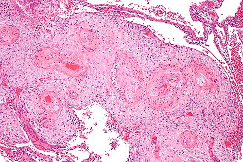
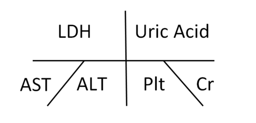

# HIPERTENSÃO GESTACIONAL

Para começar nossa conversa, vamos colocar os pingos nos is: a hipertensão na gestação não é uma doença única, mas um espectro. Se você entender que a Hipertensão Gestacional (HG) é, na verdade, um "diagnóstico de exclusão" dentro desse espectro, você já sai na frente de 90% dos candidatos.

Muitos alunos erram questões por não perceberem que a Hipertensão Gestacional é o que sobra quando a paciente tem pressão alta, mas não preenche os critérios de gravidade ou de lesão sistêmica da Pré-eclâmpsia. Como eu sempre digo nas aulas do MedEvo, o segredo aqui é o relógio e o laboratório.

## Definição e Critérios Diagnósticos

A Hipertensão Gestacional é definida pela ocorrência de níveis pressóricos elevados, ou seja, Pressão Arterial (PA) sistólica ≥ 140 mmHg e/ou PA diastólica ≥ 90 mmHg, que surgem pela primeira vez após a 20ª semana de gestação em uma mulher previamente normotensa.

Mas atenção ao detalhe que as bancas amam: para ser "Gestacional", essa hipertensão NÃO pode vir acompanhada de proteinúria significativa nem de sinais de disfunção orgânica (lesão de órgão-alvo). Se houver proteinúria ou disfunção, o nome muda para Pré-eclâmpsia.

Por que 20 semanas? Porque esse é o marco fisiológico da segunda onda de migração trofoblástica. Antes disso, se a pressão está alta, o problema geralmente já existia antes da gravidez (Hipertensão Arterial Crônica).

Para o diagnóstico ser preciso, precisamos de:

- Pelo menos duas medidas de PA ≥ 140/90 mmHg.

- Intervalo mínimo de 4 a 6 horas entre as medidas.

- Uso de manguito adequado ao braço da paciente.

Se a PA estiver ≥ 160/110 mmHg, não precisamos esperar 4 horas para confirmar. O risco de um Acidente Vascular Cerebral (AVC) é real, e o diagnóstico de hipertensão grave é imediato.

*Figura 1 - Micrografia de vasculopatia decidual hipertrófica, achado histopatológico característico da hipertensão induzida pela gestação. Coloração H&E. Fonte: Nephron, CC BY-SA 3.0 | Wikimedia Commons*

## Fisiopatologia: O Porquê da Pressão Subir

Você já se perguntou por que a pressão de algumas mulheres sobe e de outras não? Na gestação normal, o corpo da mulher é um sistema de baixa resistência. A progesterona e o óxido nítrico relaxam os vasos para acomodar o aumento absurdo do volume sanguíneo (volemia).

Na Hipertensão Gestacional, existe uma falha nessa adaptação. Embora a HG não apresente a invasão trofoblástica tão defeituosa quanto a observada na Pré-eclâmpsia (PE), há um grau de disfunção endotelial. O vaso não relaxa como deveria.

É importante entender que a HG e a PE podem ser faces da mesma moeda. Cerca de 15% a 25% das mulheres que começam com um quadro de Hipertensão Gestacional acabarão desenvolvendo proteinúria ou sinais de gravidade, evoluindo para Pré-eclâmpsia. Por isso, o diagnóstico de HG é sempre "provisório" durante o pré-natal.

## Epidemiologia e Fatores de Risco

A hipertensão é a complicação médica mais comum da gestação, afetando cerca de 5% a 10% das grávidas no Brasil. A Hipertensão Gestacional isolada responde por uma parcela significativa desses casos.

Os fatores de risco que você deve buscar na história clínica da paciente (e que aparecem nos enunciados das questões) são:

- Primiparidade (primeira gestação).

- Obesidade (o tecido adiposo é pró-inflamatório e piora a função endotelial).

- Idade materna avançada (acima de 35-40 anos) ou muito jovem (adolescentes).

- História familiar de hipertensão ou pré-eclâmpsia.

- Gestação múltipla (maior massa placentária).

- Diabetes Gestacional ou pré-existente.

Cuidado com a pegadinha: a obesidade mórbida não aumenta apenas o risco de hipertensão. Ela é um "combo" de complicações, elevando o risco de diabetes, infecções no pós-operatório e parto prematuro. Se a questão citar uma paciente obesa, ligue o alerta para múltiplas patologias.

## O Exame Físico e a Aferição Correta

Não subestime a técnica de aferição da PA. Em provas de residência, detalhes sobre a posição da paciente são cobrados com frequência.

A técnica correta exige:

- Paciente sentada, com os pés apoiados no chão.

- Braço na altura do coração.

- Repouso prévio de pelo menos 5 minutos.

- Não ter ingerido café ou fumado nos últimos 30 minutos.

- Uso do manguito que cubra 80% da circunferência do braço.

Um erro comum na prática e em provas é ignorar o "Edema". Antigamente, o edema fazia parte da tríade diagnóstica da pré-eclâmpsia (Hipertensão + Proteinúria + Edema). Hoje, o edema NÃO é mais critério diagnóstico porque é muito inespecífico na gravidez. No entanto, um ganho de peso súbito ou um edema facial/nas mãos deve acender o sinal vermelho para você investigar Pré-eclâmpsia.

*Figura 2 - Diagrama em espinha de peixe (Ishikawa) demonstrando os mecanismos fisiopatológicos da pré-eclâmpsia, diagnóstico diferencial crítico da hipertensão gestacional. Fonte: Zacharychasehamilton, CC BY-SA 4.0 | Wikimedia Commons*

## Diagnóstico Diferencial: A Chave da Aprovação

Este é o ponto onde os alunos mais se confundem. Vamos organizar isso de uma vez por todas com uma tabela comparativa, baseada nas diretrizes da FEBRASGO e da Sociedade Brasileira de Cardiologia (SBC).

### Tabela 1: Classificação das Síndromes Hipertensivas na Gestação

| Diagnóstico | Início | Proteinúria ou Lesão de Órgão-Alvo | PA após 12 semanas pós-parto |
| --- | --- | --- | --- |
| **Hipertensão Arterial Crônica (HAC)** | < 20 semanas | Geralmente ausente (pode ter por doença renal prévia) | Permanece elevada |
| **Hipertensão Gestacional (HG)** | > 20 semanas | **Ausente** | **Normaliza** |
| **Pré-eclâmpsia (PE)** | > 20 semanas | **Presente** (ou disfunção orgânica) | Geralmente normaliza |
| **PE Sobreposta à HAC** | < 20 semanas | Piora súbita da PA ou surgimento de proteinúria | Permanece elevada (base da HAC) |

Imagine o seguinte cenário: Paciente, 24 semanas, PA 150/95 mmHg, sem queixas. O que você faz? Você não pode chamar de Hipertensão Gestacional ainda sem antes provar que NÃO é Pré-eclâmpsia. Você precisa pedir exames.

## Investigação Laboratorial

Sempre que uma gestante apresentar PA ≥ 140/90 mmHg após a 20ª semana, você é obrigado a investigar lesão de órgão-alvo. Como o Dr. Will costuma enfatizar, o diagnóstico de Hipertensão Gestacional é feito por exclusão.

Os exames essenciais são:

- **Proteinúria:** Pode ser feita pela fita reagente (triagem), mas o padrão-ouro é a urina de 24 horas (≥ 300 mg/24h) ou a relação proteína/creatinina em amostra isolada (≥ 0,3).

- **Função Renal:** Creatinina plasmática (valores > 1,1 mg/dL ou o dobro da base sugerem PE).

- **Função Hepática:** Transaminases (TGO e TGP). Se estiverem o dobro do valor de referência, indica sofrimento hepático.

- **Hematologia:** Hemograma com contagem de plaquetas. Plaquetopenia (< 100.000/mm³) é sinal de gravidade.

- **Marcadores de Hemólise:** DHL (Desidrogenase Láctica) elevada e presença de esquizócitos no esfregaço de sangue periférico.

Se todos esses exames vierem normais, aí sim você carimba o diagnóstico de **Hipertensão Gestacional**.

## Manejo e Tratamento Farmacológico

Aqui está uma dúvida clássica: "Professor, se a pressão está 145/95 mmHg, eu já começo o remédio?".

A resposta curta é: depende. Na Hipertensão Gestacional leve (PA < 160/110 mmHg), o tratamento medicamentoso é controverso. A tendência atual, baseada em estudos como o CHIPS, é manter a PA diastólica em torno de 85 mmHg para evitar a progressão para formas graves, mas sem baixar demais a pressão a ponto de prejudicar a perfusão placentária.

### Tratamento Não-Farmacológico

- **Repouso:** Não se recomenda repouso absoluto na cama (aumenta risco de trombose). O ideal é repouso relativo e, se possível, em decúbito lateral esquerdo (melhora o retorno venoso e o fluxo uteroplacentário).

- **Dieta:** NÃO se faz restrição severa de sal na gravidez. A gestante precisa de volume. A orientação é dieta normossódica (cerca de 4-5g de sal por dia).

- **Monitorização:** Controle de PA domiciliar e avaliação fetal (mobilograma e, se necessário, cardiotocografia e Doppler).

### Tratamento Farmacológico (Drogas de Manutenção)

Se a PA persistir acima de 140/90 ou 150/100 mmHg (dependendo do serviço), iniciamos anti-hipertensivos orais.

### Tabela 2: Anti-hipertensivos Orais na Gestação

| Droga | Dose Inicial | Dose Máxima | Observações |
| --- | --- | --- | --- |
| **Metildopa** | 250 mg 2-3x/dia | 2.000 mg/dia | Primeira escolha. Age no SNC (alfa-2 agonista). |
| **Nifedipina (Retard)** | 10-20 mg 2x/dia | 120 mg/dia | Ótima opção, especialmente se houver resistência à metildopa. |
| **Hidralazina (VO)** | 25 mg 2-3x/dia | 200 mg/dia | Geralmente usada como terceira linha no Brasil. |

**CONTRAINDICAÇÃO ABSOLUTA:** Inibidores da ECA (Enalapril, Captopril) e Bloqueadores do Receptor de Angiotensina (Losartana). Essas drogas são teratogênicas, causando malformações renais fetais, oligodramnia e hipoplasia pulmonar. Se cair na prova, você marca como erro grave!

## Manejo da Crise Hipertensiva (Urgência e Emergência)

Se a paciente chegar com PA ≥ 160/110 mmHg, o cenário muda. Isso é uma emergência hipertensiva gestacional. O objetivo aqui não é normalizar a pressão (120/80), mas sim baixá-la para níveis seguros (140-150 / 90-100 mmHg) para evitar o AVC hemorrágico.

As drogas de escolha para o controle agudo são:

- **Hidralazina IV:** 5 mg EV, repetindo a cada 20 minutos se necessário.

- **Nifedipina (VO):** 10 mg (cápsula de liberação imediata, mas engolida, nunca sublingual).

- **Labetalol IV:** Muito usado nos EUA, mas pouco disponível em muitos hospitais públicos brasileiros.

Lembre-se: se a paciente tem Hipertensão Gestacional Grave (PA ≥ 160/110), ela deve ser internada para investigação e controle pressórico rigoroso.

## Conduta Obstétrica: Quando Interromper?

Esta é a pergunta de um milhão de reais nas provas. O momento do parto depende da idade gestacional e da estabilidade materna e fetal.

- **Hipertensão Gestacional Leve (< 160/110 mmHg):** Podemos aguardar o termo. A recomendação da FEBRASGO e do Ministério da Saúde é aguardar até 37 a 39 semanas. Não há benefício em interromper antes disso se a vitalidade fetal estiver boa.

- **Hipertensão Gestacional Grave (≥ 160/110 mmHg):** Se a pressão não controla com medicação ou se surgirem sinais de Pré-eclâmpsia grave, o parto deve ser considerado após as 34 semanas. Se for antes de 34 semanas, tentamos a corticoterapia para maturação pulmonar fetal, desde que a mãe esteja estável.

O parto vaginal é sempre a preferência, a menos que haja uma indicação obstétrica para cesariana. A hipertensão, por si só, não é indicação de cesárea.

## Prognóstico e Risco Cardiovascular Futuro

Muitos alunos acham que, após o parto, o problema acaba. Ledo engano. A Hipertensão Gestacional é um "teste de estresse" para o sistema cardiovascular da mulher.

Mulheres que tiveram HG têm um risco aumentado de:

- Desenvolver Hipertensão Arterial Crônica no futuro.

- Ter episódios de AVC e Doença Arterial Coronariana precocemente.

- Desenvolver Diabetes Tipo 2.

O diagnóstico definitivo de Hipertensão Gestacional só é confirmado se a PA normalizar até 12 semanas após o parto. Se a pressão continuar alta após 3 meses, o diagnóstico muda retroativamente para Hipertensão Arterial Crônica que foi descoberta na gestação.

## Situações Especiais e Pegadinhas de Prova

### Hipertensão do Jaleco Branco

Cerca de 30% das gestantes podem ter pressão alta apenas no consultório. Se a paciente tem PA elevada na consulta, mas o MAPA (Monitorização Ambulatorial da PA) ou o MRPA (Monitorização Residencial) são normais, e não há proteinúria, o diagnóstico é Hipertensão do Jaleco Branco. O risco de complicações é muito menor, mas essas pacientes precisam de vigilância, pois podem evoluir para hipertensão verdadeira.

### Hipertensão de Início Precoce e Refratária

Se você encontrar uma puérpera jovem com hipertensão grave que não melhora com três ou quatro remédios, pare tudo. Investigue causas secundárias, como estenose de artéria renal ou feocromocitoma. As bancas adoram colocar um caso de hipertensão "impossível de tratar" para ver se você lembra das causas secundárias.

### O Papel do Ácido Acetilsalicílico (AAS) e Cálcio

O AAS (100-150 mg/dia) e o Cálcio (1,5-2,0 g/dia) são usados para PREVENÇÃO de Pré-eclâmpsia em pacientes de alto risco. Eles não são usados para tratar a Hipertensão Gestacional já instalada. Não confunda prevenção com tratamento.

### Tabela 3: Metas Terapêuticas e Valores de Alerta

| Parâmetro | Valor de Alerta / Diagnóstico | Conduta |
| --- | --- | --- |
| **PA Sistólica** | ≥ 140 mmHg | Iniciar monitorização e investigar PE |
| **PA Diastólica** | ≥ 90 mmHg | Iniciar monitorização e investigar PE |
| **Crise Hipertensiva** | ≥ 160/110 mmHg | Internação + Anti-hipertensivo IV |
| **Proteinúria 24h** | ≥ 300 mg | Muda diagnóstico para Pré-eclâmpsia |
| **Meta na HG Leve** | 130-150 / 80-100 mmHg | Manutenção ambulatorial ou internação |

## Pontos-Chave para Prova 💡

- **Critério Temporal:** Hipertensão Gestacional só existe APÓS 20 semanas. Antes disso, é Hipertensão Crônica.

- **Critério de Exclusão:** HG é PA ≥ 140/90 SEM proteinúria e SEM sinais de disfunção orgânica.

- **Diagnóstico Definitivo:** É retrospectivo. A PA deve normalizar até 12 semanas pós-parto.

- **Primeira Escolha Oral:** Metildopa (250 mg a 2.000 mg/dia).

- **Contraindicação ABSOLUTA:** IECA (Enalapril) e BRA (Losartana) em qualquer fase da gestação.

- **Crise Hipertensiva (≥ 160/110):** Hidralazina IV ou Nifedipina VO (não sublingual). O objetivo é prevenir o AVC.

- **Edema:** Não é mais critério diagnóstico, mas o ganho de peso súbito exige investigação de Pré-eclâmpsia.

- **Proteinúria:** O padrão-ouro é a coleta de 24 horas (≥ 300 mg). A fita de urina (+) é apenas triagem.

- **Interrupção do Parto:** Na HG leve, aguardar termo (37-39 semanas). Na HG grave, considerar a partir de 34 semanas.

- **Risco Futuro:** A HG aumenta o risco de doenças cardiovasculares e hipertensão crônica ao longo da vida.

- **Exames de Rotina:** Toda gestante com HG deve repetir exames laboratoriais semanalmente ou quinzenalmente para descartar evolução para Pré-eclâmpsia.

- **Sulfato de Magnésio:** NÃO é usado na Hipertensão Gestacional pura. Ele é exclusivo para prevenção de crises convulsivas na Pré-eclâmpsia com sinais de gravidade ou Eclâmpsia.

- **Pegadinha de Prova:** A banca vai dizer que a paciente tem PA 145/95 e edema de membros inferiores e perguntar o diagnóstico. Se não houver proteinúria ou outros sintomas, a resposta é Hipertensão Gestacional.

- **Diferencial Pós-Parto:** Se a PA persistir elevada após 12 semanas do parto, o diagnóstico final é Hipertensão Arterial Crônica.

Entender a Hipertensão Gestacional é dominar a arte de vigiar. Como professor, meu conselho é: nunca subestime uma pressão de 140/90. Ela pode ser o início de algo mais grave ou apenas uma adaptação falha, mas para a prova (e para a vida), o rigor no diagnóstico é o que salva a paciente e garante a sua vaga.

 Cópia offline para consulta pessoal.
 Fonte original:
 [https://www.medevo.com.br/material-apoio/ler/8ee5ff72-917e-4b68-a0a8-25306ab0f6d2](https://www.medevo.com.br/material-apoio/ler/8ee5ff72-917e-4b68-a0a8-25306ab0f6d2)
