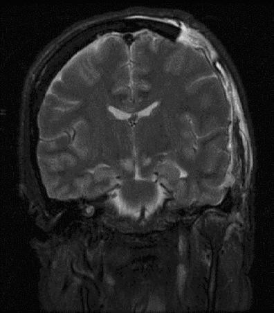
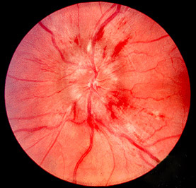

# HIPERTENSÃO INTRACRANIANA

Se você quer dominar a neurocirurgia para as provas de residência, precisa entender uma coisa fundamental: o crânio de um adulto é uma caixa fechada e rígida. Ele não expande. Dentro dessa caixa, temos três componentes que vivem em um equilíbrio delicado. Se um deles aumenta de tamanho e os outros não conseguem compensar, a pressão sobe. É simples assim, mas as consequências são catastróficas.

Nesta aula, vamos dissecar a Hipertensão Intracraniana (HIC) — desde a fisiopatologia que explica as curvas de pressão até as condutas de "última linha" que você verá cair nas provas mais difíceis.

## A Doutrina de Monro-Kellie: O Equilíbrio da "Caixa Rígida"

Para entender a HIC, você deve visualizar o conteúdo intracraniano. Segundo a **Doutrina de Monro-Kellie**, o volume total dentro do crânio é constante e composto por:

- **Parênquima cerebral:** ~80% do volume.

- **Sangue (arterial e venoso):** ~10% do volume.

- **Líquido Cefalorraquidiano (LCR):** ~10% do volume.

Quando surge uma massa (um hematoma, um tumor ou edema cerebral), o corpo tenta compensar. Como? Expulsando LCR para o canal raquidiano e desviando sangue venoso para fora do crânio.

**Dica do Dr. Will:** As bancas adoram perguntar quais são os primeiros mecanismos compensatórios. Lembre-se: a saída de LCR e o colapso do sistema venoso são os primeiros a agir. Quando esses mecanismos se esgotam, a pressão sobe exponencialmente.

### Complacência e Elastância Cerebral

Aqui muitos alunos se confundem. Vamos simplificar:

- **Complacência:** É a capacidade do cérebro de acomodar volume extra sem aumentar muito a pressão. No início de um sangramento, a complacência é alta.

- **Elastância:** É o contrário. É a "resistência" ao aumento de volume. Quando a complacência acaba, a elastância fica alta: qualquer gota a mais de sangue faz a Pressão Intracraniana (PIC) disparar.

Na curva pressão-volume, isso se traduz em uma fase de platô (compensação) seguida por uma subida vertical (descompensação). Se a questão falar em "perda de complacência", ela está descrevendo o momento em que o paciente está prestes a herniar.

## Pressão de Perfusão Cerebral (PPC): O Cálculo que Salva Vidas

Não adianta apenas baixar a PIC; o cérebro precisa de sangue chegando. É aqui que entra a fórmula mais cobrada em provas de trauma:

**PPC = PAM – PIC**

Onde:

- **PAM:** Pressão Arterial Média.

- **PIC:** Pressão Intracraniana.

**Meta Terapêutica:** No TCE grave, o objetivo é manter a **PPC entre 60 e 70 mmHg**.

**Pegadinha de Prova:** A alternativa vai dizer que a Pressão Venosa Central (PVC) faz parte do cálculo. **Mentira!** A PVC não entra na conta da perfusão cerebral. Outro erro comum é achar que devemos baixar a pressão arterial de um paciente com HIC. Cuidado! Se você baixar a PAM de um paciente com PIC alta, a PPC despenca e o cérebro sofre isquemia.

| Parâmetro | Valor de Referência / Meta |
| --- | --- |
| PIC Normal | 5 a 15 mmHg |
| Gatilho para Tratamento (HIC) | > 22 mmHg (sustentada > 5 min) |
| PPC Alvo (Adulto) | 60 - 70 mmHg |
| PPC Alvo (Pediátrico) | 40 - 65 mmHg |

*Figura 1 - Ressonância magnética coronal (T2 FLAIR) demonstrando lesão por herniação cerebral. A herniação é a consequência mais temida da hipertensão intracraniana não controlada. Fonte: Rocque BG e Başkaya MK, CC BY 2.0 | Wikimedia Commons*

## Quadro Clínico: Da Cefaleia à Parada Respiratória

O diagnóstico de HIC é clínico e radiológico. Os sintomas clássicos formam a tríade: **Cefaleia, Vômitos (frequentemente em jato) e Papiledema.**

### A Tríade de Cushing

Este é um sinal **tardio** e indica que o tronco cerebral está sofrendo. Se aparecer na sua questão, o paciente está a um passo da morte. Ela é composta por:

- **Hipertensão Arterial:** O corpo tenta aumentar a PAM para vencer a PIC e manter a perfusão.

- **Bradicardia:** Resposta reflexa ao aumento da pressão arterial (reflexo de Baroreceptores).

- **Alterações Respiratórias (Bradipneia ou Irregularidade):** Compressão do centro respiratório no bulbo.

### Síndromes de Herniação

Quando a pressão é tão alta que o cérebro é "empurrado" para fora de seus compartimentos originais, temos as herniações.

- **Hérnia de Úncus (Uncal):** É a mais famosa em provas. O lobo temporal (úncus) hernia através da tenda do cerebelo.

- **Sinal Patognomônico:** Midríase ipsilateral (dilatação da pupila do mesmo lado da lesão) por compressão do **III par craniano (nervo oculomotor)**.

- **Hemiparesia Contralateral:** Por compressão do pedúnculo cerebral.

- **Hérnia de Forame Magno (Tonsilar):** As tonsilas cerebelares comprimem o bulbo.

- **Resultado:** Parada respiratória súbita.

- **Hérnia Transtentorial Central:** Rebaixamento global do nível de consciência e postura de decorticação ou descerebração.

**Exemplo Clínico Rápido:** Paciente vítima de queda de altura chega com Glasgow 7, pupila direita dilatada e não reagente, e bradicardia (FC 45). O que está acontecendo? Hérnia uncal à direita com compressão do III par e início de Tríade de Cushing. Conduta: Medidas imediatas para reduzir a PIC e TC de crânio urgente.

*Figura 2 - Fundoscopia demonstrando papiledema: edema do disco óptico causado por hipertensão intracraniana. A presença de papiledema é um sinal clássico de HIC e pode ser identificada no exame de fundo de olho. Fonte: Jonathan Trobe, M.D., CC BY 3.0 | Wikimedia Commons*

## Diagnóstico por Imagem: O Papel da Tomografia

A **Tomografia de Crânio Sem Contraste** é o padrão-ouro na emergência. No contexto de HIC e trauma, buscamos:

- Desvio de linha média (> 5 mm é sinal de alerta crítico).

- Apagamento de sulcos e giros (edema cerebral).

- Compressão de cisternas basais (indica risco iminente de herniação).

- Presença de sangue (hematomas).

### Hematoma Epidural vs. Subdural

As bancas amam comparar esses dois. Use a tabela abaixo para nunca mais errar:

| Característica | Hematoma Epidural (Extradural) | Hematoma Subdural Agudo |
| --- | --- | --- |
| **Vaso Acometido** | Artéria (geralmente Meníngea Média) | Veias (veias em ponte) |
| **Formato na TC** | Biconvexo (Lente) | Crescente (Côncavo-convexo) |
| **Limites** | Não cruza suturas cranianas | Cruza suturas cranianas |
| **Clínica Clássica** | **Intervalo Lúcido** (bate a cabeça, acorda, depois desmaia) | Deterioração rápida e progressiva |
| **Gravidade** | Prognóstico melhor se operado rápido | Prognóstico geralmente pior (lesão parenquimatosa) |

## Manejo da Hipertensão Intracraniana: O Passo a Passo

O tratamento da HIC segue uma hierarquia de medidas (Tiers). Não pulamos etapas, a menos que o paciente esteja herniando na nossa frente.

### Medidas Gerais (Tier 0)

Antes de usar drogas potentes, o básico precisa estar perfeito:

- **Cabeceira elevada a 30°:** Facilita a drenagem venosa.

- **Cabeça centralizada:** Evita compressão das veias jugulares.

- **Sedação e Analgesia:** O fentanil é excelente aqui. Paciente com dor ou agitado faz picos de PIC.

- **Controle da Temperatura:** Evitar febre (aumenta o metabolismo cerebral).

- **Evitar Soluções Hipotônicas:** Soro Glicosado a 5% ou Salina 0,45% são **proibidos**. Eles "empurram" água para dentro do neurônio e pioram o edema.

### Terapias Osmóticas (Tier 1)

O objetivo é criar um gradiente osmótico para "puxar" água do cérebro para o sangue.

- **Manitol (20%):** Dose de 0,25 a 1 g/kg.

- **Cuidado:** Causa diurese osmótica. Se o paciente estiver chocado (hipotenso), o manitol pode piorar a situação. Monitorar osmolaridade plasmática (manter < 320 mOsm/L).

- **Solução Salina Hipertônica (3% ou 20%):** Tem ganhado preferência em pacientes hipotensos, pois ajuda na reposição volêmica enquanto trata a PIC.

### Hiperventilação: O "Freio de Emergência"

A PaCO2 influencia diretamente o calibre dos vasos cerebrais:

- **Hipercapnia (↑CO2):** Causa vasodilatação -> ↑ Sangue no crânio -> ↑ PIC.

- **Hipocapnia (↓CO2):** Causa vasoconstrição -> ↓ Sangue no crânio -> ↓ PIC.

**Atenção:** A hiperventilação (PaCO2 30-35 mmHg) deve ser usada apenas por curtos períodos. Se você fechar demais os vasos (PaCO2 < 25), causa isquemia cerebral. É uma medida de resgate enquanto se prepara a cirurgia.

### Intervenções Cirúrgicas e Avançadas (Tier 2 e 3)

- **Derivação Ventricular Externa (DVE):** É o padrão-ouro para monitorar a PIC e permite drenar LCR terapeuticamente.

- **Hemicraniectomia Descompressiva:** Retirada de um grande flap ósseo para deixar o cérebro "inchar" para fora. Indicada em HIC refratária ou AVC isquêmico maligno em jovens (< 60 anos).

- **Coma Barbitúrico (Tiopental):** Reduz drasticamente o metabolismo cerebral, mas causa hipotensão severa. É a última cartada clínica.

**Erro que reprova:** Prescrever corticoide para TCE. Segundo o estudo **CRASH**, o uso de corticosteroides no trauma craniano **aumenta a mortalidade**. Eles só servem para edema vasogênico (tumores e abscessos). No MedEvo, sempre reforçamos: corticoide no trauma é erro fatal na prova.

## Situações Especiais e Pegadinhas

### HIC Pediátrica

Em crianças pequenas, as fontanelas (moleiras) abertas podem retardar os sinais de HIC, pois o crânio ainda tem alguma capacidade de expansão. No entanto, uma vez que a compensação falha, a deterioração é rápida. O manitol em crianças deve ser usado com cautela nas doses de 0,25-1 g/kg (evite as doses mais altas de 3 g/kg que algumas bancas antigas citavam).

### Aspectos Médico-Legais do Trauma

Uma pérola clínica que apareceu em análises recentes: se o trauma ocorreu durante o trabalho (nexo causal), o benefício previdenciário correto é o **Auxílio-Doença Acidentário (B91)**, e não o previdenciário comum (B31). O B91 garante estabilidade de 12 meses após o retorno.

### Monitorização da PIC: Quando indicar?

Segundo as diretrizes da *Brain Trauma Foundation* (amplamente seguidas no Brasil):

- TCE Grave (Glasgow 3-8) + TC de crânio alterada.

- TCE Grave + TC normal, mas com 2 ou mais dos seguintes: Idade > 40 anos, Postura motora (decorticação/descerebração) ou PAS < 90 mmHg.

## Pontos-Chave para Prova

- **Valores Críticos:** Tratar PIC se > 22 mmHg por mais de 5 minutos. Manter PPC entre 60-70 mmHg.

- **Cálculo da PPC:** PAM - PIC. Lembre-se: PVC não entra na fórmula!

- **Tríade de Cushing:** Hipertensão + Bradicardia + Bradipneia (sinal de herniação iminente).

- **Hérnia de Úncus:** Midríase ipsilateral (III par) + Hemiparesia contralateral.

- **O Grande "NÃO":** Corticosteroides são contraindicados no TCE (Estudo CRASH).

- **Soluções Proibidas:** Nunca use soluções hipotônicas (SG 5%, Salina 0,45%) em pacientes com risco de HIC.

- **Hematoma Epidural:** Imagem biconvexa, artéria meníngea média, intervalo lúcido.

- **Hematoma Subdural:** Imagem em crescente, veias em ponte, pior prognóstico.

- **Hiperventilação:** Medida temporária de resgate (alvo PaCO2 30-35 mmHg). Nunca manter de forma crônica.

- **Primeira Escolha na Crise Convulsiva:** Benzodiazepínicos (Diazepam ou Midazolam) pela rapidez de ação.

- **Posicionamento:** Cabeceira a 30° e pescoço neutro para otimizar drenagem venosa.

- **Manitol vs. Salina:** Salina hipertônica é preferível se o paciente estiver hipotenso.

- **DVE:** É o melhor método pois monitora e trata (drena LCR) ao mesmo tempo.

- **Complicação da Craniectomia:** Higroma subdural e hidrocefalia são comuns no pós-operatório.

- **Pupilas Médio-Fixas:** Sugerem lesão em nível de mesencéfalo.

- **Postura de Decorticação:** Lesão acima do núcleo rubro (diencéfalo/córtex).

- **Postura de Descerebração:** Lesão abaixo do núcleo rubro (tronco cerebral) - pior prognóstico. 💡

 Cópia offline para consulta pessoal.
 Fonte original:
 [https://www.medevo.com.br/material-apoio/ler/f7590ae5-b098-473a-bdac-51ee81ed2114](https://www.medevo.com.br/material-apoio/ler/f7590ae5-b098-473a-bdac-51ee81ed2114)
