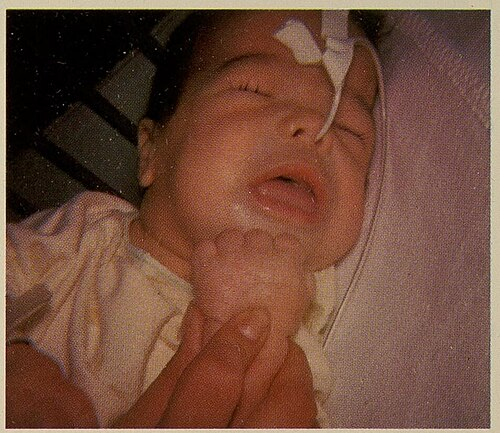
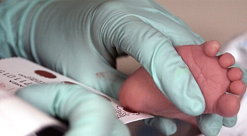

# HIPOTIREOIDISMO CONGÊNITO

O hipotireoidismo congênito (HC) é, sem dúvida, um dos temas mais importantes da pediatria em provas de residência. Por que? Porque ele representa a maior causa de retardo mental evitável no mundo. Como professor, vejo muitos alunos focarem apenas em decorar valores de TSH, mas o segredo para dominar este assunto é entender a janela de oportunidade terapêutica e a fisiopatologia por trás da triagem.

No Brasil, o Programa Nacional de Triagem Neonatal (PNTN), o famoso Teste do Pezinho, é o pilar central. O HC ocorre quando há uma produção insuficiente de hormônios tireoidianos ao nascimento, o que é catastrófico para o sistema nervoso central em desenvolvimento.

*Figura 1 - Fenótipo clássico do hipotireoidismo congênito não tratado: fácies hipotireoidiana com macroglossia, pele seca e hérnia umbilical. A detecção precoce pela triagem neonatal é fundamental. Fonte: Sydney S. Gellis e Murray Feingold, Domínio Público | Wikimedia Commons*

## Fisiopatologia e a Proteção Materna

Para entender por que o recém-nascido (RN) com HC geralmente nasce com aparência normal, precisamos olhar para a placenta. Durante a gestação, o T4 materno atravessa a barreira placentária. Embora essa passagem seja parcial, ela fornece cerca de 33% a 40% dos níveis de T4 fetal.

Essa quantidade é suficiente para proteger o cérebro do feto e permitir que ele nasça sem sinais clínicos evidentes. No entanto, após o clampeamento do cordão umbilical, essa fonte externa desaparece. Se a tireoide do bebê não funcionar, os níveis de T4 despencam, e o TSH sobe na tentativa desesperada de estimular uma glândula que, muitas vezes, nem está lá.

Lembre-se: o desenvolvimento neurológico depende criticamente do hormônio tireoidiano nos primeiros dois anos de vida. Sem ele, a mielinização e a arborização dendrítica ficam comprometidas de forma irreversível. É por isso que o tratamento é uma emergência neurodesenvolvimental.

## Etiologia: Onde está o problema?

O HC é classificado principalmente pela localização do defeito. A vasta maioria dos casos (cerca de 85% a 90%) é de origem primária, ou seja, o problema está na própria glândula tireoide.

### Disgenesia Tireoidiana

É a causa mais comum de HC primário permanente (85% dos casos). Aqui, a glândula não se formou corretamente durante a embriogênese.

- Ectopia: A tireoide "parou" no meio do caminho durante sua descida da base da língua até o pescoço. É a forma mais frequente de disgenesia.

- Agenesia: Ausência total de tecido tireoidiano.

- Hipoplasia: A glândula existe, mas é muito pequena.

### Disormonogênese

Ocorre em cerca de 10% a 15% dos casos. A glândula está no lugar certo e tem tamanho normal (ou está aumentada, formando bócio), mas não consegue produzir o hormônio por defeitos enzimáticos hereditários, geralmente autossômicos recessivos. O defeito mais comum é na enzima peroxidase tireoidiana (TPO).

### Hipotireoidismo Central (Secundário ou Terciário)

É raro e ocorre por deficiência de TSH (hipófise) ou TRH (hipotálamo). Um detalhe fundamental para a prova: o Teste do Pezinho no Brasil, que utiliza a dosagem de TSH, **não detecta** o hipotireoidismo central, pois, nesses casos, o TSH está baixo ou normal.

### Hipotireoidismo Transitório

Pode ser causado por passagem transplacentária de anticorpos maternos (bloqueadores do receptor de TSH), uso materno de drogas antitireoidianas ou deficiência/excesso de iodo.

## O Teste do Pezinho (Triagem Neonatal)

Este é o ponto onde as bancas mais concentram questões. No Brasil, a triagem é feita através da dosagem do TSH em sangue capilar colhido em papel filtro.

### O Momento da Coleta

A coleta ideal deve ser feita entre o **3º e o 5º dia de vida**. Por que não antes? Porque logo após o nascimento ocorre um pico fisiológico de TSH (o "surge" de TSH) como resposta ao estresse do parto e ao frio. Se você colher nas primeiras 24 horas, encontrará um TSH falsamente elevado em quase todos os bebês, gerando resultados falso-positivos desnecessários.

Se o bebê for prematuro ou estiver gravemente enfermo, a recomendação é coletar no 3º ao 5º dia, mas repetir a coleta com 15 e 30 dias de vida, devido à imaturidade do eixo hipotálamo-hipófise-tireoide.

### Interpretando os Valores de TSH no Papel Filtro

Cada estado pode ter protocolos levemente diferentes, mas a diretriz do Ministério da Saúde e da Sociedade Brasileira de Pediatria (SBP) estabelece marcos gerais:

| Valor do TSH Neonatal (Papel Filtro) | Conduta Imediata |
| --- | --- |
| Abaixo de 10 mUI/L | Normal. Nenhuma conduta adicional. |
| Entre 10 e 20 mUI/L | Suspeito. Repetir coleta em papel filtro ou partir para coleta venosa (depende do protocolo local). |
| Acima de 20 mUI/L | Fortemente suspeito. Convocar imediatamente para coleta de TSH e T4 Livre venosos. |
| Acima de 40-60 mUI/L | Altíssimo risco. Coletar exames venosos e considerar início imediato do tratamento. |

Cuidado com a pegadinha: se o TSH vier muito elevado (ex: > 40), não se perde tempo repetindo papel filtro. O Dr. Will sempre reforça em suas discussões de caso que, diante de valores críticos, a prioridade é a confirmação venosa e o início rápido da levotiroxina.

## Quadro Clínico: O que observar?

Como discutimos, a maioria dos RNs é assintomática ao nascimento. No entanto, com o passar das semanas, os sinais começam a aparecer. Se você esperar o quadro clássico de "mixedema congênito" para diagnosticar, o bebê já terá perda de pontos de QI.

### Sinais Precoces (Primeiras semanas)

- Icterícia neonatal prolongada (por atraso na maturação da glucoroniltransferase hepática).

- Dificuldade de alimentação e sonolência (o bebê "bonzinho" que não acorda para mamar).

- Constipação intestinal.

- Hipotonia.

- Fontanela posterior aberta (> 0,5 cm).

### Sinais Tardios (O quadro clássico)

- Fácies mixedematosa (rosto inchado).

- Macroglossia (língua protusa).

- Hérnia umbilical (muito comum em provas).

- Pele seca, fria e marmorata.

- Choro rouco.

- Atraso no desenvolvimento neuropsicomotor (DNPM).

- Baixa estatura e atraso na velocidade de crescimento.

Exemplo clínico rápido: Um lactente de 2 meses é levado ao posto de saúde. A mãe relata que ele é muito calmo, dorme o tempo todo e o "intestino é preguiçoso". Ao exame, você nota icterícia leve, uma hérnia umbilical redutível e uma língua que parece grande para a boca. Qual o diagnóstico? Hipotireoidismo Congênito até que se prove o contrário.

*Figura 2 - Coleta de sangue do calcanhar de recém-nascido para triagem neonatal. No Brasil, o Teste do Pezinho é o pilar do rastreamento do hipotireoidismo congênito, dosando TSH em papel filtro entre o 3° e 5° dia de vida. Fonte: U.S. Air Force/Staff Sgt Eric T. Sheler, Domínio Público | Wikimedia Commons*

## Diagnóstico Confirmatório

Após um teste de triagem alterado, o diagnóstico deve ser confirmado com exames de sangue venoso (sérico).

- TSH Sérico: Estará elevado no HC primário.

- T4 Livre Sérico: Estará baixo.

Atenção: Se o TSH estiver elevado, mas o T4 Livre estiver normal, estamos diante de um Hipotireoidismo Subclínico. No período neonatal, a conduta costuma ser tratar se o TSH sérico for > 10 mUI/L, para garantir a proteção cerebral.

### Exames de Imagem (Etiológicos)

Eles não devem atrasar o início do tratamento, mas são úteis para definir a causa (disgenesia vs. disormonogênese) e o prognóstico (risco de recorrência em futuras gestações).

- Ultrassonografia de Tireoide: Avalia a presença e localização da glândula. É operador-dependente e pode não ver glândulas ectópicas pequenas.

- Cintilografia (Tecnécio 99m ou Iodo 123): É o padrão-ouro para identificar ectopia. Se não houver captação, sugere agenesia ou defeito no transportador de iodo.

*Figura 2 - Coleta de sangue do calcanhar de recém-nascido para triagem neonatal. No Brasil, o Teste do Pezinho é o pilar do rastreamento do hipotireoidismo congênito, dosando TSH em papel filtro entre o 3° e 5° dia de vida. Fonte: U.S. Air Force/Staff Sgt Eric T. Sheler, Domínio Público | Wikimedia Commons*

## Diagnóstico Diferencial e Condições Correlatas

### Deficiência de TBG (Globulina Ligadora de Tiroxina)

Esta é uma pegadinha clássica de prova. A TBG é a proteína que carrega o T4 no sangue. Se o bebê tem deficiência congênita de TBG (comum em meninos, herança ligada ao X), ele terá um **T4 Total baixo**, mas o **TSH e o T4 Livre serão normais**. Esse bebê é eutireoidiano e NÃO precisa de tratamento. O MedEvo sempre destaca: trate o paciente (T4 Livre), não o exame (T4 Total).

### Cisto do Ducto Tireoglosso

Muitas vezes cobrado junto com tireoide pediátrica. É uma massa cervical na linha média, indolor, que se move à deglutição ou à protrusão da língua. O tratamento é a cirurgia de Sistrunk (ressecção do cisto e da parte central do osso hioide). Cuidado: antes de operar, você deve garantir que aquela massa não é a única tireoide funcional do paciente (tireoide ectópica).

### Hipotireoidismo Adquirido (Tireoidite de Hashimoto)

Diferente do congênito, o adquirido aparece mais tarde, geralmente em escolares ou adolescentes. O sinal cardinal é a queda na velocidade de crescimento e bócio. Os anticorpos (Anti-TPO e Anti-tireoglobulina) costumam estar positivos.

## Tratamento: A Urgência Pediátrica

O objetivo é iniciar a reposição hormonal o mais rápido possível, idealmente **antes dos 14 dias de vida**.

### Medicamento de Escolha

Levotiroxina sódica (L-T4) sintética por via oral. Não se usa T3, pois o cérebro faz a conversão local de T4 em T3 conforme a necessidade.

### Dose Inicial

A dose no RN é significativamente maior do que no adulto devido ao metabolismo acelerado e à necessidade de saturação rápida dos receptores cerebrais:

- **10 a 15 mcg/kg/dia**, em dose única diária.

### Orientações de Administração

Este é um ponto prático que cai em prova. A levotiroxina deve ser administrada:

- Em jejum (30 a 60 minutos antes da mamada).

- Amassada em uma colher com um pouco de água ou leite materno (não deve ser diluída em mamadeiras cheias, pois se o bebê não tomar tudo, a dose será incompleta).

- **Evitar** administração conjunta com ferro, cálcio ou fórmulas de soja, pois reduzem drasticamente a absorção do medicamento.

| Situação | Conduta |
| --- | --- |
| TSH Triagem > 20 e RN com sintomas | Iniciar L-T4 imediatamente após colher sangue venoso. |
| TSH Triagem entre 10-20 e RN bem | Aguardar resultado venoso para decidir. |
| TSH Sérico > 10 e T4L baixo | Iniciar L-T4 (10-15 mcg/kg/dia). |
| TSH Sérico entre 6-10 após período neonatal | Individualizar, mas geralmente tratar se persistente. |

## Seguimento e Metas Terapêuticas

O acompanhamento deve ser rigoroso para garantir que o bebê não esteja recebendo nem pouco hormônio (risco de retardo mental) nem muito (risco de craniossinostose e problemas cardíacos).

### Metas Laboratoriais

- T4 Livre: Deve ser mantido na metade superior da normalidade para a idade.

- TSH: Deve ser mantido entre 0,5 e 2,0 mUI/L (ou conforme o valor de referência laboratorial para a idade, evitando que fique elevado).

### Frequência de Monitorização (Sugestão SBP)

- 1 a 2 semanas após o início do tratamento.

- A cada 1 a 2 meses até os 6 meses de idade.

- A cada 2 a 3 meses dos 6 meses aos 3 anos.

- A cada 3 a 6 meses até o final do crescimento.

### Reavaliação do Diagnóstico

Em casos onde não foi comprovada uma disgenesia (tireoide ectópica ou agenesia) no início, recomenda-se tentar a suspensão do tratamento por 30 dias após os **3 anos de idade**. Se o TSH subir e o T4 cair, o HC é permanente. Se os exames continuarem normais, o HC era transitório. Nunca faça essa reavaliação antes dos 3 anos, pois é o período crítico de desenvolvimento cerebral.

## Complicações do Não Tratamento

Se o diagnóstico for tardio ou o tratamento for inadequado, as consequências são graves:

- Deficiência intelectual irreversível (redução do QI).

- Distúrbios de marcha e coordenação motora.

- Surdez neurossensorial.

- Baixa estatura acentuada (nanismo tireoidiano).

- Atraso puberal.

## Outras Condições de Triagem Neonatal (Conexão)

As bancas adoram misturar HC com outras doenças do teste do pezinho.

- Hiperplasia Adrenal Congênita (HAC): O marcador é a 17-OH-Progesterona. Cuidado: o uso de corticoides (prednisona) pela mãe na gestação pode causar falso-negativos na triagem da HAC.

- Fibrose Cística: O marcador é a tripsina imunorreativa (IRT).

- Fenilcetonúria: Dosagem de fenilalanina.

Lembre-se também da importância da Taurina. Embora não seja um hormônio, a taurina presente no leite humano é essencial para o desenvolvimento da retina, do cérebro e para a conjugação de ácidos biliares no RN, reforçando a importância do aleitamento materno também nesses pacientes.

## Pontos-Chave para Prova

- O Hipotireoidismo Congênito é a principal causa de retardo mental evitável.

- A causa mais comum é a disgenesia tireoidiana (ectopia é a principal).

- A maioria dos RNs é assintomático ao nascimento devido ao T4 materno.

- Coleta do Teste do Pezinho: Ideal entre o 3º e o 5º dia de vida.

- Marcador da triagem no Brasil: TSH (não detecta hipotireoidismo central).

- TSH neonatal > 20 mUI/L exige convocação imediata para exames venosos.

- TSH neonatal > 40-60 mUI/L autoriza início do tratamento logo após a coleta venosa, sem esperar o resultado.

- Tratamento de escolha: Levotiroxina oral, 10 a 15 mcg/kg/dia.

- Janela de ouro: Iniciar o tratamento antes dos 14 dias de vida.

- Sinais clínicos clássicos: Icterícia prolongada, hérnia umbilical, macroglossia, hipotonia e fontanela posterior aberta.

- Deficiência de TBG: T4 total baixo com TSH e T4 livre normais (não tratar).

- Cisto do ducto tireoglosso: Massa na linha média que se move com a língua (Cirurgia de Sistrunk).

- Monitorização: TSH e T4 Livre são os exames de escolha. T3 não é usado na rotina.

- Interferentes na absorção: Ferro, cálcio e soja (devem ser evitados próximos à dose).

- Reavaliação etiológica: Somente após os 3 anos de idade, se a causa inicial não for óbvia (como ectopia).

- Contraindicação absoluta: Não existe contraindicação para tratar HC confirmado, o risco do não tratamento é sempre superior.

- Erro comum: Achar que TSH normal exclui HC central (em casos de suspeita de pan-hipopituitarismo, deve-se dosar T4 Livre mesmo com TSH normal). 💡

 Cópia offline para consulta pessoal.
 Fonte original:
 [https://www.medevo.com.br/material-apoio/ler/87cf946a-9b59-49d4-b526-2c7aba9d506a](https://www.medevo.com.br/material-apoio/ler/87cf946a-9b59-49d4-b526-2c7aba9d506a)
