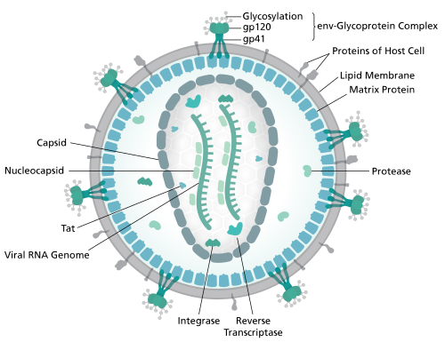
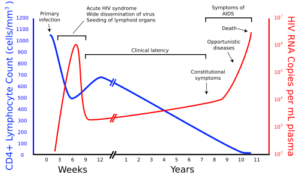

# HIV/AIDS

Para entender o HIV, você precisa parar de pensar nele como uma "doença terminal" e passar a enxergá-lo como uma **condição inflamatória crônica multissistêmica**. O vírus não mata ninguém diretamente; ele "abre a porta" para que outros agentes entrem ou para que o próprio sistema imune, em frangalhos, perca o controle sobre neoplasias.

Nas provas de residência, o examinador quer saber se você sabe diagnosticar (respeitando a janela imunológica), se conhece o esquema vacinal e terapêutico atualizado do Ministério da Saúde e, principalmente, se sabe manejar as complicações oportunistas.

*Figura 1 - Diagrama da estrutura do vírion HIV: envelope lipídico com glicoproteínas gp120/gp41, matriz p17, capsídeo p24 e RNA genômico com transcriptase reversa. Fonte: Thomas Splettstoesser, CC BY-SA 4.0 | Wikimedia Commons*

## Fisiopatologia e História Natural: O Porquê da Imunodeficiência

O HIV é um retrovírus (família *Retroviridae*, subfamília *Lentivirus*). Ele tem afinidade pelo receptor **CD4**, presente principalmente nos linfócitos T auxiliares, mas também em macrófagos e células dendríticas.

Por que o CD4 cai? Não é só porque o vírus explode a célula ao sair. A maior parte da perda de CD4 ocorre por **apoptose** e pela ativação imune crônica exaustiva. O corpo tenta repor, mas o "incêndio" é constante.

### As Fases da Infecção

- **Síndrome Retroviral Aguda (SRA):** Ocorre 2 a 4 semanas após a exposição. É um quadro de "mononucleose-like": febre, faringite, linfoadenopatia e, às vezes, um exantema morbiliforme.

- **Dica de Prova:** Se um paciente jovem chega com febre, dor de garganta e adenomegalia após comportamento de risco recente, peça a **Carga Viral (PCR)**. Por quê? Porque o anticorpo (ELISA) ainda pode estar negativo (janela imunológica).

- **Latência Clínica:** O paciente está assintomático, mas o vírus está replicando loucamente nos linfonodos. Essa fase dura, em média, 8 a 10 anos.

- **AIDS (SIDA):** Definida por uma contagem de **CD4 < 200 cel/mm³** OU pela presença de uma **doença definidora de AIDS**, independentemente do CD4.

## Diagnóstico e Janela Imunológica

Aqui é onde muitos alunos erram. O diagnóstico no Brasil segue o algoritmo do Ministério da Saúde, priorizando os **Testes Rápidos (TR)**.

### O Algoritmo de Triagem

- **Passo 1:** Realizar TR1 (de uma marca).

- **Passo 2:** Se TR1 reagente, realizar TR2 (de marca diferente, para aumentar o valor preditivo positivo).

- **Resultado:** TR1 (+) e TR2 (+) = Diagnóstico confirmado.

Se os testes forem discordantes, faz-se um terceiro teste ou o Western Blot/Teste Molecular.

**Cuidado com a Janela Imunológica:** É o tempo entre a infecção e a detecção de marcadores. Com os testes de 4ª geração (que detectam anticorpo + antígeno p24), essa janela é de aproximadamente **15 a 20 dias**. Se o teste for apenas de anticorpos, pode chegar a 30-90 dias.

**Pegadinha de Prova:** O examinador coloca um paciente com exposição há 5 dias e teste negativo. Isso exclui HIV? Jamais. Você deve repetir o teste ou solicitar carga viral se houver sintomas de SRA.

### Como pensar o diagnóstico na prática de prova

O diagnóstico de HIV não é uma pergunta única; é uma sequência de raciocínio conforme **tempo desde a exposição**, **sintomas**, **idade** e **tipo de teste disponível**.

| Cenário | Melhor raciocínio |
| --- | --- |
| Pessoa assintomática em testagem de rotina | Teste rápido ou imunoensaio conforme fluxograma. Dois testes reagentes de metodologias/fabricantes diferentes confirmam a infecção no fluxo apropriado. |
| Exposição muito recente com teste negativo | Não exclui HIV. Pode estar em janela imunológica; repetir testagem e considerar teste molecular se houver síndrome retroviral aguda ou alto risco. |
| Síndrome retroviral aguda | Febre, faringite, rash, adenomegalia e exposição recente pedem carga viral/RNA-HIV, porque anticorpos podem ainda não ter positivado. |
| Testes rápidos discordantes | Não “escolha o positivo nem o negativo”. Siga fluxograma com nova amostra, teste complementar/imunoensaio ou teste molecular conforme disponibilidade. |
| Criança menor de 18 meses exposta ao HIV | Não usar sorologia como diagnóstico definitivo, porque anticorpos maternos atravessam a placenta. O diagnóstico é por métodos virológicos/moleculares. |
| Suspeita de HIV-2 | Pensar em procedência/exposição epidemiológica compatível e seguir investigação específica, porque algumas drogas e interpretações mudam. |

**Detalhe de prova:** teste de 4ª geração encurta a janela por detectar antígeno p24 além de anticorpos, mas ainda não zera a janela. Se a história é muito recente, o resultado negativo precisa ser interpretado com cautela.

## Terapia Antirretroviral (TARV): O Esquema Brasileiro

A regra de ouro atual: **Diagnosticou? Tratou.** Não importa o CD4, não importa a carga viral. O tratamento precoce reduz a transmissão (Conceito de **TasP - Treatment as Prevention**: Indetectável = Intransmissível) e evita o dano inflamatório crônico.

### Esquema Inicial Preferencial (PCDT vigente)

O esquema "padrão-ouro" no Brasil para adultos é a combinação de 3 drogas em 2 comprimidos:

- **Tenofovir (TDF)** - ITRN

- **Lamivudina (3TC)** - ITRN

- **Dolutegravir (DTG)** - Inibidor da Integrase (INI)

**Por que o Dolutegravir?** Ele tem alta barreira genética (difícil o vírus criar resistência), poucos efeitos colaterais e potência altíssima para baixar a carga viral.

### Particularidades das Drogas (O que cai na prova)

- **Tenofovir (TDF):** Cuidado com a **Síndrome de Fanconi** (disfunção tubular renal) e perda de massa óssea. Se o paciente tiver insuficiência renal prévia (ClCr < 60), evitamos o TDF.

- **Efavirenz (EFV):** Antigamente era a primeira linha. Hoje é alternativa. Causa muitos **efeitos neuropsiquiátricos** (pesadelos, tontura, depressão).

- **Abacavir (ABC):** Usado quando não se pode usar TDF. **Obrigatório** testar o **HLA-B*5701** antes. Se for positivo, o paciente tem risco de hipersensibilidade fatal.

- **Atazanavir:** Pode causar **hiperbilirrubinemia indireta** (icterícia sem lesão hepática). O paciente fica "amarelo", mas o fígado está bem. Não precisa suspender se for leve.

| Droga | Classe | Principal Efeito Adverso / Característica |
| --- | --- | --- |
| **TDF** | ITRN | Nefrotoxicidade (Fanconi) e Osteopenia |
| **3TC** | ITRN | Muito segura, ativa contra Hepatite B |
| **DTG** | INI | Cefaleia, insônia (raros), alta barreira genética |
| **EFV** | ITINN | Distúrbios do sono, depressão, exantema |
| **AZT** | ITRN | Anemia macrocítica, neutropenia |

*Figura 2 - Evolução temporal da infecção pelo HIV: relação entre carga viral (vermelho) e contagem de linfócitos T CD4+ (azul). Note as fases de infecção aguda, latência clínica e AIDS. Fonte: Sigve, CC0/Domínio Público | Wikimedia Commons*

## Manifestações Oportunistas: O Coração da Prova de Infectologia

O examinador ama correlacionar a doença com o nível de CD4. Como o professor sempre reforça nas discussões do material, o CD4 é o seu "mapa" para o diagnóstico diferencial.

### 1. Neurotoxoplasmose (CD4

| Característica | Neurotoxoplasmose | Linfoma Primário SNC | Leucoencefalopatia Multifocal Progressiva (LEMP) |
| --- | --- | --- | --- |
| **Lesão** | Múltiplas, gânglios da base | Geralmente única, periventricular | Lesões de substância branca (desmielinizante) |
| **Contraste** | Realce anelar (em anel) | Realce sólido ou anelar | **Sem realce** de contraste |
| **Efeito de Massa** | Presente (edema importante) | Presente | Ausente |
| **Agente** | *Toxoplasma gondii* | Vírus EBV | Vírus JC |
| **CD4** | < 100 | < 50 | < 200 |

## Falha virológica, genotipagem e esquemas de resgate

A falha da TARV não deve ser tratada como “trocar remédio no impulso”. O primeiro passo é confirmar se é falha real e descobrir por quê.

### O que é falha virológica

A ideia central é: depois de tempo suficiente de tratamento, a carga viral deve suprimir. O PCDT trabalha com falha quando há **carga viral detectável acima de 200 cópias/mL após 6 meses de TARV** ou **rebote acima de 200 cópias/mL após supressão prévia**, especialmente quando confirmado em medidas consecutivas. Um blip isolado, baixo e transitório não tem o mesmo significado.

Antes de trocar esquema, procure causas reversíveis:

- adesão irregular;

- interrupções por falta de medicamento ou eventos adversos;

- interações, como antiácidos/cátions reduzindo absorção de inibidores de integrase;

- uso incorreto, vômitos ou má absorção;

- esquema antigo, fraco ou inadequado ao histórico do paciente;

- resistência viral acumulada.

### Quando entra a genotipagem

Em falha confirmada, a genotipagem ajuda a montar resgate. No protocolo brasileiro, ela é especialmente útil quando a última carga viral está acima de **500 cópias/mL**, porque abaixo disso a amplificação pode falhar. O exame deve ser coletado com o paciente ainda em uso da TARV ou logo após a suspensão, pois retirar a pressão seletiva pode esconder mutações relevantes.

**Regra de interpretação:** ausência de mutação no laudo não prova que o medicamento está plenamente ativo. Histórico de falhas e esquemas prévios conta muito. Resistência é cumulativa.

### Princípios do resgate

O esquema de resgate deve combinar fármacos ativos, preferindo drogas com **alta barreira genética**, como dolutegravir e darunavir/ritonavir, quando indicadas. A escolha depende do esquema que falhou, das mutações, da tolerabilidade, da função renal/hepática, da coinfecção por hepatite B, do risco de baixa adesão e da disponibilidade do SUS.

| Situação | Ponto que a prova costuma cobrar |
| --- | --- |
| Falha de esquema antigo com efavirenz/nevirapina | Suspeitar resistência aos ITRNN, mesmo que a genotipagem não mostre tudo. |
| Falha com lamivudina | Pensar em M184V, que reduz atividade de 3TC/ABC, mas pode ter implicações estratégicas no esquema. |
| Falha com inibidor de integrase | Se já usou INI, a genotipagem deve incluir integrase. |
| Alto risco de não adesão ou resistência extensa | Darunavir/r costuma ser valorizado por alta barreira genética. |
| Carga viral entre 200 e 500 | Reforçar adesão/interações, avaliar esquema e monitorar de perto; genotipagem pode ser limitada nessa faixa. |

**Resumo mental:** falha virológica = confirmar, investigar causa, pedir genotipagem quando indicada e montar resgate com drogas ativas. Não é correto simplesmente “aumentar dose” ou trocar para outro esquema sem olhar adesão, interações e resistência.

## Pontos-Chave para Prova

- **Esquema Inicial:** TDF + 3TC + DTG (Tenofovir, Lamivudina, Dolutegravir).

- **Falha Virológica:** Definida como Carga Viral > 200 cópias/mL em duas medidas consecutivas após 6 meses de tratamento. Um "Blip" (aumento isolado < 200) não é falha.

- **PCP e Corticoide:** Só use se PaO2 < 70 mmHg. Se o examinador der um paciente com PCP e PaO2 de 85, a resposta é apenas SMX-TMP.

- **Diagnóstico em Crianças < 18 meses:** Não use teste de anticorpo (ELISA/TR), pois os anticorpos da mãe passam pela placenta. Use **Carga Viral (PCR)**.

- **SIRI (Síndrome de Reconstituição Imune):** Ocorre após iniciar a TARV; o sistema imune melhora e "ataca" infecções latentes. Não suspenda a TARV, trate a infecção oportunista.

- **HLA-B*5701:** Obrigatório antes de prescrever Abacavir.

- **Profilaxia de Toxo:** Só se CD4 < 100 E IgG positivo. Se IgG for negativo, o paciente não tem o cisto latente, então não precisa de profilaxia (mas precisa de aconselhamento para não se infectar).

- **Via de Parto:** CV < 1.000 cópias/mL no 3º trimestre permite parto vaginal.

- **Acidente Ocupacional:** Lavar com água e sabão. Não usar soluções irritantes ou espremer o local. Iniciar PEP se fonte positiva ou desconhecida com alto risco.

- **Candidíase Esofágica:** É doença definidora de AIDS. Candidíase oral isolada não é, mas é um sinal de alerta (CD4 < 350).

- **Linfoma de Hodgkin:** Tem maior incidência no HIV, mas o Linfoma Não-Hodgkin é o que é considerado definidor de AIDS.

- **Vacinação:** Pacientes HIV podem tomar vacinas de vírus vivos (ex: Febre Amarela) se o CD4 estiver > 200 e estiverem estáveis. Se CD4 < 200, vacinas de vírus vivos são **contraindicadas**.

- **Atazanavir e Icterícia:** É hiperbilirrubinemia indireta. Se o paciente estiver bem e as transaminases normais, tranquilize-o. É apenas um efeito cosmético.

- **Oseltamivir no HIV:** Se o paciente HIV tiver síndrome gripal, inicie Oseltamivir precocemente (nas primeiras 48h) devido ao alto risco de complicações respiratórias.

- **Neurocriptococose:** Nunca inicie a TARV imediatamente. Espere 4 a 6 semanas após o início do tratamento antifúngico para evitar SIRI no SNC, que pode ser fatal por hipertensão intracraniana.

 Cópia offline para consulta pessoal.
 Fonte original:
 [https://www.medevo.com.br/material-apoio/ler/2080e1c9-166d-4b6b-9e40-69a1c75f7862](https://www.medevo.com.br/material-apoio/ler/2080e1c9-166d-4b6b-9e40-69a1c75f7862)
