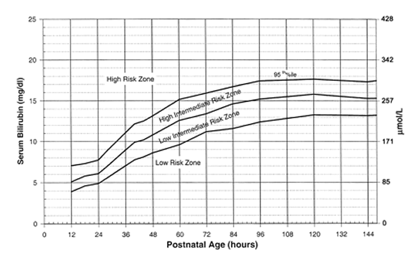
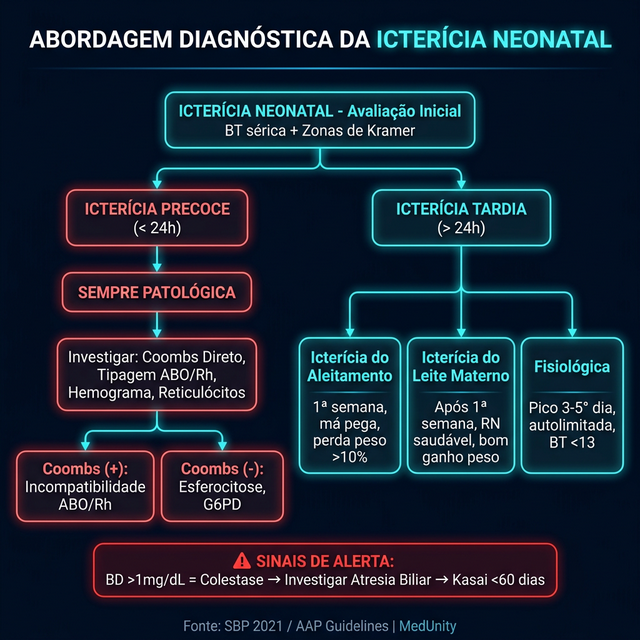
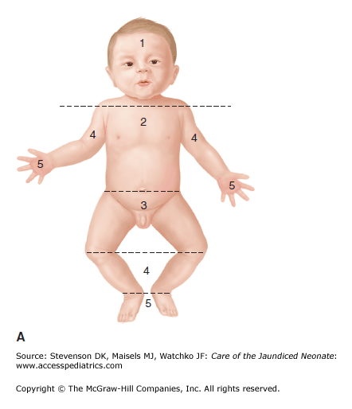
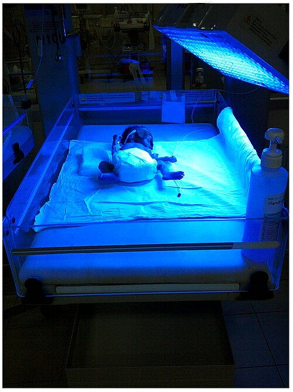
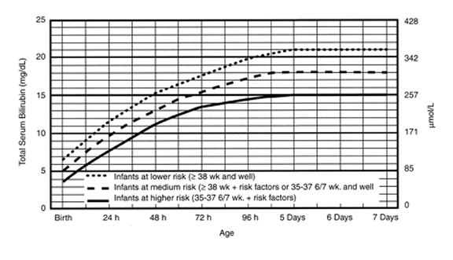

# ICTERÍCIA NEONATAL

Para entender a icterícia neonatal, você não pode simplesmente decorar valores. Você precisa entender o caminho que a bilirrubina percorre. Se você compreender o metabolismo, as questões de prova deixam de ser "decoreba" e passam a ser pura lógica. A icterícia é a manifestação clínica da hiperbilirrubinemia, ocorrendo quando os níveis séricos de bilirrubina total (BT) ultrapassam 5 a 7 mg/dL. É o evento clínico mais comum no período neonatal, afetando cerca de 60% dos recém-nascidos (RN) a termo e 80% dos prematuros.

## O Metabolismo da Bilirrubina: O Porquê da Icterícia

Por que o bebê fica amarelo com tanta facilidade? O RN tem três problemas simultâneos. Primeiro, ele produz muita bilirrubina. O RN tem uma massa eritrocitária maior (hematócrito mais alto) e suas hemácias vivem menos (cerca de 70 a 90 dias, contra 120 dias no adulto). Quando essas hemácias morrem, o heme é transformado em biliverdina e, depois, em bilirrubina indireta (BI).

A BI é lipossolúvel. Isso é um perigo, pois ela consegue atravessar a barreira hematoencefálica. Para ser eliminada, ela precisa chegar ao fígado ligada à albumina. Aqui entra o segundo problema: o fígado do RN é imaturo. Existe uma deficiência na captação e, principalmente, na conjugação pela enzima glucuroniltransferase (UGT1A1). Uma vez conjugada, ela vira bilirrubina direta (BD), que é hidrossolúvel e vai para o intestino.

O terceiro problema é a circulação entero-hepática. No intestino do RN, há poucas bactérias para transformar a BD em estercobilina. Em vez disso, existe uma enzima chamada beta-glucuronidase, que desconjuga a BD, transformando-a novamente em BI, que é reabsorvida para o sangue. Entender isso explica por que o jejum ou a baixa ingesta de leite pioram a icterícia: menos fezes saindo significa mais tempo para a beta-glucuronidase agir e reabsorver a bilirrubina.

## Icterícia Fisiológica vs. Patológica

Este é o divisor de águas nas provas. Você precisa saber diferenciar o que é esperado do que é sinal de alerta.

### Icterícia Fisiológica

A icterícia fisiológica nunca aparece nas primeiras 24 horas de vida. Ela surge após o segundo ou terceiro dia, atinge o pico entre o terceiro e o quinto dia em RN a termo (podendo chegar a 12-13 mg/dL) e desaparece em até duas semanas. No prematuro, o pico é mais tardio e os níveis podem ser mais altos.

Por que ela acontece? Pela somatória dos fatores que discutimos: alta produção, baixa conjugação hepática e aumento da circulação entero-hepática. A conduta aqui é expectante, estimulando a amamentação.

### Icterícia Patológica

Atenção: se a questão diz que o bebê ficou ictérico com 12, 18 ou 20 horas de vida, pare tudo. Icterícia nas primeiras 24 horas é SEMPRE patológica até que se prove o contrário.

Outros sinais de icterícia patológica incluem:

- Níveis de BT subindo mais de 5 mg/dL por dia.

- Níveis de BT que ultrapassam os percentis de risco no nomograma de Bhutani.

3. Icterícia prolongada (mais de 14 dias no termo).
4. Bilirrubina Direta > 1,0 mg/dL (se BT < 5) ou > 20% da BT (se BT > 5).

## Hiperbilirrubinemia Indireta: Causas Hemolíticas

Quando a icterícia é precoce (< 24h), a principal suspeita é hemólise. O corpo está destruindo hemácias mais rápido do que o fígado consegue processar.

### Incompatibilidade ABO

É a causa mais comum de doença hemolítica. Ocorre tipicamente quando a mãe é do grupo O e o RN é A ou B. A mãe O possui anticorpos anti-A e anti-B do tipo IgG, que atravessam a placenta.
Dica de prova: a incompatibilidade ABO pode ocorrer já na primeira gestação (diferente do Rh). O Teste de Coombs Direto no RN pode ser positivo, mas frequentemente é negativo ou fracamente positivo. Se o Coombs for negativo e a suspeita for alta, solicita-se o Teste do Eluato, que é mais sensível para detectar esses anticorpos nas hemácias do bebê.

### Incompatibilidade Rh

É mais grave. Ocorre em mães Rh negativo com RN Rh positivo. Exige sensibilização prévia (gestação anterior, aborto, transfusão). O Coombs Direto costuma ser fortemente positivo. Aqui, a anemia e a reticulocitose são marcantes.

### Outras Causas Hemolíticas

Se o Coombs é negativo, mas há sinais de hemólise (anemia, reticulocitose, esferócitos no sangue periférico), pense em:

- Esferocitose Hereditária: história familiar positiva, esferócitos no esfregaço.

- Deficiência de G6PD: comum em meninos (ligada ao X), desencadeada por estresse oxidativo (infecções, drogas). É uma causa importante de icterícia grave e súbita que pode levar ao Kernicterus.

## Icterícia e Aleitamento Materno: O Grande Nó

As bancas amam confundir os dois tipos de icterícia relacionados ao leite. Vamos separar isso definitivamente.

### Icterícia do Aleitamento Materno (ou por "Baixa Ingesta")

O problema aqui não é o leite, é a falta dele. Ocorre na primeira semana de vida. O bebê não está mamando bem, tem uma pega inadequada, perde muito peso (> 10%), fica desidratado e constipado.
Por que ele fica amarelo? Porque a baixa ingesta aumenta a circulação entero-hepática (o intestino parado reabsorve mais BI).
Conduta: NÃO suspender o peito. O tratamento é melhorar a técnica de amamentação, aumentar a frequência das mamadas e garantir que o bebê esteja recebendo leite.

### Icterícia do Leite Materno

O problema aqui é uma substância no leite (provavelmente a pregnanodiol ou ácidos graxos livres) que inibe a conjugação hepática ou aumenta a circulação entero-hepática. Ocorre mais tarde, após a primeira semana, em um bebê que está ganhando peso maravilhosamente bem e está saudável.
Conduta: É benigna. Também NÃO se suspende o aleitamento. Em casos raros de níveis muito altos, pode-se considerar fototerapia, mas a amamentação continua sendo a prioridade.

| Característica | Icterícia do Aleitamento (Baixa Ingesta) | Icterícia do Leite Materno |
| --- | --- | --- |
| Início | Precoce (1ª semana) | Tardio (após 1ª semana) |
| Estado do RN | Perda de peso, desidratação | Ganho de peso adequado, saudável |
| Causa | Aumento da circulação entero-hepática | Substâncias no leite materno |
| Conduta | Ajustar técnica e frequência | Manter aleitamento, observar |

## Hiperbilirrubinemia Direta: O Alerta da Colestase

Se a bilirrubina que está alta é a Direta (BD), o problema não é mais hemólise ou imaturidade. É obstrução ou lesão hepática. Isso é chamado de colestase neonatal.

O sinal clínico clássico é a tríade: Icterícia prolongada + Acolia fecal (fezes brancas) + Colúria (urina escura).

### Atresia de Vias Biliares (AVBEH)

Esta é a maior emergência cirúrgica da hepatologia pediátrica. Ocorre uma obliteração progressiva dos ductos biliares extra-hepáticos. O diagnóstico precisa ser rápido. O padrão-ouro inicial é a ultrassonografia de abdome (sinal do cordão triangular), mas a confirmação pode exigir biópsia hepática ou colangiografia.
O tratamento é a Cirurgia de Kasai (portoenterostomia). O segredo para a prova: a cirurgia deve ser feita, idealmente, antes dos 60 dias de vida. Se passar disso, o prognóstico é ruim e o bebê provavelmente precisará de transplante hepático.

## Avaliação Clínica e Diagnóstica

Como professor, vejo muitos alunos confiando demais no olho. Cuidado: a avaliação visual da icterícia é falha, especialmente em bebês de pele escura ou sob luz artificial.

### Zonas de Kramer

A icterícia neonatal progride de forma cefalocaudal.

- Zona 1: Cabeça e pescoço (BT ~ 5-6 mg/dL).

- Zona 2: Até o umbigo (BT ~ 9 mg/dL).

- Zona 3: Até os joelhos (BT ~ 12 mg/dL).

- Zona 4: Braços e pernas (BT ~ 15 mg/dL).

- Zona 5: Palmas e plantas (BT > 15 mg/dL).

Dica MedEvo: Se a icterícia atingir a Zona 3 de Kramer ou for notada nas primeiras 24 horas, a dosagem sérica de bilirrubina é obrigatória. Não se baseie apenas na clínica para decidir tratamento em zonas avançadas.

### Exames Complementares

Para todo RN com icterícia patológica, o "kit básico" de investigação inclui:

- Bilirrubina Total e Frações.

- Tipagem sanguínea e Rh (mãe e RN).

- Teste de Coombs Direto.

- Hemograma com contagem de reticulócitos (para ver se há resposta medular à hemólise).

- Esfregaço de sangue periférico (procurar esferócitos).

Se a icterícia for prolongada (> 14 dias), adicione:

- Dosagem de BD (afastar colestase).

- Teste do pezinho (afastar hipotireoidismo congênito, que causa icterícia prolongada por lentidão metabólica).

- Triagem para infecções congênitas (Sífilis, CMV, Toxoplasmose).

## Tratamento: Fototerapia e Exsanguineotransfusão

O objetivo principal do tratamento é evitar a Encefalopatia Bilirrubínica e sua forma crônica, o Kernicterus. A BI livre (não ligada à albumina) atravessa a barreira hematoencefálica e se deposita nos gânglios da base.

### Fototerapia

Como funciona? A luz (idealmente no espectro azul) transforma a BI em lumirrubina através de reações de fotoisomerização. A lumirrubina é hidrossolúvel e pode ser excretada pela bile e urina sem precisar de conjugação hepática.

A indicação depende da BT, da idade gestacional e das horas de vida, utilizando os gráficos da SBP ou da Academia Americana de Pediatria (AAP).

Fatores que aumentam a eficácia:

- Irradiância alta (mínimo de 30 µW/cm²/nm para fototerapia intensiva).

- Maior superfície corporal exposta.

- Menor distância entre a luz e o bebê (cuidado com o calor nas lâmpadas fluorescentes).

Contraindicação da fototerapia: Colestase (BD alta). Se você colocar um bebê com BD alta na fototerapia, ele pode desenvolver a Síndrome do Bebê Bronzeado, uma coloração cinza-escura da pele. Não é fatal, mas indica que a conduta está errada.

### Exsanguineotransfusão (ET)

Reservada para casos graves onde há risco iminente de neurotoxicidade ou quando a fototerapia intensiva falha em reduzir os níveis de BT. Ela remove anticorpos maternos, hemácias sensibilizadas e a própria bilirrubina.
Indicações clássicas:

- Sinais de encefalopatia aguda (letargia, hipotonia, choro agudo).

- BT muito elevada (geralmente > 5 mg/dL acima do nível de fototerapia ou valores absolutos > 20-25 mg/dL em termos).

- Hemólise grave com anemia importante.

## Situações Especiais e Pegadinhas

### O Céfalo-hematoma

Muitas questões trazem um parto difícil com uso de fórceps e surgimento de céfalo-hematoma. O céfalo-hematoma é uma coleção de sangue que fica restrita ao osso craniano (não ultrapassa suturas). Esse sangue será reabsorvido, gerando uma sobrecarga de bilirrubina indireta. É uma causa de icterícia não hemolítica por aumento de oferta.

### Policitemia e Clampeamento Tardio

O clampeamento tardio do cordão umbilical (> 60 segundos) é recomendado pela SBP por aumentar os estoques de ferro. No entanto, ele pode aumentar o risco de policitemia e, consequentemente, de icterícia neonatal. Se o bebê estiver pletórico e ictérico, pense nisso. Se houver sintomas de hiperviscosidade, o tratamento pode ser a exsanguineotransfusão parcial.

### Sífilis Congênita

Se a questão descreve um RN com icterícia precoce, mas acrescenta hepatoesplenomegalia, rinite serossanguinolenta e lesões cutâneas (palmo-plantares), não pense apenas em hemólise sanguínea. Pense em Sífilis Congênita. A icterícia aqui costuma ter um componente misto (BI e BD).

## Prevenção e Seguimento

Segundo a Sociedade Brasileira de Pediatria (2021), todo RN deve ser avaliado para icterícia a cada 8-12 horas enquanto estiver na maternidade. Antes da alta, deve-se realizar a dosagem de bilirrubina (transcutânea ou sérica) e plotar no nomograma de risco.

O retorno após a alta deve ser precoce:

- Alta com < 24h de vida: retorno em 24h.

- Alta entre 24-48h: retorno em 48h.

- Alta entre 48-72h: retorno em 72h.

Isso é crucial para detectar a icterícia que atinge o pico após a alta, prevenindo o Kernicterus. Dr. Will sempre reforça: o exame físico na primeira semana de vida é a ferramenta mais poderosa do pediatra.

| Causa | Mecanismo Principal | Característica de Prova |
| --- | --- | --- |
| Fisiológica | Imaturidade + ↑ Produção | Início > 24h, autolimitada |
| Incompatibilidade ABO | Hemólise imune | Mãe O, RN A ou B, Coombs +/- |
| Incompatibilidade Rh | Hemólise imune grave | Mãe Rh-, RN Rh+, Coombs +++ |
| Deficiência de G6PD | Hemólise enzimática | Menino, crise súbita, Coombs negativo |
| Aleitamento Materno | ↑ Circulação entero-hepática | Perda de peso, má pega, 1ª semana |
| Leite Materno | Inibição da conjugação | RN saudável, ganho de peso, > 7 dias |
| Atresia de Vias Biliares | Obstrução biliar | BD alta, acolia, colúria, Kasai < 60d |

## Complicações: O Espectro da Toxicidade

A encefalopatia bilirrubínica aguda divide-se em três fases:

- Fase 1: Hipotonia, letargia, sucção débil.

- Fase 2: Hipertonia (opistótono), febre, choro agudo.

- Fase 3: Melhora aparente da hipertonia, mas com sequelas permanentes.

O Kernicterus é a forma crônica, caracterizada por paralisia cerebral coreoatetoide, surdez neurossensorial, paralisia do olhar vertical e displasia do esmalte dentário. É uma tragédia evitável. Por isso, as bancas são tão rigorosas com o manejo da icterícia.

## Pontos-Chave para Prova

- Icterícia nas primeiras 24 horas de vida é SEMPRE patológica e exige investigação imediata.

- A principal causa de icterícia patológica precoce é a incompatibilidade sanguínea (ABO e Rh).

- Incompatibilidade ABO: Mãe O e RN A ou B. Pode ocorrer na primeira gestação.

- Incompatibilidade Rh: Mãe Rh negativo e RN Rh positivo. Requer sensibilização prévia.

- Icterícia do aleitamento materno (baixa ingesta) ocorre na 1ª semana por falha na amamentação e aumento da circulação entero-hepática.

- Icterícia do leite materno ocorre após a 1ª semana em bebês saudáveis; nunca suspenda o aleitamento.

- Colestase neonatal: Definida por BD > 1,0 mg/dL ou > 20% da BT. Sempre investigar atresia de vias biliares.

- Acolia fecal e colúria são sinais de alerta para patologia biliar (BD aumentada).

- Cirurgia de Kasai: Deve ser feita idealmente até os 60 dias de vida na atresia de vias biliares.

- Zonas de Kramer: Avaliação clínica da progressão cefalocaudal. Zona 3 ou mais indica necessidade de dosagem de BT.

- Fototerapia: Transforma BI em lumirrubina (hidrossolúvel). Contraindicada se BD estiver muito alta (risco de bebê bronzeado).

- Kernicterus: Deposição de BI nos gânglios da base, causando sequelas neurológicas permanentes.

- Perda de peso > 10% no RN é fator de risco importante para hiperbilirrubinemia grave.

- Hipotireoidismo congênito é uma causa clássica de icterícia prolongada às custas de BI.

- O Teste do Eluato é usado quando há suspeita de incompatibilidade ABO com Coombs Direto negativo.

- O tratamento da icterícia por baixa ingesta é melhorar a amamentação, não dar água ou glicose. 🧠

 Cópia offline para consulta pessoal.
 Fonte original:
 [https://www.medevo.com.br/material-apoio/ler/91e3efc9-6558-4f35-94f1-6695a3276ab0](https://www.medevo.com.br/material-apoio/ler/91e3efc9-6558-4f35-94f1-6695a3276ab0)
