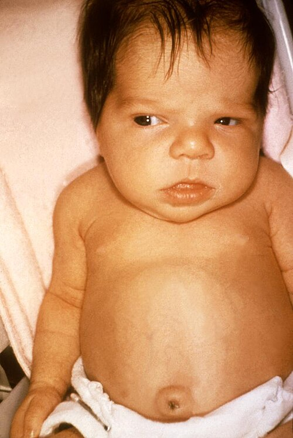
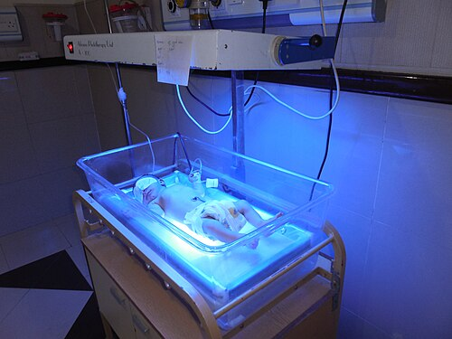

# ICTERÍCIA NEONATAL E KERNICTERUS

Para começar nossa conversa, você precisa entender que a icterícia não é uma doença, mas um sinal clínico. No recém-nascido (RN), ela é o "pão de cada dia" da neonatologia. Cerca de 60% dos bebês a termo e 80% dos prematuros ficarão amarelos na primeira semana de vida. O grande desafio que separa o bom pediatra do "decorador de livros" é saber quando esse amarelo é apenas uma adaptação fisiológica e quando ele é o prenúncio de uma catástrofe neurológica irreversível.

## O Porquê do Amarelo: Fisiopatologia sem Decoreba

Por que o RN tem tanta tendência a ficar ictérico? Não é por acaso. Existem três pilares que explicam isso, e as bancas de residência amam cobrar a lógica por trás deles:

- **Produção Aumentada:** O bebê nasce com uma massa de hemácias muito maior (policitemia fisiológica) e essas hemácias vivem menos (cerca de 70 a 90 dias, contra 120 dias no adulto). Mais hemólise fisiológica = mais heme para ser quebrado em biliverdina e, depois, em bilirrubina indireta (BI).

- **Captação e Conjugação Deficientes:** O fígado do RN é "preguiçoso". A enzima chave, a **Glucuroniltransferase (UGT1A1)**, tem atividade baixíssima nos primeiros dias. Além disso, as proteínas transportadoras (Y e Z) dentro do hepatócito também estão em falta.

- **Circulação Êntero-Hepática Aumentada:** No intestino do bebê, a enzima **beta-glucuronidase** faz o caminho inverso: ela desconjuga a bilirrubina que já estava pronta para sair e a manda de volta para o sangue. Como o bebê tem pouca flora intestinal e trânsito lento no início, essa reabsorção é enorme.

**Dica de Prova:** Se a questão falar em "aumento da circulação êntero-hepática", pense imediatamente em icterícia por jejum ou dificuldade na amamentação. O intestino parado é uma fábrica de reabsorção de bilirrubina.

*Figura 1 - Icterícia neonatal: coloração amarelada da pele por hiperbilirrubinemia. A progressão crânio-caudal (zonas de Kramer) auxilia na estimativa clínica dos níveis de bilirrubina. Fonte: CDC/Dr. Hudson, Domínio Público | Wikimedia Commons*

## Icterícia Fisiológica vs. Patológica: A Regra de Ouro

Aqui é onde muitos alunos erram. Eles tentam decorar valores absurdos, mas o segredo está no **tempo**.

- **Icterícia Fisiológica:** NUNCA aparece nas primeiras 24 horas de vida. Ela surge após o 2º ou 3º dia, atinge o pico entre o 3º e 5º dia e desaparece em até 2 semanas no bebê a termo. O nível de bilirrubina total (BT) geralmente não ultrapassa 13-15 mg/dL.

- **Icterícia Patológica:** Se o bebê ficou amarelo com **menos de 24 horas de vida**, pare tudo. Isso é patológico até que se prove o contrário. Outros sinais de alerta: aumento da BT > 5 mg/dL por dia, icterícia que dura mais de 14 dias ou níveis de Bilirrubina Direta (BD) > 1,0 mg/dL.

Imagine o seguinte cenário: Um RN de 18 horas de vida apresenta icterícia em zona 2 de Kramer. A conduta não é "observar". A conduta é colher Bilirrubinas, Tipagem Sanguínea e Coombs Direto IMEDIATAMENTE. Como diz o Dr. Will, "em neonatologia, o relógio é o seu melhor estetoscópio".

## Hiperbilirrubinemia Indireta: O Império da Hemólise

A grande maioria das icterícias neonatais é por Bilirrubina Indireta (BI). A BI é lipossolúvel, o que significa que ela adora gordura. E qual é o órgão mais gorduroso do nosso corpo? O cérebro. É por isso que a BI alta nos dá tanto medo.

### Incompatibilidade Sanguínea (DHRN)

Este é o tema favorito das provas. Temos dois grandes grupos:

- **Incompatibilidade Rh:** É a mais grave. Ocorre quando a mãe é Rh negativo e o bebê é Rh positivo. A mãe precisa ter sido sensibilizada previamente (gestação anterior, aborto). O Coombs Direto é **fortemente positivo**. O bebê pode nascer com anemia grave e hepatoesplenomegalia.

- **Incompatibilidade ABO:** É a mais comum. Ocorre tipicamente em mães do grupo O com bebês A ou B. A vantagem? Pode ocorrer já na primeira gestação, pois a mãe O já possui anticorpos anti-A e anti-B (IgG) naturalmente. O quadro clínico é muito mais leve que no Rh, e o Coombs Direto pode ser **negativo ou fracamente positivo**.

**Pegadinha de Prova:** Se o Coombs Direto for negativo, mas a suspeita de hemólise ABO for alta (Mãe O / Filho A ou B), o exame que confirma a presença de anticorpos aderidos às hemácias é o **Eluato**. Guarde esse nome.

### Deficiência de G6PD

Muitas vezes negligenciada, a deficiência de G6PD é uma causa importante de icterícia grave e súbita. As hemácias ficam vulneráveis ao estresse oxidativo.

- **Pérola Clínica:** Se a questão mencionar um RN com icterícia tardia e "odor de naftalina" nas roupas ou no quarto, marque Deficiência de G6PD sem medo. A naftalina é um agente oxidante que desencadeia a hemólise nesses bebês.

*Figura 1 - Icterícia neonatal: coloração amarelada da pele por hiperbilirrubinemia. A progressão crânio-caudal (zonas de Kramer) auxilia na estimativa clínica dos níveis de bilirrubina. Fonte: CDC/Dr. Hudson, Domínio Público | Wikimedia Commons*

## Icterícia do Aleitamento vs. Icterícia do Leite Materno

Essa confusão é clássica, mas vamos resolver agora:

| Característica | Icterícia do Aleitamento (Precoce) | Icterícia do Leite Materno (Tardia) |
| --- | --- | --- |
| **Início** | Primeiros dias (2º ao 4º dia) | Mais tarde (após o 7º dia) |
| **Causa** | **Falta** de leite (má técnica, desidratação) | **Substâncias** no leite (pregnanodiol, ácidos graxos) |
| **Mecanismo** | ↑ Circulação êntero-hepática (intestino parado) | Inibição da conjugação hepática (UGT1A1) |
| **Conduta** | Melhorar técnica, amamentar MAIS | Manter amamentação (raramente suspender) |

No MedEvo, sempre reforçamos: na icterícia do aleitamento, o bebê perde peso excessivo (> 7-10%) e tem poucos episódios de diurese/evacuação. É uma icterícia por "fome".

## Colestase Neonatal: O Alerta da Bilirrubina Direta

Se a bilirrubina for **Direta (Conjugada)**, o problema não é mais o cérebro, mas o fígado e as vias biliares. A BD é hidrossolúvel, não atravessa a barreira hematoencefálica, mas indica doença hepatobiliar grave.

**Critério Diagnóstico (SBP 2024):**

- BD > 1,0 mg/dL (se BT < 5,0 mg/dL)

- BD > 20% da BT (se BT > 5,0 mg/dL)

### Atresia de Vias Biliares (AVB)

Esta é a maior urgência da hepatologia pediátrica. É a principal causa de transplante hepático em crianças.

- **Quadro Clínico:** Icterícia que persiste após 14 dias, associada a **acolia fecal** (fezes brancas como massa de vidraceiro) e **colúria** (urina cor de chá mate).

- **Diagnóstico:** O ultrassom de abdome pode mostrar o **Sinal da Corda Triangular** (espessamento fibroso no hilo hepático). Mas atenção: o padrão-ouro inicial para triagem é a cintilografia biliar, e o diagnóstico definitivo é a biópsia hepática ou colangiografia peroperatória.

- **Tratamento:** Cirurgia de Kasai (portoenterostomia). O segredo? Deve ser feita **antes dos 60 dias de vida**. Se passar disso, o sucesso cai drasticamente e o destino é o transplante.

### Galactosemia

Um erro inato do metabolismo que você não pode esquecer. O bebê nasce bem, mas ao começar a mamar (leite tem lactose -> galactose), desenvolve icterícia colestática, hepatomegalia, **catarata** e tem um risco altíssimo de **sepse por E. coli**. A conduta é a retirada imediata do leite com lactose.

## Kernicterus: O Pesadelo Neurológico

O Kernicterus é a coloração amarela dos gânglios da base (especialmente o globo pálido) vista na necropsia. Clinicamente, chamamos de **Encefalopatia Bilirrubínica**.

A toxicidade ocorre porque a BI livre (não ligada à albumina) atravessa a barreira hematoencefálica. Fatores que aumentam esse risco:

- Hipoalbuminemia (menos "ônibus" para carregar a bilirrubina).

- Acidose e Hipóxia (abrem a barreira hematoencefálica).

- Drogas que competem pela albumina (ex: ceftriaxona - por isso evitamos no período neonatal).

### Fases da Encefalopatia Aguda:

- **Fase Inicial:** Letargia, hipotonia, sucção débil. (Muito inespecífico, fácil de comer bola!).

- **Fase Intermediária:** Irritabilidade, hipertonia, febre, choro agudo, opistótono.

- **Fase Avançada:** Apneia, convulsões, coma, morte.

**Sequela Crônica (Kernicterus propriamente dito):** A tríade clássica que cai em prova é: **Paralisia cerebral atetoide**, **Déficit auditivo neurossensorial** (a via auditiva é a mais sensível!) e displasia do esmalte dentário.

*Figura 2 - Fototerapia: tratamento padrão da hiperbilirrubinemia neonatal. A luz azul (comprimento de onda 460-490 nm) converte a bilirrubina indireta em fotoisômeros hidrossolúveis excretáveis sem conjugação hepática. Fonte: Steph masih, CC BY-SA 4.0 | Wikimedia Commons*

## Manejo e Tratamento: Luz e Sangue

O tratamento visa manter a BT abaixo dos níveis de neurotoxicidade.

### Fototerapia

É a primeira escolha. A luz azul (comprimento de onda 425-475 nm) transforma a bilirrubina em isômeros solúveis (lumirrubina) que são excretados pela bile e urina sem precisar de conjugação hepática.

- **Eficácia:** Depende da irradiância (mínimo 8-10 µW/cm²/nm para fototerapia comum; > 30 para intensiva) e da superfície corporal exposta.

- **Cuidados:** Proteção ocular (risco de lesão retiniana) e controle de temperatura.

- **Efeito Colateral:** Síndrome do Bebê Bronzeado (ocorre se você fizer fototerapia em quem tem icterícia direta/colestase).

### Exsanguineotransfusão (EST)

Reservada para casos graves onde a fototerapia falhou ou os níveis já estão em patamares críticos.

- **Objetivo:** Remover anticorpos maternos, remover hemácias sensibilizadas e baixar rapidamente a BT.

- **Complicações:** Distúrbios eletrolíticos (hipocalcemia, hipomagnesemia), arritmias, infecções e enterocolite necrosante.

### Imunoglobulina Humana (IVIG)

Usada em doenças hemolíticas imunes (Rh ou ABO) para bloquear os receptores Fc dos macrófagos esplênicos e reduzir a destruição das hemácias. Pode evitar a necessidade de uma EST.

## Tabelas Comparativas para Revisão Rápida

### Tabela 1: Zonas de Kramer (Estimativa Clínica)

| Zona | Localização Anatômica | Nível Estimado de BI (mg/dL) |
| --- | --- | --- |
| 1 | Cabeça e pescoço | 4 a 8 |
| 2 | Tronco até o umbigo | 5 a 12 |
| 3 | Umbigo até os joelhos | 8 a 16 |
| 4 | Joelhos até tornozelos / Cotovelos até pulsos | 11 a 18 |
| 5 | Palmas das mãos e plantas dos pés | > 15 |

*Nota: A avaliação visual é imprecisa, especialmente em bebês de pele escura. Se houver dúvida ou zona > 3, colha nível sérico ou transcutâneo.*

### Tabela 2: Diagnóstico Diferencial de Icterícia Neonatal

| Início | Principal Suspeita | Exames Iniciais |
| --- | --- | --- |
| < 24 horas | Doença Hemolítica (Rh, ABO, G6PD) | BTF, Tipagem, Coombs, Reticulócitos |
| 2º a 3º dia | Fisiológica ou Aleitamento | Observação clínica e peso |
| > 7 dias | Leite Materno ou Colestase | BTF, Urina, Teste do Pezinho |
| > 14 dias | Atresia de Vias Biliares | BD, USG abdome, Biópsia |

### Tabela 3: Critérios de Intervenção (RN ≥ 35 sem) - Simplificado SBP

| Idade (horas) | Fototerapia (mg/dL) | Exsanguineotransfusão (mg/dL) |
| --- | --- | --- |
| 24h | ≥ 10-12 | ≥ 18-20 |
| 48h | ≥ 13-15 | ≥ 20-22 |
| 72h | ≥ 15-17 | ≥ 22-24 |
| > 96h | ≥ 17-18 | ≥ 24-25 |
| *Valores variam conforme fatores de risco (hemólise, sepse, asfixia).* | | |

## Pontos-Chave para Prova 🧠

- **Icterícia em < 24h:** Sempre patológica. Investigação imediata é obrigatória.

- **Atresia de Vias Biliares:** Tríade de icterícia prolongada + acolia + colúria. Cirurgia de Kasai idealmente antes dos 60 dias.

- **Sinal da Corda Triangular:** Achado ultrassonográfico sugestivo de Atresia de Vias Biliares.

- **Kernicterus e Audição:** O déficit auditivo neurossensorial é a sequela mais comum e sensível da toxicidade pela bilirrubina.

- **Incompatibilidade ABO:** Mãe O, Filho A ou B. Pode ocorrer na 1ª gestação. Coombs direto pode ser negativo (confirmar com Eluato).

- **Incompatibilidade Rh:** Mãe Rh-, Filho Rh+. Mais grave, requer sensibilização prévia. Coombs direto sempre positivo.

- **Deficiência de G6PD:** Suspeitar em icterícia súbita/grave ou com história de exposição a oxidantes (naftalina).

- **Galactosemia:** Icterícia + Catarata + Hepatomegalia + Sepse por E. coli.

- **Fototerapia:** O mecanismo principal é a fotoisomerização estrutural (formação de lumirrubina).

- **Síndrome do Bebê Bronzeado:** Contraindicação relativa à fototerapia em pacientes com hiperbilirrubinemia direta.

- **Banho de Sol:** NÃO é recomendado como tratamento para icterícia neonatal devido ao risco de queimaduras e baixa eficácia.

- **Ceftriaxona no RN:** Evitar, pois compete com a bilirrubina pela ligação com a albumina, aumentando o risco de Kernicterus.

- **Zona 5 de Kramer:** Icterícia em palmas e plantas indica níveis muito elevados (> 15 mg/dL), exigindo conduta urgente.

- **Fator de Risco para Kernicterus:** Albumina < 3,0 g/dL é um marcador crítico de risco para neurotoxicidade.

- **Queda da BT na Fototerapia:** Considera-se boa resposta uma queda de > 0,5 mg/dL por hora nas primeiras 4-8 horas de fototerapia intensiva.

 Cópia offline para consulta pessoal.
 Fonte original:
 [https://www.medevo.com.br/material-apoio/ler/fe293f49-714c-4429-9991-e60eafb4f810](https://www.medevo.com.br/material-apoio/ler/fe293f49-714c-4429-9991-e60eafb4f810)
