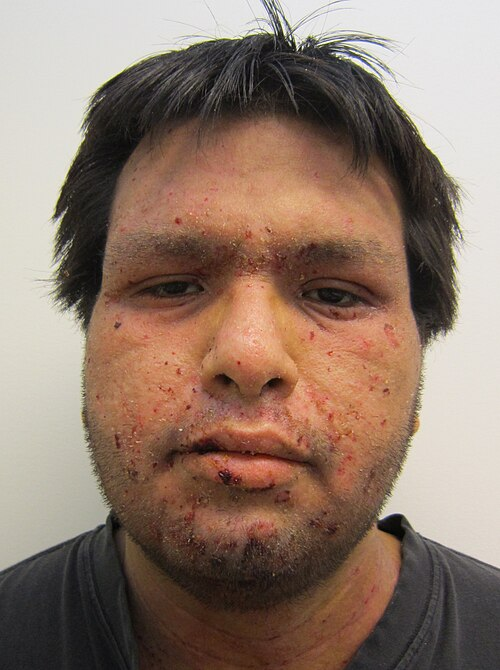
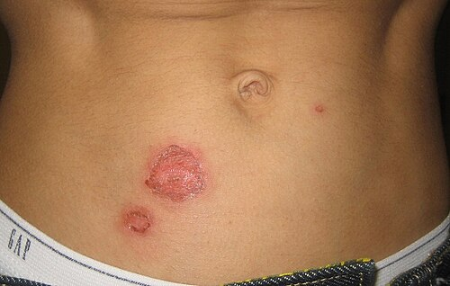

# IMPETIGO

O impetigo é a infecção bacteriana superficial da pele mais comum na infância. Se você vai prestar prova de residência médica ou atuar em uma emergência pediátrica, este é um tema obrigatório. Não apenas pela frequência, mas porque as bancas adoram explorar as diferenças entre as formas clínicas e, principalmente, os diagnósticos diferenciais com outras dermatoses pediátricas.

Para entender o impetigo, você precisa visualizar a pele como uma barreira. Quando essa barreira é quebrada, seja por um trauma mínimo, uma picada de inseto ou uma lesão de varicela, as bactérias que colonizam a nossa pele ou o ambiente aproveitam a oportunidade. É aqui que o jogo começa.

*Figura 1 - Caso grave de impetigo não-bolhoso (crostoso): lesões crostosas melicéricas características, a forma mais comum da infecção bacteriana cutânea na infância. Fonte: James Heilman, MD, CC BY-SA 3.0 | Wikimedia Commons*

## Etiologia e Fisiopatologia: O "Porquê" das Lesões

Historicamente, aprendíamos que o impetigo crostoso era causado pelo *Streptococcus pyogenes* (Estreptococo beta-hemolítico do grupo A) e o bolhoso pelo *Staphylococcus aureus*. No entanto, a epidemiologia mudou. Atualmente, o *Staphylococcus aureus* é o protagonista em ambas as formas, embora o *S. pyogenes* ainda desempenhe um papel fundamental no impetigo crostoso, especialmente em países em desenvolvimento como o Brasil.

### O mecanismo da bolha

Por que no impetigo bolhoso a pele levanta e forma aquela vesícula flácida? A resposta está nas toxinas esfoliativas (ETA e ETB) produzidas por certas linhagens de *Staphylococcus aureus*. Essas toxinas são proteases que clivam especificamente a **desmogleína 1**, uma proteína de adesão celular localizada nos desmossomos da camada granulosa da epiderme.

Quando a desmogleína 1 é "quebrada", as células da epiderme perdem a união (acantólise), e o fluido se acumula, formando a bolha. Como essa clivagem é muito superficial (subcórnea), a parede da bolha é extremamente fina e frágil. É por isso que, na prática, muitas vezes você não vê a bolha íntegra, mas sim o resto dela ou uma erosão úmida.

### A crosta melicérica

No impetigo não bolhoso (ou crostoso), a invasão bacteriana leva a uma resposta inflamatória local com formação de vesículas e pústulas que se rompem rapidamente. O exsudato purulento desse processo desseca, formando a clássica **crosta melicérica** (cor de mel).

Um ponto que o MedEvo sempre reforça: o impetigo pode ser primário (invasão em pele sã) ou secundário (chamado de impetiginização), que ocorre sobre uma lesão pré-existente, como dermatite atópica, escabiose ou picadas de inseto. Se a prova descreve uma criança com "prurigo estrófulo que evoluiu com secreção purulenta", ela está falando de impetiginização.

*Figura 2 - Impetigo bolhoso: bolhas flácidas preenchidas por líquido seroso ou purulento, causadas pela toxina esfoliativa do Staphylococcus aureus que cliva a desmogleína 1. Fonte: Littlekidsdoc, CC BY-SA 4.0 | Wikimedia Commons*

## Classificação Clínica

Dividimos o impetigo em dois grandes grupos. Essa distinção é a base de 80% das questões de prova sobre o tema.

### Impetigo Não Bolhoso (Crostoso ou Contagioso)

É a forma mais comum, representando cerca de 70% dos casos.

- **Localização:** Frequentemente face (ao redor do nariz e boca) e extremidades.

- **Lesão Inicial:** Começa como uma pequena mácula eritematosa que evolui para vesícula ou pústula.

- **Evolução:** Essas lesões rompem-se muito rápido, deixando uma base eritematosa coberta por uma crosta espessa, aderente e amarelada (melicérica).

- **Sintomas:** O prurido é comum, o que favorece a autoinoculação (a criança coça o nariz e leva a bactéria para o braço). A febre e o comprometimento do estado geral são raros aqui.

### Impetigo Bolhoso

Ocorre em cerca de 30% dos casos e é quase exclusivamente causado pelo *S. aureus*.

- **Público-alvo:** Mais comum em recém-nascidos e lactentes.

- **Lesão:** Bolhas flácidas, de conteúdo inicialmente claro que depois se torna turvo (purulento).

- **Evolução:** Diferente da forma crostosa, as bolhas podem persistir por alguns dias antes de romper. Quando rompem, deixam uma "gola" de escamas na periferia (o resto do teto da bolha) e uma base eritematosa úmida e brilhante.

- **Localização:** Áreas de dobras (axilas, pescoço, área das fraldas).

**Tabela 1: Comparativo entre Impetigo Crostoso e Bolhoso**

| Característica | Impetigo Crostoso (Não Bolhoso) | Impetigo Bolhoso |
| --- | --- | --- |
| **Agente Principal** | *S. aureus* e *S. pyogenes* | *S. aureus* (produtor de toxina) |
| **Lesão Patognomônica** | Crosta melicérica | Bolha flácida |
| **Frequência** | 70% dos casos (Mais comum) | 30% dos casos |
| **Localização Comum** | Face e extremidades | Áreas de dobras e fraldas |
| **Mecanismo** | Invasão bacteriana direta | Ação da toxina (clivagem Desmogleína 1) |
| **Linfadenopatia** | Frequente | Rara |

## Diagnóstico e Exame Físico

O diagnóstico do impetigo é eminentemente **clínico**. Você não precisa de biópsia ou cultura para iniciar o tratamento em um caso típico.

No exame físico, procure por:

- **Crostas melicéricas:** A descrição clássica de prova é "lesões perinasais com crostas cor de mel".

- **Bolhas flácidas:** Se encontrar bolhas que se rompem facilmente ao toque, pense na forma bolhosa.

- **Linfadenopatia regional:** Muito comum na forma crostosa, especialmente se houver envolvimento de *Streptococcus*.

### Quando pedir exames?

Você só vai solicitar cultura e antibiograma se:

- O paciente não responder ao tratamento inicial (suspeita de MRSA - *Staphylococcus aureus* resistente à meticilina).

- Houver um surto em ambiente fechado (creches, escolas).

- O paciente apresentar sinais de gravidade ou recorrência frequente.

Cuidado com a pegadinha: a coloração de Gram ou o esfregaço de Wright-Giemsa podem ser citados em questões de diagnóstico diferencial de pústulas neonatais. No impetigo, veríamos cocos Gram-positivos e neutrófilos. Se a questão citar "eosinófilos no esfregaço de Wright-Giemsa em um RN", o diagnóstico é **Eritema Tóxico Neonatal**, e não impetigo.

## Diagnóstico Diferencial: Onde os Alunos Erram

Esta é a parte mais importante para quem quer acertar as questões difíceis. O impetigo mimetiza várias outras doenças.

### 1. Síndrome da Pele Escaldada Estafilocócica (SSSS)

É o "primo rico" e perigoso do impetigo bolhoso. Ambas são causadas pela toxina esfoliativa do *S. aureus*. A diferença é que no impetigo a toxina age **localmente**. Na SSSS, a toxina se dissemina pela corrente sanguínea a partir de um foco (que pode ser uma conjuntivite, uma otite ou o próprio impetigo).

- **Diferença crucial:** Na SSSS, o paciente tem febre alta, irritabilidade e o **Sinal de Nikolsky positivo** (a pele se despreza ao sofrer pressão lateral). No impetigo bolhoso, o Nikolsky é negativo fora da lesão.

### 2. Herpes Simplex

O herpes causa vesículas, mas elas são tipicamente **agrupadas sobre base eritematosa** ("cacho de uvas"). O impetigo bolhoso tem bolhas esparsas e não agrupadas.

### 3. Varicela

A varicela apresenta lesões em diferentes estágios de evolução ao mesmo tempo (mácula, pápula, vesícula e crosta) — o chamado polimorfismo regional — e tem distribuição centrípeta com prurido intenso. O impetigo pode ser uma complicação da varicela (impetiginização).

### 4. Candidíase de Fralda

Diferente do impetigo bolhoso que pode ocorrer na área das fraldas, a candidíase apresenta um eritema muito intenso, brilhante, com **pústulas satélites** além da borda da lesão principal. O tratamento aqui não é antibiótico, mas antifúngico tópico (nistatina ou cetoconazol).

### 5. Molusco Contagioso

Frequentemente confundido em enunciados que descrevem "pápulas". O molusco apresenta pápulas peroladas com **umbilicação central**. Se essas pápulas inflamarem, podem parecer impetigo, mas a umbilicação é a chave.

**Tabela 2: Diagnóstico Diferencial de Lesões Vesicobolhosas e Pustulosas**

| Doença | Característica da Lesão | Dica de Prova |
| --- | --- | --- |
| **Impetigo Crostoso** | Crosta melicérica | Perinasal, após picada de inseto |
| **Impetigo Bolhoso** | Bolhas flácidas, conteúdo purulento | RN ou lactente, áreas de dobras |
| **SSSS** | Eritema difuso, bolhas, descamação | Sinal de Nikolsky (+), febre, irritabilidade |
| **Herpes Simplex** | Vesículas agrupadas em base eritematosa | Recorrente, ardor/dor local |
| **Varicela** | Vesículas em "gota de orvalho", polimorfismo | Prurido intenso, acomete couro cabeludo |
| **Eritema Tóxico** | Pápulas/pústulas com halo eritematoso | RN 2-3 dias, eosinófilos no esfregaço |
| **Candidíase** | Placa eritematosa brilhante | Pústulas satélites, área de fraldas |

## Tratamento: A Conduta Correta

O tratamento do impetigo visa acelerar a cura, melhorar o desconforto e, crucialmente, prevenir a disseminação para outras pessoas e outras partes do corpo do paciente.

### Medidas Não-Farmacológicas (Higiene)

Não adianta prescrever o melhor antibiótico se a higiene for precária.

- Limpeza das lesões com água e sabão neutro.

- Remoção suave das crostas (pode-se usar compressas de soro fisiológico ou água morna para amolecer).

- Manter unhas curtas e limpas.

- Não compartilhar toalhas ou roupas de cama.

- Afastamento da escola/creche até 24-48 horas após início do tratamento eficaz.

### Tratamento Farmacológico Tópico

Indicado para casos **localizados**, com poucas lesões e sem sinais sistêmicos.

- **Mupirocina 2% (pomada ou creme):** Aplicar 3 vezes ao dia, por 5 a 7 dias.

- **Ácido Fusídico:** Alternativa à mupirocina (menos comum em algumas regiões do Brasil, mas eficaz).

- **Retapamulina:** Outra opção tópica para maiores de 9 meses.

Por que preferimos mupirocina? Porque ela tem excelente cobertura para *S. aureus* (incluindo algumas cepas de MRSA) e *S. pyogenes*. Evite neomicina ou bacitracina isoladas, pois as taxas de resistência são maiores e o potencial de sensibilização (alergia) é alto.

### Tratamento Farmacológico Sistêmico (Oral)

Indicado para:

- Impetigo bolhoso (quase sempre requer via oral pela extensão e etiologia).

- Lesões disseminadas ou numerosas.

- Presença de febre ou linfadenopatia importante.

- Casos em que o tratamento tópico é difícil (ex: couro cabeludo).

- Surtos em creches para controle rápido.

**Drogas de Escolha:**

- **Cefalexina:** 50 a 100 mg/kg/dia, divididos em 4 doses (6/6h), por 7 dias. É a primeira escolha na maioria das diretrizes da SBP devido à excelente cobertura para estafilococos e estreptococos.

- **Cefadroxila:** 30 mg/kg/dia, 1 a 2 vezes ao dia. Vantagem da posologia mais fácil.

- **Amoxicilina + Clavulanato:** 40-50 mg/kg/dia (dose da amoxicilina), 12/12h ou 8/8h. Ótima opção se houver suspeita de resistência à cefalexina.

- **Eritromicina ou Claritromicina:** Opções para alérgicos à penicilina/cefalosporinas. Cuidado: a resistência do *S. aureus* à eritromicina é crescente.

**Tabela 3: Resumo do Tratamento Farmacológico**

| Extensão | Conduta | Droga e Dose |
| --- | --- | --- |
| **Localizado (Crostoso)** | Tópico | Mupirocina 2% 3x/dia por 5-7 dias |
| **Disseminado / Bolhoso** | Sistêmico (Oral) | Cefalexina 50-100 mg/kg/dia (6/6h) |
| **Alérgicos a Beta-lactâmicos** | Sistêmico (Oral) | Claritromicina 15 mg/kg/dia (12/12h) |
| **Suspeita de MRSA** | Sistêmico (Oral) | Clindamicina ou Sulfametoxazol-Trimetoprima |

## Complicações e Prognóstico

O impetigo geralmente tem um prognóstico excelente. As lesões cicatrizam sem deixar marcas, a menos que a criança coce excessivamente e cause uma lesão mais profunda (ectima).

### Glomerulonefrite Difusa Aguda (GNPE)

Esta é a complicação "clássica" de prova. A GNPE pode ocorrer após uma infecção estreptocócica de orofaringe OU de pele (impetigo).

- **Atenção:** O tratamento antibiótico do impetigo **NÃO previne** a ocorrência de GNPE. Isso cai muito em prova! O antibiótico serve para interromper a cadeia de transmissão e tratar a lesão atual, mas o complexo antígeno-anticorpo que causa a lesão renal pode se formar de qualquer maneira.

- Já a **Febre Reumática**, embora seja uma complicação do *S. pyogenes*, está relacionada quase exclusivamente à faringoamigdalite, sendo raríssima após infecções cutâneas.

### Ectima

É uma forma mais profunda de impetigo que ultrapassa a epiderme e atinge a derme. Forma úlceras "em saca-bocado" cobertas por crostas aderentes. O tratamento é sempre com antibiótico sistêmico.

### Celulite e Erisipela

Embora o impetigo seja superficial, as bactérias podem aprofundar a infecção, levando a quadros de celulite (infecção da derme profunda e tecido subcutâneo) ou erisipela (derme superficial com linfangite). Se o paciente apresentar eritema que se expande rapidamente, calor local e febre, mude o diagnóstico.

## Situações Especiais e Pegadinhas de Prova

Como professor, vejo alunos perdendo pontos em detalhes que não são exatamente impetigo, mas aparecem nas mesmas questões.

### Dermatite Estreptocócica Perianal

Imagine uma criança com eritema perianal brilhante, bem demarcado, que causa dor ao evacuar e, às vezes, sangue nas fezes. Muitos pensam em alergia alimentar ou fissura. Mas, se o enunciado mencionar *Streptococcus pyogenes*, o diagnóstico é dermatite perianal. O tratamento é o mesmo do impetigo (amoxicilina ou cefalexina oral).

### Larva Migrans (Bicho Geográfico)

A prova descreve uma lesão serpiginosa, pruriginosa, que "anda" alguns milímetros por dia. Se essa lesão começar a soltar pus e formar crostas, ela sofreu **impetiginização**. Você deve tratar a infecção secundária (antibiótico) e a causa base (tiabendazol tópico ou albendazol oral).

### Atividade Esportiva

Uma pérola clínica extraída de questões reais: o impetigo, por ser altamente contagioso, impede a participação em esportes de contato (como judô ou futebol) até que as lesões estejam secas ou após 48h de tratamento. Diferente da **Pitiríase Versicolor** (causada pelo fungo *Malassezia*), que não impede a prática esportiva.

### O Recém-Nascido com Bolhas

Se um RN de poucos dias de vida apresenta bolhas flácidas com conteúdo amarelado, o diagnóstico mais provável é impetigo bolhoso. O Dr. Will sempre lembra: no RN, o sistema imune é imaturo e a barreira cutânea é fina. O tratamento deve ser agressivo (muitas vezes internamento para antibioticoterapia parenteral se houver risco de sepse) para evitar a progressão para SSSS.

## Pontos-Chave para Prova

Aqui está o que você precisa ter na ponta da língua para não errar nenhuma questão:

- **Agentes:** *S. aureus* (principal no bolhoso e crostoso atual) e *S. pyogenes* (importante no crostoso).

- **Impetigo Crostoso:** Lesão clássica é a crosta melicérica. Localização perinasal é a favorita das bancas.

- **Impetigo Bolhoso:** Causado pela toxina estafilocócica que cliva a desmogleína 1. Forma bolhas subcórneas flácidas.

- **Tratamento Localizado:** Mupirocina tópica 2% por 5-7 dias.

- **Tratamento Disseminado/Bolhoso:** Cefalexina oral (50-100 mg/kg/dia).

- **GNPE:** Pode ocorrer após impetigo estreptocócico. O antibiótico **NÃO** previne a GNPE.

- **Febre Reumática:** Raríssima após impetigo (relacionada à faringite).

- **Sinal de Nikolsky:** Negativo no impetigo bolhoso; positivo na Síndrome da Pele Escaldada Estafilocócica (SSSS).

- **Diagnóstico Diferencial Neonatal:** Eritema tóxico neonatal tem eosinófilos; impetigo tem neutrófilos e bactérias.

- **Candidíase de Fralda:** Diferencia-se pelo eritema intenso e pústulas satélites.

- **Molusco Contagioso:** Pápulas peroladas com umbilicação central (causado por Poxvírus).

- **Varicela:** Lesões em vários estágios (polimorfismo regional) e prurido intenso.

- **Higiene:** É pilar do tratamento. Afastamento escolar por 24-48h após início do ATB.

- **Ectima:** É a forma ulcerada, mais profunda, que atinge a derme.

- **Mupirocina:** Primeira escolha tópica. Evite neomicina por risco de alergia e resistência. 💡

Ao revisar o tema, lembre-se sempre de olhar para a imagem da lesão (se houver). A crosta melicérica é o "carimbo" do impetigo crostoso, e a bolha flácida que se rompe deixando uma gola epidérmica é o carimbo do bolhoso. Com esse raciocínio clínico e o conhecimento das doses, você está pronto para qualquer prova de residência.

 Cópia offline para consulta pessoal.
 Fonte original:
 [https://www.medevo.com.br/material-apoio/ler/a690c5b0-e264-4032-90d5-af952db559f2](https://www.medevo.com.br/material-apoio/ler/a690c5b0-e264-4032-90d5-af952db559f2)
