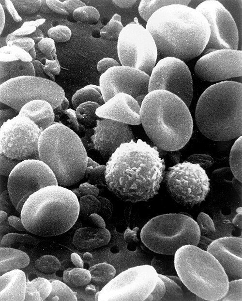

# IMUNODEFICIÊNCIAS PRIMÁRIAS

Atualmente, o termo mais correto e utilizado pelas sociedades científicas, como a Sociedade Brasileira de Pediatria (SBP) e a Associação Brasileira de Alergia e Imunologia (ASBAI), é Erros Inatos da Imunidade (EII). No entanto, como as bancas de residência ainda utilizam muito o termo Imunodeficiências Primárias (IDP), usaremos ambos aqui para que você não se confunda na hora da prova.

O grande desafio desse tema é que ele parece "decoreba" de nomes de doenças raras. Mas o meu papel aqui é mostrar que existe uma lógica por trás de cada defeito. Se você entender qual peça do exército imunológico está faltando, você vai deduzir qual bactéria vai atacar e qual será o quadro clínico.

*Figura 1 - Microscopia eletrônica de células do sangue: linfócitos, monócitos e neutrófilos. Os erros inatos da imunidade (EII) resultam de defeitos genéticos em componentes específicos deste sistema de defesa. Fonte: NCI/Bruce Wetzel e Harry Schaefer, Domínio Público | Wikimedia Commons*

## O que são os Erros Inatos da Imunidade (EII)?

Imagine o sistema imunológico como um exército complexo. Nos Erros Inatos da Imunidade, o indivíduo nasce com um defeito genético em algum setor desse exército. Não é como o HIV (imunodeficiência secundária), onde um agente externo destrói o sistema. Aqui, o erro está no "manual de instruções" (DNA) da criança.

Esses defeitos podem afetar a produção de anticorpos (linfócitos B), a ação direta de combate (linfócitos T), a limpeza de detritos (fagócitos) ou o sistema de alarme e perfuração (complemento).

Um erro comum de alunos é achar que toda criança com infecção de repetição tem imunodeficiência. Cuidado: a maioria das crianças que chega ao consultório com "muitas gripes" é apenas o "lactente sibilante" ou a criança que acabou de entrar na creche. O Dr. Will sempre reforça nas discussões do MedEvo: o que define a IDP não é apenas a quantidade, mas a gravidade, a cronicidade e a estranheza das infecções.

## Quando suspeitar? Os Sinais de Alerta

As bancas amam os "10 Sinais de Alerta". Eles foram adaptados pela SBP para a realidade brasileira. Se a criança apresenta dois ou mais desses sinais, a investigação é obrigatória.

- Duas ou mais pneumonias no último ano.

- Quatro ou mais novas otites no último ano.

- Estomatites de repetição ou monilíase (candidíase oral) por mais de dois meses.

- Abscessos de repetição ou infecções cutâneas graves.

- Um episódio de infecção sistêmica grave (sepse, meningite, osteoartrite).

- Diarreia crônica com perda de peso.

- Asma grave, doença autoimune ou distúrbios hematológicos (como citopenias).

- História familiar de imunodeficiência.

- Reação adversa grave à vacina BCG e/ou infecção por micobactérias atípicas.

- Fenótipo clínico sugestivo de síndrome associada à imunodeficiência (ex: fácies típica, cardiopatia).

Note que "amigdalites isoladas" não são critérios fortes para IDP. A banca vai tentar te induzir ao erro colocando uma criança com 5 amigdalites no ano, mas que cresce bem e responde rápido ao antibiótico. Isso geralmente é hipertrofia de adenoides ou apenas exposição viral, não IDP.

## O Raciocínio Diagnóstico por Compartimentos

Para não se perder, divida o sistema imune em quatro grandes grupos. Cada um tem um "perfil" de prova.

### 1. Defeitos Humorais (Linfócitos B / Anticorpos)

É o grupo mais comum (cerca de 50 a 70% dos casos). O problema é a falta de imunoglobulinas (IgG, IgA, IgM, IgE).

- **Quando suspeitar:** Infecções por bactérias capsuladas (*Streptococcus pneumoniae*, *Haemophilus influenzae*).

- **Localização:** Trato respiratório (otites, sinusites, pneumonias) e trato gastrointestinal (Giardíase).

- **Idade de início:** Geralmente após os 6 meses de vida. Por que? Porque até os 6 meses a criança está protegida pelo IgG materno que passou pela placenta. Quando o "estoque" da mãe acaba e a criança não produz o dela, os sintomas aparecem.

### 2. Defeitos Celulares ou Combinados (Linfócitos T)

Aqui o problema é mais grave. Como o linfócito T é o "maestro" da orquestra, se ele falha, o linfócito B também não funciona direito (por isso "combinada").

- **Quando suspeitar:** Infecções por germes oportunistas (fungos, vírus, *Pneumocystis jirovecii*), reação grave a vacinas vivas (BCG, rotavírus) e falha no crescimento (failure to thrive).

- **Idade de início:** Muito precoce, nos primeiros meses de vida. É uma emergência pediátrica.

### 3. Defeitos de Fagócitos (Neutrófilos/Macrófagos)

O exército tem os soldados, mas eles não conseguem "comer" ou matar o inimigo.

- **Quando suspeitar:** Abscessos "frios" ou de repetição, infecções de pele, cicatrização demorada e queda tardia do cordão umbilical (acima de 30 dias).

- **Patógenos:** *Staphylococcus aureus*, fungos (*Aspergillus*) e bactérias Gram-negativas específicas como *Burkholderia cepacia*.

### 4. Defeitos do Complemento

O sistema complemento é um conjunto de proteínas que ajuda a furar a membrana das bactérias.

- **Quando suspeitar:** Infecções recorrentes por *Neisseria* (meningite meningocócica) ou quadros de autoimunidade (Lúpus-like).

## Imunodeficiências Predominantemente Humorais

Esta é a área que mais cai em provas. Vamos detalhar as principais doenças.

### Agamaglobulinemia Ligada ao X (Síndrome de Bruton)

O defeito está no gene BTK (Bruton Tyrosine Kinase), necessário para o linfócito B maturar. Se ele não matura, não vira plasmócito e não produz anticorpo.

- **Perfil do paciente:** Menino (ligada ao X), com mais de 6 meses, apresentando otites e pneumonias de repetição.

- **Dica de ouro:** No exame físico, há **ausência ou hipoplasia de tecidos linfoides periféricos** (amígdalas e linfonodos pequenos ou invisíveis). Se a questão diz que a criança tem infecção respiratória grave e "não se vê amígdalas", marque Bruton.

- **Laboratório:** Todas as imunoglobulinas (IgG, IgA, IgM) estão muito baixas ou ausentes. Na citometria de fluxo, os linfócitos B (CD19+ ou CD20+) estão ausentes (< 2%).

### Deficiência Seletiva de IgA

É a IDP mais comum de todas. A maioria dos pacientes é assintomática.

- **Clínica:** Quando há sintomas, são infecções respiratórias leves, giardíase de repetição e doenças autoimunes (celíaca).

- **Cuidado de prova:** Esses pacientes podem ter reações anafiláticas ao receberem transfusão de sangue ou derivados, pois podem ter anticorpos anti-IgA.

- **Diagnóstico:** Níveis de IgA < 7 mg/dL com IgG e IgM normais, em maiores de 4 anos.

### Imunodeficiência Comum Variável (IDCV)

Diferente da Bruton, aqui o defeito não é na produção do linfócito B, mas na sua diferenciação em plasmócito.

- **Idade:** O diagnóstico costuma ser mais tardio (segunda ou terceira década de vida), mas pode ocorrer em crianças maiores.

- **Laboratório:** IgG baixo + IgA ou IgM baixos. Diferente da Bruton, aqui **existem linfócitos B** no sangue, eles só não funcionam.

- **Risco:** Alta incidência de neoplasias (linfomas) e doenças autoimunes.

### Tabela Comparativa: Defeitos Humorais

| Doença | Herança | Linfócitos B (CD19/20) | Imunoglobulinas | Particularidade |
| --- | --- | --- | --- | --- |
| **Bruton** | Ligada ao X | Ausentes (< 2%) | Todas muito baixas | Amígdalas ausentes |
| **IDCV** | Variável | Presentes | IgG baixo + IgA/IgM baixo | Risco de linfoma |
| **Defic. IgA** | Variável | Presentes | Apenas IgA < 7 mg/dL | Anafilaxia em transfusão |

## Imunodeficiências Combinadas (Defeitos de Células T)

Aqui falamos da "Imunodeficiência Combinada Grave" (SCID), o famoso "menino da bolha".

### SCID (Severe Combined Immunodeficiency)

É uma emergência médica. Sem tratamento (transplante de medula), a criança morre no primeiro ano de vida.

- **Clínica:** Candidíase oral persistente (monilíase), diarreia crônica, pneumonia por *Pneumocystis jirovecii* e interrupção do ganho de peso.

- **RX de Tórax:** **Ausência de sombra tímica**. O timo é onde o linfócito T matura. Se não tem T, o timo é hipoplásico. Guarde isso: lactente com infecção grave + RX sem timo = SCID ou DiGeorge.

- **Triagem Neonatal:** O "Teste do Pezinho" ampliado em muitos estados brasileiros já inclui o TREC (T-cell Receptor Excision Circles), que detecta a falta de produção de linfócitos T logo ao nascer.

### Síndrome de DiGeorge (Deleção 22q11.2)

Não é apenas um defeito imune, é um erro no desenvolvimento das 3ª e 4ª bolsas faríngeas.

- **Mnemônico CATCH-22:**

- **C**ardiopatia (defeitos de tronco conal, como Tetralogia de Fallot).

- **A**parência facial anormal (orelhas baixas, fenda palatina).

- **T**imo hipoplásico (defeito de célula T).

- **C**alcitonina/Paratireoide (hipocalcemia neonatal causando convulsões).

- **H**ipocalcemia.

## Defeitos de Fagócitos

### Doença Granulomatosa Crônica (DGC)

O defeito é na enzima NADPH oxidase. O fagócito "come" a bactéria, mas não consegue produzir o "estouro respiratório" (peróxido de hidrogênio) para matá-la.

- **Patógenos Catalase-Positivos:** *S. aureus*, *Serratia marcescens*, *Aspergillus* e a famosíssima em provas **Burkholderia cepacia**.

- **Clínica:** Abscessos em pele, fígado e pulmões, além de formação de granulomas que podem obstruir o trato urinário ou digestivo.

- **Diagnóstico:** Teste do Dinitofenil-hidrazina (DHR) por citometria de fluxo (substituiu o antigo teste do NBT).

### Síndrome de Chédiak-Higashi

- **Clínica:** Albinismo parcial (cabelos prateados/acinzentados), infecções piogênicas de repetição e neuropatia periférica.

- **Hematoscopia:** Presença de **grânulos gigantes** nos neutrófilos.

## Outras Síndromes Importantes

### Síndrome de Wiskott-Aldrich

Uma tríade clássica que cai em toda prova:

- **Eczema grave.**

- **Trombocitopenia com plaquetas pequenas (microtrombocitopenia).**

- **Imunodeficiência (infecções recorrentes).**

- **Laboratório:** IgM baixo, IgA e IgE elevados. O sangramento (geralmente diarreia sanguinolenta ou petéquias) costuma ser o primeiro sinal no período neonatal.

### Síndrome de Hiper IgE (Síndrome de Job)

- **Clínica:** Eczema desde o nascimento, abscessos estafilocócicos "frios" (sem os sinais inflamatórios clássicos de calor e rubor), pneumonias com formação de **pneumatoceles** e fácies grosseira.

- **Laboratório:** IgE absurdamente alto (> 2.000 UI/mL) e eosinofilia.

## Vacinação no Paciente Imunodeficiente

Este é um ponto crítico para a saúde pública e para a sua prova. O princípio básico é: **paciente com suspeita ou confirmação de imunodeficiência celular (T) não pode receber vacinas de agentes vivos atenuados.**

### Vacinas de Agentes Vivos (Contraindicadas se IDP grave):

- BCG (pode causar disseminação da micobactéria - "becegeíte").

- Rotavírus (pode causar diarreia grave e persistente).

- VOP (Sabin) - No Brasil, a VIP já substituiu a VOP no esquema básico, mas lembre-se que o imunodeficiente e seus contatos domiciliares devem usar apenas VIP.

- Tríplice Viral (SCR), Varicela e Febre Amarela.

### A Regra do Corticoide:

Muitas questões perguntam quando o uso de corticoide contraindica vacina viva. Segundo o Ministério da Saúde e a SBP:

- Dose de imunossupressão: **Prednisona ≥ 2 mg/kg/dia (ou > 20 mg/dia para quem pesa > 10kg) por mais de 14 dias.**

- Se a criança usou essa dose, deve-se esperar pelo menos **30 dias** após a suspensão para aplicar vacinas vivas.

## Abordagem Diagnóstica e Terapêutica

Se você suspeita de IDP, não peça "exames genéticos" de cara. Siga a escada diagnóstica:

- **Triagem Inicial:** Hemograma completo (veja a contagem absoluta de linfócitos e neutrófilos) e RX de tórax (presença de timo em lactentes).

- **Avaliação Humoral:** Dosagem de IgG, IgA, IgM e IgE. Se baixos, avaliar a resposta a vacinas (anticorpos antipneumocócicos).

- **Avaliação Celular:** Citometria de fluxo (CD3 para T, CD4 para helper, CD8 para citotóxico, CD19/20 para B, CD56 para NK).

- **Avaliação de Fagócitos:** Teste do DHR.

- **Avaliação do Complemento:** CH50 (via clássica) e AP50 (via alternativa).

*Figura 2 - Ativação dos linfócitos T e B: defeitos em qualquer etapa desta cascata de ativação geram fenótipos clínicos distintos de imunodeficiência primária (ex: agamaglobulinemia se o B não matura, SCID se o T falha). Fonte: Immcarle105, CC BY-SA 4.0 | Wikimedia Commons*

## Tratamento

- **Medidas Gerais:** Higiene rigorosa, evitar aglomerações, água fervida ou filtrada (risco de Giardíase e Criptosporidíase).

- **Imunoglobulina Humana Intravenosa (IVIG):** É o tratamento de escolha para quase todos os defeitos humorais (Bruton, IDCV). É feita a cada 3-4 semanas para manter níveis de IgG > 500-800 mg/dL. **Atenção:** IVIG é contraindicada na Deficiência Seletiva de IgA (risco de anafilaxia).

- **Antibioticoterapia Profilática:** Usada em defeitos de fagócitos e alguns defeitos celulares (ex: SMX-TMP para prevenir *Pneumocystis*).

- **Transplante de Medula Óssea (TMO):** É a cura definitiva para SCID, Wiskott-Aldrich e DGC grave.

## Pontos-Chave para Prova

- **Sinal de Alerta Crucial:** História familiar de morte precoce por infecção ou IDP conhecida é o sinal mais forte.

- **Bruton:** Menino + sem amígdalas + IgG/IgA/IgM baixos + Linfócitos B ausentes.

- **IDCV:** Adulto jovem ou criança maior + Linfócitos B presentes, mas que não funcionam.

- **Deficiência de IgA:** Mais comum, risco de anafilaxia em transfusão, associada à doença celíaca.

- **SCID:** Emergência, monilíase persistente, sem sombra tímica no RX, linfopenia grave (< 1.500-2.500 linfócitos, dependendo da idade).

- **DiGeorge:** Cardiopatia + Hipocalcemia (convulsão) + Ausência de timo.

- **Wiskott-Aldrich:** Eczema + Plaquetas pequenas e baixas + Infecção.

- **Doença Granulomatosa Crônica:** *Burkholderia cepacia* e *S. aureus*. Teste do DHR alterado.

- **Chediak-Higashi:** Albinismo parcial e grânulos gigantes nos neutrófilos.

- **Complemento:** Deficiência de C5-C9 predispõe a infecções por *Neisseria*.

- **Vacinas Vivas:** Contraindicadas em defeitos de células T. Se houver suspeita de IDP ao nascimento (ex: irmão com IDP), **não fazer BCG** até que se afaste o diagnóstico.

- **Corticoides:** Imunossupressão é ≥ 2 mg/kg/dia por > 14 dias.

- **HIV:** Sempre deve ser excluído como causa secundária em qualquer criança com suspeita de imunodeficiência.

- **O que NÃO fazer:** Não vacinar com agentes vivos uma criança com monilíase persistente e baixo ganho ponderal sem antes investigar a imunidade. 🛡️

 Cópia offline para consulta pessoal.
 Fonte original:
 [https://www.medevo.com.br/material-apoio/ler/c0e52358-d601-455b-b4a2-e167c23bc0a1](https://www.medevo.com.br/material-apoio/ler/c0e52358-d601-455b-b4a2-e167c23bc0a1)
