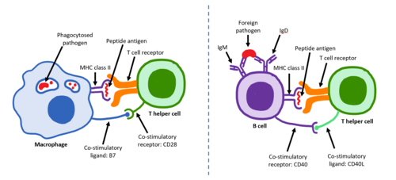

# IMUNOLOGIA NA GESTAÇÃO

Para entender a imunologia na gestação, você precisa primeiro esquecer a ideia de que o sistema imune serve apenas para "atacar o que é estranho". Se fosse assim, nenhuma gravidez passaria da primeira semana. O feto é o que chamamos de aloenxerto semialogênico, ou seja, ele possui 50% de material genético paterno que é completamente estranho ao organismo da mãe.

O grande "pulo do gato" que as bancas de residência cobram é entender como o corpo materno, em vez de rejeitar esse "corpo estranho", cria um ambiente de tolerância ativa. Não é uma imunossupressão generalizada, a mãe não fica indefesa como um paciente transplantado ou com HIV, mas sim uma modulação finamente ajustada.

*Figura 1 - Anatomia da interface materno-fetal na placenta hemocorial humana. O trofoblasto (células citotrofoblásticas e sinciciotrofoblasto) forma a barreira imunológica crucial, expressando HLA-G para tolerância ao aloenxerto fetal. Fonte: OpenStax College, CC BY 3.0 | Wikimedia Commons*

## O Paradoxo Imunológico e a Interface Materno-Fetal

A primeira coisa que você deve ter em mente é onde essa mágica acontece: na placenta. A placenta humana é do tipo hemocorial. Guarde esse termo. "Hemo" vem de sangue e "corial" de córion. Isso significa que o sangue materno entra em contato direto com as vilosidades coriônicas fetais. Não há uma camada de tecido materno separando o sangue da mãe das células do feto (o sinciciotrofoblasto).

Por que isso não gera uma reação imediata? Porque o sinciciotrofoblasto, que é a camada que "banha" no sangue materno, tem um truque molecular: ele não expressa as moléculas clássicas de MHC de classe I (HLA-A e HLA-B) nem de classe II. Sem essas moléculas, as células T citotóxicas da mãe não conseguem reconhecer o feto como um alvo.

Em vez disso, o trofoblasto expressa o HLA-G. Esse é um ponto que o Dr. Will sempre reforça nas discussões de fisiologia: o HLA-G é uma molécula não clássica que, em vez de ativar o sistema imune, envia um sinal de "está tudo bem, não ataquem" para as células Natural Killer (NK) do útero.

## A Gangorra Th1 e Th2: O Coração da Prova

Se você tiver que levar apenas um conceito para a prova sobre imunologia celular, leve este: a mudança do perfil Th1 para Th2.

O sistema imune pode seguir dois caminhos principais. O perfil Th1 é pró-inflamatório, focado em imunidade celular, citocinas como IFN-gama e IL-2. É o perfil de "rejeição". Já o perfil Th2 é anti-inflamatório, focado em imunidade humoral (anticorpos) e tolerância, com citocinas como IL-4, IL-10 e IL-13.

Na gestação normal, ocorre um desvio para o perfil Th2. Isso explica muita coisa que você vê na prática clínica e que cai em prova:

- **Tolerância Fetal:** O ambiente Th2 protege o feto da destruição celular.

- **Melhora de Doenças Autoimunes Th1:** Por que a Artrite Reumatóide costuma melhorar na gravidez? Porque ela é uma doença de perfil Th1. Com o desvio para Th2, a inflamação da articulação diminui.

- **Piora de Doenças Autoimunes Th2:** Por que o Lúpus Eritematoso Sistêmico (LES) pode exacerbar na gestação? Porque o LES tem um componente humoral (Th2) muito forte, que é estimulado nesse período.

Cuidado com a pegadinha: a banca pode dizer que a gestante é "imunossuprimida". Isso está tecnicamente errado. Ela está "imunomodulada". Ela ainda consegue combater infecções, mas sua resposta está voltada para a produção de anticorpos e proteção das mucosas.

## O Papel da Progesterona: Muito Além do Útero

A progesterona é frequentemente chamada de "a hormona da gravidez", e não é à toa. Produzida inicialmente pelo corpo lúteo e, a partir da 8ª a 10ª semana, predominantemente pela placenta, ela tem efeitos imunológicos e sistêmicos cruciais.

Imunologicamente, a progesterona favorece o desvio Th2 e induz a produção de uma proteína chamada PIBF (Fator Indutor de Imunomodulação pela Progesterona), que bloqueia a citotoxicidade das células NK.

Mas o que as bancas amam cobrar são os efeitos sistêmicos decorrentes do relaxamento da musculatura lisa causado pela progesterona. Pense comigo: se a progesterona relaxa o útero para ele não contrair e expulsar o feto, ela vai relaxar tudo o que for músculo liso no corpo da mulher.

### Consequências do Relaxamento da Musculatura Lisa:

- **Sistema Gastrointestinal:** Redução da peristalse (causando constipação) e relaxamento do esfíncter esofágico inferior (causando pirose/azia).

- **Sistema Urinário:** Dilatação pielocalicial e dos ureteres. Isso explica por que a gestante tem maior estase urinária e maior risco de pielonefrite, mesmo com bacteriúria assintomática.

- **Sistema Cardiovascular:** Vasodilatação periférica, o que leva à queda da resistência vascular sistêmica e, consequentemente, queda da pressão arterial no primeiro e segundo trimestres.

- **Sistema Respiratório:** Ocorre broncodilatação. Além disso, a progesterona atua no centro respiratório aumentando a sensibilidade ao CO2, o que gera uma hiperventilação relativa (aumento do volume corrente), levando a uma alcalose respiratória compensada.

## Hormônios Placentários e a Tireoide

Aqui entra um dos temas mais complexos e mais cobrados: a relação entre o hCG e a tireoide materna. No MedEvo, sempre destacamos que a fisiologia endócrina é um prato cheio para questões de "mecanismo".

O hCG (Gonadotrofina Coriônica Humana) é produzido pelo sinciciotrofoblasto. Ele possui duas subunidades: alfa e beta. A subunidade alfa é idêntica à do TSH, do LH e do FSH. Devido a essa semelhança estrutural, o hCG consegue se ligar ao receptor de TSH na tireoide materna e estimulá-lo.

O que acontece no primeiro trimestre, quando o hCG está no seu pico?

- O hCG estimula a tireoide a produzir mais hormônios (T4 livre).

- Esse aumento de T4 livre faz um feedback negativo na hipófise.

- Resultado: O TSH materno cai.

Erro clássico de prova: achar que a gestante está com hipertireoidismo patológico porque o TSH está baixo (ex: 0,1 mUI/L) no primeiro trimestre. Na verdade, isso é fisiológico. É a estimulação cruzada pelo hCG.

### Lactogênio Placentário Humano (hPL)

Também chamado de somatomamotropina coriônica humana (hCS), o hPL é o "hormônio do crescimento" da gestação, mas com um foco metabólico. Ele é produzido pelo sinciciotrofoblasto e sua principal função é garantir que o feto tenha glicose disponível.

Como ele faz isso? Criando resistência à insulina na mãe. O hPL é um hormônio diabetogênico. Ele aumenta a lipólise materna (para a mãe usar gordura como energia) e diminui a captação periférica de glicose. Se o pâncreas da mãe não conseguir compensar essa resistência aumentando a produção de insulina, surge o Diabetes Mellitus Gestacional.

## Transporte Placentário de Imunoglobulinas

Este é, sem dúvida, o tópico campeão de questões sobre imunologia fetal. Você precisa saber exatamente o que passa e como passa pela placenta.

A única imunoglobulina que atravessa a placenta em quantidades significativas é a **IgG**.
A IgA, IgM, IgD e IgE NÃO atravessam a placenta.

Por que a IgG passa e as outras não? Não é apenas pelo tamanho. É um processo ativo e seletivo. O transporte ocorre via endocitose mediada por receptor. O sinciciotrofoblasto possui receptores específicos chamados FcRn (receptor de Fc neonatal). A IgG se liga a esses receptores, é englobada em vesículas (pinocitose/endocitose) e transportada para o lado fetal.

### Cronologia do Transporte de IgG:

- **Início:** Começa por volta da 13ª semana, mas em quantidades muito pequenas.

- **Aumento:** O transporte aumenta linearmente com a idade gestacional.

- **Pico:** A maior transferência ocorre no terceiro trimestre, especialmente após a 34ª semana.

Isso tem uma implicação clínica enorme: o prematuro extremo é imunologicamente vulnerável porque não teve tempo de receber o "estoque" de IgG materna.

### Tabela 1: Comparação de Imunoglobulinas na Gestação e Lactação

| Imunoglobulina | Atravessa a Placenta? | Presente no Leite? | Função Principal no Feto/RN |
| --- | --- | --- | --- |
| **IgG** | Sim (Transporte Ativo/FcRn) | Sim (Baixa conc.) | Imunidade passiva sistêmica; proteção contra patógenos circulantes. |
| **IgA** | Não | Sim (Principal/Secretória) | Proteção de mucosas (TGI e Respiratório); impede adesão bacteriana. |
| **IgM** | Não | Traços | Se presente no RN, indica infecção congênita (produção própria). |
| **IgE** | Não | Não | Relacionada a processos alérgicos; não passa para o feto. |

## Imunidade Passiva vs. Ativa: Classificações de Prova

As bancas adoram misturar esses conceitos. Vamos organizar para você nunca mais errar:

- **Imunidade Ativa Natural:** Ocorre quando a pessoa entra em contato com o patógeno e desenvolve sua própria resposta imune (ex: pegar Rubéola).

- **Imunidade Ativa Artificial:** Ocorre via vacinação. O corpo é estimulado a produzir anticorpos e células de memória.

- **Imunidade Passiva Natural:** É a transferência de anticorpos prontos da mãe para o filho. Isso acontece via placenta (IgG) e via leite materno (IgA).

- **Imunidade Passiva Artificial:** É a administração de imunoglobulinas ou soros (ex: Imunoglobulina Anti-D para mães Rh negativo, soro antiofídico).

Lembre-se: Imunidade passiva não gera memória. Ela é temporária. É por isso que o bebê precisa ser vacinado depois, mesmo que a mãe tenha anticorpos.

## O Leite Materno: A Continuidade da Proteção

Se a placenta entrega IgG para o sangue do feto, o leite materno entrega IgA para as mucosas do recém-nascido.

A principal imunoglobulina do leite humano (especialmente no colostro) é a **IgA secretória**. Ela é resistente às enzimas digestivas do bebê. Sua função não é ser absorvida para o sangue, mas sim "forrar" o trato gastrointestinal, impedindo que vírus e bactérias se liguem à mucosa.

Além da IgA, o leite contém lactoferrina (que sequestra ferro das bactérias), lisozimas e macrófagos. É uma extensão viva do sistema imune materno.

## Situações Clínicas Especiais e Patologias

Agora que entendemos o normal, vamos ver como as bancas cobram o patológico usando esses conceitos.

### Doença de Graves e Tireotoxicose Neonatal

Imagine uma gestante com Doença de Graves. Ela produz anticorpos contra o receptor de TSH, chamados de TRAb. Como o TRAb é uma IgG, ele atravessa a placenta livremente via receptores FcRn.
Ao chegar no feto, o TRAb estimula a tireoide fetal da mesma forma que faz na mãe. O resultado é um recém-nascido que pode nascer com tireotoxicose (hipertireoidismo neonatal). Isso é um exemplo clássico de como a imunidade passiva natural pode, às vezes, carregar uma doença.

### Aloimunização Rh

O conceito aqui é o oposto. A mãe é Rh negativo e o feto é Rh positivo. Na primeira gestação, o contato com o sangue fetal (geralmente no parto) faz a mãe produzir IgM (que não passa na placenta) e depois IgG. Numa segunda gestação, essa IgG anti-D atravessa a placenta e ataca as hemácias do feto.
Por que damos a Imunoglobulina Anti-D (Rhogam) para a mãe? Para fazer uma imunidade passiva artificial que neutralize as hemácias fetais antes que o sistema imune da mãe as reconheça e crie sua própria imunidade ativa (memória).

### Tabela 2: Resumo dos Hormônios Placentários e Efeitos Imunometabólicos

| Hormônio | Origem | Principal Efeito Imunológico/Metabólico | Correlação Clínica |
| --- | --- | --- | --- |
| **hCG** | Sinciciotrofoblasto | Mantém corpo lúteo; estimula receptor de TSH. | TSH baixo no 1º trimestre (fisiológico). |
| **Progesterona** | Corpo lúteo / Placenta | Relaxamento muscular liso; desvio Th2; induz PIBF. | Constipação, refluxo, tolerância fetal. |
| **hPL (hCS)** | Sinciciotrofoblasto | Resistência à insulina; lipólise; oferta de glicose ao feto. | Diabetes Gestacional. |
| **Estriol (E3)** | Unidade Feto-Placentária | Marcador de bem-estar fetal; modulação imune. | Níveis baixos podem indicar sofrimento fetal. |

*Figura 2 - Ativação de linfócitos T helper e B na resposta imune adaptativa. Na gestação, ocorre modulação com desvio Th2 para tolerância ao aloenxerto fetal, sem supressão generalizada da imunidade materna. Fonte: Immcarle105, CC BY-SA 4.0 | Wikimedia Commons*

## Diagnóstico Diferencial e Pegadinhas de Prova

Um erro comum é confundir os mecanismos de transporte. A banca vai dizer que a albumina e as imunoglobulinas passam por difusão facilitada. Mentira. Elas passam por **pinocitose/endocitose**. A glicose passa por difusão facilitada (via transportadores GLUT). O oxigênio e o CO2 passam por difusão simples.

Outra pegadinha: "A gestante tem maior risco de infecções virais devido à supressão do perfil Th1". Isso é verdade em parte. Doenças que dependem muito da imunidade celular (como Influenza, Varicela e Malária) tendem a ser mais graves na gestante. É por isso que a vacinação contra Influenza é prioritária no pré-natal.

### Tabela 3: Tipos de Transporte Placentário

| Mecanismo | Substâncias | Observação de Prova |
| --- | --- | --- |
| **Difusão Simples** | O2, CO2, Água, Eletrólitos, maioria das drogas. | Depende do gradiente de concentração. |
| **Difusão Facilitada** | Glicose. | Usa transportadores, mas não gasta ATP. |
| **Transporte Ativo** | Aminoácidos, Cálcio, Ferro, Vitaminas hidrossolúveis. | Vai contra o gradiente; gasta ATP. |
| **Endocitose / Pinocitose** | IgG, Albumina, Lipoproteínas. | Envolve englobamento pela membrana. |

## Adaptação Imunológica e Vacinação

A vacinação na gestante é uma estratégia para gerar imunidade ativa artificial na mãe, visando a imunidade passiva natural no feto.

Quando vacinamos uma gestante contra a Coqueluche (dTpa), o objetivo principal não é proteger a mãe, mas sim fazer com que ela produza altos níveis de IgG contra a bordetella. Essa IgG atravessa a placenta e protege o bebê nos primeiros meses de vida, antes que ele possa completar seu próprio esquema vacinal.

De acordo com o Calendário Nacional de Vacinação (Ministério da Saúde):

- **dTpa:** Deve ser feita a partir da 20ª semana de gestação em TODA gravidez. Se não foi feita na gestação, deve ser feita no puerpério o mais precocemente possível.

- **Influenza:** Em qualquer idade gestacional durante as campanhas.

- **Hepatite B:** Se a gestante não for vacinada, inicia-se ou completa-se o esquema de 3 doses.

Cuidado: Vacinas de vírus vivo atenuado (como Rubéola, Sarampo, Caxumba e Febre Amarela - esta última com ressalvas) são, em regra, contraindicadas na gestação pelo risco teórico de infecção fetal.

## Pontos-Chave para Prova

- **Desvio Th1 para Th2:** É a base da tolerância imunológica. Th1 (celular/inflamatório) diminui; Th2 (humoral/anti-inflamatório) aumenta.

- **IgG é a única:** Apenas a Imunoglobulina G atravessa a placenta. O transporte é ativo, via receptores FcRn, e ocorre por endocitose/pinocitose.

- **IgA Secretória:** É a principal proteção do leite materno. Atua nas mucosas do RN e não é absorvida sistemicamente.

- **Placenta Hemocorial:** Sangue materno em contato direto com o trofoblasto fetal.

- **hCG e TSH:** O hCG mimetiza o TSH. É normal encontrar TSH baixo e T4 livre normal/limite superior no primeiro trimestre.

- **hPL e Insulina:** O lactogênio placentário causa resistência à insulina para desviar glicose para o feto. É o principal responsável pelo diabetes gestacional.

- **Progesterona e Músculo Liso:** Relaxa tudo. Causa refluxo, constipação, dilatação ureteral (risco de pielonefrite) e queda da PA sistêmica.

- **Tireotoxicose Neonatal:** Pode ocorrer se a mãe tiver Doença de Graves, devido à passagem de anticorpos TRAb (que são IgG).

- **HLA-G:** Molécula expressa pelo trofoblasto que inibe a ação das células NK maternas, protegendo o feto.

- **Pico de transferência de IgG:** Ocorre no terceiro trimestre. Prematuros têm menos anticorpos maternos.

- **Vacina dTpa:** Foco na proteção passiva do recém-nascido contra a coqueluche. Deve ser feita em cada gestação.

- **Imunidade Passiva Natural:** Exemplos clássicos são a passagem de IgG pela placenta e IgA pelo leite.

- **Contraindicação Absoluta:** Vacinas de vírus vivo (Sabin, Tríplice Viral) são contraindicadas na gestação.

- **Estriol (E3):** É o principal estrogênio da gestação, produzido pela unidade feto-placentária.

- **Volume Corrente:** Aumenta na gestação por ação da progesterona, levando a uma leve alcalose respiratória compensada. 🩺

 Cópia offline para consulta pessoal.
 Fonte original:
 [https://www.medevo.com.br/material-apoio/ler/fdcb1bf3-9c58-4c46-aae7-c29eabc12b96](https://www.medevo.com.br/material-apoio/ler/fdcb1bf3-9c58-4c46-aae7-c29eabc12b96)
