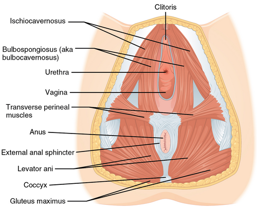
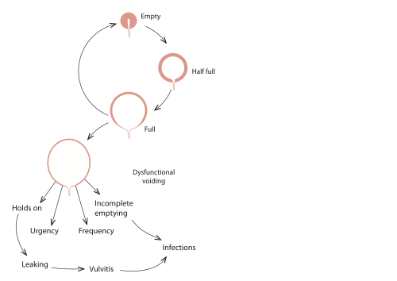

# INCONTINÊNCIA URINÁRIA

A incontinência urinária (IU) é definida pela International Continence Society (ICS) como qualquer perda involuntária de urina. No contexto das provas de residência e da prática clínica, não a encaramos apenas como um sintoma, mas como uma condição que impacta severamente a qualidade de vida, a saúde mental e a economia da paciente.

Para entender a incontinência, você precisa primeiro dominar como a bexiga se comporta. Imagine a bexiga como um reservatório elástico (o músculo detrusor) com uma torneira na saída (o esfíncter e a uretra). Para a mulher estar continente, a pressão dentro da uretra deve ser sempre maior que a pressão dentro da bexiga. Se a pressão vesical ultrapassar a uretral, a urina escapa.

## Fisiologia da Micção e Mecanismos de Continência

A micção é um equilíbrio delicado entre o sistema nervoso simpático e parassimpático. Durante a fase de enchimento vesical, o sistema simpático domina. Ele atua nos receptores Beta-3 adrenérgicos localizados no corpo do detrusor, promovendo o seu relaxamento para que a bexiga aceite volume sem aumentar a pressão interna (fenômeno da complacência). Ao mesmo tempo, o simpático estimula os receptores Alfa-adrenérgicos no colo vesical e uretra proximal, mantendo a "torneira" fechada.

Quando a bexiga atinge sua capacidade e o ambiente é propício, o sistema parassimpático assume através dos nervos esplâncnicos pélvicos. Ele libera acetilcolina, que se liga aos receptores muscarínicos (principalmente M2 e M3) no detrusor, causando sua contração. Simultaneamente, ocorre o relaxamento do esfíncter uretral externo (músculo estriado, sob controle voluntário pelo nervo pudendo).

Um conceito que o MedEvo sempre reforça: a continência feminina depende também do suporte anatômico. A uretra repousa sobre a parede vaginal anterior, que por sua vez é sustentada pela fáscia endopélvica e pelos músculos elevadores do ânus (especialmente o pubococcígeo). É o chamado "mecanismo de rede" ou rede de Hammock. Se esse suporte falha, a uretra se desloca durante o esforço, e a pressão abdominal não consegue comprimi-la contra a fáscia, gerando a perda.

*Figura 1 - Musculatura do assoalho pélvico feminino: a integridade dos músculos elevador do ânus e esfíncter uretral externo é fundamental para a continência. A fraqueza desta musculatura é a base da incontinência urinária de esforço. Fonte: OpenStax College, CC BY 3.0 | Wikimedia Commons*

## Classificação Clínica da Incontinência

As bancas de prova amam testar se você sabe diferenciar os tipos de incontinência apenas pela história clínica.

### Incontinência Urinária de Esforço (IUE)

É a perda involuntária de urina coincidindo com o aumento da pressão intra-abdominal (tosse, espirro, riso, exercício físico). Aqui, o músculo detrusor está quietinho, ele não contrai. O problema é puramente mecânico: ou a uretra se moveu demais (hipermobilidade) ou o esfíncter está fraco (deficiência esfincteriana).

### Incontinência Urinária de Urgência (IUU)

É a perda acompanhada ou precedida imediatamente por uma urgência miccional súbita e difícil de adiar. Está associada à Síndrome da Bexiga Hiperativa, que engloba urgência, polaciúria (aumento da frequência) e noctúria. Na urodinâmica, isso se traduz como contrações involuntárias do detrusor durante a fase de enchimento.

### Incontinência Urinária Mista (IUM)

É quando a paciente apresenta ambos os sintomas. Cuidado: em provas, se a paciente tem os dois, o tratamento inicial geralmente foca no sintoma que mais a incomoda, mas a conduta diagnóstica costuma exigir um estudo urodinâmico para guiar a terapia.

### Incontinência por Transbordamento

Menos comum em mulheres, mas ocorre em casos de grandes prolapsos que obstruem a uretra ou em bexigas neurogênicas acontráteis. A bexiga enche tanto que a urina "transborda" por pressão puramente hidrostática. No exame físico, você pode palpar um globo vesical (tumoração cística dolorosa acima da sínfise púbica).

## Abordagem Diagnóstica: O Passo a Passo

O diagnóstico começa na anamnese. Você deve questionar sobre o impacto na vida social, uso de protetores, frequência de trocas e gatilhos da perda.

### Exame Físico e Testes de Consultório

No exame físico, a paciente deve estar de bexiga cheia.

- Manobra de Valsalva/Tosse: Observar a perda objetiva de urina.

- Avaliação de Prolapsos: Utilizar a classificação POP-Q (veremos adiante).

- Teste do Cotonete (Q-tip test): Um cotonete lubrificado é inserido na uretra. Se, ao esforço, o ângulo do cotonete em relação à horizontal for > 30 graus, diagnosticamos hipermobilidade uretral.

- Avaliação do Assoalho Pélvico: Testar a força da musculatura (escala de Oxford).

### Estudo Urodinâmico

Este é o "padrão-ouro" para diferenciar os tipos de incontinência quando a clínica é duvidosa ou quando há falha de tratamento. O exame consiste em três fases principais:

- Fluxometria: Avalia o jato urinário.

- Cistometria: A fase mais importante. Mede a pressão vesical enquanto a bexiga é enchida. Aqui calculamos a Pressão do Detrusor (Pdet = Pvesical - Pabdominal). Se houver aumento da Pdet sem o comando da paciente, temos hiperatividade do detrusor.

- Estudo Fluxo-Pressão: Avalia a micção propriamente dita.

Para a IUE, o parâmetro crucial é a Pressão de Perda sob Esforço (PPE ou VLPP - Valsalva Leak Point Pressure):

- VLPP > 90 cmH2O: Sugere hipermobilidade uretral (o esfíncter ainda é bom, mas a uretra "cai").

- VLPP < 60 cmH2O: Sugere Deficiência Esfincteriana Intrínseca (DEI). O esfíncter é o problema principal.

- Valores entre 60 e 90: Zona cinzenta.

| Tipo de Incontinência | Achado na Cistometria | Mecanismo |
| --- | --- | --- |
| Esforço (IUE) | Perda de urina SEM contração do detrusor ao aumentar Pabdominal | Hipermobilidade ou Deficiência Esfincteriana |
| Urgência (IUU) | Contrações involuntárias do detrusor (hiperatividade) | Disfunção neuromuscular / Idiopática |
| Mista (IUM) | Perda ao esforço + Contrações involuntárias | Combinação de fatores |

## Tratamento da Incontinência Urinária de Esforço (IUE)

O tratamento sempre deve começar pelo mais simples e menos invasivo, a menos que haja uma indicação cirúrgica clara imediata.

### Manejo Conservador

É a primeira linha para casos leves a moderados.

- Mudanças no Estilo de Vida: Perda de peso (essencial em obesas), cessar tabagismo (reduz a tosse crônica), reduzir cafeína e irritantes vesicais.

- Fisioterapia Pélvica (Exercícios de Kegel): Fortalecimento do músculo pubococcígeo. Deve ser feito por pelo menos 3 meses para avaliação de resposta. Segundo a FEBRASGO, o treinamento dos músculos do assoalho pélvico (TMAP) tem alta evidência de sucesso.

- Pessários Vaginais: Dispositivos de silicone que ajudam no suporte uretral, úteis em pacientes sem condições cirúrgicas.

### Tratamento Cirúrgico

Se o conservador falhar ou se a paciente tiver IUE grave, partimos para a cirurgia.

- Slings de Uretra Média (Padrão-ouro atual):

- TVT (Tension-free Vaginal Tape): Via retropúbica. É a escolha para casos de Deficiência Esfincteriana Intrínseca (VLPP < 60). Tem mais risco de perfuração vesical e lesão vascular/intestinal.

- TOT (Transobturatório): Via forame obturador. Excelente para hipermobilidade uretral. Evita o espaço retropúbico, tendo menor risco de lesão vesical, mas pode causar dor crônica na face interna da coxa.

- Colpossuspensão de Burch: Cirurgia abdominal (aberta ou laparoscópica) que fixa a fáscia parauretral ao ligamento de Cooper. Era o padrão-ouro antes dos slings. Ainda é uma excelente opção se a paciente for realizar outra cirurgia abdominal (como uma histerectomia).

Erro comum de prova: Achar que a via de parto (cesárea) previne 100% a incontinência. Embora o parto vaginal seja um fator de risco, a própria gestação, por alterações hormonais e pressão mecânica, já predispõe à IU.

## Tratamento da Bexiga Hiperativa (IUU)

Aqui o problema é o músculo detrusor que "trabalha demais". O tratamento é predominantemente clínico.

*Figura 2 - Fases de enchimento vesical e o que ocorre quando a micção é incompleta ou retardada. A compreensão da fisiologia miccional é essencial para diagnosticar e tratar a incontinência urinária. Fonte: ColnKurtz, CC BY-SA 4.0 | Wikimedia Commons*

## Medidas Comportamentais

Treinamento vesical (micção com hora marcada), diário miccional e controle de ingestão hídrica.

### Farmacoterapia

- Anticolinérgicos (Antimuscarínicos): São a primeira linha. Bloqueiam os receptores M2/M3 no detrusor.

- Exemplos: Oxibutinina, Tolterodina, Solifenacina.

- Efeitos Colaterais (O que cai na prova!): Boca seca, constipação, visão turva e confusão mental em idosos.

- Contraindicações Absolutas: Glaucoma de ângulo estreito não tratado e miastenia gravis.

- Agonistas Beta-3 Adrenérgicos: Mirabegrona (50mg/dia).

- Mecanismo: Promove o relaxamento do detrusor durante o enchimento.

- Vantagem: Não tem os efeitos colaterais dos anticolinérgicos (não causa boca seca).

- Cuidado: Pode aumentar a pressão arterial. Contraindicado em hipertensão grave não controlada.

### Terapias de Segunda e Terceira Linha

Se os remédios falharem ou os efeitos colaterais forem intoleráveis:

- Toxina Botulínica Intravesical: Aplicada via cistoscopia diretamente no detrusor. Muito eficaz, mas tem risco de retenção urinária pós-operatória, exigindo às vezes autocateterismo intermitente.

- Neuromodulação Sacral: Um "marcapasso" para a bexiga.

## Prolapso de Órgãos Pélvicos (POP)

Muitas vezes a incontinência vem acompanhada de prolapso. O Dr. Will lembra que você deve saber o estadiamento POP-Q, mas para a maioria das provas gerais, o estadiamento simplificado basta:

- Estágio I: Ponto de maior prolapso está > 1 cm acima do hímen.

- Estágio II: Ponto de maior prolapso está entre 1 cm acima e 1 cm abaixo do hímen.

- Estágio III: Ponto de maior prolapso está > 1 cm abaixo do hímen, mas não é procidência total.

- Estágio IV: Eversão completa (procidência).

O tratamento do prolapso só é indicado se houver sintomas. Prolapsos estágio I e II assintomáticos não precisam de cirurgia, apenas observação ou fisioterapia.

## Situações Especiais e Diagnósticos Diferenciais

### Síndrome Geniturinária da Menopausa (SGUM)

O hipoestrogenismo causa atrofia do epitélio vaginal e uretral (que possuem muitos receptores de estrogênio). Isso gera secura, dispareunia e sintomas urinários (urgência e polaciúria).

- Tratamento: Estrogênio tópico vaginal (Promestrieno ou Estriol). É seguro e melhora significativamente a urgência e a troficidade uretral, auxiliando na continência.

### Infecção do Trato Urinário (ITU)

Sempre, eu disse SEMPRE, exclua ITU antes de iniciar qualquer tratamento para bexiga hiperativa ou realizar urodinâmica. Sintomas de urgência e polaciúria de início agudo sugerem infecção. Solicite EAS e Urocultura.

### Fístulas Urinárias

Suspeite se a perda for contínua (dia e noite, sem relação com esforço ou urgência), especialmente após cirurgias ginecológicas (histerectomia) ou radioterapia pélvica. O diagnóstico pode ser auxiliado pelo teste do azul de metileno ou urografia excretora.

### Incontinência em Idosos

Fatores como demência, restrição de mobilidade e uso de diuréticos contribuem. O manejo deve ser cauteloso com anticolinérgicos devido ao risco de delirium e piora cognitiva.

## Tabelas Comparativas para Revisão Rápida

### Tabela 1: Diferenciação Clínica

| Característica | IUE | IUU (Bexiga Hiperativa) |
| --- | --- | --- |
| Gatilho | Tosse, espirro, peso | Urgência súbita |
| Quantidade | Geralmente pequena (gotas/jatos) | Geralmente grande (esvaziamento) |
| Noctúria | Rara | Comum |
| Perda no caminho do banheiro | Não | Sim |
| Tratamento Inicial | Fisioterapia / Perda de peso | Comportamental / Anticolinérgicos |

### Tabela 2: Parâmetros da Urodinâmica na IUE

| Parâmetro (VLPP) | Diagnóstico Provável | Conduta Cirúrgica Preferencial |
| --- | --- | --- |
| > 90 cmH2O | Hipermobilidade Uretral | Sling TOT ou TVT / Burch |
| < 60 cmH2O | Deficiência Esfincteriana (DEI) | Sling TVT (Retropúbico) |
| 60 - 90 cmH2O | Misto / Zona Cinzenta | Individualizar |

### Tabela 3: Farmacoterapia da Bexiga Hiperativa

| Droga | Classe | Principal Efeito Colateral |
| --- | --- | --- |
| Oxibutinina | Anticolinérgico | Boca seca, constipação, confusão |
| Solifenacina | Anticolinérgico (mais seletivo) | Menos efeitos que oxibutinina |
| Mirabegrona | Agonista Beta-3 | Aumento da Pressão Arterial |

## Pontos-Chave para Prova

- A IUE é diagnosticada clinicamente pela perda ao esforço sem contração do detrusor.

- O Teste do Cotonete > 30 graus define hipermobilidade uretral.

- A primeira linha de tratamento para IUE e IUU leve é sempre conservadora (MEV + Fisioterapia).

- Perda de peso é a medida inicial mais eficaz para obesas com IUE.

- VLPP < 60 cmH2O indica Deficiência Esfincteriana Intrínseca; a melhor cirurgia é o Sling Retropúbico (TVT).

- Anticolinérgicos são contraindicados em pacientes com Glaucoma de Ângulo Estreito.

- Mirabegrona é a alternativa para quem não tolera anticolinérgicos, mas vigie a PA.

- Sempre peça urocultura antes de investigar incontinência crônica.

- A Síndrome Geniturinária da Menopausa deve ser tratada com estrogênio tópico.

- Incontinência urinária mista: trate primeiro o sintoma que mais incomoda a paciente.

- Globo vesical pós-operatório com perda em pequenas quantidades indica Incontinência por Transbordamento; conduta é sondagem vesical imediata.

- Fístula vesicovaginal deve ser suspeitada em perdas contínuas após histerectomia.

- O músculo detrusor é inervado pelo parassimpático (contração) e o esfíncter interno pelo simpático (fechamento).

- Duloxetina pode ser usada para IUE (off-label no Brasil para isso, mas cai em prova), enquanto Imipramina não é primeira linha.

- O Sling Transobturatório (TOT) tem menor risco de lesão vesical que o TVT.

- Hematúria macroscópica em idosa tabagista com sintomas urinários exige cistoscopia para excluir neoplasia.

Lembre-se: em uroginecologia, a anatomia e a pressão explicam quase tudo. Se você entender que a continência é uma disputa de pressões, nunca mais errará uma questão de tratamento.

 Cópia offline para consulta pessoal.
 Fonte original:
 [https://www.medevo.com.br/material-apoio/ler/3ab3e78c-8e13-4069-afb9-ee162f25569b](https://www.medevo.com.br/material-apoio/ler/3ab3e78c-8e13-4069-afb9-ee162f25569b)
