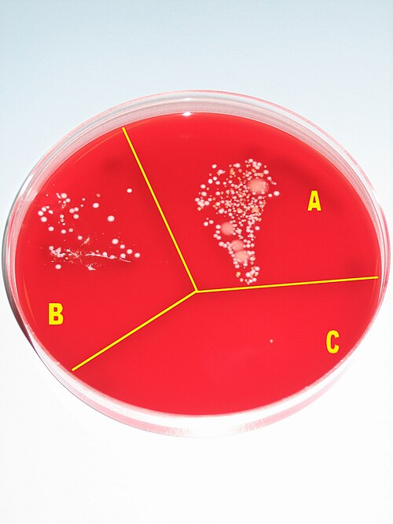

# INFECÇÃO DE SÍTIO CIRÚRGICO

A Infecção de Sítio Cirúrgico (ISC) não é apenas uma "feridinha que inflamou". Para o cirurgião e para as bancas de residência, ela é a complicação pós-operatória mais comum e uma das principais causas de morbimortalidade e custos hospitalares. Se você entender a lógica por trás da prevenção e do diagnóstico, não precisará decorar tabelas infinitas.

*Figura 1 - Diagrama da técnica de desinfecção cirúrgica das mãos conforme DIN EN 1500. A higienização adequada é pilar da prevenção de infecção de sítio cirúrgico. Fonte: Guido4/Hegasy, CC BY-SA 4.0 | Wikimedia Commons*

## Definição e Critérios Diagnósticos

A primeira coisa que você precisa fixar é o tempo. Segundo os critérios da ANVISA e do CDC (Centers for Disease Control and Prevention), uma infecção só é considerada "de sítio cirúrgico" se ocorrer dentro de um período específico:

- **Até 30 dias após a cirurgia:** Para qualquer procedimento.

- **Até 1 ano após a cirurgia:** Se houver colocação de implante ou prótese (como uma tela de hérnia ou uma prótese de quadril).

Cuidado com a pegadinha: a alternativa da prova vai dizer que uma infecção após o 30º dia em uma cirurgia sem prótese ainda é ISC. Não é. É uma infecção de partes moles comum, mas não entra na estatística de ISC. Outro ponto importante: a infecção de episiotomia, por convenção da ANVISA, não é classificada como ISC, mas sim como infecção perineal.

### Classificação da ISC

Nós dividimos a ISC em três níveis, dependendo da profundidade do tecido acometido. Isso muda tudo: do diagnóstico ao tratamento.

- **ISC Superficial:** Envolve apenas pele e tecido subcutâneo.

- **ISC Incisional Profunda:** Envolve tecidos moles profundos, como fáscia e camadas musculares.

- **ISC de Órgão ou Espaço:** Envolve qualquer parte da anatomia aberta ou manipulada durante a cirurgia (ex: um abscesso subfrênico após uma esplenectomia ou uma peritonite após colectomia).

| Tipo de ISC | Tecidos Acometidos | Critérios Diagnósticos Principais |
| --- | --- | --- |
| **Superficial** | Pele e Subcutâneo | Drenagem purulenta; isolamento de organismo em cultura; dor, edema ou calor local. |
| **Profunda** | Fáscia e Músculo | Drenagem purulenta da camada profunda; deiscência espontânea da fáscia; abscesso profundo visto em reoperação ou imagem. |
| **Órgão/Espaço** | Cavidade/Órgão | Drenagem purulenta por dreno na cavidade; abscesso em exame de imagem (TC) ou reoperação. |

## Fatores de Risco: Onde a Banca te Pega

As bancas adoram listar fatores de risco e colocar um "intruso". O segredo aqui é separar o que é do paciente e o que é do procedimento.

**Fatores do Paciente:**

- **Diabetes Mellitus:** O controle glicêmico perioperatório é fundamental. Hiperglicemia prejudica a quimiotaxia de neutrófilos.

- **Obesidade:** O tecido adiposo é hipovascularizado, o que dificulta a chegada de antibióticos e células de defesa. Além disso, cirurgias em obesos costumam ser tecnicamente mais difíceis e demoradas.

- **Tabagismo:** Causa vasoconstrição periférica e hipóxia tecidual. O ideal é cessar 4 semanas antes.

- **Imunossupressão e Corticoterapia:** Retardam a cicatrização e mascaram sinais inflamatórios.

- **Desnutrição e Hipocolesterolemia:** Sim, a hipocolesterolemia e a hipoalbuminemia são marcadores de risco, ao contrário da hipercolesterolemia, que NÃO aumenta o risco de ISC.

**Fatores do Procedimento:**

- **Duração da cirurgia:** Quanto mais tempo aberto, maior a exposição ambiental e o trauma tecidual.

- **Técnica cirúrgica:** Hemostasia precária (gera hematoma, que é meio de cultura) e excesso de eletrocautério (gera tecido necrótico) são vilões.

- **Tricotomia:** Aqui está a maior pérola clínica. **Nunca use lâmina de barbear.** A lâmina cria microabrasões que colonizam em poucas horas. Se for necessário remover pelos, use tricotomizadores elétricos imediatamente antes da cirurgia. A tricotomia feita na véspera com lâmina aumenta drasticamente o risco de ISC.

## Classificação das Cirurgias por Potencial de Contaminação

Este é o conceito mais cobrado em provas de cirurgia. Ele define quem precisa de antibioticoprofilaxia.

- **Limpa:** Cirurgia em tecidos estéreis, sem penetração nos tratos respiratório, digestório ou geniturinário. Sem falha técnica. Ex: Herniorrafia inguinal, tireoidectomia.

- **Limpa-Contaminada:** Penetração controlada em tratos colonizados (digestório, respiratório, urinário) sob condições controladas. Ex: Colecistectomia eletiva, apendicectomia por apendicite inicial (edematosa).

- **Contaminada:** Feridas acidentais recentes, falhas grosseiras na técnica estéril, ou penetração nos tratos com conteúdo extravasado (bile infectada, fezes). Ex: ferida por arma branca recente.

- **Infectada:** Tecidos com infecção prévia, supuração, necrose ou perfuração de vísceras ocas de longa data. Ex: Peritonite fecal, abscesso drenado.

## Antibioticoprofilaxia: A Arte do "Timing"

O objetivo da profilaxia não é esterilizar o paciente, mas garantir que, no momento da incisão (o "minuto zero"), o tecido tenha uma concentração de antibiótico acima da Concentração Inibitória Mínima (CIM) para os patógenos prováveis.

**Regras de Ouro da Profilaxia:**

- **Timing:** Deve ser administrada **60 minutos antes da incisão**. Se for Vancomicina ou Fluoroquinolona (que exigem infusão lenta), comece 120 minutos antes.

- **Escolha do fármaco:** Deve cobrir a flora provável do sítio. Na maioria das cirurgias limpas e limpa-contaminadas, a **Cefazolina** (cefalosporina de 1ª geração) é a rainha, pois cobre muito bem o *Staphylococcus aureus*.

- **Duração:** Dose única é o padrão ouro. Se a cirurgia for longa, podemos fazer o repique (geralmente após 2 meias-vidas da droga ou se houver perda sanguínea > 1500ml). A profilaxia **não deve exceder 24 horas** no pós-operatório. Manter antibiótico por 48h ou 72h "por segurança" é um erro clássico que apenas seleciona flora resistente e causa diarreia por *Clostridioides difficile*.

- **Foco:** A profilaxia visa o sítio cirúrgico, não prevenir pneumonia ou ITU distante.

| Tipo de Cirurgia | Indicação de Profilaxia | Exemplo de Esquema |
| --- | --- | --- |
| **Limpa** | Apenas se usar prótese/implante ou cirurgia cardíaca/neuro | Cefazolina |
| **Limpa-Contaminada** | Sempre indicada | Cefazolina (ou Cefoxitina se precisar de anaeróbios) |
| **Contaminada** | Sempre indicada (já beira a terapia) | Cefazolina + Metronidazol ou Ceftriaxone |
| **Infectada** | Não é profilaxia, é TRATAMENTO | Antibioticoterapia terapêutica |

## Microbiologia: Quem são os Vilões?

O patógeno mais comum em ISC, de forma global, é o **Staphylococcus aureus**. Ele está na nossa pele esperando a oportunidade da incisão.

Em cirurgias específicas, a flora muda:

- **Cirurgias Ortopédicas com Prótese:** *Staphylococcus epidermidis* ganha importância devido à sua capacidade de formar **biofilme** na superfície do implante.

- **Cirurgias Abdominais:** Entram em cena os Gram-negativos entéricos (*E. coli*, *Klebsiella*) e os anaeróbios (*Bacteroides fragilis*).

- **Abscesso Esplênico:** A via de contaminação mais comum é a **hematogênica**.

- **EVP (Endocardite Valvular Protética) Hospitalar:** O *S. aureus* é o principal agente nas infecções precoces.

*Figura 2 - Placa de ágar sangue demonstrando o crescimento microbiano: sem procedimento (A), após lavagem das mãos (B), e após desinfecção com álcool (C). A antissepsia cirúrgica adequada é a principal medida para prevenir ISC. Fonte: Pöllö, CC BY-SA 3.0 | Wikimedia Commons*

## Quadro Clínico e Diagnóstico Diferencial da Febre

Aqui é onde o aluno MedEvo brilha. Nem toda febre no pós-operatório é infecção de ferida. Existe uma cronologia clássica que você deve seguir:

- **Febre nas primeiras 24-48h:** A causa mais comum é a **atelectasia pulmonar**. O tratamento não é antibiótico, é fisioterapia respiratória e deambulação precoce. Outra causa precoce (e grave) é a infecção por *Streptococcus pyogenes* ou *Clostridium* (fasciite necrosante), que se manifesta com dor desproporcional e sinais sistêmicos rápidos.

- **Febre entre o 3º e 5º dia:** Pense em Infecção do Trato Urinário (ITU) ou pneumonia, especialmente se o paciente estiver sondado ou ventilado.

- **Febre após o 5º dia:** Aqui a ISC superficial e profunda ganha força. Se o paciente fez uma cirurgia abdominal e tem febre, dor e íleo prolongado após o 5º dia, suspeite de **deiscência de anastomose** ou abscesso intracavitário.

### Sinais de Alerta na Ferida Operatória

Se você encontrar uma secreção **sero-hemática** (parece "água de carne") em grande quantidade na ferida, especialmente após uma cirurgia abdominal, cuidado! Isso é um sinal patognomônico de **deiscência de aponeurose**. Se o paciente tossir, ele pode eviscerar. A conduta é explorar a ferida e, se confirmada a deiscência, levar ao centro cirúrgico.

Se a ferida estiver **escurecida, com dor intensa e drenagem tipo "água de lavagem"**, suspeite de **Fasciite Necrosante**. Isso é uma emergência cirúrgica que exige desbridamento urgente e agressivo.

## Manejo da ISC: Quando usar Antibiótico?

Este é o erro mais comum em provas e na prática clínica. **ISC superficial se trata com abertura de pontos e drenagem.**

Imagine o cenário: Paciente no 7º DPO de apendicectomia apresenta febre, dor local e a ferida está hiperemiada e flutuante.

- **Conduta correta:** Retirar alguns pontos, explorar a cavidade com pinça de Kelly, drenar o pus, lavar com soro fisiológico e deixar cicatrizar por segunda intenção (curativos diários).

- **Precisa de Antibiótico?** Geralmente NÃO. Só prescrevemos antibiótico na ISC superficial se houver **celulite extensa (> 5 cm)** ao redor da ferida ou **sinais de resposta sistêmica** (taquicardia, febre alta persistente, leucocitose importante).

Se houver um abscesso, a regra de ouro é: **Incisão e drenagem + exploração da cavidade + lavagem com SF**. Antes de drenar, se possível, colha material para cultura, especialmente se for uma infecção hospitalar ou em paciente com uso prévio de ATB.

### Abscessos Intracavitários

Se o abscesso for profundo (órgão/espaço), como um abscesso subfrênico (que pode causar soluços e paralisia do hemidiafragma), o tratamento de escolha hoje é a **drenagem percutânea guiada por imagem** (USG ou TC), associada a antibióticos de amplo espectro. A reoperação fica reservada para casos de falha ou abscessos múltiplos/complexos.

## Situações Especiais e Complicações

### Infecção de Cateter Venoso Central (ICSC)

Um tema que transborda da clínica para a cirurgia. Quando remover o cateter?

- Remova se houver instabilidade hemodinâmica, sepse grave, endocardite ou se a hemocultura diferencial for positiva (crescimento no cateter > 2 horas antes da periférica).

- Patógenos como *S. aureus*, *Candida* e *Pseudomonas* geralmente exigem a retirada do dispositivo.

### Biofilmes e Próteses

O biofilme é uma comunidade estruturada de bactérias envoltas em uma matriz polimérica. Ele protege a bactéria do sistema imune e dos antibióticos. Por isso, infecções de próteses ortopédicas ou vasculares subagudas (causadas muitas vezes pelo *S. epidermidis*) são tão difíceis de tratar e frequentemente exigem a retirada do material.

### O Papel do Dreno

Muitos alunos acham que o dreno previne infecção. Errado. O dreno é um corpo estranho e pode servir de porta de entrada (via retrógrada). O dreno deve ser usado para escoar coleções já existentes ou monitorar fístulas, e deve ser retirado o mais precocemente possível. O uso de drenos não substitui uma boa técnica cirúrgica.

## Pontos-Chave para Prova

- **Tempo de ISC:** 30 dias (geral) ou 1 ano (prótese).

- **Tricotomia:** Se necessária, usar tricotomizador elétrico no momento da cirurgia. Lâmina de barbear aumenta o risco de infecção.

- **Antibioticoprofilaxia:** Cefazolina é a droga de escolha na maioria das vezes. Deve ser feita 60 min antes da incisão e durar no máximo 24h.

- **Fator de Risco:** Obesidade, DM, tabagismo e desnutrição são importantes. Sexo feminino e hipercolesterolemia NÃO são fatores de risco independentes.

- **Febre no 1º DPO:** Geralmente atelectasia. Conduta: RX de tórax e fisioterapia.

- **Secreção sero-hemática em FO:** Sinal de deiscência de aponeurose. Explore a ferida!

- **Tratamento de ISC Superficial:** Drenagem (abrir pontos) é o principal. Antibiótico só se houver celulite > 5cm ou sepse.

- **Agente mais comum:** *Staphylococcus aureus*.

- **Abscesso Subfrênico:** Suspeite se houver febre, soluços e alteração na radiografia de tórax (elevação de cúpula diafragmática) após cirurgia abdominal alta.

- **Fasciite Necrosante:** Dor desproporcional, bolhas, crepitação e secreção em "água de lavagem". Conduta: Desbridamento cirúrgico urgente.

- **Cirurgia Limpa-Contaminada:** É aquela que entra em trato oco de forma controlada (ex: Colecistectomia eletiva). Sempre leva profilaxia.

- **Drenagem de Abscesso:** A conduta padrão é incisão, drenagem, exploração manual/instrumental para romper septos e lavagem abundante.

- **Biofilme:** Principal mecanismo de persistência de infecção em próteses, com destaque para o *Staphylococcus epidermidis*.

- **Controle Glicêmico:** Manter glicemia perioperatória < 180 mg/dL é uma recomendação forte para reduzir ISC. 🛡️

 Cópia offline para consulta pessoal.
 Fonte original:
 [https://www.medevo.com.br/material-apoio/ler/49eba988-fab4-4887-9a52-6d18d989966f](https://www.medevo.com.br/material-apoio/ler/49eba988-fab4-4887-9a52-6d18d989966f)
