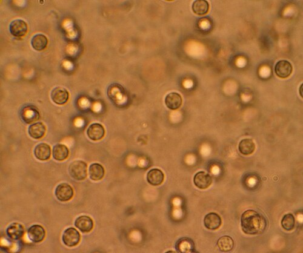

# INFECÇÃO DO TRATO URINÁRIO

A Infecção do Trato Urinário (ITU) é, sem dúvida, um dos temas mais onipresentes na prática médica e, consequentemente, nas provas de residência. Mas não se engane pela frequência: a simplicidade aparente esconde armadilhas que derrubam até o candidato mais preparado. Como professor, vejo muitos alunos decorando tabelas de antibióticos sem entender a lógica por trás da escolha. Aqui, vamos dissecar o "porquê" de cada conduta.

*Figura 1 - Representação da infecção do trato urinário com bactérias colonizando a mucosa vesical. Fonte: BruceBlaus, CC BY-SA 4.0 | Wikimedia Commons*

## Classificação e Definições: O Primeiro Passo para Não Errar

Antes de falarmos em tratamento, precisamos classificar. Se você errar a classificação, errará a conduta. A divisão clássica separa as ITUs em **Não Complicadas** e **Complicadas**.

### ITU Não Complicada

É a infecção que ocorre em mulheres jovens, hígidas, não gestantes, com trato urinário anatômica e funcionalmente normal. Aqui, o patógeno é previsível (Escherichia coli em >80% dos casos) e a resposta ao tratamento costuma ser excelente.

### ITU Complicada

Cuidado aqui! A definição de "complicada" não se refere à gravidade dos sintomas, mas sim ao **hospedeiro** ou à **anatomia**. Consideramos complicada a ITU em:

- Homens (sempre, pois a uretra longa e a próstata protegem contra infecções ascendentes; se ocorreu, algo está errado).

- Gestantes.

- Idosos.

- Diabéticos (especialmente se descompensados).

- Imunossuprimidos.

- Pacientes com anormalidades anatômicas (cálculos, estenoses, refluxo vesicoureteral).

- Uso de cateter de demora (SVD).

**Dica de Prova:** Se a questão trouxer um homem com disúria, a resposta nunca será "cistite simples". Você deve pensar em prostatite ou ITU complicada e, obrigatoriamente, solicitar urocultura.

## Etiologia e Fisiopatologia: Por que a E. coli reina?

A via de infecção mais comum é a **ascendente**. As bactérias da flora fecal colonizam o introito vaginal e a uretra, subindo até a bexiga.

A *Escherichia coli* é a grande protagonista (75-95% dos casos comunitários). Ela possui fimbrias (tipo 1 e P) que funcionam como "ganchos", permitindo a adesão ao urotélio mesmo contra o fluxo urinário.

Outros agentes importantes:

- *Staphylococcus saprophyticus*: Comum em mulheres jovens sexualmente ativas.

- *Proteus mirabilis*: Atenção total aqui! Ele produz a enzima **urease**, que alcaliniza a urina. Isso favorece a precipitação de cristais e a formação de **cálculos de estruvita** (coraliformes). Se a prova citar "urina com pH alto" e "cálculo coraliforme", marque *Proteus*.

- *Klebsiella pneumoniae* e *Enterococcus faecalis*: Mais comuns em ITUs hospitalares ou complicadas.

*Figura 2 - Microscopia urinária demonstrando piúria (leucócitos na urina), achado característico da ITU. Fonte: Bobjgalindo, CC BY-SA 4.0 | Wikimedia Commons*

## Diagnóstico: Quando o Exame é Desnecessário?

Este é um ponto onde as bancas adoram testar sua segurança clínica.

### Cistite Aguda Não Complicada

Em uma mulher jovem com disúria, polaciúria e urgência, sem corrimento vaginal (que sugeriria vulvovaginite), a probabilidade de ITU é superior a 90%.
**Conduta:** Tratamento empírico imediato. **Não** se pede EAS (Urina tipo I) nem urocultura. Pedir exames aqui é desperdício de recurso e atraso de conduta.

### O Papel do EAS (Urina Tipo I)

Quando solicitado, buscamos dois marcadores principais:

- **Esterase Leucocitária:** Indica piúria (presença de leucócitos). É sensível, mas pouco específica (qualquer inflamação na via urinária pode positivar).

- **Nitrito:** As enterobactérias (como E. coli) convertem nitrato em nitrito. É muito específico: se deu positivo, há bactéria. Mas se deu negativo, não exclui (bactérias Gram-positivas e *Pseudomonas* não produzem nitrito).

**Cuidado:** Cilindros leucocitários indicam origem renal da inflamação. Se aparecerem no EAS, pense em Pielonefrite ou Nefrite Intersticial Aguda (NIA).

### Urocultura: O Padrão-Ouro

A urocultura é mandatória em: suspeita de pielonefrite, gestantes, homens, crianças, idosos sintomáticos e falha terapêutica.

| Método de Coleta | Valor de Referência (UFC/mL) |
| --- | --- |
| Jato Médio (Mulher sintomática) | ≥ 10³ |
| Jato Médio (Homem ou Complicada) | ≥ 10⁴ |
| Cateterismo Vesical (SVD de alívio) | ≥ 10² |
| Punção Suprapúbica | Qualquer crescimento |

**Pérola MedEvo:** Em lactentes, a SBP define ITU com urocultura por cateterismo > 50.000 UFC/mL ou punção suprapúbica > 1.000 UFC/mL. A punção suprapúbica é o padrão-ouro para evitar contaminação.

## Bacteriúria Assintomática (BA): A Regra de Ouro

Este é o conceito mais cobrado em provas de Nefrologia e Clínica Médica.
**Definição:** Presença de ≥ 10⁵ UFC/mL em duas amostras (mulheres) ou uma amostra (homens) em paciente **sem nenhum sintoma**.

**A regra é clara: NÃO TRATAR.** Tratar BA em idosos ou diabéticos apenas gera resistência bacteriana e não previne complicações.

**As Exceções (Quem TRATAR obrigatoriamente):**

- **Gestantes:** Sempre tratar, mesmo assintomática. O risco de evoluir para pielonefrite é alto (até 40%) e está associado a parto prematuro e baixo peso ao nascer.

- **Pré-operatório de procedimentos urológicos invasivos:** Onde haja risco de sangramento mucoso (ex: RTU de próstata).

- **Transplante renal recente:** Algumas diretrizes sugerem tratar nos primeiros 3 meses pós-transplante (zona cinzenta, mas frequente em provas).

## Tratamento Farmacológico: Escolhendo a Arma Certa

### Cistite Não Complicada

Segundo a SBU e FEBRASGO, as opções de primeira linha são:

- **Nitrofurantoína:** 100mg de 6/6h (ou formulação macrocristais 100mg 12/12h) por 5 dias.

- *Por que 5 dias?* Estudos mostram que 3 dias têm taxa de falha maior para Nitrofurantoína.

- *Limitação:* Não usar se ClCr < 30 mL/min (não atinge concentração urinária eficaz).

- **Fosfomicina Trometamol:** 3g, dose única. Excelente adesão.

**Por que evitar Quinolonas (Cipro/Levo) na cistite simples?**
Devido ao "dano colateral": alta indução de resistência bacteriana e riscos de efeitos adversos (tendinopatias, aneurisma de aorta, alteração de QT). Reserve para casos onde não há alternativa.

### Pielonefrite (ITU Superior)

Aqui o paciente tem febre, dor lombar e **Sinal de Giordano positivo**.

**Tratamento Ambulatorial (Casos leves, sem vômitos):**

- Ciprofloxacina 500mg 12/12h por 7 dias.

- Levofloxacina 750mg 1x/dia por 5 dias.

**Tratamento Hospitalar (Critérios de Internação):**
Sinais de sepse, instabilidade hemodinâmica, incapacidade de ingestão oral (vômitos), gestantes, obstrução urinária ou dúvida diagnóstica.

- **Ceftriaxone 1g a 2g IV/dia** é a escolha clássica inicial.

- Se risco para *Pseudomonas* (uso prévio de ATB, manipulação de via urinária): Piperacilina-Tazobactam ou Carbapenêmicos.

## ITU na Gestação: Protegendo Mãe e Bebê

A fisiologia da gestação (dilatação ureteral pela progesterona e compressão mecânica pelo útero) favorece a estase urinária.

**Drogas Seguras:**

- Nitrofurantoína (evitar no termo - risco de anemia hemolítica fetal por deficiência de G6PD).

- Fosfomicina.

- Cefalexina ou Amoxicilina/Clavulanato.

**Contraindicação Absoluta:** Quinolonas (risco de lesão em cartilagem fetal) e Tetraciclinas.
**Evitar:** Sulfas no primeiro trimestre (teratogênese) e no terceiro trimestre (risco de kernicterus).

## ITU Recorrente: O Desafio da Prevenção

Definição: ≥ 2 episódios em 6 meses OU ≥ 3 episódios em 1 ano.

O manejo começa com **Medidas Não Farmacológicas**:

- Aumento da ingestão hídrica (pelo menos 1,5L a 2L de água/dia).

- Micção pós-coital.

- Higiene adequada (limpar de frente para trás).

- Tratar constipação intestinal.

- Em mulheres na pós-menopausa: **Estrogênio tópico (vaginal)**. A atrofia urogenital altera o pH e a flora; o estrogênio restaura os lactobacilos.

**Quimioprofilaxia:**
Indicada apenas se as medidas gerais falharem. Pode ser contínua (dose baixa à noite) ou pós-coital (se a relação for o gatilho claro). Opções: Nitrofurantoína 100mg ou SMX-TMP 80/400mg.

## Situações Especiais e Complicações

### Prostatite Aguda

Homem jovem com febre, sintomas urinários e dor perineal. Ao toque retal (que deve ser feito com cuidado para não causar bacteremia), a próstata está edemaciada e muito dolorosa. O tratamento é longo: 4 a 6 semanas de Quinolona.

### Pielonefrite Enfisematosa

Complicação grave, quase exclusiva de diabéticos. Há formação de gás no parênquima renal (visto na TC). É uma emergência médica que muitas vezes exige nefrectomia ou drenagem percutânea associada a ATB de amplo espectro.

### Pielonefrite Xantogranulomatosa

Processo inflamatório crônico que destrói o rim, geralmente associado a obstrução por cálculo coraliforme (*Proteus*). O rim perde função e o tratamento é cirúrgico.

### Síndrome da Bolsa de Urina Roxa

Ocorre em pacientes idosos, constipados, com cateter de demora. Bactérias (como *Providencia* ou *Klebsiella*) metabolizam o triptofano da dieta em pigmentos que deixam a urina roxa. É visualmente assustador, mas o tratamento é o da ITU/BA subjacente e troca do cateter.

*Figura 2 - Microscopia urinária demonstrando piúria (leucócitos na urina), achado característico da ITU. Fonte: Bobjgalindo, CC BY-SA 4.0 | Wikimedia Commons*

## Diagnóstico Diferencial: Não é tudo ITU

Como ensina o Dr. Will em suas discussões clínicas, "nem toda disúria mora na bexiga".

- **Vaginites:** Presença de corrimento e prurido. Ausência de polaciúria.

- **Uretrites:** Corrimento uretral, geralmente em pacientes jovens sexualmente ativos.

- **Bexiga Hiperativa:** Urgência e polaciúria, mas **sem dor** e com EAS normal.

- **Nefrite Intersticial Aguda (NIA):** Tríade de febre, rash e eosinofilia, frequentemente após uso de AINEs ou antibióticos. Apresenta cilindros leucocitários, simulando pielonefrite, mas sem bacteriúria.

## Tabelas Comparativas para Revisão Rápida

### Tabela 1: Diagnóstico Diferencial de Sintomas Urinários Baixos

| Condição | Sintomas Principais | EAS / Cultura |
| --- | --- | --- |
| **Cistite** | Disúria, Polaciúria, Dor Suprapúbica | Piúria, Nitrito (+), Urocultura (+) |
| **Vaginite** | Corrimento, Prurido, Disúria externa | Normal (pode ter leucócitos por contaminação) |
| **Uretrite** | Corrimento uretral, Disúria | Leucocitúria, Cultura negativa para uropatógenos |
| **Bexiga Hiperativa** | Urgência, Noctúria | Normal |

### Tabela 2: Antibioticoterapia na Cistite Não Complicada (SBU)

| Droga | Dose | Duração |
| --- | --- | --- |
| **Nitrofurantoína** | 100 mg 6/6h | 5 dias |
| **Fosfomicina** | 3 g (pó) | Dose única |
| **Cefalexina** | 500 mg 6/6h | 7 dias |
| **SMX-TMP** | 160/800 mg 12/12h | 3 dias (se resistência local < 20%) |

### Tabela 3: Critérios de Internação na Pielonefrite

| Critério | Justificativa |
| --- | --- |
| **Instabilidade Hemodinâmica** | Risco de Choque Séptico |
| **Vômitos Incoercíveis** | Impossibilidade de tratamento via oral |
| **Gestação** | Alto risco de complicações materno-fetais |
| **Obstrução Urinária** | Necessidade de desobstrução (ex: duplo J) |
| **Imunossupressão** | Risco de evolução rápida e atípica |

## Pontos-Chave para Prova

- **E. coli** é a causa número 1. **Proteus** causa cálculo coraliforme (urease +).

- **Cistite em mulher jovem:** Diagnóstico clínico. Tratar sem exames.

- **Bacteriúria Assintomática:** Tratar apenas em GESTANTES e PRÉ-OP UROLÓGICO.

- **Nitrofurantoína:** Não usar em Pielonefrite (não atinge o rim) nem se ClCr < 30.

- **ITU em Homem:** Sempre considerada complicada. Investigar anatomia/próstata.

- **Sinal de Giordano:** Patognomônico de acometimento renal (Pielonefrite).

- **Cilindros Leucocitários:** Indicam inflamação no parênquima renal.

- **ITU Recorrente:** 2 em 6 meses ou 3 em 1 ano. Primeiro passo: medidas comportamentais.

- **Estrogênio Tópico:** Melhor medida preventiva para ITU em mulheres na pós-menopausa.

- **Urocultura em Crianças:** Punção suprapúbica (qualquer crescimento) ou Cateterismo (> 50.000 UFC/mL).

- **Contraindicação Absoluta na Gravidez:** Quinolonas e Tetraciclinas.

- **Pielonefrite Enfisematosa:** Diabéticos, gás no rim, gravíssima.

- **Fosfomicina:** Ótima opção para cistite pela dose única, mas não serve para pielonefrite.

- **Urina Roxa:** Cateter de demora + Idoso + Constipação (Síndrome da Bolsa Roxa).

- **PSA:** Pode elevar na ITU/Prostatite. Não pedir PSA para rastreio de câncer durante infecção aguda.

- **Tratamento de Cistite:** Nitrofurantoína por 5 dias ou Fosfomicina dose única são as primeiras escolhas. 💡

 Cópia offline para consulta pessoal.
 Fonte original:
 [https://www.medevo.com.br/material-apoio/ler/5758f9ed-59aa-4ef3-803b-2492156cece8](https://www.medevo.com.br/material-apoio/ler/5758f9ed-59aa-4ef3-803b-2492156cece8)
