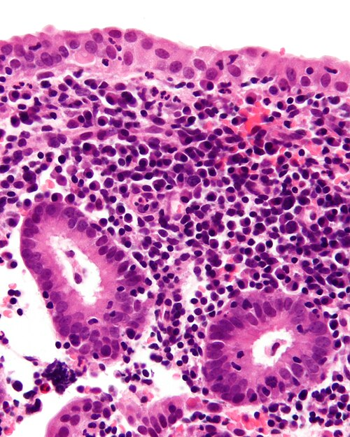
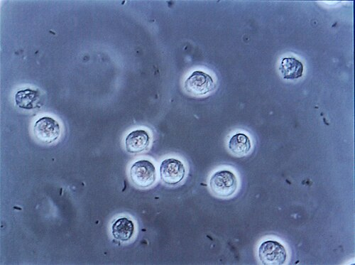

# INFECÇÃO PUERPERAL

A infecção puerperal continua sendo uma das principais causas de morte materna no Brasil e no mundo. Quando falamos desse tema para provas de residência, não estamos falando apenas de uma "febre após o parto", mas de um complexo de condições que variam desde uma endometrite leve até uma sepse puerperal fulminante. Para entender este tema, você precisa primeiro desconstruir a ideia de que qualquer febre no pós-parto é infecção.

*Figura 1 - Histopatologia de endometrite com abundantes plasmócitos e neutrófilos no endométrio (coloração H&E). Fonte: Nephron, CC BY-SA 3.0 | Wikimedia Commons*

## Definição e Critérios Diagnósticos

O ponto de partida para qualquer questão de prova é o conceito de Morbidade Febril Puerperal. Segundo os critérios clássicos, ainda amplamente cobrados, definimos febre puerperal como a presença de temperatura axilar maior ou igual a 38°C, ocorrendo por pelo menos dois dias quaisquer, dentro dos primeiros dez dias de puerpério, excluindo-se as primeiras 24 horas após o parto.

Por que excluímos as primeiras 24 horas? Porque nesse período inicial, é muito comum a ocorrência de uma febre transitória e fisiológica, decorrente do esforço muscular do trabalho de parto, da desidratação e da própria apojadura (a descida do leite). Se o seu paciente tem 37,8°C ou 38,1°C logo após sair da sala de parto, sem outros sintomas, você não vai sair prescrevendo antibiótico. Você vai observar.

No entanto, cuidado com a exceção que as bancas amam: se a febre nas primeiras 24 horas for muito alta (acima de 39°C) ou vier acompanhada de instabilidade hemodinâmica, suspeitamos de infecção precoce pelo Estreptococo Beta-Hemolítico do Grupo A (Streptococcus pyogenes). Este é um quadro grave e fulminante que foge à regra da "febre fisiológica".

## Epidemiologia e Fatores de Risco

A infecção puerperal é, essencialmente, uma infecção hospitalar. O principal fator de risco isolado, disparado, é a via de parto. A cesariana aumenta o risco de infecção em até 10 a 30 vezes quando comparada ao parto vaginal.

Mas por que a cesariana é tão perigosa nesse aspecto? Pense na fisiopatologia: você tem a abertura da cavidade abdominal, manipulação uterina, presença de tecidos desvitalizados (restos de decídua, coágulos), fios de sutura (corpo estranho) e, muitas vezes, um tempo cirúrgico prolongado. Se essa cesariana for feita após um longo período de trabalho de parto ou com bolsa rota, o risco escala exponencialmente.

### Tabela 1: Fatores de Risco para Infecção Puerperal

| Categoria | Fatores Específicos |
| --- | --- |
| Relacionados ao Parto | Cesariana (principal), Parto Instrumental, Extração Manual da Placenta |
| Relacionados às Membranas | Rotura Prematura de Membranas (RPMO) > 12-18h, Corioamnionite |
| Relacionados ao Exame | Toques vaginais repetidos (> 5 toques), Monitorização interna |
| Relacionados à Paciente | Baixo nível socioeconômico, Anemia, Diabetes, Obesidade, Desnutrição |
| Outros | Trabalho de parto prolongado, Colonização por GBS (Streptococcus agalactiae) |

Um erro comum em provas é achar que DSTs ou o uso de corticoides para maturação pulmonar fetal aumentam o risco de endometrite. As evidências mostram que o corticoide, nas doses habituais da obstetrícia, não é um fator de risco relevante. Já o polidrâmnio ou a idade materna avançada também costumam aparecer como "distratores" em questões, mas não possuem relação direta com a gênese da infecção.

## Etiologia e Fisiopatologia

A infecção puerperal é tipicamente polimicrobiana e ascendente. O útero, que era um ambiente estéril, é colonizado por bactérias da flora vaginal e do trato gastrointestinal logo após a rotura das membranas ou durante as manobras de parto.

Os agentes mais comuns incluem:

- Cocos Gram-positivos: Streptococcus agalactiae (Grupo B), Staphylococcus aureus, Enterococcus faecalis.

- Gram-negativos: Escherichia coli, Klebsiella pneumoniae.

- Anaeróbios: Peptostreptococcus, Bacteroides fragilis (especialmente em casos graves e pós-cesariana).

Como Dr. Will sempre reforça em suas discussões clínicas no MedEvo, entender a flora é entender o tratamento. Se a infecção é polimicrobiana e conta com anaeróbios importantes, seu esquema de antibiótico não pode ser simples. Ele precisa de "peso".

A infecção geralmente começa no sítio de inserção placentária, onde os vasos estão abertos e há restos de decídua. Dali, ela se espalha para o endométrio (endometrite), podendo atingir o miométrio (miometrite), os parâmetros (parametrite) e até a corrente sanguínea (sepse).

## Endometrite Puerperal: O Quadro Clínico Clássico

A endometrite é a forma mais comum de infecção puerperal. O diagnóstico é eminentemente clínico. Se você esperar o resultado de uma cultura para tratar, seu paciente pode evoluir para choque séptico.

A tríade clássica que você deve procurar na descrição do caso clínico é:

- Febre (geralmente surgindo entre o 2º e o 5º dia pós-parto).

- Dor abdominal infraumbilical/pélvica.

- Lóquios fétidos ou com aspecto purulento.

Ao exame físico, você encontrará o que chamamos de Tríade de Bumm:

- Útero doloroso à palpação.

- Útero amolecido (perda do tônus firme esperado no puerpério).

- Útero hipoinvoluído (ou subinvoluído), ou seja, maior do que o esperado para o dia do pós-parto.

Lembre-se: no pós-parto imediato, o útero está na altura do umbigo. Ele deve regredir cerca de 1 cm por dia. Se no 4º dia ele ainda está no umbigo e dói, abra o olho para endometrite.

*Figura 2 - Análise microscópica de urina demonstrando bacteriúria e piúria, achados laboratoriais importantes na investigação infecciosa puerperal. Fonte: Steven Fruitsmaak, CC BY-SA 3.0 | Wikimedia Commons*

## Diagnóstico Diferencial da Febre no Puerpério

Nem toda febre é útero. As bancas adoram colocar uma paciente com febre e pedir para você diferenciar a causa.

- Ingurgitamento Mamário / Mastite: A febre da apojadura é precoce e autolimitada. A mastite costuma ser mais tardia (após o 10º dia), com sinais flogísticos localizados na mama (dor, calor, rubor). Se a paciente tem febre, mas o útero está contraído e indolor, olhe para as mamas.

- Infecção de Trato Urinário (ITU): Muito comum devido à cateterização vesical na cesariana e ao trauma uretral no parto vaginal. Pesquise disúria e dor lombar.

- Infecção da Ferida Cirúrgica: Febre que persiste mesmo após o início do tratamento para endometrite ou que surge por volta do 4º ao 7º dia, com hiperemia e secreção na cicatriz da cesárea ou episiotomia.

- Tromboflebite Pélvica Séptica: O "diagnóstico de exclusão". É aquela paciente que está tratando endometrite com antibiótico correto, mas a febre não cede.

*Figura 2 - Análise microscópica de urina demonstrando bacteriúria e piúria, achados laboratoriais importantes na investigação infecciosa puerperal. Fonte: Steven Fruitsmaak, CC BY-SA 3.0 | Wikimedia Commons*

## Diagnóstico Laboratorial e de Imagem

Como dito, o diagnóstico é clínico. No entanto, alguns exames auxiliam na condução:

- Hemograma: Revela leucocitose com desvio à esquerda. Atenção: uma leucocitose leve (até 15.000) sem desvio é normal no pós-parto imediato.

- Ultrassonografia Pélvica: Sua principal utilidade não é diagnosticar a infecção em si, mas sim identificar Restos Ovulares Retidos. Se houver restos, o antibiótico sozinho não vai resolver; será necessária uma curetagem ou aspiração manual intrauterina (AMIU).

- Culturas: Hemoculturas e culturas de secreção uterina podem ser solicitadas em casos graves ou refratários, mas não devem atrasar o início do tratamento empírico.

## Tratamento da Infecção Puerperal

O tratamento da endometrite exige internação hospitalar e antibioticoterapia intravenosa de amplo espectro. O esquema padrão-ouro, o mais cobrado em provas e recomendado pela FEBRASGO, é:

**Clindamicina + Gentamicina (IV)**

- Clindamicina: 900 mg IV a cada 8 horas (cobre Gram-positivos e, crucialmente, anaeróbios).

- Gentamicina: 1,5 mg/kg IV a cada 8 horas ou 5 mg/kg em dose única diária (cobre Gram-negativos).

Por que esse esquema? Porque ele ataca a natureza polimicrobiana da infecção. A Clindamicina é excelente para o Bacteroides fragilis e outros anaeróbios que prosperam no útero isquêmico pós-parto.

### Tabela 2: Esquemas Terapêuticos e Condutas

| Situação | Conduta / Esquema |
| --- | --- |
| Endometrite (Padrão) | Clindamicina (900mg 8/8h) + Gentamicina (5mg/kg 1x/dia) IV |
| Alternativa (Alergia) | Ampicilina + Sulbactam OU Cefalosporina de 3ª + Metronidazol |
| Suspeita de Enterococo | Adicionar Ampicilina ao esquema Clinda+Genta |
| Melhora Clínica | Manter ATB IV até 24 a 48 horas após a paciente ficar afebril e assintomática |
| Alta Hospitalar | NÃO há necessidade de completar antibiótico por via oral em casa se a paciente estiver bem |

Um ponto fundamental para a prova: a amamentação deve ser mantida, a menos que a paciente esteja em estado de choque ou gravemente instável. Os antibióticos do esquema clássico são compatíveis com o aleitamento.

### Quando o tratamento falha?

Se após 48 a 72 horas de antibiótico adequado a paciente persistir com febre, você deve pensar em três hipóteses principais:

- Restos placentários retidos (conduta: USG e curetagem).

- Abscesso pélvico ou de parede abdominal (conduta: drenagem).

- Tromboflebite Pélvica Séptica.

## Tromboflebite Pélvica Séptica (TPS)

Este é um tema "queridinho" das provas de alto nível. A TPS ocorre quando a infecção se dissemina pelas veias pélvicas, causando trombose e inflamação desses vasos.

O cenário clínico é: puérpera com endometrite, em uso de Clindamicina + Gentamicina, que apresenta melhora da dor e dos lóquios, mas a febre persiste (febre em picos, "em dentes de serra"). O exame físico é frequentemente pobre, sem massas palpáveis.

O diagnóstico é de exclusão, mas pode ser auxiliado por Tomografia ou Ressonância Magnética mostrando trombos nas veias ovarianas ou ilíacas.
O tratamento? Manter o antibiótico e adicionar Heparina (anticoagulação) em dose plena. A resposta costuma ser dramática, com a febre desaparecendo em 24-48 horas após o início da anticoagulação.

## Prevenção: O Papel da Profilaxia

A melhor forma de tratar a infecção puerperal é evitar que ela ocorra. A medida preventiva mais eficaz na obstetrícia moderna é a Antibioticoprofilaxia na Cesariana.

A recomendação atual é a administração de uma dose única de Cefalosporina de 1ª geração (Cefazolina 2g ou 3g se peso > 120kg) cerca de 30 a 60 minutos antes da incisão cutânea. Antigamente, esperava-se o clampeamento do cordão umbilical para dar o antibiótico, com medo de afetar o feto. Esqueça isso. A diretriz atual é clara: o antibiótico deve estar no tecido da mãe quando o bisturi tocar a pele.

Além disso, a higienização das mãos, a redução do número de toques vaginais e a técnica cirúrgica apurada são pilares fundamentais.

### Tabela 3: Diagnóstico Diferencial da Febre Puerperal por Período

| Tempo Pós-Parto | Causa Provável | Características |
| --- | --- | --- |
| Primeiras 24h | Fisiológica / Desidratação | Baixa intensidade, autolimitada |
| Primeiras 24h (Alta) | S. pyogenes (Grupo A) | Febre > 39°C, sepse precoce, lóquios inodoros |
| 2º ao 10º dia | Endometrite | Tríade de Bumm, lóquios fétidos |
| 4º ao 10º dia | Infecção de Ferida | Flogose na cicatriz, secreção |
| > 10 dias | Mastite Puerperal | Sinais mamários localizados |
| Persistente | Tromboflebite Pélvica | Febre que não cede ao ATB, diagnóstico de exclusão |

## Complicações e Morte Materna

A infecção puerperal pode evoluir para o Choque Séptico Puerperal. Nestes casos, a paciente apresenta hipotensão, taquicardia, oligúria e alteração do nível de consciência. O manejo deve ser em UTI, com reposição volêmica agressiva, drogas vasoativas se necessário e escalonamento de antibióticos (ex: Piperacilina/Tazobactam ou Carbapenêmicos).

Um conceito epidemiológico importante para provas de Saúde Pública e Obstetrícia é a Morte Materna Tardia. Ela é definida como o óbito de uma mulher por causas obstétricas (diretas ou indiretas) que ocorre após 42 dias e até um ano após o parto. Se a paciente morre de complicações de uma infecção puerperal 3 meses depois do parto, ela entra nessa estatística.

## Situações Especiais e Pegadinhas

### Restos Placentários

Muitas vezes, a infecção é secundária à retenção de restos. A paciente pode apresentar sangramento aumentado (hemorragia puerperal tardia) associado à febre. O útero estará muito subinvoluído. No MedEvo, sempre lembramos: se há suspeita de restos, o esvaziamento uterino deve ser feito sob proteção de antibiótico para evitar a disseminação da infecção para a corrente sanguínea durante o procedimento.

### Síndrome de Bumm

Embora tenhamos falado da tríade de Bumm (útero doloroso, amolecido e hipoinvoluído), algumas bancas usam o termo "Síndrome de Bumm" para descrever especificamente a endometrite grave com evolução para peritonite. Fique atento ao contexto da questão.

### O papel do GBS

O Streptococcus agalactiae (GBS) é muito lembrado pela sepse neonatal, mas ele também é um agente importante da endometrite. No entanto, a profilaxia intraparto para GBS (feita para proteger o bebê) não elimina totalmente o risco de endometrite materna, embora possa reduzi-lo.

### Tabela 4: Resumo de Condutas Baseadas em Evidências (MS/FEBRASGO)

| Achado Clínico | Conduta Imediata |
| --- | --- |
| Febre < 24h, estável | Observação, hidratação, reavaliação |
| Febre + Útero doloroso | Internação + Clindamicina + Gentamicina IV |
| Febre persistente > 72h ATB | USG Pélvico + Investigar TPS / Abscesso |
| Restos ovulares ao USG | Curetagem ou AMIU após início do ATB |
| Choque Séptico | Protocolo de Sepse (Volemia + Vasoativo + ATB amplo) |

## Pontos-Chave para Prova

- Morbidade Febril Puerperal: Tax ≥ 38°C por 2 dias, entre o 2º e 10º dia pós-parto.

- A febre nas primeiras 24h é geralmente fisiológica (apojadura, desidratação), exceto se for > 39°C ou houver instabilidade (suspeitar de S. pyogenes).

- O principal fator de risco é a Cesariana, especialmente se houver trabalho de parto prévio ou bolsa rota.

- A etiologia é polimicrobiana (aeróbios e anaeróbios) e a via é ascendente.

- Tríade de Bumm: Útero doloroso, amolecido e hipoinvoluído. É o sinal clássico da endometrite.

- Lóquios fétidos são característicos, mas sua ausência não exclui o diagnóstico (especialmente na infecção por Estreptococos).

- Tratamento padrão-ouro: Clindamicina + Gentamicina IV.

- Manutenção do tratamento: Até 24-48 horas afebril e assintomática. Não precisa de ATB oral após a alta.

- Tromboflebite Pélvica Séptica: Suspeitar quando a febre persiste após 48-72h de ATB adequado. Tratamento: ATB + Heparina.

- Profilaxia na Cesariana: Cefazolina (dose única) 30-60 min antes da incisão.

- A amamentação NÃO deve ser interrompida na maioria dos casos de infecção puerperal.

- O diagnóstico de endometrite é clínico. Exames de imagem (USG) servem para buscar restos ou abscessos.

- Morte materna tardia: Entre 42 dias e 1 ano pós-parto.

- Erro comum: Achar que a curetagem deve ser feita antes do antibiótico. O correto é iniciar o ATB primeiro para "estabilizar" o foco e evitar bacteremia durante a manipulação.

- Pegadinha: A alternativa que diz que "toda puérpera com febre deve receber antibiótico imediato" está errada devido à febre fisiológica das primeiras 24h. 🩺

 Cópia offline para consulta pessoal.
 Fonte original:
 [https://www.medevo.com.br/material-apoio/ler/b0ff528c-b4c6-45f1-b8ec-8e958bcfc139](https://www.medevo.com.br/material-apoio/ler/b0ff528c-b4c6-45f1-b8ec-8e958bcfc139)
