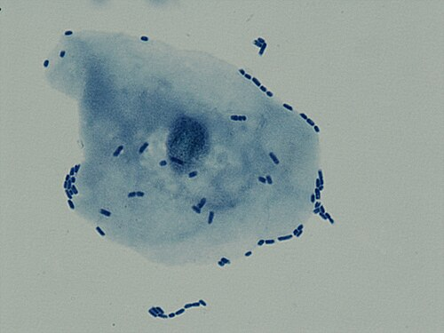

# INFECÇÃO URINÁRIA NA CRIANÇA

A Infecção do Trato Urinário (ITU) é uma das patologias bacterianas mais comuns na infância. Se você está estudando para a residência, precisa entender que a ITU não é apenas "uma infecção", mas sim um marcador de possíveis anomalias estruturais e um risco real de sequelas permanentes, as famosas cicatrizes renais.

O grande desafio que as bancas exploram é que, quanto menor a criança, mais inespecíficos são os sintomas. Um lactente não vai chegar dizendo que dói para urinar, ele vai chegar com febre, irritabilidade ou apenas parando de ganhar peso. É aqui que o examinador te pega se você não tiver o "olhar clínico" treinado.

*Figura 1 - Cistouretrograma miccional (VCUG) mostrando refluxo vesicoureteral bilateral grau III, importante fator de risco para ITU na criança. Fonte: RadsWiki, CC BY-SA 3.0 | Wikimedia Commons*

## Epidemiologia e Fatores de Risco

A prevalência da ITU varia drasticamente com a idade e o sexo. No primeiro ano de vida, especialmente nos primeiros meses, a ITU é mais comum em meninos. Por que isso acontece? Principalmente devido à maior incidência de malformações congênitas do trato urinário nesse grupo e à presença do prepúcio, que facilita a colonização bacteriana.

Após o primeiro ano de vida, a balança vira. As meninas passam a ter uma incidência muito maior, chegando a ser 10 vezes mais frequente do que nos meninos. A explicação anatômica é clássica: a uretra feminina é mais curta e a proximidade com a região perianal facilita a translocação de bactérias do trato gastrointestinal.

Um ponto que o Dr. Will sempre reforça em aula: a circuncisão reduz significativamente o risco de ITU em meninos. Se a questão de prova descreve um lactente masculino com febre e menciona que ele é circuncidado, o risco de ITU cai, embora não seja zero.

### Fatores de Risco Importantes

- Sexo feminino (após o 1º ano).

- Meninos não circuncidados (no 1º ano).

- Disfunção miccional e intestinal (constipação é um fator de risco gigante e negligenciado).

- Refluxo Vesicoureteral (RVU).

- Atividade sexual (em adolescentes).

- Cateterismo vesical.

## Etiologia: Quem é o Culpado?

Em mais de 80% dos casos, a culpada é a *Escherichia coli*. Ela faz parte da flora intestinal e possui fímbrias (pili) que permitem a adesão ao urotélio.

No entanto, as bancas adoram cobrar os "outros" agentes em contextos específicos:

- *Proteus mirabilis*: Muito associado a meninos (coloniza o prepúcio) e à formação de cálculos de estruvita (ele produz urease, que alcaliniza a urina).

- *Staphylococcus saprophyticus*: Comum em adolescentes do sexo feminino com vida sexual ativa.

- *Enterococcus faecalis*: Frequentemente associado a malformações urinárias ou uso prévio de antibióticos.

- *Klebsiella* e *Enterobacter*: Comuns em infecções hospitalares ou após instrumentação.

- Vírus (Adenovírus): Causa clássica de cistite hemorrágica (hematúria macroscópica súbita, mas geralmente sem febre alta).

## Quadro Clínico: O Camaleão da Pediatria

A apresentação clínica é totalmente dependente da faixa etária. Grave esta regra: quanto mais jovem a criança, mais sistêmico e inespecífico é o quadro.

### Neonatos e Lactentes Jovens ( 2 anos)

Os sintomas tornam-se localizatórios, semelhantes aos do adulto:

- Cistite: Disúria, polaciúria, urgência miccional, dor suprapúbica. Geralmente afebril ou febre baixa.

- Pielonefrite: Febre alta, calafrios, dor lombar (sinal de Giordano positivo) e queda do estado geral.

**Cuidado com a pegadinha:** Se a criança tem sintomas de cistite (disúria) mas também tem febre alta e dor lombar, o diagnóstico é Pielonefrite. A febre é o divisor de águas entre infecção baixa e alta na pediatria.

*Figura 2 - Microscopia mostrando E. coli uropatogênica aderida a célula epitelial da bexiga, mecanismo central na patogênese da ITU. Fonte: Stefan Walkowski, CC BY-SA 4.0 | Wikimedia Commons*

## Diagnóstico: A Arte da Coleta

Este é o tópico mais cobrado em provas. O diagnóstico definitivo de ITU exige, obrigatoriamente, uma urocultura positiva colhida de forma adequada.

### Métodos de Coleta

A escolha do método depende do controle esfincteriano da criança.

- **Jato Médio:** Reservado para crianças com controle esfincteriano. É o método padrão para escolares.

- **Saco Coletor:** Muito utilizado na prática, mas um perigo em provas. Ele tem um alto valor preditivo negativo, mas um baixíssimo valor preditivo positivo. Ou seja: se vier NEGATIVO, você exclui ITU. Se vier POSITIVO, você NÃO pode confirmar o diagnóstico, pois a taxa de contaminação é altíssima (até 70%). Se o saco coletor vier positivo, você deve repetir a coleta por um método invasivo antes de tratar (a menos que a criança esteja grave).

- **Cateterismo Vesical (Sondagem):** É o método de escolha para lactentes sem controle esfincteriano na maioria dos serviços. É seguro e confiável.

- **Punção Suprapúbica (PSP):** Considerada o "Padrão-Ouro". Como a bexiga é um local estéril, qualquer crescimento bacteriano é considerado positivo. É o método mais confiável, porém mais invasivo e tecnicamente mais difícil (idealmente guiado por ultrassom).

### Tabela 1: Critérios de Positividade na Urocultura (SBP/Diretrizes Internacionais)

| Método de Coleta | Unidades Formadoras de Colônias (UFC/mL) | Interpretação |
| --- | --- | --- |
| Punção Suprapúbica | Qualquer crescimento (se gram-negativo) | Positivo |
| Cateterismo Vesical | > 50.000 | Positivo |
| Jato Médio | > 100.000 | Positivo |
| Saco Coletor | > 100.000 | Apenas suspeito (exige confirmação) |

### O Sumário de Urina (EAS / Urina tipo 1)

O EAS ajuda a guiar a conduta inicial enquanto a cultura não fica pronta, mas ele sozinho não diagnostica ITU.

- **Leucocitúria (Piúria):** Indica inflamação, mas pode estar presente em febre de qualquer origem, desidratação ou vulvovaginites.

- **Nitrito:** Muito específico, mas pouco sensível em lactentes. Por quê? Porque a bactéria precisa de cerca de 4 horas na bexiga para converter nitrato em nitrito, e lactentes esvaziam a bexiga muito rápido. Além disso, nem todas as bactérias produzem nitrito (ex: Gram-positivos).

- **Esterase Leucocitária:** Indica a presença de leucócitos íntegros ou lisados.

**Erro clássico de prova:** Achar que urocultura positiva com EAS normal em lactente é sempre ITU. Se o EAS está normal e a cultura deu positiva, suspeite fortemente de contaminação da amostra, especialmente se a coleta foi por saco coletor.

*Figura 2 - Microscopia mostrando E. coli uropatogênica aderida a célula epitelial da bexiga, mecanismo central na patogênese da ITU. Fonte: Stefan Walkowski, CC BY-SA 4.0 | Wikimedia Commons*

## Diagnóstico Diferencial

Nem tudo que arde ou dói é ITU.

- **Vulvovaginite:** Causa comum de disúria e leucocitúria em meninas. O exame físico mostrando hiperemia vulvar ajuda a diferenciar.

- **Balanopostite:** Inflamação do prepúcio em meninos.

- **Oxiuríase:** A migração do verme pode causar prurido e sintomas urinários irritativos.

- **Cistite Viral:** Adenovírus causando hematúria macroscópica.

- **Febre sem Foco:** Lembre-se de considerar Otite Média Aguda, Pneumonia oculta e Meningite, dependendo do estado geral.

## Tratamento: Onde, Como e com O Quê?

A primeira decisão é: internar ou tratar em casa?

### Critérios de Internação

- Idade < 2-3 meses (sempre internação e tratamento parenteral).

- Sinais de sepse ou instabilidade hemodinâmica.

- Vômitos persistentes (impossibilidade de medicação oral).

- Desidratação moderada a grave.

- Falha no tratamento ambulatorial.

- Dúvida quanto à adesão da família.

- Malformações urinárias graves conhecidas.

### Antibioticoterapia Empírica

O tratamento deve ser iniciado logo após a coleta da urina se a suspeita clínica for alta ou o EAS estiver alterado.

**ITU Baixa (Cistite):**

- Duração: 3 a 5 dias (algumas diretrizes sugerem 7 dias em crianças menores).

- Opções: Nitrofurantoína (não usar se suspeita de pielonefrite, pois não atinge níveis tecnais renais), Cefalexina, Amoxicilina + Clavulanato ou Sulfametoxazol-Trimetoprim (checar resistência local).

**ITU Alta (Pielonefrite):**

- Duração: 7 a 14 dias.

- **Ambulatorial (Oral):** Cefalosporinas de 2ª ou 3ª geração (Cefuroxima, Cefixima) ou Amoxicilina + Clavulanato.

- **Hospitalar (Parenteral):** Ceftriaxona (1ª escolha em muitos protocolos), Ampicilina + Gentamicina (clássico para neonatos para cobrir *Listeria* e *Enterococcus*).

### Tabela 2: Doses Comuns de Antibióticos em Pediatria

| Antibiótico | Dose (mg/kg/dia) | Frequência |
| --- | --- | --- |
| Cefalexina | 50 - 100 | 6/6h ou 8/8h |
| Amoxicilina + Clavulanato | 40 - 50 (base amox) | 8/8h |
| Nitrofurantoína | 5 - 7 | 6/6h |
| Ceftriaxona | 50 - 100 | 1x ao dia (IV/IM) |
| Gentamicina | 5 - 7,5 | 1x ao dia (IV/IM) |

**Dica MedEvo:** Se o antibiograma mostrar resistência *in vitro*, mas a criança estiver clinicamente bem, sem febre e com melhora dos sintomas, a recomendação é manter o antibiótico e observar. Não se muda time que está ganhando na clínica apenas pelo papel do laboratório.

## Investigação por Imagem: O Ponto de Discórdia

Aqui é onde as diretrizes (SBP, AAP, NICE) mais divergem, e as bancas adoram explorar essas nuances. O objetivo da imagem é identificar malformações (como RVU) e cicatrizes renais.

### Ultrassonografia (USG) de Rins e Vias Urinárias

É o exame inicial. Deve ser feito em **toda criança no primeiro episódio de ITU febril**.

- Vantagens: Não tem radiação, vê anatomia, hidronefrose e abscessos.

- Limitação: Não detecta bem refluxo vesicoureteral (RVU) leve nem cicatrizes agudas.

### Uretrocistografia Miccional (UCM)

É o exame padrão para diagnosticar e graduar o Refluxo Vesicoureteral.

- **Quando pedir?**

- Se o USG estiver alterado (hidronefrose, duplicação ureteral, etc.).

- Na segunda ITU febril (recorrência).

- Em casos de ITU febril por germe não-E. coli ou se a evolução clínica for ruim.

- Alguns protocolos (mais agressivos) indicam após a primeira ITU febril em menores de 2 anos.

### Cintilografia Renal com DMSA

O DMSA é o padrão-ouro para avaliar o parênquima renal.

- **DMSA Agudo:** Feito na fase aguda para confirmar pielonefrite (áreas de hipocaptação). Pouco usado na rotina, exceto em dúvidas diagnósticas.

- **DMSA Tardio (após 6 meses):** Feito para pesquisar cicatrizes renais permanentes. É indicado em casos de ITU de repetição ou RVU graus III a V.

### Tabela 3: Classificação do Refluxo Vesicoureteral (RVU)

| Grau | Descrição |
| --- | --- |
| I | Refluxo apenas para o ureter, sem atingir a pelve. |
| II | Atinge pelve e cálices, mas sem dilatação. |
| III | Leve dilatação do ureter e pelve, com mínima deformidade de cálices. |
| IV | Dilatação moderada, tortuosidade do ureter e perda da nitidez dos cálices. |
| V | Grande dilatação, ureter tortuoso e perda total da morfologia calicial. |

## Antibioticoprofilaxia

A profilaxia não é mais recomendada "para todo mundo" como antigamente. O uso indiscriminado aumentou a resistência bacteriana sem reduzir significativamente as cicatrizes renais.

**Indicações Atuais (SBP):**

- Refluxo Vesicoureteral graus III a V.

- Enquanto aguarda exames de imagem (ex: aguardando a UCM após uma ITU febril).

- ITU recorrente (3 ou mais episódios em 1 ano) mesmo com trato urinário normal, após avaliar disfunções miccionais.

**Drogas usadas:** Nitrofurantoína (1-2 mg/kg/dia) ou Sulfametoxazol-Trimetoprim (2 mg/kg/dia de TMP). Dose única noturna (porque a urina fica mais tempo parada na bexiga à noite).

## Complicações e Prognóstico

A maior preocupação a longo prazo é a **Nefropatia do Refluxo**. Cicatrizes renais extensas podem levar a:

- Hipertensão Arterial Sistêmica (HAS) na vida adulta.

- Proteinúria.

- Insuficiência Renal Crônica.

- Complicações na gestação futuramente.

Por isso, o diagnóstico precoce e o tratamento adequado da primeira ITU febril são cruciais. Não espere o resultado da cultura para iniciar o tratamento se a clínica for soberana.

## Situações Especiais e Pegadinhas

### Bacteriúria Assintomática

É o crescimento bacteriano na urocultura sem nenhum sintoma clínico.

- **Conduta:** NÃO tratar. O tratamento apenas seleciona germes mais resistentes. A única exceção clássica na medicina é a gestante, mas em pediatria, a regra é não tratar.

### Disfunção de Eliminação (Bexiga e Intestino)

Muitas crianças com ITU de repetição sofrem de constipação crônica. O reto cheio de fezes comprime a bexiga, impedindo o esvaziamento completo e facilitando a proliferação bacteriana. O tratamento da constipação (dieta rica em fibras, aumento de ingesta hídrica e laxantes se necessário) é parte fundamental do manejo da ITU.

### Fimose Fisiológica vs. Patológica

Lembre-se que a maioria dos meninos nasce com fimose fisiológica que se resolve até os 3-5 anos. Não se indica postectomia (circuncisão) de rotina para prevenir ITU, a menos que haja ITUs de repetição ou malformações associadas onde a redução do risco seja crítica.

## Pontos-Chave para Prova

- **Agente mais comum:** *Escherichia coli* em todas as faixas etárias.

- **Padrão-ouro de coleta em lactentes:** Punção Suprapúbica (qualquer crescimento é positivo).

- **Método mais prático em lactentes:** Cateterismo vesical (positivo se > 50.000 UFC/mL).

- **Saco coletor:** Serve apenas para EXCLUIR diagnóstico se vier negativo. Se positivo, confirme com método invasivo.

- **Febre sem foco:** Em lactentes, sempre pensar em ITU.

- **Nitrito:** Alta especificidade, mas baixa sensibilidade em lactentes (esvaziamento vesical rápido).

- **Primeiro exame de imagem:** Ultrassonografia de rins e vias urinárias para todos no 1º episódio febril.

- **UCM (Uretrocistografia):** Indicada se USG alterado ou na recorrência da ITU febril.

- **Cintilografia com DMSA:** Padrão-ouro para cicatriz renal (fazer 6 meses após a infecção).

- **Tratamento de escolha (Pielonefrite oral):** Cefalosporinas de 2ª ou 3ª geração.

- **Nitrofurantoína:** Excelente para cistite e profilaxia, mas NUNCA para pielonefrite (não atinge nível renal).

- **Refluxo Vesicoureteral:** A malformação mais comum associada à ITU febril.

- **Bacteriúria assintomática:** Não tratar em crianças.

- **Constipação:** Sempre investigar e tratar em casos de ITU recorrente.

- **Cistite Viral:** Suspeitar se hematúria macroscópica súbita sem febre (Adenovírus).

- **Internação obrigatória:** Menores de 2-3 meses ou sinais de toxemia/sepse.

- **Profilaxia:** Indicada em RVU de alto grau (III a V) ou ITUs de repetição graves.

- **Cicatriz renal:** O grande risco da ITU não tratada, podendo levar a HAS e insuficiência renal no futuro.

 Cópia offline para consulta pessoal.
 Fonte original:
 [https://www.medevo.com.br/material-apoio/ler/b2d6bc48-68d8-4853-8dcb-d763e75d8c0b](https://www.medevo.com.br/material-apoio/ler/b2d6bc48-68d8-4853-8dcb-d763e75d8c0b)
