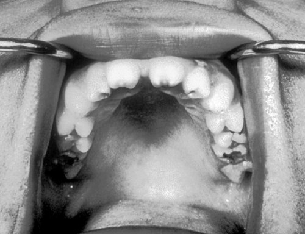
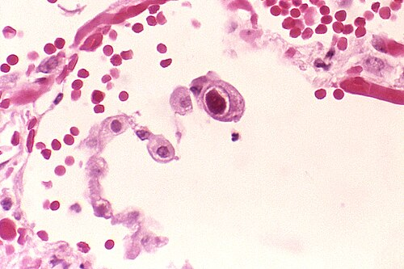

# INFECÇÕES CONGÊNITAS TORCH, CMV E SÍFILIS CONGÊNITA

As infecções congênitas representam um dos temas mais recorrentes e complexos da pediatria em provas de residência. O desafio aqui não é apenas decorar nomes de agentes etiológicos, mas entender a lógica do manejo clínico, especialmente quando os protocolos mudam. Como professor, vejo muitos alunos se perderem em fluxogramas de sífilis ou confundirem as calcificações cerebrais. Vamos organizar esse raciocínio para que você não precise de "decoreba", mas sim de compreensão clínica.

*Figura 1 - Dentes de Hutchinson: incisivos permanentes com entalhes e formato de "chave de fenda", sinal patognomônico da sífilis congênita tardia (componente da Tríade de Hutchinson, junto com ceratite intersticial e surdez neurossensorial). Fonte: CDC/PHIL #2385, Domínio Público | Wikimedia Commons*

## Sífilis Congênita: O Pesadelo das Bancas

A sífilis congênita é, de longe, o tema de infectologia neonatal que mais cai. Por que? Porque o Brasil vive uma epidemia de sífilis e os protocolos do Ministério da Saúde são detalhados e punitivos com o erro médico.

### O Conceito de Tratamento Materno Adequado

Este é o ponto de partida de qualquer questão. Se você não souber se a mãe foi bem tratada, você vai errar a conduta com o recém-nascido (RN). Segundo o Protocolo Clínico e Diretrizes Terapêuticas (PCDT) do Ministério da Saúde, para considerar uma gestante adequadamente tratada, ela deve cumprir quatro critérios simultâneos:

- **Esquema correto:** Uso de Penicilina Benzatina na dose apropriada para o estágio da sífilis (primária, secundária ou latente recente: 2,4 milhões UI; latente tardia ou duração ignorada: 7,2 milhões UI em 3 doses semanais).

- **Tempo de início:** O tratamento deve ter sido **iniciado** pelo menos 30 dias antes do parto (tempo suficiente para garantir passagem transplacentária de anticorpos protetores).

- **Documentação:** O tratamento deve estar registrado no cartão de pré-natal.

- **Controle de cura:** A queda dos títulos de VDRL deve ser demonstrada.

Cuidado: antigamente, o tratamento do parceiro era obrigatório para considerar a mãe tratada. **Isso mudou.** Atualmente, a ausência de tratamento do parceiro não invalida o tratamento materno para fins de definição de caso de sífilis congênita, embora o parceiro deva ser sempre convocado e tratado para evitar reinfecção.

### Investigação do Recém-Nascido

Aqui entra o Dr. Will com uma dica de ouro: nunca use sangue do cordão umbilical para o VDRL do RN. O sangue do cordão pode dar falso-positivo por contaminação com sangue materno ou falso-negativo. O exame deve ser feito em sangue periférico do bebê.

A investigação depende fundamentalmente de dois cenários:

**Cenário A: Mãe não tratada ou inadequadamente tratada**
Neste caso, o bebê é uma "bomba relógio". Não importa se ele está lindo e chorando forte. Você é obrigado a realizar a investigação completa:

- VDRL de sangue periférico.

- Hemograma completo.

- Radiografia de ossos longos (procure por osteocondrite ou periostite).

- Punção lombar (análise de células, proteínas e VDRL no líquor).

**Cenário B: Mãe adequadamente tratada**
Aqui somos mais conservadores. O primeiro passo é comparar o VDRL do RN com o da mãe (colhidos no momento do parto).

- Se o VDRL do RN for maior que o da mãe em duas ou mais diluições (ex: mãe 1:4 e RN 1:16), ele precisa de investigação completa.

- Se o VDRL do RN for menor ou igual ao da mãe e o bebê for assintomático, fazemos apenas o seguimento.

### Interpretação do Líquor e Neurosífilis

A neurosífilis no período neonatal é definida por qualquer alteração no líquor. As bancas adoram os valores de referência, que são diferentes do adulto:

- VDRL reativo no líquor (mesmo que 1:1).

- Proteína > 150 mg/dL (em RN termo) ou > 170 mg/dL (em prematuros).

- Celularidade > 25 leucócitos/mm³.

Se houver qualquer uma dessas alterações, o diagnóstico é neurosífilis e o tratamento obrigatoriamente deve ser feito com Penicilina G Cristalina por 10 dias.

### Tratamento do Recém-Nascido

O tratamento depende dos achados da investigação. Memorize esta tabela, ela é o coração da conduta:

| Situação Clínica | Conduta de Escolha | Alternativa |
| --- | --- | --- |
| Alteração liquórica (Neurosífilis) | Penicilina G Cristalina (10 dias) | Não há alternativa equivalente |
| Alteração clínica ou radiológica (Líquor normal) | Penicilina G Cristalina ou Procaína (10 dias) | Ceftriaxona (se penicilina indisponível) |
| RN assintomático, VDRL negativo, mãe mal tratada | Penicilina Benzatina (Dose única) | Penicilina Cristalina/Procaína (10 dias) se houver dúvida |
| RN assintomático, VDRL < que o da mãe, mãe bem tratada | Apenas seguimento clínico/laboratorial | Nenhuma |

A dose da Penicilina G Cristalina é de 50.000 UI/kg/dose. O intervalo muda com a idade: de 12/12h nos primeiros 7 dias de vida e de 8/8h após o 7º dia.

*Figura 2 - Pneumócito citomegálico com inclusão intranuclear ("olho de coruja") em coloração de H&E, achado histopatológico característico da infecção por Citomegalovírus (CMV). Fonte: CDC/Dr. Edwin P. Ewing Jr., Domínio Público | Wikimedia Commons*

## Manifestações Clínicas e Pérolas de Prova

A sífilis congênita precoce surge até os 2 anos de idade. O quadro clássico que cai na prova é: RN com rinite serossanguinolenta (altamente infectante), hepatoesplenomegalia, lesões cutâneas (palmo-plantares) e a famosa pseudoparalisia de Parrot (o bebê não mexe o braço ou perna devido à dor da osteocondrite, não por lesão neurológica).

Na radiografia, procure pelo sinal de Wimberger (erosão da metáfise proximal da tíbia). Se a questão falar em "Pneumonia Alba", marque sífilis sem medo. É uma infiltração pulmonar maciça pelo treponema.

Já a sífilis tardia (após 2 anos) é marcada por sequelas: Tríade de Hutchinson (dentes de Hutchinson, ceratite intersticial e surdez por lesão do VIII par), fronte olímpica, tíbia em lâmina de sabre e as Articulações de Clutton (sinovite indolor nos joelhos).

## Citomegalovírus (CMV): A Infecção Silenciosa e Barulhenta

O CMV é a infecção congênita mais comum no mundo. A grande pegadinha aqui é que 90% dos RNs infectados são **assintomáticos** ao nascimento. No entanto, esses bebês "normais" podem desenvolver surdez neurossensorial progressiva ao longo da infância.

### Quadro Clínico e Diagnóstico

Quando o CMV resolve aparecer (os 10% sintomáticos), ele não brinca em serviço. O quadro é de um bebê PIG (Pequeno para a Idade Gestacional), com microcefalia, petéquias (aspecto de "muffin de mirtilo" ou blueberry muffin rash) e icterícia colestática.

O diferencial clássico com a Toxoplasmose está na neuroimagem:

- **CMV:** Calcificações **periventriculares** (ao redor dos ventrículos).

- **Toxoplasmose:** Calcificações **difusas** pelo parênquima.

Para o diagnóstico, o padrão-ouro é a detecção do DNA viral por PCR na urina ou saliva. Mas atenção: o exame deve ser feito nas **primeiras 3 semanas de vida**. Por que? Porque se você colher com 1 mês e der positivo, você não consegue saber se a infecção foi congênita ou se o bebê pegou CMV pelo leite materno ou canal de parto (infecção perinatal), que geralmente não causa sequelas graves.

### Tratamento do CMV

Não tratamos todos os bebês com CMV. O tratamento é reservado para os sintomáticos (especialmente com acometimento de SNC) para tentar reduzir a progressão da perda auditiva e melhorar o neurodesenvolvimento.

- Droga: Ganciclovir EV (6 mg/kg de 12/12h) por 6 semanas ou Valganciclovir oral por 6 meses.

- Monitoramento: O Ganciclovir é muito mielotóxico. Você precisa vigiar o hemograma (neutropenia) semanalmente.

## Toxoplasmose Congênita: A Tríade de Sabin

Diferente do CMV, na toxoplasmose, quanto mais tardia a gestação, maior a chance de transmissão, porém menor a gravidade. A infecção no primeiro trimestre é rara, mas devastadora.

### A Tríade Clássica

As bancas amam a Tríade de Sabin:

- Coriorretinite (presente em quase 80% dos casos).

- Hidrocefalia obstrutiva.

- Calcificações intracranianas difusas.

Muitos alunos esquecem o quarto componente que alguns autores citam: o retardo mental ou convulsões.

### Diagnóstico e Manejo

O diagnóstico no RN é feito pela sorologia (IgM ou IgA reagentes). O IgG positivo apenas indica que a mãe passou anticorpos para o bebê (imunidade passiva), podendo demorar até 12 meses para negativar.

O tratamento é longo e rigoroso: **Pirimetamina + Sulfadiazina + Ácido Folínico** por 12 meses.

- **Por que o Ácido Folínico?** Porque a pirimetamina inibe a síntese de ácido fólico do parasita, mas também a nossa, podendo causar depressão medular.

- **Quando usar Corticoide (Prednisona)?** Apenas se houver coriorretinite em atividade (ameaçando a visão) ou se a proteína no líquor estiver muito alta (> 1000 mg/dL), para reduzir a inflamação.

## Rubéola Congênita: A Síndrome da Prevenção

Graças à vacinação (Tríplice Viral), a rubéola congênita é rara hoje, mas continua caindo em prova. O vírus é altamente teratogênico.

A tríade da rubéola é:

- Surdez neurossensorial (a sequela mais comum).

- Catarata ou Glaucoma congênito (leucocoria - reflexo branco na pupila).

- Cardiopatia congênita (Persistência do Canal Arterial - PCA - é a favorita das bancas).

Lembre-se: o RN com rubéola congênita pode eliminar o vírus por secreções respiratórias e urina por até 1 ano. Ele deve ser mantido em isolamento de contato e respiratório em ambiente hospitalar.

## Tuberculose Neonatal e Exposição — Atualização MS 2024

Este é um tema onde o MedEvo sempre destaca a importância do manejo preventivo. A conduta atual segue a **Nota Informativa nº 15/2024 CGTM/DATHI/SVSA/MS** e o **Manual de Recomendações para o Controle da Tuberculose no Brasil (MS, 2024)**.

**Conduta com o RN de mãe (ou contato) com TB pulmonar/laríngea bacilífera:**

- **Não vacinar com BCG ao nascer.**

- Iniciar **tratamento preventivo da TB (TPT)** no recém-nascido. O MS aceita atualmente três esquemas equivalentes — a escolha depende de disponibilidade, perfil de resistência do caso-índice e tolerância:

| Esquema | Duração | Quando preferir |
| --- | --- | --- |
| **Isoniazida (H)** 10 mg/kg/dia | **6 meses** | Esquema clássico, ainda o mais cobrado em prova |
| **Rifampicina (R)** 15 mg/kg/dia | **4 meses** | Intolerância à isoniazida ou contato com cepa H-resistente |
| **Rifampicina + Isoniazida (3HR)** | **3 meses** | Quando se prioriza adesão e duração mais curta |

- **Avaliar ao término do TPT** com prova tuberculínica (PT) ou IGRA, sempre interpretada com clínica e radiografia. Se a criança permanece assintomática e sem evidência de infecção, **vacinar com BCG após o término do TPT**. Se houver viragem ou suspeita de doença ativa em qualquer momento, encaminhar a serviço de referência e tratar como TB doença (esquema RHZE pediátrico).

- A amamentação **não é contraindicada**, desde que a mãe use máscara cirúrgica até deixar de ser bacilífera e não tenha lesões mamárias por TB.

> **Atenção:** o esquema **3HP** (rifapentina + isoniazida semanal por 3 meses), disponível no SUS para outras populações, **não é indicado em gestantes nem em menores de 2 anos** por ausência de dados robustos de segurança (CDC e OMS).

> **TB congênita (rara):** os critérios de **Cantwell** seguem como referência clássica — lesão tuberculosa no RN demonstrada na primeira semana de vida, complexo hepático primário/granuloma caseoso, infecção placentária ou genital materna documentada e exclusão de transmissão pós-natal.

## Hepatite B: A Urgência da Sala de Parto

Se a mãe é HBsAg positiva, o objetivo é impedir a cronificação da doença no bebê, que ocorre em 90% dos casos se não houver intervenção.

A conduta deve ser feita nas primeiras 12 horas de vida:

- Vacina contra Hepatite B (dose de rotina).

- Imunoglobulina Humana Anti-Hepatite B (HBIG).

Devem ser aplicadas em membros diferentes. O aleitamento materno está liberado logo após o banho do RN para remover sangue materno infectado.

## HIV: Profilaxia da Transmissão Vertical

O manejo do RN exposto ao HIV depende da carga viral materna e do pré-natal.

- **Baixo Risco:** Mãe em uso de TARV, carga viral indetectável. Conduta: AZT (Zidovudina) por 4 semanas.

- **Alto Risco:** Mãe sem pré-natal, ou carga viral detectável, ou início tardio da TARV. Conduta: AZT (4 semanas) + Lamivudina (4 semanas) + Nevirapina (3 doses nas primeiras 48h, 96h e 7 dias).

O AZT deve ser iniciado idealmente nas primeiras 4 horas de vida. O aleitamento materno é **contraindicação absoluta** no Brasil para mães HIV positivas.

## Conjuntivite Neonatal: O Tempo é a Chave

A causa da conjuntivite depende de quantos dias de vida o bebê tem:

- **Química (< 24h):** Reação ao nitrato de prata (método de Credé). É leve e autolimitada.

- **Gonocócica (2 a 5 dias):** Muito purulenta, grave, risco de perfuração ocular. Tratamento: Ceftriaxona EV/IM (dose única ou 3 dias se disseminada).

- **Chlamydia (5 a 14 dias):** É a causa bacteriana mais comum. Pode vir acompanhada de pneumonia afebril do lactente. Tratamento: Eritromicina ou Azitromicina oral (tratamento sistêmico é obrigatório para evitar a pneumonia).

## Tabelas Comparativas para Revisão Rápida

### Tabela 1: Diagnóstico Diferencial de Imagem do SNC

| Infecção | Achado Típico na Imagem | Outros Achados Marcantes |
| --- | --- | --- |
| **CMV** | Calcificações Periventriculares | Microcefalia, Surdez |
| **Toxoplasmose** | Calcificações Difusas | Hidrocefalia, Coriorretinite |
| **Zika Vírus** | Calcificações na transição cortico-subcortical | Microcefalia grave, artrogripose |
| **Sífilis** | Geralmente sem calcificações | Vasculite, Hidrocefalia (rara) |

### Tabela 2: Resumo de Tratamento Neonatal

| Doença | Droga de Escolha | Duração Típica |
| --- | --- | --- |
| **Sífilis (Neurosífilis)** | Penicilina G Cristalina | 10 dias |
| **Sífilis (Sem Neurosífilis)** | Penicilina G Cristalina ou Procaína | 10 dias |
| **Toxoplasmose** | Pirimetamina + Sulfadiazina + Ácido Folínico | 12 meses |
| **CMV (Sintomático)** | Valganciclovir (Oral) ou Ganciclovir (EV) | 6 meses (Val) ou 6 sem (Gan) |
| **Herpes Simplex** | Aciclovir EV | 14 a 21 dias |

### Tabela 3: Critérios de Tratamento Materno Inadequado (Sífilis)

| Critério | O que torna inadequado? |
| --- | --- |
| **Droga** | Qualquer uma que não seja Penicilina Benzatina |
| **Dose** | Dose incompleta para o estágio da doença |
| **Tempo** | Tratamento **iniciado** há menos de 30 dias antes do parto |
| **Seguimento** | Ausência de queda documentada dos títulos de VDRL |

## Pontos-Chave para Prova 🧠

- **VDRL do RN:** Deve ser sempre em sangue periférico, nunca do cordão.

- **Definição de Neurosífilis:** VDRL reativo no líquor OU Proteína > 150 OU Células > 25.

- **Tratamento da Sífilis:** Se houver alteração no líquor, a única opção é Penicilina Cristalina EV. Procaína e Benzatina não atingem níveis terapêuticos no SNC.

- **Pseudoparalisia de Parrot:** É dor óssea por osteocondrite na sífilis, não é paralisia real.

- **Calcificações:** CMV = Periventricular; Toxoplasmose = Difusa.

- **Janela do CMV:** O diagnóstico de infecção congênita por CMV deve ser feito até o 21º dia de vida.

- **Tríade de Sabin (Toxo):** Coriorretinite, Hidrocefalia, Calcificações difusas.

- **Tríade de Hutchinson (Sífilis Tardia):** Dentes, Ceratite e Surdez.

- **Mãe com TB:** Não vacinar o RN com BCG de imediato. Iniciar profilaxia com Isoniazida primeiro.

- **Hepatite B:** Vacina + Imunoglobulina nas primeiras 12 horas de vida para filhos de mães HBsAg+.

- **Conjuntivite por Chlamydia:** Exige tratamento **oral** (Azitromicina/Eritromicina) para prevenir pneumonia. Colírio não basta.

- **Penicilina Benzatina no RN:** Só é usada se o RN for assintomático, com VDRL negativo e a mãe foi inadequadamente tratada. Se o VDRL do RN for positivo ou ele tiver sintomas, é Cristalina ou Procaína por 10 dias.

- **Ceftriaxona na Sífilis:** É apenas uma alternativa excepcional se houver desabastecimento de penicilina e o bebê não tiver neurosífilis.

- **Seguimento da Sífilis:** VDRL com 1, 3, 6, 12 e 18 meses. Espera-se negativação até os 6 meses (se não for infectado) ou queda progressiva.

- **Erro Clássico:** Achar que IgM negativo para Toxoplasmose no RN exclui a doença. O IgM pode demorar a aparecer ou nem aparecer; o acompanhamento do IgG e exames complementares são fundamentais.

- **Contraindicação Absoluta de Amamentação:** No Brasil, HIV e HTLV. Na Tuberculose, a amamentação é permitida com máscara (se mãe bacilífera).

- **Pneumonia Alba:** Termo clássico de prova para acometimento pulmonar pela sífilis congênita.

 Cópia offline para consulta pessoal.
 Fonte original:
 [https://www.medevo.com.br/material-apoio/ler/d17428b0-7b87-4015-a39b-d7aa5ed2ba89](https://www.medevo.com.br/material-apoio/ler/d17428b0-7b87-4015-a39b-d7aa5ed2ba89)
