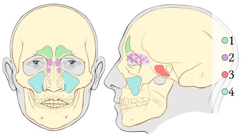

# INFECÇÕES DE VIAS AÉREAS SUPERIORES: OMA E SINUSITE BACTERIANA

Para entender as infecções de vias aéreas superiores (IVAS) na pediatria, você precisa primeiro esquecer a ideia de que a criança é um "adulto pequeno". Na otorrinolaringologia pediátrica, a anatomia é o destino. Se você compreender por que o ouvido e os seios da face de um lactente são diferentes dos seus, você nunca mais vai errar uma questão de conduta em Otite Média Aguda (OMA) ou Rinossinusite Bacteriana Aguda (RSBA).

Neste material, vamos dissecar os critérios diagnósticos que as bancas amam, as doses de antibióticos que você precisa ter na ponta da língua e, principalmente, quando NÃO tratar, que é onde a maioria dos candidatos perde pontos preciosos.

*Figura 1 - Representação anatômica da otite média aguda (OMA) com acúmulo de secreção purulenta no ouvido médio atrás da membrana timpânica. Fonte: BruceBlaus, CC BY-SA 4.0 | Wikimedia Commons*

## O Porquê da Vulnerabilidade Infantil: A Tuba de Eustáquio

Por que uma criança de 18 meses faz quatro otites por ano e você, provavelmente, não faz nenhuma há uma década? A resposta está na Tuba de Eustáquio (ou tuba auditiva).

No adulto, a tuba é longa, angulada (cerca de 45 graus) e rígida. Na criança, ela é curta, larga e, o mais importante, horizontalizada. Imagine a tuba como um dreno. Se o dreno está inclinado, a gravidade ajuda a descer. Se o dreno está reto, qualquer edema na garganta (causado por um resfriado comum, por exemplo) faz com que a secreção da nasofaringe "suba" ou fique represada no ouvido médio.

Além disso, o óstio da tuba na criança é cercado por tecido linfoide (a adenoide). Quando a adenoide hipertrofia ou inflama, ela obstrui mecanicamente a saída da tuba. Resultado: pressão negativa no ouvido médio, acúmulo de transudato e um banquete servido para as bactérias que colonizam a via aérea superior.

## Otite Média Aguda (OMA)

A OMA é, disparada, a infecção bacteriana mais comum na infância. Estima-se que 80% das crianças terão pelo menos um episódio até os 3 anos de idade.

### Etiologia: Os Três Mosqueteiros

Os agentes etiológicos da OMA e da Sinusite são praticamente os mesmos, o que facilita sua vida na hora de estudar:

- **Streptococcus pneumoniae:** O mais comum e o mais agressivo. É o que mais causa complicações e o que apresenta maiores taxas de resistência à penicilina por alteração das proteínas ligadoras de penicilina (PBPs).

- **Haemophilus influenzae (não tipável):** Frequentemente associado a quadros de OMA bilateral e conjuntivite purulenta concomitante (síndrome otite-conjuntivite). Cuidado: aqui a resistência ocorre pela produção de beta-lactamases.

- **Moraxella catarrhalis:** O terceiro da lista, geralmente causa quadros mais brandos e tem alta taxa de resolução espontânea.

*Figura 2 - Seios paranasais: 1-Frontal, 2-Etmoidal, 3-Esfenoidal, 4-Maxilar. O conhecimento anatômico é essencial para entender a sinusite bacteriana. Fonte: M. Komorniczak (baseado em Patrick J. Lynch), CC BY 2.5 | Wikimedia Commons*

## Diagnóstico: A Otoscopia é Soberana

Aqui mora a primeira grande pegadinha de prova. **Hiperemia isolada da membrana timpânica (MT) NÃO é diagnóstico de OMA.** Se a criança está chorando ou tem febre por qualquer outro motivo, a MT vai estar vermelha por vasodilatação.

Segundo a Sociedade Brasileira de Pediatria (SBP), o diagnóstico de OMA exige obrigatoriamente a presença de efusão no ouvido médio, demonstrada por:

- **Abaulamento da membrana timpânica:** Este é o sinal de maior valor preditivo positivo. Se a membrana está "estufada", há pus sob pressão.

- **Otorreia aguda:** Se você vê pus saindo pelo conduto e não é uma otite externa, houve perfuração timpânica por OMA.

- **Mobilidade reduzida:** Avaliada pela otoscopia pneumática (raramente feita na prática, mas muito cobrada em teoria).

**Exemplo Clínico:** Lactente de 1 ano, com coriza há 3 dias, apresenta irritabilidade e febre de 38,5°C. Na otoscopia, você vê uma membrana timpânica íntegra, porém opaca e com abaulamento evidente no quadrante superior. Conduto auditivo externo sem alterações. Diagnóstico: OMA.

### Tratamento: A Arte de Observar

Nem toda OMA precisa de antibiótico imediato. Isso é um conceito moderno que as bancas adoram testar para ver se você está atualizado com as diretrizes da SBP e da Academia Americana de Pediatria.

A estratégia de **Observação Vigilante (Watchful Waiting)** consiste em prescrever apenas analgésicos e observar a criança por 48 a 72 horas. Se não houver melhora, aí sim iniciamos o antibiótico.

**Quem pode apenas observar?**

- Crianças > 2 anos, com quadro leve (dor leve, febre < 39°C) e OMA unilateral.

- Crianças entre 6 meses e 2 anos com OMA unilateral e sintomas leves (algumas diretrizes são mais conservadoras aqui e preferem tratar sempre abaixo de 2 anos, mas a tendência de prova é aceitar a observação se o quadro for muito leve e houver garantia de retorno).

**Quem SEMPRE recebe antibiótico imediato?**

- Crianças < 6 meses (sempre!).

- Crianças com quadro grave (dor moderada a grave, febre ≥ 39°C).

- OMA bilateral em crianças < 2 anos.

- OMA com otorreia (perfuração).

### Escolha do Antibiótico e Doses

A primeira escolha continua sendo a **Amoxicilina**. Mas qual dose?

- **Dose padrão (40 a 50 mg/kg/dia):** Para crianças com baixo risco de pneumococo resistente.

- **Dose alta (80 a 90 mg/kg/dia):** Segundo a MedEvo, esta é a dose preferencial em provas se a criança frequenta creche, usou antibiótico nos últimos 30 dias ou tem menos de 2 anos. Por que? Para vencer a resistência do *S. pneumoniae*.

**Quando usar Amoxicilina + Clavulanato?**
Você vai adicionar o clavulanato se houver falha terapêutica após 48-72h de amoxicilina pura ou se houver suspeita de *H. influenzae* produtor de beta-lactamase (ex: síndrome otite-conjuntivite).

| Situação | Antibiótico de Escolha | Dose (mg/kg/dia) |
| --- | --- | --- |
| Primeira linha (baixo risco) | Amoxicilina | 40-50 mg/kg |
| Primeira linha (alto risco/creche) | Amoxicilina | 80-90 mg/kg |
| Falha inicial ou conjuntivite | Amoxicilina + Clavulanato | 80-90 mg/kg (da amoxicilina) |
| Alergia não tipo 1 (leve) | Cefuroxima axetil | 30 mg/kg |
| Alergia tipo 1 (grave/anafilaxia) | Azitromicina ou Claritromicina | 10 mg/kg (Azi) ou 15 mg/kg (Clari) |

**Duração do tratamento:**

- < 2 anos ou quadro grave: 10 dias.

- 2 a 5 anos (leve/moderada): 7 dias.

-

> 6 anos (leve/moderada): 5 a 7 dias.

## Rinossinusite Bacteriana Aguda (RSBA)

A sinusite bacteriana é quase sempre uma complicação de um resfriado comum (viral). O grande desafio do Dr. Will e de qualquer pediatra é: quando o resfriado deixou de ser viral e virou bacteriano?

Lembre-se: as crianças têm entre 6 a 8 episódios de IVAS viral por ano. Destes, apenas 5% a 10% evoluem para sinusite bacteriana. Se você der antibiótico para todo nariz escorrendo, estará criando super bactérias.

### Anatomia dos Seios da Face: O Cronograma de Surgimento

As bancas amam perguntar quais seios estão presentes ao nascimento. Anote aí:

- **Etmoidal e Maxilar:** Presentes ao nascimento (embora pequenos). O etmoidal é o mais frequentemente envolvido em complicações orbitárias em crianças pequenas.

- **Esfenoidal:** Começa a se formar por volta dos 3 a 5 anos.

- **Frontal:** O último a aparecer, geralmente visível no RX/TC apenas após os 7 a 10 anos.

### Critérios Diagnósticos: A Regra dos 10 Dias

O diagnóstico de RSBA é estritamente **CLÍNICO**. Não se pede Raio-X de seios da face em criança! O RX é impreciso, pois qualquer resfriado viral causa velamento dos seios.

Você deve diagnosticar RSBA se a criança apresentar um dos três padrões abaixo:

- **Sintomas Persistentes:** Tosse (diurna e noturna) e secreção nasal de qualquer aspecto que duram **mais de 10 dias** sem sinal de melhora.

- **Início Grave:** Febre alta (≥ 39°C) e secreção nasal purulenta por pelo menos **3 dias consecutivos** logo no início do quadro.

- **Piora Clínica (Double Sickening):** A criança estava melhorando de um resfriado comum e, de repente, volta a ter febre, tosse intensa ou nova secreção purulenta.

### Exames Complementares: Quando a Tomografia é Necessária?

Como dito, para o diagnóstico de rotina, nenhum exame é necessário. A Tomografia Computadorizada (TC) de seios da face com contraste é reservada para:

- Suspeita de complicações (orbitárias ou intracranianas).

- Sinusite crônica ou recorrente que não responde ao tratamento.

- Planejamento cirúrgico.

### Tratamento da Sinusite

O tratamento segue a lógica da OMA, mas com uma preferência maior pela dose alta de Amoxicilina (80-90 mg/kg/dia) devido à dificuldade de penetração da droga nos seios paranasais.

A lavagem nasal com soro fisiológico é fundamental. Ela remove mecanicamente o pus, reduz o edema da mucosa e facilita a drenagem dos óstios. Diferente da OMA, onde o tratamento expectante é uma opção, na sinusite bacteriana confirmada pelos critérios acima, o antibiótico está indicado.

**Duração:** Geralmente 10 a 14 dias, ou até 7 dias após a resolução completa dos sintomas.

*Figura 2 - Seios paranasais: 1-Frontal, 2-Etmoidal, 3-Esfenoidal, 4-Maxilar. O conhecimento anatômico é essencial para entender a sinusite bacteriana. Fonte: M. Komorniczak (baseado em Patrick J. Lynch), CC BY 2.5 | Wikimedia Commons*

## Diagnóstico Diferencial e Pérolas Clínicas

Muitas vezes, o que parece uma IVAS simples esconde algo mais. Vamos conectar com os conceitos que as bancas misturam nas questões:

- **Corpo Estranho Nasal:** Se a criança tem rinorreia unilateral, fétida e sanguinolenta, não é sinusite. É corpo estranho até que se prove o contrário.

- **Coqueluche:** Se a criança tem uma tosse paroxística (em acessos), com guincho inspiratório e vômitos pós-tosse, pense em *Bordetella pertussis*. O hemograma clássico mostra leucocitose importante com linfocitose absoluta. O tratamento é com macrolídeos (Azitromicina).

- **Faringite Viral vs. Estreptocócica:** Crianças < 3 anos raramente fazem faringite por *S. pyogenes*. Se houver coriza, tosse e conjuntivite junto com a dor de garganta, a causa é viral.

- **Tuberculose:** Se a tosse persiste por mais de 3 semanas, associada a emagrecimento e contato com adulto bacilífero, mude o foco. O score do Ministério da Saúde para TB não usa baciloscopia como critério principal em crianças, pois elas são abacilíferas (engolem o escarro).

## Complicações: Onde o Perigo Mora

As complicações ocorrem quando a infecção rompe as barreiras ósseas dos seios da face ou do ouvido médio.

### Complicações da OMA

- **Mastoidite Aguda:** A mais comum. Ocorre quando a infecção se espalha para as células da mastoide. O sinal clássico é o **apagamento do sulco retroauricular** e o deslocamento do pavilhão auricular para frente e para baixo. O tratamento exige internação e antibiótico venoso.

- **Paralisia Facial:** O nervo facial passa por dentro do osso temporal. O edema pode comprimi-lo.

- **Labirintite e Meningite:** Complicações por contiguidade.

### Complicações da Sinusite

As complicações orbitárias são as mais frequentes, especialmente a partir do seio etmoidal (separado da órbita apenas pela fina lâmina papirácea).

- **Celulite Pré-septal:** Edema e hiperemia de pálpebra, mas a movimentação ocular está normal e não há dor à mobilização do globo.

- **Celulite Pós-septal (Orbitária):** Esta é a emergência. Há proptose (olho para fora), dor à movimentação ocular e, às vezes, redução da acuidade visual. Exige TC e internação.

| Complicação | Sinais de Alerta | Conduta |
| --- | --- | --- |
| Mastoidite | Edema retroauricular, orelha em abano | Internar + ATB EV + Avaliar drenagem |
| Celulite Orbitária | Proptose, oftalmoplegia, dor ao mover o olho | TC de órbita + ATB EV de amplo espectro |
| Abscesso Cerebral | Cefaleia intensa, vômitos em jato, alteração de consciência | TC/RM + Neurocirurgia |

## Manejo de IVAS e o Uso de Adjuvantes

Um erro comum em provas e na vida é prescrever descongestionantes nasais sistêmicos (aqueles com pseudoefedrina) para lactentes. Eles são contraindicados abaixo de 2 a 4 anos pelo risco de efeitos colaterais cardiovasculares e neurológicos (taquicardia, convulsões).

**O que usar então?**

- **Analgesia:** Paracetamol ou Ibuprofeno (este último apenas se > 6 meses).

- **Lavagem Nasal:** Soro fisiológico 0,9% em abundância.

- **Corticoides Nasais:** Podem ser úteis na sinusite para reduzir o edema do óstio, mas não são primeira linha na fase aguda da OMA.

## Pontos-Chave para Prova

- **Diagnóstico de OMA:** Exige obrigatoriamente abaulamento da membrana timpânica ou otorreia aguda. Hiperemia isolada não conta.

- **Agente mais comum:** *Streptococcus pneumoniae* em ambas as patologias.

- **Tratamento Expectante na OMA:** Possível em crianças > 2 anos com quadro leve e unilateral. Observar por 48-72h.

- **Dose de Amoxicilina:** 80-90 mg/kg/dia é a "dose de prova" para crianças em creche ou com uso recente de ATB.

- **Sinusite Bacteriana:** Diagnóstico é clínico. Regra dos 10 dias de sintomas persistentes ou "double sickening".

- **Raio-X de Seios da Face:** Não deve ser solicitado para diagnóstico de sinusite em pediatria.

- **Mastoidite:** Apagamento do sulco retroauricular é o sinal patognomônico.

- **Celulite Orbitária vs. Pré-septal:** A presença de proptose e dor à movimentação ocular define a gravidade (pós-septal).

- **Síndrome Otite-Conjuntivite:** Pense em *Haemophilus influenzae* não tipável.

- **Antibiótico na Sinusite:** Amoxicilina 80-90 mg/kg/dia por 10 a 14 dias.

- **Contraindicação Absoluta:** Não usar descongestionantes sistêmicos em lactentes.

- **Lactente < 3 meses com febre:** Sempre investigar infecção bacteriana grave (sepse, meningite, ITU), mesmo que tenha um sinal de OMA. A OMA nessa idade é rara e pode ser apenas a ponta do iceberg.

- **Coqueluche:** Tosse paroxística + guincho + linfocitose. Tratar com Azitromicina.

- **Corpo Estranho:** Rinorreia unilateral fétida.

- **Falha Terapêutica:** Se não melhorar em 72h, trocar Amoxicilina por Amoxicilina-Clavulanato ou Ceftriaxone IM (50 mg/kg por 3 dias).

 Cópia offline para consulta pessoal.
 Fonte original:
 [https://www.medevo.com.br/material-apoio/ler/f17df284-d2e9-48dc-8a40-0a7e720c8034](https://www.medevo.com.br/material-apoio/ler/f17df284-d2e9-48dc-8a40-0a7e720c8034)
