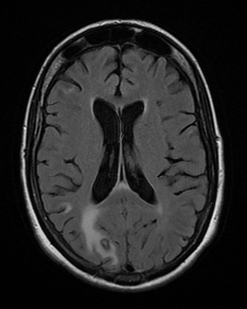

# INFECÇÕES OPORTUNISTAS NO HIV

Para entender as infecções oportunistas (IO) no HIV, você precisa visualizar o sistema imunológico como um exército que vai perdendo seus generais, os linfócitos T CD4+. À medida que a contagem dessas células cai, as "barreiras" de defesa cedem, permitindo que patógenos que normalmente seriam controlados causem doenças graves.

O segredo para acertar qualquer questão de prova sobre esse tema é correlacionar a contagem de CD4 com a probabilidade de cada infecção. As bancas não jogam infecções aleatórias, elas seguem a lógica da imunodepressão.

*Figura 1 - Curso temporal da infecção pelo HIV: relação entre carga viral (linha vermelha) e contagem de linfócitos CD4+ (linha azul). Fonte: Sigve, CC0 | Wikimedia Commons*

## O Marco da Imunodeficiência: Quando a Infecção se torna AIDS

A infecção pelo HIV e a AIDS não são sinônimos. Um paciente pode viver décadas com HIV sem nunca ter AIDS. De acordo com o Ministério da Saúde, definimos AIDS quando o indivíduo apresenta uma contagem de CD4 inferior a 200 células/mm³ ou quando apresenta uma doença definidora de AIDS, independentemente do CD4.

Aqui está um ponto que o Dr. Will sempre reforça: algumas doenças definidoras de AIDS, como a Tuberculose pulmonar, podem ocorrer mesmo com CD4 alto. No entanto, a maioria das IOs clássicas, como a Neurotoxoplasmose e a Pneumocistose, surgem quando a barreira das 200 células é rompida.

**Tabela 1: Correlação CD4 e Principais Infecções Oportunistas**

| Contagem de CD4 (células/mm³) | Infecções Oportunistas Mais Comuns |
| --- | --- |
| Qualquer valor | Tuberculose pulmonar, Herpes Zoster, Candidíase oral |
| < 200 | Pneumocistose (PJP), Candidíase esofágica |
| < 100 | Neurotoxoplasmose, Criptococose, Escabiose crostosa |
| < 50 | Citomegalovírus (CMV), Complexo Mycobacterium avium (MAC) |

## Pneumocistose (PJP): O Vilão do Pulmão

A pneumonia pelo fungo *Pneumocystis jirovecii* (antigo *P. carinii*) é a infecção oportunista respiratória mais comum na AIDS.

### Por que o quadro clínico é "dissociado"?

Diferente de uma pneumonia bacteriana típica, onde o paciente tem muita secreção e estertores localizados, na PJP o quadro é subagudo. O paciente apresenta tosse seca, febre baixa e dispneia progressiva que se arrasta por semanas.

O erro clássico de prova é esperar uma ausculta pulmonar rica. Na PJP, a ausculta costuma ser normal ou apresentar apenas discretos estertores. É a famosa "dissociação clínico-radiológica": o paciente está muito hipoxêmico, mas o pulmão parece "limpo" no estetoscópio.

*Figura 2 - Radiografia de tórax demonstrando infiltrado pneumônico bilateral, padrão frequente nas infecções oportunistas pulmonares em pacientes com HIV/AIDS. Fonte: Mikael Häggström, CC0 | Wikimedia Commons*

## Diagnóstico e Achados Radiológicos

O padrão-ouro radiológico é o infiltrado intersticial bilateral e difuso, com aspecto de "vidro fosco", geralmente perihilar. Se a questão mencionar um pneumotórax espontâneo em um paciente com AIDS e tratamento irregular, pense imediatamente em PJP. O fungo causa a formação de pneumatoceles que podem romper.

Laboratorialmente, o aumento da enzima Lactato Desidrogenase (DHL) é um marcador de sensibilidade alta, mas baixa especificidade. Se o DHL estiver normal, dificilmente é PJP.

### Tratamento e o Papel do Corticoide

A droga de escolha é o Sulfametoxazol-Trimetoprima (SMX-TMP) em doses altas (15 a 20 mg/kg/dia do componente trimetoprima), por 21 dias.

Por que usamos corticoide (Prednisona) em casos moderados a graves? Quando começamos o tratamento, a lise dos fungos libera uma carga antigênica enorme, gerando uma resposta inflamatória que piora a troca gasosa. O corticoide previne essa piora.
**Critérios para Corticoide:** PaO2 < 70 mmHg ou Gradiente Alvéolo-Arterial de O2 ≥ 35 mmHg em ar ambiente.

## Neurotoxoplasmose: A Lesão Expansiva

A neurotoxoplasmose é a causa mais comum de lesão focal do Sistema Nervoso Central (SNC) em pacientes com AIDS, geralmente ocorrendo com CD4 < 100.

### Fisiopatologia e Quadro Clínico

Não se trata de uma infecção nova, mas da reativação de cistos latentes de *Toxoplasma gondii*. O paciente apresenta cefaleia, febre e, crucialmente, sinais de localização (hemiparesia, paralisia facial central) ou convulsões.

*Figura 3 - Ressonância magnética axial FLAIR mostrando lesão cerebral em paciente com neurotoxoplasmose associada ao HIV. Fonte: CC BY-SA 3.0 | Wikimedia Commons*

## Diagnóstico Diferencial: Toxo vs. Linfoma

Esta é a pegadinha favorita das bancas. Ambos causam lesões que realçam após contraste.

- **Neurotoxoplasmose:** Lesões múltiplas, preferencialmente nos gânglios da base, com edema perilesional e realce anelar (em anel).

- **Linfoma Primário do SNC:** Geralmente lesão única, maior que 4 cm, com realce mais difuso ou periventricular.

Na prática, se o paciente tem CD4 baixo e lesões sugestivas, iniciamos o tratamento empírico para toxoplasmose. Se não houver melhora clínica em 7 a 14 dias, aí sim partimos para a biópsia cerebral ou pesquisa de DNA do vírus EBV no líquor para investigar Linfoma.

### Tratamento

O esquema padrão é Sulfadiazina + Pirimetamina + Ácido Folínico. O ácido folínico é obrigatório para evitar a toxicidade medular da pirimetamina. Em pacientes alérgicos a sulfa, uma alternativa comum é a Clindamicina associada à Pirimetamina.

## Tuberculose e HIV: A Dupla Dinâmica

A Tuberculose (TB) é a principal causa de morte em pessoas vivendo com HIV (PVHIV) no Brasil. A relação é bidirecional: o HIV aumenta o risco de TB, e a TB acelera a progressão do HIV.

## Diagnóstico de ILTB (Infecção Latente)

Todo paciente HIV positivo deve ser rastreado para TB latente.

- Se PPD ≥ 5 mm ou IGRA positivo, e descartada TB ativa (clínica e RX de tórax negativos), tratamos a ILTB.

- O tratamento de escolha atual é Isoniazida (300 mg/dia) por 6 ou 9 meses, ou o esquema curto de Rifapentina + Isoniazida por 3 meses.

### O Dilema do Início da TARV

Quando o paciente tem as duas infecções, o que tratar primeiro? Sempre a TB. O tratamento da TB (esquema RHZE) deve começar imediatamente. O início da Terapia Antirretroviral (TARV) deve ser postergado para evitar a Síndrome de Reconstituição Imune (SIRI).

**Tabela 2: Timing para Início da TARV na Coinfecção TB-HIV**

| Contagem de CD4 | Início da TARV após começar o tratamento da TB |
| --- | --- |
| < 50 células/mm³ | Em até 2 semanas |
| 50 - 200 células/mm³ | Entre 2 e 8 semanas |
| > 200 células/mm³ | Após 8 semanas (geralmente no início da fase de manutenção) |

Cuidado: Na Meningite Tuberculosa, a TARV deve ser adiada por pelo menos 4 a 8 semanas, independentemente do CD4, devido ao risco de edema cerebral fatal pela SIRI.

## Criptococose: A Meningite Subaguda

O *Cryptococcus neoformans* é um fungo encapsulado que causa uma meningite de início insidioso. No MedEvo, sempre lembramos que a principal característica da neurocriptococose é a Hipertensão Intracraniana (HIC).

### Quadro Clínico e Líquor

O paciente queixa-se de cefaleia persistente, náuseas e pode ter alterações visuais. A rigidez de nuca pode estar ausente em até 30% dos casos.
No líquor (LCR):

- Pressão de abertura aumentada (frequentemente > 25 cmH2O).

- Pleocitose linfomonocitária.

- Hipoglicorraquia e hiperproteinorraquia.

- Teste da Tinta da China (Nanquim) positivo ou detecção do antígeno criptocócico (CrAg).

### Manejo da Pressão Intracraniana

Este é um ponto onde muitos alunos erram. Se a pressão de abertura estiver alta, o tratamento é a punção lombar de alívio seriada. Não se usa corticoide ou acetazolamida para controlar a pressão na criptococose. A punção lombar não é contraindicada, ela é salvadora de vidas aqui.

### Tratamento Farmacológico

- **Indução:** Anfotericina B (preferencialmente lipossomal) + Flucitosina (se disponível) por 2 semanas.

- **Consolidação:** Fluconazol 800 mg/dia por 8 semanas.

- **Manutenção:** Fluconazol 200 mg/dia até CD4 > 100 por pelo menos 6 meses.

Importante: Assim como na TB, a TARV deve ser adiada por 2 a 10 semanas para evitar a SIRI no SNC.

## Citomegalovírus (CMV) e Complexo Mycobacterium avium (MAC)

Essas infecções ocorrem em estágios de imunodepressão muito profunda (CD4 < 50).

### CMV: Retinite e Esofagite

A retinite por CMV é a causa mais comum de cegueira em pacientes com AIDS. O exame de fundo de olho mostra exsudatos amarelados e hemorragias ("aspecto de pizza de queijo com ketchup").
Na esofagite por CMV, a endoscopia revela úlceras profundas e lineares. Isso diferencia da candidíase (placas esbranquiçadas) e do herpes (úlceras pequenas e vesículas). O tratamento é feito com Ganciclovir ou Valganciclovir.

### MAC: Doença Disseminada

O MAC causa febre persistente, perda ponderal, anemia importante e linfonodomegalias em pacientes com CD4 baixíssimo. O diagnóstico é feito por cultura de sangue (mielocultura ou hemocultura para micobactérias). O tratamento envolve Claritromicina associada ao Etambutol.

## Outras Manifestações Importantes

### Leucoencefalopatia Multifocal Progressiva (LEMP)

Causada pelo vírus JC. Diferente da toxoplasmose, a LEMP não causa efeito de massa nem realce por contraste. Na RNM, vemos lesões multifocais na substância branca (hipossinal em T1 e hipersinal em T2/FLAIR). O tratamento é apenas a restauração da imunidade com a TARV.

### Estrongiloidíase Disseminada

Em pacientes imunocomprometidos, o ciclo de autoinfecção do *Strongyloides stercoralis* pode sair do controle, levando à síndrome de hiperinfecção. As larvas podem carregar bactérias gram-negativas do intestino para a corrente sanguínea, causando sepse e meningite bacteriana recorrente.

### Candidíase

A candidíase oral é um marcador precoce de queda de imunidade. Já a candidíase esofágica é doença definidora de AIDS. Se um paciente com HIV apresenta disfagia ou odinofagia, a conduta inicial é o tratamento empírico com Fluconazol oral. A endoscopia só é feita se não houver resposta ao tratamento.

## Profilaxias: Onde a Prova Ganha Corpo

A profilaxia é dividida em primária (evitar a primeira infecção) e secundária (evitar a recidiva após o tratamento).

**Tabela 3: Profilaxia Primária no HIV**

| Patógeno | Indicação (CD4) | Droga de Escolha | Quando Suspender |
| --- | --- | --- | --- |
| *P. jirovecii* | < 200 ou Candidíase oral | SMX-TMP (800/160) | CD4 > 200 por > 3 meses |
| *T. gondii* | < 100 e IgG positivo | SMX-TMP (800/160) | CD4 > 200 por > 3 meses |
| *M. avium* | < 50 | Azitromicina 1.200mg (semanal) | Atualmente pouco indicada se TARV imediata |
| *M. tuberculosis* | PPD ≥ 5 mm ou contato | Isoniazida 5mg/kg/dia | Após completar o esquema |

Lembre-se: O SMX-TMP usado para Pneumocistose também cobre a Toxoplasmose. Se o paciente já usa para um, está protegido para o outro.

Não se recomenda profilaxia primária para Herpes simples, Citomegalovírus, Cryptococcus sp. / Histoplasma capsulatum.

## Síndrome de Reconstituição Imune (SIRI)

A SIRI ocorre quando iniciamos a TARV e o sistema imune, ao se recuperar, "percebe" uma infecção oportunista que já estava lá (ou que estava sendo tratada) e gera uma resposta inflamatória exacerbada.

O paciente apresenta uma piora clínica paradoxal após iniciar a TARV (melhora do CD4 e queda da carga viral, mas piora dos sintomas).
**Conduta:** Não se suspende a TARV. Mantemos o tratamento da infecção oportunista e, se a inflamação for grave, associamos corticosteroides.

*Figura 2 - Radiografia de tórax demonstrando infiltrado pneumônico bilateral, padrão frequente nas infecções oportunistas pulmonares em pacientes com HIV/AIDS. Fonte: Mikael Häggström, CC0 | Wikimedia Commons*

## Diagnóstico Diferencial de Lesões Neurológicas

Imagine um paciente HIV positivo com CD4 de 45 que chega com uma crise epiléptica. Você solicita uma TC de crânio.

- **Lesão com realce anelar + edema + gânglios da base:** Neurotoxoplasmose.

- **Lesão única > 4 cm + realce periventricular:** Linfoma Primário do SNC.

- **Lesão na substância branca + sem efeito de massa + sem realce:** LEMP.

- **Cefaleia intensa + TC normal + febre:** Meningite Criptocócica ou Tuberculosa.

Essa diferenciação é o que separa quem passa em residência de quem apenas "estuda". A clínica e a imagem devem andar juntas.

## Pontos-Chave para Prova

- **Pneumocistose (PJP):** Infiltrado intersticial, DHL elevado, ausculta normal. Tratamento: SMX-TMP por 21 dias. Corticoide se PaO2 < 70.

- **Neurotoxoplasmose:** Causa mais comum de lesão focal. Realce em anel nos gânglios da base. Tratamento empírico antes da biópsia.

- **Criptococose:** Principal complicação é a hipertensão intracraniana. Tratamento da HIC é punção lombar de alívio, nunca corticoide.

- **Tuberculose:** Principal IO no Brasil. Tratar TB primeiro, depois TARV (2 a 8 semanas).

- **ILTB no HIV:** Tratar se PPD ≥ 5 mm ou contato com bacilífero, após excluir doença ativa.

- **Candidíase Esofágica:** Diagnóstico clínico inicial. Tratamento empírico com Fluconazol.

- **CMV:** Ocorre com CD4 < 50. Causa retinite (risco de cegueira) e úlceras esofágicas lineares.

- **Profilaxia Primária:** SMX-TMP é a droga rainha (PJP e Toxo). Iniciar se CD4 < 200.

- **SIRI:** Piora paradoxal após início da TARV. Não suspender a TARV; tratar a inflamação.

- **Pneumotórax em AIDS:** Suspeitar fortemente de PJP.

- **Meningite Bacteriana Recorrente:** Investigar Estrongiloidíase disseminada (hiperinfecção).

- **Contraindicação Absoluta:** Não adiar o tratamento de infecções oportunistas graves para iniciar a TARV; a prioridade é estabilizar a IO primeiro.

- **Linfoma Primário do SNC:** Associado ao vírus Epstein-Barr (EBV).

- **Sarcoma de Kaposi:** Lesões cutâneas violáceas, também pode acometer pulmão e TGI. É doença definidora de AIDS.

- **Carcinoma de Colo Uterino Invasivo:** É considerado doença definidora de AIDS em mulheres HIV+. 🧠

 Cópia offline para consulta pessoal.
 Fonte original:
 [https://www.medevo.com.br/material-apoio/ler/50621c79-1309-4b18-8ae3-2c3e072a8368](https://www.medevo.com.br/material-apoio/ler/50621c79-1309-4b18-8ae3-2c3e072a8368)
