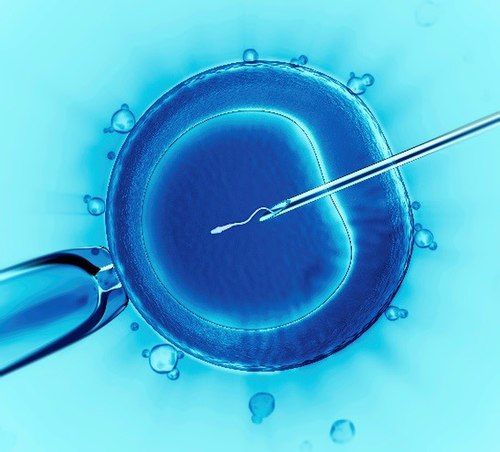

# INFERTILIDADE E ENDOMETRIOSE

A endometriose é, sem dúvida, um dos temas mais frequentes e desafiadores nas provas de residência médica e na prática ginecológica. Para entender a relação entre endometriose e infertilidade, você precisa abandonar a ideia de que a doença é apenas "sangue fora do lugar". Estamos falando de uma doença inflamatória sistêmica e crônica.

Nas provas, a banca não quer apenas que você saiba diagnosticar; ela quer que você decida o próximo passo: operar ou encaminhar para Fertilização in Vitro (FIV)? Como professor, vejo muitos alunos perderem questões por não entenderem que o tratamento da dor é completamente diferente do tratamento da infertilidade na paciente com endometriose.

*Figura 1 - Endometriose: implantes endometrióticos nas trompas de Falópio e endometrioma no ovário direito com aderências ao útero. Fonte: Femke, CC BY 4.0 | Wikimedia Commons*

## O Cenário Epidemiológico e a Definição

A endometriose é definida pela presença de tecido estromal e glandular endometrial fora da cavidade uterina. Estima-se que afete de 10% a 15% das mulheres em idade reprodutiva. No entanto, quando olhamos para o subgrupo de mulheres com infertilidade, essa prevalência salta para 30% a 50%.

A infertilidade, por sua vez, é a ausência de concepção após 12 meses de relações sexuais regulares sem uso de métodos contraceptivos em mulheres com menos de 35 anos. Se a paciente tiver 35 anos ou mais, esse prazo cai para 6 meses.

Aqui entra a primeira pérola clínica: se a paciente tem sintomas sugestivos de endometriose (como dismenorreia severa ou dispareunia), você não espera um ano para investigar. Segundo as diretrizes da FEBRASGO, a presença de sintomas de alerta autoriza a investigação imediata, independentemente do tempo de tentativa.

## Por que a Endometriose causa Infertilidade?

Este é o ponto onde o aluno que apenas decora se confunde. A infertilidade na endometriose não acontece por um único motivo. É um mecanismo multifatorial que depende do estágio da doença.

### Distorção Anatômica (Fator Mecânico)

Nos estágios avançados (III e IV da ASRM - American Society for Reproductive Medicine), a pelve é um cenário de guerra. Existem aderências densas que podem aprisionar o ovário, impedir a captação do óvulo pelas fimbrias ou obstruir completamente as tubas uterinas. Se o espermatozoide não encontra o óvulo, não há gravidez. É o chamado fator tuboperitoneal.

### Ambiente Peritoneal Inflamatório

Nos estágios iniciais (I e II), onde a anatomia muitas vezes está preservada, por que a paciente não engravida? O Dr. Will costuma enfatizar nas discussões do MedEvo que o líquido peritoneal dessas pacientes é "tóxico". Existe um aumento de citocinas inflamatórias (IL-1, IL-6, TNF-alfa), macrófagos e prostaglandinas. Esse ambiente hostil prejudica a motilidade espermática, a interação óvulo-espermatozoide e até a função ciliar da tuba.

### Disfunção Ovulatória e Hormonal

A endometriose causa o que chamamos de disovulia inflamatória. A inflamação crônica interfere no recrutamento folicular e na qualidade dos oócitos. Além disso, pacientes com endometriose têm maior incidência de Síndrome do Folículo Luteinizado Não Roto (LUF), onde o óvulo amadurece, mas não é liberado.

### Defeitos de Implantação

O endométrio "tópico" (dentro do útero) de uma mulher com endometriose não é igual ao de uma mulher saudável. Existe uma resistência à progesterona e uma diminuição de moléculas de adesão, como as integrinas, o que reduz a receptividade endometrial e dificulta a nidação do embrião.

## Quadro Clínico: O que buscar na Anamnese e Exame Físico

A suspeita clínica é o ponto de partida. O quadro clássico envolve os "Ds":

- **Dismenorreia secundária e progressiva:** A dor que piora com o passar dos anos.

- **Dispareunia de profundidade:** Dor durante o coito, sugerindo acometimento de ligamentos uterossacros ou fundo de saco de Douglas.

- **Disquezia e Disúria cíclicas:** Sintomas intestinais ou urinários que pioram no período menstrual.

- **Dor pélvica crônica:** Dor não cíclica por mais de 6 meses.

No exame físico, procure por retroversão uterina fixa (sinal de aderências posteriores), dor à mobilização do colo uterino e, principalmente, o espessamento ou nódulos dolorosos nos ligamentos uterossacros e fundo de saco. A presença de uma massa anexial fixa sugere um endometrioma.

**Dica de Prova:** Se a questão descreve uma paciente com infertilidade e "nódulo retrocervical doloroso ao toque vaginal", a banca está gritando "Endometriose Profunda". O próximo passo é o estadiamento por imagem.

## O Arsenal Diagnóstico

O diagnóstico evoluiu muito. Antigamente, dizia-se que a laparoscopia era obrigatória para o diagnóstico. Hoje, a propedêutica de imagem bem feita é extremamente acurada.

### Marcadores Bioquímicos (CA-125)

O CA-125 pode estar aumentado na endometriose, especialmente nos estágios III e IV. No entanto, ele é inespecífico (aumenta em miomas, DIP, câncer de ovário, gravidez).

- **Utilidade real:** Não serve para diagnóstico isolado, mas tem valor no acompanhamento pós-operatório para detectar recidivas. Nas provas, se o CA-125 vier alto em uma paciente com dor pélvica, ele reforça a suspeita, mas não confirma nada.

### Ultrassonografia Transvaginal com Preparo Intestinal

É o exame de primeira linha para mapeamento de endometriose profunda e endometriomas. O preparo intestinal é fundamental para afastar as alças de cólon e permitir a visualização de focos no reto e sigmoide.

- **Endometrioma ao USG:** Imagem cística, com conteúdo hipoecoico, aspecto de "vidro fosco" (ground-glass), geralmente sem vascularização interna ao Doppler.

### Ressonância Magnética (RM) de Pelve

Excelente para avaliar lesões profundas, especialmente acima do fundo de saco vaginal e no compartimento posterior. É muito útil quando o USG é inconclusivo ou para planejamento cirúrgico complexo.

### Laparoscopia: O Padrão-Ouro

A videolaparoscopia com biópsia e exame anatomopatológico continua sendo o padrão-ouro para o diagnóstico definitivo. A grande vantagem é ser diagnóstica e terapêutica ao mesmo tempo.

- **Cuidado:** Em casos de infertilidade sem dor, a indicação de laparoscopia deve ser criteriosa para não reduzir a reserva ovariana da paciente desnecessariamente.

| Exame | Vantagem | Limitação |
| --- | --- | --- |
| CA-125 | Baixo custo, fácil acesso | Baixa sensibilidade e especificidade |
| USG com Preparo | Ótimo para endometrioma e reto | Dependente do examinador |
| RM de Pelve | Excelente para lesões profundas e ureter | Custo elevado |
| Laparoscopia | Diagnóstico definitivo e tratamento | Invasivo, risco cirúrgico |

## Classificação de Acosta e ASRM

Embora existam várias classificações, a da ASRM é a mais utilizada para infertilidade. Ela divide a doença em estágios I (mínima), II (leve), III (moderada) e IV (grave), baseando-se na localização, profundidade das lesões e presença de aderências.

**Erro comum de prova:** Achar que o estágio da doença se correlaciona com a intensidade da dor. Isso é falso! Uma paciente com estágio I (focos peritoneais finos) pode ter dor excruciante, enquanto uma paciente com estágio IV (aderências densas e endometriomas) pode ser assintomática e descobrir a doença apenas na investigação de infertilidade. No entanto, o estágio se correlaciona bem com a dificuldade de engravidar.

## Estratégias de Tratamento: O Grande Dilema

Aqui é onde se separam os aprovados dos reprovados. O tratamento da endometriose depende do objetivo da paciente.

### 1. Tratamento Clínico (Hormonal)

Usamos anticoncepcionais combinados, progestágenos isolados (como o Dienogeste), análogos de GnRH ou DIU de Levonorgestrel.

- **Regra de Ouro:** O tratamento clínico melhora a dor, mas **NÃO melhora a fertilidade**.

- **Por que?** Porque esses medicamentos agem bloqueando a ovulação ou criando um ambiente atrófico. Se a paciente quer engravidar, você não pode prescrever um método que impede a gravidez. Se a questão de prova pergunta a conduta para infertilidade em paciente com endometriose, nunca marque "tratamento clínico isolado".

### 2. Tratamento Cirúrgico

A cirurgia visa restaurar a anatomia, destruir os focos inflamatórios e remover endometriomas.

- **Endometriose Leve (I/II):** A ablação ou exérese dos focos peritoneais e a lise de aderências aumentam as taxas de gravidez espontânea.

- **Endometrioma Ovariano:** A conduta atual é a cistectomia (retirada da cápsula do cisto). A simples drenagem ou cauterização tem altas taxas de recorrência.

- **Atenção:** Se o endometrioma for > 3-4 cm, a cirurgia é indicada. Porém, se a paciente já tem baixa reserva ovariana (AMH baixo), a cirurgia pode ser o "golpe de misericórdia" nos seus óvulos. Nesses casos, o Dr. Will recomenda considerar a FIV antes da cirurgia.

### 3. Reprodução Assistida

A Reprodução Assistida (RA) é frequentemente o caminho final.

- **Inseminação Intrauterina (IIU):** Pode ser tentada em casos de endometriose leve (estágio I ou II), com tubas pérvias e parceiro com espermograma normal. Sempre associada à indução da ovulação.

- **Fertilização in Vitro (FIV):** É a conduta de escolha para estágios III e IV, fator tubário associado, idade materna avançada (> 35 anos) ou falha nos tratamentos conservadores.

## Fluxograma de Decisão na Infertilidade

Imagine o seguinte cenário clínico: Paciente, 33 anos, infertilidade primária há 18 meses, dismenorreia moderada. USG mostra focos sugestivos de endometriose peritoneal, mas tubas pérvias na histerossalpingografia.

**Qual a conduta?**
Neste caso, como ela é jovem e tem tubas pérvias, a laparoscopia para tratamento dos focos é uma excelente opção. Após a cirurgia, ela tem uma "janela de oportunidade" de cerca de 6 a 12 meses para engravidar naturalmente. Se não conseguir, partimos para RA.

Agora, mude o cenário: Paciente, 38 anos, infertilidade, endometriose profunda com acometimento retal e endometrioma de 4 cm bilateral.
**Qual a conduta?**
Aqui, o tempo é contra nós. A cirurgia de endometriose profunda é complexa e a reserva ovariana aos 38 anos já é reduzida. A conduta mais eficaz para atingir a gestação é a FIV. A cirurgia ficaria reservada para casos de dor intratável ou obstruções funcionais (ureter/intestino).

| Perfil da Paciente | Conduta Inicial Preferencial |
| --- | --- |
| Jovem (< 35 anos), estágios I/II, tubas pérvias | Laparoscopia + Tentativa Natural (6-12 meses) |
| Jovem, estágios I/II, falha pós-cirurgia | Inseminação Intrauterina (IIU) |
| Idade > 35 anos ou Fator Tubário | Fertilização in Vitro (FIV) |
| Endometriose Estágios III/IV | FIV (considerar cirurgia se houver dor severa) |
| Endometrioma > 4cm em jovem | Cistectomia Laparoscópica |

## Situações Especiais e Pegadinhas

### O Papel dos Análogos de GnRH

Os análogos de GnRH (como a Leuprolida) causam um estado de hipoestrogenismo severo ("menopausa temporária"). Eles são excelentes para reduzir a dor e o tamanho de lesões antes de uma cirurgia complexa. Na infertilidade, o uso de análogos por 3 a 6 meses ANTES da FIV pode melhorar as taxas de implantação em pacientes com endometriose extensa.

### Hidrossalpinge e Endometriose

Muitas vezes, a endometriose causa obstrução distal da tuba, levando à hidrossalpinge (tuba cheia de líquido). Esse líquido é embriotóxico. Se a paciente for para FIV, a diretriz é clara: deve-se realizar a salpingectomia (ou oclusão tubária proximal) antes da transferência de embriões para aumentar as chances de sucesso.

### Reserva Ovariana

Sempre que falar em cirurgia de ovário, pense em Hormônio Anti-Mülleriano (AMH). Ele é o melhor marcador de reserva ovariana atual. Se o AMH estiver baixo (< 1.1 ng/mL), evite mexer no ovário se o objetivo for apenas fertilidade.

*Figura 2 - Injeção intracitoplasmática de espermatozoide (ICSI), técnica de reprodução assistida frequentemente indicada na infertilidade associada à endometriose. Fonte: CDC/US Government, Domínio Público | Wikimedia Commons*

## Diagnóstico Diferencial: Não confunda!

Nem toda dor pélvica com infertilidade é endometriose.

- **Adenomiose:** É a "endometriose dentro do miométrio". Causa útero aumentado e globalmente doloroso. Frequentemente coexiste com a endometriose.

- **Doença Inflamatória Pélvica (DIP) Crônica:** História de infecção prévia, febre, corrimento. As aderências da DIP são diferentes das da endometriose.

- **Miomatose Uterina:** Especialmente os miomas submucosos (que afetam a implantação) ou intramurais grandes.

- **Síndrome de Congestão Pélvica:** Varizes pélvicas que causam dor que piora ao final do dia e após o coito.

## Manejo do Endometrioma Ovariano

O tratamento do endometrioma é um dos temas mais debatidos. A exérese da cápsula (cistectomia) é superior à aspiração ou ablação, pois reduz a taxa de recorrência e aumenta a taxa de gravidez espontânea.

No entanto, a cirurgia remove tecido ovariano sadio junto com a cápsula. Por isso, a tendência moderna é a individualização:

- **Operar se:** Dor pélvica importante, crescimento rápido do cisto, suspeita de malignidade (raro, mas possível em cistos complexos) ou cistos muito grandes que dificultam a punção folicular na FIV.

- **Não operar (ir direto para FIV) se:** Paciente assintomática, baixa reserva ovariana prévia, ou cirurgias ovarianas anteriores (risco de falência ovariana precoce).

## Pontos-Chave para Prova

- **Definição de Infertilidade:** 1 ano se < 35 anos; 6 meses se ≥ 35 anos. Na suspeita de endometriose, a investigação pode ser antecipada.

- **Tratamento Clínico:** Melhora a dor (dismenorreia, dispareunia), mas **NÃO** trata a infertilidade. Não perca essa questão!

- **Padrão-Ouro Diagnóstico:** Laparoscopia com biópsia e histopatológico.

- **Imagem de Escolha:** USG transvaginal com preparo intestinal ou RM de pelve (para mapeamento de doença profunda).

- **Endometrioma:** O tratamento de escolha é a cistectomia laparoscópica (exérese da cápsula). Evite ooforectomia em quem deseja gestar.

- **Estágios I e II (Leve):** A cirurgia laparoscópica (ablação de focos) aumenta a taxa de gravidez espontânea.

- **Estágios III e IV (Grave):** A FIV é a conduta com melhores taxas de sucesso para gestação.

- **Fator Tubário:** Se houver hidrossalpinge associada, deve-se realizar salpingectomia antes da FIV.

- **CA-125:** Marcador inespecífico. Útil para seguimento, não para diagnóstico isolado.

- **Reserva Ovariana:** Avaliada pelo AMH ou contagem de folículos antrais. Fundamental antes de decidir por cirurgia ovariana.

- **Dica de Ouro:** Se a paciente tem > 35 anos e endometriose, o tempo é o fator mais precioso. Não perca meses com tratamentos de baixa eficácia; considere a FIV precocemente.

- **Pegadinha de Prova:** A alternativa dirá que a conduta inicial para infertilidade na endometriose leve é o uso de análogos de GnRH. **Falso.** O análogo impede a gravidez durante o uso.

- **Contraindicação Absoluta:** Não se faz cirurgia extensa de endometriose profunda em paciente assintomática apenas por causa da infertilidade, se a FIV for uma opção viável e mais segura.

- **Mecanismo:** A infertilidade na endometriose leve é principalmente por ambiente peritoneal inflamatório; na grave, é por distorção anatômica. 🩺

 Cópia offline para consulta pessoal.
 Fonte original:
 [https://www.medevo.com.br/material-apoio/ler/5a04b797-32e8-4350-9b1d-e36a33340823](https://www.medevo.com.br/material-apoio/ler/5a04b797-32e8-4350-9b1d-e36a33340823)
