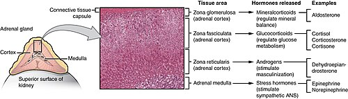
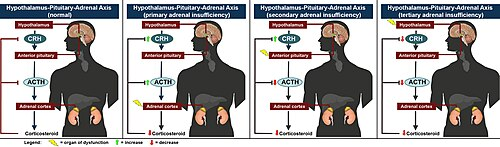

# INSUFICIÊNCIA ADRENAL AGUDA E CRISE ADDISONIANA

Para entender a insuficiência adrenal (IA), você precisa visualizar a glândula suprarrenal como uma fábrica de hormônios vitais dividida em setores. O córtex adrenal produz três classes principais: glicocorticoides (cortisol), mineralocorticoides (aldosterona) e andrógenos (DHEA). Quando essa fábrica para de funcionar subitamente ou não consegue suprir uma demanda aumentada, temos a Crise Adrenal, uma emergência médica que mata se você não souber diagnosticar rápido.

*Figura 1 - Glândulas suprarrenais sobre os rins, mostrando córtex (zonas glomerulosa, fasciculada e reticular) e medula adrenal. Fonte: OpenStax College, CC BY 3.0 | Wikimedia Commons*

## Fisiopatologia: O Eixo Hipotálamo-Hipófise-Adrenal (HHA)

O controle da produção de cortisol segue uma hierarquia rígida. O hipotálamo libera CRH, que estimula a hipófise a secretar ACTH (hormônio adrenocorticotrófico). O ACTH, por sua vez, viaja pelo sangue até o córtex adrenal para estimular a produção de cortisol.

O cortisol exerce um feedback negativo: quando seus níveis estão altos, ele avisa o hipotálamo e a hipófise para "pisarem no freio". É aqui que mora o perigo da corticoterapia exógena. Quando um paciente usa prednisona por muito tempo, o eixo entende que já tem cortisol de sobra e para de produzir CRH e ACTH. A glândula adrenal, sem o estímulo do ACTH, atrofia. Se você suspende o remédio abruptamente, a glândula atrofiada não consegue retomar a produção imediata, levando à insuficiência adrenal secundária.

### A Diferença Fundamental: Primária vs. Secundária

Este é o conceito que mais cai em provas de residência. Você precisa saber distinguir onde está o defeito para prever os distúrbios eletrolíticos.

- **Insuficiência Adrenal Primária (Doença de Addison):** O problema é na própria glândula (a fábrica foi destruída). Como a glândula não funciona, faltam **cortisol E aldosterona**. O ACTH sobe absurdamente tentando estimular uma glândula morta.

- **Insuficiência Adrenal Secundária/Terciária:** O problema é "acima" (hipófise ou hipotálamo). Falta ACTH, logo falta **cortisol**. No entanto, a **aldosterona costuma estar preservada**. Por quê? Porque a secreção de aldosterona é controlada principalmente pelo sistema Renina-Angiotensina-Aldosterona (RAA) e pelos níveis de potássio, e não depende tanto do ACTH.

**Tabela 1: Comparativo Fisiopatológico e Laboratorial**

| Característica | IA Primária (Addison) | IA Secundária (Ex: Suspensão de Corticoide) |
| --- | --- | --- |
| **Local da Lesão** | Glândula Adrenal | Hipófise / Hipotálamo |
| **Cortisol** | Baixo | Baixo |
| **Aldosterona** | Baixa | **Preservada** |
| **ACTH** | **Muito Elevado** | Baixo ou Inapropriadamente Normal |
| **Potássio** | **Hipercalemia** | Normal |
| **Sódio** | Hiponatremia | Hiponatremia (por outros mecanismos) |
| **Pigmentação** | **Hiperpigmentação** | Palidez / Sem hiperpigmentação |

## Etiologia: Por que a glândula falha?

No Brasil, você deve ter dois grandes grupos de causas na cabeça para a prova.

### Insuficiência Adrenal Primária

A causa mais comum no mundo desenvolvido é a **Adrenalite Autoimune** (isolada ou como parte de síndromes poliglandulares). No entanto, em provas brasileiras, a **Tuberculose Adrenal** ainda é cobrada com frequência. Outras causas importantes incluem:

- **Infecciosas:** Paracoccidioidomicose (fique atento à "estomatite moriforme" e infiltrado pulmonar em asa de borboleta no enunciado), HIV, CMV.

- **Hemorragia Adrenal Bilateral:** Síndrome de Waterhouse-Friderichsen (associada à meningococcemia e CIVD).

- **Drogas:** Cetoconazol, etomidato (inibem a síntese de cortisol).

### Insuficiência Adrenal Secundária

A causa disparada mais comum é a **supressão do eixo HHA por uso crônico de corticoide exógeno** seguida de suspensão abrupta ou estresse agudo sem ajuste de dose. Lembre-se: qualquer paciente que usou o equivalente a ≥ 5mg de prednisona por mais de 3 semanas nos últimos 12 meses deve ser considerado como tendo o eixo potencialmente suprimido.

## O Quadro Clínico da Crise Adrenal (Aguda)

A Crise Adrenal (ou Crise Addisoniana) é o colapso agudo. Como o Dr. Will costuma destacar em suas revisões no MedEvo, o cenário clássico de prova é o paciente com diagnóstico prévio de Addison ou usuário crônico de corticoide que sofre um "gatilho" (infecção, cirurgia, trauma, infarto).

Os sinais cardinais são:

- **Choque Refratário:** Hipotensão que não responde adequadamente a volume e requer vasopressores, mas que "milagrosamente" melhora após o corticoide.

- **Sintomas Gastrointestinais:** Náuseas, vômitos intensos e dor abdominal aguda (pode mimetizar um abdome agudo cirúrgico).

- **Alteração do Nível de Consciência:** Letargia, confusão ou coma.

- **Febre:** Mesmo na ausência de infecção, a deficiência de cortisol pode causar febre.

### O Estigma da Hiperpigmentação

Por que o paciente com Addison fica "bronzeado"? O precursor do ACTH é uma molécula chamada POMC (Pro-opiomelanocortina). Quando a hipófise produz muito ACTH (na IA primária), ela também produz subprodutos como o MSH (hormônio estimulante de melanócitos). Isso causa hiperpigmentação em áreas de dobra, cicatrizes, mucosa gengival e áreas expostas ao sol.
**Dica de prova:** Se o paciente tem hiperpigmentação, a causa é obrigatoriamente **Primária**. Na secundária, o ACTH está baixo, então o paciente costuma ser pálido.

*Figura 2 - Eixo hipotálamo-hipófise-adrenal (HHA): representação nos estados normal, insuficiência primária, secundária e terciária. Fonte: Oddcomb, CC BY-SA 4.0 | Wikimedia Commons*

## Diagnóstico Laboratorial e Distúrbios Eletrolíticos

Você não pode esperar o resultado do cortisol para tratar uma crise adrenal suspeita, mas precisa saber interpretar os exames para a fase diagnóstica.

### Alterações Clássicas (O "Quarteto Fantástico" da IA)

- **Hiponatremia:** Presente em 90% dos casos. Na IA primária, ocorre por perda urinária de sódio (falta de aldosterona). Na secundária, ocorre porque a falta de cortisol estimula a liberação de ADH (vasopressina), causando retenção de água livre (hiponatremia dilucional).

- **Hipercalemia:** Exclusiva da IA Primária (falta de aldosterona para excretar potássio).

- **Hipoglicemia:** O cortisol é um hormônio contrarregulador da insulina. Sem ele, a gliconeogênese cai. É muito comum em crianças e na IA secundária.

- **Eosinofilia e Linfocitose:** O cortisol normalmente causa "destruição" de eosinófilos e linfócitos. Sem ele, essas células sobem no hemograma.

### Testes Confirmatórios

- **Cortisol Basal (8h da manhã):**

- < 3 µg/dL: Confirma insuficiência adrenal.

-

> 18 µg/dL: Exclui insuficiência adrenal.

- Zona cinzenta (3 a 18 µg/dL): Requer teste de estímulo.

- **Teste de Estímulo com ACTH Sintético (Cosintropina):** Injeta-se 250 µg de ACTH e mede-se o cortisol após 30 e 60 minutos. Se o cortisol não subir acima de 18-20 µg/dL, o diagnóstico de IA está confirmado.

**Cuidado:** Em um paciente crítico, em choque, um cortisol "normal" (ex: 10 µg/dL) é, na verdade, uma insuficiência adrenal relativa, pois em situações de estresse extremo o cortisol deveria estar muito alto (> 25 µg/dL).

## Manejo da Crise Adrenal Aguda

A conduta na crise é uma das questões mais repetidas. O tratamento deve ser iniciado IMEDIATAMENTE após a suspeita clínica, antes mesmo dos resultados laboratoriais.

### 1. Ressuscitação Volêmica

O paciente está desidratado e em choque distributivo/hipovolêmico.

- **SF 0,9% IV:** Grandes volumes (1 a 3 litros nas primeiras horas).

- **Glicose:** Se houver hipoglicemia, associar Soro Glicosado.

### 2. Reposição de Glicocorticoide

- **Hidrocortisona:** É a droga de escolha. Por quê? Porque em doses altas (100mg), a hidrocortisona possui efeito mineralocorticoide cruzado suficiente. Você não precisa dar fludrocortisona na fase aguda.

- **Esquema:** 100mg IV em bolus, seguido de 50mg IV a cada 6 horas (ou 200mg em infusão contínua em 24h).

### 3. Diagnóstico Diferencial e Gatilhos

Tratar a causa base (antibióticos se infecção, etc.).

**Tabela 2: Manejo Farmacológico - Doses e Indicações**

| Medicamento | Dose na Crise (Aguda) | Dose de Manutenção (Crônica) | Observação |
| --- | --- | --- | --- |
| **Hidrocortisona** | 100mg IV bolus + 200mg/dia | 15-25mg/dia (dividido 2-3x) | Padrão-ouro na emergência. |
| **Prednisona** | Não recomendada na crise | 5mg/dia (dose única matinal) | Opção para manutenção crônica. |
| **Fludrocortisona** | Não necessária na fase aguda | 0,05 a 0,2 mg/dia VO | **Apenas na IA Primária.** |

## Manejo Perioperatório e Situações de Estresse

Muitos alunos erram ao não ajustar a dose de corticoide para pacientes que já usam a medicação cronicamente e vão operar. O corpo precisa de mais cortisol no estresse. Se você não der, ele entra em crise no pós-operatório.

- **Pequeno Estresse (Ex: Procedimento dentário):** Dobrar a dose oral no dia.

- **Moderado Estresse (Ex: Colecistectomia):** Hidrocortisona 50mg IV antes da indução + 25mg 8/8h por 24h.

- **Grande Estresse (Ex: Cirurgia cardíaca, trauma grave):** Hidrocortisona 100mg IV antes da indução + 50mg 8/8h por 48-72h.

**Erro Comum:** Achar que todo paciente que usa corticoide precisa de "dose de estresse". Se o paciente usa < 5mg de prednisona ou usa apenas corticoide inalatório/tópico em doses habituais, o eixo geralmente está preservado e não precisa de suplementação extra.

*Figura 2 - Eixo hipotálamo-hipófise-adrenal (HHA): representação nos estados normal, insuficiência primária, secundária e terciária. Fonte: Oddcomb, CC BY-SA 4.0 | Wikimedia Commons*

## Diagnóstico Diferencial de Choque e Distúrbios Eletrolíticos

A Crise Adrenal é a grande mimetizadora.

- **Sepsis:** Ambas causam febre, hipotensão e leucocitose. A dica é a refratariedade a volume e os eletrólitos (K alto/Na baixo).

- **Abdome Agudo:** A dor abdominal da crise adrenal pode ser intensa, com defesa. Sempre cheque os eletrólitos antes de mandar para o cirurgião.

- **Hiponatremia por Diuréticos:** Tiazídicos causam hiponatremia, mas geralmente com potássio baixo ou normal, ao contrário do Addison.

**Tabela 3: Diagnóstico Diferencial de Hiponatremia com Hipercalemia**

| Condição | Sódio | Potássio | Outros Achados |
| --- | --- | --- | --- |
| **Doença de Addison** | Baixo | Alto | Hiperpigmentação, Cortisol baixo |
| **Insuficiência Renal** | Variável | Alto | Creatinina/Ureia elevadas |
| **Acidose Tubular Renal IV** | Normal/Baixo | Alto | Comum em diabéticos com hiporeninemia |
| **Uso de IECA/Espironolactona** | Normal/Baixo | Alto | História medicamentosa |

## O Desmame de Corticosteroides

Como evitar a IA secundária? O desmame deve ser gradual para permitir que o eixo HHA "acorde". Não existe uma regra única universal, mas a diretriz sugere reduzir 10-20% da dose a cada 1-2 semanas. Se o paciente atingir a dose fisiológica (5mg de prednisona) e ainda houver dúvida se o eixo recuperou, pode-se solicitar um cortisol basal matinal. Se > 15 µg/dL, pode suspender com segurança.

## Casos Clínicos Rápidos para Fixação

**Cenário 1:** Paciente com Lúpus em uso de 20mg de prednisona há 6 meses. Decide parar o remédio por conta própria. Dois dias depois, chega ao PS com vômitos, dor abdominal e PA 80/40 mmHg.

- **Diagnóstico:** Crise Adrenal Secundária por suspensão de corticoide.

- **Conduta:** Hidrocortisona 100mg IV + SF 0,9%.

**Cenário 2:** Paciente com emagrecimento, hiperpigmentação de cicatriz de cesárea e avidez por sal. Exames: Na 128, K 6.2, Glicose 65.

- **Diagnóstico:** Doença de Addison (IA Primária). Provável causa autoimune ou infecciosa (TB).

- **Conduta:** Investigar etiologia (TC de adrenais, sorologias) e iniciar reposição de glicocorticoide + mineralocorticoide.

## Pontos-Chave para Prova 💡

- **Hipotensão Refratária + Hiponatremia + Hipercalemia:** É o tripé clássico da Insuficiência Adrenal Primária (Addison).

- **Hiperpigmentação:** Só ocorre na IA Primária devido ao aumento do ACTH/MSH.

- **IA Secundária (Hipofisária):** O potássio é **NORMAL**, pois a aldosterona é preservada pelo sistema RAA.

- **Causa mais comum de IA Secundária:** Suspensão abrupta de corticoterapia crônica.

- **Causa mais comum de IA Primária no Brasil:** Adrenalite autoimune (mas pense em TB/Paracoco se houver epidemiologia).

- **Tratamento de Emergência:** Hidrocortisona 100mg IV + Ressuscitação volêmica com SF 0,9%.

- **Mineralocorticoide (Fludrocortisona):** Só é necessário na reposição crônica da IA **Primária**. A hidrocortisona em dose alta já cobre o efeito mineralocorticoide na crise.

- **Diagnóstico:** Cortisol basal < 3 µg/dL confirma; > 18 µg/dL exclui. O padrão-ouro é o teste de estímulo com ACTH (Cosintropina).

- **Eosinofilia e Linfocitose:** São "dicas" de hemograma que as bancas colocam para sugerir falta de cortisol.

- **Síndrome de Waterhouse-Friderichsen:** Insuficiência adrenal aguda por hemorragia bilateral das glândulas, associada à meningococcemia.

- **Dose de Estresse:** Pacientes em uso crônico de corticoide precisam de doses maiores de hidrocortisona antes de cirurgias ou se estiverem gravemente enfermos.

- **O que NÃO fazer:** Não espere o resultado do cortisol para iniciar hidrocortisona se o paciente estiver chocado. Não use dexametasona como primeira escolha se quiser dosar cortisol depois (embora ela não interfira na dosagem, a hidrocortisona é preferível pelo efeito mineralocorticoide).

- **Hipoglicemia:** É uma manifestação importante, especialmente em crianças e em casos de insuficiência adrenal secundária/pan-hipopituitarismo.

- **Resposta Endócrina ao Trauma:** O cortisol sobe fisiologicamente no estresse. Se o paciente não sobe o cortisol no trauma, ele entra em crise adrenal.

- **Acidose Metabólica:** Pode ocorrer na crise adrenal (acidose metabólica hiperclorêmica) devido à falta de aldosterona, que normalmente secreta H+ nos túbulos renais.

 Cópia offline para consulta pessoal.
 Fonte original:
 [https://www.medevo.com.br/material-apoio/ler/97ba0fa1-aa67-4289-9c17-692bbc547624](https://www.medevo.com.br/material-apoio/ler/97ba0fa1-aa67-4289-9c17-692bbc547624)
