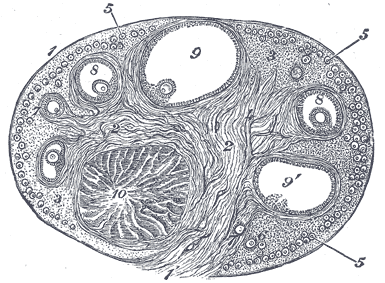
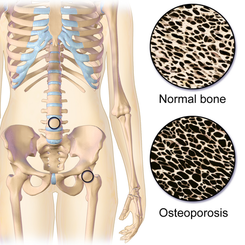

# INSUFICIÊNCIA OVARIANA PREMATURA

A Insuficiência Ovariana Prematura (IOP) é um dos temas mais instigantes e, ao mesmo tempo, mais cobrados em provas de Ginecologia Endócrina. Para entender a IOP, você não deve pensar nela como uma "menopausa que chegou cedo", mas sim como um estado de hipogonadismo hipergonadotrófico em uma mulher que ainda deveria estar no auge de sua reserva folicular.

Diferente da menopausa fisiológica, que é um evento programado e definitivo, a IOP pode ser flutuante. Cerca de 5 a 10% das mulheres com diagnóstico de IOP podem apresentar ovulações esporádicas e até engravidar espontaneamente. Guarde isso: a IOP é um diagnóstico clínico-laboratorial, não uma sentença de esterilidade absoluta imediata, embora o prognóstico reprodutivo seja muito reservado.

*Figura 1 - Secção do ovário com folículos em diferentes estágios de desenvolvimento: desde folículos primordiais até o corpo lúteo. Na IOP, há depleção precoce da reserva folicular. Fonte: Henry Vandyke Carter, Domínio Público | Wikimedia Commons*

## Definição e Critérios Diagnósticos

Para a sua prova, a definição é matemática e você não pode hesitar. Segundo a FEBRASGO e as principais diretrizes internacionais (como a ESHRE), a IOP é definida pela tríade:

- Idade: Mulher com menos de 40 anos.

- Distúrbio Menstrual: Amenorreia (primária ou secundária) ou oligomenorreia por pelo menos 4 meses.

- Evidência Laboratorial: Níveis de FSH elevados na faixa de menopausa.

Aqui mora a primeira pegadinha de prova: qual o valor de corte do FSH? A diretriz da ESHRE e a tendência atual brasileira consideram o FSH > 25 mUI/mL em duas dosagens, com intervalo de pelo menos 4 semanas entre elas. No entanto, muitas bancas ainda utilizam o valor clássico de FSH > 40 mUI/mL. Se a questão trouxer um valor acima de 25 em uma mulher jovem com amenorreia, o caminho diagnóstico é IOP.

Por que dosar duas vezes? Porque, como mencionei, a função ovariana na IOP pode ser intermitente. Uma única dosagem alta pode ser um pico isolado, mas duas dosagens confirmam que o eixo hipotálamo-hipófise está gritando (aumentando o FSH) porque o ovário não está respondendo (feedback negativo ausente por falta de estradiol e inibina B).

## Epidemiologia e Impacto

A IOP atinge cerca de 1% das mulheres antes dos 40 anos e 0,1% antes dos 30 anos. Se você encontrar uma questão sobre uma paciente de 20 anos com amenorreia e FSH alto, a chance de uma causa genética (como a Síndrome de Turner) é altíssima.

O impacto da IOP vai muito além da infertilidade. Imagine uma mulher de 30 anos que perde a proteção estrogênica que deveria ter até os 50. Ela terá 20 anos a mais de exposição ao risco cardiovascular e à reabsorção óssea acelerada. É por isso que, na MedEvo, sempre enfatizamos: o tratamento da IOP não é opcional, é profilático para doenças crônicas.

## Etiologia e Fisiopatologia: O "Porquê" do Esgotamento

Para entender as causas, divida a IOP em dois grandes mecanismos: ou a mulher nasceu com poucos folículos (depleção), ou ela os perdeu aceleradamente (destruição/atresia), ou os folículos estão lá, mas não funcionam (disfunção).

### Causas Genéticas

São as mais comuns em casos de amenorreia primária.

- Síndrome de Turner (45,X): É a causa genética mais frequente. A ausência do segundo cromossomo X leva a uma atresia folicular acelerada ainda na vida intrauterina. A paciente nasce com "gônadas em fita" (streak gonads).

- Mosaicismo (ex: 45,X/46,XX): O quadro é mais brando, podendo cursar com menarca e posterior amenorreia secundária.

- Pré-mutação do gene FMR1 (X-Frágil): Esta é uma "pérola" de prova. Mulheres com a pré-mutação (55-200 repetições CGG) têm risco aumentado de IOP. Se a questão citar uma paciente com falência ovariana e histórico familiar de deficiência intelectual em homens, marque X-Frágil sem medo.

### Causas Iatrogênicas

Cada vez mais comuns devido ao sucesso dos tratamentos oncológicos.

- Quimioterapia: Agentes alquilantes (como a ciclofosfamida) são os mais gonadotóxicos. Eles destroem os folículos primordiais diretamente.

- Radioterapia: A radiação pélvica é letal para os oócitos. A dose necessária para causar IOP diminui conforme a idade da paciente aumenta.

### Causas Autoimunes

Cerca de 10 a 15% dos casos. O sistema imune ataca as células da teca ou da granulosa.

- Frequentemente associada a outras endocrinopatias. A associação mais comum é com doenças da tireoide (Hashimoto).

- A associação mais perigosa é com a Doença de Addison (insuficiência adrenal). Por isso, em toda IOP de causa desconhecida, devemos pesquisar anticorpos anti-adrenal (anti-21-hidroxilase).

### Causas Infecciosas e Idiopáticas

A caxumba (ooforite por caxumba) é citada em livros, mas é raríssima como causa de IOP definitiva. Infelizmente, em cerca de 50 a 75% dos casos, não encontraremos uma causa específica, classificando-a como idiopática.

## Quadro Clínico: Além da Amenorreia

O sintoma cardinal é a irregularidade menstrual que evolui para amenorreia. Mas fique atento aos sinais de hipoestrogenismo, que em mulheres jovens podem ser confundidos com ansiedade ou depressão:

- Sintomas Vasomotores: Fogachos e sudorese noturna. Cuidado: em mulheres muito jovens (amenorreia primária), elas podem nunca ter tido estrogênio suficiente para "sentir falta", então podem não ter fogachos.

- Atrofia Urogenital: Secura vaginal, dispareunia (dor na relação) e urgência miccional.

- Alterações de Humor: Irritabilidade, insônia e labilidade emocional.

No exame físico, procure por estigmas de Turner (baixa estatura, pescoço alado, tórax em escudo, mamilos hipertelóricos) se for amenorreia primária. Se for secundária, o exame físico costuma ser normal, exceto pelos sinais de atrofia vaginal ao exame especular.

## O Roteiro Diagnóstico (Passo a Passo)

Quando uma paciente < 40 anos chega com amenorreia secundária, você deve seguir o fluxograma clássico. Não pule etapas, a banca adora testar se você sabe a ordem.

- Excluir Gravidez: Beta-hCG é sempre o primeiro passo.

- Dosagem de TSH e Prolactina: Para excluir hipotireoidismo e hiperprolactinemia.

- Teste da Progesterona: Administra-se medroxiprogesterona 10mg por 5 a 10 dias.

- Se sangrar: O útero está ok e havia estrogênio prévio (provável anovulação).

- Se não sangrar: Ou não tem estrogênio (IOP/Hipotálamo) ou o útero está com problema (Asherman).

- Teste do Estrogênio + Progesterona: Administra-se estrogênio por 21 dias e progesterona no final.

- Se não sangrar: Causa uterina (Ex: Sinequias/Síndrome de Asherman).

- Se sangrar: O útero funciona, mas o problema é a falta de hormônio. Agora precisamos saber se o problema é na "gerência" (hipófise) ou na "fábrica" (ovário).

- Dosagem de FSH:

- FSH Baixo ou Normal: Causa hipotalâmica ou hipofisária (Hipogonadismo Hipogonadotrófico). Ex: Estresse, perda de peso, exercício extenuante, Síndrome de Sheehan.

- FSH Alto (> 25-40 mUI/mL): Aqui confirmamos a Insuficiência Ovariana Prematura (Hipogonadismo Hipergonadotrófico).

### Exames Complementares Pós-Diagnóstico de IOP

Uma vez diagnosticada a IOP, você precisa investigar a etiologia e as complicações:

- Cariótipo: Obrigatório em todas as mulheres com IOP < 40 anos (alguns autores dizem < 30, mas para prova, peça para todas). Por que? Para detectar Turner ou presença de cromossomo Y (que exige retirada das gônadas pelo risco de câncer).

- Pesquisa de Pré-mutação FMR1: Especialmente se houver história familiar.

- Anticorpos Anti-TPO e Anti-21-hidroxilase: Para triagem de doença autoimune.

- Densitometria Óssea (DEXA): Para avaliar o impacto do hipoestrogenismo no osso.

- Ultrassonografia Pélvica: Geralmente mostra ovários pequenos e útero hipotrófico. Não é critério diagnóstico, mas ajuda na avaliação da reserva.

### Marcadores de Reserva Ovariana

O Hormônio Antimülleriano (AMH) e a Contagem de Folículos Antrais (CFA) estão muito baixos ou indetectáveis na IOP. O AMH é excelente porque não varia com o ciclo menstrual, mas o diagnóstico oficial de IOP ainda se baseia no FSH.

*Figura 2 - Conceito de sensibilidade e especificidade aplicado ao diagnóstico laboratorial da IOP (FSH elevado com sensibilidade diagnóstica). Fonte: FeanDoe, CC BY-SA 4.0 | Wikimedia Commons*

## Diagnóstico Diferencial: Onde os Alunos Erram

Esta tabela é fundamental para sua revisão. As bancas amam misturar esses conceitos.

| Condição | FSH | Cariótipo | Fenótipo | Útero |
| --- | --- | --- | --- | --- |
| **IOP (Geral)** | Elevado | 46,XX | Feminino normal | Presente |
| **S. Turner** | Elevado | 45,X | Baixa estatura, pescoço alado | Presente |
| **S. Swyer** | Elevado | 46,XY | Feminino (disgenesia pura) | Presente |
| **S. Rokitansky** | Normal | 46,XX | Feminino normal | Ausente (agenesia) |
| **S. Savage** | Elevado | 46,XX | Feminino normal | Presente (ovário resistente) |
| **S. Asherman** | Normal | 46,XX | Feminino normal | Presente (com sinequias) |

Cuidado especial com a Síndrome de Savage (Síndrome do Ovário Resistente). Nela, os folículos estão lá, mas os receptores de FSH não funcionam. O quadro clínico e laboratorial é idêntico à IOP por depleção. A diferença só seria vista em biópsia ovariana (que não é recomendada na rotina).

Outro ponto: Síndrome de Mayer-Rokitansky-Küster-Hauser (MRKH). A paciente tem amenorreia primária, mas tem caracteres sexuais secundários normais (mamas ok), pois os ovários funcionam perfeitamente. O problema é a ausência de útero e vagina superior. O FSH será normal!

## Tratamento Farmacológico: A Reposição Hormonal (TH)

Diferente da mulher na pós-menopausa de 52 anos, onde discutimos os riscos da TH, na IOP a reposição é mandatória e deve ser feita com doses maiores. O objetivo é mimetizar os níveis fisiológicos de uma mulher jovem.

### Objetivos da TH na IOP

- Alívio dos sintomas vasomotores.

- Proteção óssea (prevenção de osteoporose).

- Proteção cardiovascular (redução do risco de infarto e AVC precoce).

- Saúde sexual e bem-estar geniturinário.

### Esquemas Terapêuticos

- Estrogênio: É a base do tratamento. Preferencialmente por via transdérmica (gel ou adesivo) para evitar a primeira passagem hepática e reduzir risco trombótico. Doses comuns: 100 mcg de estradiol transdérmico ou 2mg de estradiol oral.

- Progesterona: Obrigatória se a paciente tiver útero, para proteção endometrial. Pode ser contínua (para evitar sangramento) ou cíclica (para mimetizar o ciclo).

- Testosterona: Pode ser considerada se houver queda persistente da libido mesmo após reposição estrogênica adequada, mas não é rotina inicial.

Dica do Dr. Will: Em provas, se perguntarem até quando manter a TH na IOP, a resposta é: até a idade média da menopausa natural (aproximadamente 50-51 anos).

### Anticoncepção na IOP

Lembre-se que 5-10% podem ovular. Se a paciente não deseja gestar, a TH convencional não é anticoncepcional! Nesses casos, pode-se usar o anticoncepcional oral combinado (AOC), embora a TH seja mais fisiológica para a saúde óssea e cardiovascular.

## Manejo da Infertilidade e Desejo Reprodutivo

Este é um ponto de grande sofrimento para as pacientes. Como professor, já vi muitos alunos esquecerem que a conduta depende do desejo da mulher.

- Se a paciente quer engravidar: O padrão-ouro é a Fertilização In Vitro (FIV) com Óvulos de Doadora (Ovodoação). A taxa de sucesso depende da idade da doadora, não da receptora.

- E a estimulação ovariana? Geralmente não funciona, pois o FSH já está endogenamente alto e os folículos não respondem.

- Situações especiais: Na Síndrome de Swyer (46,XY), após a retirada das gônadas (pelo risco de gonadoblastoma), a paciente pode engravidar via ovodoação, pois tem útero.

## Complicações e Prognóstico

A falta de estrogênio precoce é devastadora se não tratada:

- Osteoporose: A perda de massa óssea é rápida nos primeiros anos de IOP.

- Doença Cardiovascular: O estrogênio mantém o perfil lipídico favorável e a complacência arterial. Sem ele, o risco de DAC aumenta significativamente.

- Cognição: Há estudos sugerindo maior risco de demência e declínio cognitivo em mulheres com IOP não tratada.

## Tratamento Não-Farmacológico (MEV)

Não adianta dar hormônio se a paciente fuma. O tabagismo acelera a atresia folicular e aumenta o risco trombótico.

- Exercício Físico: Mínimo de 150 minutos por semana de atividade aeróbica, associada a exercícios de resistência (musculação) para saúde óssea.

- Dieta: Rica em cálcio (1.200 mg/dia) e manutenção de níveis adequados de Vitamina D (> 30 ng/mL).

- Cessação do Tabagismo: Fundamental.

## Pontos-Chave para Prova

- Critério Diagnóstico: Idade < 40 anos + amenorreia > 4 meses + 2 dosagens de FSH > 25 mUI/mL (intervalo de 4 semanas).

- Primeira conduta na amenorreia: Excluir gestação (Beta-hCG).

- Teste da Progesterona Negativo: Indica falta de estrogênio ou causa anatômica.

- Teste Estroprogestativo Positivo: Confirma que o útero é funcional e o problema é a falta de hormônios.

- Principal causa de amenorreia primária com FSH alto: Síndrome de Turner (45,X).

- Cariótipo: Deve ser solicitado em todos os casos de IOP para excluir mosaicismo e presença de cromossomo Y.

- Risco de Cromossomo Y: Se presente (ex: Swyer ou mosaicismo), realizar gonadectomia bilateral pelo risco de gonadoblastoma.

- Tratamento de Escolha: Terapia Hormonal (TH) até os 50 anos de idade.

- Via de preferência da TH: Transdérmica (menor risco de tromboembolismo).

- Proteção Óssea: A TH na IOP usa doses maiores que na menopausa fisiológica para garantir o pico de massa óssea.

- Infertilidade: A melhor opção para gestação é a FIV com óvulos de doadora.

- X-Frágil: Pesquisar pré-mutação do gene FMR1 se houver histórico familiar de atraso mental.

- Doença de Addison: Pesquisar anticorpos anti-adrenal em casos de IOP de causa indeterminada.

- Pegadinha: Paciente com amenorreia pós-uso de medroxiprogesterona de depósito (trimestral) pode demorar até 18 meses para retornar aos ciclos normais. Isso não é IOP!

- Diferencial: Na Síndrome de Rokitansky, a paciente tem caracteres sexuais secundários normais e FSH normal, mas não tem útero.

- Diferencial: Na Síndrome de Sheehan, há necrose hipofisária pós-parto hemorrágico, levando a FSH e LH baixos (hipogonadismo hipogonadotrófico). 🩺

Ao revisar para a prova, lembre-se sempre da lógica do eixo: se a fábrica (ovário) quebra, o gerente (hipófise) grita (aumenta FSH). Se o gerente dorme (doença hipofisária), a fábrica para por falta de ordem (FSH baixo). Na IOP, o problema é a fábrica! No MedEvo, focamos nessa compreensão fisiopatológica para que você nunca mais precise decorar tabelas infinitas.

 Cópia offline para consulta pessoal.
 Fonte original:
 [https://www.medevo.com.br/material-apoio/ler/84c049d6-de5c-4d59-aeda-0e5ab9058f76](https://www.medevo.com.br/material-apoio/ler/84c049d6-de5c-4d59-aeda-0e5ab9058f76)
