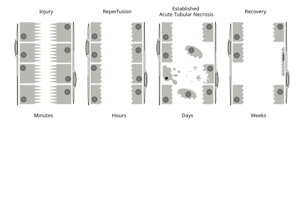

# INSUFICIÊNCIA RENAL AGUDA

A Insuficiência Renal Aguda (IRA), ou Injúria Renal Aguda (LRA), não é uma doença única, mas uma síndrome clínica caracterizada pela redução súbita da função renal. Quando digo "súbita", as bancas de residência estão falando de horas ou poucos dias. Essa queda da função resulta no acúmulo de escórias nitrogenadas (ureia e creatinina) e na incapacidade do rim de manter a homeostase hidroeletrolítica e o equilíbrio ácido-base.

Muitos alunos erram ao achar que IRA é sinônimo de "parar de urinar". Cuidado: a IRA pode ser oligúrica (volume urinário < 400 mL/dia), anúrica (< 100 mL/dia) ou, muito frequentemente em provas, **não oligúrica**. O rim pode estar filtrando pessimamente, mas ainda "jogando água fora" sem depurar o que precisa.

## Critérios Diagnósticos e Classificação KDIGO

Para uniformizar o diagnóstico, utilizamos a classificação **KDIGO (Kidney Disease: Improving Global Outcomes)**. Você precisa decorar esses valores, pois as questões costumam fornecer a creatinina de base e a atual para você estadiar o paciente.

O diagnóstico de IRA é feito se o paciente apresentar **PELO MENOS UM** dos seguintes critérios:

- Aumento da Creatinina Sérica (CrS) ≥ 0,3 mg/dL em 48 horas.

- Aumento da CrS ≥ 1,5 vez o valor basal (que se saiba ou se presuma ter ocorrido nos últimos 7 dias).

- Débito urinário < 0,5 mL/kg/h por pelo menos 6 horas.

### Tabela 1: Estadiamento KDIGO para Injúria Renal Aguda

| Estágio | Creatinina Sérica (CrS) | Débito Urinário |
| --- | --- | --- |
| **1** | 1,5 a 1,9 vezes o valor basal OU aumento ≥ 0,3 mg/dL | < 0,5 mL/kg/h por 6 a 12 horas |
| **2** | 2,0 a 2,9 vezes o valor basal | < 0,5 mL/kg/h por ≥ 12 horas |
| **3** | 3,0 vezes o valor basal OU CrS ≥ 4,0 mg/dL OU início de Terapia de Substituição Renal | < 0,3 mL/kg/h por ≥ 24 horas OU Anúria por ≥ 12 horas |

**Dica de Professor:** Se o paciente preencher critérios diferentes para creatinina e débito urinário, você sempre deve classificar pelo estágio **mais grave**. Outro ponto: mesmo pequenas elevações da creatinina (como 0,3 mg/dL) já estão associadas a um aumento significativo da mortalidade hospitalar. Não ignore um "subidinha" na CrS.

*Figura 1 - Secções transversais do túbulo proximal renal em intervalos após lesão isquêmica, demonstrando a progressão da necrose tubular aguda. Fonte: ColnKurtz, CC BY-SA 4.0 | Wikimedia Commons*

## Fisiopatologia e Etiologias: Onde está o problema?

Didaticamente, dividimos a IRA em três categorias baseadas na localização da agressão. Entender isso é 80% do caminho para acertar a conduta.

### 1. IRA Pré-Renal (O rim está "passando fome")

É a causa mais comum (cerca de 60-70% dos casos). Aqui, o rim está íntegro, mas não recebe sangue suficiente. O problema é a **hipoperfusão**.

**Por que acontece?**

- Hipovolemia real: Hemorragias, desidratação severa (diarreia, vômitos), grandes queimados.

- Hipovolemia relativa (Redução do volume arterial efetivo): Insuficiência cardíaca grave, cirrose (Síndrome Hepatorrenal), sepse (vasodilatação sistêmica).

- Alteração da hemodinâmica intraglomerular: Uso de AINEs ou IECAs/BRAs em situações específicas.

**O mecanismo dos AINEs e IECAs (Cai muito!):**
Para manter a filtração glomerular (TFG) quando a pressão está baixa, o rim usa dois mecanismos:

- **Prostaglandinas:** Dilatam a arteríola **aferente** (a que chega).

- **Angiotensina II:** Contrai a arteríola **eferente** (a que sai).

Se você dá um **AINE**, você inibe as prostaglandinas → a aferente fecha → a pressão dentro do glomérulo cai → IRA Pré-renal.
Se você dá um **IECA/BRA**, você inibe a Angiotensina II → a eferente dilata → a pressão "foge" do glomérulo → IRA Pré-renal.

**Pegadinha de prova:** O IECA causa IRA especialmente em pacientes com **estenose bilateral de artéria renal**. Se o paciente começa a usar Captopril ou Enalapril e a creatinina sobe mais de 30%, suspeite de estenose de artéria renal.

### 2. IRA Intrínseca ou Renal (O rim está "doente")

Aqui, a lesão é no parênquima. A causa mais comum é a **Necrose Tubular Aguda (NTA)**.

**Causas de NTA:**

- **Isquêmica:** Uma IRA pré-renal que não foi tratada a tempo. O rim cansou de "passar fome" e as células tubulares morreram.

- **Tóxica:**

- Exógenas: Contrastes iodados, Aminoglicosídeos (Gentamicina), Anfotericina B, Cisplatina.

- Endógenas: Mioglobina (Rabdomiólise), Hemoglobina (Hemólise), Cadeias leves (Mieloma).

**Outras causas intrínsecas:**

- **Nefrite Intersticial Aguda (NIA):** Geralmente alérgica/medicamentosa. O clássico de prova é o paciente que usou Beta-lactâmico ou AINE e desenvolve a tríade: **Febre + Rash Cutâneo + Artralgia**, além de eosinofilia e eosinofilúria.

- **Glomerulonefrites:** Como a GNPE ou vasculites (Síndrome Pulmão-Rim).

### 3. IRA Pós-Renal (O rim está "entupido")

O problema é a obstrução ao fluxo urinário. Representa cerca de 5-10% dos casos.

**Causas:**

- Hiperplasia Prostática Benigna (HPB) - causa mais comum em idosos.

- Neoplasias (próstata, colo de útero, bexiga).

- Cálculos bilaterais (ou unilateral em rim único).

- Bexiga neurogênica (anticolinérgicos podem precipitar isso em idosos).

**Dica de Professor:** Chegou um idoso com IRA e você não sabe a causa? O primeiro exame a pedir é uma **Ultrassonografia de Rins e Vias Urinárias**. Por quê? Porque a causa pós-renal é mecanicamente reversível e fácil de diagnosticar pelo USG (que mostrará hidronefrose).

*Figura 2 - Barreira de filtração renal: endotélio fenestrado (A), membrana basal glomerular (B) e podócitos (C). Estrutura essencial para compreender a fisiopatologia da IRA. Fonte: M. Komorniczak, CC BY-SA 3.0 | Wikimedia Commons*

## Diagnóstico Diferencial: Pré-Renal vs. NTA

Esta é a tabela que você precisa levar para a vida e para a prova. Ela diferencia se o rim está apenas tentando economizar água (Pré-renal) ou se ele perdeu a capacidade de concentrar a urina (NTA).

### Tabela 2: Índices Urinários na IRA

| Parâmetro | IRA Pré-Renal | Necrose Tubular Aguda (NTA) |
| --- | --- | --- |
| **Fração de Excreção de Sódio (FENa)** | < 1% | > 1% (ou > 2%) |
| **Fração de Excreção de Ureia (FEUrea)** | < 35% | > 35% |
| **Sódio Urinário (NaU)** | < 20 mEq/L | > 40 mEq/L |
| **Osmolaridade Urinária** | > 500 mOsm/kg | < 350 mOsm/kg |
| **Relação Ureia/Creatinina (Sérica)** | > 40 | < 20 |
| **Sedimento Urinário** | Normal ou Cilindros Hialinos | **Cilindros Granulosos ("Marrom-terra")** |

**Por que a FENa é baixa na Pré-renal?** Porque o rim está perfundindo pouco, então ele ativa o sistema Renina-Angiotensina-Aldosterona para reabsorver o máximo de sódio e água possível. Na NTA, o túbulo está "morto", ele não consegue reabsorver nada, então o sódio sai todo na urina.

**Cuidado:** Se o paciente usa diurético, a FENa perde a validade (o diurético força a saída de sódio). Nesses casos, usamos a **Fração de Excreção de Ureia (FEUrea)**.

## Situações Clínicas Específicas (As "Pérolas" das Provas)

### Rabdomiólise

Imagine o cenário: Paciente jovem, exercício extenuante (Crossfit, maratona) ou trauma/esmagamento ou choque elétrico. Apresenta dor muscular, urina escura ("cor de coca-cola") e aumento súbito de escórias.

- **Laboratório:** CPK muito elevada (frequentemente > 10.000), hipercalemia, hiperfosfatemia, hipocalcemia (inicial).

- **O "Pulo do Gato":** O sumário de urina (EAS) mostra "sangue" positivo no dipstick, mas a microscopia **não revela hemácias**. Isso acontece porque o teste reage à mioglobina.

- **Tratamento:** Hidratação venosa vigorosa (SF 0,9%) para manter débito urinário alto e evitar a precipitação da mioglobina nos túbulos. Segundo algumas diretrizes, a alcalinização da urina com Bicarbonato de Sódio pode ser considerada, mas a hidratação é o pilar principal.

### Síndrome Hepatorrenal (SHR)

Ocorre no cirrótico com ascite. É uma IRA pré-renal funcional: há uma vasodilatação esplâncnica brutal, o que gera uma vasoconstrição renal reflexa extrema.

- **Diagnóstico:** É de exclusão. Você deve primeiro retirar diuréticos e expandir com **Albumina (1g/kg/dia por 2 dias)**. Se a função renal não melhorar, é SHR.

- **Tratamento:** Terlipressina + Albumina. O tratamento definitivo é o transplante hepático.

### Nefropatia por Contraste (NIC)

Definida como aumento da CrS em 25% ou 0,5 mg/dL após 48-72h do contraste.

- **Fator de risco principal:** DRC prévia e Diabetes.

- **Prevenção (O que cai):** A medida mais eficaz e recomendada é a **Hidratação venosa com Salina Isotônica (SF 0,9%)** antes e depois do procedimento (ex: 1 mL/kg/h por 12h antes e 12h depois). N-acetilcisteína e bicarbonato não têm evidência robusta superior à salina.

### Síndrome de Lise Tumoral

Comum após início de quimioterapia para tumores hematológicos (Linfomas, Leucemias).

- **Laboratório:** ↑ Ácido Úrico, ↑ Potássio, ↑ Fosfato e ↓ Cálcio.

- **Prevenção:** Hidratação vigorosa e Alopurinol (ou Rasburicase em alto risco).

## Complicações e Manejo da IRA

O tratamento da IRA é, em grande parte, o tratamento da causa base (tratar a sepse, suspender a droga nefrotóxica, hidratar o hipovolêmico). Porém, as complicações matam o paciente antes do rim recuperar.

### Hipercalemia (Potássio > 5,5 mEq/L)

É a complicação eletrolítica mais perigosa.

- **Alterações no ECG (na ordem):** Onda T alta e "em tenda" → Encurtamento do intervalo QT → Aumento do PR e achatamento da P → Alargamento do QRS → Ritmo sinusoide (pré-parada).

- **Tratamento de Emergência (K > 6,5 ou alteração no ECG):**

- **Gluconato de Cálcio 10%:** Estabiliza a membrana do miocárdio. **Não baixa o potássio**, apenas protege o coração.

- **Glicoinsulinoterapia:** (10 UI de insulina regular + 50g de glicose) - joga o potássio para dentro da célula.

- **Bicarbonato de Sódio:** Útil se houver acidose metabólica concomitante.

- **Beta-2 agonistas (Nebulização):** Também promovem shift intracelular.

- **Resinas de troca (Poliestirenossulfonato de Cálcio/Sódio):** Removem potássio do corpo (via fezes), mas agem lentamente.

### Acidose Metabólica

Tratamos com Bicarbonato de Sódio se o pH estiver muito baixo (geralmente < 7,1 ou 7,2) ou se houver hipercalemia grave associada. Lembre-se que o Bicarbonato de Sódio no soro fisiológico pode causar sobrecarga de sódio.

### Indicações de Diálise de Urgência (O mnemônico AEIOU)

Você deve saber isso de cor. Se o paciente apresentar qualquer um desses e não responder às medidas clínicas:

- **A - Acidose** metabólica grave e refratária (pH < 7,1).

- **E - Eletrólitos:** Hipercalemia grave e refratária.

- **I - Intoxicações** por drogas dialisáveis (Lítio, Etilenoglicol, Salicilatos).

- **O - Overload (Sobrecarga):** Edema agudo de pulmão refratário a diuréticos.

- **U - Uremia grave:** Pericardite urêmica (atrito pericárdico), Encefalopatia urêmica (rebaixamento, asterixis), Sangramento por disfunção plaquetária da uremia.

**Atenção:** A presença de cilindros leucocitários na urina sugere inflamação intersticial ou pielonefrite, não sendo uma indicação de diálise por si só.

## Ajuste de Fármacos e Farmacocinética

Na IRA, a farmacocinética muda drasticamente, especialmente em idosos.

- **Metformina:** Deve ser suspensa se TFG < 30 mL/min pelo risco de **Acidose Lática**. Na IRA aguda, a recomendação é suspender preventivamente se houver risco de queda da função renal.

- **Antibióticos:** A maioria exige ajuste de dose (ex: Vancomicina, Aminoglicosídeos, Penicilinas). Uma exceção importante que as bancas amam: **Clindamicina e Ceftriaxone** geralmente não precisam de ajuste renal.

- **Idosos:** Têm menor massa muscular. Por isso, uma creatinina de 1,2 mg/dL em uma senhora de 80 anos pode representar uma perda de função renal muito maior do que em um jovem de 20 anos. Sempre calcule a TFG estimada.

Como o Dr. Will sempre reforça nas discussões do MedEvo, a monitorização da função renal no paciente diabético ou hipertenso deve ser constante, pois a "reserva funcional renal" desses pacientes é menor, tornando-os presas fáceis para uma IRA sobreposta a uma DRC.

## Diferenciando IRA de DRC (Doença Renal Crônica)

Às vezes a prova te dá um paciente com creatinina de 3,5 mg/dL e pergunta se é agudo ou crônico.

- **Sugere DRC:** Rins reduzidos de tamanho (< 8,5 - 9 cm) e com perda da relação cortico-medular no USG; Anemia normo/normo (por deficiência de eritropoietina); PTH elevado e alterações ósseas (Osteodistrofia).

- **Sugere IRA:** Rins de tamanho normal; ausência de anemia prévia; fósforo e potássio subindo muito rápido.

- **Exceções (Rins de tamanho normal na DRC):** Diabetes Mellitus, HIV, Amiloidose, Doença Renal Policística Autossômica Dominante (DRAD).

## Pontos-Chave para Prova 💡

- **Critério KDIGO:** CrS ↑ ≥ 0,3 em 48h ou ↑ ≥ 1,5x o basal em 7 dias.

- **IRA Pré-Renal:** FENa < 1%, Ureia/Cr > 40, Sedimento limpo. Tratamento: Hidratação.

- **NTA:** FENa > 1%, Cilindros Granulosos ("marrom-terra"). Tratamento: Suporte.

- **AINEs:** Causam vasoconstrição da arteríola **aferente** (inibem prostaglandinas).

- **IECAs:** Causam vasodilatação da arteríola **eferente** (inibem Angiotensina II).

- **Rabdomiólise:** CPK alta + Urina escura + Dipstick positivo para sangue mas SEM hemácias.

- **Nefropatia por Contraste:** Prevenção padrão-ouro é **Hidratação com SF 0,9%**.

- **Síndrome Hepatorrenal:** Diagnóstico após expansão com Albumina sem sucesso. Tratar com Terlipressina + Albumina.

- **Indicações de Diálise (AEIOU):** Acidose, Eletrólitos (K), Intoxicação, Overload (EAP), Uremia (Pericardite/Encefalopatia).

- **Hipercalemia no ECG:** Onda T em tenda é o primeiro sinal. Gluconato de Cálcio estabiliza membrana, não reduz K.

- **Metformina:** Contraindicação absoluta se TFG < 30 mL/min.

- **USG de Rins e Vias Urinárias:** Primeiro exame na suspeita de IRA pós-renal (obstrutiva).

- **NIA:** Febre + Rash + Artralgia + Eosinofilia após introdução de nova droga.

- **SF 0,9% em excesso:** Pode causar acidose metabólica hiperclorêmica. Ringer Lactato é uma opção mais balanceada em grandes volumes.

- **Oligúria:** Não é obrigatória para o diagnóstico de IRA. Muitos pacientes mantêm débito urinário (IRA não oligúrica).

- **Cilindros Leucocitários:** Pensar em Nefrite Intersticial ou Pielonefrite.

- **Trombose de Veia Renal:** Suspeitar se Síndrome Nefrótica + Dor no flanco + Hematúria.

 Cópia offline para consulta pessoal.
 Fonte original:
 [https://www.medevo.com.br/material-apoio/ler/5929e069-f04e-42c4-b163-aa8b01fe4128](https://www.medevo.com.br/material-apoio/ler/5929e069-f04e-42c4-b163-aa8b01fe4128)
