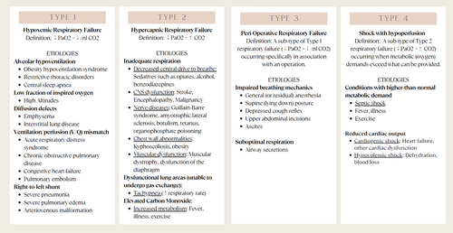
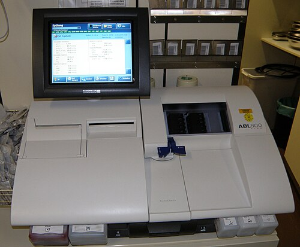

# INSUFICIÊNCIA RESPIRATÓRIA AGUDA

A insuficiência respiratória aguda (IRA) não é uma doença isolada, mas o desfecho final de diversas patologias que colapsam a capacidade do sistema respiratório de manter a oxigenação e/ou a ventilação adequadas. Na pediatria, entender isso é a diferença entre salvar uma vida ou perder o paciente em poucos minutos, pois a reserva funcional da criança é muito menor que a do adulto.

Para a sua prova, o primeiro conceito que você deve fixar é a divisão clássica: a IRA pode ser Hipoxêmica (Tipo I) ou Hipercápnica (Tipo II). No Tipo I, o problema está na troca gasosa (o oxigênio não entra no sangue). No Tipo II, o problema está na "bomba" (o gás carbônico não sai do corpo).

*Figura 1 - Classificação da insuficiência respiratória: Tipo I (hipoxêmica, falha na troca gasosa) e Tipo II (hipercápnica, falha na ventilação). Fonte: Courseaccount333, CC BY-SA 4.0 | Wikimedia Commons*

## Fisiopatologia: O "Porquê" por trás da Falência

Muitos alunos decoram que o shunt causa hipoxemia, mas esquecem de entender o mecanismo. Se você entende o mecanismo, você não erra a conduta. Existem quatro mecanismos principais que levam à IRA:

- **Desequilíbrio Ventilação/Perfusão (V/Q):** É a causa mais comum. Imagine um alvéolo parcialmente preenchido por secreção na pneumonia. O sangue passa por ali, mas não consegue captar oxigênio plenamente.

- **Shunt Intrapulmonar:** Aqui o alvéolo está totalmente colapsado ou cheio de pus/fluido. O sangue passa pelo pulmão e volta para o coração esquerdo sem ter visto uma molécula de oxigênio. A dica de ouro: o shunt é a hipoxemia que NÃO responde bem a baixas ofertas de oxigênio.

- **Hipoventilação Alveolar:** O pulmão está bom, mas o comando central (cérebro) ou a musculatura falharam. O pCO2 sobe obrigatoriamente. É o que vemos em intoxicações por opioides ou doenças neuromusculares como Guillain-Barré.

- **Distúrbio de Difusão:** O oxigênio tem dificuldade de atravessar a membrana alvéolo-capilar (comum em doenças intersticiais, raro ser a causa isolada na pediatria aguda).

Um parâmetro que as bancas amam cobrar para diferenciar se o problema é no pulmão ou fora dele é o Gradiente Alveolo-Arterial de Oxigênio, o P(A-a)O2. O valor normal é entre 5 a 10 mmHg. Se o gradiente está aumentado, o problema está na troca (pulmão). Se o gradiente está normal, mas o paciente está hipoxêmico, o problema é extrapulmonar (ex: hipoventilação central).

## Avaliação Clínica e o Triângulo de Avaliação Pediátrica (TAP)

Na emergência, você não espera a gasometria para agir. O diagnóstico de insuficiência respiratória é clínico. O MedEvo sempre reforça o uso do TAP: Aparência, Trabalho Respiratório e Circulação Cutânea.

Se a aparência está alterada (sonolência, agitação), o cérebro já está sofrendo por falta de O2 ou excesso de CO2. Se o trabalho está aumentado (tiragens, batimento de asa de nariz), a criança está tentando compensar. Se a circulação está ruim (cianose, palidez), o choque pode estar associado.

Cuidado com a pegadinha clássica: a taquipneia é um sinal precoce de desconforto. Porém, a bradipneia em uma criança com esforço respiratório prévio é um sinal de exaustão e falência iminente. Se você encontrar uma criança com bradicardia (FC < 60 bpm), pulsos finos e cianose, ela está a um passo da parada cardiorrespiratória. A conduta aqui é ventilação com bolsa-máscara imediata.

### Sinais de Desconforto Respiratório

- Leve/Moderado: Taquipneia, tiragem intercostal, batimento de asa de nariz.

- Grave: Tiragem de fúrcula, gemência expiratória (a criança cria uma PEEP natural para manter o alvéolo aberto), balanço de cabeça e, finalmente, a respiração paradoxal.

*Figura 2 - Equipamento de gasometria arterial, exame essencial para diagnóstico e classificação da insuficiência respiratória (PaO2, PaCO2, pH). Fonte: Dave, GFDL | Wikimedia Commons*

## Diagnóstico e Exames Complementares

A gasometria arterial é o padrão para definir a gravidade, mas lembre-se: tratamos o paciente, não o papel.

| Parâmetro | Insuficiência Respiratória Hipoxêmica (Tipo I) | Insuficiência Respiratória Hipercápnica (Tipo II) |
| --- | --- | --- |
| **PaO2** | < 60 mmHg (com FiO2 em ar ambiente) | Pode estar normal ou baixa |
| **PaCO2** | Normal ou Baixa (por taquipneia) | > 45-50 mmHg |
| **Mecanismo** | Shunt, V/Q mismatch | Hipoventilação alveolar |
| **Exemplos** | Pneumonia, SDRA, Edema Pulmonar | Guillain-Barré, Intoxicação, Crise de Asma Grave |

A interpretação da gasometria é frequente em provas. Se você encontrar um pH baixo, HCO3 baixo e pCO2 baixa, temos uma acidose metabólica com compensação respiratória. Se o pCO2 estiver alto com pH baixo, é acidose respiratória pura, indicando que a ventilação está insuficiente.

Sobre exames de imagem: a Radiografia de Tórax é o exame inicial para avaliar complicações como pneumotórax ou derrame pleural. A TC de tórax pode trazer informações adicionais, mas nunca é a primeira escolha no paciente instável. Se houver suspeita de derrame pleural ou empiema (pneumonia que não melhora e ausculta abolida), o ultrassom à beira leito é superior para guiar a conduta.

## Oxigenoterapia e Suporte Não Invasivo

O objetivo inicial é manter a SatO2 entre 92-97% (ou conforme a patologia de base). Se o paciente tem pneumonia, FiO2 de 40% e SatO2 de 92% com sinais de desconforto, a conduta correta é aumentar a oferta de oxigênio e reavaliar.

### Cânula Nasal de Alto Fluxo (CNAF)

A CNAF revolucionou a pediatria. É um sistema aberto que fornece gás aquecido e umidificado com fluxos superiores ao pico inspiratório da criança.

- **Por que funciona?** Reduz a resistência da via aérea, lava o espaço morto de CO2 e gera uma pressão positiva (PEEP) modesta.

- **Dica de prova:** Não é contraindicada em menores de 1 ano (muito usada na bronquiolite).

### Ventilação Não Invasiva (VNI)

Indicada quando a oxigenoterapia simples falha, mas a criança ainda tem drive respiratório e estabilidade hemodinâmica. O CPAP mantém uma pressão constante (melhora oxigenação), enquanto o BiPAP oferece dois níveis de pressão (ajuda a lavar o CO2).

## Ventilação Mecânica Invasiva (VMI) em Pediatria

A decisão de intubar deve ser rápida em casos de rebaixamento de consciência, hipoxemia refratária ou choque descompensado.

### Sequência Rápida de Intubação (SRI)

A escolha das drogas depende do contexto clínico. O Dr. Will sempre lembra: "Estabilize antes de intubar, se possível".

- **Sedativos:** Midazolam é comum, mas o Etomidato é a escolha na hipovolemia/choque pela estabilidade hemodinâmica. A Cetamina é a droga de escolha na Asma Grave, pois promove broncodilatação.

- **Bloqueadores Neuromusculares:** Rocurônio ou Succinilcolina.

- **Analgesia:** Fentanil é o padrão. Cuidado: infusão rápida de fentanil pode causar rigidez torácica ("tórax em canudo"), e o tratamento é o uso de relaxante muscular ou o antagonista Naloxona.

### Particularidades Pediátricas na VMI

A traqueia da criança é curta, o que aumenta muito o risco de intubação seletiva (geralmente brônquio fonte direito). O padrão-ouro para confirmar a posição da cânula após a ausculta e capnografia é a Radiografia de Tórax.

Atualmente, preferimos cânulas com cuff (balonete) mesmo em lactentes, desde que a pressão do cuff seja monitorada rigorosamente (< 20-25 cmH2O) para evitar estenose subglótica pós-intubação.

### Ventilação Protetora

Na SDRA Pediátrica (SDRA-P), seguimos a estratégia protetora para evitar a lesão induzida pelo ventilador (VILI):

- **Volume Corrente (Vt):** Baixo (3 a 6 mL/kg de peso ideal).

- **Pressão de Platô:** Limitar a < 28-30 cmH2O.

- **PEEP:** Ajustada para manter recrutamento alveolar sem comprometer o retorno venoso.

- **Hipercapnia Permissiva:** Aceitamos um pH levemente ácido (até 7.20-7.25) para evitar pressões excessivas no pulmão.

## Síndrome do Desconforto Respiratório Agudo Pediátrico (SDRA-P)

A definição atual segue os critérios do PALICC-2. Diferente dos adultos (Berlim), na pediatria usamos o Índice de Oxigenação (IO) ou o Índice de Saturação de Oxigênio (OSI) quando não há gasometria arterial disponível.

| Categoria | Índice de Oxigenação (IO) |
| --- | --- |
| Leve | 4 ≤ IO < 8 |
| Moderada | 8 ≤ IO < 16 |
| Grave | IO ≥ 16 |

O IO é calculado como: (MAP x FiO2 x 100) / PaO2. Onde MAP é a pressão média de vias aéreas.
Se o paciente está em PARDS refratário, as terapias de resgate incluem posição prona, ventilação de alta frequência oscilatória (VAFO) e, em última instância, ECMO.

## Situações Especiais e Complicações

### Estado de Mal Asmático

Na asma grave em VM, o maior risco é o aprisionamento aéreo (auto-PEEP). O tempo expiratório deve ser longo. Se o paciente chocar logo após entrar na ventilação, pense em auto-PEEP (que impede o retorno venoso) ou pneumotórax. A conduta imediata para auto-PEEP é desconectar o ventilador e permitir a exalação manual.

### Pneumotórax Hipertensivo

Piora súbita, desvio de traqueia, murmúrio abolido unilateralmente e choque. Não espere raio-X. A conduta é a descompressão torácica de emergência (punção de alívio) seguida de drenagem em selo d'água.

### Morte Encefálica (ME)

Um tema recorrente. Segundo a resolução do CFM de 2017, para uma criança de 5 anos, o protocolo exige:

- Dois exames clínicos realizados por médicos diferentes (um deve ser intensivista ou neurologista).

- Intervalo de 1 hora entre os exames.

- Teste de apneia positivo.

- Um exame complementar (EEG, Doppler transcraniano ou Arteriografia).

- Observação hospitalar mínima de 6 horas antes de iniciar o protocolo.

### Traqueostomia

Crianças com traqueostomia em domicílio precisam de cuidados rigorosos. A higienização deve ser diária com soro fisiológico 0,9%. Deve-se evitar o uso de gazes cortadas ou algodão, pois as fibras podem ser aspiradas. Itens essenciais em casa: umidificador, cânula reserva (mesmo tamanho e uma menor) e aspirador. O capnógrafo não é obrigatório no domicílio.

## Manejo de Fluidos e Sedação na UTI

O manejo de fluidos deve ser parcimonioso. Na SDRA-P, o balanço hídrico positivo está associado a piores desfechos. Devemos buscar a euvolemia.

Para sedação, a Escala COMFORT é a mais utilizada em pediatria. Ela avalia 8 itens (alerta, calma, resposta respiratória, movimentos, pressão arterial basal, frequência cardíaca basal, tônus muscular e tensão facial). Atenção: a saturação de oxigênio NÃO faz parte da escala COMFORT. O objetivo é que o paciente "durma e acorde ao chamado", evitando sedação excessiva que prolonga a VM.

Se o paciente apresentar agitação súbita em VM, use o mnemônico DOPE:

- **D**islocamento da cânula.

- **O**bstrução da cânula (rolha).

- **P**neumotórax.

- **E**quipamento (falha no ventilador).

*Figura 2 - Equipamento de gasometria arterial, exame essencial para diagnóstico e classificação da insuficiência respiratória (PaO2, PaCO2, pH). Fonte: Dave, GFDL | Wikimedia Commons*

## Diagnóstico Diferencial e Pegadinhas

Muitas vezes a causa da "falta de ar" não é o pulmão.

- **Acidose Metabólica Grave:** A criança faz uma respiração de Kussmaul (profunda e rápida) para compensar o pH. Se houver AG (Anion Gap) aumentado e alcalose respiratória associada em uma criança previamente hígida, suspeite de intoxicação por salicilatos.

- **Insuficiência Cardíaca:** Taquicardia, hepatomegalia e ritmo de galope. O manejo de fluidos aqui deve ser ainda mais restrito.

- **Obstrução de Via Aérea Superior:** Estridor inspiratório. Se for súbito, pense em corpo estranho. Se houver febre e toxemia, pense em epiglotite ou traqueíte bacteriana.

## Pontos-Chave para Prova

- **Bradicardia e Bradipneia:** Em uma criança com desconforto, são sinais de parada iminente. Ventile com bolsa-máscara imediatamente.

- **P(A-a)O2:** Normal entre 5-10 mmHg. Aumentado indica patologia pulmonar intrínseca.

- **SDRA-P (PALICC-2):** Classificada por IO ou OSI. Leve (4-8), Moderada (8-16), Grave (>16).

- **Ventilação Protetora:** Vt 3-6 mL/kg e Pressão de Platô < 28 cmH2O.

- **Cânula com Cuff:** Preferível em pediatria, manter pressão < 20-25 cmH2O.

- **Confirmação de Cânula:** O padrão-ouro para o ajuste fino da posição é a Radiografia de Tórax.

- **Cetamina:** Sedativo de escolha na Asma Grave por ser broncodilatador.

- **Etomidato:** Sedativo de escolha no choque/hipovolemia por não deprimir o sistema cardiovascular.

- **Rigidez Torácica:** Complicação do Fentanil; tratada com Naloxona ou bloqueador neuromuscular.

- **Morte Encefálica (CFM 2017):** 2 exames clínicos + 1 teste de apneia + 1 exame complementar. Intervalo de 1h entre exames clínicos para > 2 anos.

- **Escala COMFORT:** Avalia sedação; possui 8 itens; NÃO inclui saturação de oxigênio.

- **Traqueostomia:** Limpeza com SF 0,9%; evitar gazes desfiadas; ter sempre cânula reserva de menor calibre.

- **Pneumotórax Hipertensivo:** Diagnóstico clínico. Conduta: Punção de alívio imediata no 2º ou 4º/5º espaço intercostal.

- **CNAF:** Sistema aberto, fornece PEEP, reduz espaço morto e resistência. Ótimo para bronquiolite.

- **VMB (Bolsa-Máscara):** Técnica C e E; máscara deve cobrir nariz e boca sem comprimir olhos; coxim sob os ombros em lactentes para alinhar via aérea.

- **Acidose Respiratória em VM:** Para corrigir, aumente a Ventilação Minuto (aumentar FR ou Volume/Pressão). Aumentar a PEEP melhora oxigenação, não ventilação.

- **Humanização:** A presença da família na UTI e a comunicação clara são pilares do tratamento moderno e frequentemente cobrados.

 Cópia offline para consulta pessoal.
 Fonte original:
 [https://www.medevo.com.br/material-apoio/ler/7bd170c3-338b-4bc3-b7fa-abe62a361a17](https://www.medevo.com.br/material-apoio/ler/7bd170c3-338b-4bc3-b7fa-abe62a361a17)
