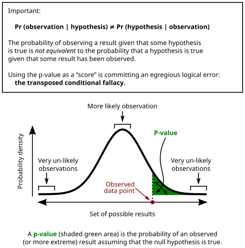

# INTERPRETAÇÃO DE EXAMES COMPLEMENTARES

Exame complementar não substitui o raciocínio clínico. O resultado só ganha significado quando é interpretado junto com probabilidade pré-teste, contexto clínico, limitações do método e consequências terapêuticas. Em provas, os erros mais cobrados são pedir exame sem indicação, ignorar falso positivo/falso negativo e tratar número isolado em vez do paciente.

*Figura 1 - Conceitos de sensibilidade e especificidade: a relação entre verdadeiros positivos, falsos positivos, verdadeiros negativos e falsos negativos na interpretação de exames. Fonte: FeanDoe, CC BY-SA 4.0 | Wikimedia Commons*

Fluxo seguro para interpretar exames

1. Antes do exame
 → qual hipótese será testada? Qual é a probabilidade pré-teste?

2. Escolha do método
 → o teste é melhor para rastrear, confirmar, estadiar ou monitorar?

3. Resultado
 → positivo, negativo, indeterminado ou discordante da clínica?

4. Probabilidade pós-teste
 → sensibilidade, especificidade, razão de verossimilhança, VPP/VPN

5. Conduta
 → observar, repetir, pedir exame confirmatório, tratar ou descartar hipótese

6. Segurança
 → risco de contraste, radiação, falso positivo, atraso terapêutico e custo

## A Lógica da Acurácia e a Bioestatística Aplicada

Antes de interpretar hemograma, biomarcadores ou tomografia, é preciso entender a matemática por trás do teste. Sem probabilidade pré-teste, aumentam exames desnecessários, falsos positivos e condutas inadequadas.

### Sensibilidade e Especificidade

A Sensibilidade é a capacidade do teste de identificar os verdadeiros doentes. Um teste muito sensível é ótimo para rastreamento (screening), pois ele dá poucos falsos negativos. Quando um teste muito sensível é negativo, a doença se torna menos provável.

Já a Especificidade é a capacidade de identificar os verdadeiros sadios. Um teste muito específico é excelente para confirmar uma suspeita, pois ele gera poucos falsos positivos. Resultado positivo em teste muito específico aumenta muito a probabilidade da doença e pode confirmar a hipótese quando o contexto clínico é compatível.

O ponto de corte escolhido para um exame altera esses valores. Reduzir o ponto de corte da glicemia para diagnosticar diabetes aumenta a sensibilidade, mas reduz a especificidade, elevando falsos positivos.

### Valores Preditivos e Prevalência

Aqui está o erro clássico de prova: achar que Sensibilidade e Especificidade mudam com a prevalência da doença. Não mudam! O que muda com a prevalência são os Valores Preditivos.

O Valor Preditivo Positivo (VPP) é a probabilidade de o paciente ter a doença dado que o teste veio positivo. O cálculo é: Verdadeiros Positivos / (Verdadeiros Positivos + Falsos Positivos). Se uma doença é muito rara na população (baixa prevalência), mesmo um teste bom terá muitos falsos positivos, e o VPP será baixo.

### Razão de Verossimilhança (Likelihood Ratio)

A Razão de Verossimilhança (RV) é uma das formas mais elegantes de interpretar exames. A RV positiva (RVP) indica quanto o resultado positivo aumenta a probabilidade da doença. A RV negativa (RVN) indica quanto o resultado negativo a diminui.

Se a razão de verossimilhança é igual a 1, o exame praticamente não altera a probabilidade pós-teste. Um bom teste confirmatório deve ter RVP bem acima de 1; um bom teste para exclusão deve ter RVN próxima de 0.

### Medidas de Impacto: RRA e NNT

Em estudos observacionais ou ensaios clínicos, o NNT (Número Necessário para Tratar) deriva da Redução do Risco Absoluto (RRA).

RRA = Risco no grupo controle - Risco no grupo tratado.
NNT = 1 / RRA.

O NNT nos diz quantos pacientes precisamos tratar com a intervenção X para evitar um desfecho negativo. Quanto menor o NNT, melhor a intervenção.

| Medida | O que avalia | Depende da Prevalência? |
| --- | --- | --- |
| Sensibilidade | Detectar doentes | Não |
| Especificidade | Detectar sadios | Não |
| VPP | Chance de doença se teste + | Sim (Diretamente) |
| VPN | Chance de saúde se teste - | Sim (Inversamente) |

## Bioquímica e Marcadores Inflamatórios

Na beira do leito, exames laboratoriais devem ser interpretados por padrão fisiopatológico, e não apenas por valores de referência isolados.

### Proteína C Reativa (PCR) e VHS

A PCR é uma proteína de fase aguda produzida pelo fígado sob estímulo da IL-6. A pérola de prova aqui é a sua cinética: ela começa a subir em 4 a 6 horas, atinge o pico em 48 horas e, o mais importante, sua meia-vida plasmática é constante, cerca de 19 horas, independentemente de o paciente estar melhorando ou piorando. O que muda é a taxa de síntese.

Muitos alunos confundem o VHS (Velocidade de Hemossedimentação) com a PCR. O VHS é um marcador indireto e lento. Ele depende de proteínas de grande peso molecular (como fibrinogênio) que neutralizam as cargas negativas das hemácias, permitindo que elas se agrupem (formação de "rouleaux" ou pilhas de moedas). O VHS é influenciado por idade, gênero, anemia e até a forma da hemácia. O hipotireoidismo, curiosamente, não é um fator que altera diretamente o VHS, mas a inflamação sistêmica sim.

### Ferritina: O Estoque e a Inflamação

A ferritina é uma "pegadinha" frequente. Ela reflete os estoques de ferro, mas também é uma proteína de fase aguda.

- Ferritina baixa: Sempre indica deficiência de ferro (ou estados raros como deficiência de Vitamina C e hipotireoidismo severo).

- Ferritina alta: Pode ser sobrecarga de ferro (hemocromatose) OU apenas um processo inflamatório/síndrome metabólica.

Se o paciente tem uma ferritina de 800 ng/mL mas a saturação de transferrina está normal, ele provavelmente tem inflamação, não sobrecarga de ferro.

### Ureia e Creatinina

A creatinina é um marcador de filtração glomerular, mas demora a subir (precisamos perder cerca de 50% da função renal para ela alterar significativamente). Já a ureia pode subir sem que o rim esteja ruim.

Por que a ureia sobe com creatinina normal?

- Sangramento digestivo alto (digestão de proteínas do sangue).

- Uso de corticoides (catabolismo proteico).

- Dieta hiperproteica.

- Desidratação (maior reabsorção tubular de ureia).

## Eletrólitos e Equilíbrio Ácido-Básico

A interpretação dos eletrólitos e do equilíbrio ácido-básico se torna mais consistente quando guiada pela fisiologia.

### Hipocalemia e o Efeito Bohr

A hipocalemia (K+ < 3,5 mEq/L) é comum em pacientes usando diuréticos ou com perdas digestivas. No ECG, procure por onda U, achatamento de onda T e aumento do intervalo QT.

Sobre a oxigenação, lembre-se do Efeito Bohr: o aumento da concentração de CO2 e a queda do pH (acidose) diminuem a afinidade da hemoglobina pelo oxigênio, facilitando a entrega de O2 para os tecidos. O contrário ocorre na alcalose.

### Relação PaO2/FiO2 e Saturação

Na insuficiência respiratória, usamos a relação PaO2/FiO2 para avaliar a gravidade da lesão pulmonar.
Exemplo: Paciente em ar ambiente (FiO2 0,21) com PaO2 de 63 mmHg. A relação é 63 / 0,21 = 300.
Valores abaixo de 300 sugerem lesão pulmonar; abaixo de 200, insuficiência respiratória grave (SDRA).

Dica de ouro: Uma SpO2 (saturação de pulso) de 90% corresponde a uma PaO2 de aproximadamente 60 mmHg na curva de dissociação da oxi-hemoglobina. Se cair abaixo de 90%, a PaO2 despenca rapidamente.

### Osmolaridade Sérica

O sódio é o principal determinante da osmolaridade. A fórmula clássica é:
Osm = 2xNa + Glicose/18 + Ureia/6 (ou BUN/2,8).
O valor normal gira em torno de 285-295 mOsm/L. Se houver um "gap osmolar" (diferença entre a osmolaridade medida e a calculada) > 10, suspeite de intoxicações por álcoois (metanol, etilenoglicol).

## Hepatologia e Perfil Lipídico

### Enzimas Hepáticas e Icterícia

A icterícia visível surge quando a bilirrubina total ultrapassa 2-3 mg/dL.

- Aumento de Bilirrubina Indireta (BI): Pense em hemólise ou síndromes genéticas como Gilbert (icterícia leve após estresse ou jejum, com enzimas normais).

- Aumento de Bilirrubina Direta (BD): Pense em colestase ou lesão hepatocelular.

A albumina é um excelente marcador de função hepática, mas apenas para doenças crônicas, pois sua meia-vida é longa (cerca de 20 dias). No quadro agudo, olhamos o TAP/INR.

### Dislipidemia

O perfil lipídico deve ser interpretado com cautela. Se os Triglicerídeos (TG) estiverem acima de 440 mg/dL em uma coleta sem jejum, a diretriz brasileira recomenda repetir com jejum de 12h para manejo adequado. Valores muito altos de TG (> 1000) aumentam o risco de pancreatite aguda.

| Marcador | Significado Clínico |
| --- | --- |
| AST (TGO) | Presente no fígado, coração, músculo. Menos específica. |
| ALT (TGP) | Mais específica para o parênquima hepático. |
| GGT | Marcador de colestase e consumo de álcool. |
| Fosfatase Alcalina | Marcador de colestase e atividade osteoblástica. |

*Figura 2 - Representação gráfica do p-valor em teste de hipóteses: a área sob a curva representa a probabilidade de observar o resultado ao acaso. Fonte: Repapetilto & Chen-Pan Liao, CC BY-SA 3.0 | Wikimedia Commons*

## Diagnóstico por Imagem: O que pedir e o que ver?

A interpretação por imagem exige reconhecer tanto a indicação do exame quanto os achados clássicos.

### Radiografia de Tórax e Abdome

No abdome agudo obstrutivo, a radiografia é o exame inicial.

- Obstrução de intestino delgado: alças centralizadas, com diâmetro aumentado e o sinal do "empilhamento de moedas" (válvulas coniventes).

- Obstrução de cólon: Alças periféricas, com presença de haustrações que não atravessam toda a alça.

No abdome agudo perfurativo, buscamos o pneumoperitônio. O sinal de Jobert é a perda da macicez hepática à percussão devido ao ar livre. Na radiografia em pé, vemos o ar abaixo da cúpula diafragmática.

### Tomografia Computadorizada (TC)

A TC de abdome e pelve com contraste é o padrão-ouro para diverticulite aguda (ajuda no diagnóstico e no estadiamento de Hinchey).
Cuidado: Em pacientes com obesidade mórbida, o exame físico da parede abdominal é muito limitado. A TC é o melhor exame para avaliar hérnias ocultas ou complicações nesses pacientes.

### Ressonância Magnética (RM) e Contraste

A RM é superior para partes moles e sistema nervoso. Para espondilodiscite infecciosa, é o exame mais sensível e específico para o diagnóstico precoce.
Sobre o contraste (Gadolínio): O grande medo em provas é a Fibrose Nefrogênica Sistêmica (FNS), uma complicação grave que ocorre em pacientes com insuficiência renal avançada expostos ao gadolínio.

### Ultrassonografia (USG)

O USG é o exame de escolha para:

- Gestantes (avaliação fetal, colo uterino curto como risco de parto prematuro).

- Trauma (FAST): busca líquido livre na cavidade abdominal (espaço de Morrison, periesplênico, suprapúbico e pericárdico).

- Pulmão: O "Sinal da Praia" no modo M indica pulmão normal (pleura deslizando). O "Sinal do Código de Barras" ou "Sinal da Estratosfera" indica pneumotórax (ausência de deslizamento pleural).

## Urina e Função Renal

O Sumário de Urina (EAS) é uma mina de ouro de informações.

### Cetonúria e Glicosúria

Cetonúria sem hiperglicemia pode indicar jejum prolongado ou estado catabólico. Já a glicosúria com glicemia normal sugere disfunção tubular proximal (Síndrome de Fanconi).

### Hematúria e Cilindros

- Cilindros hemáticos: Patognomônicos de glomerulonefrite.

- Cilindros leucocitários: Sugerem pielonefrite ou nefrite intersticial.

- Cilindros hialinos: Podem ser normais ou indicar desidratação.

## Casos Clínicos e Raciocínio Diagnóstico

Imagine o seguinte cenário: Paciente de 65 anos, tabagista, chega com dor abdominal súbita e intensa, mas o exame físico é "pobre" (dor desproporcional ao achado). Ele tem fibrilação atrial crônica e usa warfarina.
A suspeita principal é isquemia mesentérica aguda. O exame de escolha é a angiotomografia de artérias mesentéricas. INR subótimo em paciente com fibrilação atrial é fator de risco crucial.

Outro cenário: Paciente com anemia microcítica e hipocrômica, perda de peso e uma massa palpável no abdome. Esse conjunto deve ser considerado câncer colorretal até prova em contrário. O próximo passo é a colonoscopia. A anemia ferropriva em homens ou mulheres pós-menopausa sempre exige investigação do trato gastrointestinal.

### O Uso do PSA

O PSA (Antígeno Prostático Específico) é sensível para doenças da próstata, mas não é específico para câncer. Ele aumenta na HPB, na prostatite, após toque retal vigoroso, biópsia ou até mesmo após longas pedaladas. Devemos sempre interpretar o PSA total junto com a fração livre (se PSA livre/total < 25%, o risco de câncer aumenta) e a velocidade de subida.

### Cintilografia com Gálio-67

Este exame aparece em questões sobre febre de origem indeterminada ou inflamações crônicas. O Gálio-67 se comporta como o ferro, ligando-se à lactoferrina e acumulando-se em sítios de inflamação onde há aumento da permeabilidade vascular e presença de leucócitos.

## Interpretação de Exames em Situações Especiais

### Obesidade e Cirurgia Bariátrica

As indicações de cirurgia bariátrica são clássicas em provas:

- IMC ≥ 40 kg/m².

- IMC ≥ 35 kg/m² com comorbidades graves (DM2, HAS, apneia do sono, osteoartrite).
Lembre-se que o tratamento clínico deve ter sido tentado por pelo menos dois anos antes da indicação cirúrgica.

### Deficiência de Vitamina B12 e Metformina

Um erro comum na prática e em provas é esquecer que o uso crônico de metformina pode causar má absorção de vitamina B12. Se o paciente diabético surge com parestesias, ataxia e anemia macrocítica, verifique o nível de B12 antes de rotular apenas como "neuropatia diabética".

### Marcadores Cardíacos no IAM

A Mioglobina (MgB) é o marcador que sobe mais rápido (1-4h), tendo alta sensibilidade inicial, mas baixa especificidade. As Troponinas são o padrão-ouro pela alta sensibilidade e especificidade, permanecendo elevadas por dias. A CK-MB massa é útil para avaliar reinfarto, pois normaliza mais rápido (2-3 dias).

| Marcador | Início da Elevação | Pico | Normalização |
| --- | --- | --- | --- |
| Mioglobina | 1-4 horas | 6-12 horas | 24 horas |
| Troponina | 3-6 horas | 12-24 horas | 7-14 dias |
| CK-MB Massa | 3-8 horas | 12-24 horas | 48-72 horas |

## Pontos-chave

- **PCR:** Meia-vida de 19h é constante. O pico ocorre em 48h. Não serve para diagnóstico etiológico, apenas para atividade inflamatória.

- **Obstrução Intestinal:** "Empilhamento de moedas" no RX = Intestino delgado. Níveis hidroaéreos são clássicos.

- **Sinal de Jobert:** Perda da macicez hepática por pneumoperitônio (ar livre).

- **Gadolínio:** Contraindicação relativa em insuficiência renal grave (ClCr < 30) pelo risco de Fibrose Nefrogênica Sistêmica.

- **VPP e VPN:** O VPP aumenta quando a prevalência da doença na população aumenta. O VPN diminui.

- **NNT:** É o inverso da Redução do Risco Absoluto (1/RRA). Fundamental para avaliar custo-benefício de tratamentos.

- **Síndrome de Gilbert:** Icterícia à custa de Bilirrubina Indireta, sem hemólise e com enzimas hepáticas normais.

- **FAST (USG no trauma):** Não avalia retroperitônio. Foca em líquido livre intraperitoneal e pericárdico.

- **PaO2/FiO2:** Valor de referência normal é > 400. < 300 indica lesão pulmonar aguda.

- **Ferritina Baixa:** É o marcador mais sensível para deficiência de ferro precoce (antes da anemia aparecer).

- **Metformina:** Pode causar deficiência de B12 por interferir na absorção ileal.

- **PSA:** Não é específico para câncer. Prostatite e HPB são causas comuns de elevação.

- **Cilindros Hemáticos:** Presença no EAS indica origem glomerular do sangramento (Glomerulonefrite).

- **Sinal da Praia (USG Pulmonar):** Indica que a pleura está deslizando (descarta pneumotórax naquele ponto).

- **Albumina:** Marcador de função hepática crônica (meia-vida de 20 dias). Não serve para avaliar insuficiência hepática aguda.

- **Troponina:** É o marcador mais específico para lesão miocárdica. Pode estar elevada em insuficiência renal por redução de clareamento.

- **Diverticulite:** TC de abdome com contraste é o exame de escolha. Evite colonoscopia na fase aguda pelo risco de perfuração.

- **Anemia Ferropriva no Idoso:** Investigar câncer colorretal é obrigatório, mesmo sem sintomas intestinais claros.

Antes de solicitar ou interpretar qualquer exame, a pergunta central deve ser: "isso muda a conduta?". Se a resposta for não, o exame provavelmente não deveria ter sido solicitado. A clínica orienta a decisão, e o exame bem interpretado confirma, refina ou refuta hipóteses de forma segura.

 Cópia offline para consulta pessoal.
 Fonte original:
 [https://www.medevo.com.br/material-apoio/ler/16c595eb-5d6a-40af-b140-2892e287253e](https://www.medevo.com.br/material-apoio/ler/16c595eb-5d6a-40af-b140-2892e287253e)
