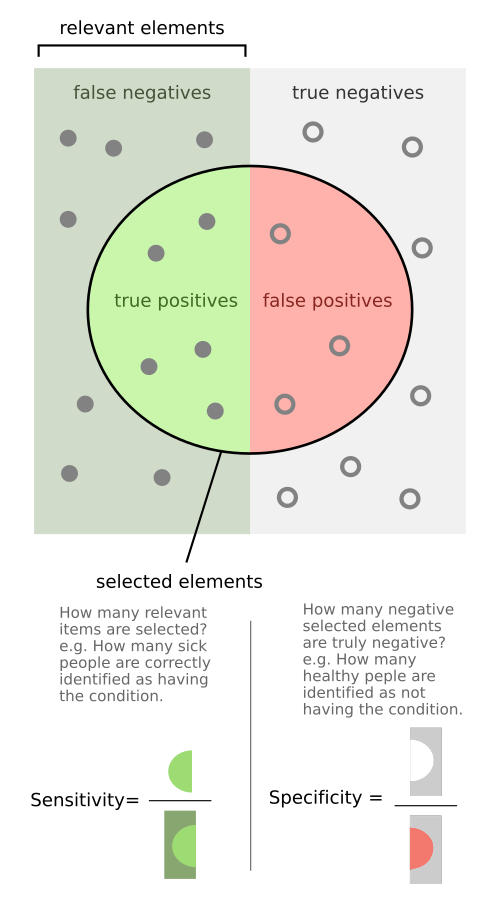

# INTERPRETAÇÃO DE P-VALOR E IC

Para entender bioestatística em provas de residência, você precisa virar uma chave na sua cabeça: a estatística não serve para provar que algo é verdade, mas sim para medir o quanto podemos confiar que aquele resultado não foi um simples golpe de sorte. No dia a dia da MedEvo, sempre reforçamos que o médico que não entende p-valor é refém das conclusões dos autores. Vamos mudar isso agora.

*Figura 1 - P-valor: a área sombreada sob a curva representa a probabilidade de obter um resultado tão extremo ou mais, assumindo que H0 é verdadeira. Fonte: Repapetilto & Chen-Pan Liao, CC BY-SA 3.0 | Wikimedia Commons*

## O Alicerce: Teste de Hipóteses

Antes de falar de p-valor, você precisa entender o que o pesquisador está tentando fazer. Todo estudo clínico começa com duas hipóteses rivais. A Hipótese Nula (H0) é a hipótese do "nada acontece". Ela diz que não há diferença entre os grupos, que o remédio é igual ao placebo ou que a exposição não causa doença. A Hipótese Alternativa (H1) é o que o pesquisador geralmente quer provar: que existe, sim, uma diferença.

O grande problema é que trabalhamos com amostras, não com a população inteira. Se eu testar um remédio em 20 pessoas e 15 melhorarem, isso foi por causa do remédio ou foi apenas o acaso? É aqui que entra a inferência estatística.

### Erro Tipo I e Erro Tipo II

As bancas amam cobrar a confusão entre esses dois erros. Imagine um tribunal:
O Erro Tipo I (Alfa) é condenar um inocente. Na medicina, é dizer que o tratamento funciona quando, na verdade, ele não faz nada. É o falso positivo da pesquisa. Por convenção, aceitamos um risco de 5% para esse erro (alfa = 0,05).

O Erro Tipo II (Beta) é absolver um culpado. É dizer que o tratamento não funciona quando, na verdade, ele funciona. É o falso negativo da pesquisa. Geralmente aceitamos um risco de 20% para esse erro.

Dica do Dr. Will: O Poder do Estudo é o complementar do Erro Tipo II (1 - Beta). Se o erro Beta é 20%, o poder é 80%. Isso significa que o estudo tem 80% de chance de encontrar uma diferença se ela realmente existir. Estudos com amostras pequenas costumam ter "baixo poder", o que leva a resultados não significativos mesmo quando a droga é boa.

## O Valor de P: A Probabilidade do Acaso

O p-valor (ou valor de p) é a probabilidade de encontrarmos um resultado igual ou mais extremo que o observado, assumindo que a Hipótese Nula (H0) seja verdadeira. Em termos simples: qual a chance de o acaso ter gerado esse número?

Se o p-valor é baixo (geralmente < 0,05), dizemos que o resultado é "estatisticamente significativo". Isso significa que a probabilidade de o acaso ser o responsável é tão pequena (menor que 5%) que preferimos rejeitar a H0 e acreditar que a diferença é real.

Se o p-valor é alto (> 0,05), como p = 0,40, não temos evidência suficiente para rejeitar a H0. Cuidado aqui: um p-valor alto não prova que o tratamento é ineficaz. Ele apenas diz que o estudo falhou em mostrar diferença. Pode ser que a amostra tenha sido pequena demais (baixo poder).

### O Erro Clássico do P-valor

Muitos alunos acham que um p = 0,001 significa que o remédio é "muito melhor" que um remédio com p = 0,04. Errado. O p-valor não mede a magnitude do efeito, ele mede apenas a força da evidência contra o acaso. Um p < 0,001 apenas diz que é muito improvável que aquele resultado seja fruto do acaso, mas o benefício clínico pode ser minúsculo.

*Figura 2 - Verdadeiros positivos, falsos positivos, falsos negativos e verdadeiros negativos: conceitos fundamentais para entender o intervalo de confiança na prática clínica. Fonte: FeanDoe, CC BY-SA 4.0 | Wikimedia Commons*

## Intervalo de Confiança (IC): A Precisão da Estimativa

Se o p-valor é um interruptor (ligado/desligado para significância), o Intervalo de Confiança (IC) é um mapa. O IC 95% nos dá uma faixa de valores onde temos 95% de confiança de que a verdadeira média populacional se encontra.

Por que ele é melhor que o p-valor? Porque ele nos mostra duas coisas ao mesmo tempo: a significância estatística e a precisão do estudo.

- Precisão: Quanto mais estreito o intervalo, mais preciso é o estudo. Isso geralmente acontece em estudos com grandes amostras. Um IC muito amplo (ex: RR 1,5; IC95% 1,1 a 8,9) mostra que a estimativa é imprecisa.

- Significância: Você consegue saber se o p é < 0,05 apenas olhando para o IC.

### A Regra de Ouro do IC para Provas

Esta é a regra que resolve 80% das questões de bioestatística:

Para medidas de razão (Risco Relativo, Odds Ratio, Razão de Prevalência): O valor de nulidade é 1. Se o IC 95% incluir o número 1, o resultado NÃO é estatisticamente significativo (p > 0,05).
Exemplo: RR = 1,26 com IC95% (0,95 a 1,50). Como o 1 está dentro da faixa, não há diferença estatística.

Para medidas de diferença (Diferença de médias, redução absoluta de risco): O valor de nulidade é 0. Se o IC 95% incluir o número 0, o resultado NÃO é estatisticamente significativo.
Exemplo: Diferença de peso entre grupos = 2kg com IC95% (-1kg a +5kg). Como passou pelo zero, não há significância.

Tabela 1: Interpretação Rápida de Medidas de Associação (RR e OR)

| Valor do IC 95% | Interpretação Estatística | Significado Clínico (se p < 0,05) |
| --- | --- | --- |
| Limite inferior > 1 | Significativo | Fator de Risco (Aumenta o desfecho) |
| Limite superior < 1 | Significativo | Fator de Proteção (Reduz o desfecho) |
| Inclui o valor 1 | Não Significativo | Sem evidência de associação |

## Risco Relativo (RR) e Odds Ratio (OR)

Nas questões de interpretação de estudos, você verá frequentemente o RR e o OR. O Risco Relativo é a razão entre a incidência nos expostos e a incidência nos não expostos. É a medida clássica dos estudos de Coorte e Ensaios Clínicos.

Já o Odds Ratio (Razão de Chances) é usado principalmente em estudos de Caso-Controle, onde não conseguimos calcular a incidência real.

Imagine um estudo onde o RR de infarto em fumantes é 2,0 com IC95% (1,5 a 2,5).
O que isso significa?

- O valor pontual (2,0) diz que fumantes têm o dobro do risco.

- O IC não inclui o 1, então é estatisticamente significativo.

- O limite inferior (1,5) diz que, no "pior" cenário de confiança, o risco ainda é 50% maior.

Agora, veja este cenário: RR = 0,65 com IC95% (0,40 a 0,90).

- Como o RR é menor que 1, é um fator de proteção.

- O risco foi reduzido em 35% (1 - 0,65 = 0,35).

- Como o IC não inclui 1, a proteção é estatisticamente significativa.

## Significância Estatística vs. Significância Clínica

Este é o ponto onde as bancas pegam o aluno que apenas decorou fórmulas. Um estudo pode ter um p < 0,05 e ser clinicamente irrelevante.

Imagine um novo anti-hipertensivo testado em 50.000 pessoas. O estudo mostra que a droga reduz a PAS em 0,5 mmHg com p < 0,001. Estatisticamente, o resultado é brilhante. Clinicamente, reduzir 0,5 mmHg não muda a vida de ninguém, não previne AVC e não justifica o custo ou os efeitos colaterais.

Por outro lado, um estudo pequeno sobre uma doença rara pode mostrar uma redução de mortalidade de 20%, mas com um p = 0,08. O resultado não é estatisticamente significativo, mas o benefício clínico sugerido é enorme. O problema aqui foi o tamanho da amostra (erro tipo II).

## O Forest Plot: A Floresta da Metanálise

Você verá um gráfico com vários quadrados e linhas horizontais, terminando em um diamante no final. Esse é o Forest Plot, a base das Metanálises.

Cada linha horizontal representa um estudo individual. O quadrado no meio da linha é a estimativa pontual, e a linha horizontal é o IC 95%. Se a linha tocar a "linha de nulidade" (o 1 vertical), aquele estudo sozinho não teve significância.

O diamante no final representa o resultado combinado de todos os estudos.

- Se o diamante não toca a linha do 1, a metanálise é significativa.

- Se o diamante toca a linha do 1, não há evidência de efeito, mesmo que alguns estudos individuais tenham sido positivos.

Lembre-se: a metanálise aumenta o poder estatístico porque combina as amostras de vários estudos. É a ferramenta máxima da Medicina Baseada em Evidências.

## Testes Diagnósticos e a Curva ROC

A interpretação de testes também cai dentro de bioestatística. Aqui, o p-valor dá lugar à Sensibilidade e Especificidade.

A Sensibilidade é a capacidade do teste de detectar os doentes (evitar falsos negativos). É fundamental para triagem.
A Especificidade é a capacidade do teste de identificar os saudáveis (evitar falsos positivos). É fundamental para confirmar diagnósticos.

Quando mudamos o ponto de corte de um teste (ex: o valor de PSA para indicar biópsia):

- Se movemos o corte para a esquerda (mais baixo): Aumentamos a Sensibilidade (pegamos todo mundo), mas perdemos Especificidade (teremos muitos falsos positivos).

- Se movemos o corte para a direita (mais alto): Aumentamos a Especificidade (quem der positivo provavelmente está doente), mas perdemos Sensibilidade (muitos doentes passarão batido).

A Curva ROC (Receiver Operating Characteristic) resume isso. Quanto maior a Área Sob a Curva (AUC), melhor é o teste. Uma AUC de 0,5 é igual a jogar uma moeda (acaso). Uma AUC de 1,0 é o teste perfeito.

Tabela 2: Impacto da Mudança do Ponto de Corte

| Mudança no Corte | Sensibilidade | Especificidade | Falsos Positivos | Falsos Negativos | VPP |
| --- | --- | --- | --- | --- | --- |
| Diminuir valor (Triagem) | Sobe | Desce | Sobe | Desce | Desce |
| Aumentar valor (Confirmação) | Desce | Sobe | Desce | Sobe | Sobe |

## Valores Preditivos e Prevalência

Cuidado com a pegadinha: Sensibilidade e Especificidade são características intrínsecas do teste, elas não mudam com a prevalência da doença. No entanto, o Valor Preditivo Positivo (VPP) e o Valor Preditivo Negativo (VPN) mudam totalmente.

- Se a prevalência da doença aumenta na população: O VPP sobe (é mais provável que um teste positivo seja verdade) e o VPN desce.

- Se a prevalência diminui: O VPP desce (aumentam os falsos positivos proporcionais) e o VPN sobe.

VPP é a probabilidade de o paciente estar realmente doente dado que o teste veio positivo. Se um teste tem VPP de 95%, há 95% de chance de doença real.

## Viés de Publicação e Outras Armadilhas

Por que vemos tantos estudos com p-valor baixo nas revistas? Porque existe o Viés de Publicação. Revistas científicas têm pouco interesse em publicar estudos que "não deram nada" (p > 0,05). Isso cria uma falsa percepção de que todos os tratamentos funcionam.

Outro conceito importante é o Confundimento. Às vezes, uma associação entre café e câncer de pulmão aparece com p < 0,05. Mas, ao ajustar para o tabagismo (variável de confusão), o p-valor sobe e a associação desaparece. Sempre que um estudo "ajusta" os dados e o IC passa a incluir o 1, suspeite de confundimento.

## Exemplos Práticos de Prova

Cenário 1: Um estudo avaliou o uso de probióticos em prematuros para prevenir enterocolite necrosante. O RR encontrado foi 0,45 com IC95% (0,25 a 0,85).
Interpretação: O RR < 1 indica proteção. A redução do risco foi de 55% (1 - 0,45). Como o IC não inclui o 1, o resultado é estatisticamente significativo. Podemos confiar que o probiótico ajuda.

Cenário 2: Aspirina em prevenção primária cardiovascular. O estudo mostra um RR de 0,89 para eventos isquêmicos, mas com IC95% (0,78 a 1,02). Para sangramento maior, o RR foi 1,43 com IC95% (1,10 a 1,85).
Interpretação: Para o benefício isquêmico, o IC incluiu o 1, ou seja, não houve significância estatística. Para o dano (sangramento), o IC não incluiu o 1, sendo estatisticamente significativo. Conclusão: a aspirina causou mais mal do que bem nesse contexto.

Cenário 3: Um estudo transversal avaliou a prevalência de depressão em pacientes com doenças crônicas. A prevalência no grupo com doença foi 15,8% e no grupo sem doença foi 3,4%. A diferença entre as prevalências é de 12,4%.
Interpretação: Isso é chamado de Redução (ou Diferença) Absoluta da Prevalência. Se o estudo desse um p = 0,40 para essa diferença, diríamos que, apesar da distância numérica, não podemos afirmar que essa diferença não foi ao acaso.

## O NNT (Número Necessário para Tratar)

O NNT é a medida favorita para avaliar o impacto real de um tratamento. Ele nos diz quantos pacientes precisamos tratar para evitar um desfecho negativo.
Cálculo: NNT = 1 / Redução Absoluta do Risco (RAR).

Se um remédio reduz a mortalidade de 10% para 5%, a RAR é 5% (ou 0,05).
NNT = 1 / 0,05 = 20.
Isso significa que preciso tratar 20 pessoas para salvar uma vida. Quanto menor o NNT, melhor o tratamento. Um NNT de 1 seria o "remédio milagroso" (trata um, cura um).

Tabela 3: Resumo de Medidas de Efeito

| Sigla | Nome | O que mede? |
| --- | --- | --- |
| RAR | Redução Absoluta do Risco | A diferença aritmética bruta entre os riscos (Risco controle - Risco intervenção) |
| RRR | Redução Relativa do Risco | O quanto o risco caiu em relação ao original (RAR / Risco controle) |
| NNT | Número Necessário para Tratar | Quantos tratar para 1 benefício (1 / RAR) |
| NNH | Número Necessário para Causar Dano | Quantos tratar para 1 efeito colateral (1 / Risco Atribuível) |

## Análise de Sobrevivência e Regressão de Cox

Em estudos de oncologia ou doenças crônicas, você verá a Mediana de Sobrevivência. É o tempo decorrido até que 50% da população do estudo tenha apresentado o evento (morte, recidiva, etc.). Se a curva de Kaplan-Meier do novo tratamento está acima da curva do placebo, os pacientes vivem mais.

A Regressão de Cox é usada para calcular a Hazard Ratio (HR), que interpretamos de forma muito parecida com o Risco Relativo. Se HR = 0,70 com IC95% (0,50 a 0,90), o novo tratamento reduz o "risco instantâneo" de morte em 30% de forma significativa.

## Considerações sobre a Amostra

A validade de um estudo depende de como a amostra foi coletada.

- Amostra de conveniência: O pesquisador pega quem está disponível (ex: pacientes do seu próprio ambulatório). Isso gera viés de seleção e limita a generalização dos resultados.

- Randomização: É o que garante que os grupos sejam comparáveis, distribuindo tanto os fatores conhecidos quanto os desconhecidos (confundimento) de forma igual. Se um estudo é "aberto" (não cego), ele pode sofrer viés de aferição, onde o pesquisador, sabendo quem tomou o remédio, interpreta os resultados de forma otimista.

Lembre-se da pérola: Um intervalo de referência de 95% em exames laboratoriais implica que 5% das pessoas saudáveis estarão fora do padrão (1 em cada 20). Portanto, um único exame levemente alterado em um paciente assintomático tem grandes chances de ser apenas o "acaso estatístico" da distribuição normal.

## Pontos-Chave para Prova

- P-valor < 0,05: Rejeita a Hipótese Nula (H0). Há significância estatística.

- P-valor > 0,05: Falha em rejeitar a H0. Não há evidência de diferença (não prova igualdade).

- IC 95% para RR ou OR: Se incluir o 1, o resultado NÃO é significativo.

- IC 95% para Diferenças: Se incluir o 0, o resultado NÃO é significativo.

- Erro Tipo I (Alfa): Falso positivo (dizer que funciona sem funcionar). Nível de significância padrão é 5%.

- Erro Tipo II (Beta): Falso negativo (não detectar que funciona). Padrão é 20%.

- Poder do Estudo (1 - Beta): Capacidade de detectar uma diferença real. Geralmente 80%.

- NNT: 1 / Redução Absoluta do Risco. Quanto menor, melhor.

- VPP e VPN: Dependem da prevalência. Sensibilidade e Especificidade NÃO dependem da prevalência.

- Aumentar a prevalência: Aumenta o VPP e diminui o VPN.

- Curva ROC: Avalia acurácia. Quanto maior a área sob a curva (AUC), melhor o teste.

- Forest Plot: O diamante representa o resultado combinado. Se ele cruza a linha do 1, a metanálise é inconclusiva.

- Viés de Confundimento: Quando uma terceira variável distorce a relação entre exposição e desfecho. O ajuste estatístico (regressão) tenta corrigir isso.

- Significância Clínica: Não confunda p pequeno com benefício grande. Olhe sempre para a magnitude do efeito (RR, OR, NNT).

- Pegadinha de Prova: A banca dirá que p = 0,06 é significativo. Não é, a menos que o alfa definido seja diferente de 0,05. 🧠

 Cópia offline para consulta pessoal.
 Fonte original:
 [https://www.medevo.com.br/material-apoio/ler/d1301217-07fc-490e-a8e8-47486734f7c7](https://www.medevo.com.br/material-apoio/ler/d1301217-07fc-490e-a8e8-47486734f7c7)
