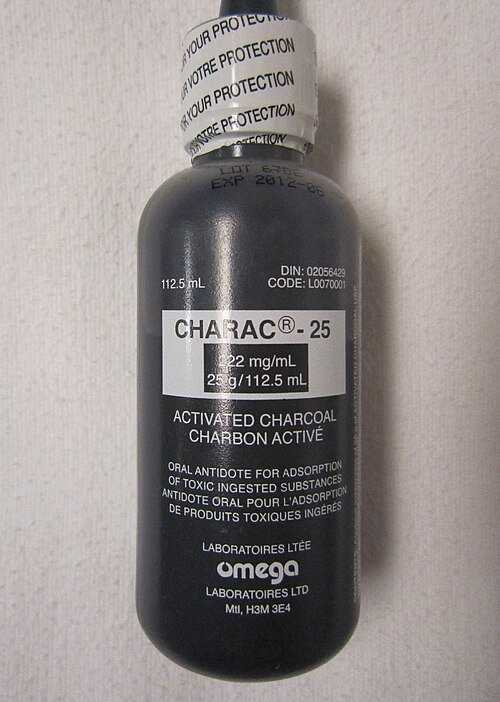

# INTOXICAÇÃO ALCOÓLICA

Para entender a intoxicação alcoólica e suas complicações, você precisa primeiro esquecer a ideia de que o álcool é apenas um "depressor do sistema nervoso central". No MedEvo, sempre batemos na tecla de que, para a prova de residência, você deve enxergar o álcool como um modulador químico complexo que altera o equilíbrio entre a inibição e a excitação cerebral.

O etanol atua principalmente em dois receptores: ele é um agonista dos receptores GABA (o principal neurotransmissor inibitório) e um antagonista dos receptores NMDA de glutamato (o principal excitatório). Quando alguém bebe agudamente, o cérebro fica "inundado" de sinalização inibitória. O problema real, que as bancas amam cobrar, acontece no consumo crônico: o cérebro, tentando manter a homeostase, reduz a sensibilidade dos receptores GABA e aumenta a quantidade de receptores NMDA. É como se o cérebro estivesse o tempo todo "acelerando" para compensar o "freio" do álcool.

*Figura 1 - O etanol atua como agonista GABA e antagonista NMDA, alterando o equilíbrio entre inibição e excitação cerebral. Fonte: Will Murray (Willscrlt), CC0 | Wikimedia Commons*

## Fisiopatologia e Metabolismo

Por que o etilista crônico faz hipoglicemia ou cetoacidose? A resposta está no metabolismo do etanol. O álcool é convertido em acetaldeído pela enzima álcool desidrogenase (ADH) e, depois, em acetato pela acetaldeído desidrogenase (ALDH). Ambas as reações consomem NAD+ e produzem NADH.

Esse aumento bizarro na relação NADH/NAD+ é o que cai na sua prova. Esse excesso de NADH sinaliza ao corpo que ele não precisa fazer gliconeogênese (produção de glicose) e nem ciclo de Krebs. O resultado? O piruvato é desviado para lactato (acidose lática) e o oxaloacetato é desviado para malato, impedindo a entrada de acetil-CoA no ciclo de Krebs. Esse acetil-CoA acumulado acaba virando corpos cetônicos. É por isso que o paciente tem cetoacidose alcoólica mesmo com glicemia normal ou baixa.

## Intoxicação Alcoólica Aguda

A intoxicação aguda é o cenário clássico do pronto-socorro. O quadro clínico depende diretamente da concentração de álcool no sangue (alcoolemia), mas cuidado: o paciente tolerante (etilista crônico) pode parecer absurdamente sóbrio com níveis que matariam um abstêmio.

### Estágios Clínicos da Intoxicação

As bancas podem descrever o quadro clínico e pedir para você estimar a gravidade ou a conduta.

| Alcoolemia (mg/dL) | Manifestações Clínicas Típicas |
| --- | --- |
| 20 - 50 | Leve euforia, relaxamento, discreta alteração da coordenação. |
| 50 - 100 | Ataxia leve, alteração do tempo de reação, desinibição social. |
| 100 - 200 | Ataxia franca, fala arrastada (disartria), instabilidade emocional. |
| 200 - 300 | Diplopia, torpor, náuseas e vômitos intensos. |
| 300 - 400 | Coma, depressão respiratória, perda de reflexos protetores. |
| > 400 | Risco iminente de morte por parada respiratória. |

*Figura 2 - Carvão ativado por via oral, utilizado na descontaminação gastrointestinal em intoxicações agudas quando indicado. Fonte: James Heilman, MD, CC BY-SA 3.0 | Wikimedia Commons*

## Diagnóstico Diferencial: A Grande Pegadinha

Aqui está o erro que faz muito aluno bom ser reprovado. O paciente chega com hálito etílico, agitado ou em coma. Você pensa: "É só bêbado". Errado. O Dr. Will sempre avisa: o álcool é o grande mascarador.

Se o paciente apresenta sinais focais (hemiparesia, desvio de rima), pense em AVC ou Hematoma Subdural (etilistas caem muito e batem a cabeça). Se ele não acorda após algumas horas de observação, investigue outras causas de coma. O diagnóstico de intoxicação alcoólica é, em grande parte, de exclusão no cenário de emergência.

### Manejo da Intoxicação Aguda

O tratamento é essencialmente de suporte. Não existe "antídoto" para o álcool.

- Proteção de via aérea: Se o paciente está em coma (Glasgow < 8), entube. O risco de aspiração do vômito é altíssimo.

- Hidratação: Apenas se houver sinais de desidratação. O álcool inibe o ADH (hormônio antidiurético), por isso o paciente urina muito, mas a hidratação vigorosa não "limpa" o álcool do sangue mais rápido.

- Glicose e Tiamina: Se houver hipoglicemia, você deve repor glicose. Mas atenção à regra de ouro: em etilistas, sempre administre Tiamina (Vitamina B1) antes ou junto com a glicose.

Por que isso? A glicose estimula o metabolismo oxidativo, que consome as poucas reservas de tiamina que o etilista tem. Se você der glicose pura, pode precipitar uma Encefalopatia de Wernicke aguda. A banca vai colocar uma alternativa onde o médico faz "Glicose 50% IV isolada" e você deve marcar como INCORRETA.

## Cetoacidose Alcoólica (CAA)

Este é um tema "queridinho" das provas de clínica médica. Imagine o cenário: etilista crônico que parou de beber há 2 ou 3 dias porque começou a vomitar muito e não consegue comer nada.

### O Quadro Clínico e Laboratorial

O paciente chega com dor abdominal, vômitos e taquipneia (tentando compensar a acidose). No laboratório, você encontra:

- Acidose metabólica com Gap Aniônico elevado (devido aos corpos cetônicos e lactato).

- Cetonemia/Cetonúria positiva.

- Glicemia: Aqui está o segredo. A glicemia costuma estar normal ou levemente baixa. Se estiver muito alta (> 250 mg/dL), o diagnóstico muda para Cetoacidose Diabética (CAD).

### Tratamento da CAA

Diferente da CAD, a cetoacidose alcoólica NÃO precisa de insulina. O tratamento é soro glicosado com salino (SG 5% + SF 0,9%). A glicose estimula a liberação de insulina endógena, que por sua vez freia a cetogênese. E, claro, nunca esqueça da Tiamina 100-300mg IV/IM.

## Síndrome de Abstinência Alcoólica (SAA)

Se a intoxicação é o excesso de "freio" (GABA), a abstinência é o excesso de "acelerador" (Glutamato/NMDA). Quando o álcool sai de cena, o cérebro hiperexcitável entra em colapso.

### Cronologia da Abstinência

As bancas adoram cobrar o tempo de aparecimento dos sintomas. Memorize esta linha do tempo:

- Tremores leves e ansiedade: 6 a 12 horas após o último gole. É o "estágio 1". O paciente está lúcido, mas trêmulo e taquicárdico.

- Alucinose Alcoólica: 12 a 24 horas. O paciente vê bichos, vultos ou ouve vozes, mas (importante!) ele mantém o sensório preservado, ou seja, ele sabe quem é e onde está.

- Crises Convulsivas: 24 a 48 horas. Geralmente são crises tônico-clônicas generalizadas. Se houver sinal focal, investigue outra causa.

- Delirium Tremens (DT): 48 a 96 horas. É o ápice da gravidade.

### Delirium Tremens: A Emergência Médica

O DT não é apenas "ficar doido". É uma tempestade autonômica. O paciente apresenta:

- Rebaixamento do nível de consciência e desorientação.

- Agitação psicomotora intensa.

- Instabilidade autonômica: Hipertensão, taquicardia, febre e sudorese profusa.

Cuidado: A mortalidade do DT sem tratamento chega a 20%. O tratamento de escolha são os Benzodiazepínicos (Diazepam ou Lorazepam) em doses altas e tituladas até a sedação leve.

### Manejo Farmacológico da Abstinência

O objetivo é repor o "freio" que o álcool fornecia.

- Diazepam: 10 a 20 mg VO ou IV a cada 1-2 horas até o controle dos sintomas. É a droga de escolha pela meia-vida longa, o que gera um "desmame natural".

- Lorazepam: 2 a 4 mg. Quando usar? Em idosos ou pacientes com insuficiência hepática grave (cirróticos). O Lorazepam não tem metabolismo hepático de fase 1 (oxidação), sendo mais seguro para o fígado sofrido.

A escala CIWA-Ar (Clinical Institute Withdrawal Assessment for Alcohol) é a ferramenta padrão-ouro para monitorar a gravidade e guiar a terapia. Pontuações acima de 8-10 geralmente indicam necessidade de medicação.

## Encefalopatia de Wernicke e Síndrome de Korsakoff

A deficiência de Tiamina (B1) é a vilã aqui. O etilista é desnutrido, tem má absorção intestinal e o álcool ainda atrapalha a ativação da vitamina.

### Encefalopatia de Wernicke (Aguda)

É uma tríade clássica que você precisa decorar, embora nem todos os pacientes tenham os três sinais:

- Ataxia de marcha (instabilidade).

- Alterações oculomotoras (nistagmo ou paralisia do VI par/reto lateral).

- Confusão mental.

Tratamento: Tiamina em doses altas (500mg IV 3x ao dia por 2 dias, depois 250mg por mais alguns dias). Se você suspeitar, trate. Não espere exames, pois o dano pode ser irreversível.

### Síndrome de Korsakoff (Crônica)

Se o Wernicke não for tratado, ele evolui para Korsakoff. O quadro é marcado por amnésia anterógrada (não consegue formar memórias novas) e confabulação. O paciente inventa histórias para preencher os buracos da memória e ele realmente acredita no que está inventando. Diferente do Wernicke, o Korsakoff raramente reverte com tiamina.

*Figura 2 - Carvão ativado por via oral, utilizado na descontaminação gastrointestinal em intoxicações agudas quando indicado. Fonte: James Heilman, MD, CC BY-SA 3.0 | Wikimedia Commons*

## Diagnóstico Diferencial: Encefalopatia Hepática

Muitas vezes, o etilista crônico chega confuso e você fica na dúvida: é abstinência, é Wernicke ou é o fígado que parou?

| Característica | Abstinência / DT | Encefalopatia Hepática |
| --- | --- | --- |
| Sistema Autonômico | Hiperatividade (Taquicardia, Sudorese) | Geralmente normal ou estável |
| Exame Físico | Tremores finos, agitação | Asterixis (Flapping), Icterícia, Ascite |
| Nível de Consciência | Agitado, Alucinações | Sonolento, Letárgico |
| Amônia | Normal | Frequentemente elevada |
| Tratamento | Benzodiazepínicos | Lactulose, Rifaximina |

Erro comum de prova: Dar benzodiazepínico para um paciente com Encefalopatia Hepática achando que é abstinência. O BZD pode aprofundar o coma hepático e matar o paciente. Na dúvida, procure por estigmas de hepatopatia crônica.

## Aspectos Éticos e Legais: A Declaração de Óbito (DO)

Este tópico cai muito em provas de Medicina Preventiva e Legal misturado com Clínica. Imagine que um etilista crônico, conhecido da vizinhança, é encontrado morto em casa. O que você faz?

- Morte Natural com assistência médica: O médico que assistia o paciente assina a DO.

- Morte Natural sem assistência médica (causa desconhecida): Encaminha para o Serviço de Verificação de Óbitos (SVO).

- Morte Suspeita ou Violenta (Trauma, queda, agressão, suicídio): Encaminha obrigatoriamente para o Instituto Médico Legal (IML).

Atenção: Se o indivíduo é um "vulnerável" (morador de rua, etilista crônico sem acompanhamento) e a causa da morte não é clara, o caso deve ir para o IML se houver qualquer suspeita de causa externa, ou SVO se for puramente por falta de assistência. Nunca preencha a DO se você não acompanhava o paciente ou se houver sinais de violência.

## Marcadores Laboratoriais de Etilismo Crônico

A banca pode te dar exames laboratoriais "soltos" e perguntar qual o diagnóstico provável. No etilista crônico, procure por:

- GGT (Gama-glutamiltransferase) elevada: É o marcador mais sensível, mas pouco específico.

- VCM (Volume Corpuscular Médio) elevado: Macrocitose sem anemia ou com anemia megaloblástica (por deficiência de folato e efeito tóxico direto na medula).

- AST > ALT: Diferente das hepatites virais, na hepatite alcoólica a relação AST/ALT costuma ser > 2.

- CDT (Transferrina Deficiente de Carboidrato): É o marcador mais específico para consumo pesado recente, mas raramente disponível no SUS.

## Situações Especiais e Complicações

### Convulsão por Abstinência

Ocorre geralmente entre 24-48h. É uma crise única ou em curto "salvo". Se o paciente continuar convulsionando (Estado de Mal Epiléptico), pare tudo e procure outra causa (Meningite, AVC, Trauma). O tratamento da crise de abstinência é com Benzodiazepínicos, não com Fenitoína. A Fenitoína não funciona para convulsões de abstinência alcoólica.

### Alucinações vs. Delirium

Lembre-se da diferença fundamental:

- Alucinose Alcoólica: Sensório limpo. O paciente vê o "bicho" mas sabe quem ele é.

- Delirium Tremens: Sensório alterado. O paciente está desorientado e agitado.

### O Uso de Neurolépticos (Haloperidol)

Cuidado aqui. O Haloperidol reduz o limiar convulsivo. Ele só deve ser usado na abstinência se o paciente estiver com agitação psicomotora incontrolável APÓS doses otimizadas de benzodiazepínicos, e sempre em conjunto com eles. Nunca use Haloperidol isolado na abstinência alcoólica.

## Resumo do Manejo na Emergência

Ao receber um paciente com suspeita de complicações do álcool, siga este roteiro mental que sempre ensino no MedEvo:

- Estabilização (ABC): O paciente respira? O Glasgow é seguro?

- Glicemia Capilar: Sempre! Se baixa, Glicose + Tiamina.

- Avaliação da Abstinência: Use o CIWA-Ar. Se > 10, inicie Diazepam.

- Exame Físico Neurológico: Procure por déficits focais (Trauma?) e a tríade de Wernicke.

- Laboratório: Eletrólitos (Magnésio e Potássio costumam estar baixos e precisam ser repostos para o tratamento da abstinência funcionar), função hepática e hemograma.

## Pontos-Chave para Prova

- A tríade clássica da Encefalopatia de Wernicke é Confusão Mental, Ataxia e Alterações Oculomotoras (nistagmo/paralisia).

- Administre Tiamina (B1) SEMPRE antes ou junto com a Glicose em pacientes etilistas para evitar a precipitação de Wernicke.

- A Cetoacidose Alcoólica apresenta Gap Aniônico elevado, cetonemia e glicemia normal ou baixa. O tratamento é SG + SF, sem insulina.

- O Delirium Tremens ocorre tipicamente 48 a 96 horas após a última ingestão de álcool e é uma emergência com instabilidade autonômica.

- Benzodiazepínicos são a droga de escolha na abstinência. Use Lorazepam se houver insuficiência hepática (metabolismo de fase 2 apenas).

- Fenitoína NÃO tem eficácia comprovada na prevenção ou tratamento de crises convulsivas por abstinência alcoólica.

- A relação AST/ALT > 2 sugere fortemente etiologia alcoólica para doença hepática.

- O magnésio baixo é comum no etilista e dificulta a correção do potássio e o controle das crises convulsivas. Reponha magnésio.

- Morte de etilista em domicílio com qualquer sinal de queda ou violência deve ser encaminhada ao IML, não ao SVO.

- Alucinose alcoólica ocorre com nível de consciência preservado, ao contrário do Delirium Tremens.

- O diagnóstico de intoxicação alcoólica aguda é clínico e de exclusão; sempre descarte trauma craniano e hipoglicemia.

- O marcador laboratorial mais sensível para etilismo crônico é a GGT, mas a macrocitose (VCM alto) é uma dica valiosa em provas.

- Contraindicação ABSOLUTA: Não use benzodiazepínicos se o paciente estiver em coma por intoxicação aguda (vai deprimir ainda mais o drive respiratório). Use apenas na abstinência.

- Erro clássico: Achar que todo etilista confuso tem Delirium Tremens. Pode ser Encefalopatia Hepática, Wernicke ou Hematoma Subdural. 🧠

 Cópia offline para consulta pessoal.
 Fonte original:
 [https://www.medevo.com.br/material-apoio/ler/0b61ae53-8a3e-42f6-8d0c-af642fdbb0b6](https://www.medevo.com.br/material-apoio/ler/0b61ae53-8a3e-42f6-8d0c-af642fdbb0b6)
