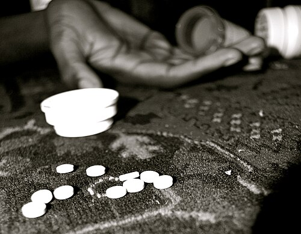

# INTOXICAÇÃO POR DROGAS DE ABUSO

Para entender toxicologia em provas de residência, você precisa parar de tentar decorar nomes de substâncias isoladas e começar a pensar em **Síndromes Toxicológicas (Toxidromes)**. O examinador não quer apenas que você saiba que o paciente usou cocaína, ele quer que você reconheça o padrão clínico que aquela substância gera no organismo.

Na prática da emergência, muitas vezes o paciente chega inconsciente ou agitado, sem acompanhante e sem história colhida. É o seu exame físico que vai dar o diagnóstico. Vamos dividir nosso estudo nos grandes grupos que dominam as questões: Simpaticomiméticos (Cocaína e Anfetaminas), Opioides e as síndromes que fazem diagnóstico diferencial, como a Anticolinérgica e a Serotoninérgica.

## Síndrome Simpaticomimética: O Império da Adrenalina

Esta é, sem dúvida, a vedete das provas. Quando falamos de simpaticomiméticos, o protótipo é a **Cocaína**. O mecanismo de ação aqui é o bloqueio da recaptação de catecolaminas (dopamina, noradrenalina e serotonina) na fenda sináptica. O resultado? Um estado de hiperestimulação adrenérgica constante.

*Figura 1 - Representação de uma overdose por drogas de abuso: a identificação precoce das síndromes toxicológicas é fundamental para o manejo adequado. Fonte: Sam Metsfan, Domínio Público | Wikimedia Commons*

## Fisiopatologia e Quadro Clínico

Por que o paciente com cocaína fica taquicárdico e hipertenso? Porque a noradrenalina está estimulando receptores Alfa-1 (vasoconstrição periférica) e Beta-1 (aumento da frequência e inotropismo cardíaco).

O quadro clínico clássico que você verá na questão é:

- **Agitação psicomotora e euforia:** O paciente está "ligado", alerta, com energia aumentada e insônia.

- **Midríase reativa:** As pupilas estão dilatadas, mas ainda respondem à luz (diferente de algumas intoxicações graves por outras substâncias).

- **Sinais vitais "para cima":** Taquicardia, hipertensão arterial, taquipneia e hipertermia.

- **Sudorese profusa:** Guarde isso. O paciente simpaticomimético está **suado**. Isso vai ser o seu divisor de águas para diferenciar da síndrome anticolinérgica.

### Complicações Graves: O que mata o paciente?

A cocaína não causa apenas agitação. Ela é uma toxina multissistêmica.

- **Síndrome Coronariana Aguda (SCA):** A cocaína aumenta a demanda de oxigênio (pela taquicardia e hipertensão) e diminui a oferta (pelo vasoespasmo coronariano). Além disso, ela favorece a agregação plaquetária.

- **Rabdomiólise:** A agitação intensa, as convulsões e a vasoconstrição muscular levam à destruição de fibras musculares. Se a questão citar "urina escura", "mialgia" e "oligúria" após uso de droga, pense em Rabdomiólise com Insuficiência Renal Aguda.

- **Excitação Delirante (Excited Delirium):** É o grau máximo de intoxicação. O paciente apresenta força sobre-humana, agressividade extrema, hipertermia importante e acidose metabólica. É uma emergência médica com alto risco de morte súbita e exige manejo em UTI.

### Manejo Terapêutico: Onde a maioria dos alunos erra

Aqui está a maior "pegadinha" de toda a toxicologia. Se o paciente chega com dor torácica ou crise hipertensiva por cocaína, **NUNCA use betabloqueadores puros (como Propranolol ou Atenolol)**.

**Por que é contraindicado?** Imagine que a cocaína estimula receptores Alfa (vasoconstrição) e Beta (vasodilatação e taquicardia). Se você bloqueia apenas o Beta, o estímulo Alfa fica "não oposto" (unopposed alpha stimulation). O resultado é uma vasoconstrição maciça, piora da hipertensão e agravamento do vasoespasmo coronariano.

**A primeira linha de tratamento para agitação, hipertensão e taquicardia na intoxicação por cocaína são os Benzodiazepínicos (Diazepam ou Midazolam).** Eles reduzem o drive central simpático, acalmam o paciente e, por consequência, baixam a PA e a FC.

Se a pressão continuar alta mesmo com Diazepam, podemos usar:

- **Fentolamina:** Um alfa-bloqueador puro (muito citado em provas, pouco disponível na prática).

- **Nitratos (Nitroglicerina ou Nitroprussiato):** Para controle da hipertensão e vasodilatação coronariana.

- **Antagonistas dos Canais de Cálcio (Verapamil ou Diltiazem):** Podem ser usados como segunda linha para a dor torácica.

| Situação Clínica | Conduta de Primeira Escolha | O que EVITAR |
| --- | --- | --- |
| Agitação Psicomotora | Benzodiazepínicos (Diazepam) | Haloperidol (reduz limiar convulsivo) |
| Dor Torácica (SCA) | Benzodiazepínicos + Nitratos | Betabloqueadores |
| Crise Hipertensiva | Benzodiazepínicos | Betabloqueadores |
| Hipertermia Maligna | Dantrolene | Medidas de resfriamento lentas |

## Síndrome Opioide: O "Rebaixamento" Clássico

Enquanto a cocaína "acelera", os opioides "desligam". Os opioides (morfina, codeína, heroína, oxicodona, fentanil, tramadol) agem nos receptores Mu, Kappa e Delta no Sistema Nervoso Central.

### A Tríade Clássica

Você não pode ir para a prova sem saber a tríade da overdose de opioides:

- **Depressão do Nível de Consciência (Coma).**

- **Depressão Respiratória:** É o sinal mais fidedigno. Frequência respiratória < 12 irpm (muitas vezes chegando a 4-6 irpm).

- **Miose Puntiforme:** Pupilas extremamente contraídas, como "pontas de alfinete".

**Dica do Dr. Will:** Se o paciente tem essa tríade e você encontra marcas de agulha (uso IV) ou histórico de dor crônica, o diagnóstico está feito. Lembre-se que os opioides naturais, como a morfina, derivam da planta *Papaver somniferum* (papoula).

### Manejo e Antídoto

O tratamento imediato foca na manutenção da via aérea. Se o paciente não ventila, ele faz acidose respiratória (↑ pCO2, ↓ pH) e hipoxemia.

O antídoto específico é a **Naloxona**.

- **Mecanismo:** Antagonista puro e competitivo dos receptores opioides.

- **Como usar:** Deve ser titulada. O objetivo não é necessariamente acordar o paciente, mas sim fazer com que ele volte a respirar espontaneamente.

- **Cuidado:** A meia-vida da Naloxona é curta (30-60 min). Muitos opioides (como a Metadona ou formulações de liberação prolongada) duram muito mais. O paciente pode apresentar "ressedação" e voltar a parar de respirar após o efeito do antídoto passar.

**Exemplo Clínico:** Paciente de 25 anos, encontrado em via pública com FR de 6 irpm, SatO2 82% e pupilas mióticas. Conduta: Ventilação com bolsa-válvula-máscara (Ambu) e Naloxona IV. Se houver melhora da ventilação, você confirmou o diagnóstico.

## Síndrome Anticolinérgica vs. Serotoninérgica

Essas duas síndromes são os principais diagnósticos diferenciais da intoxicação por estimulantes. As bancas adoram confundir o aluno aqui.

### Síndrome Anticolinérgica

Ocorre pelo bloqueio dos receptores muscarínicos da acetilcolina. Causas comuns: Atropina, Antidepressivos Tricíclicos, Anti-histamínicos de 1ª geração, Escopolamina.

O mnemônico clássico (traduzido) ajuda a fixar:

- **"Quente como um deserto":** Hipertermia.

- **"Seco como um osso":** Pele e mucosas secas (DIFERENTE da cocaína, onde há sudorese).

- **"Vermelho como uma beterraba":** Vasodilatação cutânea.

- **"Cego como um morcego":** Midríase não reativa e visão turva.

- **"Louco como um chapeleiro":** Delirium, alucinações e agitação.

**Dica de Prova:** Se a questão fala em midríase e taquicardia, olhe para a pele. Pele suada = Simpaticomimético. Pele seca e retenção urinária = Anticolinérgico.

### Síndrome Serotoninérgica

Ocorre pelo excesso de serotonina. Um cenário muito comum em provas é a interação medicamentosa: **Fluoxetina (ISRS) + Sibutramina** ou **ISRS + IMAO** ou até o uso de **Tramadol** (que tem efeito serotoninérgico).

O quadro clínico inclui:

- Alteração do status mental (agitação, confusão).

- Hiperatividade autonômica (febre, hipertensão, taquicardia, **diarreia/dor abdominal**).

- **Alterações Neuromusculares:** Tremor, clônus (especialmente clônus ocular e de extremidades) e hiperreflexia.

| Característica | Simpaticomimética (Cocaína) | Anticolinérgica | Serotoninérgica |
| --- | --- | --- | --- |
| **Pupilas** | Midríase (reativa) | Midríase (fixa) | Midríase |
| **Pele** | Sudorese profusa | Seca e quente | Sudorese |
| **Ruídos Hidroaéreos** | Aumentados | Ausentes/Diminuídos | Muito aumentados |
| **Reflexos** | Normais | Normais | Hiperreflexia / Clônus |

## Outras Substâncias e Pérolas de Exame Físico

*Figura 2 - Carvão ativado por via oral: medida de descontaminação gastrointestinal frequentemente utilizada em intoxicações agudas por substâncias adsorvíveis. Fonte: James Heilman, MD, CC BY-SA 3.0 | Wikimedia Commons*

## Álcool e Sedativos

A intoxicação aguda por álcool ou benzodiazepínicos causa depressão do SNC.

- **Pérola MedEvo:** No coma por sedativos, a depressão neurológica costuma ser **simétrica**. Se você encontrar sinais focais (uma pupila diferente da outra, um lado do corpo que não mexe), pare tudo e peça uma Tomografia de Crânio para excluir lesão estrutural (como um hematoma subdural, comum em etilistas que caem e batem a cabeça).

- **Agitação no Etilista:** Se o paciente está agitado por intoxicação etílica aguda, o **Haloperidol IM** é uma opção segura para contenção química. Evite benzodiazepínicos aqui, pois eles podem potencializar a depressão respiratória do álcool.

### Antagonistas Dopaminérgicos (Metoclopramida)

Não é uma droga de abuso, mas cai no mesmo bloco de toxicologia. A Metoclopramida (Plasil) bloqueia receptores D2.

- **Efeito Colateral:** Sintomas extrapiramidais, como a **Discinesia Tardia** ou distonias agudas (torcicolo, protrusão da língua).

- **Reflexo do Vômito:** Lembre-se da anatomia. A eferência do reflexo do vômito (protrusão da língua) é feita pelo **Nervo Hipoglosso (XII)**.

### Intoxicação Digitálica

A Digoxina tem um índice terapêutico estreito.

- **ECG:** Pode causar qualquer arritmia, mas a clássica é a extrassístole ventricular ventricular multifocal. Outro achado importante é o **ritmo juncional** (onda P ausente ou retrógrada com QRS estreito), indicando que o nó sinusal foi "suprimido" e o nó AV assumiu o comando.

### Teratogenia: O que a gestante não pode usar?

As bancas adoram misturar drogas de abuso com medicamentos comuns na gravidez.

- **Teratogênicos confirmados:** Fenobarbital, Álcool (Síndrome Alcoólica Fetal), Indometacina (fechamento precoce do ducto arterioso), Varfarina, Fenitoína.

- **NÃO é teratogênica:** A **Clortalidona** (diurético tiazídico) não é considerada teratogênica, embora não seja a primeira escolha para tratar hipertensão na gravidez (preferimos Metildopa ou Hidralazina).

## Complicações Cardiovasculares e Manejo da Dor Torácica

Como professor, vejo muitos alunos perderem questões de "Manejo de Emergência" por não seguirem a hierarquia de conduta. No paciente com dor torácica por cocaína, o protocolo segue o da SCA clássica, com modificações cruciais.

- **Monitorização, Oxigênio (se Sat < 94%) e Acesso Venoso.**

- **Eletrocardiograma (ECG):** Deve ser feito em até 10 minutos. A cocaína pode causar supradesnivelamento do segmento ST por vasoespasmo puro ou por infarto com trombo.

- **Benzodiazepínicos (Diazepam 5-10mg IV):** Reduzem a dor e a hiperatividade simpática.

- **Aspirina (AAS):** Deve ser administrada para evitar a agregação plaquetária induzida pela droga.

- **Nitratos:** Nitroglicerina sublingual ou IV para reverter o vasoespasmo.

- **Se o Supra de ST persistir após Benzodiazepínico + Nitrato:** O paciente deve ir para a Cineangiocoronariografia (Cateterismo) de urgência.

**Lembrete de Ouro:** A cocaína também causa um estado de "bloqueio de canais de sódio" (efeito anestésico local). Isso pode alargar o complexo QRS no ECG. Se o QRS estiver > 120ms, o tratamento é **Bicarbonato de Sódio IV**, assim como fazemos na intoxicação por antidepressivos tricíclicos.

## Abstinência e Dependência

A prova pode cobrar as fases da abstinência, especialmente da cocaína e do álcool.

- **Abstinência de Cocaína:** Diferente do álcool, não costuma causar sintomas físicos fatais (como convulsões). O quadro é marcado por "crash" (exaustão, sonolência, aumento do apetite) seguido de disforia e uma **fissura (craving)** intensa. A fissura aumenta nas semanas de uso e pode ser desencadeada por gatilhos ambientais. Curiosamente, mesmo pacientes em tratamento com Metadona (para dependência de opioides) podem manter fissura alta por cocaína se o uso for concomitante.

- **Abstinência de Opioides:** É extremamente desconfortável ("a pior gripe da vida"), com rinorreia, lacrimejamento, bocejos, diarreia e piloereção ("gooseflesh"), mas raramente é fatal. O tratamento de manutenção é feito com **Metadona** (agonista pleno de longa duração) ou **Buprenorfina** (agonista parcial).

## Diagnóstico Diferencial de Ritmos Respiratórios

A toxicologia clínica exige que você conheça os padrões respiratórios anormais:

- **Cheyne-Stokes:** Ciclos de hiperpneia que alternam com apneia. Comum em insuficiência cardíaca grave e lesões neurológicas, mas também vista em intoxicações graves por **opioides ou barbitúricos** que afetam o centro respiratório.

- **Kussmaul:** Respiração profunda e rápida. Indica acidose metabólica (ex: Cetoacidose diabética ou intoxicação por Salicilatos/Metanol).

- **Biot:** Respiração totalmente irregular. Indica lesão de tronco cerebral (prognóstico reservado).

## Resumo de Antídotos e Condutas Específicas

Para sua revisão rápida pré-prova, memorize esta tabela de antídotos:

| Substância | Antídoto / Conduta Específica |
| --- | --- |
| Opioides | Naloxona |
| Benzodiazepínicos | Flumazenil (Cuidado: pode causar convulsão em usuários crônicos) |
| Antidepressivos Tricíclicos | Bicarbonato de Sódio (se QRS largo) |
| Paracetamol | N-acetilcisteína |
| Betabloqueadores | Glucagon |
| Inseticidas Organofosforados | Atropina + Pralidoxima |
| Hipertermia Maligna | Dantrolene |
| Metanol / Etilenoglicol | Etanol ou Fomepizol |

## Pontos Críticos em Questões de Prova

Muitas vezes, a banca coloca um caso de "Agitação Psicomotora Aguda" e você precisa decidir entre contenção física ou química.

- Sempre priorize a segurança da equipe.

- A contenção química de escolha na agitação por estimulantes (cocaína/anfetamina) são os **Benzodiazepínicos**.

- Na agitação por álcool, prefira **Antipsicóticos (Haloperidol)**.

Outro ponto: **Hipertermia Maligna**.
Cenário: Paciente em cirurgia, recebe anestésico inalatório (Halotano) ou Succinilcolina, e desenvolve subitamente rigidez muscular, taquicardia e febre de 42°C. Isso não é infecção! É uma reação farmacogenética. O tratamento é interromper o agente e dar **Dantrolene**.

## Pontos-Chave para Prova 🎯

- **Cocaína e Betabloqueadores:** Contraindicação ABSOLUTA. Risco de hipertensão severa e vasoespasmo coronariano por estímulo alfa não oposto.

- **Tríade de Overdose de Opioide:** Coma + Miose Puntiforme + Depressão Respiratória (FR < 12).

- **Melhor Preditor de Gravidade em Opioides:** Frequência Respiratória.

- **Antídoto de Opioides:** Naloxona (antagonista puro). Cuidado com a meia-vida curta.

- **Diferença Simpaticomimético vs. Anticolinérgico:** Sudorese (Simpaticomimético) vs. Pele Seca (Anticolinérgico).

- **Primeira Escolha na Agitação por Cocaína:** Benzodiazepínicos (ex: Diazepam).

- **Síndrome Serotoninérgica:** Causada por excesso de serotonina (ex: Fluoxetina + Sibutramina). Marcada por hiperreflexia e clônus.

- **Rabdomiólise por Cocaína:** Suspeitar se houver agitação + mialgia + urina escura (mioglobinúria). Risco de Insuficiência Renal Aguda.

- **Discinesia Tardia:** Efeito extrapiramidal de antagonistas dopaminérgicos como a Metoclopramida.

- **Teratogenia:** Álcool, Fenobarbital e Fenitoína são teratogênicos. Clortalidona NÃO é.

- **Ritmo Juncional no ECG:** Pode ser sinal de intoxicação digitálica (onda P ausente ou após o QRS).

- **Fissura (Craving):** Na cocaína, é intensa e influenciada por fatores ambientais, não sendo suprimida pela metadona.

- **Acidose Respiratória:** Comum na overdose de sedativos/opioides devido à hipoventilação (↑ pCO2).

- **Reflexo do Vômito:** A eferência motora da língua é pelo nervo Hipoglosso (XII).

- **Hipertermia Maligna:** Tratada com Dantrolene; desencadeada por anestésicos inalatórios.

- **O que NÃO fazer:** Não use Haloperidol como primeira linha na agitação por cocaína (risco de baixar limiar convulsivo e piorar hipertermia).

- **Naloxona no Tramadol:** Se o paciente intoxicar com Tramadol e rebaixar, use Naloxona (o Tramadol tem componente opioide).

- **Manejo da PA na Cocaína:** Se Diazepam não resolver, use Nitratos ou Fentolamina. Nunca Betabloqueadores puros.

 Cópia offline para consulta pessoal.
 Fonte original:
 [https://www.medevo.com.br/material-apoio/ler/7fbec436-be74-46ac-a4d7-9ae9ca94cbcb](https://www.medevo.com.br/material-apoio/ler/7fbec436-be74-46ac-a4d7-9ae9ca94cbcb)
