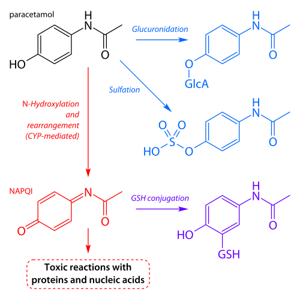

# INTOXICAÇÃO POR MEDICAMENTOS

Para começar nossa conversa, você precisa entender que a Toxicologia Clínica em provas de residência não é sobre decorar nomes complicados, mas sobre reconhecer padrões. O examinador quer saber se você, como plantonista, consegue identificar uma síndrome (toxidrome), estabilizar o paciente e aplicar o antídoto correto quando ele existe. No MedEvo, sempre batemos na tecla de que o diagnóstico em toxicologia é, acima de tudo, clínico e circunstancial.

*Figura 1 - Vias metabólicas do paracetamol: a saturação da via de conjugação leva à formação de NAPQI, metabólito hepatotóxico. Fonte: Fvasconcellos, Domínio Público | Wikimedia Commons*

## Abordagem Inicial e Estabilização

O erro mais comum do aluno é querer descobrir qual foi o remédio antes de garantir que o paciente continue respirando. Esqueça o frasco de comprimidos por um segundo. O manejo inicial segue o ABCDE do trauma, mas com adaptações toxicológicas.

Na avaliação do "A" (Vias Aéreas) e "B" (Respiração), preste atenção na oximetria e no padrão respiratório. Intoxicações por opioides causam bradipneia grave, enquanto salicilatos (AAS) geram taquipneia por estímulo direto do centro respiratório. No "C" (Circulação), a hipotensão é frequente. Por que ela ocorre? Pode ser por vasodilatação (bloqueadores de canal de cálcio), depressão miocárdica (tricíclicos) ou depleção de volume.

A monitorização eletrocardiográfica é obrigatória. Muitas drogas, como os antidepressivos tricíclicos e os organofosforados, podem alargar o intervalo QT, predispondo ao Torsades de Pointes. Se o QRS estiver alargado (acima de 100-120ms), sua mente deve gritar: bloqueio de canais de sódio.

## Descontaminação Gastrointestinal

Aqui as bancas adoram fazer pegadinhas. Antigamente, fazíamos lavagem gástrica em todo mundo. Hoje, a regra mudou.

### Carvão Ativado

É a estrela da descontaminação. O carvão ativado age por adsorção, ligando-se à substância no lúmen intestinal e impedindo sua absorção.
A janela ideal é de até 1 hora após a ingestão. Após esse tempo, o benefício cai drasticamente, a menos que a droga retarde o esvaziamento gástrico (como os anticolinérgicos).
Cuidado: o carvão NÃO funciona para o "PHAILS" (Pesticidas/Petróleo, Hidrocarbonetos, Ácidos/Álcalis, Ferro, Lítio, Solventes). Se a prova perguntar sobre intoxicação por Lítio, marcar carvão ativado é erro que reprova.

### Lavagem Gástrica

Deve ser considerada apenas se a ingestão foi de uma substância potencialmente letal e ocorreu há menos de 60 minutos.
Contraindicações absolutas: ingestão de cáusticos (risco de perfuração) e hidrocarbonetos (risco de pneumonia aspirativa). Em ingestões cáusticas, a Endoscopia Digestiva Alta (EDA) é a ferramenta diagnóstica e prognóstica, não a terapêutica de esvaziamento.

## Toxidromes: O Reconhecimento de Padrões

As toxidromes são conjuntos de sinais e sintomas que apontam para uma classe de drogas. Se você dominar esta tabela, resolve 40% das questões de toxicologia.

| Toxidrome | Manifestações Clínicas | Causas Comuns |
| --- | --- | --- |
| **Opioide** | Miose, bradipneia, depressão do SNC | Morfina, Fentanil, Codeína |
| **Anticolinérgica** | Midríase, pele seca/quente, taquicardia, retenção urinária, delirium | Amitriptilina, Atropina, Anti-histamínicos |
| **Colinérgica** | Miose, bradicardia, sialorreia, lacrimejamento, diarreia (DUMBBELS) | Organofosforados, Carbamatos |
| **Simpaticomimética** | Midríase, hipertensão, taquicardia, sudorese profusa | Cocaína, Anfetaminas |
| **Sedativo-hipnótica** | Depressão do SNC, sinais vitais estáveis ou levemente baixos | Benzodiazepínicos, Barbitúricos |

Note uma diferença crucial que cai sempre: na síndrome anticolinérgica, a pele está seca ("seco como um osso"). Na simpaticomimética, o paciente está suando baldes. Isso diferencia uma intoxicação por amitriptilina de uma por cocaína em segundos.

## Intoxicação por Paracetamol (Acetaminofeno)

Esta é, sem dúvida, a intoxicação medicamentosa mais cobrada. O paracetamol é a causa mais comum de insuficiência hepática aguda no mundo ocidental.

*Figura 2 - N-acetilcisteína (NAC): principal antídoto na intoxicação por paracetamol, atua como precursor de glutationa e neutraliza o NAPQI. Fonte: Fvasconcellos, Domínio Público | Wikimedia Commons*

## Fisiopatologia: O Porquê da Lesão

Em doses terapêuticas, o paracetamol é metabolizado via sulfatação e glicuronidação. Uma pequena parte vai para a via do Citocromo P450 (CYP2E1), gerando um metabólito tóxico chamado NAPQI. Normalmente, o glutation o neutraliza. Na overdose, o glutation acaba, o NAPQI sobra e causa necrose hepática centrolobular.

### Quadro Clínico e Diagnóstico

A fase inicial é enganosa: náuseas e vômitos leves. O paciente parece bem. Após 24-48 horas, surgem a dor no hipocôndrio direito e a elevação das transaminases (AST/ALT frequentemente > 1000 U/L).
Para decidir a conduta, usamos o Nomograma de Rumack-Matthew, que relaciona a concentração sérica de paracetamol com o tempo após a ingestão. Atenção: ele só vale para ingestões agudas e únicas, e o nível deve ser coletado pelo menos 4 horas após a ingestão.

### Tratamento: N-acetilcisteína (NAC)

A NAC é o antídoto padrão-ouro. Ela atua como precursora do glutation, ajudando a neutralizar o NAPQI.
Se o paciente chega com pH < 7.3, INR > 6.5 e creatinina elevada, ele preenche critérios de King's College para transplante hepático de urgência. A NAC deve ser iniciada mesmo se o paciente chegar tardiamente ou já em falência hepática.

## Salicilatos (AAS) e o Distúrbio Ácido-Base

A intoxicação por aspirina é um clássico de prova devido ao seu distúrbio ácido-base misto.
O AAS estimula o centro respiratório (causando Alcalose Respiratória) e, simultaneamente, interfere no ciclo de Krebs, gerando lactato e corpos cetônicos (causando Acidose Metabólica com Anion Gap elevado).
O resultado é um pH que pode estar normal, mas com um pCO2 baixo e um HCO3 muito baixo.

Sintomas típicos: zumbido no ouvido (muito específico), taquipneia, febre e alteração do nível de consciência.
Tratamento: Alcalinização urinária com Bicarbonato de Sódio. Por que? O AAS é um ácido fraco. Em meio alcalino, ele se ioniza, fica "preso" no túbulo renal e é excretado mais rápido.

## Antidepressivos Tricíclicos (ATC)

Drogas como amitriptilina e nortriptilina são perigosas. Elas têm quatro mecanismos de toxicidade: anticolinérgico, bloqueio alfa-1 adrenérgico (hipotensão), bloqueio de canais de sódio (cardiotoxicidade) e bloqueio de canais de potássio (prolongamento do QT).

O sinal clássico no ECG é o alargamento do QRS e uma onda R proeminente em aVR.
Tratamento: Bicarbonato de Sódio IV. Aqui, o objetivo não é apenas corrigir o pH, mas aumentar a oferta de sódio para vencer o bloqueio nos canais cardíacos e estabilizar a membrana. Se o paciente convulsionar, use benzodiazepínicos, nunca fenitoína (que também bloqueia canais de sódio e piora a arritmia).

## Intoxicação Digitálica (Digoxina)

A digoxina tem um índice terapêutico estreito. A intoxicação pode ser aguda (tentativa de suicídio) ou crônica (idoso com insuficiência renal ou usando diuréticos que causam hipocalemia).

Manifestações:

- Gastrointestinais: Náuseas e vômitos (são os primeiros sinais).

- Visuais: Xantopsia (visão amarelada ou esverdeada).

- Cardíacas: Praticamente qualquer arritmia. A mais clássica é a taquicardia atrial com bloqueio AV variável. No ECG crônico, vemos a "pá de pedreiro" (infradesnivelamento do segmento ST), que indica efeito da droga, não necessariamente intoxicação.

Fator de risco importante: Hipocalemia. O potássio e a digoxina competem pelo mesmo sítio na bomba Na/K-ATPase. Se tem pouco potássio, a digoxina se liga mais e intoxica mais. No entanto, na intoxicação AGUDA grave, o potássio sobe (hipercalemia) porque a bomba está bloqueada em todo o corpo.

## Bloqueadores de Canais de Cálcio (BCC) e Betabloqueadores

Ambos causam bradicardia e hipotensão. Como diferenciar na prova?
Os BCC (especialmente amlodipina, verapamil e diltiazem) impedem a liberação de insulina pelo pâncreas, que depende de canais de cálcio. Resultado: Intoxicação por BCC cursa com HIPERGLICEMIA. Já os betabloqueadores tendem a causar hipoglicemia ou normoglicemia.

Tratamento de escolha para casos graves: Terapia de Insulina em Altas Doses (HIET). A insulina atua como um inotrópico positivo, melhorando a captação de glicose pelo miócito estressado.

## Lítio: O Vilão do Rim

O lítio é excretado exclusivamente pelos rins e é manejado pelo túbulo renal como se fosse sódio.
Fatores que aumentam a reabsorção de sódio (desidratação, uso de diuréticos tiazídicos, AINEs) aumentam os níveis de lítio.
Sintomas: Tremores grosseiros, ataxia, confusão mental e sintomas gastrointestinais.
Tratamento: Hidratação vigorosa com soro fisiológico. Se o nível sérico for > 4.0 mEq/L (ou > 2.5 com sintomas graves), a indicação é Hemodiálise.

## Benzodiazepínicos e Opioides

A intoxicação por benzodiazepínicos (clonazepam, diazepam) causa rebaixamento do nível de consciência com sinais vitais relativamente estáveis. O antídoto é o Flumazenil.
Cuidado: O Dr. Will sempre lembra que o flumazenil é perigoso em usuários crônicos ou intoxicações mistas com tricíclicos, pois pode precipitar convulsões de difícil controle. Na dúvida, suporte clínico e observação.

Já nos opioides, temos a tríade: Miose + Bradipneia + Coma. O antídoto é a Naloxona. A meta não é deixar o paciente acordado e saltitante, mas sim garantir uma frequência respiratória segura (> 12 irpm).

## Reações Adversas Graves e DILI

Nem toda intoxicação é por overdose. Algumas são reações idiossincrásicas ou por interação.

### Síndrome de Stevens-Johnson (SJS) e NET

Reações cutâneas graves, frequentemente causadas por anticonvulsivantes (carbamazepina, fenitoína, lamotrigina) ou alopurinol. Caracterizam-se por febre e descolamento da epiderme com sinal de Nikolsky positivo.

### Lesão Hepática Induzida por Drogas (DILI)

A amoxicilina-clavulanato é uma causa comum de hepatite colestática (icterícia e prurido), que pode surgir até semanas após o uso. Já as estatinas podem causar elevação de transaminases, mas o medo real é a rabdomiólise (dor muscular + CPK elevada + urina escura), especialmente se combinadas com fibratos.

### Acidose Lática por Metformina (ALAM)

Ocorre principalmente em pacientes com insuficiência renal aguda. O quadro é de acidose metabólica grave com hiato aniônico elevado e lactato muito alto. O tratamento de escolha é a interrupção da droga e, frequentemente, hemodiálise para clarear o lactato e a droga.

## Aspectos Legais: O Atestado de Óbito

Em casos de morte por intoxicação (seja suicídio, acidente ou homicídio), a morte é considerada de CAUSA NÃO NATURAL.
Nesses casos, o médico assistente NÃO deve assinar o atestado de óbito, mesmo que o paciente tenha ficado internado por dias. O corpo deve ser encaminhado ao Instituto Médico Legal (IML). A causa básica do óbito será a intoxicação que iniciou a cadeia de eventos (ex: ingestão de veneno), e não a complicação final (ex: choque séptico).

## Tabelas Comparativas para Revisão Rápida

### Tabela 1: Antídotos Específicos

| Substância | Antídoto |
| --- | --- |
| Paracetamol | N-acetilcisteína |
| Opioides | Naloxona |
| Benzodiazepínicos | Flumazenil |
| Digoxina | Anticorpos Fab específicos (Digibind) |
| Betabloqueadores | Glucagon |
| Isoniazida | Piridoxina (Vit B6) |
| Antidepressivos Tricíclicos | Bicarbonato de Sódio |
| Organofosforados | Atropina e Pralidoxima |

### Tabela 2: Indicações de Hemodiálise na Toxicologia

| Droga | Critério Principal |
| --- | --- |
| **Lítio** | Nível > 4.0 (agudo) ou > 2.5 (crônico com sintomas) |
| **Salicilatos** | Nível > 100 mg/dL, alteração mental grave, edema pulmonar |
| **Metformina** | Acidose lática grave (pH < 7.1) refratária |
| **Metanol/Etilenoglicol** | Acidose grave, falência renal, distúrbios visuais |

### Tabela 3: Diagnóstico Diferencial de Bradicardia na Toxicologia

| Droga | Glicemia | Outros Achados |
| --- | --- | --- |
| **Betabloqueador** | Hipoglicemia | Broncoespasmo (se não seletivo) |
| **Bloq. Canal Cálcio** | Hiperglicemia | Hipotensão acentuada |
| **Digoxina** | Normal | Xantopsia, BAVT |
| **Clonidina** | Normal | Miose (simula opioide) |

## Pontos-Chave para Prova

- Carvão ativado: Janela de 1 hora. Não funciona para Lítio, Ferro e Álcoois.

- Lavagem gástrica: Contraindicada em cáusticos e hidrocarbonetos.

- Paracetamol: Antídoto é NAC. Nomograma de Rumack-Matthew usado após 4h da ingestão.

- AAS: Causa distúrbio misto (Alcalose Resp + Acidose Metab). Tratamento é alcalinização urinária.

- Tricíclicos: ECG com QRS largo e R em aVR. Tratamento é Bicarbonato de Sódio.

- Flumazenil: Contraindicação relativa em usuários crônicos de BZD ou co-ingestão de tricíclicos (risco de convulsão).

- Naloxona: Meta é restaurar drive respiratório, não necessariamente o despertar completo.

- Digoxina: Hipocalemia predispõe intoxicação; Hipercalemia indica gravidade na intoxicação aguda.

- Isoniazida: Causa convulsões refratárias que só param com Piridoxina (Vit B6).

- Bromoprida: Causa reações extrapiramidais (acatisia) em crianças e idosos; tratar com biperideno ou difenidramina.

- Nitroprussiato de Sódio: Risco de intoxicação por cianeto em infusões longas ou doses altas (> 2 mcg/kg/min).

- Morte por intoxicação: Sempre IML. O médico do hospital não assina o óbito.

- Síndrome Colinérgica: Lembrar do mnemônico DUMBBELS (Diarreia, Urina, Miose, Bradicardia, Broncorreia, Emese, Lacrimejamento, Salivação).

- Sinvastatina + Ciprofibrato: Interação clássica que aumenta muito o risco de rabdomiólise.

- Acatisia: Inquietude motora extrema, o paciente não consegue ficar parado. Comum com bloqueadores dopaminérgicos.

 Cópia offline para consulta pessoal.
 Fonte original:
 [https://www.medevo.com.br/material-apoio/ler/674c1eed-d848-4cab-83a3-8b0e8750eaf9](https://www.medevo.com.br/material-apoio/ler/674c1eed-d848-4cab-83a3-8b0e8750eaf9)
