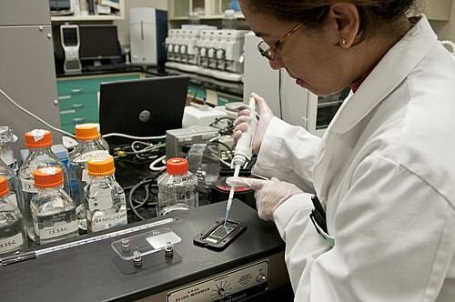

# INTOXICAÇÕES

As intoxicações exógenas representam uma das principais causas de atendimento em emergências pediátricas no Brasil. Para a sua prova de residência, você precisa entender que o cenário muda drasticamente conforme a idade: na criança pequena (geralmente menor de 5 anos), a intoxicação é acidental, envolve uma única substância e ocorre pela curiosidade natural de explorar o mundo com a boca. Já no adolescente, o cenário costuma ser de tentativa de autoextermínio, muitas vezes envolvendo múltiplas drogas e maior gravidade.

Aqui no MedEvo, sempre reforçamos: em toxicologia, tratamos o paciente, não o veneno. Se você decorar apenas antídotos e esquecer o suporte básico, vai errar a questão e, pior, comprometer o atendimento real.

*Figura 1 - Carvão ativado por via oral: medida de descontaminação gastrointestinal amplamente utilizada em intoxicações pediátricas, devendo ser administrado preferencialmente na primeira hora. Fonte: James Heilman, MD, CC BY-SA 3.0 | Wikimedia Commons*

## Abordagem Inicial: O ABCDE da Toxicologia

Antes de pensar em lavagem gástrica ou antídotos, você deve estabilizar o paciente. As bancas adoram colocar uma criança com rebaixamento de nível de consciência e perguntar qual o antídoto. Se a via aérea não estiver protegida, a resposta correta será sempre o suporte.

### Estabilização e Suporte

A prioridade absoluta é o ABC (Vias Aéreas, Respiração e Circulação). Se uma criança chega com bradicardia e hipotensão após ingerir a medicação da avó (um bloqueador de canal de cálcio, por exemplo), sua primeira conduta é garantir oxigenação e acesso venoso para expansão volêmica.

### Avaliação das Toxíndromes

Uma toxíndrome é um conjunto de sinais e sintomas que sugerem uma classe de substâncias. É o seu "atalho" diagnóstico quando a história é desconhecida.

- **Síndrome Colinérgica (Organofosforados e Carbamates):** Pense em "tudo molhado". O paciente apresenta miose, sialorreia, bradicardia, broncorreia, vômitos e diarreia. O diagnóstico é clínico, mas pode ser confirmado pela dosagem da acetilcolinesterase.

- **Síndrome Anticolinérgica (Atropina, Anti-histamínicos, Antidepressivos Tricíclicos):** É o oposto. O paciente está "seco como um osso, cego como um morcego, vermelho como uma beterraba e louco como uma lebre". Apresenta midríase, taquicardia, pele seca e quente, e agitação.

- **Síndrome Opioide (Morfina, Codeína, Fentanil):** A tríade clássica é miose puntiforme, depressão respiratória e rebaixamento de consciência.

- **Síndrome Simpaticomimética (Cocaína, Anfetaminas, MDMA/Ecstasy):** Muito parecida com a anticolinérgica, mas aqui o paciente tem sudorese profusa (em vez de pele seca) e hipertensão severa.

| Toxíndrome | Pupilas | Frequência Cardíaca | Pele/Mucosas | Exemplo de Substância |
| --- | --- | --- | --- | --- |
| Colinérgica | Miose | Bradicardia | Sudorese/Sialorreia | Inseticidas |
| Anticolinérgica | Midríase | Taquicardia | Seca e quente | Escopolamina |
| Opioide | Miose (Puntiforme) | Bradicardia | Normal/Pálida | Codeína |
| Simpaticomimética | Midríase | Taquicardia | Sudorese | MDMA (Ecstasy) |

## Descontaminação Gastrointestinal

Este é o ponto onde os alunos mais erram por quererem "limpar" o paciente a qualquer custo. Existem regras rígidas e contraindicações que caem em toda prova.

### Carvão Ativado

É o agente de descontaminação mais eficaz para a maioria das substâncias, especialmente salicilatos e paracetamol.

- **Tempo de ouro:** Deve ser administrado preferencialmente na primeira hora após a ingestão.

- **Dose:** 1 g/kg de peso.

- **O que ele NÃO adsorve:** Hidrocarbonetos, cáusticos, ferro, lítio e álcoois. Não adianta dar carvão para quem bebeu soda cáustica.

### Lavagem Gástrica

Cada vez menos utilizada. Só deve ser considerada se a ingestão ocorreu há menos de 1 hora e a substância for altamente tóxica ou não for adsorvida pelo carvão.

- **Contraindicação absoluta:** Ingestão de cáusticos (risco de perfuração) e hidrocarbonetos (risco de pneumonia aspirativa).

- **Proteção de via aérea:** Se o paciente estiver sonolento, você só faz lavagem após intubação orotraqueal.

### Contraindicações ao Esvaziamento Gástrico

Nunca induza o vômito (xarope de ipeca está em desuso). Se a questão trouxer uma criança que ingeriu um corrosivo, a conduta é: NÃO induzir vômito, NÃO tentar neutralizar com ácidos ou bases, oferecer água e buscar ajuda imediata.

## Intoxicações por Medicamentos Específicos

### Paracetamol

É a causa mais comum de insuficiência hepática aguda por medicamentos. O risco primário é a hepatotoxicidade.

- **Fisiopatologia:** O metabolismo do paracetamol gera o NAPQI, um metabólito tóxico que consome a glutationa do fígado.

- **Antídoto:** N-acetilcisteína (NAC). Ela atua restaurando os estoques de glutationa.

- **Conduta:** Se a ingestão foi importante, use o Nomograma de Rumack-Matthew (após 4 horas da ingestão) para decidir o início da NAC.

### Salicilatos (Aspirina)

Causam uma acidose metabólica com ânion-gap elevado (lembre-se do mnemônico MUDPILES).

- **Quadro clínico:** Taquipneia (pela estimulação direta do centro respiratório), vômitos, zumbido no ouvido e febre.

- **Tratamento:** Carvão ativado imediato e alcalinização urinária com bicarbonato de sódio para facilitar a excreção.

### Bloqueadores de Canais de Cálcio (BCC)

Esta é uma "pérola" frequente. A criança ingere o remédio de pressão do avô e chega com bradicardia, hipotensão e, curiosamente, hiperglicemia.

- **Por que a hiperglicemia?** Porque o cálcio é necessário para a liberação de insulina pelas células beta do pâncreas. O BCC bloqueia isso.

- **Tratamento:** Além do suporte, pode-se usar cálcio endovenoso, glucagon e a terapia de hiperinsulinemia-euglicemia.

### Descongestionantes Nasais (Nafazolina)

Muito comum em pediatria. A mãe pinga o remédio no nariz do lactente para "desentupir" e a criança apresenta bradicardia, sonolência e hipotermia. Isso ocorre pela estimulação de receptores alfa-2 adrenérgicos centrais (efeito semelhante à clonidina).

## Ingestão de Cáusticos e Corpos Estranhos

### Cáusticos (Ácidos e Álcalis)

Os álcalis (soda cáustica) são piores pois causam necrose de liquefação, que penetra profundamente nos tecidos. Os ácidos causam necrose de coagulação, que limita um pouco a penetração.

- **Conduta inicial:** Estabilizar, deixar em jejum, oferecer água para lavar a boca (se for logo após a ingestão).

- **Endoscopia Digestiva Alta (EDA):** Deve ser realizada entre 6 e 24 horas após a ingestão para avaliar a extensão das lesões. Não faça antes de 6h (pode não ter aparecido a lesão) nem após 48h (risco de perfuração pelo enfraquecimento da parede esofágica).

### Bateria de Lítio (Botão)

Isso é uma EMERGÊNCIA médica se estiver no esôfago. A bateria gera uma corrente elétrica que hidrolisa a água dos tecidos, gerando hidróxido de sódio (soda cáustica) e causando perfuração em poucas horas.

- **Conduta:** Se estiver no esôfago, remoção endoscópica IMEDIATA, mesmo se a criança estiver assintomática. Se já passou para o estômago e a criança é assintomática, pode-se observar a eliminação nas fezes (exceto se a bateria for muito grande ou a criança tiver sintomas).

## Acidentes por Animais Peçonhentos

Este tema é o "queridinho" das bancas brasileiras, especialmente o escorpionismo.

### Escorpionismo (Tityus serrulatus)

A gravidade depende da relação dose de veneno/peso corporal. Por isso, crianças menores de 7 anos são o grupo de maior risco para formas graves.

- **Classificação:**

- **Leve:** Apenas dor local e sudorese discreta. Conduta: Analgesia (compressas mornas, lidocaína local) e observação por 6 a 12 horas.

- **Moderado:** Dor intensa e sintomas sistêmicos leves (vômitos ocasionais, taquicardia, agitação). Conduta: Soro antiescorpiônico (2 a 3 ampolas) e internação.

- **Grave:** Vômitos profusos, sudorese, salivação, insuficiência cardíaca, edema agudo de pulmão (EAP) e choque. Conduta: Soro antiescorpiônico (6 ampolas) em ambiente de UTI.

- **Atenção:** O veneno escorpiônico causa uma tempestade autonômica (adrenérgica e colinérgica). A morte geralmente ocorre por falência cardíaca ou EAP. Distúrbios de coagulação NÃO são comuns no escorpionismo (diferente dos acidentes ofídicos).

### Aracnidismo

- **Loxoscelismo (Aranha Marrom):** A picada é pouco dolorosa no início. Depois de horas, surge a "placa livedoide" (eritema, isquemia e dor em queimação). Pode evoluir com hemólise intravascular e insuficiência renal aguda.

- **Foneutrismo (Aranha Armadeira):** Causa dor local imediata e intensa. Pode dar sintomas sistêmicos semelhantes ao escorpião.

### Acidentes Ofídicos

- **Botrópico (Jararaca):** O mais comum. Causa dor, edema, equimose e alteração da coagulação (sangramentos).

- **Crotálico (Cascavel):** Pense em neurotoxicidade e miotoxicidade. O paciente apresenta "fácies miastênica" (ptose palpebral, diplopia) e urina escura (mioglobinúria por rabdomiólise). O tempo de protrombina (TAP) costuma estar alterado.

- **Laquético (Surucucu):** Semelhante ao botrópico, mas com sintomas vagais (diarreia, bradicardia, hipotensão).

| Acidente | Manifestação Principal | Característica de Prova |
| --- | --- | --- |
| Escorpião | Autonômica (Vômitos/EAP) | Criança < 7 anos = Risco Grave |
| Jararaca | Local (Dor/Edema) | Sangramentos e Coagulopatia |
| Cascavel | Neuro/Miotóxica | Ptose palpebral e urina escura |
| Aranha Marrom | Necrose Local/Hemólise | Placa livedoide |

## Intoxicações por Plantas e Outros Agentes

### Comigo-ninguém-pode (Dieffenbachia)

É a principal causa de intoxicação por plantas em crianças menores de 3 anos. Ela contém cristais de oxalato de cálcio em forma de agulhas (ráfides). Ao mastigar, essas agulhas perfuram a mucosa, causando dor intensa, edema de lábios e língua, e sialorreia. O tratamento é sintomático (lavar com água, analgésicos).

### Naftalina

A ingestão de bolinhas de naftalina pode causar hemólise e meta-hemoglobinemia, especialmente em pacientes com deficiência de G6PD. O tratamento da meta-hemoglobinemia grave é feito com azul de metileno.

### Organofosforados e Carbamates (Chumbinho)

Causam a síndrome colinérgica. O antídoto é a **Atropina**, que deve ser dada em doses repetidas até a "atropinização" (melhora da broncorreia e da bradicardia). Para organofosforados (mas não para carbamates), pode-se usar a Pralidoxima para reverter a ligação do veneno com a enzima.

*Figura 2 - Análise toxicológica laboratorial: fundamental para confirmar a substância envolvida e guiar a escolha do antídoto específico nas intoxicações pediátricas. Fonte: U.S. FDA, Domínio Público | Wikimedia Commons*

## Antídotos que você DEVE memorizar

Como o Dr. Will sempre diz nas revisões do MedEvo, existem doses e antídotos que são "questão dada" se você tiver memorizado.

- **Opioides:** Naloxona (0,01 a 0,1 mg/kg).

- **Benzodiazepínicos:** Flumazenil (Cuidado: pode desencadear convulsões em usuários crônicos ou intoxicações mistas com tricíclicos).

- **Paracetamol:** N-acetilcisteína.

- **Ferro:** Desferroxamina (indicada se níveis séricos > 400-500 mcg/dL ou sintomas graves).

- **Meta-hemoglobinemia:** Azul de metileno (1 mg/kg em solução a 1%).

- **Organofosforados:** Atropina e Pralidoxima.

- **Betabloqueadores/BCC:** Glucagon, Cálcio e Insulina em altas doses.

## Pontos-Chave para Prova 💡

- **Prioridade no trauma/intoxicação:** Sempre o ABCDE. Não se distraia com o veneno se o paciente não respira.

- **Contraindicação ABSOLUTA de lavagem gástrica e carvão:** Ingestão de cáusticos (soda cáustica, ácidos fortes) e hidrocarbonetos (querosene, gasolina).

- **Janela do Carvão Ativado:** Idealmente na primeira hora.

- **Escorpionismo em crianças:** Vômitos profusos são sinal de gravidade iminente.

- **Diferença Cascavel vs. Jararaca:** Cascavel tem sintomas neurológicos (ptose) e urina escura; Jararaca tem muita inflamação local e sangramento.

- **Bateria de botão no esôfago:** É emergência endoscópica. No estômago de paciente assintomático, pode-se observar.

- **Tríade Opioide:** Miose puntiforme + Depressão respiratória + Coma. Antídoto: Naloxona.

- **Intoxicação por BCC:** Bradicardia + Hipotensão + Hiperglicemia.

- **Nafazolina (descongestionante):** Causa efeito "clonidina-like" em crianças (bradicardia e sonolência).

- **Antídoto do Paracetamol:** N-acetilcisteína (NAC).

- **Placa Livedoide:** Patognomônico de Loxoscelismo (Aranha Marrom).

- **Atropinização:** O objetivo no tratamento de organofosforados é secar a secreção pulmonar, não apenas aumentar a frequência cardíaca.

- **Cálculo de dose:** Lembre-se sempre de conferir a concentração da ampola. Azul de metileno a 1% significa 10 mg/ml. Se a dose é 1 mg/kg para uma criança de 10 kg, você fará 1 ml.

- **O que NÃO fazer em cáusticos:** Não induzir vômito, não passar sonda gástrica às cegas, não dar vinagre ou bicarbonato para "neutralizar".

- **Tempo de observação no escorpionismo leve:** Mínimo de 6 a 12 horas, pois a gravidade pode evoluir nesse período.

 Cópia offline para consulta pessoal.
 Fonte original:
 [https://www.medevo.com.br/material-apoio/ler/8332dc47-e5f7-422a-9626-9d926b1fb69c](https://www.medevo.com.br/material-apoio/ler/8332dc47-e5f7-422a-9626-9d926b1fb69c)
