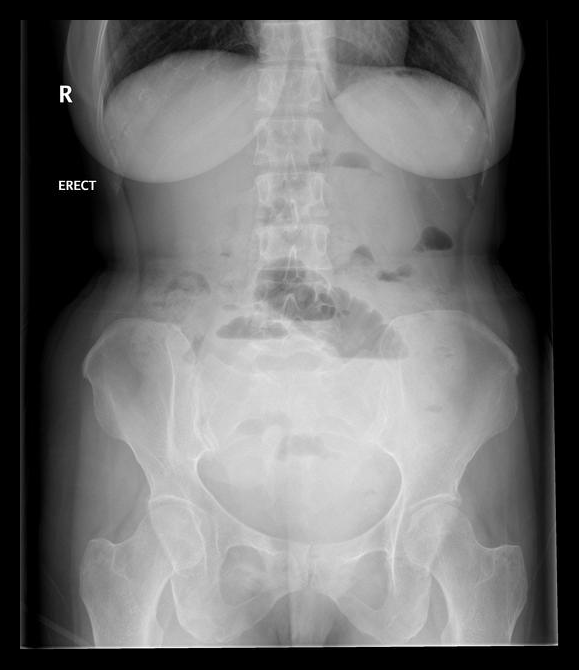
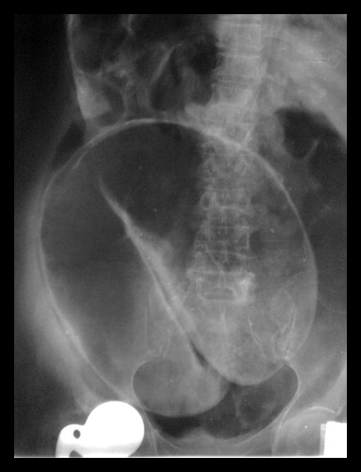
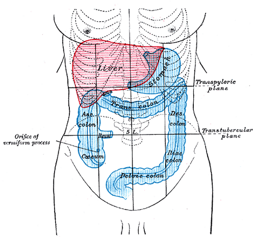

# INTRODUÇÃO AO ABDOME AGUDO

O abdome agudo não é um diagnóstico final, mas sim uma síndrome. Quando um paciente cruza a porta da emergência com dor abdominal súbita, não traumática, que exige uma decisão rápida (cirúrgica ou médica), estamos diante desse desafio. O seu papel como médico não é apenas dar um nome à doença, mas decidir: este paciente precisa de uma laparotomia agora ou posso observar?

Muitos alunos erram por tentarem decorar listas imensas de causas. O segredo aqui é entender a fisiopatologia da dor e os padrões clínicos. Se você entender como o peritônio reage, você mata 80% das questões de prova.

## Fisiopatologia da Dor Abdominal

Para entender o abdome agudo, você precisa dominar a diferença entre dor visceral e dor parietal. As bancas amam explorar isso porque é a base do diagnóstico diferencial.

### Dor Visceral

A dor visceral é transmitida por fibras C de condução lenta. Ela é estimulada pelo estiramento, distensão ou contração vigorosa das vísceras. Como a inervação das vísceras é bilateral e segue o desenvolvimento embriológico, a dor é vaga, mal localizada e geralmente referida na linha média.

- **Foregut (Intestino anterior):** Estômago, duodeno proximal, sistema hepatobiliar e pâncreas. A dor é referida no epigástrio.

- **Midgut (Intestino médio):** Do duodeno distal ao terço proximal do cólon transverso. A dor é periumbilical.

- **Hindgut (Intestino posterior):** Do restante do cólon ao reto. A dor é hipogástrica.

### Dor Parietal (Somática)

Aqui o jogo muda. A dor parietal é transmitida por fibras A-delta de condução rápida. Ela ocorre quando o processo inflamatório atinge o peritônio parietal. Esta dor é aguda, intensa e, o mais importante: **bem localizada**.

É por isso que na apendicite clássica a dor começa periumbilical (visceral) e depois "migra" para a fossa ilíaca direita (parietal). Quando o apêndice inflama a ponto de irritar a parede abdominal, a dor localiza.

**Dica de Prova:** Se o paciente tem dor que piora com o movimento ou tosse, ele tem irritação peritoneal (dor parietal). Se ele se retorce na maca sem achar posição, a dor é provavelmente visceral (como na cólica renal ou fases iniciais de obstrução).

### Dor Referida

É a dor sentida em um local distante do estímulo original, mas que compartilha o mesmo nível dermatômico. Um exemplo clássico é a dor da colecistite referida na escápula direita (sinal de Boas) ou a dor da irritação diafragmática referida no ombro (sinal de Kehr).

| Tipo de Dor | Fibra Nervosa | Localização | Característica |
| --- | --- | --- | --- |
| **Visceral** | Fibras C (lentas) | Linha média (vaga) | Cólica, peso, queimação |
| **Parietal** | Fibras A-delta (rápidas) | Localizada | Aguda, lancinante, piora ao mover |
| **Referida** | Compartilhamento medular | Distante da origem | Bem definida, mas em local "errado" |

## Classificação do Abdome Agudo

Didaticamente, dividimos o abdome agudo em cinco tipos principais. Essa classificação ajuda a organizar o raciocínio clínico e a conduta.

### 1. Abdome Agudo Inflamatório

É a causa mais comum. Exemplos: apendicite aguda (campeã de provas), colecistite, diverticulite e pancreatite.

- **Quadro clínico:** Dor de início gradual que aumenta de intensidade, acompanhada de febre e sinais de irritação peritoneal (como o sinal de Blumberg).

- **Pérola Clínica:** Na pancreatite aguda, a dor costuma ser "em barra" no andar superior do abdome, irradiando para o dorso. Lembre-se que a amilase e a lipase são fundamentais, mas a lipase é mais específica.

### 2. Abdome Agudo Perfurativo

Ocorre quando uma víscera oca se rompe (úlcera péptica, diverticulite perfurada, neoplasia).

- **Quadro clínico:** Dor súbita, "em facada", que rapidamente se torna generalizada. O paciente fica imóvel, com abdome em tábua.

- **Sinal de Jobert:** Perda da macicez hepática à percussão (substituída por timpanismo), indicando pneumoperitônio. Isso é indicação clássica de laparotomia exploradora.

- **Cuidado:** A úlcera duodenal perfurada gera pneumoperitônio em cerca de 75% dos casos. Se o RX estiver normal mas a suspeita for alta, peça uma TC.

## 3. Abdome Agudo Obstrutivo

Interrupção do trânsito intestinal. Pode ser por bridas (aderências pós-cirúrgicas - causa #1 no delgado), hérnias, tumores ou volvos.

- **Quadro clínico:** Dor em cólica, distensão abdominal, vômitos e parada de eliminação de gases e fezes.

- **Diferenciação no RX:** No delgado, vemos alças centralizadas com pregas coniventes (empilhamento de moedas). No cólon, as alças são periféricas com haustrações.

- **Volvo:** O volvo de sigmoide é comum em idosos e pacientes com megacólon chagásico. O RX mostra o sinal do "grão de café" ou "U invertido".

### 4. Abdome Agudo Vascular (Isquêmico)

O "terror" do cirurgião. Ocorre por embolia ou trombose dos vasos mesentéricos.

- **Perfil do paciente:** Idoso, com fibrilação atrial (FA) ou doença cardiovascular prévia.

- **O "Pulo do Gato":** A dor é desproporcional ao exame físico. O paciente grita de dor, mas o abdome está flácido e sem sinais de peritonite inicialmente. Quando surge a peritonite, a alça já necrosou.

### 5. Abdome Agudo Hemorrágico

Sangramento intra-abdominal (gravidez ectópica rota, ruptura de aneurisma de aorta, ruptura de baço).

- **Quadro clínico:** Dor abdominal + choque hipovolêmico (taquicardia, hipotensão, palidez).

## O Exame Físico: Onde os Alunos se Perdem

O exame físico no abdome agudo deve ser sistemático. Não pule etapas.

- **Inspeção:** Procure por cicatrizes cirúrgicas (pensar em bridas), abaulamentos (hérnias) ou circulação colateral.

- **Ausculta:** Deve ser feita ANTES da palpação. Ruídos hidroaéreos (RHA) aumentados e metálicos sugerem obstrução inicial. Silêncio abdominal sugere íleo paralítico ou peritonite avançada.

- **Percussão:** Pesquise o sinal de Jobert. A percussão dolorosa é um sinal muito sensível de irritação peritoneal, às vezes menos traumático que o Blumberg para o paciente.

- **Palpação:** Comece longe da dor.

- **Sinal de Blumberg:** Descompressão dolorosa no ponto de McBurney (apendicite).

- **Sinal de Rovsing:** Dor na fossa ilíaca direita (FID) ao comprimir a fossa ilíaca esquerda (FIE). Isso ocorre pelo deslocamento retrógrado de gases que distende o ceco inflamado.

- **Sinal de Murphy:** Interrupção da inspiração profunda durante a palpação do ponto cístico (colecistite).

**Exemplo Clínico:** Paciente de 70 anos, hipertenso e tabagista, chega com dor súbita em flanco esquerdo e massa pulsátil palpável. O que você faz? Não perca tempo com TC se ele estiver instável. Isso é Aneurisma de Aorta Abdominal (AAA) roto até que se prove o contrário. Estabilize e leve para a sala.

## Diagnóstico por Imagem: O que pedir?

Como ensina o Dr. Will no MedEvo, a imagem deve confirmar sua suspeita, não fazer o diagnóstico por você.

- **Rotina de Abdome Agudo (RX):** Inclui RX de tórax em pé (para ver cúpulas diafragmáticas), RX de abdome em pé e em decúbito. É excelente para ver pneumoperitônio e níveis hidroaéreos.

- **Ultrassonografia (USG):** Operador dependente. Ótima para doenças biliares (colecistite, coledocolitíase) e ginecológicas. Em crianças, é a primeira escolha para apendicite.

- **Tomografia Computadorizada (TC):** É o padrão-ouro para a maioria das causas de abdome agudo (diverticulite, pancreatite, isquemia mesentérica). Ela ajuda a definir a gravidade e complicações.

**Cuidado com a Pegadinha:** No abdome agudo perfurativo com menos de 12 horas de evolução, o paciente tem dor intensa e peritonismo, mas sinais de sepse ou insuficiência renal aguda (IRA) ainda não são habituais. Se a questão colocar um quadro hiperagudo com falência de órgãos, pense em algo vascular ou choque hemorrágico.

## Pseudo-Abdome Agudo: As Causas Clínicas

Muitas vezes, a dor abdominal não vem de um problema cirúrgico. Operar um paciente com cetoacidose diabética achando que é apendicite é um erro grave.

| Categoria | Exemplos Clássicos |
| --- | --- |
| **Metabólica** | Cetoacidose diabética, Uremia, Porfiria intermitente aguda |
| **Cardiopulmonar** | Infarto Agudo do Miocárdio (parede inferior), Pneumonia de base |
| **Hematológica** | Anemia falciforme (crise de sequestro/infarto esplênico) |
| **Infecciosa** | Herpes Zoster (fase pré-eruptiva), Febre Tifoide |
| **Tóxica** | Saturnismo (intoxicação por chumbo), Picada de aranha (Loxosceles) |

**Pérola de Prova:** A uremia é uma causa clássica de pseudo-abdome agudo. Sempre cheque a função renal e eletrólitos antes de indicar uma cirurgia duvidosa.

## Anatomia e Cirurgia: O que cai na prova

As bancas de cirurgia adoram anatomia aplicada. Vamos revisar pontos críticos:

### Esôfago e Divertículos

- **Divertículo de Zenker:** É um divertículo de **pulsão** que ocorre no triângulo de Killian (entre os músculos tireofaríngeo e cricofaríngeo). O tratamento envolve a miotomia do esfíncter esofagiano superior.

- **Divertículo Epifrênico:** Também de pulsão, associado a distúrbios motores (acalásia).

- **Divertículo de Médio Esôfago:** Geralmente por **tração** (causado por linfonodos inflamados, como na tuberculose). Se sintomático, exige manometria para avaliar distúrbio motor subjacente.

### Intestino Delgado e Cólon

- **Divertículo de Meckel:** É a anomalia congênita mais comum do TGI. É um remanescente do **ducto onfalomesentérico** (não do úraco!). Localiza-se no íleo terminal, na borda antimesentérica. Em adultos, a complicação mais comum é a obstrução; em crianças, é o sangramento (por mucosa gástrica ectópica).

- **Vascularização:** A Veia Porta é formada pela união da veia esplênica com a veia mesentérica superior. O jejuno tem poucas arcadas vasculares e vasos retos longos; o íleo tem muitas arcadas e vasos retos curtos.

- **Transição Anatômica:** O Ligamento de Treitz marca a transição duodenojejunal. A junção ileocecal é o fim do delgado.

### Manobras Cirúrgicas

- **Manobra de Kocher:** Mobilização do duodeno e cabeça do pâncreas para acessar o retroperitônio.

- **Manobra de Cattell-Braasch:** Rotação visceral medial direita para expor toda a extensão da veia cava inferior e aorta infra-renal.

## Situações Especiais e Complicações

### O Paciente Idoso

O idoso é um desafio diagnóstico. Ele costuma ter menos febre, menos leucocitose e a dor pode ser menos localizada devido à atrofia da musculatura abdominal. Causas comuns: isquemia mesentérica, AAA roto, colecistite e vólvulos. Torção de ovário é raríssima nessa faixa etária.

### Ascite e PBE

Em cirróticos com ascite e dor abdominal, você deve sempre suspeitar de Peritonite Bacteriana Espontânea (PBE).

- **Diagnóstico:** Paracentese com contagem de polimorfonucleares (PMN) > 250/mm³.

- **GASA:** Se o Gradiente de Albumina Soro-Ascite for > 1,1 g/dL, a causa é hipertensão portal.

### Complicações Pós-Operatórias

- **Retorno da Motilidade:** O intestino delgado volta a funcionar em 24h, o estômago em 48h e o cólon pode levar de 3 a 5 dias.

- **Evisceração:** Saída de vísceras pela ferida operatória. É uma emergência que requer retorno imediato ao bloco.

- **Textiloma (Corpo Estranho):** Esquecer uma compressa é um erro grave. Clinicamente, pode se manifestar como uma massa palpável ou obstrução intestinal tardia.

## Manejo Terapêutico: Quando Operar?

Nem todo abdome agudo é cirúrgico, mas quando é, a agilidade salva vidas.

-

**Indicações de Laparotomia de Urgência:**

- Pneumoperitônio (exceto se for pós-laparoscopia recente).

- Sinais claros de irritação peritoneal generalizada.

- Obstrução intestinal completa com sinais de sofrimento de alça (febre, leucocitose, dor constante).

- Instabilidade hemodinâmica em paciente com suspeita de sangramento intra-abdominal.

-

**Manejo Geral:**

- Jejum absoluto.

- Hidratação venosa vigorosa (reposição de perdas para o terceiro espaço).

- Sonda Nasogástrica (SNG) se houver vômitos ou distensão importante (alivia a pressão e previne aspiração).

- Antibioticoterapia: Deve ser iniciada precocemente no abdome agudo inflamatório ou perfurativo, focando em gram-negativos e anaeróbios.

**Cuidado com a VMNI:** A Ventilação Não Invasiva tem contraindicações absolutas importantes, como instabilidade hemodinâmica, apneia ou necessidade de proteção de via aérea (vômitos incoercíveis no abdome agudo).

## Tabelas Comparativas para Revisão

### Diagnóstico Diferencial de Dor por Quadrantes

| Quadrante Superior Direito | Quadrante Superior Esquerdo |
| --- | --- |
| Colecistite, Colangite, Abscesso Hepático, Pneumonia de base | Infarto Esplênico, Gastrite, Pancreatite, Pneumonia de base |
| **Quadrante Inferior Direito** | **Quadrante Inferior Esquerdo** |
| Apendicite, Doença de Crohn, Cisto de ovário, Gravidez ectópica | Diverticulite, Colite Isquêmica, Hérnia Inguinal encarcerada |

### Obstrução de Delgado vs. Cólon (Radiografia)

| Característica | Intestino Delgado | Intestino Grosso (Cólon) |
| --- | --- | --- |
| **Localização das alças** | Central | Periférica |
| **Pregas/Marcas** | Pregas coniventes (atravessam toda a alça) | Haustrações (não atravessam toda a alça) |
| **Diâmetro** | Menor (3-5 cm) | Maior (> 5 cm; Ceco > 9 cm é risco de ruptura) |
| **Níveis hidroaéreos** | Múltiplos e curtos | Poucos e longos |

### Tipos de Divertículos Esofágicos

| Tipo | Mecanismo | Localização | Associação |
| --- | --- | --- | --- |
| **Zenker** | Pulsão | Faringoesofágico (Triângulo de Killian) | Disfagia, Halitose, Idosos |
| **Médio-esofágico** | Tração | Terço médio | Tuberculose, Histoplasmose |
| **Epifrênico** | Pulsão | Acima do diafragma | Acalásia, Espasmo Esofágico Difuso |

## Pontos-Chave para Prova

- **Sinal de Jobert:** Timpanismo na região de macicez hepática = Pneumoperitônio = Cirurgia.

- **Sinal de Rovsing:** Compressão da FIE que dói na FID = Apendicite.

- **Isquemia Mesentérica:** Dor desproporcional ao exame físico em paciente com FA.

- **Divertículo de Meckel:** Remanescente do ducto onfalomesentérico, no íleo terminal, borda antimesentérica.

- **Divertículo de Zenker:** Divertículo de pulsão no triângulo de Killian; tratamento envolve miotomia do cricofaríngeo.

- **Pneumoperitônio:** A causa mais comum é a úlcera péptica perfurada.

- **Obstrução Intestinal:** A causa mais comum no delgado são as bridas; no cólon é o câncer colorretal.

- **Sinal de Murphy:** Parada da inspiração à palpação do ponto cístico = Colecistite Aguda.

- **Tríade Portal (Forame de Winslow):** Veia porta, artéria hepática e ducto colédoco formam a borda anterior.

- **GASA > 1,1:** Indica hipertensão portal. Se houver dor e PMN > 250 na ascite, trate como PBE.

- **Hérnia de Littré:** É aquela que contém o divertículo de Meckel dentro do saco herniário.

- **Bradicardia na Laparoscopia:** Causada pela insuflação rápida do pneumoperitônio (estímulo vagal). Conduta: Desinsuflar imediatamente.

- **Contraindicação Absoluta de VMNI:** Instabilidade hemodinâmica e necessidade de proteção de via aérea.

- **Sutura de Halsted:** Seromuscular interrompida, excelente para tecidos inflamados.

- **Cetoacidose Diabética:** Causa clássica de pseudo-abdome agudo; não opere antes de compensar o paciente.

- **Volvo de Sigmoide:** Sinal do grão de café no RX; emergência que pode exigir descompressão endoscópica ou cirurgia. 🩺

 Cópia offline para consulta pessoal.
 Fonte original:
 [https://www.medevo.com.br/material-apoio/ler/7db27233-d974-4438-af4a-4be86c5831e0](https://www.medevo.com.br/material-apoio/ler/7db27233-d974-4438-af4a-4be86c5831e0)
