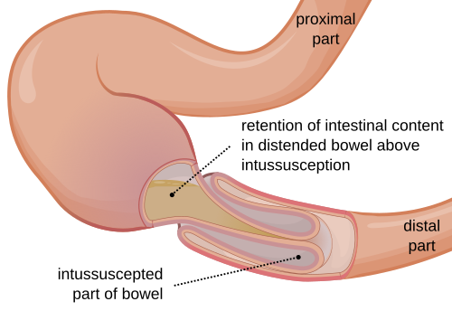
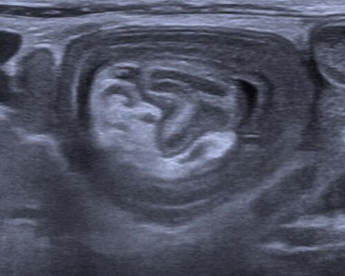

# INTUSSUSCEPÇÃO: DIAGNÓSTICO POR US E ENEMA TERAPÊUTICO

A intussuscepção intestinal, também chamada de invaginação, é a causa mais comum de obstrução intestinal em lactentes entre os 3 meses e os 2 anos de idade. Para entender o processo, imagine uma antena de rádio antiga ou um telescópio, onde uma parte desliza para dentro da outra. Na medicina, é exatamente isso que acontece: um segmento proximal do intestino (o intussuscepto) penetra no segmento distal (o intussuscipiente).

Por que isso acontece com tanta frequência nessa idade? Na grande maioria dos casos, cerca de 90%, a causa é idiopática. Acredita-se que o gatilho seja uma hiperplasia dos folículos linfoides na parede intestinal (as placas de Peyer), muitas vezes após uma infecção viral respiratória ou gastrointestinal. Esse tecido linfoide aumentado funciona como um "ponto de liderança" (lead point), que o peristaltismo acaba empurrando para frente, levando a parede intestinal junto.

*Figura 1 - Representação esquemática da intussuscepção: o segmento proximal (intussuscepto) penetra no segmento distal (intussuscipiente), causando obstrução e comprometimento vascular. Fonte: Olek Remesz, CC BY-SA 3.0 | Wikimedia Commons*

## Fisiopatologia: O Porquê da Gravidade

Quando o intestino entra dentro de si mesmo, ele não vai sozinho. Ele leva consigo o mesentério, que contém os vasos sanguíneos. À medida que a invaginação progride, ocorre primeiro uma compressão das veias e dos vasos linfáticos. Isso gera um edema importante na parede intestinal.

Se o quadro não for revertido, a pressão aumenta tanto que interrompe o fluxo arterial. O resultado é isquemia, necrose e, eventualmente, perfuração. É por isso que a intussuscepção é uma emergência: o tempo é o nosso maior inimigo para salvar aquela alça intestinal.

Um detalhe que o Dr. Will sempre reforça nas discussões clínicas: o sangramento clássico em "geleia de framboesa" ou "geleia de morango" não é um sinal precoce. Ele é o resultado desse edema venoso intenso que causa o extravasamento de muco e sangue para a luz intestinal. Se você esperar o sangue aparecer para dar o diagnóstico, pode estar chegando tarde demais.

## Quadro Clínico e a Famosa Tríade

Nas provas de residência, a descrição clássica é um prato cheio para as bancas. O paciente típico é um lactente previamente hígido, bem nutrido, que subitamente apresenta crises de choro inconsolável, fletindo as pernas sobre o abdome.

Essas crises são intermitentes. Por que intermitentes? Porque elas acompanham as ondas de peristaltismo que tentam "empurrar" a invaginação. Entre as crises, a criança pode parecer exausta ou até mesmo letárgica. Cuidado aqui: a letargia em um lactente com dor abdominal é um sinal de alerta altíssimo para intussuscepção e muitas vezes é confundida com sepse ou distúrbios neurológicos.

A tríade clássica cobrada em provas é composta por:

- Dor abdominal em cólica (intermitente e súbita).

- Massa abdominal palpável (geralmente em forma de salsicha).

- Fezes em "geleia de framboesa" (muco com sangue).

No entanto, preste atenção nesta pérola clínica: essa tríade completa só está presente em menos de 30% a 50% dos casos. Não espere a tríade para suspeitar. Se a questão descreve um lactente com vômitos (que inicialmente são alimentares e depois se tornam biliosos) e dor paroxística, sua primeira hipótese deve ser intussuscepção.

### O Exame Físico e o Sinal de Dance

Ao examinar a criança, procure a massa em forma de "salsicha" ou "cilindro", mais comumente localizada no hipocôndrio direito ou epigástrio. Um sinal clássico, porém difícil de encontrar na prática mas muito amado pelas bancas, é o Sinal de Dance: uma sensação de vazio na fossa ilíaca direita, já que o ceco e o íleo terminal "subiram" e se invaginaram em direção ao cólon transverso.

O toque retal é obrigatório na suspeita. Ele serve para identificar a presença de sangue ou muco (mesmo que não visível externamente) e, em casos raros e extremos, permite palpar a "cabeça" da invaginação se ela tiver progredido até o reto.

*Figura 2 - Imagem ultrassonográfica de intussuscepção intestinal mostrando o sinal do alvo (target sign) em corte transversal, achado patognomônico ao US. Fonte: Kalumet, CC BY-SA 3.0 | Wikimedia Commons*

## Diagnóstico por Imagem: O Padrão-Ouro

Aqui é onde muitos alunos perdem pontos preciosos. Se a questão pergunta qual o exame inicial, a radiografia simples de abdome pode ser citada, mas ela é pouco sensível. No RX, você pode ver sinais inespecíficos como distribuição gasosa anômala, efeito de massa ou, em casos graves, pneumoperitônio.

Agora, se a pergunta é sobre o padrão-ouro para o diagnóstico, a resposta é a Ultrassonografia (USG) de abdome. Segundo a literatura atual e as diretrizes de pediatria, a USG tem sensibilidade e especificidade próximas a 100% nas mãos de um examinador experiente.

### Achados Ultrassonográficos

Você precisa memorizar dois sinais principais que aparecem em quase todas as questões sobre o tema:

- Sinal do Alvo (ou Olho de Boi): Visualizado no corte transversal. São camadas concêntricas de diferentes ecogenicidades, representando as paredes do intestino e o mesentério invaginados.

- Sinal do Pseudorrim: Visualizado no corte longitudinal. A invaginação assume um aspecto que lembra um rim, devido às camadas de mucosa e serosa sobrepostas.

A USG também é fundamental para identificar se existe um "ponto de liderança" patológico, como um Divertículo de Meckel, um pólipo ou um tumor (como o Linfoma), o que é mais comum em crianças maiores de 2 anos.

### Tabela 1: Diagnóstico Diferencial de Obstrução e Dor Abdominal

| Patologia | Faixa Etária Típica | Características Clínicas | Achado de Imagem |
| --- | --- | --- | --- |
| **Intussuscepção** | 3 meses a 2 anos | Dor em cólica, massa em salsicha, fezes em geleia | USG: Sinal do Alvo |
| **Estenose Pilórica** | 3 a 6 semanas | Vômitos em jato não biliosos, oliva palpável | USG: Espessamento do piloro |
| **Vólvulo de Sigmoide** | Idosos (raro em crianças) | Distensão súbita, dor intensa | RX: Sinal do grão de café |
| **Divertículo de Meckel** | Qualquer idade | Sangramento retal indolor (geralmente) | Cintilografia com Tecnécio |
| **Apendicite Aguda** | Crianças maiores/Adolescentes | Dor em FID, febre, anorexia | USG ou TC: Apêndice espessado |

## O Enema Terapêutico: Redução Não Cirúrgica

Uma vez confirmado o diagnóstico e garantido que o paciente está estável (sem sinais de perfuração ou choque refratário), o tratamento de escolha é a redução não cirúrgica. Este é um dos poucos momentos na medicina onde o exame diagnóstico também é o tratamento.

Existem duas modalidades principais: o enema hidrostático (com soro ou contraste radiológico) e o enema pneumático (com ar). Atualmente, o enema pneumático é preferido em muitos centros por ser mais rápido, limpo e ter uma taxa de sucesso ligeiramente superior, além de facilitar a visualização de uma eventual perfuração.

### Técnica e Critérios de Sucesso

No enema pneumático, introduz-se uma sonda retal e aplica-se uma pressão controlada (geralmente entre 80 e 120 mmHg). O procedimento deve ser monitorado por fluoroscopia ou USG.

Como sabemos que funcionou? O critério de sucesso absoluto é o refluxo maciço de ar (ou contraste) para dentro do íleo terminal. Se você vir o ar passando da válvula ileocecal e preenchendo as alças delgadas, a invaginação foi reduzida.

Muitos alunos perguntam: "Professor, quantas vezes podemos tentar?". Na prática, costuma-se seguir a "regra dos três": três tentativas de redução, com duração de cerca de três minutos cada, com a pressão máxima permitida. Se após isso não houver redução, o tratamento deve ser cirúrgico.

### Contraindicações Absolutas ao Enema

Este é o ponto onde as bancas mais tentam te pegar. Você NUNCA deve realizar um enema se houver:

- Evidência de perfuração intestinal (pneumoperitônio no RX).

- Peritonite franca (abdome em tábua, descompressão brusca positiva).

- Choque hipovolêmico ou instabilidade hemodinâmica grave.

Nesses casos, o paciente deve ir direto para a laparotomia. Tentar um enema em um intestino já perfurado ou necrótico é catastrófico.

## Tratamento Cirúrgico: Quando Indicar?

A cirurgia está indicada em três situações principais:

- Falha na redução não cirúrgica após tentativas adequadas.

- Contraindicações ao enema (citadas acima).

- Suspeita de ponto de liderança patológico (ex: massa identificada na USG).

A técnica preferencial inicial é a redução manual (Manobra de Hutchinson), onde o cirurgião "ordenha" o intussuscepto para fora do intussuscipiente. Nunca se deve puxar a alça, pois o risco de laceração é enorme. Se a alça estiver necrótica ou a redução for impossível, realiza-se a enterectomia com anastomose primária.

*Figura 2 - Imagem ultrassonográfica de intussuscepção intestinal mostrando o sinal do alvo (target sign) em corte transversal, achado patognomônico ao US. Fonte: Kalumet, CC BY-SA 3.0 | Wikimedia Commons*

## Diagnósticos Diferenciais Importantes

Para dominar as questões de pediatria, você precisa diferenciar a intussuscepção de outras condições que causam vômitos e dor.

### Estenose Hipertrófica do Piloro (EHP)

Diferente da intussuscepção, a EHP ocorre em lactentes mais jovens (pico entre 3 e 6 semanas). O vômito é em jato e NUNCA é bilioso, pois a obstrução é acima da ampola de Vater. Na EHP, encontramos a "oliva pilórica" e o distúrbio metabólico clássico é a alcalose metabólica hipoclorêmica e hipocalêmica. No MedEvo, sempre lembramos: intussuscepção = vômito bilioso (frequentemente); EHP = vômito não bilioso.

### Divertículo de Meckel

É a causa mais comum de sangramento intestinal baixo em crianças. Pode ser o ponto de liderança para uma intussuscepção, mas seu quadro clássico é de sangramento retal indolor e maciço. Se a questão fala em "cintilografia com pertecnetato de tecnécio-99m", ela está falando de Meckel.

### Púrpura de Henoch-Schönlein (PHS)

Esta vasculite pode causar dor abdominal intensa e é um fator de risco para intussuscepção devido ao hematoma de parede intestinal que serve como ponto de liderança. Se a criança tem petéquias em membros inferiores, artralgia e dor abdominal, pense em PHS e fique atento à possibilidade de invaginação associada.

### Tabela 2: Enema Pneumático vs. Enema Hidrostático

| Característica | Enema Pneumático (Ar) | Enema Hidrostático (Líquido) |
| --- | --- | --- |
| **Material** | Ar ambiente | Soro fisiológico ou Contraste |
| **Pressão Máxima** | 120 mmHg | 100-120 cmH2O (altura da coluna) |
| **Vantagem** | Mais rápido, menor radiação | Disponibilidade em qualquer serviço |
| **Sinal de Sucesso** | Refluxo de ar para o íleo | Refluxo de contraste para o íleo |
| **Risco de Perfuração** | Menor, mas se ocorrer é tenso | Maior risco de peritonite química/fecal |

## Situações Especiais e Pegadinhas

### A Questão da Vacina do Rotavírus

Existe uma associação histórica entre a vacina do rotavírus e a intussuscepção. As vacinas atuais têm um risco extremamente baixo, mas ele existe, especialmente nos primeiros 7 dias após a primeira ou segunda dose. Por isso, existe uma idade máxima rigorosa para o início do esquema vacinal no Brasil (até 3 meses e 15 dias para a primeira dose). Se a questão menciona um lactente que vacinou há uma semana e agora tem dor abdominal, abra o olho!

### Intussuscepção em Crianças Maiores

Se o paciente tem mais de 2 ou 3 anos, a chance de existir uma causa anatômica (ponto de liderança) aumenta drasticamente. Pense em linfoma, pólipos ou divertículo de Meckel. Nesses casos, mesmo que a redução por enema funcione, a investigação da causa base é mandatória.

### Recorrência

Após uma redução bem-sucedida por enema, a taxa de recorrência é de cerca de 10%. A maioria ocorre nas primeiras 24 a 48 horas. Por isso, é prudente manter a criança em observação hospitalar, iniciando dieta leve após algumas horas de estabilidade. Se a dor voltar, a primeira conduta é repetir a USG.

### Tabela 3: Indicações de Cirurgia Imediata (Sem Enema)

| Achado Clínico/Radiológico | Justificativa |
| --- | --- |
| **Pneumoperitônio** | Indica perfuração de alça |
| **Sinais de Peritonite** | Indica sofrimento de alça ou necrose |
| **Choque Séptico/Hipovolêmico** | Paciente sem reserva para procedimento radiológico |
| **Ponto de Liderança Óbvio (ex: Tumor)** | A redução não resolverá a causa base |

## Manejo Inicial e Estabilização

Antes de mandar o paciente para a radiologia para o enema, você deve estabilizá-lo. Isso cai muito em questões de "conduta inicial".

- Jejum absoluto (NPO).

- Sonda Nasogástrica (SNG) aberta para descompressão (fundamental se houver vômitos importantes).

- Hidratação venosa vigorosa com cristaloide (corrigir desidratação e distúrbios eletrolíticos).

- Analgesia (com cautela, para não mascarar sinais de peritonite).

Lembre-se: o enema é um procedimento que envolve pressão. Se o paciente estiver desidratado e com a parede intestinal fragilizada, o risco de complicação aumenta. Estabilize primeiro, reduza depois.

## Complicações e Prognóstico

Se diagnosticada e tratada precocemente, o prognóstico da intussuscepção é excelente. A mortalidade é baixa em países desenvolvidos e em centros de referência. No entanto, o atraso no diagnóstico leva a:

- Necrose intestinal com necessidade de ressecção extensa (risco de síndrome do intestino curto).

- Sepse de foco abdominal.

- Choque e óbito.

Um erro comum que vejo alunos cometerem em simulados é negligenciar a febre. Se o lactente com suspeita de intussuscepção apresenta febre alta e leucocitose importante, isso sugere sofrimento de alça (isquemia/necrose). Esse paciente deve ser manejado com muito mais cautela e a indicação cirúrgica torna-se mais provável.

### Tabela 4: Achados de "Sofrimento de Alça" (Preditores de Falha no Enema)

| Parâmetro | Achado Sugestivo de Gravidade |
| --- | --- |
| **Clínica** | Febre, letargia profunda, descompressão brusca positiva |
| **Laboratório** | Leucocitose com desvio, acidose metabólica (lactato alto) |
| **USG** | Líquido livre entre as alças da invaginação, ausência de fluxo ao Doppler |
| **Tempo de Evolução** | Sintomas presentes há mais de 24-48 horas |

## Resumo da Conduta Passo a Passo

Para você não esquecer na hora da prova:

- Suspeita clínica (dor paroxística + vômitos + massa).

- Estabilização (SNG + Hidratação + Jejum).

- Confirmação por USG (Sinal do alvo).

- Avaliar contraindicações (Peritonite? Pneumoperitônio?).

- Se sem contraindicações: Enema Pneumático ou Hidrostático.

- Se sucesso: Observação 24h + Dieta progressiva.

- Se falha ou contraindicação: Cirurgia (Laparotomia ou Laparoscopia).

A laparoscopia tem ganhado espaço, mas a laparotomia ainda é muito cobrada como a via clássica, especialmente quando se prevê a necessidade de ressecção intestinal.

## Pontos-Chave para Prova

- A faixa etária clássica é de 3 meses a 2 anos. Fora dessa faixa, procure um "ponto de liderança" patológico.

- A causa mais comum é idiopática, associada à hiperplasia de placas de Peyer pós-infecção viral.

- A tríade clássica (dor, massa, geleia de framboesa) é incompleta na maioria dos casos.

- O sinal de Dance é o vazio na fossa ilíaca direita.

- O exame padrão-ouro para diagnóstico é a Ultrassonografia de abdome.

- No USG, procure pelos sinais do "alvo" (transversal) e "pseudorrim" (longitudinal).

- O tratamento de escolha é a redução não cirúrgica (enema pneumático ou hidrostático).

- O critério de sucesso do enema é o refluxo de ar/contraste para o íleo terminal.

- Contraindicações absolutas ao enema: pneumoperitônio e peritonite.

- A pressão máxima no enema pneumático deve ser de 120 mmHg para evitar perfuração iatrogênica.

- O vômito na intussuscepção costuma ser bilioso (obstrução baixa), ao contrário da Estenose Pilórica (vômito não bilioso).

- A vacina do rotavírus tem uma janela de aplicação rigorosa para minimizar o risco de intussuscepção.

- Se houver recorrência após o enema (10% dos casos), a conduta inicial é repetir a USG e tentar novo enema se indicado.

- Letargia em lactente com dor abdominal não é sono, é sinal de gravidade na invaginação.

- O Divertículo de Meckel é o ponto de liderança patológico mais comum em crianças.

- Em caso de cirurgia, a manobra de Hutchinson (compressão manual) é a técnica de redução. 🎯

 Cópia offline para consulta pessoal.
 Fonte original:
 [https://www.medevo.com.br/material-apoio/ler/4343b064-f87e-486c-aad0-52a2000aeb10](https://www.medevo.com.br/material-apoio/ler/4343b064-f87e-486c-aad0-52a2000aeb10)
