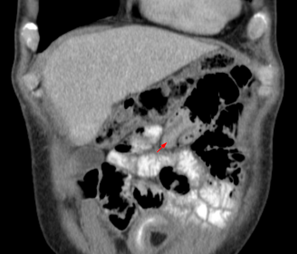

# INVAGINAÇÃO INTESTINAL: MANEJO CIRÚRGICO E COMPLICAÇÕES

A invaginação intestinal, ou intussusceção, é aquela clássica questão de prova que separa quem decorou uma tabela de quem entende a fisiopatologia do abdome agudo pediátrico. Para começar, você precisa visualizar o que está acontecendo: um segmento do intestino "entra" dentro do segmento distal, como se fosse o fechamento de uma luneta ou o recolhimento de uma antena de rádio. Esse processo de telescopagem não é apenas um problema mecânico de obstrução; é um evento vascular progressivo.

Quando o segmento proximal (intussusceptum) penetra no distal (intussuscipiens), ele leva consigo o mesentério. O que acontece primeiro? O retorno venoso é interrompido. Isso gera edema na parede intestinal. O edema aumenta a pressão, dificultando ainda mais o fluxo, até que a perfusão arterial é comprometida. É por isso que o tempo é o nosso maior inimigo aqui. Se não agirmos, o desfecho é isquemia, necrose e perfuração.

*Figura 1 - Esquema da invaginação intestinal: um segmento do intestino se invagina dentro do segmento distal, causando obstrução mecânica e comprometimento vascular progressivo. Fonte: Olek Remesz, CC BY-SA 3.0 | Wikimedia Commons*

## Fisiopatologia e o "Porquê" da Idade

A imensa maioria dos casos (cerca de 90%) ocorre em lactentes entre 3 meses e 3 anos de idade. Por que essa faixa etária? Aqui está o segredo: a causa costuma ser idiopática, mas associada à hiperplasia linfoide das placas de Peyer no íleo terminal, muitas vezes após uma infecção viral (como adenovírus ou rotavírus). Esse tecido linfoide aumentado funciona como o "ponto-guia" (lead point) que o peristaltismo acaba empurrando para dentro do cólon.

Agora, preste atenção: se a criança tem menos de 3 meses ou mais de 5 anos, seu radar para "ponto-guia anatômico" deve ligar imediatamente. Nesses casos, a invaginação raramente é "por acaso". Existe algo puxando o intestino: um Divertículo de Meckel, um pólipo, um linfoma ou até um hematoma de parede (comum na Púrpura de Henoch-Schönlein).

**Dica de Prova:** As bancas adoram colocar uma criança de 6 anos com invaginação. A resposta quase sempre passará pela investigação de uma causa secundária, sendo o Divertículo de Meckel o principal suspeito.

## O Quadro Clínico: Além da "Geleia de Framboesa"

Você já leu nos livros que o sinal clássico é a "geleia de framboesa" (ou groselha). Mas, como professor, eu te digo: se você esperar a geleia de framboesa aparecer para dar o diagnóstico, você chegou atrasado. Esse sinal representa a descamação da mucosa isquêmica misturada com muco e sangue; ou seja, já há sofrimento tecidual.

O quadro inicial é de uma dor abdominal súbita, tipo cólica, que faz o lactente encolher as pernas e chorar inconsolavelmente. O detalhe é o caráter intermitente: a criança chora por alguns minutos e, logo depois, parece estar bem, chegando a brincar ou dormir. Isso acontece porque a dor segue as ondas peristálticas que tentam "empurrar" a invaginação.

Ao exame físico, procure a "massa em chouriço" (ou salsicha), geralmente no quadrante superior direito ou epigástrio, enquanto a fossa ilíaca direita parece vazia (Sinal de Dance).

**Exemplo Clínico:** Lactente de 10 meses, previamente hígido, chega ao pronto-socorro com episódios de choro intenso há 6 horas, intercalados com períodos de letargia. A mãe relata um episódio de vômito bilioso. Ao examinar, você sente uma massa alongada no flanco direito. Este é o cenário perfeito para intussusceção.

### Tabela 1: Diagnóstico Diferencial da Dor Abdominal Aguda Pediátrica

| Patologia | Faixa Etária Típica | Características da Dor | Achados Marcantes |
| --- | --- | --- | --- |
| **Invaginação Intestinal** | 3 meses - 3 anos | Cólica súbita e intermitente | Massa em "chouriço", fezes em geleia |
| **Apendicite Aguda** | > 5 anos (raro em bebês) | Contínua, migra para FID | Febre, sinal de Blumberg |
| **Volvo de Sigmoide** | Idosos (raro em crianças) | Súbita e intensa | Distensão abdominal severa, RX em "U" invertido |
| **Diverticulite de Meckel** | Qualquer idade | Pode simular apendicite | Sangramento indolor ou obstrução |
| **Gastroenterite Aguda** | Qualquer idade | Cólica associada a evacuações | Diarreia volumosa, febre, vômitos |

*Figura 2 - TC de abdome em corte coronal demonstrando invaginação intestinal: a TC é indicada quando o US é inconclusivo ou em casos de suspeita de complicação. Fonte: Hellerhoff, CC BY-SA 3.0 | Wikimedia Commons*

## Diagnóstico por Imagem: O Padrão-Ouro

Não perca tempo com Raio-X se a suspeita for alta e o paciente estiver estável. O Raio-X pode mostrar sinais de obstrução (níveis hidroaéreos) ou o "sinal do alvo", mas tem baixa sensibilidade.

O exame de escolha é a **Ultrassonografia Abdominal**. Nas mãos de um radiologista experiente, a sensibilidade e especificidade beiram os 100%.

- **Sinal do Alvo (ou Casca de Cebola):** Visto no corte transversal. São as camadas das paredes intestinais sobrepostas.

- **Sinal do Pseudorrim:** Visto no corte longitudinal. A invaginação se assemelha à arquitetura renal.

**Cuidado:** No MedEvo, sempre reforçamos que, se o USG mostrar líquido livre em grande quantidade ou sinais de pneumoperitônio, o manejo muda completamente. O diagnóstico por imagem não serve apenas para confirmar a doença, mas para estratificar quem pode ir para o tratamento clínico e quem vai direto para a sala de cirurgia.

## Manejo Inicial e Estabilização

Antes de qualquer tentativa de redução, o paciente precisa estar "otimizado". Isso significa:

- **NPO (Nada por via oral):** O intestino está obstruído.

- **Sonda Nasogástrica (SNG):** Para descompressão, especialmente se houver vômitos biliosos.

- **Hidratação Venosa:** Expansão com Cristaloide (Soro Fisiológico 0,9% ou Ringer Lactato). Crianças com invaginação desidratam rápido pelo terceiro espaço e vômitos.

- **Antibioticoprofilaxia:** Segundo as diretrizes da Sociedade Brasileira de Pediatria (SBP), a antibioticoterapia deve ser iniciada se houver suspeita de translocação bacteriana ou se o paciente for para redução (seja ela radiológica ou cirúrgica). Geralmente utiliza-se Cefoxitina ou a associação de Ceftriaxone + Metronidazol.

## Tratamento Não Cirúrgico: A Redução Hidrostática ou Pneumática

Se o paciente está estável, sem sinais de peritonite e sem evidência de perfuração no Raio-X, a primeira escolha é a redução não cirúrgica.

Como o Dr. Will costuma explicar em aula, imagine que estamos tentando "empurrar" o intestino de volta para o lugar usando pressão. Podemos usar bário (raro hoje em dia pelo risco de peritonite química se perfurar), soro fisiológico (redução hidrostática) ou ar (redução pneumática).

**Critérios de Sucesso:**

- Desaparecimento da massa.

- Passagem do ar/contraste para o íleo terminal (o refluxo para o íleo é a prova de que desfez o "nó").

- Melhora clínica imediata da criança (ela para de chorar e muitas vezes cai em sono profundo).

**Contraindicações Absolutas à Redução Não Cirúrgica:**

- Peritonite (abdome em tábua, descompressão dolorosa).

- Pneumoperitônio (perfuração evidente).

- Choque hipovolêmico/séptico refratário.

## Manejo Cirúrgico: Quando a Faca é Necessária

Você precisa saber exatamente quando indicar a cirurgia, pois isso cai muito em prova. A cirurgia é indicada em três situações principais:

- Falha na redução não cirúrgica (após 2 ou 3 tentativas bem executadas).

- Contraindicações clínicas (peritonite/perfuração).

- Suspeita de ponto-guia anatômico (ex: massa vista no USG que sugere tumor ou Meckel).

### A Técnica Cirúrgica: Manobra de Hutchinson

O acesso padrão é a laparotomia transversa supraumbilical direita (incisão de Rockey-Davis ampliada ou técnica semelhante). Ao localizar a invaginação, o cirurgião realiza a **Manobra de Hutchinson**.

**Erro Clássico de Aluno:** Achar que devemos "puxar" o intestino proximal para fora do distal. **NUNCA faça isso.** Se você puxar, a serosa vai rasgar, pois o tecido está edemaciado e friável.
**O Correto:** Você deve "ordenhar" (milking) o segmento distal, empurrando o intussusceptum de volta para sua posição original. É uma pressão suave e constante de distal para proximal.

### Quando a Ressecção é Inevitável?

Se após a redução o intestino apresentar sinais de necrose (cor escura, ausência de peristaltismo, ausência de pulso arterial no mesentério), a ressecção segmentar com anastomose primária é mandatória.

Outra indicação de ressecção é a presença de um ponto-guia que não pode ser removido isoladamente, como um Divertículo de Meckel com base larga ou inflamado. Nesses casos, fazemos a ressecção segmentar do íleo incluindo a lesão.

### Tabela 2: Redução Não Cirúrgica vs. Cirúrgica

| Característica | Redução Não Cirúrgica (Pneumática/Hidrostática) | Redução Cirúrgica (Laparotomia/Laparoscopia) |
| --- | --- | --- |
| **Indicação Principal** | Casos idiopáticos, < 48h de evolução, estáveis | Falha da redução clínica, peritonite, instabilidade |
| **Vantagem** | Menor tempo de internação, sem cicatriz, menor custo | Permite tratar pontos-guia e avaliar viabilidade |
| **Risco Principal** | Perfuração durante o procedimento (1%) | Infecção de sítio cirúrgico, bridas, íleo prolongado |
| **Taxa de Recorrência** | Maior (cerca de 10%) | Menor (cerca de 1-3%) |

## O Caso Especial: Divertículo de Meckel

O Divertículo de Meckel é o remanescente do ducto onfalomesentérico. Ele é a causa mais comum de invaginação secundária.

**Pérola de Prova:** Se a questão descreve uma criança maior de 2 anos com quadro de obstrução intestinal por invaginação, ou se menciona um "volvo de divertículo", a conduta cirúrgica é quase sempre a ressecção. Se houver diverticulite de Meckel sem perfuração, a recomendação é a ressecção segmentar do íleo para garantir que todo o tecido ectópico (gástrico ou pancreático) seja removido.

## Complicações Pós-Operatórias

Ninguém quer que o paciente volte, mas você precisa estar preparado para as complicações:

- **Recorrência:** Acontece em até 10% dos casos após redução clínica e em cerca de 1-3% após cirurgia. A maioria ocorre nas primeiras 72 horas. Se a criança voltar a ter crises de choro no pós-operatório imediato, repita o USG.

- **Infecção do Sítio Cirúrgico (ISC):** Como em qualquer cirurgia abdominal pediátrica, a ISC é um risco. A antibioticoprofilaxia correta (1-2h antes da incisão) reduz drasticamente esse risco.

- **Obstrução por Bridas:** É uma complicação a longo prazo. Toda laparotomia em criança aumenta o risco de aderências futuras.

- **Íleo Adinamia:** Comum após a manipulação intestinal. O manejo é suporte, hidratação e paciência.

### Tabela 3: Antibioticoprofilaxia na Cirurgia Pediátrica (Diretrizes Gerais)

| Situação | Droga de Escolha | Dose (Pediátrica) | Momento da Administração |
| --- | --- | --- | --- |
| **Cirurgia Limpa-Contaminada** | Cefazolina ou Cefoxitina | 30-50 mg/kg (máx 2g) | 30-60 min antes da incisão |
| **Perfuração/Peritonite** | Ceftriaxone + Metronidazol | Ceft: 50-100 mg/kg; Metro: 30 mg/kg/dia | Imediato (Terapêutico) |
| **Repique (Dose de reforço)** | Mesma droga inicial | Metade da dose original | Se cirurgia > 3-4h ou perda volêmica > 15ml/kg |

## Situações Especiais e Pegadinhas

### A Invaginação que "Sai pelo Ânus"

Em casos extremos e negligenciados, a cabeça da invaginação pode progredir por todo o cólon e exteriorizar-se pelo ânus.
**Pegadinha de Prova:** A banca vai dizer que parece um prolapso retal. Como diferenciar? No prolapso retal, você não consegue introduzir o dedo ou uma sonda entre a massa e o esfíncter anal (o sulco é raso). Na invaginação exteriorizada, existe um espaço (sulco profundo) entre a massa e a parede do reto, permitindo a progressão do dedo.

### Invaginação de Intestino Delgado (Íleo-ileal)

Muitas vezes são achados incidentais no USG em crianças com dor abdominal inespecífica. Se forem curtas (< 3 cm) e o paciente estiver bem, elas costumam reduzir espontaneamente. Não confunda com a invaginação íleo-cólica (a clássica), que sempre precisa de intervenção.

### Tabela 4: Metas Terapêuticas e Seguimento

| Parâmetro | Meta no Pós-Operatório | Conduta se fora da meta |
| --- | --- | --- |
| **Diurese** | > 1 ml/kg/hora | Revisar hidratação venosa |
| **Dieta** | Aceitação em 24-48h (após retorno de ruídos) | Manter SNG, investigar íleo prolongado |
| **Dor** | Controlada com analgésicos simples | Escalonar para opioides se necessário |
| **Febre** | Ausente após 24h | Investigar ISC ou coleção intra-abdominal |

## O Porquê da Antibioticoprofilaxia

Muitos alunos perguntam: "Se a cirurgia é para reduzir o intestino, por que dar antibiótico?".
O motivo é a **translocação bacteriana**. O intestino isquêmico perde a integridade da barreira mucosa muito antes de necrosar. As bactérias da luz intestinal (Gram-negativos e anaeróbios) aproveitam essa "brecha" para atingir a corrente sanguínea. Por isso, a cobertura deve ser eficaz contra a flora intestinal.

Lembre-se: a dose de ataque deve ser feita na indução anestésica. Se a cirurgia demorar mais que duas meias-vidas do antibiótico (no caso da Cefazolina, cerca de 3-4 horas) ou se houver um sangramento importante (> 15-20% da volemia), você deve fazer o "repique" da dose.

## Pontos-Chave para Prova

- **Faixa Etária Clássica:** 3 meses a 3 anos (Idiopática). Fora dessa faixa, pense em Ponto-Guia (Meckel é o principal).

- **Tríade Clássica:** Dor abdominal em cólica intermitente + Massa palpável + Fezes em geleia de framboesa (presente em < 50% dos casos).

- **Diagnóstico de Escolha:** Ultrassonografia (Sinal do Alvo e Pseudorrim).

- **Primeira Escolha (Estável):** Redução não cirúrgica (Pneumática ou Hidrostática).

- **Contraindicações Absolutas à Redução Clínica:** Peritonite, Pneumoperitônio e Choque.

- **Manobra Cirúrgica:** Hutchinson (ordenhar/empurrar, nunca puxar).

- **Divertículo de Meckel:** Se for o ponto-guia ou estiver inflamado, a conduta é a ressecção segmentar do íleo.

- **Antibioticoprofilaxia:** Deve cobrir Gram-negativos e anaeróbios; administrar 30-60 min antes da incisão.

- **Diferencial de Prolapso:** Na invaginação exteriorizada, há um sulco profundo entre a massa e o ânus.

- **Recorrência:** Mais comum após redução clínica (10%) do que após cirurgia (1-3%).

- **Sinal de Dance:** Sensação de vazio na fossa ilíaca direita devido à migração do ceco.

- **Vômitos Biliosos:** Indicam obstrução intestinal estabelecida; exigem descompressão imediata com SNG.

- **O que NÃO fazer:** Tentar redução clínica em paciente com sinais de irritação peritoneal (risco altíssimo de perfuração e óbito).

- **Líquido Livre no USG:** Pequena quantidade é comum; grande quantidade sugere sofrimento vascular ou perfuração.

- **Ponto-guia em > 5 anos:** Sempre investigar Linfoma ou Divertículo de Meckel.

 Cópia offline para consulta pessoal.
 Fonte original:
 [https://www.medevo.com.br/material-apoio/ler/77ed90ab-a9ee-4777-bb22-d5ead23a4f45](https://www.medevo.com.br/material-apoio/ler/77ed90ab-a9ee-4777-bb22-d5ead23a4f45)
