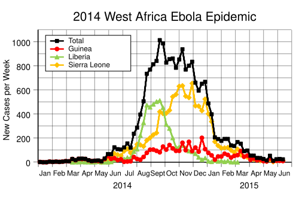

# INVESTIGAÇÃO DE SURTOS E RESPOSTA A EPIDEMIAS: DEFINIÇÃO DE CASO, SINAN E CONTROLE

Para entender vigilância epidemiológica, você precisa parar de pensar como o médico que atende um paciente por vez e começar a pensar como o médico que cuida de uma população inteira. Na prova de residência, o examinador quer saber se você consegue identificar quando um padrão de doença foge do normal e, principalmente, o que você vai fazer para impedir que isso se espalhe.

*Figura 1 - Curva epidêmica do surto de Ebola na África Ocidental (2014): exemplo clássico de diagrama de controle utilizado em investigação de surtos para monitorar a evolução temporal dos casos. Fonte: Delphi234, CC0 | Wikimedia Commons*

## O Diagrama de Controle e a Variação Temporal

Antes de investigarmos um surto, precisamos saber o que é "normal". Nenhuma doença ocorre de forma estática, existem flutuações esperadas. O instrumento que usamos para isso é o Diagrama de Controle. Ele é construído com base na média histórica de casos de uma doença nos últimos 10 anos (excluindo anos epidêmicos) e define o Limite Superior de Endemia.

Se o número de casos ultrapassa esse limite superior, entramos na fase de epidemia. Aqui surge o primeiro conceito que as bancas amam: a diferença entre surto e epidemia. Na prática epidemiológica, um surto é uma epidemia de proporções geográficas limitadas, como em uma creche, um hospital ou um bairro específico. Se a banca descreve um aumento repentino de casos em uma área restrita, marque "Surto". Se for algo disseminado por vários municípios ou estados, marque "Epidemia".

Lembre-se: para doenças erradicadas ou eliminadas, como a poliomielite ou o sarampo no Brasil, um único caso já configura um surto e exige resposta imediata. Não espere o segundo caso para notificar.

## As Etapas da Investigação de um Surto

Quando você é chamado para investigar um surto, existe um roteiro lógico. O Dr. Will sempre reforça que as bancas adoram trocar a ordem dessas etapas para confundir o candidato. O Guia de Vigilância em Saúde do Ministério da Saúde estabelece passos fundamentais:

- Confirmação do diagnóstico: O que as pessoas têm é realmente o que achamos que têm?

- Confirmação da existência do surto: Esse número de casos está acima do limite superior esperado?

- Caracterização da epidemia (Tempo, Lugar e Pessoa): Quem está adoecendo? Onde moram? Quando os sintomas começaram?

- Formulação de hipóteses preliminares: Qual a provável fonte? Qual o modo de transmissão?

- Busca ativa de casos: Não espere o paciente chegar. Vá atrás de quem pode estar infectado.

- Medidas de controle: Devem ser iniciadas assim que houver evidência suficiente, mesmo antes de terminar a investigação.

Um erro clássico de prova é dizer que devemos esperar a confirmação laboratorial de todos os casos para iniciar as medidas de controle. Errado. Se você tem um surto de diarreia em uma creche, você já orienta a higiene das mãos e investiga a água imediatamente, antes mesmo de sair o resultado da cultura de fezes.

## Definição de Caso: A Rede de Captura

Para investigar, você precisa definir quem você está procurando. A definição de caso não é necessariamente o diagnóstico clínico definitivo, mas sim um critério padronizado para a investigação.

### Caso Suspeito

É a definição mais sensível. Queremos "pescar" todo mundo que possa ter a doença. Por exemplo, na COVID-19, qualquer pessoa com febre e tosse era um caso suspeito. A alta sensibilidade serve para não deixar ninguém passar, mesmo que tragamos alguns "falsos positivos" inicialmente.

### Caso Provável

É o suspeito que apresenta vínculos epidemiológicos claros (contato com alguém confirmado) ou exames inespecíficos alterados, mas ainda sem a confirmação laboratorial padrão-ouro.

### Caso Confirmado

Pode ser confirmado por critério laboratorial (o mais comum em provas) ou por critério clínico-epidemiológico. Este último é fundamental: se estamos no meio de uma epidemia de Dengue e um paciente apresenta febre, dor retro-orbitária e exantema, ele pode ser confirmado apenas pelo vínculo epidemiológico, sem precisar de sorologia. Isso economiza recursos e agiliza o manejo.

### Caso Descartado

Aquele que, após investigação, não preencheu os critérios ou teve diagnóstico laboratorial negativo para o agente em questão.

Cuidado com o conceito de Caso Alóctone. Se o paciente mora em Curitiba, mas pegou Dengue em uma viagem ao Rio de Janeiro, para a vigilância de Curitiba ele é um caso alóctone (veio de fora). O caso Autóctone é aquele originado na própria localidade. As bancas usam isso para testar se você sabe identificar a circulação viral local.

*Figura 2 - Investigação laboratorial em saúde pública: a confirmação laboratorial dos casos é etapa fundamental na investigação de surtos e alimenta sistemas como o SINAN. Fonte: U.S. FDA, Domínio Público | Wikimedia Commons*

## SINAN: O Sistema Nervoso da Vigilância

O Sistema de Informação de Agravos de Notificação (SINAN) é onde os dados ganham vida. Ele é alimentado principalmente pela Ficha Individual de Notificação (FIN), preenchida no momento da suspeita, e pela Ficha Individual de Investigação (FII), preenchida durante o acompanhamento do caso.

A notificação compulsória é um dever de todo profissional de saúde. Atenção: a notificação deve ser feita na suspeita. Esperar o resultado do exame para notificar é um erro que as bancas exploram exaustivamente.

### Periodicidade da Notificação

Existem duas velocidades no SINAN:

- Notificação Imediata (até 24 horas): Para doenças com alto potencial de disseminação ou gravidade (Ex: Raiva humana, Peste, Sarampo, Varíola dos macacos/Mpox, COVID-19 hospitalizada). Deve ser feita para a Secretaria Municipal de Saúde por telefone, e-mail ou sistema eletrônico.

- Notificação Semanal (até 7 dias): Para doenças de curso mais lento ou controle crônico (Ex: Hanseníase, Tuberculose, Sífilis).

Tabela 1: Exemplos de Notificação Compulsória (Lista Nacional)

| Agravo | Periodicidade | Observação |
| --- | --- | --- |
| Acidente por animal peçonhento | Semanal | Exceto se grave ou óbito (vira imediata) |
| Botulismo | Imediata | Emergência de saúde pública |
| Dengue (casos simples) | Semanal | Em epidemia, o fluxo pode mudar |
| Dengue (óbito) | Imediata | Todo óbito por arbovirose é imediato |
| Sarampo | Imediata | Um único caso é emergência |
| Tuberculose | Semanal | Foco no acompanhamento do tratamento |

## Indicadores de Saúde em Surtos

Para medir a força de um surto, usamos coeficientes específicos. O mais importante é a Taxa de Ataque. Ela nada mais é do que uma taxa de incidência aplicada a uma população bem definida em um curto período de tempo.

Taxa de Ataque = (Número de casos novos / População exposta ao risco) x 100.

Se em um jantar com 100 pessoas, 30 comeram a maionese e ficaram doentes, a taxa de ataque entre os que comeram a maionese é de 30%. Isso nos ajuda a identificar a fonte de infecção.

Outro indicador vital é a Letalidade. Ela mede a gravidade da doença.
Letalidade = (Número de óbitos pela doença / Número de casos da doença) x 100.
Diferencie de Mortalidade, que usa a população total no denominador. A letalidade diz: "de quem ficou doente, quantos morreram?".

## Medidas de Controle e Bloqueio

O controle visa interromper a cadeia de transmissão. Podemos atuar em três níveis:

### 1. No Reservatório/Fonte de Infecção

Isolamento do doente e tratamento precoce. No caso da Tuberculose, a busca ativa de sintomáticos respiratórios (quem tosse há mais de 3 semanas, ou menos se pertencer a grupos de risco) é a medida de maior impacto na incidência, pois retira a fonte de transmissão da comunidade. Na Febre Tifoide, o tratamento com antibióticos deve ser acompanhado do afastamento profissional de manipuladores de alimentos para evitar novos surtos.

### 2. Na Transmissão (Meio Ambiente)

Aqui entram as precauções.

- Gotículas: Para agentes maiores que 5 micras (Ex: Meningite meningocócica, Influenza, Sarampo nos primeiros contatos). Exige máscara cirúrgica para o profissional.

- Aerossóis: Para agentes menores que 5 micras que flutuam no ar (Ex: Tuberculose, Varicela, Sarampo). Exige máscara PFF2/N95 e quarto com pressão negativa.

- Contato: Para patógenos multirresistentes, Cólera ou Escabiose. Exige luvas e avental.

No MedEvo, sempre lembramos: a COVID-19 transmite-se principalmente por gotículas e contato, mas procedimentos que geram aerossóis (intubação, ventilação não invasiva) exigem proteção respiratória N95 obrigatoriamente.

### 3. No Hospedeiro Suscetível (Bloqueio)

Aqui o foco é a quimioprofilaxia e a vacinação de bloqueio.

#### O Caso do Sarampo

O sarampo é altamente contagioso (transmissão por aerossóis). A medida de controle padrão é a Vacinação de Bloqueio. Ela deve ser feita em até 72 horas após o contato com o caso suspeito. Se o contato for um imunodeprimido, gestante ou lactente menor de 6 meses, não usamos a vacina (vírus vivo), mas sim a Imunoglobulina padrão em até 6 dias.

#### O Caso da Meningite Meningocócica

A quimioprofilaxia visa eliminar o estado de portador assintomático na nasofaringe e interromper a cadeia.

- Quem recebe? Contatos íntimos (quem mora na mesma casa, dormitórios de colégios, namorados) ou profissionais de saúde que realizaram procedimentos de risco sem EPI (ex: intubação).

- O que usar? A droga de escolha é a Rifampicina (600mg 12/12h por 2 dias em adultos). Alternativas incluem Ceftriaxone (dose única IM, preferencial em gestantes) ou Ciprofloxacino (dose única oral, apenas para adultos).

Tabela 2: Quimioprofilaxia para Doença Meningocócica

| Droga | Dose Adulto | Dose Criança | Esquema |
| --- | --- | --- | --- |
| Rifampicina | 600 mg | 10 mg/kg (<1 mês: 5mg/kg) | 12/12h por 2 dias |
| Ceftriaxone | 250 mg IM | 125 mg IM | Dose única |
| Ciprofloxacino | 500 mg VO | Não recomendado rotineiramente | Dose única |

## Vigilância de Doenças Específicas: Pérolas de Prova

### Dengue

A notificação é compulsória. O manejo é guiado por sinais de alarme. Se o paciente apresenta dor abdominal intensa, vômitos persistentes ou queda de plaquetas brusca, ele é Grupo C. Isso exige internação e hidratação parenteral imediata (10 ml/kg na primeira hora). Não espere o resultado do NS1 ou sorologia para tratar.

### Enterobíase (Oxiuríase)

Comum em creches. A transmissão é fecal-oral direta ou por fômites (roupas de cama). Os ovos de *Enterobius vermicularis* são muito resistentes no ambiente. O tratamento deve ser coletivo (toda a família ou toda a sala da creche) e repetido após 2 semanas, devido ao ciclo de autoinfestação.

### Hanseníase

A vigilância foca no exame de contatos. Todo contato domiciliar de um caso novo deve ser examinado. Se não tiver sinais de doença, recebe uma dose de vacina BCG para reforçar a imunidade celular, independentemente do histórico vacinal prévio (respeitando as contraindicações da BCG).

### Tuberculose

Lembre-se da Investigação de Contatos (ILTB). Se um contato de paciente bacilífero tem teste tuberculínico (PT ou IGRA) positivo, mas radiografia de tórax normal e está assintomático, ele tem Infecção Latente. O tratamento de escolha atual no Brasil é a Rifampicina por 4 meses ou Isoniazida por 6 a 9 meses, dependendo do protocolo local e idade.

## Vigilância Ativa vs. Passiva

Este é um conceito teórico que cai muito.

- Vigilância Passiva: É o que acontece na maioria das vezes. O serviço de saúde espera a notificação chegar (o médico preenche a ficha e envia). É mais barata, mas sofre com a subnotificação.

- Vigilância Ativa: A autoridade de saúde vai até o local (hospitais, laboratórios, comunidades) buscar os dados. É usada em situações de surto ou para doenças em fase de erradicação.

- Vigilância Sentinela: Usa unidades de saúde selecionadas para monitorar a ocorrência de determinados agravos (como a Síndrome Gripal). Não tenta contar todos os casos do país, mas sim identificar tendências e tipos de vírus circulantes.

## Biossegurança e Triagem em Desastres

Em situações de grandes surtos ou desastres com múltiplas vítimas, usamos o método START (Simple Triage and Rapid Treatment).

- Vermelho (Imediato): Vítima com risco de vida, mas com chance de sobrevida (ex: desconforto respiratório grave, hemorragia não controlada).

- Amarelo (Urgente): Lesões graves, mas que podem aguardar um pouco (ex: fraturas expostas estáveis).

- Verde (Leve): "Walking wounded". Vítimas que deambulam. Podem aguardar horas pelo atendimento.

- Preto (Óbito/Expectante): Sem respiração mesmo após manobras básicas ou lesões incompatíveis com a vida.

Tabela 3: Precauções de Isolamento

| Tipo de Precaução | Medida Necessária | Exemplos de Doenças |
| --- | --- | --- |
| Padrão | Higiene das mãos, luvas se risco de fluido | Todos os pacientes |
| Contato | Avental e luvas | KPC, Escabiose, Cólera, Clostridium |
| Gotículas | Máscara cirúrgica | Meningite, Coqueluche, Influenza |
| Aerossóis | Máscara N95/PFF2, Quarto Privativo | TB, Sarampo, Varicela, Herpes Zoster disseminado |

## Investigação de Surtos Hospitalares (IRAS)

As Infecções Relacionadas à Assistência à Saúde (IRAS) também geram surtos. A primeira medida ao suspeitar de um surto nosocomial (ex: várias infecções de corrente sanguínea por *Klebsiella* em uma UTI) é notificar a CCIH (Comissão de Controle de Infecção Hospitalar) e iniciar a investigação epidemiológica para identificar a fonte comum (pode ser um lote de soro contaminado, um profissional com técnica inadequada ou falha na esterilização).

O isolamento de contato para pacientes colonizados por germes multirresistentes é a pedra angular para evitar a disseminação horizontal dentro do hospital.

## O Papel do Médico na Resposta a Epidemias

Você, como médico assistente, é a ponta da lança. A qualidade do dado epidemiológico do Brasil depende da sua caneta (ou teclado). Se você atende um caso de Monkeypox (Mpox) e não notifica imediatamente, você impede que a vigilância faça o rastreamento de contatos e bloqueie a transmissão.

Lembre-se do exemplo da COVID-19: o rastreamento e monitoramento de contatos (contact tracing) foram fundamentais para "achatar a curva". Identificar quem esteve exposto e isolar preventivamente antes que a pessoa comece a transmitir (já que na COVID a transmissão ocorre antes dos sintomas, ao contrário do Ebola) é a estratégia de ouro.

Tabela 4: Comparativo de Transmissibilidade

| Doença | Período de Transmissibilidade | Principal Medida de Controle |
| --- | --- | --- |
| Sarampo | 4 dias antes a 4 dias após o exantema | Vacinação de bloqueio |
| Ebola | Apenas após o início dos sintomas | Isolamento rigoroso e EPI |
| COVID-19 | Inicia 48h antes dos sintomas | Isolamento e uso de máscaras |
| Influenza | 1 dia antes até 7 dias após sintomas | Vacinação anual e Etiqueta Respiratória |

## Pontos-Chave para Prova

- Surto vs. Epidemia: Surto é local/restrito; Epidemia é ampla. Um caso de doença erradicada já é surto.

- Notificação Compulsória: Deve ser feita na SUSPEITA clínica, sem esperar exames.

- SINAN: Sistema oficial. FIN (notificação) e FII (investigação).

- Meningite Meningocócica: Quimioprofilaxia para contatos íntimos com Rifampicina (escolha) ou Ceftriaxone (gestantes).

- Sarampo: Vacina de bloqueio em até 72 horas para contatos suscetíveis.

- Taxa de Ataque: Incidência em população fechada (Ex: (Doentes / Expostos) x 100).

- Letalidade: (Óbitos / Casos da doença) x 100. Mede a gravidade do agente.

- Diagrama de Controle: Define o limite superior de endemia. Acima dele = Epidemia.

- Busca Ativa: Medida de vigilância ativa para encontrar casos que não chegaram ao serviço.

- Isolamento de Aerossóis: N95/PFF2 para TB, Sarampo e Varicela.

- Dengue: Notificação semanal para casos simples, mas imediata para óbitos. Sinais de alarme exigem hidratação venosa imediata.

- Caso Alóctone: Doença contraída fora do local de residência/notificação.

- Triagem START: Verde para quem anda; Vermelho para prioridade máxima (respiração/circulação comprometida).

- Hanseníase: Contatos domiciliares recebem BCG se não houver sinais da doença.

- Ebola: Transmissão só ocorre com sintomas presentes (diferente da COVID-19 e Influenza).

- Biossegurança: Procedimentos geradores de aerossóis em doenças respiratórias exigem N95 mesmo que a doença seja habitualmente por gotículas. 🛡️

 Cópia offline para consulta pessoal.
 Fonte original:
 [https://www.medevo.com.br/material-apoio/ler/1bc5a821-8d20-43ef-a3f1-b6188db9ccda](https://www.medevo.com.br/material-apoio/ler/1bc5a821-8d20-43ef-a3f1-b6188db9ccda)
