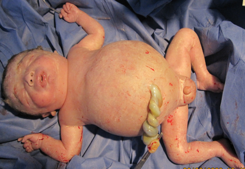
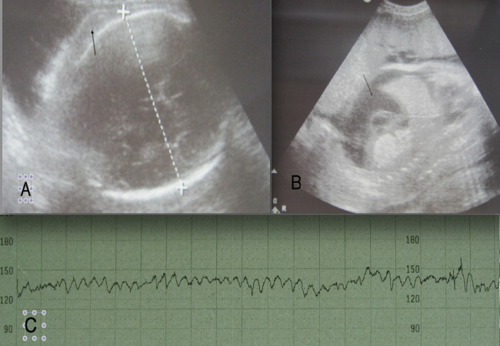

# ISOIMUNIZAÇÃO RH E PROFILAXIA ANTI-D

A isoimunização Rh é um dos temas mais clássicos da obstetrícia em provas de residência, e o motivo é simples: trata-se de uma patologia quase totalmente evitável. Quando você encontrar uma questão sobre isso, a banca quer saber se você conhece o protocolo de prevenção ou se sabe manejar o feto que já está sofrendo as consequências da hemólise.

Para entender este tema, você precisa visualizar a cena: uma mãe Rh negativo, que não possui o antígeno D em suas hemácias, entra em contato com o sangue de um feto Rh positivo. O sistema imune dela olha para aquele antígeno D e diz: "Isso é estranho, preciso atacar". É aqui que a cascata começa.

*Figura 1 - Hidropisia fetal por eritroblastose: forma mais grave da doença hemolítica perinatal por incompatibilidade Rh, com edema generalizado e insuficiência cardíaca. Fonte: Benkerroum Zineb et al., CC BY 4.0 | Wikimedia Commons*

## O Sistema Rh e a Fisiopatologia da Sensibilização

O sistema Rh é composto por vários antígenos (C, c, E, e, D), mas o antígeno D é o grande vilão das provas. Quando dizemos que alguém é "Rh positivo", estamos afirmando que essa pessoa possui o antígeno D na superfície de suas hemácias. Ele é extremamente imunogênico, o que significa que tem uma facilidade enorme de despertar a produção de anticorpos em quem não o possui.

A isoimunização ocorre quando uma mulher Rh negativa (dd) é exposta ao antígeno D. Essa exposição geralmente acontece através de uma hemorragia fetomaterna. O sistema imune materno produz, inicialmente, anticorpos da classe IgM. Aqui está a primeira "pegadinha" de prova: a IgM é uma molécula grande, um pentâmero, e por isso não atravessa a placenta. É por esse motivo que a isoimunização raramente afeta a primeira gestação.

O problema real surge na resposta secundária. Após o primeiro contato, a mãe passa a produzir anticorpos IgG. Estes, sim, são pequenos, monômeros, e atravessam a barreira placentária com facilidade. Em uma gestação subsequente com um feto Rh positivo, esses anticorpos IgG maternos cruzam a placenta, ligam-se às hemácias fetais e as marcam para destruição no baço fetal.

### Por que o feto fica doente?

A destruição das hemácias (hemólise) gera dois problemas principais para o feto:

- Anemia: A perda de hemácias reduz a capacidade de transporte de oxigênio. Para compensar, o coração fetal aumenta o débito cardíaco (o que veremos no Doppler mais adiante). Se a anemia for grave, o fígado e o baço tentam assumir a produção de sangue (hematopoiese extramedular), o que causa hepatosplenomegalia e desvia a função sintética do fígado, reduzindo a produção de albumina.

- Hiperbilirrubinemia: A quebra da hemoglobina gera bilirrubina indireta. No útero, a placenta limpa essa bilirrubina para a mãe. O perigo real da icterícia é após o nascimento, quando o recém-nascido precisa lidar com essa carga sozinho, podendo desenvolver o Kernicterus (encefalopatia bilirrubínica).

## Rastreio e Diagnóstico Inicial no Pré-natal

Todo pré-natal de baixo risco começa com a tipagem sanguínea e o fator Rh. Se a paciente for Rh positivo, o assunto "isoimunização Rh" se encerra para ela. O foco do nosso estudo é a gestante Rh negativo.

Se a gestante é Rh negativo, o próximo passo obrigatório é solicitar o Teste de Coombs Indireto (Pesquisa de Anticorpos Irregulares). Como o Dr. Will sempre reforça em suas discussões no MedEvo, o Coombs Indireto mede os anticorpos livres no soro materno.

### Cenário A: Coombs Indireto Negativo

Se o Coombs Indireto for negativo, a paciente ainda não está sensibilizada. Ela é uma "candidata" à profilaxia. O manejo aqui é vigilância:

- Repetir o Coombs Indireto com 28, 32, 36 e 40 semanas (alguns protocolos sugerem mensalmente).

- Se em algum momento o Coombs positivar, ela mudou de categoria.

- Se permanecer negativo, seguimos para a profilaxia com imunoglobulina anti-D.

### Cenário B: Coombs Indireto Positivo

Se o Coombs vier positivo, a primeira coisa a fazer é identificar qual é o anticorpo. Nem todo anticorpo causa doença hemolítica. Por exemplo, o anticorpo Anti-Lewis (IgM) não atravessa a placenta e não causa dano ao feto. O que nos preocupa é o Anti-D.

Uma vez identificado o Anti-D, precisamos da titulação. A titulação nos diz a "quantidade" de anticorpos.

- Títulos baixos (abaixo de 1:16 na maioria dos serviços): O risco de anemia fetal grave é baixo. Conduta: Repetir a titulação a cada 2 a 4 semanas.

- Títulos críticos (maior ou igual a 1:16): Aqui o jogo muda. A partir de 1:16, a titulação perde o valor preditivo para gravidade. Não adianta mais ficar pedindo títulos. O próximo passo é a avaliação da anemia fetal por métodos biofísicos.

Cuidado: Se a paciente já teve um filho anterior com doença hemolítica grave ou hidropisia, o título atual não importa. Ela já entra direto no protocolo de investigação de anemia fetal, independentemente do valor do Coombs.

## Avaliação da Anemia Fetal: O Doppler da Artéria Cerebral Média

Antigamente, usávamos a amniocentese para medir a bilirrubina no líquido amniótico (Gráfico de Liley). Esqueça isso para a prática moderna e para as provas atuais. O padrão-ouro hoje é o Doppler da Artéria Cerebral Média (ACM).

Por que a ACM? Quando o feto está anêmico, ele tenta proteger o órgão mais nobre: o cérebro. Ocorre uma vasodilatação cerebral (efeito "brain sparing") e, como o sangue está mais diluído (menos hemácias = menor viscosidade), ele flui mais rápido.

O parâmetro que medimos é o Pico de Velocidade Sistólica (PVS) da ACM.

- O resultado é expresso em Múltiplos do Mediana (MoM).

- Valor de corte: PVS > 1,5 MoM para a idade gestacional.

Se o Doppler mostrar um valor acima de 1,5 MoM, a suspeita de anemia fetal moderada a grave é altíssima. A conduta, então, é o diagnóstico definitivo e possivelmente o tratamento via cordocentese.

### Tabela 1: Interpretação do Doppler de ACM

| Valor do PVS (ACM) | Significado Clínico | Conduta Sugerida |
| --- | --- | --- |
| < 1,5 MoM | Ausência de anemia grave | Repetir Doppler em 1 a 2 semanas |
| ≥ 1,5 MoM | Suspeita de anemia moderada/grave | Cordocentese (padrão-ouro) |

## Cordocentese e Transfusão Intrauterina

A cordocentese é o procedimento de escolha para confirmar a anemia. Através dela, coletamos o sangue diretamente do cordão umbilical para medir o hematócrito e a hemoglobina fetal.

Se confirmada a anemia (hematócrito < 30%), o tratamento é realizado no mesmo momento: a Transfusão Intrauterina (TIU). O objetivo é manter o feto no útero até que ele atinja uma idade gestacional segura para o nascimento, geralmente em torno de 34 a 35 semanas.

Lembre-se: a hidropisia fetal (ascite, derrame pleural, edema de pele) é o estágio final e mais grave da doença. Quando o feto chega nesse ponto, a mortalidade é altíssima. O objetivo do Doppler é intervir antes da hidropisia aparecer.

*Figura 2 - Monitoramento ecográfico fetal na isoimunização Rh: edema do escalpo e ascite são sinais de hidropisia fetal, indicando anemia grave e necessidade de transfusão intrauterina. Fonte: Benkerroum Zineb et al., CC BY 4.0 | Wikimedia Commons*

## Profilaxia com Imunoglobulina Anti-D

Este é o tópico que mais cai em provas. A profilaxia consiste em administrar anticorpos anti-D prontos para a mãe. Esses anticorpos vão "limpar" as hemácias fetais Rh positivo que caíram na circulação materna antes que o sistema imune dela as perceba e comece a produzir seus próprios anticorpos.

### Quando administrar a Imunoglobulina?

Existem dois momentos principais: a profilaxia anteparto e a profilaxia pós-parto.

- Profilaxia Pós-parto (A mais importante):
Deve ser feita se a mãe for Rh negativo, o Coombs Indireto for negativo e o recém-nascido for Rh positivo com Coombs Direto negativo.

- Prazo ideal: Até 72 horas após o parto.

- Pode ser feita até 28 dias após o parto? Sim, mas a eficácia cai drasticamente após as primeiras 72 horas.

-

Profilaxia Anteparto de Rotina:
Recomendada pela FEBRASGO e pelo Ministério da Saúde para todas as gestantes Rh negativo não sensibilizadas (Coombs negativo) com 28 semanas de gestação. Isso porque pequenos sangramentos silenciosos podem ocorrer no terceiro trimestre.

-

Situações de Risco (Eventos Hemorrágicos):
Sempre que houver risco de contato sanguíneo entre feto e mãe em uma gestante Rh negativo não sensibilizada:

- Abortamento, gravidez ectópica ou mola hidatiforme.

- Sangramentos da segunda metade da gestação (DPP, placenta prévia).

- Procedimentos invasivos (amniocentese, biópsia de vilo corial).

- Trauma abdominal (mesmo que pareça leve).

- Versão cefálica externa.

### O Teste de Kleihauer-Betke

Em casos de grandes hemorragias fetomaternas (como em traumas graves ou DPP), a dose padrão de 300 mcg de imunoglobulina pode não ser suficiente. O teste de Kleihauer-Betke quantifica a porcentagem de hemácias fetais na circulação materna, permitindo calcular a dose exata de anti-D necessária. Uma ampola de 300 mcg neutraliza cerca de 30 ml de sangue fetal total (ou 15 ml de hemácias puras).

### Tabela 2: Indicações de Imunoglobulina Anti-D

| Situação | Condição Necessária | Conduta |
| --- | --- | --- |
| Pré-natal (28 semanas) | Mãe Rh- e Coombs Indireto negativo | 300 mcg IM |
| Pós-parto | Mãe Rh-, Coombs Indireto neg, RN Rh+ | 300 mcg IM (até 72h) |
| Abortamento / Ectópica | Mãe Rh- e Coombs Indireto negativo | 300 mcg IM (ou 50 mcg se < 12 sem) |
| Trauma / Sangramento | Mãe Rh- e Coombs Indireto negativo | 300 mcg IM |

## Incompatibilidade ABO vs. Incompatibilidade Rh

As bancas adoram colocar as duas no mesmo cenário para você confundir. A incompatibilidade ABO é muito mais comum, mas geralmente muito menos grave que a Rh.

Na incompatibilidade ABO, a mãe é tipicamente do grupo O e o recém-nascido é A ou B. A mãe já possui anticorpos anti-A e anti-B da classe IgG naturalmente (sem precisar de exposição prévia). Por isso, a incompatibilidade ABO pode ocorrer já na primeira gestação.

### Tabela 3: Diferencial entre Incompatibilidade Rh e ABO

| Característica | Incompatibilidade Rh | Incompatibilidade ABO |
| --- | --- | --- |
| Frequência | Menos comum | Muito comum |
| Gravidade | Pode ser muito grave (Hidropisia) | Geralmente leve a moderada |
| Primeira gestação | Raramente afetada | Pode ser afetada |
| Tipo sanguíneo materno | Rh negativo | Grupo O |
| Tipo sanguíneo fetal | Rh positivo | Grupo A ou B |
| Coombs Direto (RN) | Fortemente positivo | Negativo ou fracamente positivo |
| Esferócitos no sangue | Raros | Comuns |

Um detalhe importante: a incompatibilidade ABO "protege" parcialmente contra a isoimunização Rh. Se uma mãe O negativo tem um feto A positivo, caso ocorra hemorragia fetomaterna, os anticorpos anti-A naturais da mãe destroem as hemácias fetais rapidamente, antes que o sistema imune dela reconheça o antígeno D. No entanto, essa proteção não é absoluta e não muda a conduta de fazer a profilaxia anti-D.

## Manejo da Icterícia Neonatal

A icterícia é a manifestação clínica mais comum da doença hemolítica. O ponto fundamental para a prova é o tempo de aparecimento.

- Icterícia nas primeiras 24 horas de vida é SEMPRE patológica.

- Se o RN tem icterícia precoce, anemia e reticulocitose, pense em hemólise.

O tratamento inicial é a fototerapia. A luz converte a bilirrubina indireta (lipossolúvel e neurotóxica) em lumirrubina (hidrossolúvel), que é excretada. Em casos graves, onde a bilirrubina sobe muito rápido apesar da fototerapia, indica-se a exsanguíneotransfusão.

Cuidado para não confundir com a "Icterícia do Aleitamento Materno" (por baixa ingesta calórica nos primeiros dias) ou a "Icterícia pelo Leite Materno" (substâncias no leite que aumentam a circulação entero-hepática). Ambas costumam ser mais tardias e não apresentam anemia ou Coombs positivo.

## Erros Comuns e Pegadinhas de Prova

Um erro clássico é achar que, se a gestante recebeu a imunoglobulina com 28 semanas, ela não precisa receber após o parto. Isso está errado. A dose de 28 semanas protege o final da gestação, mas o maior risco de troca sanguínea é no parto. Se o RN for Rh positivo, ela deve receber uma nova dose.

Outra pegadinha: a paciente recebeu a imunoglobulina e, alguns dias depois, o Coombs Indireto veio positivo (título baixo, tipo 1:2 ou 1:4). Isso é esperado. São os anticorpos que você injetou circulando no sangue dela. Isso não significa que ela se sensibilizou "de verdade". A conduta é manter o seguimento normal.

Lembre-se também que a imunoglobulina só funciona se a paciente for Coombs Indireto NEGATIVO. Se o Coombs já é positivo (ex: 1:32), a paciente já está sensibilizada. Dar a vacina agora é como "trancar a porta depois que o ladrão já entrou". Não tem benefício.

### Exemplo Clínico Rápido

Paciente, G2P1 (parto normal há 3 anos), Rh negativo, Coombs Indireto atual positivo (1:4). Na gestação anterior, não recebeu imunoglobulina. Qual a conduta?
Resposta: Como o título é baixo (< 1:16), você deve repetir a titulação em 2 a 4 semanas. Se o título subir para 1:16 ou mais, você inicia o Doppler de ACM. Não se faz profilaxia agora porque o Coombs já é positivo.

E se essa mesma paciente tivesse um Coombs Indireto negativo e sofresse um acidente de carro com 20 semanas?
Resposta: Você administra a Imunoglobulina Anti-D imediatamente (300 mcg) para evitar que ela se sensibilize devido ao trauma.

## Situações Especiais: O Parceiro e o Feto

Se a gestante é Rh negativa, mas o pai do feto também é Rh negativo (com certeza absoluta de paternidade), o feto será obrigatoriamente Rh negativo. Nesse caso, não há risco de isoimunização e não há necessidade de Coombs seriado ou profilaxia. No entanto, na dúvida ou em provas, se não mencionarem o Rh do pai, trate como se ele fosse positivo.

Atualmente, existe o exame de Genotipagem Fetal (RHD fetal) no sangue materno (DNA fetal livre). Se disponível, ele pode evitar o uso desnecessário de imunoglobulina e o estresse de exames seriados se descobrirmos que o feto é Rh negativo. Se o feto for Rh negativo, a gestante é manejada como se fosse Rh positivo.

## Pontos-Chave para Prova 🧠

- O antígeno D é o mais importante e imunogênico do sistema Rh.

- A primeira gestação geralmente é poupada porque a resposta inicial é IgM (não cruza a placenta).

- Coombs Indireto é o exame de rastreio na gestante; Coombs Direto é feito no recém-nascido (detecta anticorpos grudados nas hemácias).

- Título crítico para iniciar investigação de anemia fetal: 1:16 (ou história de filho anterior com hidropisia).

- Doppler de Artéria Cerebral Médica (ACM): Padrão-ouro para rastrear anemia fetal. Valor de corte > 1,5 MoM.

- Cordocentese: Padrão-ouro para diagnóstico definitivo e acesso para transfusão intrauterina.

- Profilaxia anteparto: Realizada com 28 semanas em gestantes Rh negativo não sensibilizadas.

- Profilaxia pós-parto: Realizada em até 72 horas se RN for Rh positivo e mãe Coombs Indireto negativo.

- Eventos de risco (aborto, trauma, sangramento): Sempre indicar imunoglobulina se a mãe for Rh negativo não sensibilizada.

- Incompatibilidade ABO: Mãe O, RN A ou B. Pode ocorrer na primeira gestação. Esferócitos são comuns no sangue periférico do RN.

- Icterícia precoce (< 24h): Sempre patológica, investigar hemólise.

- Contraindicação ABSOLUTA de Imunoglobulina Anti-D: Gestante já sensibilizada (Coombs Indireto positivo por anticorpo anti-D real, com títulos elevados).

- Anticorpo Anti-Lewis: É IgM, não causa doença hemolítica perinatal. Não confunda com Anti-Kell ou Anti-Duffy, que são IgG e podem ser graves.

- Se a mãe recebeu Anti-D recentemente, o Coombs Indireto pode positivar em títulos baixos (é o anticorpo passivo). Isso NÃO contraindica novas doses se houver indicação.

- A dose padrão de 300 mcg de Anti-D protege contra até 30 ml de sangue fetal total. Em traumas graves, use o teste de Kleihauer-Betke para calcular a dose.

 Cópia offline para consulta pessoal.
 Fonte original:
 [https://www.medevo.com.br/material-apoio/ler/8317f293-4f8b-4d0f-a5c6-a7129854852d](https://www.medevo.com.br/material-apoio/ler/8317f293-4f8b-4d0f-a5c6-a7129854852d)
