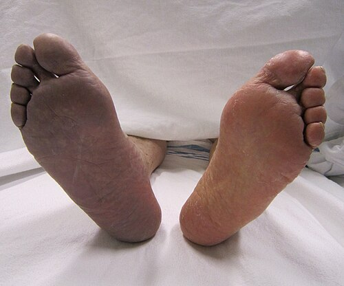
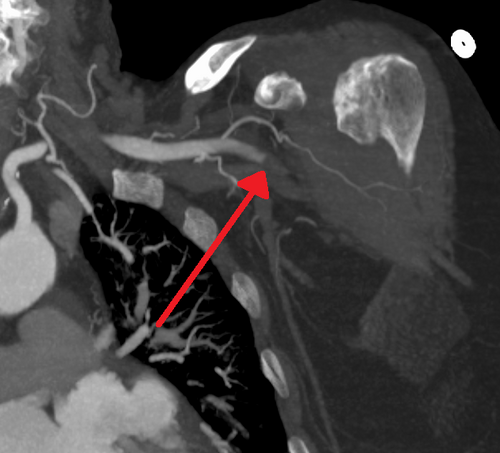

# ISQUEMIA DE MEMBRO AGUDA E CRÔNICA

Para entender a cirurgia vascular, você precisa parar de pensar em "canos entupidos" e começar a pensar em **fluxo e viabilidade tecidual**. Nas provas de residência, o examinador não quer apenas que você saiba o nome da artéria; ele quer que você decida, sob pressão, se aquele membro ainda tem salvação ou se o paciente vai direto para a amputação.

Nesta aula, vamos dividir o mundo em dois: a isquemia que se instala lentamente (Crônica) e a catástrofe que acontece de repente (Aguda).

## Isquemia Arterial Crônica: A Doença Arterial Obstrutiva Periférica (DAOP)

A DAOP é, na imensa maioria das vezes, o reflexo sistêmico da aterosclerose. Se o paciente tem placa na perna, ele provavelmente tem placa na coronária e na carótida. Por isso, o tratamento da DAOP não é só para a perna; é para o paciente não infartar.

*Figura 1 - Isquemia aguda de membro inferior: cianose distal à oclusão arterial por trombose aguda do membro inferior direito, demonstrando o sinal clássico de palidez/cianose dos 6P. Fonte: James Heilman, MD, CC BY-SA 3.0 | Wikimedia Commons*

## Fisiopatologia e Fatores de Risco

A placa aterosclerótica vai reduzindo a luz do vaso. O corpo, em sua sabedoria, tenta criar **circulação colateral**. É por isso que a isquemia crônica demora a manifestar sintomas graves. Os principais fatores de risco que você encontrará nos enunciados são: tabagismo (o mais forte), diabetes mellitus (que altera a microcirculação e calcifica a camada média), hipertensão e dislipidemia.

**Dica do Dr. Will:** Se a questão trouxer um homem jovem, tabagista pesado, com isquemia distal (mãos e pés) e fenômeno de Raynaud, esqueça a aterosclerose. Pense em **Tromboangeíte Obliterante (Doença de Buerger)**. É uma vasculite inflamatória de pequenos e médios vasos, não aterosclerótica.

### Quadro Clínico: A Progressão de Fontaine e Rutherford

O sintoma clássico é a **Claudicação Intermitente**. O paciente caminha, a demanda de oxigênio do músculo aumenta, o fluxo fixo (pela estenose) não supre, o músculo entra em metabolismo anaeróbio, produz lactato e dói. Ele para, a dor passa.

Cuidado: a "distância útil" é quanto ele caminha até a dor começar. Se ele caminha menos de 200 metros, a doença é mais grave (Fontaine IIb).

Para a prova, você precisa dominar as classificações. Elas ditam a conduta.

| Estágio Fontaine | Clínica | Categoria Rutherford | Clínica |
| --- | --- | --- | --- |
| I | Assintomático | 0 | Assintomático |
| IIa | Claudicação leve (> 200m) | 1 | Claudicação leve |
| IIb | Claudicação moderada/grave (< 200m) | 2 e 3 | Claudicação moderada a grave |
| III | Dor em repouso | 4 | Dor em repouso |
| IV | Lesão trófica (úlcera/gangrena) | 5 e 6 | Perda tecidual (pequena ou grande) |

**O que é Isquemia Crítica?** É o paciente nos estágios Fontaine III e IV (ou Rutherford 4, 5 e 6). Aqui, o risco de perda de membro é altíssimo. O ITB (Índice Tornozelo-Braquial) costuma estar abaixo de 0,4.

*Figura 2 - Angiotomografia demonstrando oclusão aguda da artéria axilar: o exame de imagem é fundamental para localizar o nível de obstrução e planejar a revascularização. Fonte: James Heilman, MD, CC BY-SA 4.0 | Wikimedia Commons*

## Diagnóstico: O Poder do Exame Físico e do ITB

O diagnóstico da DAOP é clínico. No exame físico, você busca:

- **Pulsos:** Ausência de pulsos distais (pedioso, tibial posterior) ou proximais (femoral, poplíteo).

- **Sopros:** Indicam fluxo turbulento por estenose.

- **Alterações tróficas:** Pele fina, queda de pelos, unhas quebradiças, palidez à elevação do membro e rubor à dependência (hiperemia reativa).

O **Índice Tornozelo-Braquial (ITB)** é a ferramenta de rastreio favorita das bancas. Você usa um esfigmomanômetro e um Doppler portátil (ou estetoscópio, em locais com poucos recursos).

- **Cálculo:** Maior pressão sistólica no tornozelo (pediosa ou tibial posterior) dividida pela maior pressão sistólica braquial.

- **Valores:**

- 1,0 a 1,4: Normal.

- 0,91 a 0,99: Limítrofe.

- < 0,90: Diagnóstico de DAOP.

- < 0,40: Isquemia Crítica.

- > 1,40: Artérias incompressíveis (comum em diabéticos por calcificação da camada média - aqui o ITB perde a utilidade e usamos o Índice Hálux-Braquial).

### Tratamento da DAOP

Aqui as bancas adoram te pegar. O tratamento depende do estágio.

**1. Tratamento Clínico (Para todos, especialmente Fontaine II):**

- **Cessação do tabagismo:** Mandatório.

- **Caminhada supervisionada:** O melhor estímulo para criar circulação colateral. Orientação: caminhar até a dor, parar, esperar passar e continuar. Mínimo 30-45 min, 3x por semana.

- **Antiagregação plaquetária:** Aspirina (75-100mg) ou Clopidogrel (75mg) para reduzir risco cardiovascular.

- **Estatinas:** Meta de LDL agressiva (< 55 mg/dL em alto risco).

- **Cilostazol (100mg 2x/dia):** Um inibidor da fosfodiesterase III que promove vasodilatação e reduz proliferação intimal. Melhora a distância de caminhada. **Contraindicação absoluta: Insuficiência Cardíaca de qualquer grau.**

**2. Tratamento Cirúrgico (Revascularização):**
Indicado para:

- Isquemia Crítica (dor em repouso ou lesão trófica).

- Claudicação limitante que não melhora com tratamento clínico e impede o trabalho/vida do paciente.

**Atenção no Pé Diabético:** Se o paciente tem uma úlcera infectada e isquemia crítica (ITB < 0,5), a regra de ouro é: **Revascularizar primeiro** para garantir que o sangue chegue, e depois realizar o desbridamento ou amputação menor. Sem sangue, não há cicatrização nem chegada de antibiótico.

## Isquemia Arterial Aguda (OAA)

Aqui o tempo é músculo. A OAA é a interrupção súbita do fluxo sanguíneo para um membro. Diferente da crônica, aqui não deu tempo de formar colaterais.

### Etiologia: O Grande Duelo (Embolia vs. Trombose)

Saber diferenciar se foi um êmbolo ou um trombo define sua conduta inicial e o prognóstico.

| Característica | Embolia | Trombose |
| --- | --- | --- |
| **Início** | Súbito (segundos/minutos) | Gradual (horas/dias) |
| **História Prévia** | Sem claudicação prévia | História de claudicação |
| **Fonte Emboligênica** | Fibrilação Atrial (FA), IAM recente | Aterosclerose sistêmica |
| **Exame Físico** | Pulsos normais no membro contralateral | Pulsos ausentes/diminuídos no outro membro |
| **Localização** | Bifurcações (Art. Femoral Comum é o #1) | Locais de placa prévia |

**Pérola de Prova:** Se a questão descreve um paciente com FA que de repente sente dor excruciante e a perna fica branca e fria: é **Embolia**. Se é um fumante de longa data que já mancava e a dor piorou muito nas últimas 12 horas: é **Trombose**.

### O Quadro Clínico: Os 6 Ps

Você deve decorar isso como se fosse seu nome. Na isquemia aguda, buscamos:

- **Pain (Dor):** Geralmente o primeiro sintoma.

- **Pallor (Palidez):** O membro fica "branco como cera".

- **Pulselessness (Ausência de pulso):** Fundamental para o diagnóstico.

- **Paresthesia (Parestesia):** Indica sofrimento do nervo (isquemia nervosa).

- **Paralysis (Paralisia/Paresia):** Sinal de gravidade extrema. Músculo morrendo.

- **Poikilothermia (Poiquilotermia):** O membro assume a temperatura ambiente (fica frio).

### Classificação de Rutherford para Isquemia Aguda

Esta classificação decide se você opera agora, se pede um exame ou se amputa.

| Categoria | Descrição | Sensibilidade Sensorial | Déficit Motor | Doppler Arterial | Doppler Venoso |
| --- | --- | --- | --- | --- | --- |
| **I (Viável)** | Sem ameaça imediata | Normal | Normal | Audível | Audível |
| **IIa (Ameaça Marginal)** | Salvável se tratado | Mínima (dedos) | Nenhum | Inaudível | Audível |
| **IIb (Ameaça Imediata)** | Salvável se revascularização urgente | Dor em repouso, parestesia | Leve/Moderada | Inaudível | Audível |
| **III (Irreversível)** | Lesão definitiva | Anestesia completa | Paralisia (rigor) | Inaudível | Inaudível |

**Erro clássico:** Tentar salvar um membro Rutherford III. Se há paralisia completa, anestesia e ausência de sinal venoso ao Doppler, o membro está morto. Revascularizar um membro morto causa a **Síndrome de Reperfusão**, que pode matar o paciente por hiperpotassemia e insuficiência renal. A conduta aqui é **Amputação Primária**.

### Manejo da Isquemia Aguda

O diagnóstico é **CLÍNICO**. Se o membro está em Rutherford IIb, não perca tempo mandando para a Angiotomografia. O tempo que ele passa na máquina é o tempo que o músculo morre.

- **Heparinização Plena (Heparina Não Fracionada):** Deve ser feita IMEDIATAMENTE após a suspeita clínica (ataque de 80-100 UI/kg). Por quê? Para evitar a propagação do trombo para o leito distal (o "trombo de cauda").

- **Proteção Térmica:** Envolver o membro em algodão ortopédico e filme plástico. Nunca aquecer com bolsas de água quente (risco de queimadura por falta de sensibilidade).

- **Cirurgia de Emergência:**

- **Embolectomia com Cateter de Fogarty:** Padrão-ouro para embolia. Você entra na artéria, passa o balão desinflado além do trombo, infla e puxa.

- **Trombolise Intra-arterial:** Pode ser considerada em casos de trombose (Rutherford I ou IIa) onde o cateter de Fogarty pode lesionar a placa.

- **Bypass (Ponte):** Se a trombose for extensa e a embolectomia falhar.

## Complicações Pós-Revascularização

Você operou, o pulso voltou, o sangue fluiu. O problema acabou? Não. Agora começa o risco da **Síndrome de Reperfusão**.

Quando o sangue volta para um tecido que estava isquêmico, ele "lava" metabólitos tóxicos para a circulação sistêmica:

- **Potássio:** Causa arritmias e parada cardíaca.

- **Mioglobina:** Causa rabdomiólise e Necrose Tubular Aguda (LRA).

- **Lactato:** Acidose metabólica.

### Síndrome Compartimental e Fasciotomia

O músculo reperfundido sofre edema. Como ele está preso dentro de fáscias inelásticas (especialmente na perna), a pressão aumenta e oclui a microcirculação.

- **Sinais:** Dor desproporcional ao exame físico, dor à flexão passiva do músculo, compartimento tenso e endurecido.

- **Conduta:** **Fasciotomia de emergência**. Na perna, devemos abrir os 4 compartimentos (anterior, lateral, posterior superficial e posterior profundo).

**Dica MedEvo:** A presença de pulso distal NÃO exclui síndrome compartimental. A pressão tecidual vence a microcirculação muito antes de vencer a pressão sistólica da grande artéria.

## Estenose de Carótida: Um Ponto Específico

Embora o foco seja membros, as bancas misturam DAOP com carótida.

- **Sintomática (AVE ou AIT nos últimos 6 meses):** Operar (Endarterectomia) se estenose > 50%. O benefício é maior se > 70%.

- **Assintomática:** Considerar cirurgia se estenose > 60-70%, se o paciente tiver baixa morbidade cirúrgica e expectativa de vida > 5 anos.

## Tabelas Comparativas para Revisão Rápida

*Figura 2 - Angiotomografia demonstrando oclusão aguda da artéria axilar: o exame de imagem é fundamental para localizar o nível de obstrução e planejar a revascularização. Fonte: James Heilman, MD, CC BY-SA 4.0 | Wikimedia Commons*

## Diagnóstico Diferencial de Dor Aguda em Membro

| Diagnóstico | História | Exame Físico | Conduta |
| --- | --- | --- | --- |
| **OAA** | Súbita, 6 Ps | Pulso ausente, membro frio/pálido | Heparina + Cirurgia |
| **TVP** | Lenta, imobilização | Edema, cacifo, Homans +, empastamento | Anticoagulação |
| **Flegmasia Cerulea Dolens** | TVP maciça | Membro azul, edema bizarro, pulso pode sumir por compressão | Heparina + Trombectomia venosa |
| **Neuropatia** | Crônica, DM | Pulso presente, perda de sensibilidade protetora | Controle glicêmico |

### Metas e Valores de Referência

| Parâmetro | Valor/Meta | Significado |
| --- | --- | --- |
| **ITB Normal** | 1,0 - 1,2 | Fluxo preservado |
| **ITB Isquemia Crítica** | < 0,4 | Risco de perda de membro |
| **Pressão de Hálux** | < 30 mmHg | Isquemia crítica (usar se ITB > 1,4) |
| **LDL na DAOP** | < 55 mg/dL | Prevenção secundária (SBC) |
| **Tempo para Fasciotomia** | Precoce (< 6h de isquemia) | Prevenir necrose muscular |

## Pontos-Chave para Prova 💡

- **O local mais comum de embolia arterial** é a bifurcação da artéria femoral comum.

- **O sintoma mais precoce da isquemia aguda** é a dor; o sinal de gravidade iminente é a perda de função motora (paralisia).

- **Rutherford IIb** é a indicação clássica de revascularização imediata sem perda de tempo com exames de imagem complexos.

- **Rutherford III** significa membro inviável. Revascularizar aqui causa síndrome de reperfusão grave. A conduta é amputação.

- **ITB > 1,4** não é "super normal"; indica artéria calcificada e incompressível (comum no DM e DRC). O exame perde a acurácia.

- **Cilostazol** melhora a claudicação, mas é **proibido na Insuficiência Cardíaca**.

- **Tratamento inicial da Claudicação Intermitente (Fontaine II)** é sempre clínico: MEV + Exercício Supervisionado + Estatina + Antiagregante.

- **Pé diabético com úlcera e isquemia:** Revascularizar antes de desbridar.

- **Doença de Buerger:** Homem, jovem, fumante, acometimento distal, sem outros fatores de risco para aterosclerose.

- **Fasciotomia na perna:** Deve abordar os 4 compartimentos. A dor à movimentação passiva é o sinal clínico mais sensível de Síndrome Compartimental.

- **Heparinização na OAA:** Deve ser feita no momento da suspeita, antes mesmo de chamar o cirurgião vascular ou pedir exames.

- **Pé caído (perda de dorsiflexão):** Indica lesão do nervo fibular comum, frequentemente por isquemia ou compressão compartimental.

- **Angiografia (Arteriografia):** É o padrão-ouro para planejamento cirúrgico, mas não deve atrasar o tratamento na isquemia aguda grave.

- **Síndrome de Revascularização:** Cuidado com a tríade: Hipercalemia, Acidose e Mioglobinúria (LRA).

- **Diferença fundamental:** Embolia (coração doente, artéria sã); Trombose (coração são, artéria doente).

 Cópia offline para consulta pessoal.
 Fonte original:
 [https://www.medevo.com.br/material-apoio/ler/b31bb037-22f7-4469-9384-05aee1609a40](https://www.medevo.com.br/material-apoio/ler/b31bb037-22f7-4469-9384-05aee1609a40)
