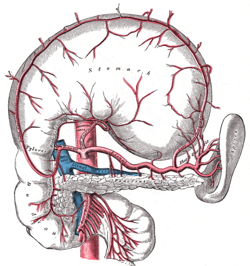
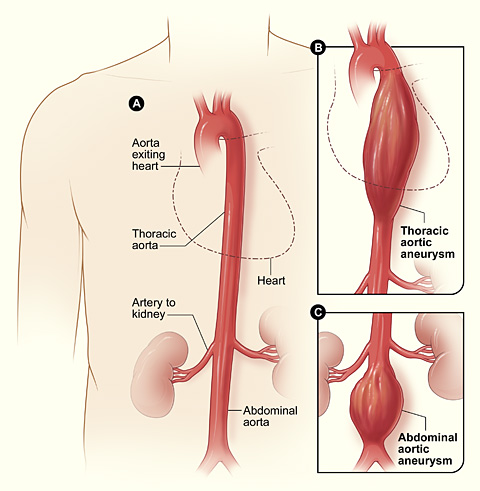
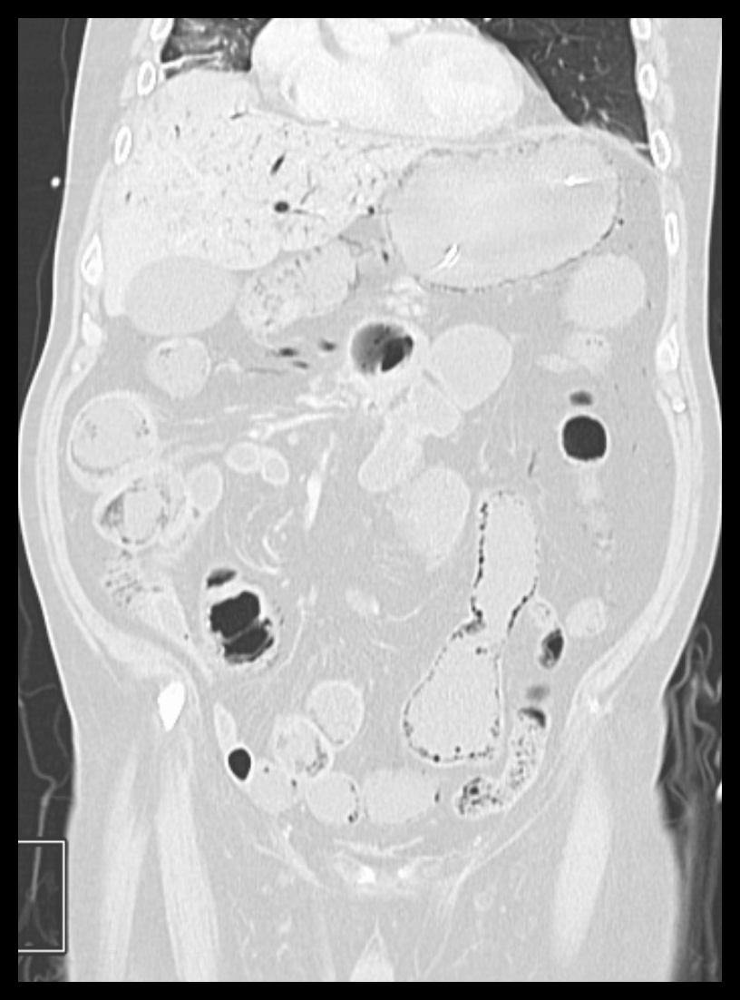

# ISQUEMIA MESENTÉRICA

A isquemia mesentérica ocorre quando há redução crítica do fluxo sanguíneo intestinal. O ponto central para prova é reconhecer cedo a **isquemia mesentérica aguda (IMA)**, pois o quadro inicial pode ter poucos achados ao exame físico, mas evolui rapidamente para necrose intestinal, sepse e óbito.

A apresentação clássica é:

- Idoso com fibrilação atrial, doença aterosclerótica ou choque.

- **Dor abdominal intensa e desproporcional ao exame físico**.

- Abdome inicialmente flácido, sem peritonite.

- Peritonite, acidose importante, lactato elevado e instabilidade sugerem fase avançada, com provável necrose transmural.

## Anatomia vascular essencial

A aorta abdominal emite três ramos viscerais ímpares principais:

- **Tronco celíaco:** irriga o intestino anterior, incluindo estômago, fígado, baço, pâncreas e duodeno proximal. Seus ramos clássicos são a gástrica esquerda, a esplênica e a hepática comum.

- **Artéria mesentérica superior (AMS):** principal artéria envolvida na IMA. Irriga do duodeno distal até os 2/3 proximais do cólon transverso.

- **Artéria mesentérica inferior (AMI):** irriga o terço distal do cólon transverso, cólon descendente, sigmoide e reto superior.

Pontos anatômicos muito cobrados:

- **Artéria gastroduodenal:** não vem da AMS. É ramo da artéria hepática comum, derivada do tronco celíaco.

- **Arco de Riolan:** anastomose entre a artéria cólica média, ramo da AMS, e a artéria cólica esquerda, ramo da AMI.

- **Ponto de Griffith:** região do ângulo esplênico, área de circulação mais vulnerável, associada à colite isquêmica.

- **Ponto de Sudeck:** transição retossigmoide, outro território de risco para isquemia colônica.

- **Veia porta:** formada pela união da veia mesentérica superior com a veia esplênica. A veia mesentérica inferior geralmente drena para a veia esplênica.

## Isquemia mesentérica aguda

A IMA deve ser suspeitada diante de dor abdominal intensa, especialmente em pacientes com fatores de risco cardiovasculares. As principais causas são embolia arterial, trombose arterial, isquemia não oclusiva e trombose venosa mesentérica.

| Causa | Perfil típico | Mecanismo | Conduta principal |
| --- | --- | --- | --- |
| **Embolia arterial** | Fibrilação atrial, IAM recente, valvopatia | Êmbolo impacta geralmente na AMS | Revascularização, frequentemente embolectomia |
| **Trombose arterial** | Aterosclerose, tabagismo, doença vascular periférica | Trombose sobre estenose crônica, geralmente no óstio da AMS | Revascularização endovascular ou cirúrgica |
| **Isquemia não oclusiva (NOMI)** | Choque, baixo débito, vasopressores, UTI | Vasoconstrição e hipoperfusão mesentérica | Corrigir causa, otimizar perfusão e considerar vasodilatador intra-arterial |
| **Trombose venosa mesentérica** | Trombofilias, cirrose, neoplasia, pancreatite, infecção intra-abdominal | Obstrução da drenagem venosa | Anticoagulação; cirurgia se necrose ou peritonite |

## Quadro clínico

O sinal mais característico da IMA é a **dor desproporcional ao exame físico**. No início, o paciente pode ter dor intensa, náuseas, vômitos ou diarreia, mas sem defesa abdominal importante.

Achados tardios sugerem necrose intestinal:

- Peritonite.

- Febre.

- Choque.

- Acidose metabólica.

- Lactato elevado.

- Hematoquezia.

- Pneumatose intestinal ou gás portal na imagem.

Lactato normal não exclui IMA. Não se deve esperar alteração laboratorial importante para solicitar imagem quando a suspeita clínica é alta.

## Diagnóstico

O exame de escolha na suspeita de IMA é a **angio-TC de abdome e pelve com contraste**, preferencialmente com fase arterial e venosa. Ela avalia a oclusão vascular, a perfusão intestinal e sinais de sofrimento de alça.

Achados possíveis na angio-TC:

- Falha de enchimento arterial ou venosa.

- Espessamento ou adelgaçamento de alças.

- Redução ou ausência de realce da parede intestinal.

- Pneumatose intestinal.

- Gás no sistema porta.

- Líquido livre.

- Pneumoperitônio, quando há perfuração.

A arteriografia seletiva perdeu espaço como exame diagnóstico inicial, mas pode ter papel terapêutico, especialmente na isquemia não oclusiva, com infusão intra-arterial de vasodilatadores.

## Tratamento da isquemia mesentérica aguda

O tratamento deve ser iniciado assim que houver suspeita forte, sem aguardar necrose estabelecida.

Medidas iniciais:

- Jejum.

- Reposição volêmica vigorosa.

- Correção de distúrbios hidroeletrolíticos e acidose.

- Antibiótico de amplo espectro.

- Anticoagulação com heparina, se não houver contraindicação.

- Evitar ou reduzir vasopressores quando possível, especialmente na suspeita de NOMI.

- Avaliação precoce por cirurgia vascular, cirurgia geral e radiologia intervencionista.

A presença de **peritonite, perfuração, sepse grave ou necrose intestinal suspeita** indica laparotomia de urgência.

Condutas por causa:

- **Embolia de AMS:** embolectomia, classicamente com cateter de Fogarty, associada à avaliação das alças.

- **Trombose arterial:** revascularização por técnica endovascular, bypass ou tromboendarterectomia, conforme anatomia e gravidade.

- **NOMI:** tratar choque ou baixo débito, reduzir vasoconstritores quando possível e considerar papaverina intra-arterial. Cirurgia é indicada se houver necrose, perfuração ou peritonite.

- **Trombose venosa mesentérica:** anticoagulação é o tratamento principal. Cirurgia fica reservada para peritonite, necrose, perfuração ou piora clínica apesar do tratamento.

Após revascularização, o cirurgião avalia a viabilidade intestinal. Alças necrosadas devem ser ressecadas. Quando houver dúvida sobre a viabilidade, é comum programar **second look** em 24 a 48 horas.

## Isquemia mesentérica crônica

A isquemia mesentérica crônica, ou angina mesentérica, ocorre por estenose aterosclerótica progressiva das artérias viscerais. Como há circulação colateral importante, os sintomas costumam aparecer quando há acometimento significativo de pelo menos dois vasos principais.

Tríade clássica:

- Dor abdominal pós-prandial.

- Medo de comer.

- Perda ponderal.

A dor geralmente começa 15 a 30 minutos após as refeições e leva o paciente a reduzir a ingesta alimentar.

O diagnóstico é feito com angio-TC, angio-RM ou estudo vascular direcionado. O tratamento é revascularização, geralmente endovascular quando viável. Cirurgia aberta permanece opção em pacientes selecionados, especialmente com anatomia desfavorável ou falha do tratamento endovascular.

## Colite isquêmica

A colite isquêmica é a forma mais comum de isquemia intestinal, mas não deve ser confundida com IMA. Em geral, acomete o cólon, especialmente áreas de circulação vulnerável, como o ângulo esplênico e a transição retossigmoide.

Quadro típico:

- Idoso ou paciente com doença vascular.

- Episódio de hipotensão, desidratação, baixo fluxo ou uso de fármacos vasoconstritores.

- Dor abdominal em cólica, frequentemente no lado esquerdo.

- Urgência evacuatória.

- Diarreia sanguinolenta ou hematoquezia.

Na maioria dos casos, o tratamento é conservador:

- Jejum ou dieta conforme gravidade.

- Hidratação.

- Correção do fator desencadeante.

- Analgesia.

- Antibiótico em casos moderados a graves.

A colonoscopia ajuda no diagnóstico em pacientes estáveis e sem sinais de perfuração. A cirurgia é indicada se houver peritonite, gangrena, perfuração, instabilidade persistente ou colite fulminante.

## Síndrome da artéria mesentérica superior

A síndrome da artéria mesentérica superior, ou síndrome de Wilkie, não é isquemia. Trata-se de compressão da terceira porção do duodeno entre a aorta e a AMS, geralmente após perda ponderal importante.

Manifestações:

- Plenitude pós-prandial.

- Náuseas e vômitos.

- Dor epigástrica.

- Perda de peso.

O diagnóstico pode ser feito por TC contrastada ou estudo contrastado do trato gastrointestinal alto. O tratamento inicial é nutricional, com recuperação ponderal. Casos refratários podem exigir cirurgia, como duodenojejunostomia.

## Consequências da ressecção intestinal

A ressecção extensa de intestino delgado pode causar síndrome do intestino curto, com diarreia, desnutrição e distúrbios hidroeletrolíticos.

Pontos importantes:

- **Íleo terminal:** absorve vitamina B12 e sais biliares. Sua ressecção pode causar deficiência de B12, diarreia por sais biliares, esteatorreia e maior risco de cálculos biliares e renais.

- **Duodeno e jejuno proximal:** importantes para absorção de ferro, cálcio e folato.

- **Cólon preservado:** melhora a absorção de água e energia por fermentação de carboidratos não absorvidos.

## Diagnósticos diferenciais no abdome agudo vascular

Na suspeita de IMA, considerar também:

- Aneurisma de aorta roto: dor abdominal ou lombar, hipotensão e massa pulsátil.

- Pancreatite aguda: dor epigástrica em faixa e elevação de lipase.

- Perfuração de víscera oca: dor súbita, peritonite e pneumoperitônio.

- Obstrução intestinal: distensão, vômitos e parada de eliminação de gases e fezes.

- Colecistite, apendicite e diverticulite, conforme localização da dor.

## Pontos-chave para prova

- Dor abdominal intensa e desproporcional ao exame físico em idoso com fibrilação atrial sugere IMA por embolia até prova em contrário.

- O exame inicial de escolha é a angio-TC de abdome e pelve com contraste.

- Lactato elevado é sinal de gravidade, mas pode ser normal no início.

- Peritonite indica provável necrose intestinal e necessidade de laparotomia.

- Embolia arterial costuma ter início súbito e dramático.

- Trombose arterial costuma ocorrer em paciente com aterosclerose e história prévia de dor pós-prandial.

- NOMI ocorre em choque, baixo débito cardíaco ou uso de vasopressores.

- Trombose venosa mesentérica é tratada inicialmente com anticoagulação, salvo sinais de necrose ou peritonite.

- Colite isquêmica costuma cursar com dor em cólica e diarreia sanguinolenta, geralmente com evolução menos grave que a IMA.

- Angina mesentérica crônica causa dor pós-prandial, medo de comer e emagrecimento.

- O second look em 24 a 48 horas é importante quando há dúvida sobre a viabilidade intestinal.

- A veia porta é formada pela veia mesentérica superior e pela veia esplênica.

- A AMS irriga do duodeno distal até os 2/3 proximais do cólon transverso.

- O íleo terminal é essencial para absorção de vitamina B12 e sais biliares.

 Cópia offline para consulta pessoal.
 Fonte original:
 [https://www.medevo.com.br/material-apoio/ler/47dd6788-0955-4622-a8d1-1bc9d0d991f4](https://www.medevo.com.br/material-apoio/ler/47dd6788-0955-4622-a8d1-1bc9d0d991f4)
