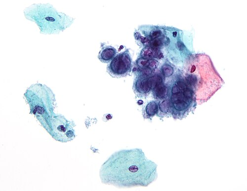
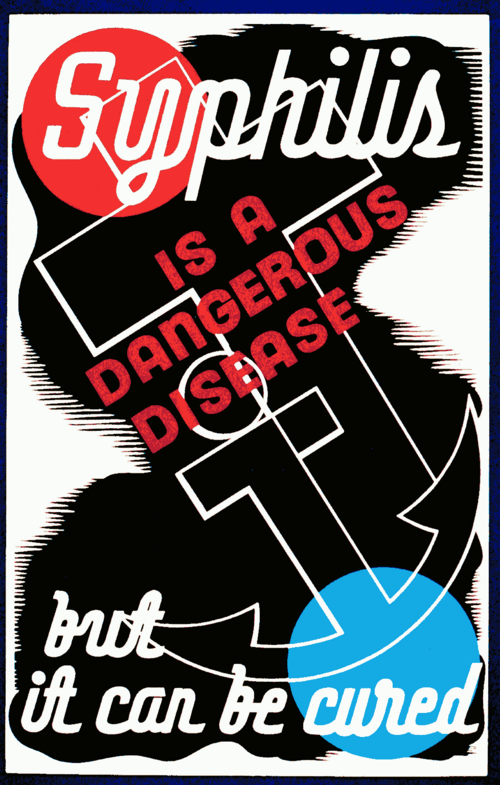

# ISTS DO TRATO GENITAL INFERIOR, CERVICITES E ÚLCERAS GENITAIS

Para entender as Infecções Sexualmente Transmissíveis (ISTs), você precisa parar de tentar decorar uma lista de nomes e começar a pensar como o Ministério da Saúde e as bancas de residência pensam: através da abordagem sindrômica. No Brasil, o manejo das ISTs é desenhado para que o médico trate o paciente na primeira consulta, sem necessariamente esperar por exames laboratoriais que podem demorar semanas. Se você deixar o paciente sair do consultório apenas com um pedido de exame, ele pode nunca mais voltar e continuar transmitindo a infecção.

## O Conceito da Abordagem Sindrômica

Por que tratamos de forma empírica? Porque a sensibilidade dos testes rápidos ou da clínica isolada para diferenciar, por exemplo, uma cervicite por clamídia de uma por gonococo é baixa. Ao agrupar os sintomas em síndromes (Úlcera Genital, Descarga Uretral, Fluxo Vaginal, Dor Pélvica), garantimos a cobertura dos agentes mais prováveis.

Aqui no MedEvo, sempre reforçamos que a prova vai testar se você sabe quando "atirar para todos os lados" (tratamento sindrômico) e quando ser específico (após resultados de exames).

*Figura 1 - Alterações citopáticas do vírus herpes simples (HSV) em exame de Papanicolaou: multinucleação e moldagem nuclear são achados característicos desta IST. Fonte: Nephron, CC BY-SA 3.0 | Wikimedia Commons*

## Cervicites: O Perigo Silencioso

A cervicite é a inflamação do epitélio colunar da ectocérvice e da endocérvice. O grande problema aqui é que a maioria das mulheres é assintomática. Quando os sintomas aparecem, o quadro clássico é de corrimento vaginal mucopurulento, colo friável (que sangra ao toque ou na coleta de citopatológico) e a famosa sinusorragia (sangramento pós-coito).

### Agentes Etiológicos e Fisiopatologia

Os dois grandes protagonistas são a *Chlamydia trachomatis* e a *Neisseria gonorrhoeae*.

A Clamídia é um parasita intracelular obrigatório. Isso explica por que ela não cresce em meios de cultura comuns e por que o tratamento precisa de antibióticos que penetrem bem na célula. Ela tem um tropismo especial pelo epitélio colunar. Já o Gonococo é um diplococo Gram-negativo que adora ambientes úmidos e mucosas.

Um erro comum em provas é achar que toda cervicite causa dor abdominal. Se houver dor à mobilização do colo ou dor anexial, você já saiu da cervicite e entrou na Doença Inflamatória Pélvica (DIP). A cervicite é uma infecção do trato genital inferior.

### Diagnóstico e Pérolas de Exame Físico

Ao exame especular, você verá a saída de secreção purulenta pelo orifício externo do colo. Se você passar um swab e ele vier com pus, ou se o colo sangrar facilmente ao toque do swab (friabilidade), o diagnóstico clínico de cervicite está feito.

Dica de prova: Se a questão descreve uma mulher jovem, tabagista, com sangramento intermenstrual ou sinusorragia, pense imediatamente em Clamídia. O tabagismo altera a imunidade local e facilita a colonização por esse agente.

### Tratamento das Cervicites

Segundo o Protocolo Clínico e Diretrizes Terapêuticas (PCDT) do Ministério da Saúde, o tratamento deve cobrir Clamídia e Gonococo simultaneamente.

- Ceftriaxona 500 mg, IM, dose única (para o Gonococo).

- Azitromicina 1g, VO, dose única (para a Clamídia).

Por que os dois? Porque a coinfecção é extremamente comum (cerca de 20 a 30% dos casos) e o uso da Azitromicina ajuda a prevenir a resistência do gonococo à Ceftriaxona.

Cuidado: A Doxiciclina 100 mg, VO, 12/12h por 7 dias é uma alternativa à Azitromicina para Clamídia, mas é contraindicada em gestantes. Na gestação, a Azitromicina é a droga de escolha.

| Agente | Tratamento de Escolha | Alternativa |
| --- | --- | --- |
| N. gonorrhoeae | Ceftriaxona 500mg IM | Ciprofloxacino 500mg VO (se sensibilidade conhecida) |
| C. trachomatis | Azitromicina 1g VO | Doxiciclina 100mg 12/12h por 7 dias |

*Figura 2 - Campanha histórica de saúde pública sobre sífilis: as ISTs ulcerativas como sífilis, cancro mole e herpes genital são causa frequente de consulta e tema recorrente em provas. Fonte: Erik Hans Krause/WPA, Domínio Público | Wikimedia Commons*

## Úlceras Genitais: O Diagnóstico Diferencial é a Chave

As úlceras são o pesadelo de muitos estudantes, mas existe uma lógica. Você deve dividir as úlceras em dois grandes grupos: as dolorosas e as indolores.

### Sífilis (O Cancro Duro)

Causada pelo *Treponema pallidum*. A lesão da sífilis primária (cancro duro) é classicamente uma úlcera única, de base limpa, bordas endurecidas e, o mais importante, indolor. Ela desaparece sozinha em algumas semanas, o que faz o paciente achar que está curado, quando na verdade a bactéria está se disseminando.

Diagnóstico de Sífilis:
Aqui as bancas fazem a festa. Você precisa entender a diferença entre testes treponêmicos (FTA-ABS, Teste Rápido) e não treponêmicos (VDRL).

- O VDRL serve para seguimento. Ele titula (1:2, 1:4, 1:32).

- O teste treponêmico é o primeiro a positivar e geralmente fica positivo para o resto da vida (cicatriz sorológica).

Se o VDRL for reagente e o FTA-ABS for não reagente, temos um falso-positivo. Isso acontece em doenças autoimunes, idosos e outras infecções. Se ambos forem reagentes, o diagnóstico está confirmado.

Tratamento da Sífilis (PCDT 2020/2024):

- Sífilis Primária, Secundária ou Latente Recente (menos de 1 ano): Penicilina Benzatina 2,4 milhões UI, IM, dose única.

- Sífilis Latente Tardia (mais de 1 ano ou tempo ignorado) ou Terciária: Penicilina Benzatina 2,4 milhões UI, IM, semanal, por 3 semanas (total 7,2 milhões UI).

Na gestação, a Penicilina é a ÚNICA opção aceitável. Se a gestante for alérgica, ela deve ser dessensibilizada em ambiente hospitalar. Qualquer outro tratamento (como Azitromicina ou Ceftriaxona) na gestante é considerado tratamento inadequado para o feto, e o recém-nascido será investigado para sífilis congênita.

### Cancro Mole (Cancroide)

Causado pelo *Haemophilus ducreyi*. Ao contrário da sífilis, aqui a dor é o sintoma cardeal. São úlceras múltiplas, com fundo sujo (purulento) e bordas irregulares. É o "cancro que dói e que suja". Frequentemente acompanha-se de linfadenopatia inguinal que pode fistulizar por um único orifício.

Tratamento: Azitromicina 1g, VO, dose única.

### Herpes Genital

Causada pelo Herpes Simplex Vírus (HSV-2 principalmente). O quadro clínico é de pequenas vesículas agrupadas sobre base eritematosa ("cacho de uvas") que se rompem e formam úlceras rasas e muito dolorosas.

A primoinfecção costuma ser mais grave, com sintomas sistêmicos (febre, mal-estar). O vírus fica latente nos gânglios nervosos e reativa em períodos de estresse ou baixa imunidade.

Tratamento: Aciclovir 400 mg, 3x ao dia, por 7 a 10 dias na primoinfecção. Nas recorrências, o tratamento pode ser de 5 dias.

Atenção para a Gestante: Se houver lesão ativa de herpes no momento do parto, a indicação é de Cesariana. Se a paciente tem história de herpes recorrente, iniciamos profilaxia com Aciclovir a partir da 36ª semana para evitar lesões no parto.

### Linfogranuloma Venéreo (LGV)

Causado pelos sorotipos L1, L2 e L3 da *Chlamydia trachomatis*. A úlcera inicial é fugaz e muitas vezes nem é notada. O paciente chega com o "bubão inguinal", uma linfadenopatia dolorosa que pode fistulizar por vários orifícios (aspecto de "regador"). Em HSH (homens que fazem sexo com homens), pode se manifestar como proctite hemorrágica.

Tratamento: Doxiciclina 100 mg, 12/12h, por 21 dias.

### Donovanose

Causada pela *Klebsiella granulomatis*. É uma úlcera crônica, indolor, de crescimento lento, com aspecto de "carne vermelha" (tecido de granulação exuberante). Não costuma ter linfadenopatia. No diagnóstico, procuramos pelos corpúsculos de Donovan na biópsia ou esfregaço.

Tratamento: Azitromicina 1g por semana por 3 semanas ou até a cicatrização completa.

| Doença | Agente | Úlcera | Adenopatia |
| --- | --- | --- | --- |
| Sífilis | T. pallidum | Única, limpa, indolor, dura | Indolor, não fistuliza |
| Cancro Mole | H. ducreyi | Múltiplas, sujas, dolorosas | Dolorosa, fistuliza (1 orifício) |
| Herpes | HSV | Vesículas, rasas, dolorosas | Dolorosa, não fistuliza |
| LGV | C. trachomatis (L) | Fugaz, pequena | Dolorosa, fistuliza (vários orifícios) |
| Donovanose | K. granulomatis | Crônica, vermelha, indolor | Rara |

## HPV e Verrugas Genitais

O Papilomavírus Humano (HPV) é a ==IST mais comum do mundo==. Existem mais de ==200 tipos==, mas para a prova, você precisa focar em dois grupos:

- ==Baixo Risco (6 e 11):== Causam os ==condilomas acuminados (verrugas)==. Não têm potencial oncogênico.

- ==Alto Risco (16 e 18):== Estão relacionados ao ==câncer de colo de útero,== vulva, vagina, ânus e orofaringe.

### Diagnóstico do HPV

O diagnóstico do condiloma é CLÍNICO. Você olha e vê a ==lesão em "couve-flor".==
Muitos alunos erram ao achar que o teste do ==ácido acético== 5% serve para tratar. Não! O ácido acético serve para ==evidenciar lesões== subclínicas (que ficam brancas), auxiliando na biópsia ou na colposcopia, mas tem muitos falsos-positivos.

Se a ==lesão for atípica==, pigmentada, endurecida ou não responder ao tratamento, a ==biópsia é obrigatória== para excluir neoplasia intraepitelial ou carcinoma.

### Tratamento do Condiloma

O objetivo é destruir a lesão. O vírus em si permanece no corpo.

- Ácido Tricloroacético (ATA) 80-90%: Aplicado pelo médico semanalmente. Pode ser usado em gestantes.

- Podofilina: Aplicada pelo médico. CONTRAINDICADA em gestantes (teratogênica).

- Imiquimod: Aplicado pelo paciente. Ótimo para imunomodulação, mas caro.

- Métodos Cirúrgicos (Cauterização, Laser, Excisão): Indicados para lesões extensas ou em pacientes imunossuprimidos.

Lembre-se: Em crianças com condiloma, a suspeita de abuso sexual deve ser sempre levantada, embora a transmissão vertical ou fômites sejam descritas. A notificação é obrigatória.

## Corrimentos Vaginais: O Diagnóstico Diferencial Essencial

Embora nem todo corrimento seja uma IST (como a vaginose e a candidíase), eles caem juntos nas questões de IST. Como o Dr. Will sempre diz, o segredo aqui é o pH e o teste das aminas (Whiff test).

-

Vaginose Bacteriana (*Gardnerella vaginalis*): Não é considerada estritamente uma IST, mas um desequilíbrio da flora. O pH é > 4,5. O teste das aminas é positivo (cheiro de peixe podre ao adicionar KOH). No microscópio, vemos as *clue cells* (células alvo). Tratamento: Metronidazol. Não precisa tratar o parceiro.

-

Tricomoníase (*Trichomonas vaginalis*): É uma IST. O corrimento é amarelo-esverdeado, bolhoso, com colo em "framboesa" (colpite focal). O pH também é > 4,5. Tratamento: Metronidazol 2g VO dose única. AQUI É OBRIGATÓRIO TRATAR O PARCEIRO.

-

Candidíase (*Candida albicans*): Não é IST. Corrimento em nata de leite, prurido intenso. O pH é ÁCIDO (< 4,5). Isso é uma pegadinha clássica: a cândida é a única que mantém o pH baixo. Tratamento: Antifúngicos (Fluconazol, Miconazol).

## Situações Especiais e Manejo de Parceiros

Um dos maiores erros na prática e em provas é esquecer do parceiro.

- Na Sífilis: O parceiro deve ser tratado sempre, mesmo com exames negativos, se o contato foi recente.

- Na Tricomoníase e Cervicites: O parceiro deve ser tratado empiricamente.

- Na Vaginose e Candidíase: Não se trata o parceiro (a menos que ele tenha sintomas, no caso da cândida).

### Violência Sexual

Diante de um caso de violência sexual, o tratamento é profilático e imediato. Não esperamos exames.
O "kit" de profilaxia inclui:

- HIV: Antirretrovirais por 28 dias (iniciar em até 72h).

- Sífilis: Penicilina Benzatina 2,4 milhões UI IM.

- Gonococo/Clamídia: Ceftriaxona 500mg IM + Azitromicina 1g VO.

- Tricomoníase: Metronidazol 2g VO.

- Hepatite B: Vacina e Imunoglobulina (se não vacinado).

- Contracepção de emergência (Levonorgestrel 1,5mg).

## Hidradenite Supurativa: O Diagnóstico Diferencial "Pegadinha"

Muitas vezes a prova descreve uma paciente com abscessos recorrentes na virilha e axila, que deixam cicatrizes em cordão e fístulas. O aluno afoito marca LGV ou Donovanose. Cuidado! Se a história fala em recorrência crônica, tabagismo e obesidade, sem relação clara com contato sexual recente, pense em Hidradenite Supurativa. É uma doença inflamatória das glândulas apócrinas, não uma IST.

## Infecção Urinária e ISTs

Em mulheres jovens, a disúria pode ser sintoma tanto de cistite quanto de uretrite/cervicite. Se a paciente tem disúria, mas a urina 1 é normal e não há crescimento bacteriano na cultura, você deve investigar Clamídia. A "piúria estéril" é uma dica clássica para infecção por Clamídia no trato urinário.

Para cistite aguda não complicada em mulheres, a primeira escolha atual é a Fosfomicina 3g em dose única ou Nitrofurantoína por 5 dias.

## Pontos-Chave para Prova

- Ácido Acético 5% NÃO trata HPV; ele serve para diagnóstico de lesões subclínicas.

- Sinusorragia (sangramento pós-coito) em jovem é Clamídia até que se prove o contrário.

- O tratamento da Sífilis na gestante só é adequado se feito com Penicilina, finalizado 30 dias antes do parto e com queda documentada dos títulos do VDRL.

- Parceiro de paciente com Vaginose Bacteriana NÃO precisa de tratamento.

- Parceiro de paciente com Tricomoníase DEVE ser tratado (2g de Metronidazol).

- O pH vaginal na Candidíase é < 4,5 (ácido), enquanto na Vaginose e Tricomoníase é > 4,5.

- Cancro Mole: Múltiplo, Doloroso, fundo Sujo (Haemophilus ducreyi).

- Cancro Duro (Sífilis): Único, Indolor, fundo Limpo (Treponema pallidum).

- A profilaxia pós-exposição (PEP) para HIV deve ser iniciada preferencialmente nas primeiras 2 horas, com limite de 72 horas.

- Amamentação é contraindicação ABSOLUTA no Brasil para mães HIV+, independentemente da carga viral.

- Na sífilis primária, o VDRL pode ser negativo (janela imunológica). Na dúvida, repita ou use teste treponêmico.

- O tratamento da cervicite pelo Ministério da Saúde é Ceftriaxona 500mg IM + Azitromicina 1g VO.

- Úlceras que fistulizam por vários orifícios (aspecto de regador) = Linfogranuloma Venéreo.

- Úlceras que fistulizam por um único orifício com flutuação = Cancro Mole.

- Gestante com herpes genital ativo no trabalho de parto = Indicação de Cesariana.

- Podofilina é contraindicada na gestação; usar ATA ou métodos físicos.

- 💡 Lembre-se: O diagnóstico de condiloma é visual/clínico. A citologia (Papanicolau) serve para rastreio de lesões precursoras de câncer, não para verruga.

 Cópia offline para consulta pessoal.
 Fonte original:
 [https://www.medevo.com.br/material-apoio/ler/d36fc083-0048-4b7f-8604-78bf59169644](https://www.medevo.com.br/material-apoio/ler/d36fc083-0048-4b7f-8604-78bf59169644)
